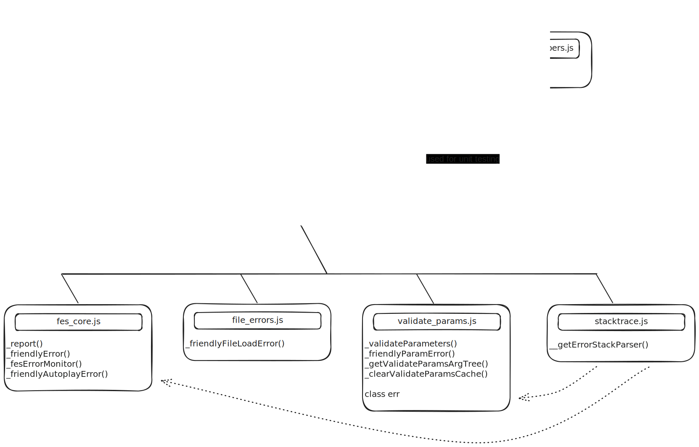

{/* 友好错误系统代码库概述和开发者参考。 */}


`core/friendly_errors`文件夹包含了p5js的友好错误系统(FES)代码，该系统负责生成友好错误消息或友好错误。您可能已经在控制台中看到以"`🌸 p5.js says:`"开头的友好错误消息，这些消息是对默认浏览器生成的错误消息的补充。

FES包含多个负责生成不同类型错误的友好错误消息的函数。这些函数从各种位置收集错误，包括文件加载错误和自动播放错误的错误处理，库内的参数检查，以及p5.js贡献者实现的其他自定义错误处理。

本文档首先概述了FES的主要函数及其位置。在随后的参考部分，您将找到有关这些单独函数的完整信息（描述、语法、参数、位置）。在文档的最后部分，您将找到我们以前的贡献者的笔记（开发笔记），概述了FES的已知限制和可能的未来方向。如果您正在考虑为FES做贡献，请查看[开发笔记](#-开发笔记/)！

## 概述

生成友好错误消息的主要函数是：

* `p5._friendlyError()`：将输入消息格式化并打印（通过`_report()`）为友好错误
* `p5._validateParameters()`：验证接收到的输入值是否有错误类型或缺少值
* `p5._friendlyFileLoadError()`：指导用户解决与文件加载函数相关的错误
* `p5._friendlyAutoplayError()`：指导用户解决与浏览器自动播放策略相关的错误

以下是一个图表，概述了FES中所有函数的位置以及它们如何相互连接：



各个文件包含以下主要FES函数：

* `fes_core.js`：包含`_report()`、`_friendlyError()`和`_friendlyAutoplayError()`，以及用于格式化和测试友好错误的其他辅助函数。
* `validate_params.js`：包含`_validateParameters()`以及用于参数验证的其他辅助函数。
* `file_errors.js`：包含`_friendlyFileLoadError()`和用于文件加载错误的其他辅助函数。
* `browser_errors.js`：包含将使用FES全局错误类（`fes.globalErrors`）生成的浏览器错误列表。
* `stacktrace.js`：包含解析错误堆栈的代码（借用自[stacktrace.js](https://github.com/stacktracejs/stacktrace.js)）。

## 📚 参考：FES函数

### `_report()`

#### 描述

`_report()`是直接将错误辅助消息输出到控制台的主要函数。

\*\*注意：\*\*如果设置了`p5._fesLogger`（即，我们正在运行测试），则将使用它代替`console.log`。这在我们通过Mocha运行测试时非常有用。在这种情况下，`_fesLogger`将让`_report`将错误消息作为字符串传递给Mocha，该字符串将与断言的字符串进行测试。

#### 语法

```js
_report(message);

_report(message, func);

_report(message, func, color);
```

#### 参数

```
@param  {String}        message   要打印的消息
@param  {String}        [func]    函数名称
@param  {Number|String} [color]   CSS颜色代码
```

`[func]`输入用于在错误消息末尾附加参考链接。

`[color]`输入用于设置错误消息的颜色属性。这在当前版本的友好错误消息中未使用。

#### 位置

core/friendly\_errors/fes\_core.js

### `_friendlyError()`

#### 描述

`_friendlyError()`创建并打印友好错误消息。任何p5函数都可以调用此函数来提供友好错误消息。

`_friendlyFileLoadError()`位于以下函数内：

* `image/loading_displaying/loadImage()`
* `io/files/loadFont()`
* `io/files/loadTable()`
* `io/files/loadJSON()`
* `io/files/loadStrings()`
* `io/files/loadXML()`
* `io/files/loadBytes()`。

对`_friendlyFileLoadError`的调用序列看起来像这样：

```
_friendlyFileLoadError
  _report
```

#### 语法

```js
_friendlyFileLoadError(errorType, filePath);
```

#### 参数

```
@param  {Number}  errorType   文件加载错误类型的编号
@param  {String}  filePath    导致错误的文件路径
```

`errorType`输入指的是`core/friendly_errors/file_errors.js`中枚举的特定类型的文件加载错误。p5.js中的文件加载错误被分为各种不同的情况。这种分类旨在便于提供与不同错误场景相对应的精确和信息丰富的错误消息。例如，当它无法读取字体文件中的数据时，它可以显示与尝试加载过大无法读取的文件时不同的错误。

#### 示例

文件加载错误示例：

```js
/// 缺少字体文件
let myFont;
function preload() {
  myFont = loadFont('assets/OpenSans-Regular.ttf');
}
function setup() {
  fill('#ED225D');
  textFont(myFont);
  textSize(36);
  text('p5*js', 10, 50);
}
function draw() {}
```

除了浏览器的"不支持"错误外，FES还将在控制台中生成以下消息：

```
🌸 p5.js says: 看起来加载字体时出现了问题。请检查文件路径(assets/OpenSans-Regular.ttf)是否正确，尝试在线托管文件，或运行本地服务器。

+ 更多信息：https://github.com/processing/p5.js/wiki/Local-server
```

#### 位置

/friendly\_errors/file\_errors.js

### `_friendlyAutoplayError()`

#### 描述

如果存在与播放媒体（例如视频）相关的错误，`_friendlyAutoplayError()`会在内部调用，这很可能是由于浏览器的自动播放策略。

它调用`translator()`使用键`fes.autoplay`生成并打印友好错误消息。您可以在`translations/en/translation.json`中查看所有可用的键。

#### 位置

core/friendly\_errors/fes\_core.js

### `_validateParameters()`

#### 描述

`_validateParameters()`通过将输入参数与`docs/reference/data.json`中的信息匹配来运行参数验证，该信息是从函数的内联文档创建的。它检查函数调用是否包含正确数量和正确类型的参数。

它调用`translator()`使用键`fes.friendlyParamError.*`生成并打印友好错误消息。您可以在`translations/en/translation.json`中查看所有可用的键。

可以通过`p5._validateParameters(FUNCT_NAME, ARGUMENTS)`或`p5.prototype._validateParameters(FUNCT_NAME, ARGUMENTS)`在需要参数验证的函数内部调用此函数。建议将静态版本`p5._validateParameters`用于一般用途。`p5.prototype._validateParameters(FUNCT_NAME, ARGUMENTS)`主要用于调试和单元测试。

`_validateParameters()`函数位于这些函数内：

* `accessibility/outputs`
* `color/creating_reading`
* `color/setting`
* `core/environment`
* `core/rendering`
* `core/shape/2d_primitives`
* `core/shape/attributes`
* `core/shape/curves`
* `core/shape/vertex`
* `core/transform`
* `data/p5.TypedDict`
* `dom/dom`
* `events/acceleration`
* `events/keyboard`
* `image/image`
* `image/loading_displaying`
* `image/p5.Image`
* `image/pixel`
* `io/files`
* `math/calculation`
* `math/random`
* `typography/attributes`
* `typography/loading_displaying`
* `utilities/string_functions`
* `webgl/3d_primitives`
* `webgl/interaction`
* `webgl/light`
* `webgl/loading`
* `webgl/material`
* `webgl/p5.Camera`

从`_validateParameters`的调用序列看起来像这样：

```
validateParameters
   buildArgTypeCache
      addType
    lookupParamDoc
    scoreOverload
      testParamTypes
      testParamType
    getOverloadErrors
    _friendlyParamError
      ValidationError
      report
        friendlyWelcome
```

#### 语法

```js
_validateParameters(func, args);
```

#### 参数

```
@param  {String}  func    被调用的函数的名称
@param  {Array}   args    用户输入参数
```

#### 示例

缺少参数的示例：

```js
arc(1, 1, 10.5, 10);
```

FES将在控制台中生成以下消息：

```
🌸 p5.js says: [sketch.js, line 13] arc()至少需要6个参数，但只收到了4个。 (https://p5js.org/reference/p5/arc)
```

类型不匹配的示例：

```js
arc(1, ',1', 10.5, 10, 0, Math.PI);
```

FES将在控制台中生成以下消息：

```
🌸 p5.js says: [sketch.js, line 14] arc()的第一个参数需要Number类型，但收到了string类型。 (https://p5js.org/reference/p5/arc)
```

#### 位置

core/friendly\_errors/validate\_params.js

### `fesErrorMonitor()`

#### 描述

`fesErrorMonitor()`监控浏览器错误消息，猜测错误的来源并为用户提供额外的指导。这包括堆栈跟踪，它是程序中直到抛出错误点为止调用的函数的顺序列表。堆栈跟踪对于确定错误是内部的还是由用户直接调用的某些内容引起的非常有用。

它调用`translator()`使用键`fes.globalErrors.*`生成并打印友好错误消息。您可以在`translations/en/translation.json`中查看所有可用的键。

以下是通过`fesErrorMonitor()`生成的错误消息的综合列表：

* 使用键的友好错误消息：`fes.globalErrors.syntax.*`、`fes.globalErrors.reference.*`、`fes.globalErrors.type.*`。
* 通过`processStack()`使用键的"内部库"错误消息：`fes.wrongPreload`、`fes.libraryError`。
* 通过`printFriendlyStack()`使用键的堆栈跟踪消息：`fes.globalErrors.stackTop`、`fes.globalErrors.stackSubseq`。
* 通过`handleMisspelling()`使用键的拼写检查消息（来自引用错误）：`fes.misspelling`。

`_fesErrorMonitor()`由`window`上的`error`事件和未处理的承诺拒绝（`unhandledrejection`事件）自动触发。但是，可以在catch块中手动调用，如下所示：

```js
try { someCode(); } catch(err) { p5._fesErrorMonitor(err); }
```

该函数目前适用于`ReferenceError`、`SyntaxError`和`TypeError`的子集。您可以在`browser_errors.js`中找到支持的错误的完整列表。

`_fesErrorMonitor`的调用序列大致如下：

```
 _fesErrorMonitor
     processStack
       printFriendlyError
     (if type of error is ReferenceError)
       _handleMisspelling
         computeEditDistance
         _report
       _report
       printFriendlyStack
     (if type of error is SyntaxError、TypeError, etc)
       _report
       printFriendlyStack
```

#### 语法

```js
fesErrorMonitor(event);
```

#### 参数

```
@param {*}  e     错误事件
```

#### 示例

内部错误示例1：

```js
function preload() {
  // 由于在preload中调用background()
  // 导致错误
  background(200);
}
```

FES将在控制台中生成以下消息：

```
🌸 p5.js says: [sketch.js, line 8] 当调用"background"时，p5js库内部发生了一个错误，错误信息为"无法读取未定义的属性（正在读取'background'）"。如果没有特别说明，这可能是由于从preload调用"background"导致的。preload函数中除了加载调用（loadImage、loadJSON、loadFont、loadStrings等）之外，不应该有任何其他内容。 (https://p5js.org/reference/p5/preload)
```

内部错误示例2：

```js
function setup() {
  cnv = createCanvas(200, 200);
  cnv.mouseClicked();
}
```

FES将在控制台中生成以下消息：

```js
🌸 p5.js says: [sketch.js, line 12] 当调用mouseClicked时，p5js库内部发生了一个错误，错误信息为"无法读取未定义的属性（正在读取'bind'）"。如果没有特别说明，这可能是传递给mouseClicked的参数问题。 (https://p5js.org/reference/p5/mouseClicked)
```

错误示例（作用域）：

```js
function setup() {
  let b = 1;
}
function draw() {
  b += 1;
}
```

FES将在控制台中生成以下消息：

```
🌸 p5.js says:

[sketch.js, line 5] 当前作用域中未定义"b"。如果您已在代码中定义了它，应检查其作用域、拼写和大小写（JavaScript区分大小写）。

+ 更多信息：https://p5js.org/examples/data-variable-scope.html
```

错误示例（拼写）：

```js
function setup() {
  xolor(1, 2, 3);
}
```

FES将在控制台中生成以下消息：

```
🌸 p5.js says: [sketch.js, line 2] 您可能不小心写了"xolor"而不是"color"。如果您希望使用p5.js中的函数，请将其更正为color。 (https://p5js.org/reference/p5/color)
```

#### 位置

core/friendly\_errors/fes\_core.js

### `checkForUserDefinedFunctions()`

#### 描述

检查是否有任何用户定义的函数（`setup()`、`draw()`、`mouseMoved()`等）带有大小写错误。

它调用`translator()`使用键`fes.checkUserDefinedFns`生成并打印友好错误消息。您可以在`translations/en/translation.json`中查看所有可用的键。

#### 语法

```js
checkForUserDefinedFunctions(context);
```

#### 参数

```
@param {*} context  当前默认上下文。
                    在"全局模式"下设置为window，
                    在"实例模式"下设置为p5实例
```

#### 示例

```js
function preload() {
  loadImage('myimage.png');
}
```

FES将在控制台中生成以下消息：

```
🌸 p5.js says: 您可能不小心写了preLoad而不是preload。如果这不是有意的，请更正它。 (https://p5js.org/reference/p5/preload)
```

#### 位置

/friendly\_errors/fes\_core.js

### `helpForMisusedAtTopLevelCode()`

#### 描述

`helpForMisusedAtTopLevelCode()`在窗口加载时由`fes_core.js`调用，以检查在`setup()`或`draw()`之外使用p5.js函数的情况。

它调用`translator()`使用键`fes.misusedTopLevel`生成并打印友好错误消息。您可以在`translations/en/translation.json`中查看所有可用的键。

#### 参数

```
@param {*}        err    错误事件
@param {Boolean}  log    false
```

#### 位置

/friendly\_errors/fes\_core.js

## 💌 开发笔记

### 已知限制

#### 假阳性与假阴性情况

在FES中，您可能会遇到两种类型的错误：假阳性和假阴性。把假阳性想象成虚假警报。当FES警告您有错误，但您的代码实际上是正确的时，就会出现这种情况。另一方面，假阴性就像遗漏了一个错误。当您的代码中有错误，但FES没有提醒您时，就会发生这种情况。

识别和修复这些错误很重要，因为它们可以节省调试时间，减少混淆，并使修复实际问题变得更容易。

在某些不理想的情况下，错误处理的设计可能需要选择消除假阳性或假阴性。如果必须选择，通常最好消除假阳性。这样，您可以避免生成可能分散注意力或误导用户的不正确警告。

#### 与`fes.GlobalErrors`相关的限制

FES只能检测到使用`const`或`var`声明的被覆盖的全局变量。使用let声明的变量不会被检测到。这个限制是由于`let`处理变量实例化的特定方式导致的，目前无法解决。

`fesErrorMonitor()`下描述的功能目前仅在Web编辑器上或在本地服务器上运行时有效。有关更多详情，请参见 pull request \[[#4730](https://github.com/processing/p5.js/pull/4730)]。

### FES的性能问题

默认情况下，p5.js启用FES，而在`p5.min.js`中禁用，以防止FES函数减慢进程。错误检查系统可能会显著减慢您的代码（在某些情况下最多慢10倍）。请参见[友好错误性能测试](https://github.com/processing/p5.js-website/tree/main/src/assets/learn/performance/code/friendly-error-system)。

您可以在草图顶部使用一行代码禁用FES：

```js
p5.disableFriendlyErrors = true; // 禁用FES
function setup() {
  // 进行设置操作
}
function draw() {
  // 进行绘制操作
}
```

请注意，此操作将禁用已知会降低性能的FES某些功能，例如参数检查。但是，不影响性能的友好错误消息仍将启用。这包括在文件加载失败时提供详细的错误消息，或者在您尝试覆盖全局空间中的p5.js函数时显示警告。

### 未来工作的想法

* 解耦FES \[[#5629](https://github.com/processing/p5.js/issues/5629)]
* 消除假阳性情况
* 识别假阴性情况
* 添加更多单元测试以获得全面的测试覆盖
* 更直观、清晰且可翻译的消息。关于友好错误国际化的更多讨论，请查看[友好错误i18n手册](https://almchung.github.io/p5-fes-i18n-book/en/)。
* 识别更多常见错误类型并使用FES进行泛化（例如 `bezierVertex()`、`quadraticVertex()` - 必需对象未初始化；检查 `nf()`、`nfc()`、`nfp()`、`nfs()` 的Number参数是否为正）

## 结论

在本README文档中，我们概述了`core/friendly_errors`文件夹的结构。本节解释了这个文件夹的组织和目的，使其更容易导航和理解。此外，对于此文件夹中的每个函数，我们都提供了参考指南。

在本文档的后半部分，我们包含了以前贡献者的笔记，讨论了FES的当前限制和未来开发中可能的改进领域。

此外，我们很高兴通过2021-2022年进行的FES调查分享来自我们社区的见解。调查结果有两种格式可供查阅：

* [21-22 FES调查报告漫画](https://almchung.github.io/p5jsFESsurvey/)
* [21-22 FES调查完整报告](https://observablehq.com/@almchung/p5-fes-21-survey)。

{/* TODO: 当我们发布下面的文章时取消注释 */}

{/* 如果您正在寻找向方法添加友好错误消息的方法，我们建议查看[如何添加友好错误消息](#/)。它将一步步引导您完成向方法添加这些错误消息的过程。 */}
