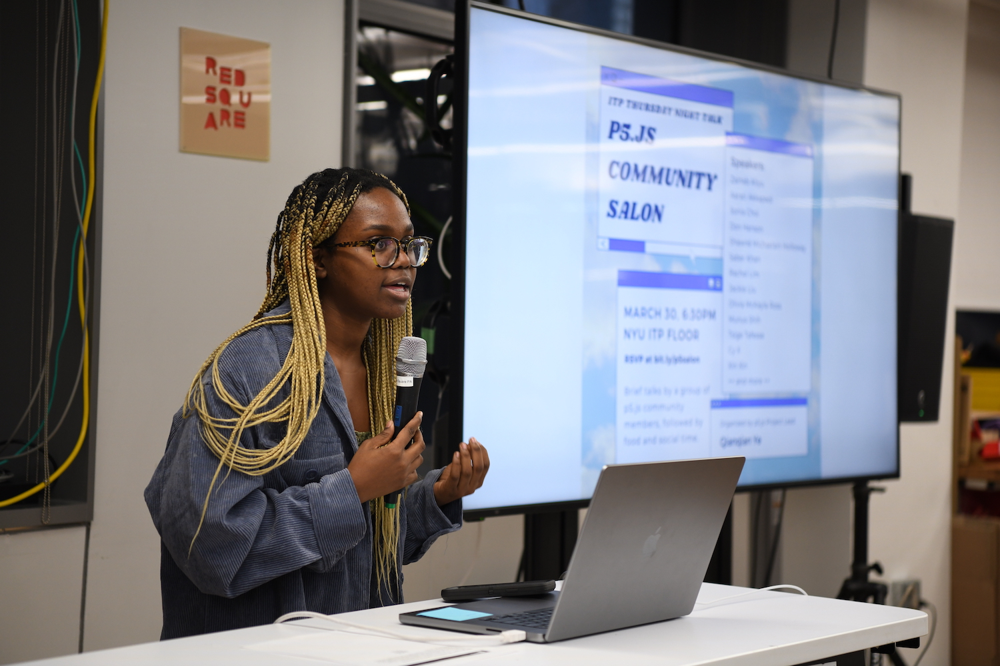

import YouTubeEmbed from '../../../components/YouTubeEmbed/index.astro'
import Logos from '../../../components/Logos/index.astro'

p5.js Community Salon is a public gathering of p5.js community members to share and connect at NYU ITP on Thursday, March 30, 6:30-7:30pm. During the event, a group of speakers will briefly share their work with the community, followed by food and social time. 

## Organizers:
p5.js Community Salon is organized by p5.js Project Lead [Qianqian Ye](https://qianqian-ye.com/), as part of their IMA/ITP Project Fellowship. This event is supported by Sonia Choi, Project and Communications Coordinator at Processing Foundation.

## Speakers:
Zainab Aliyu

Aarati Akkapedi

Sonia Choi

Don Hanson

Shawné Michaelain Holloway

Tsige Tafesse

Rachel Lim

Jackie Liu

Olivia McKayla Ross

Munus Shih

Xin Xin

Lavanya Suresh

### p5.js Community Salon Recap Video Part 1
<YouTubeEmbed id="WYFdZaidHWZ8" />

### p5.js Community Salon Recap Video Part 2
<YouTubeEmbed id="ggU95SHqB-s" />

## Support
This event was supported by NYU IMA/ITP Project Fellowship. 
**Thank you!**

<Logos>
   
</Logos>