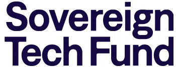

import YouTubeEmbed from '../../../components/YouTubeEmbed/index.astro'
import Logos from '../../../components/Logos/index.astro'

p5.js was selected to receive a total of €450,000 through two rounds of funding from the [Sovereign Tech Fund](https://sovereigntechfund.de/en) to enhance [p5.js Documentation organization & accessibility](https://www.sovereigntechfund.de/tech/p5js). This work is part of the Sovereign Tech Fund’s [Contribute Back to Open Source Challenges](https://sovereigntechfund.de/en/challenges/).

This project addressed the longstanding challenges of scatterness and limited accessibility within the p5.js documentation. The final deliverable includes an updated p5.js website with a focus on accessible, organized, and translated contributor documentation. Additionally, the website features a curated collection of community sketches, an add-ons library, and educational resources.

By providing improved contributor documentation, the project aims to facilitate effective navigation and feature exploration, empowering users to create richer and more innovative projects with p5.js. Furthermore, the improved documentation promotes accessibility and inclusivity, ensuring that people from diverse backgrounds, skill levels, and cultures can engage meaningfully with p5.js.

## Contributors

This project brought together approximately 140 contributors, with 60-75 participating in each round. The team included both experienced and first-time contributors, forming a global group dedicated to writing, translating, designing, engineering, researching, and conducting accessibility reviews.

While open-source contributors typically operate independently, this project fostered collective efforts, encouraging collaboration among individuals with diverse skills and perspectives. This shift towards more collaborative endeavors has led to a more cohesive and synergistic approach to advancing the p5.js project, exemplifying the strength of community-driven initiatives in the open-source landscape.

**Thank you to all the contributors who participated in the two rounds of the p5.js x STF project! Your efforts made this project possible! 💗**

**Thank you to the Processing Foundation for all the administrative support!**

### Round 1
*September 1 to December 31, 2023.*    

#### Internal Team
* Project Lead and Manager: Qianqian Ye
* Doc Lead: Kenneth Lim, Dave Pagurek, Nick McIntyre
* Assistant Project Manager: Karen Abe

#### Website
* Website Designer: Stefanie Tam, Tyler Yin
* Website Developer: Bocoup (cypress masso, Stalgia Grigg, Carmen Cañas, Isaac Durazo)

#### Accessibility
* Consultant: Andy Slater
* Proofreader: Fivver

#### p5.js Definition Workshop Team
* Organizer: Winnie Soon, Koundinya Dhulipalla 
* Facilitator: Yasmine Boudiaf, Jazmin Morris
* 30 x Workshop Participants from UAL CCI community

#### p5.js Examples
* Doc Lead: Caleb Foss
* Writer: Darren Kessner, Kathryn Lichlyter
* Reviewer: Amy Chen, Lance Cole

#### p5.js Tutorials
* Doc Lead: Nick McIntyre
* Writers & Reviewers: Joanne Amarisa, Gregory Benedis-Grab, Christine Belzie, Tristan Bunn, Julien Kris, Ruth Ikegah, Portia Morrell, Jaleesa Trapp, Akanksha Vyas

#### p5.js WebGL Documentation
* Doc Lead: Dave Pagurek
* Reviewer: Adam Ferriss

#### p5.js Contributor Documentation
* Doc Lead: Kenneth Lim
* Writer: Alm Chung
* Reviewer: Tanvi Kumar, Luis Morales-Navarro

#### Community Statement & Code of Conduct
* Writer: Oluwakemi Oritsejafor
* Reviewer: Zainab Aliyu

### Round 2
*January 1 to April 30, 2024.*  

#### Internal Team
* Project Lead and Manager: Qianqian Ye
* Doc Lead: Kenneth Lim, Dave Pagurek
* Project Manager: Karen Abe

#### Website
* Website Designer: Stefanie Tam, Tyler Yin
* Website Developer: Bocoup (cypress masso, Stalgia Grigg, Carmen Cañas, Isaac Durazo)
* Website Copywriter: Sarah Ciston
* p5.js community sketch Curator: Zainab Aliyu
* Special thanks to Sinan Ascioglu from OpenProcessing for supporting the community sketches

#### Translation Team
* Researcher: Koundinya Dhulipalla
* Spanish Translation
    * Steward: Cristian Bañuelos, Sebastián Méndez
    * Contributor: Diana Galindo Clavijo, Xavier Gongora, Marcela Martinez Galvan, Emilio Ocelotl Reyes, S. Marianne Teixido Guzmán
* Chinese Translation
    * Steward: Weijia Li, Miaoye Que
    * Contributor: Chirui Cheng, Lingxiao Wang, Shengnan Li, Angela Rong, Yudi Wu
* Hindi Translation 
    * Steward: Tanvi Kumar, Divyansh Srivastava
    * Contributor: Eshaan Aggarwal, Akash Jaiswalm, Aditya Rana, Sanjay Singh Rajpoot, Surbhi Pittie
* Korean Translation
    * Steward: Inhwa Yeom, Sejin Oh 
    * Contributor: Yewon Jang, Yunyoung Jang, Minwook Park, Sunghun Park, Hyunwoo Rhee

#### Reference Team
* Technical Writer: Nick McIntyre
* Reviewer: Darren Kessner, Layla Quiñones

#### Accessibility Team
* Accessibility Consultant: Nat Decker, thai Lu, Cielo Saucedo, Liam Coleman

#### Writers
* Documentation Revisions Lead: Layla Quiñones
* Revisions Writer: Julien Kris, Ruth Ikegah, Gregory Benedis-Grab, Akanksha Vyas, Kathryn Lichlyter, Kate Machmeyer
* Accessibility Technical Writer: Caleb Foss
* Proofreader: Fivver

## p5.js New Website!
<YouTubeEmbed id="0_r4HSmNb9o" />

## Support

This project  was supported by the Sovereign Tech Fund. The Sovereign Tech Fund (STF) supports the development, improvement, and maintenance of open digital infrastructure in the public interest. Its goal is to strengthen the open source ecosystem sustainably, focusing on security, resilience, technological diversity, and the people behind the code. STF is funded by the German Federal Ministry for Economic Affairs and Climate Action (BMWK) and hosted at and supported by the German Federal Agency for Disruptive Innovation GmbH (SPRIND).

**Thanks STF for supporting the p5.js project!**

## Links

[STF](https://www.sovereigntechfund.de/programs/challenges): Contribute Back to Open-source Challenge

[MEDIUM](https://medium.com/@ProcessingOrg/p5-js-receives-major-funding-from-the-sovereign-tech-fund-bbf61d1171fe): p5.js Receives Major Funding from the Sovereign Tech Fund

<Logos>
    
</Logos>
