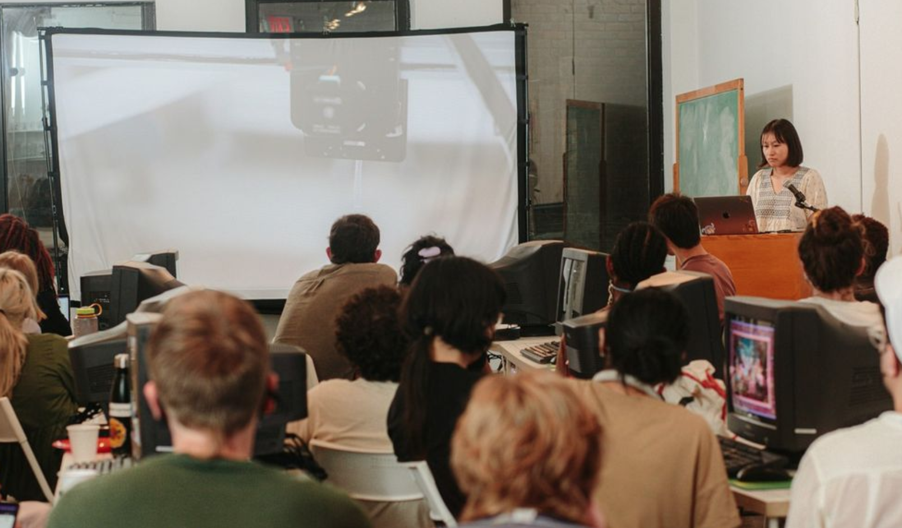

import DonorBoxWidget from "../../../components/DonorBoxWidget/index.astro";

We need your help! p5.js is free, open-source software. We want to make our community as open and inclusive as possible. You can support this work by making a donation to the Processing Foundation, the organization that supports p5.js. Your donation supports software development for p5.js, education resources like code examples and tutorials, Fellowships, and community events.

<DonorBoxWidget />

The Processing Foundation was founded in 2012 after more than a decade of work with the original Processing software. The Foundation’s mission is to promote software literacy within the visual arts, and visual literacy within technology-related fields — and to make these fields accessible to diverse communities. Our goal is to empower people of all interests and backgrounds to learn how to program and make creative work with code, especially those who might not otherwise have access to these tools and resources.
