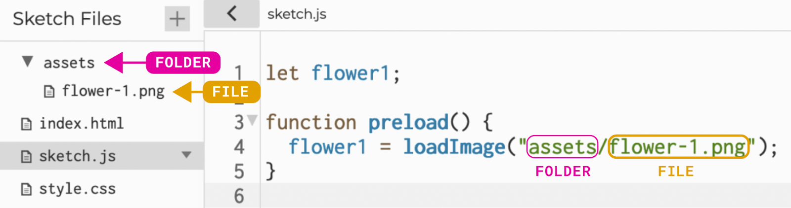

import { Columns, Column } from "../../../components/Columns";
import EditableSketch from "../../../components/EditableSketch/index.astro";
import { Callout } from "../../../components/Callout";

## Introduction

p5.js makes it fun and simple to draw, color and animate shapes on an HTML canvas. It also gives us easy ways to create visuals using media files such as GIFs and still images. 


Image and GIF files contain information that can be used to display or modify them in a p5.js project. In this tutorial you will create an [interactive animation](https://editor.p5js.org/joanneamarisa/sketches/PFmWqy0qB) using media and learn to: 

- Upload and display image files in a p5.js sketch using the [`preload()`](/reference/p5/preload) function and [`p5.Image`](/reference/p5.Image) objects
- Adjust the appearance of image files in p5.js using [`p5.Image`](/reference/p5.Image) methods for sizing, positioning, an styling
- Interact with [`p5.Image`](/reference/p5.Image) objects 
- Create an extra drawing surface using [`createGraphics()`](/reference/p5/createGraphics)
- Save the sketch as a GIF file to your device

Explore [this example](https://editor.p5js.org/joanneamarisa/sketches/PFmWqy0qB) of a finished interactive animation using media objects.

<Columns>
<Column>


</Column>

<Column>


</Column>
</Columns>

### Things you’ll need<a id="things-youll-need"></a>

- A computer with access to the internet
- An account on the  [p5.js Web Editor](https://editor.p5js.org/)
- Four source image files to download for this tutorial: 
  - [Flower 1 (PNG)](/assets/flower-1.png)
  - [Flower 2 (PNG)](/assets/flower-2.png)
  - [Flower 3 (PNG)](/assets/flower-3.png)
  - [Watering can (GIF)](/assets/Water.gif)
- An understanding of concepts that enable simple interactivity and animation in p5.js. These include:
  - variables such as [`mouseX`](/reference/p5/mouseX) and [`mouseY`](/reference/p5/mouseY)
  - functions such as [`mousePressed()`](/reference/p5/mousePressed) or [`keyPressed()`](/reference/p5/keyPressed) 
  - conditional statements
  - creating custom functions with parameters

For more information on these concepts see these tutorials: [Get Started](/tutorials/get-started),  [Variables and Change](/tutorials/variables-and-change), [Conditionals and Interactivity](/tutorials/conditionals-and-interactivity), and [Organizing Code with Functions](/tutorials/organizing-code-with-functions).


## Step 1 – Upload image files to the sketch folder

- Download <a href="#things-youll-need">the three `.png` image files and one .gif file</a> onto your computer. You can also use your own drawings or images, such as from royalty-free image sources such as [Wikimedia Commons](https://commons.wikimedia.org/wiki/Main_Page).
- Open the [p5.js Web Editor](https://editor.p5js.org/) in a browser, name your project “Animating with Media Objects”, and save it to your account.
- Select the arrow next to `sketch.js` on the top left of the Editor. The sketch folder will appear on the left sidebar.
- Click the plus “+” button, and select “*Upload file”*.
- Select the four images from your device and upload them into the sketch folder. You can drag and drop the files into the upload box that appears, or click the box and select files from your computers’ files manager.


#### Image files

Image files store the grid of colored pixels that make up an image. There are a number of different image file types that p5.js can process.. The most common image types are JPEGs, PNGs, or GIFs. You can identify them by the extension found at the end of their filenames: `.jpg`, `.png`, `.gif`.

JPEGs and PNGs are among the most common types of static images, which are images that do not move. JPEGs often refer to photographs, whereas PNGs often refer to graphics and designs, as they support images with transparent backgrounds. The term GIF is widely used for animated images. They contain a series of images that can be displayed as an animation.


## Step 2 – Load the images into the canvas

- Declare four global variables to represent each image: `let flower1, flower2, flower3, water;`
- Define the [`preload()`](/reference/p5/preload) function after global variables are declared, and directly before function `setup()`.
- In the `preload()` function, type in `flower1 = loadImage("flower-1.png");`
  - This loads the image information into memory using the [`loadImage()`](/reference/p5/loadImage) function.
  - The image is assigned to the global variable `flower1`.
  - Repeat this step for all the images.

Your code should look like this:

```js
//Variables for image files.
let flower1;
let flower2;
let flower3;
let water;

function preload() {
  //Load the image files.
  flower1 = loadImage("flower-1.png");
  flower2 = loadImage("flower-2.png");
  flower3 = loadImage("flower-3.png");
  water = loadImage("Water.gif");
}
```

### [`preload()`](/reference/p5/preload)

`preload()` is a function that is automatically called by the p5.js library. It is used to load external files in a sketch allowing the computer time to complete this process before your sketch runs. The `setup()` and `draw()` functions only run once the `preload()` function has completed.


### [`loadImage()`](/reference/p5/loadImage)

`loadImage()` follows a path to an image in its located folder, and loads it into memory as a [`p5.Image`](/reference/p5.Image) object. `p5.Image` is an *object* that stores image information. There are many data types in p5.js including integers, Booleans and strings. Later in this tutorial, we’ll explore together how p5.js functions can use that image data.

To load an image, call `loadImage()` with one string argument containing the filename of the image. For example, `loadImage("flower-1.png");`.

If the image is located in a folder, reference that folder by naming it before the filename, followed by a forward slash “/”. For example, if your image is in a folder called *assets*, you would type: `loadImage("assets/flower-1.png");`



Alternatively, if you load the image from the web, type in the image URL wrapped in quotation marks, such as: `loadImage('https://i.ibb.co/3141Spd/flower-1.png');`

<Callout title="Note">
When using a web-based image, make sure to access it from a secure and trusted server. Be mindful also of any copyright or licensing required to use the image.
</Callout>

Visit the p5.js Reference to learn more about the [`preload()`](/reference/p5/preload)  [`loadImage()`](/reference/p5/loadImage) functions.


## Step 3 – Draw the images onto the canvas

First, let’s display the three static flower images next to each other on a canvas.

- In the `setup()` function, call `imageMode(CENTER)`.
  - As with the `rect()` function, an image’s x- and y-coordinates refer to its top left corner by default. Calling `imageMode(CENTER)` positions the image’s x- and y-coordinates to its center point.
  - See [this example](https://editor.p5js.org/joanneamarisa/sketches/ZjxtRj22k) on how `imageMode()` affects an image’s x- and y-coordinates!
- Place the first flower image onto the canvas by calling `image(flower1, 100, 200);` within the `draw()` function.
  - This places the flower image stored in the global variable flower1 at the coordinates (100, 200).
  - Repeat this step for the two other flower images. Set each flower’s x-coordinate 100px apart from each other, and set their y-coordinates as 200.
- Give the canvas a white background.

<Callout title="Tip">
- Because every flower will be placed on the same y-coordinate, we can use the same variable to define it: `flowerY`
- Add comments to describe each step of your code so far.
</Callout>

Your code should look like this:

<EditableSketch code={`
//Variables for image files.
let flower1;
let flower2;
let flower3;
let water;

//y coordinate for all images
let flowerY = 200;

function preload() {
  // Load the image files.
  flower1 = loadImage("flower-1.png");
  flower2 = loadImage("flower-2.png");
  flower3 = loadImage("flower-3.png");
  water = loadImage("Water.gif");
}

function setup() {
  // Set a 400x400 px canvas.
  createCanvas(400,400);

  // Position images using
  // center coordinates.
  imageMode(CENTER);
}

function draw() {
  background(255);

  // Draw the static flower images as one row.
  image(flower1, 100, flowerY);
  image(flower2, 200, flowerY);
  image(flower3, 300, flowerY);
}
`} />


### [`image()`](/reference/p5/image)

The `image()` function draws a `p5.Image` object on the canvas. At least three arguments are needed to call `image()`: the variable that was assigned the p5.Image object , the x-coordinate, and the y-coordinate: `image(img, x, y, width);`

Visit the p5.js Reference on [`image()`](/reference/p5/image) to see more ways you can specify how an image is drawn.


## Step 4 – Resize the images using the `resize()` method

Next, let’s resize each of the flowers so that they fit on the canvas. 

- In the `setup()` function, add: `flower1.resize(100, 100);`
  - This will resize the first flower image to 100x100 pixels.
  - Repeat this process for the other two flower images.

Your code should look like this:

<EditableSketch code={`
//Variables for image files.
let flower1;
let flower2;
let flower3;
let water;

//y coordinate for all images
let flowerY = 200;

function preload() {
  // Load the image files.
  flower1 = loadImage("flower-1.png");
  flower2 = loadImage("flower-2.png");
  flower3 = loadImage("flower-3.png");
  water = loadImage("Water.gif");
}

function setup() {
  // Set a 400x400 px canvas.
  createCanvas(400,400);

  // Position images using
  // center coordinates.
  imageMode(CENTER);

  // Resize the flower images.
  flower1.resize(100, 100);
  flower2.resize(100, 100);
  flower3.resize(100, 100);
}

function draw() {
  background(255);

  // Draw the static flower images as one row.
  image(flower1, 100, flowerY);
  image(flower2, 200, flowerY);
  image(flower3, 300, flowerY);
}
`} />


### [`p5.Image` Methods](/reference/p5.Image)

To resize `flower1,` we used the line `flower1.resize(100,100)`. `resize()` is called a *method* because it is a special function that operates on objects. Each object data type has a set of methods that are available to use. You can call methods by typing a dot “.” after the object name followed by the name of the method. `resize()` is one of the methods you can use with `p5.Image` objects. There are many other methods to process or manipulate the pixels of an image.

Visit the [`p5.Image` Reference page](/reference/p5.Image) to explore other methods for modifying the appearance of an image.

<Callout>
What happens when you try the `p5.Image.filter()` methods below? Add them to your sketch in `setup()`.

```js
flower1.filter(POSTERIZE);
flower2.filter(ERODE);
flower3.filter(DILATE);
```

</Callout>


## Step 5 – Animate flowers

The `resize()` method is useful for reducing the *source* size of an image. But we can also change an image’s *display* size on the fly. In this step, we’ll do that by adding a couple of size arguments in the `image()` function call to animate our flowers “growing.”


### 5.1 – Set the flowers’ sizes before they grow

- Declare a new variable called `flowerSize` and give it a smaller number. In this example, we will set it as 20.
  - This will be the starting size of the flowers before they grow.
- Go to the `draw()` function. In the `image()` functions that draw each flower, introduce `flowerSize` as two extra parameters. 
  - The code should look like this: `image(flower1, 100, flowerY, flowerSize, flowerSize);`


### 5.2 – Draw stems for each flower

- Adjust the `flowerY` variable to 350 to place the flowers near the bottom of the sketch.
- To draw the first stem, add `line(100, 400, 100, flowerY);` at the start of the `draw()` function.
  - The line’s x-coordinate would be the same as the first flower’s x-coordinate. In this case, it is drawn at the x value 100.
  - The line’s y-coordinate would go from the bottom edge of the canvas (400) to the center of the flower (`flowerY`).
  - Repeat this for the other two flower images, matching each flower’s x-coordinates.
  - Give the lines a thick brown stroke.

Your code should look like this:

<EditableSketch code={`
//Variables for images
let flower1;
let flower2;
let flower3;
let water;

// Set variables for growing the flowers.
let flowerY = 350;
let flowerSize = 20;

function preload() {
  // Load the image files.
  flower1 = loadImage("flower-1.png");
  flower2 = loadImage("flower-2.png");
  flower3 = loadImage("flower-3.png");
  water = loadImage("Water.gif");
}

function setup() {
  // Set a 400x400 px canvas.
  createCanvas(400,400);

  // Position images using
  // center coordinates.
  imageMode(CENTER);
 
  // Resize the images.
  flower1.resize(100, 100);
  flower2.resize(100, 100);
  flower3.resize(100, 100);
}
function draw() {

  background(255);


  // Draw individual stems using flowerY.
  stroke("brown");
  strokeWeight(3);
  line(100, 400, 100, flowerY);
  line(200, 400, 200, flowerY);
  line(300, 400, 300, flowerY);
 
  // Draw the static flower images as one row using variables for growing.
  image(flower1, 100, flowerY, flowerSize, flowerSize);
  image(flower2, 200, flowerY, flowerSize, flowerSize);
  image(flower3, 300, flowerY, flowerSize, flowerSize);
}
`} />


### 5.3 – Use the mouse to grow the flowers

- In the `draw()` function, start a new if-statement by typing `if (mouseIsPressed) {}`
  - Any functions placed inside this if-statement’s body (between the curly braces) will only be performed while the mouse is pressed.
- Inside the curly brackets, add a line of code: `flowerY -= 1`; 
  - This decrements the `flowerY` value by 1 so the flowers will move farther up the canvas while the mouse is pressed.
- Right underneath it, add another line of code: `flowerSize += 1;`
  - This increments the `flowerSize` variable by 1 so the flower images will grow in size while the mouse is pressed.

Your `draw()` function should look like this:

```js
function draw() {
  background(255);
  // Draw individual stems.
  stroke("brown");
  strokeWeight(3);
  line(100, 400, 100, flowerY);
  line(200, 400, 200, flowerY);
  line(300, 400, 300, flowerY);
  // Draw the static flower images as one row.
  image(flower1, 100, flowerY, flowerSize, flowerSize);
  image(flower2, 200, flowerY, flowerSize, flowerSize);
  image(flower3, 300, flowerY, flowerSize, flowerSize);


  // Grow flowers while the mouse is pressed.
  if (mouseIsPressed) {
    flowerY -= 1;
    flowerSize += 1;
  }
}
```


### 5.4 – Set limits on the flowers’ growth

To avoid the flowers growing infinitely tall, we will introduce if-statements to limit the growth.

- Create a new if-statement and type: `if (flowerSize > 100) { }`
  - Inside the curly brackets, add: `flowerSize = 100;`
  - This sets a condition where if the flower size exceeds 100 pixels, it will stay at the value of 100 as its maximum size.
- Create another if-statement and type: `if (flowerY < 100) { }`
  - Inside the curly brackets, add two lines of code: `flowerY = 350;` and `flowerSize = 20;`
  - This sets a condition where if the flower’s y-coordinate is less than 100, it will revert back to its original y-coordinate, and the flower will go back to its original size.

Your `draw()` function should look like this:

```js
function draw() {
  background(255);

  // Draw individual stems.
  stroke("brown");
  strokeWeight(3);
  line(100, 400, 100, flowerY);
  line(200, 400, 200, flowerY);
  line(300, 400, 300, flowerY);

  // Draw the static flower images as one row.
  image(flower1, 100, flowerY, flowerSize, flowerSize);
  image(flower2, 200, flowerY, flowerSize, flowerSize);
  image(flower3, 300, flowerY, flowerSize, flowerSize);

  // Grow flowers while the mouse is pressed.
  if (mouseIsPressed) {
    flowerY -= 1;
    flowerSize += 1;
  }
 
  // Limit flower size growth.
  if (flowerSize > 100) {
    flowerSize = 100;
  }
 
  // Reset growth if flower
  // reaches a certain height.
  if (flowerY > 100) {
    flowerY = 350;
    flowerSize = 20;
  }
}
```

This is one way to limit the growth of the flowers. Alternatively, you can nest if-statements to simplify your code:

```js
function draw() {
  background(255);

  // Draw individual stems.
  stroke("brown");
  strokeWeight(3);
  line(100, 400, 100, flowerY);
  line(200, 400, 200, flowerY);
  line(300, 400, 300, flowerY);

  // Draw the static flower images as one row.
  image(flower1, 100, flowerY, flowerSize, flowerSize);
  image(flower2, 200, flowerY, flowerSize, flowerSize);
  image(flower3, 300, flowerY, flowerSize, flowerSize);

  // Grow flowers while the mouse is pressed.
  if (mouseIsPressed) {
    if (flowerY > 100) {
      flowerY -= 1;

    }

    if (flowerSize < 20) {
      flowerSize += 1;
    }
  }
}
```

Try clicking and holding to to grow the flowers:

<EditableSketch code={`
//Variables for images
let flower1;
let flower2;
let flower3;
let water;

// Set variables for growing the flowers.
let flowerY = 350;
let flowerSize = 20;

function preload() {
  // Load the image files.
  flower1 = loadImage("flower-1.png");
  flower2 = loadImage("flower-2.png");
  flower3 = loadImage("flower-3.png");
  water = loadImage("Water.gif");
}

function setup() {
  // Set a 400x400 px canvas.
  createCanvas(400,400);

  // Position images using
  // center coordinates.
  imageMode(CENTER);
 
  // Resize the images.
  flower1.resize(100, 100);
  flower2.resize(100, 100);
  flower3.resize(100, 100);
}

function draw() {
  background(255);

  // Draw individual stems.
  stroke("brown");
  strokeWeight(3);
  line(100, 400, 100, flowerY);
  line(200, 400, 200, flowerY);
  line(300, 400, 300, flowerY);

  // Draw the static flower images as one row.
  image(flower1, 100, flowerY, flowerSize, flowerSize);
  image(flower2, 200, flowerY, flowerSize, flowerSize);
  image(flower3, 300, flowerY, flowerSize, flowerSize);

  // Grow flowers while the mouse is pressed.
  if (mouseIsPressed) {
    if (flowerY > 100) {
      flowerY -= 1;
    }

    if (flowerSize < 20) {
      flowerSize += 1;
    }
  }
}
`} />

<Callout title="Tip">
To organize your code, group the functions and if-statements within the `draw()` function into their own separate functions called `drawStems()` and` growFlowers()`.

<details>
<summary>Example</summary>

```js
// ... Variable declarations, preload(), and draw()
function draw() {
  background(255);

  // New functions!
  drawStems();
  growFlowers();
}

function drawStems() {
  // Draw individual stems.
  stroke("brown");
  strokeWeight(3);
  line(100, 400, 100, flowerY);
  line(200, 400, 200, flowerY);
  line(300, 400, 300, flowerY);
}

function growFlowers() {
  // Draw the flower images.
  image(flower1, 100, flowerY, flowerSize, flowerSize);
  image(flower2, 200, flowerY, flowerSize, flowerSize);
  image(flower3, 300, flowerY, flowerSize, flowerSize);

  // Grow flowers while the mouse is pressed.
  if (mouseIsPressed) {
    if (flowerY > 100) {
      flowerY -= 1;
    }

    if (flowerSize < 20) {
      flowerSize += 1;
    }
  }
}
```

</details>
</Callout>


## Step 6 – Add a watering can GIF

- In the `draw()` function after the `growFlowers()` function, add: `image(water, mouseX, mouseY);` to draw the watering can GIF and position it to follow your mouse.
- Resize the GIF to 50x50 pixels in `setup()` using a method similar to the one used for the flowers in Step 3.

<EditableSketch code={`
//Variables for images
let flower1;
let flower2;
let flower3;
let water;

// Set variables for growing the flowers.
let flowerY = 350;
let flowerSize = 20;

function preload() {
  // Load the image files.
  flower1 = loadImage("flower-1.png");
  flower2 = loadImage("flower-2.png");
  flower3 = loadImage("flower-3.png");
  water = loadImage("Water.gif");
}

function setup() {
  // Set a 400x400 px canvas.
  createCanvas(400,400);

  // Position images using
  // center coordinates.
  imageMode(CENTER);
 
  // Resize the images.
  flower1.resize(100, 100);
  flower2.resize(100, 100);
  flower3.resize(100, 100);
  
  // Resize the GIF.
  water.resize(50, 50);
}

function draw() {
  background(255);
  drawStems();
  growFlowers();
  
  // Draw the watering can GIF.
  image(water, mouseX, mouseY);
}

function drawStems() {
  // Draw individual stems.
  stroke("brown");
  strokeWeight(3);
  line(100, 400, 100, flowerY);
  line(200, 400, 200, flowerY);
  line(300, 400, 300, flowerY);
}

function growFlowers() {
  // Draw the flower images.
  image(flower1, 100, flowerY, flowerSize, flowerSize);
  image(flower2, 200, flowerY, flowerSize, flowerSize);
  image(flower3, 300, flowerY, flowerSize, flowerSize);

  // Grow flowers while the mouse is pressed.
  if (mouseIsPressed) {
    if (flowerY > 100) {
      flowerY -= 1;
    }

    if (flowerSize < 20) {
      flowerSize += 1;
    }
  }
}
`} />


## Step 7 – Animate the GIF using our cursor

Next, let’s set the GIF to play only when the mouse is being pressed.

- In `setup()`, type `water.pause();` to have the GIF in pause mode by default.
- After `draw()`, define a new `mousePressed()` function. 
  - Inside the `mousePressed()` function, type `water.play()` to start the animation.
- After `mousePressed()`, define a new `mouseReleased()` function.
  - Inside the `mouseReleased()` function, type `water.reset(); `and `water.pause();` to pause and reset the GIF when the mouse is not being pressed.

Your code and sketch should look like this:

<EditableSketch code={`
//Variables for images
let flower1;
let flower2;
let flower3;
let water;

// Set variables for growing the flowers.
let flowerY = 350;
let flowerSize = 20;

function preload() {
  // Load the image files.
  flower1 = loadImage("flower-1.png");
  flower2 = loadImage("flower-2.png");
  flower3 = loadImage("flower-3.png");
  water = loadImage("Water.gif");
}

function setup() {
  // Set a 400x400 px canvas.
  createCanvas(400,400);

  // Position images using
  // center coordinates.
  imageMode(CENTER);
 
  // Resize the images.
  flower1.resize(100, 100);
  flower2.resize(100, 100);
  flower3.resize(100, 100);
  
  // Resize the GIF.
  water.resize(50, 50);
  
  // start sketch with the GIF in pause mode.
  water.pause();
}

function draw() {
  background(255);
  drawStems();
  growFlowers();
  
  // Draw the watering can GIF.
  image(water, mouseX, mouseY);
}

function mousePressed() {
  // Play GIF when the mouse is pressed.
  water.play();
}
function mouseReleased() {
  // Resets and pauses the GIF when
  // mouse is not being pressed.
  water.reset();
  water.pause();
}

function drawStems() {
  // Draw individual stems.
  stroke("brown");
  strokeWeight(3);
  line(100, 400, 100, flowerY);
  line(200, 400, 200, flowerY);
  line(300, 400, 300, flowerY);
}

function growFlowers() {
  // Draw the flower images.
  image(flower1, 100, flowerY, flowerSize, flowerSize);
  image(flower2, 200, flowerY, flowerSize, flowerSize);
  image(flower3, 300, flowerY, flowerSize, flowerSize);

  // Grow flowers while the mouse is pressed.
  if (mouseIsPressed) {
    if (flowerY > 100) {
      flowerY -= 1;
    }

    if (flowerSize < 20) {
      flowerSize += 1;
    }
  }
}
`} />

In this sketch we have used a different approach to interactivity. In the last sketch we checked the state of the Boolean variable `mouseIsPressed` in `draw()`. Now we are using the `mousePressed()` and `mouseReleased()` functions. These functions are automatically called by p5.js based on the event of the mouse button being pressed and released respectively. When the mouse is pressed down the animation begins. When the mouse is released it stops animating and resets to the default image. 

<Callout>
Apply a `.delay()` method in `setup()` to speed up the GIF animation. Pass the number of milliseconds between frames as a parameter, e.g. 
`water.delay(10);`
</Callout>


## Step 8 – Draw the flowers with a pointillism effect

In this next step, we will create an animated pointillism effect for the three flower images.

Pointillism refers to a painting technique that relies on small, colorful dots to form an image. Here is an example, titled [*View of Paris (1885)*, by Albert Dubois-Pillet.](https://www.wikiart.org/en/albert-dubois-pillet/vue-de-paris-1885)


Apart from displaying images, p5.js can also extract pixel information from an image. For example we can obtain the color value of a random pixel from an image and then use that color to draw a dot in the same relative position. This will create a cluster of points on the canvas, creating a pointillist, abstract version of your original image. 


### 8.1 – Prepare the sketch

- Comment out the `growFlowers()` function from `draw()`. We will replace the static flower images with our pointillism animations.
- Adjust the `flowerY` variable to 200 to place our pointillism flowers across the middle of the canvas.

```js
let flowerY = 200;

// ...

function draw() {
  background(255);
  drawStems();
  // growFlowers();

  // Draw the watering can GIF.
  image(water, mouseX, mouseY);
}
```


### 8.2 – Create a new `p5.Graphics` object

We’ll start by creating a new [`p5.Graphics`](/reference/p5.Graphics) buffer object. A graphics buffer is similar to creating a new canvas. This allows us to display multiple layers of graphics information on the canvas. For example, in our current sketch, we will use a graphics object to separate our static canvas from the pointillist flowers. When we refresh the canvas background, the pointillist painting will not reset, and continues to develop.

. 

- Declare a new global variable `garden`.
- In the `setup()` function, create a new graphics object using `createGraphics(400,400)`. This object will have the same dimensions as the canvas. Then, assign this object to the global `garden` variable: `garden = createGraphics(400, 400);`
- The new `garden` graphics object is transparent by default until graphics objects are placed on it.
- In the `draw()` function, type `image(garden, 0, 0);` to draw the graphics object on top of the canvas.
  - Make sure this line is placed *before* the other flowers and GIF `image()` callbacks.
- Your variables, `setup()`, and `draw()` functions should look like this.

```js
let flower1;
let flower2;
let flower3;
let water;
let garden; // variable for the new graphics object.

// ... preload()

function setup() {
  // Set a 400x400 px canvas.
  createCanvas(400, 400);

  // Create a p5.Graphics object
  // to render the flowers.
  garden = createGraphics(400, 400);

  // ... imageMode() and resizing
}

function draw() {
  background(255);
  drawStems();
  // growFlowers();
  // Draw the graphics object.
  image(garden, 0, 0);
 
  // Draw the watering can GIF.
  image(water, mouseX, mouseY);
  // Play GIF when the mouse is pressed.
  if (mouseIsPressed) {
    water.play();
  }
}

// ... drawStems() and growFlowers()
```

From this point onwards, every function we want to render onto the `p5.Graphics` object will need to add `garden.` as a prefix. For example, if you wanted to draw a rectangle on the graphics object, you would write `garden.rect(0,0,100,100)`. The dot notation is used because all the regular p5.js functions can also be used as methods on graphics objects.

- See [this example](https://editor.p5js.org/joanneamarisa/sketches/InGcOxd75) for steps on how to draw a graphics object on a canvas.
- See [this example](https://editor.p5js.org/joanneamarisa/sketches/nL1DP23CR) of rendering different objects on a canvas vs. a graphics object.

We will be drawing our pointillism effect to the graphics object. Note that this is advantageous because when we refresh the background of the canvas, the garden object does not get refreshed, and we can continue adding pointillist dots to the graphics object.

You can visit the p5.js Reference to learn more about [`p5.Graphics` objects.](/reference/p5.Graphics)


### 8.3 – Source the pixel colors from the image

To create our pointillism effect, we’ll start by sourcing the colors from the flower images’ pixels.

- Define a new function called `paintFlower()`.
- First, we’ll declare variables to help us source pixels from random points within the image. Let’s begin by doing this for the first flower image.
- Declare the variable `sourceX` and assign it a random value between 0 and the image’s width. Write: `let sourceX = random(0, flower1.width);`
- Declare the variable `sourceY` and assign it a random value between 0 and the image’s height. Write: `let sourceY = random(0, flower1.height);`
- Add the line `let c = flower1.get(sourceX, sourceY);`.
  - We are using the [`.get()`](/reference/p5.Image/get) method for a `p5.Image` object to “get” the pixel color value from a randomly selected pixel in the image.
  - The variable `c` is being declared and assigned that color value.

At this stage, the new function should look like this:

```js
function paintFlower() {
  let sourceX = random(0, flower1.width)
  let sourceY = random(0, flower1.height);
  let c = flower1.get(sourceX, sourceY);
}
```

### 8.4 – Draw points onto the canvas

Now that we’ve obtained a pixel color from a randomly selected pixel in the image, we will draw a point on the canvas with that color at the same relative location. 

- Set the variable `c` as the stroke color points drawn on the garden graphics object by typing `garden.stroke(c);`
- Set the stroke weight to a random value between 5 and 10 to make the point visible and of varied size: `garden.strokeWeight(random(5,10));`
- Draw the point onto the graphics object by typing `garden.point(sourceX, sourceY);`.
- Finally, call the `paintFlower();` function in `draw()`.
- You’ve created your first image pointillism!

Here's how it looks so far:

<EditableSketch code={`
//Variables for images
let flower1;
let flower2;
let flower3;
let water;

let garden;

let flowerY = 200;

function preload() {
  // Load the image files.
  flower1 = loadImage("flower-1.png");
  flower2 = loadImage("flower-2.png");
  flower3 = loadImage("flower-3.png");
  water = loadImage("Water.gif");
}

function setup() {
  // Set a 400x400 px canvas.
  createCanvas(400,400);
  
  // Create a p5.Graphics object
  // to render the flowers.
  garden = createGraphics(400, 400);

  // Position images using
  // center coordinates.
  imageMode(CENTER);
 
  // Resize the images.
  flower1.resize(100, 100);
  flower2.resize(100, 100);
  flower3.resize(100, 100);
  
  // Resize the GIF.
  water.resize(50, 50);
  
  // start sketch with the GIF in pause mode.
  water.pause();
}

function draw() {
  background(255);
  drawStems();

  // Draw the graphics object.
  image(garden, width/2, height/2);
 
  // Draw the watering can GIF.
  image(water, mouseX, mouseY);
 
  // Draw the pointillism effect.
  paintFlower();
}

// Paint a flower using the
// pointillism effect.
function paintFlower() {
 
  // Source a random pixel's color from the image.
  let sourceX = random(0, flower1.width)
  let sourceY = random(0, flower1.height);
  let c = flower1.get(sourceX, sourceY);
 
  // Draw the points onto our graphics object.
  garden.stroke(c);
  garden.strokeWeight(random(5,10));
  garden.point(sourceX, sourceY);
}

function mousePressed() {
  // Play GIF when the mouse is pressed.
  water.play();
}
function mouseReleased() {
  // Resets and pauses the GIF when
  // mouse is not being pressed.
  water.reset();
  water.pause();
}

function drawStems() {
  // Draw individual stems.
  stroke("brown");
  strokeWeight(3);
  line(100, 400, 100, flowerY);
  line(200, 400, 200, flowerY);
  line(300, 400, 300, flowerY);
}
`} />


### 8.5 – Add parameters to the function definition to generalize to the other flowers.

- Go back to the `paintFlower()` function and add in three new parameters: `function paintFlower(img, x, y) { }`
  - `img` specifies the image which we will be using to extract pixel color information.
  - `x` and `y` specify the x and y position of the image on the graphics object.
- In the `paintFlower()` function, replace every instance of `flower1` with the parameter name `img`.
- Change `garden.point(sourceX, sourceY);` to `garden.point(sourceX + x, sourceY + y);`.
- In the `draw()` function, call the `paintFlower()` function three times. Each time, specify the flower image, x, and y position within the parameters. 
  - **Note:** Remember that each image is being drawn by its center coordinates thanks to `imageMode(CENTER)`.
  - In this example, we will place the flowers’ coordinates to the end of each stem: `paintFlower(flower1, 50, 100);
    paintFlower(flower2, 150, 100);
    paintFlower(flower3, 250, 100);`

Here is how your sketch should look:

<EditableSketch code={`
//Variables for images
let flower1;
let flower2;
let flower3;
let water;

let garden;

let flowerY = 200;

function preload() {
  // Load the image files.
  flower1 = loadImage("flower-1.png");
  flower2 = loadImage("flower-2.png");
  flower3 = loadImage("flower-3.png");
  water = loadImage("Water.gif");
}

function setup() {
  // Set a 400x400 px canvas.
  createCanvas(400,400);
  
  // Create a p5.Graphics object
  // to render the flowers.
  garden = createGraphics(400, 400);

  // Position images using
  // center coordinates.
  imageMode(CENTER);
 
  // Resize the images.
  flower1.resize(100, 100);
  flower2.resize(100, 100);
  flower3.resize(100, 100);
  
  // Resize the GIF.
  water.resize(50, 50);
  
  // start sketch with the GIF in pause mode.
  water.pause();
}

function draw() {
  background(255);
  drawStems();

  // Draw the graphics object.
  image(garden, width / 2, height / 2);
  
  // Draw the watering can GIF.
  image(water, mouseX, mouseY);
  
  // Draw the pointillism effect.
  paintFlower(flower1, 50, 100);
  paintFlower(flower2, 150, 100);
  paintFlower(flower3, 250, 100);
}

// Paint a flower using the
// pointillism effect.
function paintFlower(img, x, y) {
  // Source a random pixel's color from the image.
  let sourceX = random(0, img.width)
  let sourceY = random(0, img.height);
  let c = img.get(sourceX, sourceY);
 
  // Draw the points onto our graphics object.
  garden.stroke(c);
  garden.strokeWeight(random(5, 10));
  garden.point(sourceX + x, sourceY + y);
}

function mousePressed() {
  // Play GIF when the mouse is pressed.
  water.play();
}
function mouseReleased() {
  // Resets and pauses the GIF when
  // mouse is not being pressed.
  water.reset();
  water.pause();
}

function drawStems() {
  // Draw individual stems.
  stroke("brown");
  strokeWeight(3);
  line(100, 400, 100, flowerY);
  line(200, 400, 200, flowerY);
  line(300, 400, 300, flowerY);
}
`} />

### 8.6 – Animate the flowers when the mouse is pressed

- Similar to Step 4.3, inside the `draw()` function, write `if (mouseIsPressed) { }`. Include the three `paintFlower() `functions inside the curly braces.

The sketch now looks like this:

<EditableSketch code={`
//Variables for images
let flower1;
let flower2;
let flower3;
let water;

let garden;

let flowerY = 200;

function preload() {
  // Load the image files.
  flower1 = loadImage("flower-1.png");
  flower2 = loadImage("flower-2.png");
  flower3 = loadImage("flower-3.png");
  water = loadImage("Water.gif");
}

function setup() {
  // Set a 400x400 px canvas.
  createCanvas(400,400);
  
  // Create a p5.Graphics object
  // to render the flowers.
  garden = createGraphics(400, 400);

  // Position images using
  // center coordinates.
  imageMode(CENTER);
 
  // Resize the images.
  flower1.resize(100, 100);
  flower2.resize(100, 100);
  flower3.resize(100, 100);
  
  // Resize the GIF.
  water.resize(50, 50);
  
  // start sketch with the GIF in pause mode.
  water.pause();
}

function draw() {
  background(255);
  drawStems();

  // Draw the graphics object.
  image(garden, width / 2, height / 2);
  
  // Draw the watering can GIF.
  image(water, mouseX, mouseY);
  
  // Draw the pointillism effect.
  if (mouseIsPressed) {
    paintFlower(flower1, 50, 100);
    paintFlower(flower2, 150, 100);
    paintFlower(flower3, 250, 100);
  }
}

// Paint a flower using the
// pointillism effect.
function paintFlower(img, x, y) {
  // Source a random pixel's color from the image.
  let sourceX = random(0, img.width)
  let sourceY = random(0, img.height);
  let c = img.get(sourceX, sourceY);
 
  // Draw the points onto our graphics object.
  garden.stroke(c);
  garden.strokeWeight(random(5, 10));
  garden.point(sourceX + x, sourceY + y);
}

function mousePressed() {
  // Play GIF when the mouse is pressed.
  water.play();
}
function mouseReleased() {
  // Resets and pauses the GIF when
  // mouse is not being pressed.
  water.reset();
  water.pause();
}

function drawStems() {
  // Draw individual stems.
  stroke("brown");
  strokeWeight(3);
  line(100, 400, 100, flowerY);
  line(200, 400, 200, flowerY);
  line(300, 400, 300, flowerY);
}
`} />

<Callout>
Water each flower individually by painting a flower once the cursor is close to its position, using the [`dist()`](/reference/p5/dist) function.

[Example.](https://editor.p5js.org/gbenedis@gmail.com/sketches/twz0BCdKG)
</Callout>


## Step 9 – Save the sketch as a GIF file

- Define a new `function keyPressed()` at the bottom of the sketch.
- In the function, add a new if-statement by typing: `if (key === "s") { }`
  - Inside the curly brackets, add a new [`saveGif()`](/reference/p5/saveGif) function by typing `saveGif('garden', 5);`.
    - This will save the animation as a 5-second GIF titled “garden.gif” locally to our device when the S key is pressed.
- **Optional:** Inside the `keyPressed()` function, add `garden.clear();` to reset the flowers’ painting every time any key is pressed.

Your `keyPressed()` function should look similar to this:

```js
function keyPressed() {
  // Save the sketch as a GIF
  // when the S key is pressed.
  if (key === "s") {
    saveGif('garden', 5);
  }
 
  // Reset the painting when
  // any key is pressed.
  garden.clear();
}
```


### Conclusion

Congratulations on completing this tutorial! You have now created and [modified a GIF animation](https://editor.p5js.org/joanneamarisa/sketches/PFmWqy0qB) using p5.js. Visit the p5.js Reference pages below to explore other ways to display and manipulate images, pixels, and animated GIFs in p5.js.

Here is [the complete code from this tutorial](https://editor.p5js.org/joanneamarisa/sketches/PFmWqy0qB) for reference.


### Resources & References

- [Media Cheat Sheet](https://www.codecademy.com/learn/learn-p5js/modules/p5js-media/cheatsheet)
- [Wikimedia Commons](https://commons.wikimedia.org/wiki/Main_Page)

