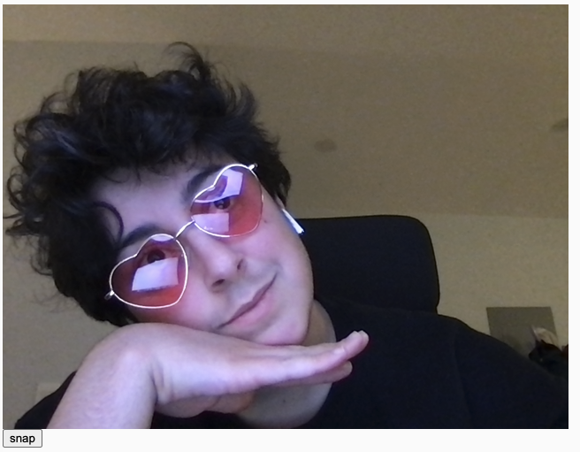
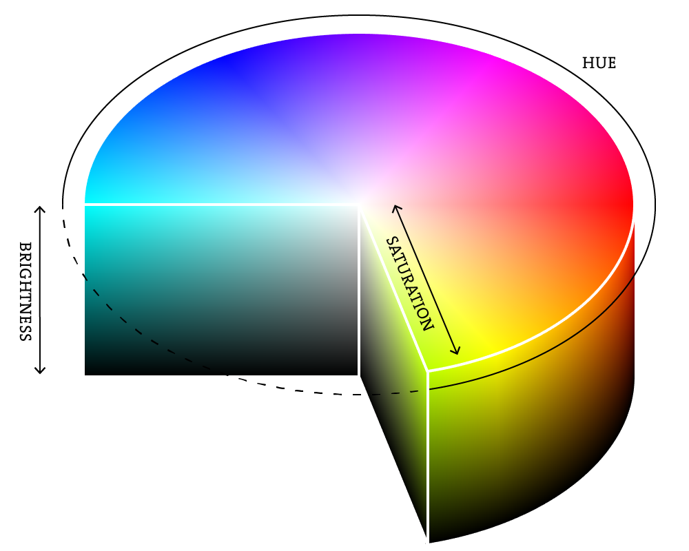
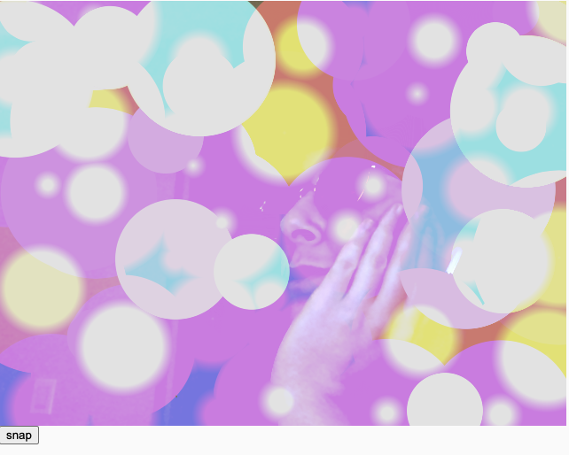

import { Callout } from "../../../components/Callout";
import EditableSketch from "../../../components/EditableSketch/index.astro";

## Introduction

Welcome! This tutorial provides an introduction to drawing color gradients in p5.js. It is the first part of the Drawing chapter, which will guide you through creating a sticker-based [photo decorating app](https://editor.p5js.org/juleskris/sketches/9kVjcL1Vq). For our first exercise, we’re going to use [radial color gradients](https://developer.mozilla.org/en-US/docs/Web/CSS/gradient/radial-gradient) and [blend modes](https://developer.mozilla.org/en-US/docs/Web/CSS/blend-mode) to create lens flare stickers on top of a selfie you capture with your webcam. We’ll also use [linear color gradients](https://developer.mozilla.org/en-US/docs/Web/CSS/gradient/linear-gradient) and blend modes to create a gradient filter on top of your selfie. For reference, a lens flare is that visual effect in photos or videos where bright light scatters in the camera lens, creating streaks, circles, or halos, often adding a dramatic or artistic touch to the image. A filter is an effect that can alter the pixels in a digital image, or overlay the image to alter its shades and colors.


### Prerequisites

To follow along with this tutorial, you should have:

1. Followed the tutorials in the [Introduction to p5.js](/tutorials/get-started) chapter, or have an understanding of basic concepts and best practices used when creating projects in p5.js.
2. A desire to learn and experiment. Curiosity and a willingness to experiment are the most important prerequisites. 

This tutorial uses the [p5.js Web Editor](https://editor.p5js.org/) and is designed for learners of all levels, so don’t worry if you’re new to coding – that’s what we’re here to guide you through!


### Step 1: Set up your p5.js Web Editor and webcam 

- Go to [the p5.js Web Editor](https://editor.p5js.org/). 
- Log in to your account, or create a new one, to save your progress.
- Rename the project to “Color Gradient Stickers” or another name of your choosing.
- Set up the webcam:
  - Call `createCanvas(640, 480)`.
  - Declare a global variable called `video` using the keyword `let`. You’ll assign a value to this shortly.
  - In your `setup()` function, assign a `createCapture(VIDEO)` object to your `video` variable by adding: `video = createCapture(VIDEO)`.
    - This will initialize a [`p5.MediaElement`](/reference/p5/p5.MediaElement) with your webcam to feed the video from your webcam into your sketch using the `video `variable.
    - Visit the p5.js reference pages for [`let`](/reference/p5/let), [`createCapture()`](/reference/p5/createCapture), and [`p5.MediaElement`](/reference/p5/p5.MediaElement) to learn more.
  - Set the position to (0, 0), pinning it to the top left of your canvas, using the `.position()` method by adding `.position(0, 0)` in `setup()`.
    - If you run the sketch now, you should see the video feed from your webcam appear in the preview window. 
    - See this [example sketch](https://editor.p5js.org/Msqcoding/sketches/mLfhMChZW) that sets up your webcam to display on the canvas. 
    - Visit the p5.reference pages for [`.position()`](/reference/p5.Element/position) and [`p5.Element`](/reference/p5/p5.Element) to learn more.
- Create a function to take a snapshot with your webcam.
  - Declare a global [Boolean](/reference/p5/boolean) variable called `snapped` and assign it a value of `false`.
    - This variable will keep track of when a snapshot is taken and is known as a [state](https://developer.mozilla.org/en-US/docs/Glossary/State_machine) variable.
    - Visit the MDN glossary for [state machine](https://developer.mozilla.org/en-US/docs/Glossary/State_machine) for more information about states.
  - Define a function called `takeSnap()` below your `setup()` function.
    - Use an `if` statement to check whether the user has already captured a snapshot by adding `if (snapped === false) {}`, or equivalently `if (!snapped) {}`, to the function body. 
    - Capture a snapshot of your webcam feed and place it on the canvas by adding `image(video, 0, 0)` to the `if` statement’s body.  
      - Your sketch tracks the [state](https://developer.mozilla.org/en-US/docs/Glossary/State_machine) of your app using the `snapped` variable – when `snapped` is equal to `false`, p5.js captures the snapshot using `image()`. 
    - Set `snapped` to `true` after capturing your snapshot by adding `snapped = true` under `image()`.
      - This will let your app know that a snapshot was taken.
    - Remove the video by adding `video.remove()` as the last line in the `if` statement.
      - This removes the video element in the `video` variable, so you’re looking at a still photo rendered by `image()` and not the video feed. 
  - Visit the p5.js reference for [`function`](/reference/p5/function), [`if`](/reference/p5/if), [`image()`](/reference/p5/image), and [`.remove()`](/reference/p5.Element/remove) to learn more.
* Create an [HTML button](/reference/p5/createButton) to take a snapshot. This works using a few different parts:
  - The `createButton()` function creates a new button. 
  - By typing the string `‘snap’` inside this function, we label the new button “snap.” 
  - This new button is assigned to a variable named `snapButton`.
  - We add a `.mouseClicked()` method to our `snapButton` and call `takeSnap()` when the button is clicked.
  - You can do this by adding the following code in `setup()`:

    ```js
    //create a button with snap text on it
    let snapButton = createButton('snap');
    
    //When we click the snap button, run the takeSnap function
    snapButton.mouseClicked(takeSnap);
    ```

Visit the p5.js reference pages for [`createButton()`](/reference/p5/createbutton) and [`mouseClicked()`](/reference/p5/mouseClicked) to learn more.

By creating an HTML button, we are inserting `<button></button>` inside our sketch page's HTML and are using it to trigger the code for taking a snapshot of our webcam feed.

Your code can look like this:

```js
// variable for video object
let video;

/* state variable
   false - no snapshot has been taken
   true - snapshot was taken */
let snapped = false;

function setup() {
  createCanvas(640, 480);

  //instantiate the VIDEO object 
  video = createCapture(VIDEO);

  //draw it on the screen at 0, 0 so we can see webcam feed
  video.position(0, 0);

  //create a button with snap text on it
  let snapButton = createButton('snap');

  //When we click the snap button, run the takeSnap function
  snapButton.mouseClicked(takeSnap);
}

/*If we haven’t snapped a photo yet (snapped is false)
  display the video frame for snapshot
  set snapped to true and remove the video feed, leaving only the still photo we took */
function takeSnap() {
  if (snapped === false) {
    image(video, 0, 0);
    snapped = true;
    video.remove();
  }
}
```

Hit play, and you’ll see your webcam feed displayed. Click the “snap” button to take a photo. We’ll layer stickers on top of this photo as we progress through the tutorial. This is what a selfie snapshot can look like:



<Callout>
Right now, our selfie is automatically sized to the dimensions of our canvas. Play with the width and height of the selfie by adding a width parameter and a height parameter after setting the position in the `image(video, 0, 0)` call. You can stretch and distort the selfie this way. Once you’ve done that, try duplicating the selfie by using the image function again, this time with different position and size parameters.

[Example Code](https://editor.p5js.org/juleskris/sketches/Fn32IViAW)
</Callout>


### Step 2: Add a linear gradient filter on top of your photo

Next, we’ll use `colorMode()`, `blendMode()`, and `lerpColor()` to create a linear color gradient over your selfie. 

- Add `colorMode(HSB, 360, 100, 100);` to your setup function. This will set the `colorMode()` to use HSB (Hue, Saturation, Brightness) instead of the default RGB (Red, Green, Blue). The 360 is for our range of hues; it could be any number, but 360 is a common convention because this relates to degrees on a color wheel. The 100 values represent Hue and Saturation, respectively. Again, 100 is a popular convention because it’s convenient to think of these values spanning 0% to 100%. We haven’t mixed any colors yet, but we’ll use the system we’ve defined here further along in our code.



As you can see in the diagram above, Hue changes the color (0 to 360), Saturation changes the vibrancy of the color from white to full vibrancy (0 to 100), and Brightness changes the intensity of a color from black to full intensity (0 to 100).

The following example uses HSB color to create a linear color gradient across the canvas. The hue value increases from left to right:

<EditableSketch code={`
function setup() {
  createCanvas(400, 400);

  // Use the HSB color mode.
  colorMode(HSB, 360, 100, 100);

  for (let x = 0; x < width; x += 1) {

    // Map the x-coordinate to the hue value.
    let h = map(x, 0, width, 0, 360);

    // Set the saturation value to 100.
    let s = 100;

    // Set the brightness value to 100.
    let b = 100;

    // Set the stroke color.
    stroke(h, s, b);

    // Draw a vertical line.
    line(x, 0, x, height);
  }
}
`} />

More variations:

- [This example](https://editor.p5js.org/mcintyre/sketches/OHR6gZ1TW) uses HSB color to create a linear color gradient across the canvas. The saturation value increases from left to right.
- [This example](https://editor.p5js.org/mcintyre/sketches/yR9k7Tcnz) uses HSB color to create a linear color gradient across the canvas. The brightness value increases from left to right.

Next, we'll do something similar in our own sketch:
- Define a new function called `gradientFilter()`.
  - Inside this function, create variables called `startColor` and `endColor`, and assign them the HSB values for the colors at each end of your gradient. In this code, it’s a red-to-yellow gradient. Both colors are fully saturated (vivid as opposed to grey) but with 50% brightness. You can experiment with different color values to see what you like.
  - We’ll use a `for` loop to draw as many horizontal lines as there are pixels spanning the height of our canvas. Each of these lines will be stacked one below the other, and each will have a slightly different stroke color, creating a gradient effect. The loop runs until the `y` reaches the canvas height, and we’ll use this `y` value to manipulate each line.
    - `for (let y = 0; y < height; y += 1)`
  - Inside the `for` loop:
    - Create a variable called `amt`. Use the [`map()`](/reference/p5/map) function to remap our y variable that ranges from 0 to `height` (480) to a range of 0 to 1.
    - Create a variable called `gradColor`, and use the [`lerpColor()`](/reference/p5/lerpColor) function to interpolate between our `startColor` and `endColor` by the `amt` variable. Interpolate is a fancy way of saying that we’re gradually moving between two color values.
    - Set the `stroke()` color to `gradColor`.
    - Draw a line using the `line()` function that starts at the x-y coordinates (0, `y`) and ends at (`width`, `y`). 
- Add a call to [`blendMode(LIGHTEST)`](/reference/p5/blendMode) to our setup function. Passing the `LIGHTEST` argument to `blendMode()` guarantees only the lightest color is drawn when graphics are layered on top of each other. This will make our linear gradient appear on top of our photo as a translucent overlay that interacts nicely with the light and dark values in our photo.
- Define a `mousePressed()` function.
  - Inside the function body, create an `if` statement that checks whether the `snapped` variable equals true, indicating that the user has already taken a photo and is ready to apply a sticker – in which case, we can call the `gradientFilter()` function. 

Your code should look something like this:

```js
let video;

/* state variable
   false - no snapshot has been taken
   true - snapshot was taken */
let snapped = false;

function setup() {
  createCanvas(640, 480);

  //set the colorMode to HSB instead of RGB
  colorMode(HSB, 360, 100, 100);

  //instantiate the VIDEO object
  video = createCapture(VIDEO);

  //draw it on the screen at 0, 0 so we can see webcam feed
  video.position(0, 0);

  //create a button with snap text on it
  let snapButton = createButton("snap");

  //When we click the snap button, run the takeSnap function
  snapButton.mouseClicked(takeSnap);
  blendMode(LIGHTEST);
}

//Run the gradientFilter function when we press the mouse
function mousePressed() {
  if (snapped === true) {
    gradientFilter();
  }
}

/*If we haven’t snapped a photo yet (snapped is false)
  display the video frame for snapshot
  set snapped to true and remove the video feed, leaving only the still photo we took */
function takeSnap() {
  if (snapped === false) {
    image(video, 0, 0);
    snapped = true;
    video.remove();
  }
}

//Draws a linear gradient on the screen using a for loop and lerpColor
function gradientFilter() {
  let startColor = color(0, 100, 50);
  let endColor = color(60, 100, 50);
  for (let y = 0; y < height; y += 1) {
    let amt = map(y, 0, height, 0, 1);
    let gradColor = lerpColor(startColor, endColor, amt);
    stroke(gradColor);
    line(0, y, width, y);
  }
}
```

Hit play, and you’ll be able to take a snapshot and click on the canvas to apply your gradient filter. See how the gradient applies most dramatically to the darkest parts of the photo. This is due to the `blendMode()`, saturation, and brightness settings we are using.

### 

<Callout>
Alter the colors of our gradient by playing with the HSB values within startColor and endColor!

[Example.](https://editor.p5js.org/juleskris/sketches/EM6QHCNpe)
</Callout>


### Step 3: Add color gradient stickers

Let’s use radial gradients to add some colorful lens flares to place as stickers over our photo. 

- Define a new `lensFlare()` function.
- We’ll use the [`circle()`](/reference/p5/circle) function to create our lens flares.
  - Create a variable called `diameter` and set it to 50.
  - Create a variable called `h` (we’re using this for hue) and set it to 150.
- Create a for loop that opens with `for (let d = diameter; d > 0; d -= 1)`. This loop will draw multiple circles with different stroke colors that smoothly blend, creating the effect of a rainbow-like fill.
  - Inside the for loop, write `fill(h, 90 90)`. This assigns the `h` variable to hue, 90 to saturation, and 90 to brightness.
  - Write `circle(mouseX, mouseY, d)`. This sets our circle’s x-coordinate to `mouseX`, y-coordinate to `mouseY`, and diameter to `d`.
  - Set `h` to equal `(h + 1) % 360`. We’re using a for loop to iterate through our HSB values, specifically the hue value. The modulo operator (`%`) helps cycle through hue values so that if any h value exceeds 360, it ‘wraps around’ to start at zero again, allowing the color blend to repeat.
- To create size and color variation, set `diameter` to `random(50, 200)` and `h` to `random(150, 360)`.
- Inside the `if` statement in your `mousePressed` function, call `lensFlare()`.

Your completed sketch code should look something like this:

```js
let video;

/* state variable
   false - no snapshot has been taken
   true - snapshot was taken */
let snapped = false;

function setup() {
  createCanvas(640, 480);

  //set the colorMode to HSB instead of RGB
  colorMode(HSB, 360, 100, 100);

  //instantiate the VIDEO object, and draw it on the screen at 0, 0 
  video = createCapture(VIDEO);
  video.position(0, 0);

  //create a button with snap text on it
  let snapButton = createButton('snap');

  //When we click the snap button, run the takeSnap function
  snapButton.mouseClicked(takeSnap);
  blendMode(LIGHTEST);
  noStroke();
}

//Run the gradientFilter function when we press the mouse
function mousePressed() {
  if (snapped === true) {
    gradientFilter();
    lensFlare();
  }
}

/*If we haven’t snapped a photo yet (snapped is false)
  display the video frame for snapshot
  set snapped to true and remove the video feed, leaving only the still photo we took */
function takeSnap() {
  if (snapped === false) {
    image(video, 0, 0);
    snapped = true;
    video.remove();
  }
}

//Draws circles filled with radial gradients when we click the screen
//Each circle’s size and color are a random value contained in the diameter and h variables
function lensFlare() {
  let diameter = random(50, 200);
  let h = random(150, 360);
  for (let d = diameter; d > 0; d -= 1) {
    fill(h, 90, 90);
    circle(mouseX, mouseY, d);
    h = (h + 1) % 360;
  }
}

//Draws a linear gradient on the screen using a for loop and lerpColor
function gradientFilter() {
  let startColor = color(0, 100, 50);
  let endColor = color(60, 100, 50);
  for (let y = 0; y < height; y += 1) {
    let amt = map(y, 0, height, 0, 1);
    let gradColor = lerpColor(startColor, endColor, amt);
    stroke(gradColor);
    line(0, y, width, y);
  }
}
```

Hit play for the final result, and click on different parts of the photo to add several lens flare effects. 


Keep adding stickers, and you’ll be able to cover the entire photo. Note how the `LIGHTEST` `blendMode()` interacts with the different layers of your canvas.




<Callout>
Change the `blendMode` to different settings to see how they affect the sketch! We chose `LIGHTEST`, but you can find the complete list of options in the p5.js reference page for [`blendMode`](/reference/p5/blendMode). 

[Example.](https://editor.p5js.org/juleskris/sketches/BkHU6ZLSO)
</Callout>


### Conclusion

In this tutorial, you learned how to instantiate a view of the webcam, use [`circle`](/reference/p5/circle) to create radial gradients, use [`line`](/reference/p5/line) to create linear gradients, and use the [color()](/reference/p5/color), [lerpColor()](/reference/p5/lerpColor), and [blendMode()](/reference/p5/blendMode) functions to create lens flare stickers to apply to your photos. In our next tutorial, we’ll use `beginShape()`, `endShape()`, `vertex()`, `bezier()`, and `bezierVertex()` to create even more unique stickers!

Here's [example code for the completed project](https://editor.p5js.org/juleskris/sketches/9kVjcL1Vq) for reference.


### Next Steps

Continue on to the next lesson: [Custom Shapes and Smooth Curves](/tutorials/custom-shapes-and-smooth-curves)!


### Resources

- [State machine - MDN Glossary](https://developer.mozilla.org/en-US/docs/Glossary/State_machine)
- [Using CSS Gradients - MDN tutorial](https://developer.mozilla.org/en-US/docs/Web/CSS/CSS_images/Using_CSS_gradients)
- [Gradient - CSS](https://developer.mozilla.org/en-US/docs/Web/CSS/gradient)
- [Radial gradient - CSS](https://developer.mozilla.org/en-US/docs/Web/CSS/gradient/radial-gradient)
- [Blend mode - CSS](https://developer.mozilla.org/en-US/docs/Web/CSS/blend-mode)
- [Linear gradient - CSS](https://developer.mozilla.org/en-US/docs/Web/CSS/gradient/linear-gradient)
- [p5.js Web Editor](https://editor.p5js.org/son/sketches/LuJ2eGf9p)
- [Color Radial Gradient Example](https://p5js.org/examples/color-radial-gradient.html)
