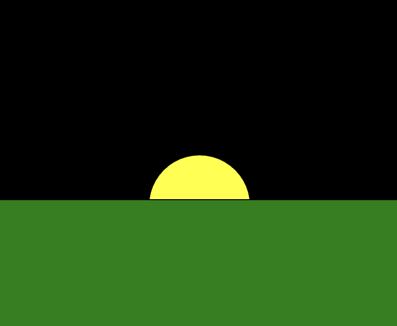
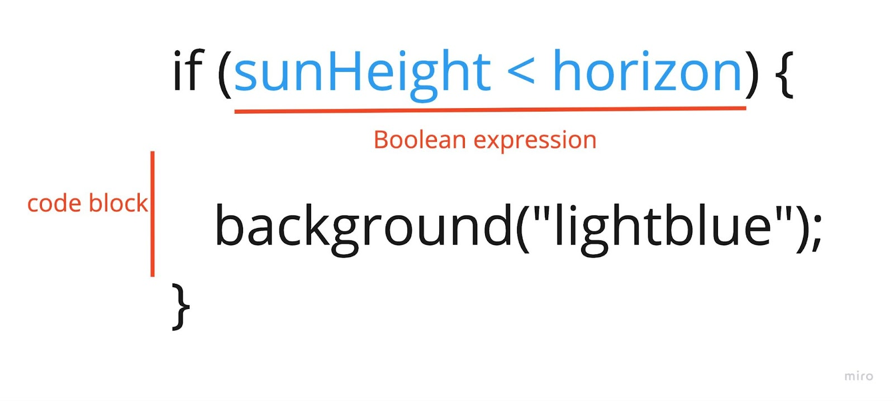
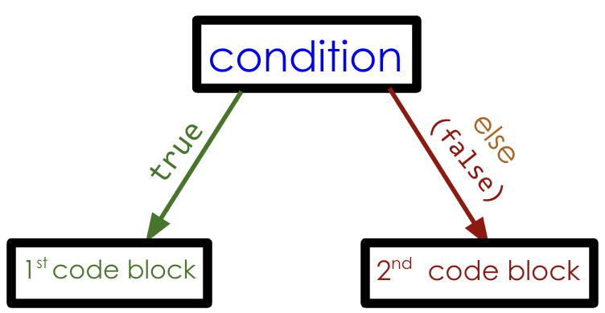

import { Callout } from "../../../components/Callout/";
import { Columns, Column } from "../../../components/Columns";
import Video from "../../../components/Video/index.astro"

In this tutorial, you will learn new ways to add user interaction to your sketches, and control the order in which code runs. 

You will learn these basic programming concepts by creating an [interactive sun](https://editor.p5js.org/gbenedis@gmail.com/sketches/nNVmHVf5m) sketch and a [sunrise animation](https://editor.p5js.org/gbenedis@gmail.com/sketches/9lz2aqfTO):

- Conditional statements (if, if-else, and else-if)
- Boolean variables, comparison operators, and expressions
- Addition/subtraction assignment operator
- Incrementing and decrementing
- Interactivity with mouse button presses and mouse pointer location

Controlling the flow of your program is central to the power of computing and makes creating exciting animations and games in p5.js possible. Typically, lines of code run in order. In previous tutorials, you have seen how the [`draw()`](/reference/p5/draw) function runs code from top to bottom repeatedly. This allows for overlapping shapes and “flip book” animations. 


### Prerequisites

- [Setting Up Your Environment](/tutorials/setting-up-your-environment)
- [Get Started Tutorial](/tutorials/get-started)
- [Variables and Motion Tutorial](/tutorials/variables-and-motion)

Before you begin, you should be able to:

- Add and customize shapes and text on the canvas using p5.js
  - [`circle()`](/reference/p5/circle) | [`rect()`](/reference/p5/rect) | [`ellipse()`](/reference/p5/ellipse) | [`triangle()`](/reference/p5/triangle) | [`line()`](/reference/p5/line)
  - [`fill()`](/reference/p5/fill), [`stroke()`](/reference/p5/stroke), [`text()`](/reference/p5/text), [`textSize()`](/reference/p5/textSize)
- Use built-in variables such as [`mouseX`](/reference/p5/mouseX) and [`mouseY`](/reference/p5/mouseY)
- Declare, initialize, use and update custom variables using `let` and the [assignment operator](https://developer.mozilla.org/en-US/docs/Web/JavaScript/Reference/Operators/Assignment)
- Incorporate both linear and random motion by using [`random()`](/reference/p5/random), [`frameRate()`](/reference/p5/frameRate) and [`frameCount`](/reference/p5/frameCount)
- Comment code and address error messages - to learn more about error messages and debugging, read the [Field Guide to Debugging](/tutorials/field-guide-to-debugging) reference.


## Part 1: Interactive Sun

Creating an [interactive sun](https://editor.p5js.org/gbenedis@gmail.com/sketches/nNVmHVf5m) sketch is a great way to learn how to use *conditional statements* and user interaction. 


##  

### The IF Statement (a conditional statement)

[*Conditional statements*](https://developer.mozilla.org/en-US/docs/Learn/JavaScript/Building_blocks/conditionals) control when specific lines of code run. For example, before sunrise the sky is dark. Once the sun comes up it is daytime, and the sky is a lighter color. You can write a *conditional statement* (also known as an *if statement*) to change the color of the sky based on the position of the sun. IF the sun is high, then the sky should be a light color; otherwise the sky should be dark. If statements can check the sun's position, and control the code that runs depending on where it is in the sky.

Before we can use conditional statements that check for the sun’s position, we can add custom variables to help us update the sun’s position as the mouse pointer is dragged across the canvas.


#### Step One: Define and initialize custom variables

- Open a new p5.js project, name it “Interactive Sun”, and save the sketch.

- Declare a custom variable for the y-coordinate for the sun called `sunHeight`, and a custom variable for the y-coordinate of the horizon called `horizon`. Initialize the variable for the horizon with 200. 

  - Add the following lines of code to your sketch before [`setup()`](/reference/p5/setup):

    ```js
    //custom variables for y-coordinate of sun & horizon
    let sunHeight;
    let horizon = 200;
    ```

- Update the `sunHeight` to the y-coordinate of the mouse pointer, `mouseY`.

  - Add the following code inside [`draw()`](/reference/p5/draw):

    ```
    //sun follows y-coordinate of mouse
    sunHeight = mouseY;
    ```

Your code should look like this:

```js
//custom variables for y-coordinate of sun & horizon
let sunHeight;
let horizon = 200;
function setup() {
  createCanvas(400, 400);
}
function draw() {
  background(0);
 
  //sun follows y-coordinate of mouse
  sunHeight = mouseY;
}
```

Since the sun’s height is changing, we store the y-coordinate of the mouse, `mouseY`, in the variable `sunHeight`. Doing this in `draw()` continuously updates `sunHeight` each time `draw()` runs. Although the horizon is not changing, a custom variable for the horizon is used as a reference point and to make code more readable. 

Visit the p5.js reference for more information about [`mouseY`](/reference/p5/mouseY) and [`let`](/reference/p5/let).


#### Step Two: Draw shapes and color the canvas

- Draw a sun that uses the custom variable `sunHeight` as its y-coordinate.

  - Add the following code inside [`draw()`](/reference/p5/draw):

    ```js
    //sun
    fill("yellow");
    circle(200, sunHeight, 160);
    ```

- Draw a line to show the horizon.

  - Add the following code inside [`draw()`](/reference/p5/draw):

    ```js
    // draw line for horizon
    stroke("green");
    line(0,horizon,400,horizon);
    ```

Your code should look like this:

```js
//custom variables for y-coordinate of sun & horizon
let sunHeight;
let horizon = 200;
function setup() {
  createCanvas(400, 400);
}
function draw() {
  background(0);
 
  //sun follows y-coordinate of mouse
  sunHeight = mouseY;

  //sun
  fill("yellow");
  circle(200, sunHeight, 100);


  // draw line for horizon
  stroke('green');
  line(0,horizon,400,horizon);
}
```

The sun follows the mouse pointer as it moves vertically on the canvas because `sunHeight` is used as the argument for the circle’s y-coordinate in: `circle(200, sunHeight, 100)`. A line is drawn on the canvas with `horizon` as an argument for the y-coordinates of each endpoint: `y1, y2`. This marks the horizon line on the canvas which will be used to change the background color. 

Visit the p5.js reference pages for [2D shapes](/reference#Shape), [color](/reference#Color),  [foundations](/reference#Foundation) and [mouse events](/reference#Mouse) to learn more about shapes and variables. Read the [Field Guide to Debugging](/tutorials/field-guide-to-debugging) (Examples 1 & 2) for help with common bugs.


#### Step Three: Use a conditional statement with a Boolean expression to change the background color

- Set the background color to light blue when the sun is above the horizon.
  - Add the following lines to your sketch inside [`draw()`](/reference/p5/draw) after the line of code: `sunHeight = mouseY`:

    ```js
    //light blue background if sun is above horizon
    if(sunHeight < horizon){
      background("lightblue");
    }
    ```

Your code should look like this:

```js
//custom variables for y-coordinate of sun & horizon
let sunHeight;
let horizon = 200;
function setup() {
  createCanvas(400, 400);
}
function draw() {
  background(0);
 
  //sun follows y-coordinate of mouse
  sunHeight = mouseY;


   //light blue background if sun is above horizon
  if(sunHeight < horizon){ //check if it is daytime
     background("lightblue");
  }
  //sun
  fill("yellow");
  circle(200, sunHeight, 100);


  // draw line for horizon
  stroke('green');
  line(0,horizon,400,horizon);
}
```

Run the code and experiment with moving the sun using the mouse!

In the code above, the background is black by default because the first statement that is read in `draw()` is `background(0)`. When the sun is below the horizon line, the background remains black because the if statement skips the *code block* inside the curly braces: `background("lightblue")`. When the sun is above the horizon line, the *code block* inside the curly braces runs. This resets the color from the default black color to a light blue color. 

Here you are controlling when `background(0)` and `background("lightblue")` runs. A *conditional statement* (or *if statement*) is a way to control when specific lines of code run, which changes what happens in the sketch. 


#### IF statement syntax

An if statement begins with the keyword `if`, followed by condition(s) within parenthesis, and lines of code called a *code block* inside of curly braces. The code block runs if the condition is `true`. The syntax for an if statement is defined as follows:

```js
if (condition) {
  // code to run if the condition is true
} 
```


#### Boolean expressions & values

The code inside the parentheses after the keyword `if` can be a *Boolean value* or a *Boolean expression*. In the example below, a Boolean expression is used to check if the value in the `sunHeight` variable is less than the value in the `horizon` variable:



*Boolean expressions* are statements that result in a *Boolean* value. *Boolean* values can either be `true` or `false`*.* Unlike numbers or strings, there are only two Boolean values. *Boolean expressions* help check if conditions are `true` or `false`; therefore, they use symbols called *comparison operators*. *Comparison operators* are special symbols that compare two values (see the table below).

[*Comparison operator*](https://developer.mozilla.org/en-US/docs/Web/JavaScript/Reference/Operators) symbols you can use to create Boolean expressions include:

<table>

<tr>

<th>

Symbol

</th>

<th>

Meaning (p5.js ref link)

</th>

<th>

Example

</th>

</tr>

<tr>

<td>

`<`

</td>

<td>

[less than](/reference/p5/lt)

</td>

<td>

`x < 5`

</td>

</tr>

<tr>

<td>

`<=`

</td>

<td>

[less than or equal to](/reference/p5/lte)

</td>

<td>

`x <= 5`

</td>

</tr>

<tr>

<td>

`>`

</td>

<td>

[greater than](/reference/p5/gt)

</td>

<td>

`x > 5`

</td>

</tr>

<tr>

<td>

`>=`

</td>

<td>

[greater than or equal to](/reference/p5/gte)

</td>

<td>

`x >= 5`

</td>

</tr>

<tr>

<td>

`===`

</td>

<td>

Strict equality (meaning values of different types are considered to be not equal)

</td>

<td>

`x === 5`

</td>

</tr>

<tr>

<td>

`!==`

</td>

<td>

not equal to

</td>

<td>

`x !== 5`

</td>

</tr>

</table>

Visit the MDN reference to learn more about [expressions and operators](https://developer.mozilla.org/en-US/docs/Web/JavaScript/Reference/Operators). 

You can think of *Boolean expressions* as the computer asking a question. In the code added in step three, the Boolean expression is `sunHeight < horizon`. It is asking if the value of the variable `sunHeight` is less than the value of the variable `horizon`. If the answer to the question is yes, if `sunHeight < horizon` results in a value of `true`, then the code block runs. If the answer is no, the code block is skipped. 

We can view the value of `sunHeight < horizon` in the console by adding `console.log(sunHeight < horizon)` in [`draw()`](/reference/p5/draw) after `sunHeight = mouseY`. Observe how the value printed in the console changes from `true` to `false` as you move your mouse around the canvas: the value is `false` when the sun is below the horizon line, and `true` when it is above the horizon line. See [this sketch](https://editor.p5js.org/gbenedis@gmail.com/sketches/nNVmHVf5m) for an example.

Visit the p5.js reference page for [foundations](/reference#Foundation) to learn more about if statements and Boolean values.


### The IF-ELSE Statement 

Another important conditional is the *if-else statement*, where there are two code blocks that can be controlled. The syntax for the if-else statement is defined as follows:

```js
if (condition) {
  // code to run if the condition is true
} else {
  // code to run if the condition is false
}
```

If the condition is `true`, then the first code block runs. If it is `false`, then the code block that follows the `else` keyword runs. If your code requires two changes based on one condition, the if-else statement is a better way to structure your code. It is helpful to visualize if statements as bubble maps, like the one below, that shows how the 1st code block runs when the condition is true, and the 2nd code block runs when the condition is false.



For example, you can modify the if statement in your sunset animation by removing the [`background()`](/reference/p5/background) function and adding the following if-else statement: 

<Columns>
<Column>
##### Original Code:

```js
//...function draw

background(0); // night sky

//sun follows y-coordinate of mouse
sunHeight = mouseY;

//light blue background if sun is above horizon

if (sunHeight < horizon) {
  background("lightblue"); // blue sky
}
```
</Column>
<Column>
##### Modified Code:

```js
//...function draw

//sun follows y-coordinate of mouse
sunHeight = mouseY;

//light blue background if sun is above horizon

// with if-else statement

if (sunHeight < horizon) {
  background("lightblue"); // blue sky if above horizon
} else {
  background(0); // night sky otherwise
}
```
</Column>
</Columns>

In the code above, we see that if the sun is above the horizon, `sunHeight < horizon `returns `true`, and the code `background("lightblue")` runs. When `sunHeight` is NOT less than the horizon the code block after the `else` keyword, `background(0)`, runs. Although both ways of writing the code have the same visual effect, sometimes it can be clearer and more efficient to use if-else, especially when two different code blocks can be controlled. 

Visit the p5.js reference page for [`if`](/reference/p5/if-else) and [`Boolean`](/reference/p5/boolean) to learn more.


#### Step Four: Add grass to hide the sun  

Add a grassy landscape to your sketch so that you can’t see the sun below the horizon.

- Draw a green rectangle on the landscape after the sun so that it hides the sun when it’s below the horizon. The argument for the y-coordinate of this rectangle is the location of the `horizon` line.
  - Add the following code in [`draw()`](/reference/p5/draw) after the line for the horizon:

    ```js
    //grass
    fill("green"); 
    rect(0, horizon, 400, 400);
    ```

Your code should look like this:

```js
//custom variables for y-coordinate of sun & horizon
let sunHeight;
let horizon = 200;
function setup() {
  createCanvas(400, 400);
}
function draw() {

  //sun follows y-coordinate of mouse
  sunHeight = mouseY;

  //light blue background if sun is above horizon

  //with if-else statement

  if (sunHeight < horizon) {
    background("lightblue"); // blue sky if above horizon
  } else {
    background(0); // night sky otherwise
  }

  //sun
  fill("yellow");
  circle(200, sunHeight, 100);


  // draw line for horizon
  stroke('green');
  line(0,horizon,400,horizon);

  //grass

  fill("green");

  rect(0, horizon, 400, 400);

}
```

Run the sketch and move the sun below the horizon. See how the sky changes as the sun disappears? Link to [sunrise animation sample sketch](https://editor.p5js.org/Msqcoding/sketches/StUo5StZi).

<Callout>
- Use conditional statements to change the color of the grass! For example, when the sun rises on a grassy landscape, its color changes from dark green to a lighter green. 
- Add some more shapes with colors that change to the landscape of your sketch! 

[Example](https://editor.p5js.org/gbenedis@gmail.com/sketches/nNVmHVf5m)
</Callout>


## Part 2: Sunrise Animation

Next, you will make a [sunrise animation](https://editor.p5js.org/gbenedis@gmail.com/sketches/9lz2aqfTO) where the sun moves on its own, and creates a gradual change in the color of the sky.

<Video src="/public/videos/tutorials/sunrise.mp4" alt="A sun rises in a red-orange sky behind a mountain range." />


#### Step One: Declare and initialize variables for sun location and background color

- Open a new p5.js project, name it “Sunrise Animation,” and save it.

- Declare a custom variable for the y-coordinate for the sun and initialize it with 600. 

  - Add the following lines to your sketch before [`setup()`](/reference/p5/setup):

    ```js
    //variable for initial sun position
    //point below horizon
    let sunHeight = 600;
    ```

- Declare a custom variable for the value of the red and green components of the sky color, and initialize them with 0.

  - Add the following lines to your sketch before [`setup()`](/reference/p5/setup):

    ```js
    //variables for color change
    let redVal = 0;
    let greenVal = 0;
    ```

Review the p5.js reference for [`fill()`](/reference/p5/fill) or the MDN reference for [RGB](https://developer.mozilla.org/en-US/docs/Glossary/RGB) to remind you about color codes.

Your code should look like this:

```js
//variable for initial sun position

let sunHeight = 600; //point below horizon

//variables for color change

let redVal = 0;

let greenVal = 0;


function setup() {
  createCanvas(600, 400);
}
function draw() {

}
```

In this step you created the variables `redVal`,` greenVal`,` `and`  sunHeight  `to store values that will be used in the program. The initial value for `sunHeight` is a point below the horizon, and the initial values for `redVal` and `greenVal` indicate a black color. These set the sun’s position and the color of the sky when the animation begins. These are called the  *initial conditions* of the animation. Now these variables are available to make changes on the canvas.


#### Step Two: Use custom variables to draw landscape

- Draw the background based on the custom variables for red and green.

  - Add the following code inside [`draw()`](/reference/p5/draw):

    ```js
     //fill background based on custom variables
     //the value of blue is set to 0 and will not change
     background(redVal, greenVal, 0);
    ```

- Draw a sun that uses the custom variable` sunHeight` as its y-coordinate.
  - Add the following code after filling the background:

    ```js
    //sun
    fill(255, 135, 5, 60);
    circle(300, sunHeight, 180);
    fill(255, 100, 0, 100);
    circle(300, sunHeight, 140);
    ```

- Add some triangular mountains to the landscape. 

  - Add the following code after drawing the sun:

    ```js
    //mountains
    fill(110, 50, 18);
    triangle(200, 400, 520, 253, 800, 400);
    fill(110,95,20);
    triangle(200,400,520,253,350,400);  

    fill(150, 75, 0);
    triangle(-100, 400, 150, 200, 400, 400);
    fill(100, 50, 12);
    triangle(-100, 400, 150, 200, 0, 400); 

    fill(150, 100, 0);
    triangle(200, 400, 450, 250, 800, 400);
    fill(120, 80, 50);
    triangle(200, 400, 450, 250, 300, 400);
    ```

Your code should look like this:

```js
//variable for initial sun position

let sunHeight = 600; //point below horizon

//variables for color change

let redVal = 0;

let greenVal = 0;


function setup() {
  createCanvas(600, 400);
}
function draw() {

  //fill background with color based on custom variables
  background(redVal, greenVal, 0);

  //sun
  fill(255, 135, 5, 60);
  circle(300, sunHeight, 180);
  fill(255, 100, 0, 100);
  circle(300, sunHeight, 140);

  //mountains
  fill(110, 50, 18);
  triangle(200, 400, 520, 253, 800, 400);
  fill(110,95,20);
  triangle(200,400,520,253,350,400);  
  
  fill(150, 75, 0);
  triangle(-100, 400, 150, 200, 400, 400);
  fill(100, 50, 12);
  triangle(-100, 400, 150, 200, 0, 400); 
  
  fill(150, 100, 0);
  triangle(200, 400, 450, 250, 800, 400);
  fill(120, 80, 50);
  triangle(200, 400, 450, 250, 300, 400);  
}
```

In this step you customized the landscape for your animation by using custom variables in your `background()` and `circle()` functions. Remember, the sun is hiding behind the mountains because it was drawn first!

<Callout>
Add as many shapes as you like to make your landscape unique and interesting!
</Callout>


#### Step Three: Use conditional statements to update custom variables

- Make the sun move by changing the `sunHeight` variable as long as it is less than 130.

  - Add the following code inside [`draw()`](/reference/p5/draw):

    ```js
    // reduce sunHeight by 2 until it reaches 130
    if (sunHeight > 130) {
      sunHeight -=2;
    }
    ```

- Gradually change the color of the sky by changing the values in the variables `redVal` and `greenVal `while the `sunHeight `variable is less than 480.

  - Add the following code inside [`draw()`](/reference/p5/draw):

    ```js
    // increase color variables by 4 or 1 during sunrise
    if (sunHeight < 480) {
      redVal += 4;
      greenVal += 1;
    }
    ```

Your code should look like this: 

```js
//variable for initial sun position
let sunHeight = 600; //point below horizon

//variables for color change
let redVal = 0;
let greenVal = 0;

function setup() {
  createCanvas(600, 400);
}
function draw() {
  //fill background based on custom variables
  background(redVal, greenVal, 0);
 
  //sun
  fill(255, 135, 5, 60);
  circle(300, sunHeight, 180);
  fill(255, 100, 0, 100);
  circle(300, sunHeight, 140);
 
  //mountains
  fill(110, 50, 18);
  triangle(200, 400, 520, 253, 800, 400);
  fill(110,95,20);
  triangle(200,400,520,253,350,400); 
 
  fill(150, 75, 0);
  triangle(-100, 400, 150, 200, 400, 400);
  fill(100, 50, 12);
  triangle(-100, 400, 150, 200, 0, 400);
 
  fill(150, 100, 0);
  triangle(200, 400, 450, 250, 800, 400);
  fill(120, 80, 50);
  triangle(200, 400, 450, 250, 300, 400);
 
  // reduce sunHeight by 2 until it reaches 130
  if (sunHeight > 130) {
    sunHeight -= 2;
  }
   
  // increase color variables by 4 or 1 during sunrise 
  if (sunHeight < 480) {
    redVal += 4;
    greenVal += 1;
  } 
}
```

When the sketch runs, the sun moves on its own! The motion is caused by the statement `sunHeight -= 2,` which decreases the value in `sunHeight` by `2` each time [`draw()`](/reference/p5/draw) runs. The value in `sunHeight` stops changing once the Boolean expression in the if statement, `sunHeight > 130`, is `false`. This happens when `sunHeight` is any value greater than 130.

When the value in a variable decreases by a value, it is called *decrementing*, and the **subtract assign** `-= `symbol is used. When a variable increases by a value, it is called *incrementing*, and the **add assign +=** operator is used. Any time a variable is incremented or decremented, the value stored in that variable is changed, and the new value is stored in the same variable.

Visit the MDN reference for the following operators to learn more: [`=`](https://developer.mozilla.org/en-US/docs/Web/JavaScript/Reference/Operators/Assignment) | [`+=`](https://developer.mozilla.org/en-US/docs/Web/JavaScript/Reference/Operators/Addition_assignment) | [`-=`](https://developer.mozilla.org/en-US/docs/Web/JavaScript/Reference/Operators/Subtraction_assignment)

<Callout>
Print the value of `sunHeight` to the console using `console.log(sunHeight)` to see how it changes over time.

[Example](https://editor.p5js.org/gbenedis@gmail.com/sketches/IHAcGOxNz)
</Callout>

The color of the sky changes because `redVal` and `greenVal` gradually change. According to the Boolean expression in the second conditional statement, when `sunHeight` is less than 480, variables for color change: `redVal` increases by 4, and `greenVal` increases by 1. Each time [`draw()`](/reference/p5/draw) runs, `redVal` and `greenVal` increase and are used to modify the background color the next time it runs. This creates an animated sunrise effect. 

The statement `greenVal +=1` can also be written as `greenVal++`. `++` is called the **increment operator**, and `--` is called the **decrement operator**. 

The following statements have the same effect:

```js
// Increment by 1.
grow++;
grow += 1;

// Decrement by 1.
shrink--;
shrink -= 1;
```

Visit the MDN reference for [++](https://developer.mozilla.org/en-US/docs/Web/JavaScript/Reference/Operators/Increment) and [--](https://developer.mozilla.org/en-US/docs/Web/JavaScript/Reference/Operators/Decrement) to learn more.

The first time [`draw()`](/reference/p5/draw) runs, the background is black and `sunHeight` decreases. After the sun reaches a y-coordinate of 480, the color of the sky begins to change as the values in `redVal` and `greenVal` increase. The sun stops moving when `sunHeight` reaches 130 because of the first conditional statement:

```js
if (sunHeight > 130) {
  sunHeight -= 2;
}
```

Here, `sunHeight `decreases by 2 every time [`draw()`](/reference/p5/draw) runs as long as `sunHeight `is greater than 130. When it reaches 130 or less, the Boolean expression in the parentheses is `false`, and the code inside the curly braces does not run anymore. This causes the sun to stop moving when its y-coordinate is 130 or less.


### Nested Conditionals 

When testing for multiple conditions at the same time, you can “nest” one condition inside another like this:

```js
//sunHeight is always greater than 130 for variables to change
if (sunHeight > 130) {
  sunHeight -=2;

  //nested condition 
  if (sunHeight < 480) {
    redVal +=4;    
    greenVal +=1;
  }
}
```

When you put an if statement *inside* another if statement, it is called a **nested conditional** statement. This requires both Boolean expressions to be `true` for code blocks to run. The difference in this example, compared to your code before the nested condition, is that now the color of the sky also stops changing once the sun reaches a y-value of 130. 

In the code above, if `sunHeight` is greater than 130, the code block inside the curly braces runs:
- The `sunHeight` is decreased by 2
- As long as `sunHeight > 130` and `sunHeight < 480` are `true`, the code block that changes the values of `redVal` and `greenVal` runs.

Notice that if the Boolean expression in the first if statement is `false`, the second condition is not checked. This means that as long as `sunHeight` is between 130 and 480, `redVal` and `greenVal` will change. After `sunHeight` reaches 130 or less, all variables will stop changing. In this case, `sunHeight > 130` must be `true` and `sunHeight < 480` must be `true` for the block in the nested conditional statement to run. Link to [finished project](https://editor.p5js.org/gbenedis@gmail.com/sketches/9lz2aqfTO) example with [`noStroke()`](/reference/p5/noStroke) in setup to remove shape outlines.


### Logical Operators: `&&` and `||`

Another way to write conditional statements with more than one condition is by using [logical operators](https://p5js.org/examples/control-logical-operators.html). The AND operator (`&&`) is used when *both* conditions must be `true` for a code block to run. The OR operator (`||`) is used when *either* condition must be true for a code block to run.

We can rewrite the nested conditional in the animated sunrise sketch using the AND (`&&`) logical operator since it requires that `sunHeight` is less than 130 *AND* greater than 480. In the code sample below, Boolean expressions on each side of the operator must be `true` in order for the code in its code block to run: 

```js
if (sunHeight < 130 && sunHeight > 480) {
  //Code block that runs when both conditions are true
}
```

Visit the MDN reference for [logical AND (`&&`)](https://developer.mozilla.org/en-US/docs/Web/JavaScript/Reference/Operators/Logical_AND) and [logical OR (`||`)](https://developer.mozilla.org/en-US/docs/Web/JavaScript/Reference/Operators/Logical_OR) to learn more about logical operators.

<Callout>
Practice with logical operators by adding the following code inside `draw()`: 

```js
if (mouseIsPressed == true && sunHeight === 130) {
  background(0);
}
```

[Example](https://editor.p5js.org/gbenedis@gmail.com/sketches/9lz2aqfTO)
</Callout>


### Boolean Variables: `mouseIsPressed` and `keyIsPressed`

`mouseIsPressed` and `keyIsPressed `are special variables built into p5.js that contain Boolean values. `mouseIsPressed `is `true` when the mouse button is pressed down on the canvas; otherwise it is `false`. `keyIsPressed `is `true` when any key on the keyboard is pressed down; otherwise it is `false`. 

Explore [this example](https://editor.p5js.org/Msqcoding/sketches/CnKfDeaBG) to see the value stored in `mouseIsPressed` change in the console when the mouse button is pressed down. 

In the “Try this!” challenge, when `sunHeight` is equal to 130 *AND* the mouse button is pressed down, the sky becomes dark. Perhaps it shows a solar eclipse! 

We can even use `mouseIsPressed` on its own in the if statement:

```js
if (mouseIsPressed && sunHeight === 130) {
  background(0);
}
```

Since `mouseIsPressed` already stores a value of `true `or `false`, we do not need to use a comparison operator to create a Boolean expression. Boolean expressions evaluate to Boolean values, and Boolean variables store Boolean values. Conditional statements only require Boolean values to be `true` for code to run. If `mouseIsPressed` is `true`, the code block for the conditional statement will run. 

Explore these examples that use `mouseIsPressed` and `keyIsPressed`:

- [Mouse and keys](https://editor.p5js.org/Msqcoding/sketches/MQtma5kta): Explore how `mouseIsPressed` and `keyIsPressed` can be used in conditional statements without logical operators. 
- [Clickable button](https://editor.p5js.org/Msqcoding/sketches/gmRjOEyu_): Explore this example that uses mouseIsPressed, mouseX and mouseY to make a clickable button!
- [Multiple keys:](https://editor.p5js.org/Msqcoding/sketches/kyYpyMh0p) Explore this example that uses multiple keys to make changes on the canvas.

Visit the p5.js reference pages for [`mouseIsPressed`](/reference/p5/mouseIsPressed), [`keyIsPressed`](/reference/p5/keyIsPressed) [`key`](/reference/p5/key) and [`keyCode`](/reference/p5/keyCode) to learn more. 


## Conclusion

Now that you have a timed sunrise animation, explore changing the shapes and colors to modify the sketch. Try adding new features and interactions, perhaps even some new conditional statements. Maybe you can try starting the animation with a key press or mouse press. 


## Next Steps

- [Organizing Code with Functions](/tutorials/organizing-code-with-functions)


## References

- [Making decisions in your code](https://developer.mozilla.org/en-US/docs/Learn/JavaScript/Building_blocks/conditionals)
- [= operator](https://developer.mozilla.org/en-US/docs/Web/JavaScript/Reference/Operators/Assignment)
- [+= operator](https://developer.mozilla.org/en-US/docs/Web/JavaScript/Reference/Operators/Addition_assignment)
- [-= operator](https://developer.mozilla.org/en-US/docs/Web/JavaScript/Reference/Operators/Subtraction_assignment)
- [Increment (++)](https://developer.mozilla.org/en-US/docs/Web/JavaScript/Reference/Operators/Increment)
- [Decrement (--)](https://developer.mozilla.org/en-US/docs/Web/JavaScript/Reference/Operators/Decrement)
- [Logical AND (&&)](https://developer.mozilla.org/en-US/docs/Web/JavaScript/Reference/Operators/Logical_AND)
- [Logical OR (||)](https://developer.mozilla.org/en-US/docs/Web/JavaScript/Reference/Operators/Logical_OR)
