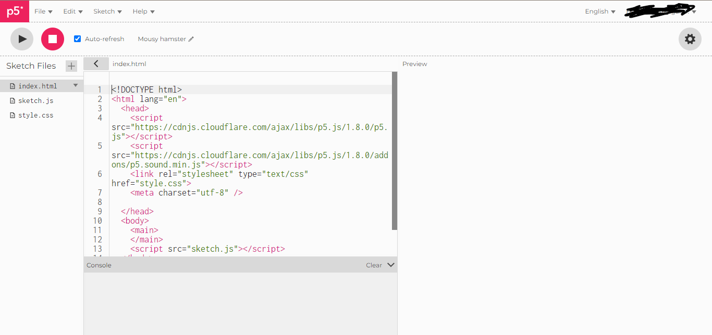
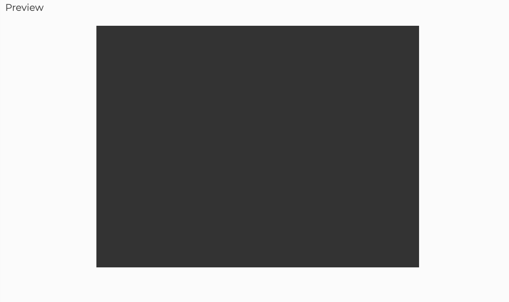
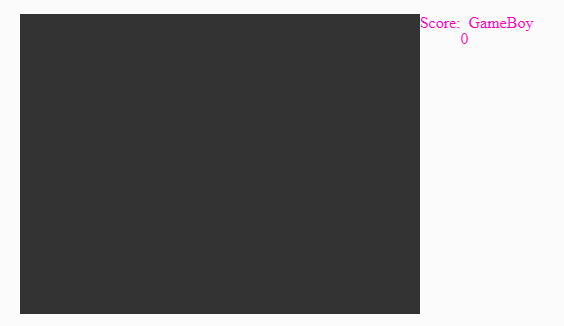
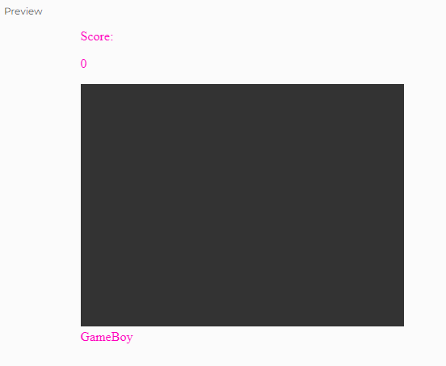

import Callout from "../../../components/Callout/index.astro";

This tutorial provides a practical approach to learning how to use the core concepts of p5.js and the [Document Object Model (DOM)](https://developer.mozilla.org/en-US/docs/Web/API/Document_Object_Model) by building a simple [Game Boy](https://en.wikipedia.org/wiki/Game_Boy) emulator in the [p5.js Web Editor](https://editor.p5js.org/). You'll learn how p5.js works with HTML and CSS, its architecture, and [`p5.Element`](/reference/p5/p5.Element) functions for creating and styling HTML elements. At the end of this tutorial, you will successfully develop a [retro-style](https://en.wikipedia.org/wiki/Retro_style) Game Boy emulator capable of running a basic snake game.

This tutorial is the first in a series of tutorials on [Web Design](https://drive.google.com/open?id=1UiEb9ujbVAuzg_WaLy22OVOH4zWuB-f3). Check out the [final sketch example](https://editor.p5js.org/ruthikegah/sketches/sf6K_7QzP) you will complete at the end of the [Web Design](https://drive.google.com/open?id=1UiEb9ujbVAuzg_WaLy22OVOH4zWuB-f3) tutorial series! 

At the end of this first tutorial, your sketch should look something like this:


## Prerequisites:

Before you begin you should understand or have:

- The desire, curiosity and willingness to learn and experiment are the most important prerequisites!
- How to use the [p5.js Web Editor](https://editor.p5js.org/) to create and save p5.js projects
- The final project in this tutorial requires that you understand the basic concepts of p5.js included in the [Variables and Change](/tutorials/variables-and-change) tutorial from the Introduction to p5.js tutorials chapter

This tutorial is designed for learners of all levels, so don’t worry if you’re new to coding – that’s what we’re here to guide you through!


## Project setup

#### Step 1 – Open the [p5.js Web Editor](https://editor.p5js.org/) on your browser and sign into your account



When you launch the p5.js Web Editor and click on the arrow on the text editor next to the file name `sketch.js`, you should see `index.html`, `sketch.js`, and `style.css` files like in the image above. Click the play icon in the upper left corner to see your result in the preview window. To see your changes in real-time, select Auto-refresh.

In order to save your progress, be sure to be logged into your p5.js Web Editor account. Rename  to “HTML and CSS practice” and save your sketch.


### HTML

The preloaded `index.html` file has a standard HTML5 document with `tags` `and` `attributes`.

```html
<!DOCTYPE html>
<html lang="en">
  <head>
    <script src="https://cdnjs.cloudflare.com/ajax/libs/p5.js/1.8.0/p5.js"></script>
    <script src="https://cdnjs.cloudflare.com/ajax/libs/p5.js/1.8.0/addons/p5.sound.min.js"></script>
    <link rel="stylesheet" type="text/css" href="style.css">
    <meta charset="utf-8" />
  </head>
  <body>
    <main>
    </main>
    <script src="sketch.js"></script>
  </body>
</html>
```

HTML, or [Hypertext Markup Language](https://developer.mozilla.org/en-US/docs/Glossary/HTML), uses [tags](https://developer.mozilla.org/en-US/docs/Glossary/Tag) to create [elements](https://developer.mozilla.org/en-US/docs/Glossary/Element) that you can see on a web page.  [Tags](https://developer.mozilla.org/en-US/docs/Glossary/Tag) can include two angle brackets (`< >`) for opening tags, or two angle brackets with a forward slash in the middle (`</ >`) for closing tags. Visit the [HTML basics](https://developer.mozilla.org/en-US/docs/Learn/Getting_started_with_the_web/HTML_basics) and [HTML layout elements](https://developer.mozilla.org/en-US/docs/Learn/HTML/Introduction_to_HTML/Document_and_website_structure#html_layout_elements_in_more_detail) articles to learn more about the nested structure of HTML tags.

In the default `index.html` file above:

- The `<!DOCTYPE html>` tag specifies the document type and version, which is HTML5.
- The `<html lang="en">` tag specifies the language of the document (in this case, `”en” `stands for English).
- Between the opening `<head>`  and closing `</head> `tags, there is metadata about the HTML document (in this case, `<script>`, `<link>`, and `<meta>` tags). 
  - The `<script>` tag loads [p5.js libraries](https://p5js.org/libraries/) for creative coding and sound
  - The `<link>` tag links your external CSS file, `style.css`,
  - The `<meta>` tag sets the [character encoding](https://developer.mozilla.org/en-US/docs/Glossary/Character_encoding) of the document to [UTF-8](https://developer.mozilla.org/en-US/docs/Glossary/UTF-8).
- Between the opening `<body>`  and closing `</body> `tags, all the contents that appear on a web page such as text, images, sections, etc. It also contains a `<script>` tag that loads your external JavaScript file `sketch.js,` and allows for the canvas to appear on your web page preview window.

[Tags](https://developer.mozilla.org/en-US/docs/Glossary/Tag) can be encoded with labels that allow us to style [HTML elements](https://developer.mozilla.org/en-US/docs/Web/HTML/Element) using [CSS (Cascading Style Sheets)](https://developer.mozilla.org/en-US/docs/Learn/CSS) in our `style.css` file. [HTML elements](https://developer.mozilla.org/en-US/docs/Web/HTML/Element) can be labeled by encoding [classes](https://developer.mozilla.org/en-US/docs/Learn/CSS/Building_blocks/Selectors/Type_Class_and_ID_Selectors#class_selectors) and [ids](https://developer.mozilla.org/en-US/docs/Learn/CSS/Building_blocks/Selectors/Type_Class_and_ID_Selectors#id_selectors) within the tags when they are created.

To demonstrate how the HTML and CSS are linked, you will create a `<div>` element with a unique id specified in the tag, and a `<p>` element within the `<div>` element. The [`<div>` element](https://developer.mozilla.org/en-US/docs/Web/HTML/Element/div) helps divide content into sections, and the` <p>` element generates paragraph text on a web page. When a tag is placed within another tag, it is called nesting with the outer tag referred to as the parent and inner tag referred to as the child. You can imagine that the nested structure of html can be illustrated with a tree diagram:

![A tree diagram with bubbles illustrating the nested relationships between html elements. Bubbles head and body are connected to a bubble for html above them. The div bubble is connected to the body bubble and is labeled “parent element” with an arrow. The p bubble is connected to the div bubble and is labeled “child element: with an arrow. The corresponding HTML code is displayed next to the tree diagram with p tags nested in div tags, which are also nested in body tags. Both head and body tags are nested in html tags.](../images/web-design/html-tree.png)

In this example the `<p>` element is a child of the `<div>` element. This means that it is nested within the `<div>` tags and creates a hierarchy in the Document Object Model (DOM) that link elements in a parent-child relationship. 

To learn more about HTML visit the [HTML basics](https://developer.mozilla.org/en-US/docs/Learn/Getting_started_with_the_web/HTML_basics),  [Get started with HTML](https://developer.mozilla.org/en-US/docs/Learn/HTML/Introduction_to_HTML/Getting_started), [What’s in the head?](https://developer.mozilla.org/en-US/docs/Learn/HTML/Introduction_to_HTML/The_head_metadata_in_HTML)  And the [Document Object Model (DOM)](https://developer.mozilla.org/en-US/docs/Web/API/Document_Object_Model) MDN learning modules.

For a list of HTML tags visit the [HTML elements](https://developer.mozilla.org/en-US/docs/Web/HTML/Element) MDN reference page.


#### Step 2: Adding ids to HTML elements

Add this code to the `index.html file `under the `</main>` closing tag and before the `</html> `tag:

```html
<!-- html, head tags-->

<body>

  <main>

  </main>

  <!-- Text in console -->
  <div id="Text">
    <p>This is a console</p>
  </div>

   <!-- Comment out the sketch.js file for now

   <script src="sketch.js"></script> 

    -->

</body>

<!-- ... body, html closing -->
```

In the code snippet above, we used comments to help us understand our HTML code. Comments in HTML begin with a right facing angle bracket, exclamation point and two m-dashes ( `<!-- `) and end with two m-dashes and a left facing angle bracket ( `-->`). Any text nested in between these will be skipped by your web browser and is a great way to organize and remind you of what code does! We used comments to comment out the `<script>` tag that incorporates the canvas for now so that it is skipped for this example. 

The `<div>` element has an `id` called `“Text”` placed in its opening tag `<div>.` The syntax for encoding ids on html elements in the `index.html` file is:

```
<-- gives Element an id -->

<Element id="id_label"></Element>
```

Where `<Element>` can be any HTML element, `id =` assigns an id to the element, and `id_label` is the string with the name of the id for that element.

Read more about HTML elements, ids and comments in the [Getting started with HTML](https://developer.mozilla.org/en-US/docs/Learn/HTML/Introduction_to_HTML/Getting_started#html_comments) and the [id HTML attribute](https://developer.mozilla.org/en-US/docs/Web/HTML/Global_attributes/id) MDN tutorial.


<Callout>
Create another `<div>` element that contains a header `<h1>` and a paragraph `<p>` as child elements.

[Example](https://editor.p5js.org/ruthikegah/sketches/eLPDlM0Qv)
</Callout>


### CSS

To style an [HTML element](https://developer.mozilla.org/en-US/docs/Web/HTML/Element) using [CSS](https://developer.mozilla.org/en-US/docs/Learn/CSS), you must select the element from your `index.html` file using a [selector](https://developer.mozilla.org/en-US/docs/Learn/CSS/Building_blocks/Selectors) in the `style.css` file. After the selector are a pair of curly braces where all the CSS style rules in the form of [property: value pairs](https://developer.mozilla.org/en-US/docs/Learn/CSS/First_steps/How_CSS_is_structured#properties_and_values) are placed. To style each element you must specify a CSS property, a colon (`:`), and a value for that property with a semicolon (`;`) at the end. 

For example, you can select an element by its tag, class, or ID, and use CSS declarations to define its styles. 

Below is the syntax for selecting elements using [element selectors](https://developer.mozilla.org/en-US/docs/Learn/CSS/Building_blocks/Selectors) in CSS:

```css
element {
  property: value;
}
```

Using element selectors selects ALL elements of that type in the html file.  

Below is the syntax for selecting elements by [class](https://developer.mozilla.org/en-US/docs/Learn/CSS/Building_blocks/Selectors) in CSS:

```css
.class {
  property: value;
}
```

Multiple elements, even different types of elements, can be part of the same class.

Below is the syntax for selecting elements by [id](https://developer.mozilla.org/en-US/docs/Learn/CSS/Building_blocks/Selectors) in CSS:

```css
#id_label {
  property: value;
}
```

Only one element can have a specific id. 

Visit the MDN reference for [CSS Syntax](https://developer.mozilla.org/en-US/docs/Web/CSS/Syntax), [CSS Selectors](https://developer.mozilla.org/en-US/docs/Learn/CSS/Building_blocks/Selectors), [How CSS is structured](https://developer.mozilla.org/en-US/docs/Learn/CSS/First_steps/How_CSS_is_structured#properties_and_values) to learn more about selectors, properties and values. A list of CSS properties can be found on the [CSS MDN reference](https://developer.mozilla.org/en-US/docs/Web/CSS/Reference).


#### Step 3 – Style your HTML elements with CSS selectors

Modify your `style.css` file so that it contains the following code:

```css
html, body {
  display: flex;
  justify-content: center;
}
/* Add this code to your styles.css file */
#Text {
  background-color: black;
  border-radius: 10px;
  color: white;
  padding: 20px;
  margin-left: auto;
  margin-right: auto;
}
```

The `html `and` body` selectors are separated by a comma so that all the [CSS rules](https://developer.mozilla.org/en-US/docs/Web/CSS/Syntax) in the curly braces apply to both elements. The `display` property has a value of `flex`, which turns the element into a [flex container](https://developer.mozilla.org/en-US/docs/Web/CSS/flex). This allows you to use the `flex` value for the `display` property for its child elements. Setting the `justify-content` property’s value to `center` horizontally centers the child elements within the flex container. This is particularly useful for aligning content right in the middle of the page, ensuring it looks tidy and centered in the browser window.

You can learn more about the [CSS Selectors](https://developer.mozilla.org/en-US/docs/Learn/CSS/Building_blocks/Selectors), [CSS flexbox layout](https://developer.mozilla.org/en-US/docs/Web/CSS/CSS_flexible_box_layout), [Flexbox](https://developer.mozilla.org/en-US/docs/Learn/CSS/CSS_layout/Flexbox), [display](https://developer.mozilla.org/en-US/docs/Web/CSS/display), [flex](https://developer.mozilla.org/en-US/docs/Web/CSS/flex), [justify-content](https://developer.mozilla.org/en-US/docs/Web/CSS/justify-content) and [How to center items](https://developer.mozilla.org/en-US/docs/Learn/CSS/Howto/Center_an_item) on the MDN reference pages. 

The `#` operator is used to specify a specific [id](https://developer.mozilla.org/en-US/docs/Web/HTML/Global_attributes/id) for one element with the name of the id `Text`. `#Text` selects the specific `<div>` in the HTML file that is labeled with `id="Text"`. As a result, the `<div>` is given a black `background-color`, `border-radius` to curve the edges, white text color, and some for [padding](https://developer.mozilla.org/en-US/docs/Web/CSS/padding) for spacing.  

Visit the MDN reference pages for [CSS basics](https://developer.mozilla.org/en-US/docs/Learn/Getting_started_with_the_web/CSS_basics), [margin](https://developer.mozilla.org/en-US/docs/Web/CSS/margin) and [padding](https://developer.mozilla.org/en-US/docs/Web/CSS/padding) to learn more.

Run the sketch and you will see your styled `<div>` appear in the preview window:


<Callout>
Add more [HTML elements](https://developer.mozilla.org/en-US/docs/Web/HTML/Element) to the page, then style them with [CSS properties](https://developer.mozilla.org/en-US/docs/Web/CSS/Reference). 
</Callout>


#### Step 4 – Create your canvas

Open a new project in the p5.js Web Editor, rename it “GameBoy Emulator Part 1” and save it to your sketches library.

Add the following code to your `style.css` file:

```css
html, body {
  display: flex;
  justify-content: center;
}
canvas {
  display: block;
}
```

Set up your canvas by navigating to your `sketch.js` file and add the following code:

```js
let winWidth = 400;
let winHeight = 300;
function setup() {
  // Create the canvas (adjust width and height as needed)
  let canvas = createCanvas(winWidth, winHeight);
}
function draw() {
  background(51);
}
```

Your canvas should look like this: 



In the code above, you declared the variables `winWidth` and `winHeight`, and initialized them with 400 and 300, respectively. These variables represent the initial width and height of the canvas.

The `setup()` function is called once at the beginning of a sketch, and is used to define the initial environment properties. This can include setting the screen size, background color, and loading the media you want to use in your project. The canvas [p5.Element](/reference/p5/p5.Element) object is stored in the variable `canvas`.

The `draw()` function runs in a continuous loop after the `setup()` function. Within this loop, the background color of the canvas is set to a dark gray shade using the `background(51)`. This function clears the canvas before each frame is drawn, maintaining a consistent background for an ongoing animation.

To learn more, visit the p5.js reference for [`setup()`](/reference/p5/setup), [createCanvas()](/reference/p5/createCanvas) and [p5.Element](/reference/p5/p5.Element)

<Callout>
Add a shadow to your canvas using a CSS property.

Hint: Search the web for "CSS box-shadow" and add styling to the canvas element in the` style.css` file.

[Example](https://editor.p5js.org/ruthikegah/sketches/w7wAb4zL-)
</Callout>


#### Step 5 – Add container `<div>` elements to the HTML with `createDiv()` 

Create `<div>` containers that will house the various components of your console (For example, the console, screen, logo, and buttons). Create a `<p>` element that will display the score for your game. Add ids to each element describing what they will be used for.

Add the following code to `setup()` under `createCanvas() `in the `sketch.js` file:

```js
// Inside setup():

// Create the Game Boy emulator container
let gameBoyEmulator = createDiv();
gameBoyEmulator.id("game-boy-emulator");
// Create the game container
let gameContainer = createDiv();
gameContainer.id("game-container");
// Create the score container
let scoreContainer = createDiv("Score: ");
scoreContainer.id("score-container");

//Create the score element in paragraph
let scoreSpan = createP("0");
scoreSpan.id("score");
// Create the Game Boy text
let gameBoyText = createDiv("GameBoy");
gameBoyText.id("game-boy-text");

// Create the button container
let buttonContainer = createDiv();
buttonContainer.id("button-container");

// Create the arrow buttons container
let arrowButtons = createDiv();
arrowButtons.id("arrow-buttons");
// Create the left and right buttons container
let leftRightButtons = createDiv();

leftRightButtons.id("leftRightButton");


// Create the action buttons container
let actionButtons = createDiv();
actionButtons.id("action-buttons");
```

To make the text easier to read on the web, use a more distinct color. Pink works better with this background. Add the following in your `html, body` selector in the `style.css` file:

```css
color: rgb(255,0,188);
```

Your preview should look like this:




### `p5.Element`

In this step, you use [`p5.Element`](/reference/p5/p5.Element) objects to create HTML elements. A `p5.Element` allows standard HTML elements to be added to the HTML in `sketch.js`. All HTML elements share the functions of the `p5.Element` class. Some of these elements include  [`createCanvas()`](/reference/p5/createCanvas), [`createDiv()`](/reference/p5/createDiv), [`createP()`](/reference/p5/createP) and [`createButton()`](/reference/p5/createButton). Some functions that can be used with `p5.Element` objects are [`.id()`](/reference/p5.Element/id),  [`.child()`](/reference/p5.Element/child), [`.style()`](/reference/p5.Element/style), [`.position()`](/reference/p5.Element/position) and [`.size()`](/reference/p5.Element/size).

In `setup()`, you declared a variable called `gameBoyEmulator` and assigned it to a new `<div>` `p5.Element` created with the [`createDiv()`](/reference/p5/createDiv) function. You then gave the `gameBoyEmulator` an id attribute `"game-boy-emulator"` by calling its `.id()` method.

Here is the syntax for adding an id to a `p5.Element`:

```js
variableName.id('idName');
```

`variableName` is the name for the variable that stores the p5.Element and `'idName'` is the name of the idea assigned to that element.

Similarly, you created another `<div>` element called `gameContainer` with the id attribute `"game-container"`. This `<div>` will house the game screen. 

You also created another `<div>` named `scoreContainer `with the id `score-container` and text that reads “Score” to host the score display. To display actual scores, you created the `scoreSpan` paragraph element using [`createP()`](/reference/p5/createP) with displaying an initial value of 0.

The `<div>` `gameBoyText` with the id `game-boy-text` was also created to contain the logo that reads `GameBoy`.

Finally, `<div>`s for the buttons were created using separate `<div>`s for arrow buttons and action buttons, that will be nested in button containers in the next step. Each `<div>` is given a unique id that describes each element: `button-container`, `arrow-buttons`, and `action-buttons`. 

A `<div>` for the left and right directional buttons with an id `leftRight-button` was created to help you align the navigation buttons in a cross shape in the next chapter.

<Callout>
Add a CSS rule set to change the text color.
</Callout>

#### Step 6 – Add p5.Elements to their respective containers

In `setup()`, add the following block of code under the action buttons container:

```js
// Select the page's body element and
// Return it wrapped in a p5.Element
let body = select('body');
// Add the gameboyEmulator to the body element
body.child(gameBoyEmulator);
// Add containers to the main container
gameBoyEmulator.child(gameContainer);
gameBoyEmulator.child(gameBoyText);
gameBoyEmulator.child(buttonContainer);

// Add elements to their respective containers
scoreContainer.child(scoreSpan);
gameContainer.child(scoreContainer);
gameContainer.child(canvas);
buttonContainer.child(arrowButtons);
buttonContainer.child(actionButtons);
```

The [`.child()`](/reference/p5.Element/child) function adds a `p5.Element` as the child of another `p5.Element`.

Here is the syntax for adding an element as a child to another `p5.Element`:

```js
childElement.child(parentElement);
```

Where `childeElement` and `parentElement` are the names for variables that store each HTML element.

The code block above shows a hierarchy where the `scoreSpan` is a child of the `scoreContainer`. Both the `scoreContainer` and `canvas` are children to the `gameContainer`. The `buttonContainer` holds both button container `<div> `elements.

The `gameContainer`, `gameBoyText`, and `gameBoyEmulator` are all nested in the `gameBoyEmulator` (the whole console container).

Your preview should now look like this:



The [`select()`](/reference/p5/select) function searches the DOM for elements and returns them. Use this to search for elements by element tag, class, and id. Calling `select('body')` returns the page’s `<body>` element. Now that we have access to the `<body>` element, we add `gameBoyEmulator` as a child.

To see how changes in your Javascript correspond to inline styling in HTML print out the `body` element in the console by typing this code in `setup( )`:

```js
console.log(body.elt);
```

`body.elt` accesses the resulting HTML elements that are nested within the `<body>` tags in the html page that is rendered in the preview. `console.log()` prints the elements in the console. Notice how all the p5.Elements you created are listed in the console, even though they do not appear in the index.html file. This is the power of JavaScript! We can create elements for the html file, and styles for the css file, all from the sketch.js file.

[Here is sample code](https://editor.p5js.org/Msqcoding/sketches/Eblr8BQLq) that prints nested elements from `<body>` in the console.

<Callout>
Read the p5.js reference pages for [`select()`](/reference/p5/select) and [`.child()`](/reference/p5.Element/child), then try to select all of your `<div>` containers.

[Example](https://editor.p5js.org/Msqcoding/sketches/xnssulBMz)
</Callout>


#### Step 7 – Style the containers

Set styles for the containers by adding the following in the `setup()` function:

```js
// Set styles for the Game Boy emulator container
gameBoyEmulator.style("background-color", "#8b8b8b");
gameBoyEmulator.style("border", "10px solid #000");
gameBoyEmulator.style("border-radius", "10px");
gameBoyEmulator.style("padding", "20px");
gameBoyEmulator.style("box-shadow", "0 0 20px rgba(0, 0, 0, 0.8)");
// Set styles for the button container
buttonContainer.style("display", "flex");
buttonContainer.style("align-items", "center");
buttonContainer.style("justify-content", "space-between");
buttonContainer.style("margin-top", "20px");
// Set styles for the arrow buttons container
arrowButtons.style("display", "flex");
arrowButtons.style("flex-direction", "column");
arrowButtons.style("align-items", "center");
// Set styles for the action buttons container
actionButtons.style("display", "flex");
actionButtons.style("align-items", "center");
```

You can style HTML elements with the [`.style()`](/reference/p5.Element/style) method. [`.style()`](/reference/p5.Element/style)  helps you set or retrieve the CSS style properties of a `p5.Element`. The arguments to [`.style()`](/reference/p5.Element/style) mirror a CSS declaration. 

The syntax for [`.style()`](/reference/p5.Element/style) is shown below:

```js
elementName.style("property", "value");
```

You can now remove the `color: rgb(255,0,188);` set in your CSS `html, body` selector since black is more visible on a light gray background.

After styling all `p5.Element`s, you should see this in your preview window:


The styling above gives the `gameBoyEmulator` container a gray background, a solid black border with rounded corners and padding for spacing and a shadow for a 3D effect. The `buttonContainer` is styled with flexbox, and  its children (buttons) are center-aligned and evenly spaced. A small margin is applied above the button container for even separation from other elements. The `arrowButtons` container is also a flex container. It is arranged in a column to stack the arrow buttons vertically and center-align them. Lastly, the `actionButtons` container is set to flex to align its children in a row. This creates a layout with a score in the top right. The "GameBoy" text is centered below the game screen canvas. Print the gameBoyEmulator.elt object in your console to see these changes to styles in Javascript correspond to the inline styling in HTML. 

Write the following code in `setup()` to view the nested hierarchy and styles you created:

```js
console.log(gameBoyEmulator.elt);
```

Let's explore some of the style properties and concepts used in styling the containers:

- [Box Model](https://developer.mozilla.org/en-US/docs/Learn/CSS/Building_blocks/The_box_model): The CSS box model explains the structure of every web page element as a rectangular box, which includes [`padding`](https://www.phpforkids.com/css/css-inner-workings-margin-padding.php) (space inside the border), [`border`](https://www.phpforkids.com/css/css-inner-workings-border.php) (the edge around the element), [`margin`](https://www.phpforkids.com/css/css-inner-workings-margin-padding.php) (space outside the border), and the actual content area itself. This model helps in designing and laying out web pages.

  

- [Dimension properties:](https://developer.mozilla.org/en-US/docs/Web/CSS/dimension) CSS dimensions properties, like `width` and `height`, set the size of an element’s content area. You can also use max-width and min-width, and max-height and min-height, to control how an element sizes. This keeps it looking good on diverse screens and in various content. Check out the MDN reference for [dimension properties](https://developer.mozilla.org/en-US/docs/Web/CSS/dimension) to learn more.

- [Alignment:](https://developer.mozilla.org/en-US/docs/Web/API/HTMLTableElement/align) The HTML alignment properties determine the positioning and alignment of content within an element or across the layout. They include `text-align` for horizontal text alignment, `vertical-align` for inline or table-cell content, and flexbox and grid properties like `justify-content` and `align-items` for advanced layout alignment within flexible and grid containers. Check out the MDN reference for [HTML Alignment properties](https://developer.mozilla.org/en-US/docs/Web/API/HTMLTableElement/align) to learn more.

<Callout title="Note">
Your Gameboy appearance in the preview may vary, depending on the screen size. CSS left-justifies the canvas. It aligns to the left of its parent. If the emulator elements exceed the width of the screen or window, the canvas will not center. It will seem to shift more to the left. You may need to adjust the CSS for different screen sizes. This is to keep the canvas centered, if that's the layout you want. Check out the MDN reference for [responsive screen design](https://developer.mozilla.org/en-US/docs/Learn/CSS/CSS_layout/Responsive_Design) to learn more.
</Callout>

<Callout>
Change the color of your Game Boy text to whatever you’d like!

[Example](https://editor.p5js.org/ruthikegah/sketches/EY6n18IRE)
</Callout>


#### Step 8 – Style the text

Finally, style and position text elements in the `setup()` function:

```js
// Add styles
scoreContainer.style("position", "absolute");
scoreContainer.style("margin-left", "340px");
scoreContainer.style("color", "#fff");
scoreContainer.style("margin-top", "5px");


// Add styles
gameBoyText.style("margin", "10px 145px");
gameBoyText.style("font-size", "25px");
gameBoyText.style("color", "#fff");
gameBoyText.style("background-color", "#0077b6");
gameBoyText.style("padding", "5px");
gameBoyText.style("border-radius", "5px");
```

In this step, the `scoreContainer` [`position`](https://developer.mozilla.org/en-US/docs/Web/CSS/position) is set to `absolute`, which allows you to position it relative to its parent `div`, `gameContainer`. When adding margins, pixels are relative to the edge of the `gameContainer` `<div>` and will not be affected by other elements that are added later. 

The `scoreContainer` has a left margin of 340 pixels to the right and a top margin 5 pixels below the edges of the `gameContainer` element. The color of the text is set to `#fff` which corresponds to white. This positions the score on the top left of the Game Boy Screen.

The `gameText` element is positioned under the `gameContainer` element with 10 pixel top and bottom margins, and 145 pixel left and right margins. These margins are relative to the bottom edge of the `gameContainer` `<div>`, since it is also a child element to `gameBoyEmulator`, and left and right edges of the parent `<div>` `gameBoyEmulator`. You also style the text with a white font (`color: white`), a font size of 25 pixels, and a light blue background (`background-color: #0077b6`). Finally, you added a `padding` of `5px` to create space inside the element, and a `border-radius` of `5px` to round off the corners.

Visit the [CSS property reference](https://developer.mozilla.org/en-US/docs/Web/CSS/Reference) for more ways to customize your GameBoy.

<Callout>
Search the web for other ways to style text using CSS, then apply those styles using `.style()`.
</Callout>

Good job! You have successfully created and styled HTML with p5.js. At this point, you should have a sketch that looks like this:


## Conclusion

Congratulations on completing the first part of this three part hands on tutorial series. Throughout this guide, you have learned how to manipulate HTML elements with p5.js by applying p5.Element functions and core programming concepts to create and style HTML elements. This tutorial not only bolstered your understanding of the p5.js architecture, but also walked you through the practical integration of HTML, CSS and Javascript to bring a sketch to life.

[Check out complete code](https://editor.p5js.org/ruthikegah/sketches/hRV_rPHC2) for this tutorial.


## Next steps

Move onto the next tutorial in this sequence: [Responding to Inputs](/tutorials/responding-to-inputs).


## References

- [HTML (Hypertext Markup Language)](https://developer.mozilla.org/en-US/docs/Glossary/HTML)
- [CSS: Cascading Style Sheets](https://developer.mozilla.org/en-US/docs/Web/CSS)
- [Tags](https://developer.mozilla.org/en-US/docs/Glossary/Tag)
- [Elements](https://developer.mozilla.org/en-US/docs/Glossary/Element)
  - [`<body>`: The Document Body element](https://developer.mozilla.org/en-US/docs/Web/HTML/Element/body)
  - [`<div>`: The Content Division Element](https://developer.mozilla.org/en-US/docs/Web/HTML/Element/div)
  - [`<p>`: The Paragraph element](https://developer.mozilla.org/en-US/docs/Web/HTML/Element/p)
- [Document and website structure](https://developer.mozilla.org/en-US/docs/Learn/HTML/Introduction_to_HTML/Document_and_website_structure)
- [HTML basics](https://developer.mozilla.org/en-US/docs/Learn/Getting_started_with_the_web/HTML_basics)
- [Get started with HTML](https://developer.mozilla.org/en-US/docs/Learn/HTML/Introduction_to_HTML/Getting_started)
- [What’s in the head?](https://developer.mozilla.org/en-US/docs/Learn/HTML/Introduction_to_HTML/The_head_metadata_in_HTML) 
- [Document Object Model (DOM)](https://developer.mozilla.org/en-US/docs/Web/API/Document_Object_Model)
- [Structuring the web with HTML](https://developer.mozilla.org/en-US/docs/Learn/HTML)
- [CSS Basics](https://developer.mozilla.org/en-US/docs/Learn/Getting_started_with_the_web/CSS_basics)
- [Learn to style HTML using CSS](https://developer.mozilla.org/en-US/docs/Learn/CSS)
- [Type, class and ID selectors](https://developer.mozilla.org/en-US/docs/Learn/CSS/Building_blocks/Selectors/Type_Class_and_ID_Selectors#id_selectors)
- [How CSS is structured](https://developer.mozilla.org/en-US/docs/Learn/CSS/First_steps/How_CSS_is_structured#properties_and_values)
- [CSS Syntax](https://developer.mozilla.org/en-US/docs/Web/CSS/Syntax)
- [CSS Selectors](https://developer.mozilla.org/en-US/docs/Learn/CSS/Building_blocks/Selectors)
- [CSS reference](https://developer.mozilla.org/en-US/docs/Web/CSS/Reference) 
  - [`display`](https://developer.mozilla.org/en-US/docs/Web/CSS/display)
  - [`flex`](https://developer.mozilla.org/en-US/docs/Web/CSS/flex)
  - [`justify-content`](https://developer.mozilla.org/en-US/docs/Web/CSS/justify-content)
  - [`padding`](https://developer.mozilla.org/en-US/docs/Web/CSS/padding)
  - [`margin`](https://developer.mozilla.org/en-US/docs/Web/CSS/margin)
  - [`position`](https://developer.mozilla.org/en-US/docs/Web/CSS/position)
  - [`font-size`](https://developer.mozilla.org/en-US/docs/Web/CSS/font-size)
  - [`border-radius`](https://developer.mozilla.org/en-US/docs/Web/CSS/border-radius)
  - [`color`](https://developer.mozilla.org/en-US/docs/Web/CSS/color)
- [Flexbox](https://developer.mozilla.org/en-US/docs/Learn/CSS/CSS_layout/Flexbox)
- [CSS flexbox layout](https://developer.mozilla.org/en-US/docs/Web/CSS/CSS_flexible_box_layout)
- [How to center an item](https://developer.mozilla.org/en-US/docs/Learn/CSS/Howto/Center_an_item)
- [Box Model](https://developer.mozilla.org/en-US/docs/Learn/CSS/Building_blocks/The_box_model)
- [CSS Dimensions](https://developer.mozilla.org/en-US/docs/Web/CSS/dimension)
- [Responsive Design](https://developer.mozilla.org/en-US/docs/Learn/CSS/CSS_layout/Responsive_Design)
- [UTF-8](https://developer.mozilla.org/en-US/docs/Glossary/UTF-8)
- [Character encoding](https://developer.mozilla.org/en-US/docs/Glossary/Character_encoding)
- [JavaScript](https://developer.mozilla.org/en-US/docs/Web/JavaScript)
