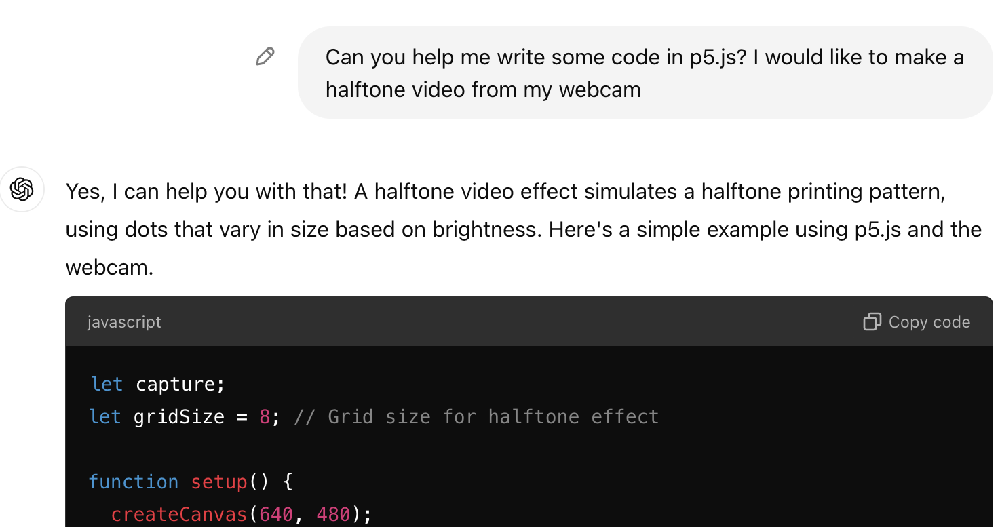

import Callout from "../../../components/Callout/index.astro";

## What are we making?

This tutorial teaches you how to use generative AI to write p5.js code — including tips and warnings. You'll also learn why critical perspectives on AI matter for artists and anyone creating with p5.js. Whether you're looking for more ways to work with p5.js or already using generative AI to help you write code, this tutorial is for you. 



## How to use it: Code-generating AI

You are likely familiar with text-generating AI tools like ChatGPT. They might seem like they are channelling human brilliance, but they actually just use statistics. They predict what word, character, or pixel is most likely to appear next, based on having analyzed vast data that came before. 

They do this so convincingly that they can even generate code. You might ask, why not have it write all my code for me? If it can do that, why do I even need tutorials like this one? 

Well, there are caveats: It is far too easy to end up with faulty code, biased code, and boring code. 

In this tutorial, we will walk through the process of p5.js-style creative coding Using a code-writing AI text-generator. Along the way, we will share tips, warnings, and critical considerations about how we use AI. These comments will be flagged "Try This!" for tips, "Warning" for cautions, and "Critical Context" for mindful reflections. 

This tutorial is Part 1 in a series of four tutorials that focus on using AI creatively and thoughtfully. Feel free to adapt them for your own critical exploration of AI systems: 

- Part 2: [Critical AI Prompt Battle](./criticalai2-prompt-battle/)  
- Part 3: [Sentiment Training Dataset Explorer](./criticalai3-sentiment-dataset-explorer/)  
- Part 4: [The No-AI Critical AI Chatbot](./criticalai4-no-ai-chatbot/) 

## How to make it

### Step 1. Describe your idea

Pick something you'd like to create with p5.js. Write down your idea for yourself, with as many details as you can imagine. Try to describe it in a few different ways: How does it look? What does it do? How does it work? 

For this example, I chose to make something I imagined but that I haven't been able to find elsewhere. I'll write it as a basic prompt to GPT like this: 

`Convert webcam video to a halftone look where the dot size is based on the darkness in that area of the image.`


<Callout>
Keep the project scope small to start. Do you have different versions of the idea, a simpler version and a more complex one? Write them out separately. For example, here are some other features that would be nice to include, but let's wait to add them later:  

`- Output as a GIF`   
`- Make 2-color halftone pixels instead of grayscale`

I may also find that as I code I think of more ideas.
</Callout>

You can follow along with this example in the [p5.js Web Editor](https://editor.p5js.org/sarahciston/sketches/LiHcPXdv1), and you can also follow the [chat thread](https://chatgpt.com/share/67094820-dc28-8003-bd34-14cc1e7b4572) used to create it.

<Callout title="Critical Context">
When will you choose to use GPT tools for your project, and when will you skip them? A ChatGPT query requires almost 10 times as much electricity as a Google search (O'Brien 2024). Sometimes the code challenge is something you can easily find on Google or StackOverflow. Sometimes it's better just to call a friend and figure it out together!
</Callout>

### Step 2. Gather your tools

Start by logging into your preferred chat-based AI tool. Some options include [OpenAI's ChatGPT](https://chat.openai.com), [Replit Ghostwriter](https://replit.com/), [Blackbox.ai](https://www.blackbox.ai/) — each of these have limited free access, but there is a lot you can do even with the free versions. 

<Callout title="Warning">
Make sure you are using a free tier if you don't want to be charged. While some paid tiers use more advanced models compared to the free versions, you should still be able to create a strong project without spending any money.   
</Callout>

<Callout title="Critical Context">
Unfortunately none of these AI tools are open-source, and (at the time of this writing) I don't know of any open-source or open-data AI tools for coding. These closed-source, proprietary tools often use data scraped from open-source platforms like GitHub in order to train their tools. 
</Callout>

<Callout>
In addition to accessing these AI tools from their web interfaces, you can also use some of them from inside IDEs (coding programs like Microsoft Visual Studio) by downloading an extension or widget. This has advantages and disadvantages. 

For example, IDE widgets can offer autocomplete suggestions for you as you code. This may help you find a function name you want to use, but it can also overdetermine the direction of your project. It might steer you toward programming solutions that are incorrect or unhelpful. In other tutorials in this collection, we will use p5.js and the APIs (Application Program Interfaces) of various AI tools to create our own custom interface, which is a third option for using AI tools besides the web interfaces and IDE widgets. 

Learning to manipulate existing tools, or make our own tools, beyond the standard presets available? That's what p5.js is all about!
</Callout>

<Callout title="Warning">
Text-generating AI are created by scraping publicly available code from platforms like GitHub and StackOverflow. This means the generated code you'll output comes from other coders like you. So it is not perfect, it is not unique, and it is not guaranteed to work. And remember, if you are using Github along with these AI tools, it is very difficult to protect your own code from also being scraped and used to train the next AI tool.
</Callout>

With all this in mind, once you've picked your tools, you can begin by prompting the same way you would a plaintext chat prompt. For this example, we are using the free plan for ChatGPT, running the GPT-4o model.

### Step 3. Prompt GPT to generate some p5.js code

Pause. 

Rather than prompting ChatGPT with your whole project idea at once, let's break it down into parts. It's okay if you don't know every part of the process you want to create — that's why we're asking for help. 

We do this to understand more about what we are trying to make, and so that we receive less generic code more tailored to our project. 

Don't forget to tell it we're coding in p5.js!

`Help me code a project in p5.js. I'd like to describe features and then have them added please.`  
`- First, import webcam video`  
`- Convert video to pixels`  
`- Turn pixels into dots`  
`- Change dot size based on the brightness and contrast of the pixel`

<Callout>
Try writing the steps out in pseudocode, where you describe the steps of coding it without actually writing the code. This breaks your steps into smaller, more programmatic steps. For example, I could change the video processing steps to read: 

`- Import webcam video`  
`- Access each frame of the video`  
`- Convert each video frame to pixels`  
`- Make each pixel of each frame into a dot`  
`- Convert the dots to grayscale`  
`- Make dot size based on how dark they are. Darker pixels will have larger dots, while brighter pixels will have smaller dots.`
</Callout>

<Callout>
Type out, run, and compare the code at each step. This may also help you learn more about how the code works interactively, and give you new ideas to try.

Review the answers it provides before you decide to use them. The code may include more advanced techniques than you know or than you actually need for your problem. 
</Callout>

<Callout title="Critical Context">
Also, its solution may not be the right solution for you. How does your pseudocode compare to the steps it took? There's always more than one way to solve a problem.
</Callout>

### Step 4. Adapt the code to your needs

Bring the output code results into the p5.js Editor or your IDE of choice. Retype the code by hand; don't cut and paste if possible. This will help you make sure you understand it and that it fits into your project.

<Callout>
Don't assume it works. Use your own knowledge to adapt it, and don't be afraid to rework it to suit your project's needs. 

It may not run the way you want it to; it may not run at all at first. Trust your coding skills and don't be afraid to tinker with it.
</Callout>

<Callout title="Critical Context">
Make sure to cite ChatGPT and any other AI whenever you use them for writing code (or making any other creative work). Include the date it was prompted and if possible the prompt. You can also include the version of the model if you know it and any other details relevant to how you used the system. This is helpful for future readers of your code who want to understand how you made it. Also, it is an important habit to cite any code or examples you draw from — human or otherwise — even if you end up rewriting the code. 
</Callout>

### Step 5. Ask follow-up questions

If you don't understand aspects of what the program is doing, you can ask ChatGPT for help and clarification. Try pointing to a specific line in your program and ask what it does. You can also prompt ChatGPT to explain how a general concept works or how it is implemented.

<Callout>
Generative AI can also help explain concepts in code you find elsewhere or can help troubleshoot code you write. Try asking why your code isn't working properly.
</Callout>

It still may not have the right answer. Try asking about small sections. Try asking in different ways. Don't assume additional code or answers work either. Don't trust GPT more than yourself. Don't even trust it more than Wikipedia. 

<Callout title="Critical Context">
Be aware of bias, fairness, representation, as with all generated text. One way to help address bias is to work with other people, not only bots. We're all fallible, but incorporating other perspectives helps us see the gaps in our thinking.
</Callout>

### Step 6. Combine ChatGPT and your own capabilities to enhance your project

You can try prompts that add changes to the code you generated before. This might include addressing bug fixes, adding additional features, making aesthetic adjustments, or anything else. 

For the halftone video, I'd like more control over the look of the video, so let's try a couple of prompts. First, let's make the basic tone of the image adjustable, by trying this prompt and adjusting our code:

`Make brightness and contrast adjustable with sliders`

After asking ChatGPT to help you make adjustments, your program still might not look right to you. But you should feel empowered to make adjustments on your own to make it exactly what you want. Go ahead and read through the code (you typed it in yourself, right?) to look for how you might customize and expand on it. 

For example, if the halftone dots look too big overall, play with the value for the global variable `gridSize`. A lower number creates a generally finer-resolution image.

You could also try making it more colorful: 

`Make 2-color halftone pixels instead of grayscale`

Interestingly, this still looks gray, because the two colors GPT chose for our pixels were black and white! Rather than ask GPT again, let's see if we can do it ourselves. 

Find the line of code that says `let fillColor = isDark ? 0 : 255;` . This determines the two colors it uses to fill the dots. Let's try changing them by first creating some new fill colors, then updating the `fillColor` variable:

```js
// let fillA = color(0,0,0) //black
// let fillB = color(255,255,255) //white
let fillA = color(255,0,0) //red
let fillB = color(0,255,0) //green
let fillColor = isDark ? fillA : fillB;
```

You can also change the background from gray to black or white, so it pops more.

```js
function draw() { 
   background(255)   
...}
```

<Callout title="Warning">
Case in point: GPT is fallible. I noticed that when we added the two-color feature, GPT seemed to have lost the original request we gave it to make the pixels different sizes. In fact, the variation was very tiny because I had set grid size was small. Being able to read through both the code and also my prior conversation with the bot helped diagnose the problem and helped me find a solution I preferred. Watch out for things like this, and use your own coding abilities to combine the solutions it gives you into the actual solution you need. 
</Callout>

Now let's add an additional feature, so we can output our videos as GIFs. Here ChatGPT actually gets it wrong, offering complicated and ineffective code, but p5.js has a simple built-in function called [`saveGif()`](https://p5js.org/reference/p5/saveGif/). You can add this code at the bottom of your sketch:

```js
function keyPressed() {
  if (key === 's') { 
	saveGif('halftoneGif', 3);  
  }  
}
```

In this example, `s` is the key to press to save a GIF, `halftoneGif` is the name of your saved GIF and `3` is the number of seconds it will capture.

<Callout title="Critical context">
Now that you have an example of ChatGPT-generated halftone videos, how does the result compare to the vision you imagined? How would you modify it to look more like you imagined, or build off what you have to create something new? If you were writing this "from scratch" how would solve this same problem in a different way? 
</Callout>

<Callout>
Keep experimenting. Work modularly to put smaller pieces together into bigger parts. Toggle back and forth between using ChatGPT and other resources. Explore different methods to find where you need to go.
</Callout>

### Step 7. Try many different ways to interact with ChatGPT critically and creatively

Besides generating new code, you can use ChatGPT and tools like it to do lots of other things related to creative coding. In a study of how computer science students used ChatGPT, the most common tasks were: 
* to have it explain programming concepts that you'd like to understand better
* to have it give code examples to help illustrate those concepts 

It was also used to interpret error messages and for checking existing code to help you optimize, debug, or clarify a particular section (Ma 2024). 

For example, you might experiment with a prompt like: `Here is a piece of p5.js code. Please offer ideas for making it run more efficiently…` Then paste in your code.

The students in the study also cautioned that "ChatGPT may not always give the correct answers or answers they needed, particularly in the context of programming, where multiple solutions exist" (Ma 2024, 6). 

### Step 8. Bonus: Use code generating as a creative springboard

Instead of prompting GPT to generate code, have it prompt *you* to code instead. Ask it for quick code exercises that can spark your imagination, or drills that help you practice your skills. Then you create the code. For example: 

`Please compose prompts for creative coding exercises using p5.js that help me learn about making web pages` 

<Callout>
Use code generators to help you be more creative and go deeper with coding, rather than to help you skip the time it takes to engage with code and learn. You can use these techniques for working with p5.js, other programming languages, and also when generating non-code text. Let it empower you to learn more!
</Callout>

## Takeaways

### Critical use of AI in creative coding

This tutorial emphasizes being mindful of generative AI as source material. We cannot assume AI is correct, because its results are gathered from millions of crowd-sourced pieces of text. Generative AI's biases are not flaws to be eventually optimized out; rather, the issues are fundamental components of how AI is designed.

This is similar to how we have learned to read Wikipedia critically, rather than believing it works like a traditional encyclopedia. Just as you seek additional, alternative sources when relying on Wikipedia, don't rely solely on ChatGPT for your programming or other kinds of information. 

Generative AI can be a useful tool to help you learn quickly if you already have some basic coding skills. It may not be right for total beginners, it won't replace the jobs of experts, and it shouldn't be used as anyone's only tool. 

When you need something to “just work” — and you don't want to harm the environment — don't pull up ChatGPT. Call a friend. 

### What is 'critical' about Critical AI?

Critical does not mean negative, but thoughtful, adopting a variety of perspectives. Critical perspectives help us make technical and creative choices that match our values and our goals. They help us be mindful of and responsible for, and adaptable to the impacts.

Using AI critically means understanding more about where its outputs come from and how they are made. This is part of learning practical skills for working with AI in each of these tutorials. 

It also means keeping in mind the impacts of AI, by understanding AI tools as part of complex systems that are both social and technical. AI also emphasizes specific concerns including data exploitation, labor exploitation, misinformation, discrimination, and environmental impacts (see Atairu 2024).

As Professor Amy Ko argues: “Critical perspectives accept that CS has great potential and power to shape individual lives, but also question the application of that power, ask who has that power, ponder how that power should be distributed, and insist on the responsibility of those who possess it.” (Ko et al. 2024).

## Acknowledgments

These tutorials were created as part of Google Season of Docs 2024. Mentor: Emily Martinez. Advisor: Minne Atairu.

## References

Atairu, Minne. 2024. "AI for Art Educators." *AI for Art Educators*. [https://aitoolkit.art/](https://aitoolkit.art/)  

Ko, AJ, Beitlers A, Wortzman B, et al. 2024. *Critically Conscious Computing: Methods for Secondary Education*. [https://criticallyconsciouscomputing.org/](https://criticallyconsciouscomputing.org/)  

Ma, Boxaun, Li Chen, and Shin'ichi Konomi. 2024. “Enhancing Programming Education with ChatGPT: A Case Study on Student Perceptions and Interactions in a Python Course.” *arXiv*. [http://arxiv.org/abs/2403.15472](http://arxiv.org/abs/2403.15472).  

ml5.js “Ml5.Js | Friendly Machine Learning for the Web.” [https://ml5js.org/](https://ml5js.org/)  

OpenAi. “Chat Playground.” [https://platform.openai.com/playground/](https://platform.openai.com/playground/)  

O'Brien, Isabel. 2024. “Data Center Emissions Probably 662% Higher than Big Tech Claims. Can It Keep up the Ruse?” *The Guardian*, September 15, 2024, sec. Technology. [https://www.theguardian.com/technology/2024/sep/15/data-center-gas-emissions-tech](https://www.theguardian.com/technology/2024/sep/15/data-center-gas-emissions-tech)  