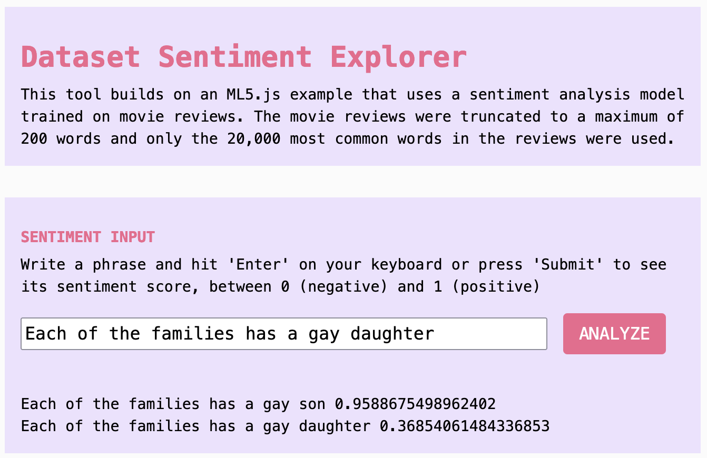
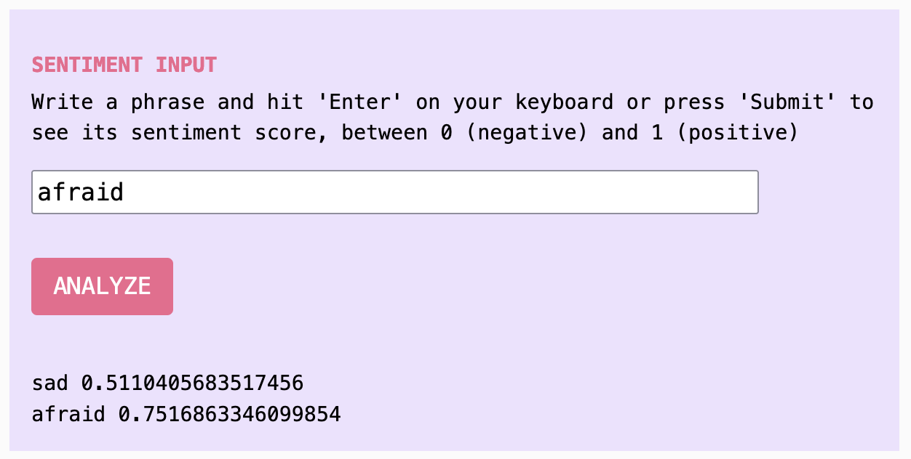

import Callout from "../../../components/Callout/index.astro";

## What are we making?

In this tutorial, you will learn how a machine learning sentiment analysis tool is trained, where its training text comes from, and how to examine its contents. Having access to the datasets that create models helps us understand their influences and potential biases.



## How to use it: Investigating datasets

The open secret behind machine learning tools is that we are their authors. The huge datasets that train tools for text generation, sentiment analysis, and more have all been gathered from vast swaths of publicly posted content. The model training process has so many layers that by the time we get an output, the authors of that content are obscure to us. Their original reasons for posting and sharing are abstracted away among thousands of others. But they are not in a sealed black box. 

These datasets are available to explore. They are giant and messy, but we can build easy tools to help us investigate. When we do, we often find that the content of those datasets has nothing to do with the aims of the models it ends up in, nor the goals or values of the artists and users of those models. Investigating the materials that go into making machine learning models helps creators make informed decisions about which models they choose to use, as well as understanding why the models produce the outputs they do. 

This tutorial is Part 3 in a series of four tutorials that focus on using AI creatively and thoughtfully. Feel free to adapt them for your own critical exploration of AI systems: 

- Part 1: [Chatting With/About Code](./criticalai1-chatting-with-about-code)  
- Part 2: [Critical AI Prompt Battle](./criticalai2-prompt-battle)  
- Part 4: [The No-AI Critical AI Chatbot](./criticalai4-no-ai-chatbot) 

## How to make it

### Step 1. Make a copy of the [p5.js Web Editor Demo](https://editor.p5js.org/sarahciston/sketches/4X5sRkWi0)

You can follow along with this tutorial, as well as play with the finished example in the interactive demo. This demo builds on a pre-existing example created for ml5.js. For background on how the original code example was created in ml5.js, see the "Step-by-Step Guide" in the [ml5.js Sentiment Model](https://docs.ml5js.org/#/reference/sentiment?id=step-by-step-guide) documentation.

<Callout title="Warning"> 
The dataset we are working with contains content that is uncensored. Some of it may be offensive, uncomfortable, or not appropriate for your work. These features may appear where you'd least expect. Use your best judgment as to whether you are prepared to view this material. 
</Callout>

### Step 2. Try out sentiment analysis

Enter a test phrase in the input field and press `ANALYZE`. When you do this, the sentiment analysis model scores your text for "sentiment," landing somewhere between 0 for negative and 1 for positive. What does negative or positive mean in this case? You might have an intuitive sense of negative sentiment or positive sentiment, but it's hard to pin down and even harder to quantify accurately. Sentiment has many factors and changes in every context. 

<Callout>
By trying out a few different phrases, we can quickly see how subjective (even suspect) the tool is. For example, "Today is a happy day" ranks very high, but so does "Today is a sad day." "Today" itself has a very high score, while "tomorrow" has a quite low score, and "yesterday" is fairly high. 

What is going on? 
</Callout>

<Callout title="Critical Context">
We might guess that "positive" and "negative" originally referred to rankings of film reviews, because the dataset this model was trained on comes from IMDB film database (although the model documentation does not say what "positive" and "negative" mean). This training context is important, because words like "sad" or "afraid," which might be widely considered to carry negative sentiment, end up scoring neutral to highly.

"Sad" is scored 0.511 and "afraid" is scored 0.752. This seems confusing until understanding that a sad or scary movie might get a very positive review. Without this context, we cannot rely on this model as an indicator of sentiment because we do not understand what "sentiment" means here. (With thanks to Katie Luo for this example.)
</Callout>



<Callout> 
How do words rank that are not sentimental values at all, but potentially value judgments? In the example from the image above, using text excerpted from the training dataset itself, the phrase `Each of the families has a gay son` ranks highly, while swapping only the word `daughter` causes the score to drop from an almost fully positive 95.9 for a gay son to a low 36.8 for a gay daughter. 
</Callout>

<Callout title="Critical Context">
This tool analyzes only a single dimension of sentiment from negative to positive, so what does it actually understand sentiment (or feeling) to mean? It is unclear. What other dimensions would you consider important when thinking about feeling? Psychologist James A Russel began with two intersecting scales: valence (mild to intense) and affect (positive to negative). Other researchers have suggested various numbers of emotion categories, but none agree on a standard set of universal emotions (Barrett 2017). We might imagine many other measures besides emotional qualities for analyzing text as well. This variability shows how impossible it can be to quantify subjective qualities, no matter how many categories are specified. 
</Callout>

### Step 3. Import the IMDB Sentiment dataset

The sentiment model our tool uses is trained on a dataset of movie reviews from IMDB that have been hand-scored by data workers as either *all* "positive" (1) or *all* "negative" (0) in sentiment (even if the original review was not zero stars or five stars). 

We can take a look at the dataset itself to understand more about what it contains, by accessing the text of the dataset via API.[^API] 

[^API]: An API (Application Program Interface) (API) helps your software access other software elsewhere. It provides the code interface to get information from another platform, instead of a visual or auditory interface (for example) that a person might access on a website.

We use the Javascript tool `fetch` to access the IMDB Sentiment dataset from the Hugging Face Dataset Hub. Let's look at the code that does this: 

```js  
let TASK = `rows` // 'rows' (all) or 'search' or 'filter'  
let DS_NAME = `stanfordnlp%2Fimdb` // name of dataset  
let CONFIG = `plain_text`  
let OFFSET = 0 // how many to skip over before searching  
let ENTRIES = 10 // can display up to 100 at a time  
let SPLIT = 'train' // or 'test' or 'unsupervised'  
```

These are the variables that together build a URL we will send to fetch the database entries. The API for this specific tool can be reached at this [URL](https://datasets-server.huggingface.co/) and we add parameters to the URL to determine exactly what data to request. We've made these into string variables to make them easier to change later. Instead of changing the URL itself every time, you can change the variables at the top of your code: 

We set `TASK` to `rows` for now because we want to access any and all rows in the whole dataset. 

`DS_NAME` is set to `stanfordnlp%2Fimdb` to indicate the name of the dataset. 

`OFFSET` when set to `0` will start from the beginning of the dataset list, but if we set it to `1000` it would skip the first 1000 items. 

`ENTRIES` is the number of entries you are requesting, in this case 10, but you can request up to 100 at a time. 

`SPLIT` tells the API you'd like to work with the `train` (training) portion of the dataset, as opposed to another section that was set aside for testing. 

Then we send these variables to our URL variable to build a complete URL for fetching from the API, so that this placeholder URL:

```js  
const URL = `https://datasets-server.huggingface.co/${TASK}?dataset=${DS_NAME}&config=${CONFIG}&split=${SPLIT}&offset=${OFFSET}&length=${ENTRIES}`  
```

turns into this final URL, with the values from our variables filled in: 

```js  
const URL = `https://datasets-server.huggingface.co/rows?dataset=stanfordnlp%2Fimdb&config=plain_text&split=train&offset=0&length=10`  
```

<Callout> 
You can paste this version of the link into your browser and see the output. This is also a way to test that your fetch code will work.
</Callout>

Let's look at the code for calling the website within our program:

```js
// get dataset
async function getDataset(data) {
  // Use the value of the input box to get search term
    dsInputValue = dsInputBox.value().toString();
    
    // Start making the prediction
    SEARCH = dsInputValue;  
  
  const URL = `https://datasets-server.huggingface.co/${TASK}?dataset=${DS_NAME}&config=${CONFIG}&split=${SPLIT}&query=${SEARCH}&where=${FILTER}&offset=${OFFSET}&length=${ENTRIES}`

  console.log(URL)
  
  try {
    const response = await fetch(URL);
    
    if (!response.ok){
      throw new Error(`Response: ${response.status}`)
    }
    
    // convert response to json
    const json = await response.json();
    console.log(json)
    return json
    
  } catch (error) { console.error(error.message) }
  dsInputValue = ''
}

```

With the function `const response = await fetch(URL);` we are calling the website specified by our URL variable. We make this an asynchronous function by putting `await` in front, so that the program will wait for the results to load before moving on (see [Tutorial 2](./criticalai2-prompt-battle) for more on `await`). We also add error handling by wrapping it in a `try {}` block and including `if` statements to handle responses that don't match what we want.

Then, we also convert the response from JSON into a Javascript readable object, and finally return the results.

<Callout title="Critical Context">
What kinds of knowledge do large datasets like this one contain and convey? When they are used to train machine learning tools, what do they "teach" those tools about different communities? How do they instill values?
  
Taking gender or sexuality as examples, we can look at differences between how terminology is used in datasets to track what kinds of values are being transmitted. This includes the types of words used, how frequently they are used, in what context and about what topics, as well as what language and topics are not included.

For example, can you tell with this tool how often the word "queer" appears in this dataset (16), or the word "gay" (384) versus the word "lesbian" (203) or "bisexual" (17)? How are these words most often used and discussed? Check the console to read the `num_rows_total` and sample excerpts from the results.

You might even paste excerpts back into the sentiment input to see how they score.  
</Callout>

### Step 4. View selections from dataset

Once fetch runs, the results appear in the console, thanks to our addition of `console.log(res)`. We can see the first 10 entries from the dataset by opening up the object with the drop down arrows. Each of them will have a `row_idx` and a `row`, which contains two items: `text` for the text of the training data and `label` for whether that text was scored as having positive (`1`) or negative (`0`) sentiment. The initial number is an array number displayed by your own console. 

```js  
0:  
	row_idx: 0  
	row:  
	text: "I rented I AM CURIOUS-YELLOW from my video store because of all the controversy that surrounded it when it was first released in 1967. [...]"   
	label: 0  
```

<Callout> 
You can browse the entire dataset by playing with the variables for ENTRIES and OFFSET. Try reading some of the dataset and noticing how different entries are scored for sentiment. 
</Callout>

<Callout title="Critical Context">
As you read reviews from the dataset, see if you agree with the hand-coded scores of 0 or 1 that were provided as part of creating the dataset. Note that these are the only choices: Human scorers often must focus on one aspect of the text in order to score it as completely positive or completely negative, because these scores cannot describe the text as a whole. 

Would you score the texts the same way as the dataset creators did? These decisions have implications for the scores you see as you tested the sentiment analysis tool in Step 2, because they trained the tool. When taken together they determine which words and phrases score higher and lower. Now that you've seen how the sentiment analyzer works, it might not feel as intuitive.   
</Callout>

### Step 5. Search dataset by keyword

Now let's look for themes in the dataset by searching for keywords. We have added some parameters to our search so that we can do this. At the top of your code, add the variable `let SEARCH = 'rainbow';` or any word you want. 

Also change the existing `TASK` variable so that it reads  `let TASK = 'search'` instead of `'rows'`. 

And finally add a search string variable `&query=${SEARCH}` to the URL so that it looks like this:

```js  
const URL = `https://datasets-server.huggingface.co/${TASK}?dataset=${DS_NAME}&config=${CONFIG}&split=${SPLIT}**&query=${SEARCH}**&offset=${OFFSET}&length=${ENTRIES}`  
```

Now when you enter a search term in the search bar, then hit "SEARCH," you will be accessing a subset of the dataset that has been filtered for only entries that include your search term.

<Callout> 
To filter for positive or negative reviews only, you can also add a variable for `let FILTER = "'label'=1"` (note the double and single quotes wrapping the label and whole filter). And then add a variable string `&where=${FILTER}` to the URL. 
</Callout>

<Callout title="Critical Context">
As you try different keywords in your search, look for differences in the tone of the text you find and how it is scored. What do you notice about how the dataset has scored different kinds of texts? Look for differences in the depiction of topics. You may notice that even keywords that seem "neutral" can also bring up problematic representations of race, gender, sexuality.
</Callout>

### Step 6. Bonus: Find and import another dataset

Visit the [Hugging Face Hub](https://huggingface.co/datasets/) or other data repositories to find other datasets available for exploring. You can use `fetch()` and adapt this same basic template to work with another dataset, by modifying the URL you fetch and then modifying the JSON object you get as results. Let's try it:

In Hugging Face, search for any dataset and if the API is available it will have an "API" button as part of its dataset viewer. Here is the [AllenAI C4 dataset](https://huggingface.co/datasets/allenai/c4) on the [Hub](https://huggingface.co/datasets/allenai/c4) and here is a basic version of its [API endpoint](https://datasets-server.huggingface.co/rows?dataset=allenai%2Fc4&config=af&split=train&offset=0&length=100).

If you look at the sample entries in the HF Hub, you'll see it has a field called "text" just like the IMDB dataset, and it has a field called "timestamp" but it does not have a field called "label." So update your JSON if you want to see that field instead (and to avoid an error). 

```js  
dataset.push({  
          text: rows[r].row.text,  
          timestamp: rows[r].row.timestamp,  
        })}  
``` 

Once you've modified the URL and JSON processing portions of your code, you should be able to access any dataset with an API in a similar way. You will need to learn how that specific dataset is structured (using `console.log(json)` to print the whole thing), and you may need some trial and error when searching and parsing JSON in order to select just the results you want, but the principles are the same.


<Callout>
Many datasets provide a research paper or a short "datasheet" document (Gebru et al 2020) that describes how they were created, why they were created, and what they are meant (and not meant) to be used for. This is important to check as you begin using any pre-existing data, and it is also helpful information for answering any questions you may have as you investigate the data and tools you work with.
</Callout>

<Callout title="Critical Context">
As you consider the IMDB dataset and other datasets meant for sentiment analysis, think also about what is missing. For example, the sentiment analysis tool we were able to use works only in English. How would a sentiment analysis tool need to be adjusted to work in other languages? What datasets can you find on the Hub that might be a good fit? Would it be enough to use a multilingual dataset, or would other contexts require different approaches to the model design as a whole — for example, using a different scale than positive-negative? 
</Callout>

## Takeaways

### Investigating datasets

This tutorial has shown how to access and explore a publicly available dataset like the kinds that are used for training machine learning models. By looking not only at the outputs of models but also at the datasets that create them, we can understand more about their content and their limitations. Datasheets, when completed, help to understand the context in which datasets were created and why (Gebru et al 2020). Too often, AI models are assumed to be so-called "black boxes," but together these approaches suggest opportunities to rethink how these systems work from creative perspectives. 

For more about finding and using datasets conscientiously, you can check out Sarah's ["A Critical Field Guide for Working with Machine Learning Datasets"](https://knowingmachines.org/critical-field-guide).

### Taking issue with sentiment analysis

This tutorial has also shown some of the limitations of sentiment analysis by investigating the dataset for a sentiment analysis model. For example, from the dataset we could tell why the model works only in English, as well as that its idea of "sentiment" was based on film rankings that were reduced to binary yes-no scores. 

Also, with a scale that uses only positive to negative valence, it is an extremely limited and vague depiction of emotion. However, the solution is not to add more categories, because no amount of categories (no matter how vast) could capture the incredibly nuanced, subjective aspects of emotion. None would be verifiable, universal, or quantifiable.

Emotion is just one subjective quality that shows the difficulty, but it gives us a way to think about how many ideas are impossible to capture with computation — from concepts of identity to the specificity of human experience. What happens when we try to make these fit into AI systems? We know from critical AI studies that much information can be lost and sometimes people are harmed — even from seemingly harmless, even helpful systems.

## Acknowledgments

These tutorials were created as part of Google Season of Docs 2024. Mentor: Emily Martinez. Advisor: Minne Atairu.

## References

Barrett, Lisa Feldman. 2017. *How Emotions Are Made: The Secret Life of the Brain.*   

Ciston, Sarah. 2023. "A Critical Field Guide for Working with Machine Learning Datasets." Edited by Kate Crawford and Mike Ananny. doi.org/10.48550/arXiv.2501.15491 [https://knowingmachines.org/critical-field-guide](https://knowingmachines.org/critical-field-guide).  

Gebru, Timnit, Jamie Morgenstern, Briana Vecchione, Jennifer Wortman Vaughan, Hanna Wallach, Hal Daumé III, and Kate Crawford. 2020. "Datasheets for Datasets." *arXiv:1803.09010 [Cs]*, March. [http://arxiv.org/abs/1803.09010](http://arxiv.org/abs/1803.09010).  

Shroff, Lila. 2022. "Datasets as Imagination." May 22, 2022. [https://joinreboot.org/p/artist-datasets](https://joinreboot.org/p/artist-datasets).  
