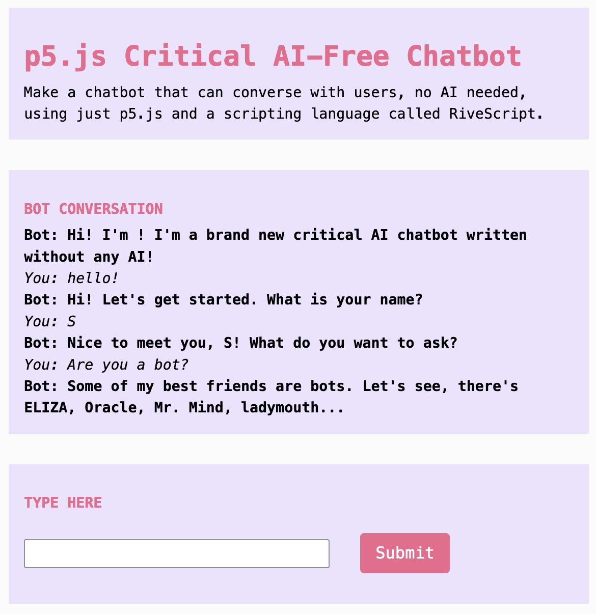

import Callout from "../../../components/Callout/index.astro";

## What are we making?

In this tutorial you will program an interactive chatbot using absolutely no AI at all. Why skip AI when today's bots are using cutting-edge large language models? A no-AI bot shows how little programming is needed to create convincing human-machine interactions, and it can also help demonstrate some of the workings of even the biggest chatbot systems.



## How to use it: Custom chatbots

Does the current explosion of new chatbots speak for you? If you had your own bot, what would you want it to say? Maybe you'd rather make your own bot, so that it can speak in a voice you recognize or to a community you want to reach.

The text data that chatbots are trained on and the way they are trained completely determines what topics they are able to discuss and how they can talk about them. Even customized large language models (LLMs) are fine-tuned on top of "foundation" models that are first created from data scraped from places like Reddit, Wikipedia, Github, newspapers, and fan fiction sites like Smashwords. Such broad, uncritical collection leads to a flat-sounding bot voice that can also exclude many communities and reinforce harmful biases. 

But bots have existed in many forms, long before large-scale AI, and you do not need any AI to build your own. It is a chance to think through how much "natural"-seeming conversation is constructed through programmed exchanges, because you will be able to use code to model each part of this exchange — just as bot programmers have done since the 1960s. With LLMs and emerging AI tools, much of this work is now done with statistics instead of by the programmer directly; however, we still have to consider the same questions of audience, context, message, and purpose that Aristotle did! 

This tutorial is Part 4 in a series of four tutorials that focus on using AI creatively and thoughtfully. Feel free to adapt them for your own critical exploration of AI systems: 

- Part 1: [Chatting With/About Code](criticalAI1-chatting-with-about-code)  
- Part 2: [Critical AI Prompt Battle](criticalAI2-prompt-battle)  
- Part 3: [Sentiment Training Dataset Explorer](criticalAI3-sentiment-dataset-explorer)

## How to make it

### Step 1. Get started with the interactive tutorial example

This tutorial challenges you to see how far you can get making your own chatbot with p5.js and the RiveScript language, created in the 2000s. Unlike tools like ChatGPT, it does not require a sophisticated AI model, lots of computational power, or tons of training data. 

<Callout title="Critical Context">
You can do a lot without machine learning. ELIZA, one of the earliest chatbots, was created in 1964. Today's AI chatbots use statistics to build their scripts by predicting the next most likely word, character, or subword (called a token), while older chatbots like ELIZA use hand-programmed scripts — like the kind we will run using p5.js and RiveScript. 
</Callout>

Open the tutorial example in the [p5.js Web Editor](https://editor.p5js.org/sarahciston/sketches/1OX3CcBOO) and make a copy to get started. 

<Callout>
This tutorial builds on video tutorials by [Dan Shiffman's Coding Train](https://www.youtube.com/watch?v=wf8w1BJb9Xc), which you can follow to understand more features of the RiveScript language. Also check out the [RiveScript documentation](https://www.rivescript.com/docs/tutorial). 
</Callout>

### Step 2. Understand basic script files

Check that the `index.html` file contains a script tag that will load the RiveScript library. It should look similar to the one we use to load the p5.js library, but with a link to the `rivescript.min.js` file: 

`<script type="text/javascript" src="https://unpkg.com/rivescript@latest/dist/rivescript.min.js"></script>`

Next check that there is at least one file with the file extension `.rive`. In our case, we have two files: The `dialogue.rive` file is where we will write the main conversation parts for the bot.   
To access the `.rive` files in the `sketch.js` file, first declare a variable `var bot = new RiveScript()`. This creates a RiveScript bot. 

Then, inside the p5 instance, make sure there is a `preload()` function that includes the following:

```js
p5.preload = function(){
    bot.loadFile(["begin.rive", "dialogue.rive"])
        .then(botReady).catch(botError)  
    }  
```

This function `bot.loadFile` tells the bot to access the RiveScript files we have created. It then calls a function we make called `botReady` that simply prints to the console that it is ready. We handle any errors with a function we create called `botError()`.

We also make a function `botChat()` that will run when the `Submit` button is pressed: 

```js  
function botChat(){  
      
    bot.sortReplies();  
    let username = "local-user"  
    let inputValue = userInput.value()  
    p5.createP((inputValue)).class('userConvo').parent(outputDiv)  
      
    let reply = bot.reply(username, inputValue).then(function(reply) {  
      console.log("Bot says: " + reply);  
      p5.createP(reply).class('botConvo').parent(outputDiv)  
    });

    userInput.value('') // clear input value for next turn  
  }  
```  

In this function, we get the user's input from the input field and send it to the RiveScript bot. RiveScript functions handle the user's inputs based on the dialogue rules we will write, and then we display it in a paragraph element using p5.js. For more details on this, see the Coding Train video.

Let's return to the dialogue file to take a closer look at building a conversation.

### Step 3. Add user inputs and replies

Start by considering what you want your chatbot to discuss. What will your users ask the bot about? What kinds of questions are required to get the information they need? Make a short list of the types of questions they might ask. If our bot is teaching us about chatbot history, users might ask questions like: 

`+ what was the earliest chatbot`

`+ when was the first chatbot created`

`+ who made the earliest chatbot`

Lines that begin with `+` are inputs. These should be written in all lowercase with no punctuation.

To write replies from the bot, put a line below each input that begins with a minus sign (hyphen) (`-`). You can add additional lines and the bot will choose at random. Leave a space before the next input.

```
+ what was the earliest chatbot
- The first well-known chatbot was called ELIZA.

+ when was the first chatbot created
- ELIZA was designed in 1964 and introduced in 1966 at MIT.

+ who made the earliest chatbot
- Computer scientist Joseph Weizenbaum made the bot ELIZA as an experiment in 1964.
```

<Callout title="Critical Context">
Before all-purpose chatbots, most bots had to be designed for a specific purpose and with a specific persona in mind. Choose a tone that matches the topic and purpose of your bot. How does the bot's personality change based on its purpose? How is it expressed through language choices? 
</Callout>

### Step 4. Add variation with input alternatives

ELIZA's most famous script was DOCTOR, which mimicked a therapist (but there were others!). DOCTOR was so convincing because it used its therapy persona as a way to ask lots of open-ended questions. It used (pseudo) randomness, placeholders, and wildcards to create the sense that the machine was responding as a person would. Its script borrowed from the user's input to create its personalized responses. 

Let's use some of the RiveScript features to do the same. Users won't always ask the exact questions you propose. They will sometimes ask variations on these topics. Let's update the users' input to allow for some option, by using the alternatives structure:

```
+ when was (the first chatbot|it) created
- ELIZA was designed in 1964 and introduced in 1966 at MIT.

+ who made (the first chatbot|it)
- Computer scientist Joseph Weizenbaum made the bot ELIZA as an experiment in 1964
```

The parentheses designate a set of multiple choices, and the pipe character separates each choice. The word `it` can appear in that position, or the words `the first chatbot` can appear instead. Here's another more complex example we can use to group some questions that share a theme:

```+ (can machines think|are bots smart|are you as good as chatgpt|are computers and humans alike?)```

### Step 5. Add more variety with multiple replies

For every phrase that we anticipate our user might say, we can add additional examples of responses. This makes your bot appear more dynamic by offering a choice of responses around the same topic. The additional lines that begin with the minus sign are all potential replies for the same variations of this user input: 

```
+ (can machines think|are bots smart|are you as good as chatgpt|are computers and humans alike?)
- I don't think so. But I just thought that, so ... it's a paradox.
- I only respond to answerable questions.
- "I am a bot. All bots are liars." -Mr. Mind (a bot)
```

By grouping the thinking machine questions and their answers, the responses will be chosen at random and will apply to all variations of the question.

We can also adjust how frequently each answer might be given, by adding `{weight=X}` and making X a number for each answer:

```
- Only a bot would ask me that!{weight=3}
- I don't think so. But I just thought that, so ... it's a paradox.{weight=1}
- I only respond to answerable questions.{weight=1}
- "I am a bot. All bots are liars."{weight=2}
```

With no weights specified, the replies will be chosen at random. 

<Callout title="Critical Context">
By adding weights, you can explicitly add biases to your bot's responses, because it will answer in particular ways more often than other ways. Remember, biases are always built in as part of computational systems, no matter what. No system can account for all implicit bias, because the very design of computer systems is based on sorting into categories. In the interactive tool [OpinionGPT](https://opiniongpt.informatik.hu-berlin.de/), researchers trained a GPT model only on texts written by particular communities, in order to emphasize several types of biases. They hoped to make examples of existing biases more obvious to show potential issues within all computational systems. As you play with their model, consider Can you hear bot 'personas' or characterizations that come through in the language used by their trained models? What kinds of language does each model use differently from the others? As you choose language for your own chatbot, what tone and word choices will you use to convey its persona and message?
</Callout>

### Step 6. Work with wildcards, keywords, and stored variables

To help your bot appear to respond specifically to its users, it can copy the user's language in its replies. 

<Callout title="Critical Context">
This was part of the strategy that made ELIZA-type bots so compelling. ELIZA worked with keywords that triggered specific templates. These would transform the user's input into a response that suited the topic, while reusing the input text. An input like "I don't think you like me" might become "What makes you think I don't like you" with the simple substitution of words like "I" for "you."
</Callout>

You can use asterisk (`*`) as a wildcard character to interact with open-ended inputs. Putting an asterisk in brackets makes it optional, and putting it on either side of a word will make the rule apply whenever that keyword appears:

```
+ [*] bot [*]
- I'm a bot. Are you a bot too?  
- Only a bot would ask me that!
```

This example tells the script to allow any text that precedes or follows the word `bot`. 

Save the phrases that the user entered and refer to them in the reply by using  `<star>` in the reply. For example, your bot could respond with: `My favorite <star> is whatever yours is.` 

If there is more than one wildcard, the bot can use `<star1>` and `<star2>`.

It also includes a wildcard for what follows. For a reply, your bot could respond with: `Do you know why you <star1> <star2>?` and `<star1>` will fill in the optional input from the user, while `<star2>` will fill in the wildcard input from the user.

### 7. Bonus: Try these!

Here are some additional features you may want to try. To decide how you'll use them, think about how their analogue equivalents shape conversation. You can get creative with their use also, by trying them out for other unintended purposes. 

<Callout>
This is just an overview. Read the [RiveScript tutorial](https://www.rivescript.com/docs/tutorial) to understand more details of bot syntax that can add conversational flow to your chatbot. There are optional keywords, arrays, variables, and many other concepts that relate to similar programming concepts. That's because many chatbots are rule-based systems, which means they are written to follow a flow of rules set by their designers. They differ from the latest chatbots, which have rules that are created statistically (but these are also designed by programmers).
</Callout>

**Set variables** to store information, just like you do in p5.js. Remember when the bot asked you your name at the start? It saved that as a variable, with the formula: 

```
+ my name is *
- <set name=<star>> nice to meet you <name>!
```

This exchange saves the wildcard's information as a variable called `name`. Then you can retrieve it later using the variable:

```
+ what is my name
* <get color> == undefined => You never told me.
- your name is <get name>
```

**Use conditionals** to test whether a value has been set for `name`. They work like an if statement (indicated by an asterisk at the front of the line). If `name` equals `undefined` because there is no value stored, then the answer on that line is given. Otherwise, if `name` is not undefined because a value has been set for `name`, it ignores the conditional line and the response on the next line will be used instead. 

**Declare statements and make substitutions.** Use an exclamation point (`!`) at the start of a line to declare information up front, such as presets to load in the `begin.rive` file. Any `.rive` file begins with the version, which we set with an exclamation point: 

`! version = 2.0`  

We can also use this to define presets that the bot stores in memory:

```
! var name = your bot
! var age = 5
```

The variables can also be recalled. Put them in replies like this: `"Hi my name is <bot name>. I am <bot age> years old."`

Substitutions are declared the same way. A list of example substitutions is provided in the tutorial's `begin.rive` file, including for example:

```
! sub i'm = i am
! sub don't   = do not
! sub what's  = what is
```

**Redirect** sends a user input to a different response group with the at symbol: 

```
+ [*] pineapple [*]
@ [*] bot [*]
```

In this example, any time a user enters the keyword banana (with optional words on either side), the bot is redirected to the group of responses for the keyword `bot`.

<Callout>
Substitutions and redirects are useful tools to allow the conversation to flow even when there are variations in speech by the users. They work so that you do not have to write duplicate versions of every user input for common variations on phrases.  
</Callout>

**Previous/play along** lets the bot behave in a particular fashion if something was said more than one turn ago. Use the percentage (`%`) symbol to reference the line from prior exchanges. This lets your bot carry on a lengthier train of thought. How might this be useful in the context of a bot about bots, or for the topics your bot will discuss? 

<Callout>
Try connecting your bot to APIs. What kinds of interactions do you want your bot to have, and what kinds of questions should it answer? For more dynamic interaction, you can consider adding `fetch` and API access (discussed in Tutorial 3), so that your bot can answer questions by updating its information from another website. For example, it could perform a Google search on your user's behalf. A non-AI bot that runs a Google search will use far fewer natural resources than the large language models used by tools like ChatGPT — and is much, much easier to program!
</Callout>

<Callout title="Critical context">
As you choose what tools to pick up, is AI necessary for making sophisticated work for all your projects? In which cases is it needed, in which cases will you customize your AI tools using p5.js, and in which cases will you opt out?  
</Callout>

## Takeaways

In comparison to how AI tools are presented, rule-based bots might look old-fashioned at first, but even the most complex tools do not always live up to expectations. They can be fragile and are limited to the constraints established by their platforms and the companies designing them. Writing your own dialogue for a chatbot lets you control the flow of conversation, as well as the visual interface and the methods of interaction. 

Making your own bots also contributes to understanding how systems (both AI and otherwise) interpret users' inputs. A lot of the AI systems we use now are complex human-computer systems, of which only a very small part requires any machine learning tasks. In your own bot, consider how little programming was needed to make an artificial conversation feel natural. Many of these capabilities existed in the first chatbot made by Joseph Weizenbaum in 1964, and artificial intelligence was envisioned as early as 1950 by Alan Turing. The current explosion of bots is not a new fad, but part of a long lineage of human-computer interaction.

## References

Haller, Patrick, Ansar Aynetdinov, and Alan Akbik. 2024. "OpinionGPT: Modelling Explicit Biases in Instruction-Tuned LLMs." In *Proceedings of the 2024 Conference of the North American Chapter of the Association for Computational Linguistics: Human Language Technologies (Volume 3: System Demonstrations)*, edited by Kai-Wei Chang, Annie Lee, and Nazneen Rajani, 78-86. Mexico City, Mexico: Association for Computational Linguistics. [https://doi.org/10.18653/v1/2024.naacl-demo.8](https://doi.org/10.18653/v1/2024.naacl-demo.8).

Shiffman, Daniel. The Coding Train, dir. 2017. 10.2: Chatbots with RiveScript - Programming with Text. [https://www.youtube.com/watch?v=wf8w1BJb9Xc](https://www.youtube.com/watch?v=wf8w1BJb9Xc).  
