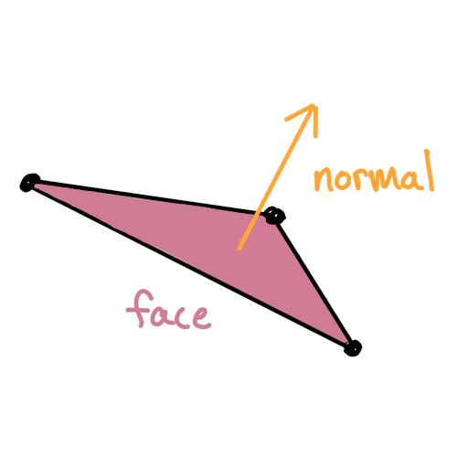

import EditableSketch from "../../../components/EditableSketch/index.astro";
import { Callout } from "../../../components/Callout";

p5.js has a number of built-in basic shapes, like `box()` and `sphere()`. It can also render complex custom geometry, both from 3D model files or code. This tutorial will walk through how to import 3D models into p5.js, as well as how to create geometry from scratch.

## Loading 3D models from file

Custom geometry can be imported into p5.js using either OBJ or STL files. These files are usually generated in a 3D modeling tool like Blender, which offers much more control when constructing a 3D scene. This is done using the `loadModel()` method, which should be used within `preload()`. Then, you can use the `model()` function to draw the model, as demonstrated in the example below.

<EditableSketch code={`
let teapotModel;
function preload() {
  teapotModel = loadModel('/models/teapot.obj', true);
}
function setup() {
  createCanvas(200, 200, WEBGL);
  describe('A model of a teapot');
}
function draw(){
  background(255);
 
  // Click and drag to look around the shape
  orbitControl();
 
  // This adds color to the model according to the angle of the surface
  normalMaterial();
  model(teapotModel);
}
`} />

A common issue that can come up with custom models is scaling. Depending on how the model is constructed, it might be a very different size when drawn in p5.js, or be too small to be drawn at all. The `loadModel()` method includes a `normalize` parameter that will resize the model to something that works better in p5.js.

*Note that there is currently no support for loading materials and colors from model files. You can add color, materials, and textures manually after loading a model, which you can learn about in the* [*Styling and Appearance*](styling-and-appearance) *tutorial.*

<Callout>

Try [finding a 3D model online](https://sketchfab.com/features/free-3d-models) and integrating it into a sketch!

</Callout>

## Creating procedural geometry

Geometry can also be defined procedurally using code. This is a great way to create geometry that moves or is formed using your own set of rules. There are a number of methods that can be used to create 3D geometry in a way that is similar to 2D drawing. For example, functions like `quad()`, `triangle()`, `rect()`, and `circle()` each have extra parameters that make it possible to use them in 3D.

There are other functions that offer greater control of the geometry. A shape can be defined point-by-point using `beginShape()`, `vertex()`, and `endShape()`. The following example shows how these functions can be used to construct a 3D shape.

<EditableSketch code={`
function setup() {
  createCanvas(216, 216, WEBGL);
  colorMode(HSB);
  describe('A ribbon rotating in a spiral');
}

function draw() {
  background(255);
  
  // Click and drag to look around the shape
  orbitControl();
  
  // Angle down and to the right to get a better view
  rotateX(PI * -0.2);
  rotateY(PI * 0.2);
  
  // Draw a strip of quads in a spiral formation
  beginShape(QUAD_STRIP);
  for (let z = -100; z < 100; z += 5) {
    fill((z + frameCount) % 360, 100, 100);
    
    // Rotate the end point based on how far back it is,
    // and additionally based on the time
    let endPoint = createVector(0, 20);
    endPoint.rotate((z + frameCount) * 0.1);
    
    // In a QUAD_STRIP, each pair of vertices forms a
    // quad with the next pair. By making each pair have
    // a small y offset between them, we make a vertical
    // ribbon.
    vertex(endPoint.x, endPoint.y - 5, z);
    vertex(endPoint.x, endPoint.y + 5, z);
  }
  endShape();
}
`} />

<Callout>

Can you create a 3D bolt of lightning using `beginShape(QUAD_STRIP)`?

</Callout>

## Reusing procedural geometry

This method is great for creating custom shapes that change over time. Sometimes, you might only need a fixed shape or want an efficient way to draw a shape many times. For this, p5.js has a function called buildGeometry() to turn your custom shapes into the same format as a loaded model. If you are planning on making a particle system, this is a good tool to reach for.

It takes in a function that draws some shapes. It will then output geometry that you can draw with model() as often as you like.

<EditableSketch code={`
let bug;

function setup() {
  createCanvas(200, 200, WEBGL);
  describe('Bugs randomly moving around');
  
  // Record shapes and store them
  bug = buildGeometry(() => {
    // Head
    push();
    translate(-50, 0, 0);
    sphere(70);
    
    // Draw symmetrical parts of the head that come
    // in pairs by looping over each side of the head
    for (let side of [-1, 1]) {
      // Eye
      push();
      translate(-20, -60, side * 30);
      sphere(20);
      pop();

      // Antenna
      push();
      translate(0, -100, side * 30);
      rotateX(PI * -0.1 * side);
      cylinder(5, 100);
      pop();
    }
    pop();

    // Body
    push();
    translate(50, 0, 0);
    scale(1.5, 0.8, 1);
    sphere(100);
    pop();
  });
}

function draw() {
  background(255);
  orbitControl();
  rotateX(PI * -0.1);
  
  noStroke();
  lights();
  
  // Draw a bunch of bugs
  for (let i = 0; i < 20; i++) {
    push();
    // Move each bug to a random position and rotation using noise
    translate(
      map(
        noise(frameCount*0.001, i, 0), // Map this value...
        0, 1, // ...from this range...
        -150, 150 // ...into this range
      ),
      0,
      map(
        noise(frameCount*0.001, i, 100),  // Map this value...
        0, 1, // ...from this range...
        -200, 300 // ...into this range
      )
    );
    rotateY(noise(frameCount*0.01, i, 200) * TWO_PI);
    scale(0.1);
    model(bug);
    pop();
  }
}
`} />
	
<Callout>

Try making a few snowflakes using `buildGeometry`, and then use them to create a big snowfall!

</Callout>

## Smooth shading

A normal is the direction that is perpendicular to the face, which helps p5.js calculate lighting across the surface.

As long as every vertex shared between touching faces has the same normal, then shading will look smooth. You can specify normals manually by calling `normal(x, y, z)` before each `vertex(x, y, z)`, but p5.js includes functionality to calculate these for you. The following example uses `geometry.calculateNormals(SMOOTH)` to create a warped tube with smooth lighting.

<EditableSketch code={`
let tube;

function setup() {
  createCanvas(216, 216, WEBGL);
  describe("A rotating, warped tube");
  
  tube = buildGeometry(() => {
    let verticesPerRing = 20;
    let rings = 20;
    for (let ring = 0; ring < rings - 1; ring++) {
      beginShape(QUAD_STRIP);
      for (let i = 0; i <= verticesPerRing; i++) {
        for (let ringOffset of [0, 1]) {
          let y = map(ring + ringOffset, 0, rings, 70, -70);
          let angle = map(i, 0, verticesPerRing, 0, TWO_PI);
          
          // Rotate a line 70px from the tube center according to the angle
          let position = createVector(70, 0).rotate(angle);

          // Pick a random value between 0 and 1 that we'll use to squish
          // the tube in towards the center. The input to noise() changes
          // based on the position of the shape to get a smoothly changing
          // output.
          // If you were to set radius=1 instead, you would get a perfect
          // tube with no warping.
          let radius = noise(
            200 + position.x * 0.01,
            200 + y * 0.01,
            200 + position.y * 0.01
          );

          // Use radius to squish in towards the center of the tube
          let squishedPosition = createVector(
            position.x * radius,
            y,
            position.y * radius
          );
          
          vertex(squishedPosition.x, squishedPosition.y, squishedPosition.z);
        }
      }
      endShape();
    }
  });
  tube.computeNormals(SMOOTH);
}

function draw() {
  background(255);
  orbitControl();

  lights();
  noStroke();
  specularMaterial(50);
  shininess(100);
  rotateY(frameCount * 0.01);
  model(tube);
}

`} />

<Callout>

Try making a smooth, organic shape in p5. Can you create buildings in the style of [Frank Gehry](https://en.wikipedia.org/wiki/Guggenheim_Museum_Bilbao#/media/File:Museo_Guggenheim,_Bilbao_\(31273245344\).jpg), built out of smooth, wavy strips?

</Callout>

## Advanced geometry techniques

Sometimes, you need even more flexibility when making shapes. For example, sometimes you want vertices to be connected irregularly into faces rather than through a grid, or you want to use custom normals or texture coordinates calculated after having generated all your vertices. The `p5.Geometry` class gives full flexibility in creating vertices, faces, texture coordinates, and normals. p5.js uses `p5.Geometry` internally for `loadModel()` and `buildGeometry()`.

In 3D, a face refers to a collection of three points that make up a surface, giving our geometry the appearance of being solid. In `p5.Geometry`, you create faces by:

1. Putting all the points you will use into a big array in the `geometry.vertices` property, and remembering the **order** the points are added.
2. Putting sets of three indices at a time into the `geometry.faces` array. The **index** of a point refers to its position in the array, determined by the order in which it was added. Index 0 corresponds to the first point you added, index 1 corresponds to the second, index 2 corresponds to the third, etc.

![An illustration of how to create faces by referring to vertices by their positions in the array. Four vertices are created in a square in a left-to-right then top-to-bottom order. A trianlge is formed in the bottom left of the square with indices \[0, 3, 2\], and a triangle is formed in the top right with indices \[0, 1, 3\].](../images/webgl/faces.svg)

The following example uses this method of creating vertices and faces to create a custom tetrahedron shape.

<EditableSketch code={`
let tetrahedron;
function setup() {
  createCanvas(200, 200, WEBGL);
  describe('A rotating tetrahedron');
 
  tetrahedron = new p5.Geometry();
 
  // Give each geometry a unique gid
  tetrahedron.gid = 'tetrahedron';
 
  // Add four points of the tetrahedron
 
  let radius = 50;
  // A 2D triangle:
  tetrahedron.vertices.push(createVector(radius, 0, 0));
  tetrahedron.vertices.push(createVector(radius, 0, 0).rotate(TWO_PI / 3));
  tetrahedron.vertices.push(createVector(radius, 0, 0).rotate(TWO_PI * 2 / 3));
  // Add a tip in the z axis:
  tetrahedron.vertices.push(createVector(0, 0, radius));
 
  // Create the four faces by connecting the sets of three points
  tetrahedron.faces.push([0, 1, 2]);
  tetrahedron.faces.push([0, 1, 3]);
  tetrahedron.faces.push([0, 2, 3]);
  tetrahedron.faces.push([1, 2, 3]);
}
function draw() {
  background(200);
  strokeWeight(2);
  orbitControl();
  rotateY(millis() * 0.001);
  model(tetrahedron);
}
`} />

You can also push a `p5.Vector` into the `geometry.normals` array for each vertex you push into `geometry.vertices`. However, you can still call `geometry.computeNormals()` for custom `p5.Geometry` just like you can for geometry built with `buildGeometry()`.

<Callout>

A tetrahedron is part of a group of shapes called [Platonic solids](https://en.wikipedia.org/wiki/Platonic_solid). Try generating more of them as `p5.Geometry`!

</Callout>

## Conclusion

Now, you should be able to create custom geometry, making it possible to create unique shapes, both from other tools and from code. Spend some time working with a variety of 3D modeling tools so you can find the one that works best for you. If you find bugs please raise an issue on [Github](https://github.com/processing/p5.js/), or if you run into trouble, feel free to ask questions [on Discord](https://discord.gg/SHQ8dH25r9) or the [Processing Foundation Discourse forum](https://discourse.processing.org/).

## Glossary

#### Procedural

Meaning that something is defined mathematically, instead of from stored data, like a file.

#### Model

A representation of geometry.

#### STL

STL (most often standing for "standard tesselation language") is a file format for 3D models. It only stores information about the geometry.

#### OBJ

OBJ is an open file format that stores geometry data as well as some material and texture data. In p5.js, we are limited to its geometry, although an image can still be mapped to the surface using textures.

#### Vertices

The points of a shape that make up the corners of its faces.

#### Faces

The solid surface that is generated between three points.

#### Normals

The direction that is perpendicular to a face which is often needed when calculating lighting or using materials.

#### Normalization

Changing something so that it fits within a standard range.

#### Indices

Positions in the array of vertices. Faces reference vertices by these positions.

#### `loadModel()`

A p5.js function to load a shape from an OBJ or STL file.

#### `p5.Geometry`

A class that p5.js uses to store shapes.

#### `model()`

A p5.js function to draw a shape to the screen.

#### `buildGeometry()`

A p5.js function to record all the shapes that get drawn and save them into a new `p5.Geometry` object.

#### `computeNormals()`

A method that can be called on `p5.Geometry` to calculate the direction coming out of each face so that they don't need to be manually created.

