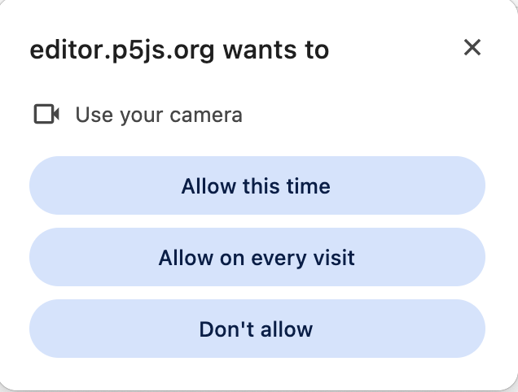
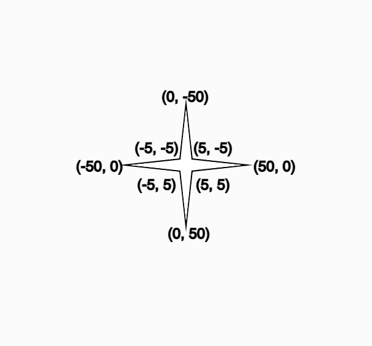
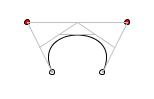
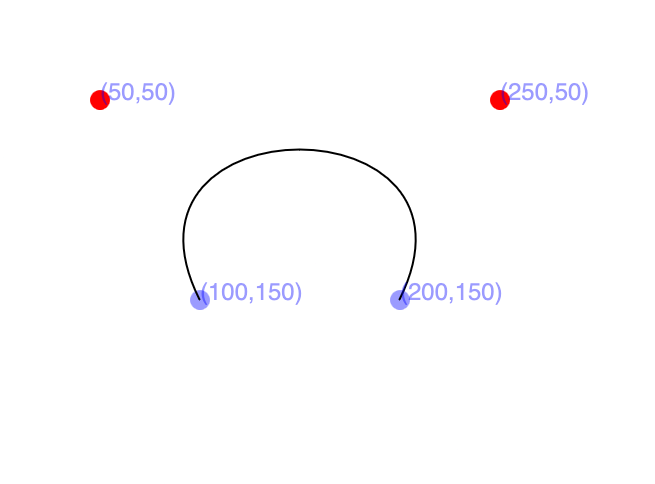
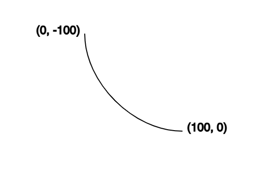
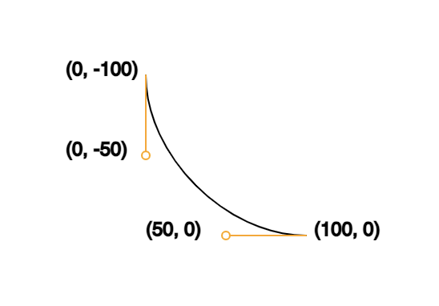
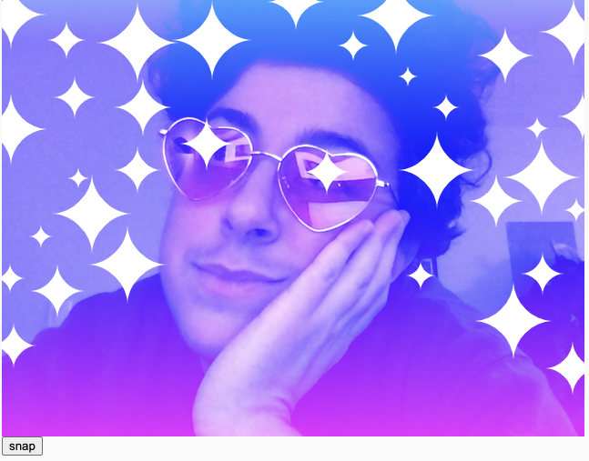

import Callout from "../../../components/Callout/index.astro";

## Introduction

Welcome! This Drawing chapter provides an introduction to drawing custom shapes constructed from straight and curved line segments using `vertex()` and `bezierVertex()` functions. You’ll use these techniques in combination with `beginShape()` and `endShape()` to create [sparkle stickers](https://editor.p5js.org/juleskris/sketches/IZa2De7xH) for the sticker-based photo decorating app from the [Color Gradients](/tutorials/color-gradients) tutorial. 


## Prerequisites

To follow along with this tutorial, you should have completed:

1. [Introduction to p5.js:](/tutorials/get-started)

  It is required for you to have finished and understood the previous chapter “Introduction to p5.js”. This will give you a basic understanding of the p5.js library.

2. [Creating Color Gradients](/tutorials/color-gradients) tutorial:

   This chapter is a continuation of the [Creating Color Gradients](/tutorials/color-gradients), which provides the starting code for this sketch and introduces linear gradients, radial gradients, and some blending mode techniques.


## Step 1 – Open your Creating Color Gradients sketch  

To prepare the sketch for adding sparkles, let’s set up a few things.

- Open your code from the Creating Color Gradients tutorial, and if you haven’t done that or need a fresh copy, you can start with [this template code.](https://editor.p5js.org/juleskris/sketches/9kVjcL1Vq) 
- Let’s adjust the values of the linear gradient to emulate a dreamy night sky by changing `startColor` to `color(200, 100, 100)` for a bright and saturated blue and `endColor` to `color(300, 100, 100)` for a bright and saturated magenta.
- For now, comment out where we call the `lensFlare()` function inside `mousePressed()`. We’ll come back to it later.

Your code should look something like this:

```js
let video;
let snapped = false;

function setup() {
  createCanvas(640, 480);
  colorMode(HSB, 360, 100, 100);

  //instantiate the VIDEO object, and draw it on the screen at 0, 0 
  video = createCapture(VIDEO);
  video.position(0, 0);

  //When we click the snap button, run the takeSnap function
  let snapButton = createButton('snap');
  snapButton.mouseClicked(takeSnap);

  blendMode(LIGHTEST);

  noStroke();
}

function mousePressed() {
  if (snapped === true) {
    gradientFilter();
    // lensFlare();
  }
}

//If we haven’t snapped a photo yet, we see our webcam video feed
//Once we run the takeSnap function, set snapped to true and remove the video feed, leaving only the still photo we took
function takeSnap() {
  if (snapped === false) {
    image(video, 0, 0);
    snapped = true;
    video.remove();
  }
}

//Draws circles filled with radial gradients when we click the screen
//Each circle’s size and color are a random value contained in the diameter and h variables
function lensFlare() {
  let diameter = random(50, 200);
  let h = random(150, 360);
  for (let d = diameter; d > 0; d -= 1) {
    fill(h, 90, 90);
    circle(mouseX, mouseY, d);
    h = (h + 1) % 360;
  }
}

//Draws a linear gradient on the screen using a for loop and lerpColor
function gradientFilter() {
  let startColor = color(200, 100, 100);
  let endColor = color(300, 100, 100);
  for (let y = 0; y < height; y += 1) {
    let amt = map(y, 0, height, 0, 1);
    let gradColor = lerpColor(startColor, endColor, amt);
    stroke(gradColor);
    line(0, y, width, y);
  }
}
```

Now run the code. You may have to allow permission for the p5.js editor to access your webcam.



Click the “snap” button, then click on the new photo to apply the color gradient effect. The result should look something like this:


<Callout>
Think about the mood you want to set. A night sky is chosen here, but you might want something else! Try creating a variable with a third lerpColor, so our gradient goes between three colors instead of two.
</Callout>


## Step 2 – Create sparkles using the `vertex()` function  

We’ll create angular sparkles made of vertices connected by straight lines using `vertex()` functions. A vertex (plural: vertices) is a point at an x-y coordinate where lines meet to form an angle that we can use to define different polygonal shapes such as triangles, quadrilaterals, and, of course, stars.

- Define a new function and name it `sparkle()`
- Inside the `sparkle()` function: 
  - We’ll want to be able to paste our sparkles as stickers, just like we pasted the lens flares in the previous chapter. Add a `push()` to the beginning of the sparkle function, and a `pop()` to the end of the sparkle function. Then, write `translate(mouseX, mouseY)`. The translate function will shift our shape’s vertex values to move to wherever we click the mouse. The `push()` and `pop()` functions ensure that our `translate` function only runs inside our `sparkle()` function and does not accidentally translate other elements of our sketch.
  - We’ll start by drawing a white line to demonstrate how the `vertex()` function works.
  - Write `stroke(255)` to make the line white.
  - For shapes defined using `vertex()` functions, start with a `beginShape()` function. 
  - Add a `vertex(100, 100)` to create your first point at an x-y coordinate of (100, 100). The vertex function takes an x value, a y value, and an optional z value. We don’t need the z value because that is for 3-dimensional coordinates, and this is a 2D sketch.
  - Add a second vertex to form a straight line by writing `vertex(200, 200)`.
  - As you continue to create more vertex points, they’ll connect to each other by straight lines. For now, end the shape with an `endShape(CLOSE)` function.

If we add `sparkle()` inside the if statement within the `mousePressed()` function, we’ll see the line we just made when we hit play on our sketch and click on the canvas:
 


We’ll now add some randomness to our `vertex()` functions to vary their size.

- Create a variable called `innerRadius` and set it equal to `random(3, 5),` then create a second variable called `outerRadius` and set it to equal `random(10, 50)`. This will allow us to add variation to the size and shape of each sparkle we create.

- Delete `vertex(100, 100)` and replace `vertex(200, 200)` with `vertex(-innerRadius, innerRadius);`

- To draw a 4-pointed sparkle, we’ll need to create 8 symmetrical vertex points. We’re making this easier for ourselves by using our `innerRadius` and  `outerRadius` variables. Here is how we’ll draw our sparkle:

  ```js
  vertex(-innerRadius, innerRadius);
  vertex(0, outerRadius);
  vertex(innerRadius, innerRadius);
  vertex(outerRadius, 0);
  vertex(innerRadius, -innerRadius);
  vertex(0, -outerRadius);
  vertex(-innerRadius, -innerRadius);
  vertex(-outerRadius, 0);
  ```

Here, we can see how this inversion works to create a 4-pointed sparkle in this diagram, where we see the coordinates of each vertex:



- In this example, innerRadius is 5 and outerRadius is 50.
- Notice how every second vertex is an inversion of the other. The outer points mirror each other vertically/horizontally, and the inner points mirror each other diagonally. This maintains the symmetry of our sparkle shape.
- Call the `sparkle()` function within the `mousePressed()` function, on the line just below  `gradientFilter()`.


Your code should look like this:

```js
function sparkle() {
  push();

  // Translate the coordinate space so that (0, 0) matches mouse coordinates.
  translate(mouseX, mouseY);

  // Define a random inner and outer radius for each star.
  let innerRadius = random(3, 5);
  let outerRadius = random(10, 50);

  // Draw the star shape.
  beginShape();
  vertex(-innerRadius, innerRadius);
  vertex(0, outerRadius);
  vertex(innerRadius, innerRadius);
  vertex(outerRadius, 0);
  vertex(innerRadius, -innerRadius);
  vertex(0, -outerRadius);
  vertex(-innerRadius, -innerRadius);
  vertex(-outerRadius, 0);
  endShape(CLOSE);

  pop();
}
```

Hit play, and you’ll see your modified blue-to-pink gradient filter and 4-sided sparkle stickers of varying sizes that appear wherever you click the canvas. 


<Callout>
We’ve started with four points. Use what we’ve learned about vertices to add more points to these sparkles! Pay attention to how even and odd-numbered sparkles require different calculations to achieve symmetry.
</Callout>


## Step 3 – The Bézier Curve Interlude

We’ve now successfully drawn angular sparkles using the `vertex()` function! You can draw more interesting shapes using curved lines, and Bézier curves are one good way to do that. They define curves using a pair of anchor points (the grey circles below) and a pair of control points (the red points below.) Here’s what they look like. The curve itself is in black, with the grey lines showing how the points relate to the final curve.



Here’s how you can draw that Bézier curve using the `bezier()` function. This curve is drawn by calling `bezier(100, 150, 50, 50, 250, 50, 200, 150)`:



Next up, we’ll use `bezierVertex()` to form a shape by connecting Bézier curves.

<Callout>
Change the numbers in the third, fourth, fifth, and sixth parameters within bezier to change the control points and see how that affects the shape!
</Callout>


## Step 4 – Create rounded sparkles using the `bezierVertex()` function  

A `bezierVertex()` function begins with an anchor point at the very top, which we call using the `vertex()` function, like we did for the pointed sparkle. This time, however, instead of calling another `vertex()` function to create our shape, we’ll call the `bezierVertex()` function. If you’ve ever used Adobe Illustrator, or similar vector-based illustration software, you’ve probably used bezier curves! `bezierVertex()` works by creating invisible control points, similar to the handles used to manipulate bezier curves in vector graphics software.

 
- For now, comment out where we call the `sparkle()` function inside `mousePressed()`. We’ll come back to it later.
- Define a new function called `curvedSparkle()`
- Add `push()` and `pop()` functions, and between those, a `translate(mouseX, mouseY)`, just like you did in the `sparkle()` function before.

To create a curved line, we’ll need to use the [`bezierVertex()`](/reference/p5/bezierVertex) function. 

- Just like we did for the pointed sparkles, we’ll begin our shape with `beginShape()`, and end it with `endShape()`.
- Any shape with `bezierVertex()` functions must still begin with a `vertex()` function. We’ll call `vertex(x, y)` first. This acts as the first point in our shape.
  - `x` and `y` represent the x-y coordinates for the first vertex in our star.
- Next, we’ll call the `bezierVertex()` function. Since we’re working on a 2D sketch, the function takes six parameters, ordered as follows: 
  - the x-coordinate for the first control point
  - the y-coordinate for the first control point
  - the x-coordinate for the second control point
  - the y-coordinate for the second control point
  - the x-coordinate for the anchor point
  - the y-coordinate for the anchor point

Now that you have some context, let’s begin our shape!




```js
// Draw the curved star shape.
beginShape();

// Original anchor at top.
vertex(0, -100);     // anchor point 1

// Top-right curve.
bezierVertex(0, -50, // control point 1 x-y coord
             50, 0,  // control point 2 x-y coord
             100, 0  // anchor point 2
);
endShape();
```

You may be wondering where the control points are since it looks like there are only two points and a line between them. The control points are invisibly controlling the curve of the line! Here is how that would work:

```js
stroke('orange');
line(0, -100, 0, -50);
line(50, 0, 100, 0);
circle(0, -50, 5);
```

Here, we can see the control points visualized as circles, with lines connecting them to the anchor points:



Let’s go back to our main sketch and continue to build out our curved sparkle shape! We’ll use the same variables as before, but we’ll alter them by making them negative and adding or subtracting proportional numbers.

Let’s complete our shape:

```js
// Draw the curved star shape.
beginShape();

// Original anchor at top.
vertex(0, -100);

// Top-right curve.
bezierVertex(0, -50, 50, 0, 100, 0);

// Bottom-right curve.
bezierVertex(50, 0, 0, 50, 0, 100);

// Bottom-left curve.
bezierVertex(  0, 50, -50, 0, -100, 0);

// Top-left curve.
bezierVertex(-50, 0, 0,-50, 0,-100);
endShape();
```

- Let’s also add a `scale()` function with a `random()` function as a parameter so that each time we click, the curved sparkle randomly scales between 0.1 and 0.5 (between 10% and 50% of its original size). [`scale()`](/reference/p5/scale) is another transformation function, much like `translate()`, but instead of moving the coordinates written below it, it resizes the shape to make it larger or smaller.

  ```js
  let starScale = random(0.1, 0.5);
  scale(starScale);
  ```

- We’ll set the fill for our curved sparkle to `fill(0, 0, 100)` to make it a bright white.

Your `curvedSparkle()` function looks like this:

```js
function curvedSparkle() {
  push();

  // Translate to the mouse's position.
  translate(mouseX, mouseY);

  // Scale the coordinate system.
  let starScale = random(0.1, 0.5);
  scale(starScale);

  // Set fill color.
  fill(0, 0, 100);

  // Draw the curved star shape.
  beginShape();

  // Original anchor at top.
  vertex(0, -100);

  // Top-right curve.
  bezierVertex(0, -50, 50, 0, 100, 0);

  // Bottom-right curve.
  bezierVertex(50, 0, 0, 50, 0, 100);

  // Bottom-left curve.
  bezierVertex(  0, 50, -50, 0, -100, 0);

  // Top-left curve.
  bezierVertex(-50, 0, 0,-50, 0,-100);

  endShape();
  pop();
}
```

- Call the `curvedSparkle()` function inside `mousePressed`, beneath where we call the `gradientFilter()` function.

Hit play, and you’ll see your modified blue-to-pink gradient filter and 4-pointed *curved* sparkle stickers of varying sizes that appear wherever you click the canvas. 




<Callout>
Try changing the values of the control points to see how it changes the curves of the sparkles!

**Hint:** You can achieve this by changing the values of the first four parameters in the `bezierVertex()` function.
</Callout>


## Step 5 – Switch between the three sticker types with each click

Let’s create conditional statements to switch between the lens flare, the angular sparkle, and the curved sparkle stickers.

- Create a global variable called `sparkleCounter` and set it to equal 0. This counter will increment each time we place a sticker, helping track which of the three stickers we’ll paste on the next click.
- Inside the mousePressed() function, within the `snapped === true` block, create a set of conditional statements:

```js
if (sparkleCounter % 3 === 0) {
  sparkle();
} else if (sparkleCounter % 3 === 1) {
  curvedSparkle();
} else {
  lensFlare();
}
sparkleCounter += 1;
```

- Let’s break down what this if statement does! It runs each time we click on the canvas. We use modulo (`%`) to divide sparkleCounter by 3 (the number of sticker functions we have) and calculate its remainder. We run a function depending on whether the remainder equals 0, 1, or something else. Each time we do that calculation, we add 1 to our sparkleCounter. This allows us to cycle through our three sticker functions each time we click on the canvas.
- Make sure there is a `push()` at the beginning of each of your sticker functions and a `pop()` at the end of each of your sticker functions. This will ensure that the various translations we apply within those functions don’t affect anything outside of the functions.


Your final code can look like this:

```js
let video;
let snapped = false;
let sparkleCounter = 0;
function setup() {
  createCanvas(640, 480);
  colorMode(HSB, 360, 100, 100);
  noStroke();

  //instantiate the VIDEO object, and draw it on the screen at 0, 0 
  video = createCapture(VIDEO);
  video.position(0, 0);

  //When we click the snap button, run the takeSnap function
  let snapButton = createButton("snap");
  snapButton.mouseClicked(takeSnap);
  blendMode(LIGHTEST);
}

//Cycle through our three stickers each time we press the mouse
function mousePressed() {
  if (snapped === true) {
    gradientFilter();
    if (sparkleCounter % 3 === 0) {
      sparkle();
    } else if (sparkleCounter % 3 === 1) {
      curvedSparkle();
    } else {
      lensFlare();
    }
    sparkleCounter += 1;
  }
}


//If we haven’t snapped a photo yet, we see our webcam video feed

//Once we run the takeSnap function, set snapped to true and remove the video feed, leaving only the still photo we took
function takeSnap() {
  if (snapped === false) {
    image(video, 0, 0);
    snapped = true;
    video.remove();
  }
}

function sparkle() {
  push();
  // Translate to the mouse's position.
  translate(mouseX, mouseY);

  // Set the shape's vertices.
  let vertex1 = random(3, 5);
  let vertex2 = random(10, 50);

  // Draw the star shape.
  beginShape();
  vertex(-vertex1, vertex1);
  vertex(0, vertex2);
  vertex(vertex1, vertex1);
  vertex(vertex2, 0);
  vertex(vertex1, -vertex1);
  vertex(0, -vertex2);
  vertex(-vertex1, -vertex1);
  vertex(-vertex2, 0);
  endShape(CLOSE);
  pop();
}

function curvedSparkle() {
  push();

  // Translate to the mouse's position.
  translate(mouseX, mouseY);

  // Scale the coordinate system.
  let starScale = random(0.1, 0.5);
  scale(starScale);

  // Set fill color.
  fill(0, 0, 100);

  // Draw the curved star shape.
  beginShape();

  // Original anchor at top.
  vertex(0, -100);

  // Top-right curve.
  bezierVertex(0, -50, 50, 0, 100, 0);

  // Bottom-right curve.
  bezierVertex(50, 0, 0, 50, 0, 100);

  // Bottom-left curve.
  bezierVertex(  0, 50, -50, 0, -100, 0);

  // Top-left curve.
  bezierVertex(-50, 0, 0,-50, 0,-100);
  endShape();
  pop();
}

//Draws circles filled with radial gradients when we click the screen
//Each circle’s size and color are a random value contained in the diameter and h variables
function lensFlare() {
  push();
  let diameter = random(50, 200);
  let h = random(150, 360);
  for (let d = diameter; d > 0; d -= 1) {
    fill(h, 90, 90);
    circle(mouseX, mouseY, d);
    h = (h + 1) % 360;
  }
  pop();
}

//Draws a linear gradient on the screen using a for loop and lerpColor
function gradientFilter() {
  push();
  let startColor = color(200, 100, 100);
  let endColor = color(300, 100, 100);
  for (let y = 0; y < height; y += 1) {
    let amt = map(y, 0, height, 0, 1);
    let gradColor = lerpColor(startColor, endColor, amt);
    stroke(gradColor);
    line(0, y, width, y);
  }
  pop();
}
```

Hit play, snap your photo, click on the canvas, and you’ll be able to see the final result!

![A white person with short, dark curly hair wears pink heart-shaped glasses and a dark sleeveless shirt. He places his hand on his cheek and looks diagonally to the left, smiling softly. A vertical linear blue to pink gradient is overlaid. On top of that, we see a mixture of angular and curved white 4-pointed sparkles of varying sizes, with an angular sparkle over the left lens of his glasses, and a curved sparkle over the right lens. We see pink and blue radial gradient circles layered on top, creating a lens flare effect.](../images/drawing/final-snap.png)

Keep adding stickers, and you’ll be able to cover the entire screen in stickers, and see how the `LIGHTEST` blendMode interacts with all of the layers of the canvas.


[Here is the completed sketch](https://editor.p5js.org/juleskris/sketches/IZa2De7xH) for reference.


<Callout>
Use what you’ve learned so far to create a fourth sticker function, containing anything from the previous lessons. Then, add it to our existing conditional statement within mousePressed so the sketch cycles through all four shape functions each time you click the canvas.
</Callout>


## Conclusion

In this tutorial, you learned how to use `vertex()` and `bezierVertex()` to create angular and curved sparkle stickers. You also learned how to use `translate()` to place custom shapes beneath your mouse pointer. Finally, you learned how to create a counter to iterate through three different functions each time you click on the canvas. Congrats! Try changing the coordinates, sizes, and color values within this sketch or even introducing your own custom shapes using what you’ve learned!


## Next Steps

Try one of our other tutorials:

- [Creating and Styling HTML](/tutorials/creating-styling-html) (Web Design Chapter)
- [Abracadabra: Speak With Your Hands](/tutorials/speak-with-your-hands) (ml5.js and p5.js)
- [Simple Melody App](/tutorials/simple-melody-app/) (Node.js and p5.js)
