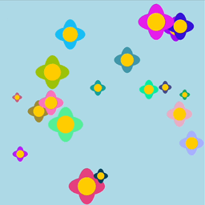

import EditableSketch from "../../../components/EditableSketch/index.astro";
import Callout from "../../../components/Callout/index.astro";
import AnnotatedLine from "../../../components/AnnotatedLine/index.astro";



In this tutorial, you will use p5.js to simulate an [interactive flower garden](https://editor.p5js.org/ptiarram/sketches/8xWVCzmn2). In this project, your digital canvas will come to life with 20 randomly generated flowers, each a different color and size. Users can also add diversity to the garden by clicking on the canvas to add new, unique flowers. Each flower is programmed with a wilting animation. This animation causes the flowers to slowly shrink and vanish, much like the natural cycle of a flower’s life.

In this tutorial, you will:

- Explore data structures like [JavaScript objects](https://developer.mozilla.org/en-US/docs/Glossary/object) by defining, creating, and using your own objects.
- Explore and use object methods to perform actions on built-in objects like [JavaScript arrays](https://developer.mozilla.org/en-US/docs/Web/JavaScript/Reference/Global_Objects/Array).
- Use iteration with for loops to manage multiple objects at once.


## Prerequisites

Before you begin, you should be able to:

- Add and customize shapes and color on the canvas using p5.js
- Declare, initialize, use, and update custom variables, and functions with parameters and return values
- Add animation on the canvas
- Comment code and address error messages
- Create and use custom functions
- Understand how to use for loops to manage repetitive tasks

For more information on arrays, loops, and custom functions, visit the [Organizing Code with Functions](/tutorials/organizing-code-with-functions) and [Repeating with Loops](/tutorials/repeating-with-loops) tutorials.

- In the [Variables and Change](/tutorials/variables-and-change) tutorial, you learned how to store data using variables. Variables are useful for storing single values like numbers or text. 
- In the [Animating with Media Objects](/tutorials/animating-with-media-objects) tutorial, you learned to use p5.js’ built-in `p5.Image` and `p5.Graphics` objects. These objects bundle data, like images, together with special functions called [*methods*](https://www.w3schools.com/js/js_object_methods.asp#:~:text=JavaScript%20methods%20are%20actions%20that,property%20containing%20a%20function%20definition.) that enable users to perform operations on that data. 

In this tutorial, you will learn how to:

- define objects
- create and use custom functions to update and draw objects
- manage multiple objects using arrays 

Let’s begin!


## JavaScript Objects

We have learned that variables can store one value at a time (a number, string, or Boolean). Arrays can store multiple values in indices. Sometimes, however, we want to store several pieces of related data about one thing together. We can do this using [JavaScript objects](https://developer.mozilla.org/en-US/docs/Web/JavaScript/Reference/Global_Objects/Object), which bundle data together by pairing [properties](https://developer.mozilla.org/en-US/docs/Glossary/Property/JavaScript) and values. Properties are special types of variables or names that are associated with an object. Each property stores a value. For example, if we wanted to create a JavaScript object based on a flower, it could have properties that describe its location (x and y) and emoji symbol.  


## Step 1: Make your first object

Let’s start our flower garden by creating one flower. We can start by drawing it using an emoji, so we need data on the x-coordinate, the y-coordinate, and the emoji for our flower. 

- Open a new p5.js project and name it “Data Structure Garden”. Save the project.

- Create a flower object by bundling the flower’s canvas coordinates with the emoji used to draw it. Let's store the object in a variable named `flower`. Add this code above [`setup()`](/reference/p5/setup): 

  ```js
  // Flower object.
  let flower = { 
    x: 200, 
    y: 100, 
    emoji: '🌸'
  };
  ```

- Print your object to the console by adding the following line of code in `setup()`:

  ```js
  // Print object to the console.
  console.log(flower);
  ```

-  Set the background to `"lightblue"`.

Your code should look like this:

<EditableSketch code={`
// Flower object.
let flower = { 
  x: 200, 
  y: 100,
  emoji: '🌸' 
};

function setup() {
  createCanvas(400, 400);

  // Print object in console.
  console.log(flower);
}
function draw() {
  background("lightblue");
}
`} />

Try opening the code so far [in the p5.js Web Editor.](https://editor.p5js.org/KM_Playground/sketches/Nwte7l2dD) You should see your flower object printed to the console. Notice how you can click on the arrow in the console to show the properties and values for the object.

Here's the general syntax for defining an object:

```js
// Define an object
let objectName = {
  property1: value1,
  property2: value2,
  property3: value3
};
```

The syntax for objects uses:

- curly braces (`{}`) to enclose a bundle of [properties](https://developer.mozilla.org/en-US/docs/Glossary/Property/JavaScript); 
  - Properties can be names, such as the names of variables or functions, or they can be strings. When using spaces in property names, it is often helpful to use a string. For example, I might create an object with a property for a “first name” and a “last name,” like this:

    ```js
    let ironMan = { 
      "first name" : "Tony",
      "last name" : "Stark"
    }
    ```

- a colon (:) to separate each property with specific values;
  - Values can be of any datatype, and can even be a function!
- commas (,) to separate each `property : value` pair. 

<AnnotatedLine code={({ top, bottom }) => `
let ${top('obj', 'flower')} = {
  ${bottom('prop', '    x    ')}: ${bottom('val', '  200  ')},
  ${bottom('prop', '    y    ')}: ${bottom('val', '  200  ')},
  ${bottom('prop', '  emoji  ')}: ${bottom('val', '  "🌸" ')}
}
`}>
    <Fragment slot="obj">Object name</Fragment>
    <Fragment slot="prop">Property</Fragment>
    <Fragment slot="val">Value</Fragment>
</AnnotatedLine>

You can store objects by initializing new variables when you define them. In the code above, you declared a variable named `flower`. You then initialized the `flower` variable with an object whose properties represent a flower that can be drawn on the canvas.

To check the properties and values of an object, you used [`console.log()`](/reference/console/log), which displays the following in the console:

```
▼ {x: 200, y: 100, emoji: "🌸"}
   x: 200`
   y: 100`
   emoji: "🌸"
```


## Step 2: Use your object

You can access any value stored in object properties by using its variable name, property name, and dot notation like so:

```js
// Access the object’s property1 value with dot notation.
objectName.property1 
```

- Use the [`text()`](/reference/p5/text) function with flower object properties to place the flower on the canvas.
  - In [`draw()`](/reference/p5/draw), add the following code: 

    ```js
    // Display flower object.
    text(flower.emoji, flower.x, flower.y);
    ```

- You can use `textSize()` before the text function to set the size of the flower.

  ```js
  // Increase the text/emoji size.
  textSize(100);
  ```

Your code should look like this:

<EditableSketch code={`
// Flower object.
let flower = { 
  x: 200, 
  y: 100,
  emoji: '🌸' 
};

function setup() {
  createCanvas(400, 400);
}

function draw() {
  background("lightblue");

  // Increase the text/emoji size.
  textSize(100);

  // Display flower object.
  text(flower.emoji, flower.x, flower.y);
}
`} />

To access values in the flower object, we use [dot notation](https://developer.mozilla.org/en-US/docs/Web/JavaScript/Reference/Operators/Property_accessors), which uses the dot operator to access properties and values within objects.

In the code above, you accessed:

- the emoji for the flower with `flower.emoji` 
- the x-coordinate with `flower.x` 
- the y-coordinate with `flower.y`

Since these values represent strings and numbers, they can be used in the [`text()`](/reference/p5/text) function, similar to the way variable names are used to access the value they store.

Visit the p5.js reference to learn more about [objects](/reference/p5/object).

<Callout>
- Add a `size` property to the flower object.
- Replace the `textSize()` value with the `flower` object’s `size`.

[Example.](https://editor.p5js.org/KM_Playground/sketches/ezATsCBra) 
</Callout>


## Step 3: Define a `createFlower()` function

Now, let’s define a function that can display different flowers on the canvas. We will define a `createFlower()` function that will allow us to customize the flower objects we create. We want to make sure that we can change the x- and y-coordinates for different flowers. We also want to change their size and color. One way to do that is to add new properties to the flower object for `size` and `color`. In this project, we also want the flower to appear, then disappear after some time. To do this, we will also include a `lifespan` property for our flower object. 

We want our `createFlower()` to return information when it’s called, just like the built-in `text()` function returns text on the canvas. Therefore, we must specify a [return value](https://developer.mozilla.org/en-US/docs/Learn/JavaScript/Building_blocks/Return_values). Using *return values* is a great way to save information computed by the function in a variable or array. 

In this example, we will be using [`random()`](/reference/p5/random) to create variety in our flowers when they’re drawn on the canvas. 

- Define the `createFlower()` function, which creates a random flower object. All values will be set randomly each time `createFlower() `is called.
  - Outside of [`draw()`](/reference/p5/draw) and [`setup()`](/reference/p5/setup), add the following function declaration:

    ```js
    // Function that creates a random flower object.
    function createFlower() {
      // Define a flower object.
      let flower = {
        x: random(20, 380),
        y: random(20, 380),
        size: random(20, 75),
        lifespan: random(255, 300),
        color: color(random(255), random(255), random(255)),
      };
      // Return the flower object.
      return flower;
    }
    ```

- Test the `createFlower()` function by using it to create a flower object, and store it in a variable called `myFlower`.
  - Add the following in the [`draw()`](/reference/p5/draw) function:

    ```js
    // Create flower object.
    let myFlower = createFlower();
    ```

- Draw an ellipse on the canvas using `myFlower` properties.
  - Add the following in the [`draw()`](/reference/p5/draw) function:  

    ```js
    // Use flower object properties to draw an ellipse.
    fill(myFlower.color);
    ellipse(myFlower.x, myFlower.y, myFlower.size);
    ```

- Slow down the rate at which each flower appears by changing the frame rate to one frame per second. In [`setup()`](/reference/p5/setup), add: `frameRate(1);`.

Your code should look like this:

<EditableSketch code={`
function setup() {
  createCanvas(400, 400);
  frameRate(1);
}
function draw() {
  background("lightblue");

  // Create flower object.
  let myFlower = createFlower();

  // Use flower object properties to draw an ellipse.
  fill(myFlower.color);
  ellipse(myFlower.x, myFlower.y, myFlower.size);
}
function createFlower() {
  // Define flower object.
  let flower = {
    x: random(20,380),
    y: random(20,380),
    size: random(20,75),
    lifespan: random(255,300),
    color: color(random(255), random(255), random(255)),
  };
  
  // Return flower object.
  return flower;
}
`} />

In the code above, you use `createFlower()` to create and return a new flower object with random values, then store the object in the variable `myFlower`. `myFlower` is used to access its property’s random values, which are used to draw an ellipse on the canvas. Each time [`draw()`](/reference/p5/draw) runs, a new random flower object is created, and its properties are used to draw a new random ellipse on the canvas. 

Visit the p5.js reference to learn more about [`return`](/reference/p5/return) values and [`random()`](/reference/p5/random).

<Callout>
- Change the random range for the flower’s `x` and `y` location and size.
- Get creative with the color generation; maybe it’s shades of only blues, reds, or purples.

[Example.](https://editor.p5js.org/KM_Playground/sketches/Cu8PrnNfH) 
</Callout>


## Step 4: Define the `drawFlower()` function with a parameter

Now that we know that `createFlower()` creates and returns a new flower object, let’s define the `drawFlower()` function.  Our `drawFlower()` function will receive a flower object as an argument and place it on the canvas. This will help make our code organized and manageable.

- Outside of all other functions, define the `drawFlower()` function with one parameter representing a flower object.

  ```js
  function drawFlower(flower) { }
  ```

- Inside the `drawFlower()` function, draw the attributes of a flower, including the petals and center of the flower. Remember to use the flower object properties for the `x` and `y` locations, `size`, and `color`. You can add the following code to the function body:

  ```js
  noStroke();
  fill(flower.color);
  
  // Draw petals.
  ellipse(flower.x, flower.y, flower.size / 2, flower.size); 
  ellipse(flower.x, flower.y, flower.size, flower.size / 2);
  
  // Draw a yellow center.
  fill(255, 204, 0);
  circle(flower.x, flower.y, flower.size / 2);
  ```

- Next, we will test the `drawFlower()` function. Add the following to the [`draw()`](/reference/p5/draw) function:

  ```js
  // Testing drawFlower().
  let flower1 = createFlower();
  drawFlower(flower1);
  ```

Your code should look similar to this:

<EditableSketch code={`
function setup() {
  createCanvas(400, 400);
  frameRate(1);
}

function draw() {
  background("lightblue");

  // Testing drawFlower().
  let flower1 = createFlower();
  drawFlower(flower1);
}

function createFlower() {
  let flower = {
    x: random(20,380),
    y: random(20,380),
    size: random(20,75),
    lifespan: random(255,300),
    color: color(random(255), random(255), random(255))
  };
  return flower;
}

function drawFlower(flower) { 
  noStroke();
  fill(flower.color);

  // Draw petals.
  ellipse(flower.x, flower.y, flower.size / 2, flower.size);
  ellipse(flower.x, flower.y, flower.size, flower.size / 2);

  // Draw a yellow center.
  fill(255, 204, 0);
  circle(flower.x, flower.y, flower.size / 2);
} 
`} />

In the code above, `createFlower()` is used to create and return a random flower that is stored in `flower1`. The random flower (`flower1`) is then passed into `drawFlower()`, which accesses the flower object properties to draw a flower on the canvas. This process occurs each time the [`draw()`](/reference/p5/draw) function runs, so random flowers appear and disappear on the canvas. 

<Callout>
Change and modify the flower drawing using other 2D shapes:

- [`ellipse()`](/reference/p5/ellipse)
- [`square()`](/reference/p5/square)
- [`quad()`](/reference/p5/quad)
- [`triangle()`](/reference/p5/triangle)
- [`line()`](/reference/p5/line)
- [`point()`](/reference/p5/point)
- [`arc()`](/reference/p5/arc)

[Example.](https://editor.p5js.org/KM_Playground/sketches/fDX0Xjq31)
</Callout>

## Step 5: Learn to use arrays

Before we move on to making our garden of flowers by using an array, let’s better understand how arrays work with a few simple examples. [JavaScript arrays](https://developer.mozilla.org/en-US/docs/Web/JavaScript/Reference/Global_Objects/Array) are objects that can store multiple values in one variable name. Each value is stored in an *element* with a specific location known as its *index*. The *index* of the first *element* in any [JavaScript array](https://developer.mozilla.org/en-US/docs/Web/JavaScript/Reference/Global_Objects/Array) is 0.


### Example 1: Creating and drawing an array of names

<EditableSketch code={`
// Create an array flowers
let flowers = ["Rose", "Daisy", "Tulip"];

function setup() {
  createCanvas(200, 200);

  background(220);

  // Draw the first name.
  fill('red');
  text(flowers[0], 10, 50);
  
  // Draw the second name.
  fill('green');
  text(flowers[1], 10, 100);
  
  // Draw the third name.
  fill('blue');
  text(flowers[2], 10, 150);
}
`} />

<AnnotatedLine code={({ bottom }) => `let flowers = [${bottom('i0', '"Rose"')}, ${bottom('i1', '"Daisy"')}, ${bottom('i2', '"Tulip"')}];`}>
    <Fragment slot="i0">0</Fragment>
    <Fragment slot="i1">1</Fragment>
    <Fragment slot="i2">2</Fragment>
</AnnotatedLine>

In this example, we’ve created an array using square brackets (`[ ]`) and commas that separate each element in the array. The array is a collection of strings, each representing a type of flower, and is stored in a variable called `flowers`. Each element of the array holds a string with a flower name. Each element can be accessed using its index number. For example, `"Rose"` is located at index `0`, `"Daisy"` at index `1`, and `"Tulip"` at index `2`.


<AnnotatedLine code={({ top, bottom }) => `let ${top('var', '   rose   ')} = ${top('arr', 'flowers')}[${top('idx', '   0   ')}];`}>
    <Fragment slot="var">Variable name to save the element</Fragment>
    <Fragment slot="arr">Array to point to</Fragment>
    <Fragment slot="idx">Index in array</Fragment>
</AnnotatedLine>

In the code snippet above, we access the first element of the `flowers` array at index 0 using the index notation: `flowers[0]`. In the example above, this syntax is used to place text on the canvas with the names accessed from various elements in the `flowers` array.

We then assign that value to a new variable named `rose`. `rose` now holds the string `"Rose"`, which is the first flower name in the `flowers` array. Values stored in other elements can be accessed in the same way.


### Example 2: Using a `for` loop to iterate through the array of names

<EditableSketch code={`
// Create an array flowers
let flowers = ["Rose", "Daisy", "Tulip"];

function setup() {
  createCanvas(200, 200);
}

function draw() {
  background(220);
  
  // Use a for loop to iterate over the array.
  for (let i = 0; i < flowers.length; i += 1) {
    text(flowers[i], 10, 50+(50 * i));
  }
}
`} />

Our second example uses a `for` loop to iterate through each element in the array and print the text on the canvas. *Iteration* is a process where a block of code is executed repeatedly for each element in an array. 

<AnnotatedLine code={({ top, bottom }) => `
for (${top('start', 'let i = 0;')} ${top('end', 'i < flowers.length')}; i += 1) {
  text(${bottom('access', 'flowers[i]')}, 10, 50+(50 * i));
}
`}>
    <Fragment slot="start">Start looking at index 0</Fragment>
    <Fragment slot="end">...up to the end of the array</Fragment>
    <Fragment slot="access">Grab flowers at element `i`</Fragment>
</AnnotatedLine>

To iterate, the code snippet above uses a `for` loop that “looks through” each element of the flower array. According to the `for` loop, the index `i` starts at `0` and increases with each iteration until it reaches a number that is one less than the number of elements in the array. Since arrays start their index at 0, the index of the last element in the array is one less than the number of elements in the array. The number of elements in any array can be accessed by using the `array.length` property. In the `for` loop above, the length of the `flowers` array is accessed using `flowers.length`. To access the values in the array, we use `flowers[i]` in the `for` loop in the [`text()`](/reference/p5/text) function to display the value in each element as text on the canvas.


### Example 3: Adding new elements to the array

<EditableSketch code={`
// Create an array flowers
let flowers = ["Rose", "Daisy", "Tulip"];

function setup() {
  createCanvas(200, 200);
  flowers.push("Sunflower"); //add new element

  background(220);
  
  // Use a for loop to iterate over the array.
  for (let i = 0; i < flowers.length; i += 1) {
    text(flowers[i], 10, 50+(40 * i));
  }
}
`} />

<AnnotatedLine code={({ top, bottom }) => `
let flowers = ["Rose", "Daisy", "Tulip"${bottom('add', '        ')}];
flowers${bottom('push', '.push("Sunflower");')}
`}>
    <Fragment slot="add">Pushed elements will add here</Fragment>
    <Fragment slot="push">Add a new element to the end of the `flowers` array</Fragment>
</AnnotatedLine>

Using the array method [`array.push()`](https://developer.mozilla.org/en-US/docs/Web/JavaScript/Reference/Global_Objects/Array/push), you can add a new element to the end of the array. In this example, we are adding `"Sunflower"` to the end of the `flowers` array.


### Example 4: Removing an array element

<EditableSketch code={`
// Create an array flowers
let flowers = ["Rose", "Daisy", "Tulip"];

function setup() {
  createCanvas(200, 200);
  
  // Starting at index 0, remove one flower.
  flowers.splice(0, 1); 

  background(220);
  
  for (let i = 0; i < flowers.length; i += 1) {
    text(flowers[i], 10, 50+(50 * i));
  }
}
`} />

<AnnotatedLine code={({ bottom }) => `
let flowers = [${bottom('i0', '"Rose"')}, ${bottom('i1', '"Daisy"')}, ${bottom('i2', '"Tulip"')}];
flowers.splice(${bottom('start', '   0   ')}, ${bottom('count', '   1   ')});
`}>
    <Fragment slot="i0">0</Fragment>
    <Fragment slot="i1">1</Fragment>
    <Fragment slot="i2">2</Fragment>
    <Fragment slot="start">At this index</Fragment>
    <Fragment slot="count">...remove one element</Fragment>
</AnnotatedLine>

In order to remove elements from an array, we use the function [`array.splice()`](https://developer.mozilla.org/en-US/docs/Web/JavaScript/Reference/Global_Objects/Array/splice). The function `array.splice()` modifies the `flowers` array with two parameters: one for the starting index and the other for how many elements to remove. `flowers.splice(0,1)` results in the removal of `"Rose"` from the array, leaving only `"Daisy"` and `"Tulip"`.


### Example 5: Using `for..of` loop for arrays

<EditableSketch code={`
// Create an array flowers
let flowers = ["Rose", "Daisy", "Tulip"];

function setup() {
  createCanvas(200, 200);
  
  background(220);
  let y = 50;
  
  // Use the special for loop to look at each element as a variable.
  for (let flower of flowers) {
    text(flower, 10, y);
    y += 50;
  }
}
`} />


<AnnotatedLine code={({ top, bottom }) => `
for (${top('decl', 'let flower')} ${top('kw', '   of   ')} ${top('arr', 'flowers')}) {
  print(${bottom('elt', '   flower   ')});
}
`}>
    <Fragment slot="decl">Declare a variable to store the current element</Fragment>
    <Fragment slot="kw">Keyword to loop over an array</Fragment>
    <Fragment slot="arr">Array to loop over</Fragment>
    <Fragment slot="elt">Do something with the current element</Fragment>
</AnnotatedLine>

We can also iterate over an array using a `for..of` loop. The `flower` variable temporarily stores each element during the loop’s iteration. The `print(flower)` statement inside the loop prints the name of each flower to the console, cycling through `"Rose"`, `"Daisy"`, and `"Tulip"` in order.

Using a `for..of` loop can make code easier to read when things become more complex, like in these examples: [`for` loop using indices](https://editor.p5js.org/Msqcoding/sketches/HrIxPGZEP) vs [`for..of` loop](https://editor.p5js.org/Msqcoding/sketches/TYq2M6noR). 


## Step 6: Generate multiple flowers with an array

Now, it’s time to generate multiple flowers on the screen using arrays.

 

- First, declare the `flowers` array at the top of your program. The square brackets with nothing in them represent an empty array of flowers.

  ```js
  // Array of flowers.
  let flowers = [];
  ```

- Outside of all other functions, define the `flowerPower()` function. 

  ```js
  // Function to create 20 flowers.
  function flowerPower() {}
  ```

- Inside `flowerPower()`, create 20 flower objects using a `for` loop and add them to your `flowers` array.

  ```js
  for(let i = 0; i < 20; i += 1) {
    // Create a flower in a random location.
    let flower = createFlower();
    // Add the flower to the flowers array.
    flowers.push(flower);
  }
  ```

- Call the `flowerPower()` function in the `setup()` function to create the 20 flower objects.

  ```js
  // Generate 20 flowers.
  flowerPower();
  ```

- Use the `for..of` loop for arrays in the `draw()` function to draw each flower in the `flowers` array. The `for..of` loop reads, for each flower element in the array of flowers, call `drawFlower()`.

  ```js
  // For each flower in the array of flowers.
  for (let flower of flowers) {
    drawFlower(flower);
  }
  ```

Your code should look similar to this:

<EditableSketch code={`
// Array of flowers.
let flowers = [];

function setup() {
  createCanvas(400, 400);
  frameRate(1);

  // Generate 20 flowers.
  flowerPower();
}
function draw() {
  background("lightblue");

  // For each flower in the array of flowers.
  for (let flower of flowers) {
    drawFlower(flower);
  }
}

// Function to create 20 flowers.
function flowerPower() {
  for (let i = 0; i < 20; i += 1 ) {
    // Create a flower in a random location.
    let flower = createFlower();

    // Add the flower to the flowers array.
    flowers.push(flower);
  }
}

// ... createFlower() and drawFlower()
function createFlower() {
  let flower = {
    x: random(20,380),
    y: random(20,380),
    size: random(20,75),
    lifespan: random(255,300),
    color: color(random(255), random(255), random(255))
  };
  return flower;
}
function drawFlower(flower) { 
  noStroke();
  fill(flower.color);

  // Draw petals.
  ellipse(flower.x, flower.y, flower.size / 2, flower.size);
  ellipse(flower.x, flower.y, flower.size, flower.size / 2);

  // Draw a yellow center.
  fill(255, 204, 0);
  circle(flower.x, flower.y, flower.size / 2);
} 
`} />

<Callout>
Add a parameter to your `flowerPower()` function so you can easily start with as many flowers as you like.

[Example.](https://editor.p5js.org/KM_Playground/sketches/BkgxufvQf)
</Callout>


## Step 7: Update the flowers in the array

Now that we have tested the array of flowers, let’s draw the wilting effect. One of the benefits of using an array to control the flowers is the ability to update values in each flower. 

- Outside of all other functions, define a function called `updateAndDrawFlowers()`:

  ```js
  function updateAndDrawFlowers() {}
  ```

- This function will look at each flower in the array and will draw the flower.

  ```js
  for (let flower of flowers) {
     drawFlower(flower);
  }
  ```

- Inside the `for` loop, decrease the flower object’s `size` and `lifespan` to simulate wilting. 

  Add a wilting animation effect, which will decrease the flower size by 1% after the `drawFlower()` function draws the flower. We create the wilting effect by multiplying the current size by 0.99 and storing it back into the flower’s `size` property. Then decrement the lifespan and store it in the flower’s `lifespan` variable. Use the multiply [assignment operator](https://developer.mozilla.org/en-US/docs/Web/JavaScript/Guide/Expressions_and_operators#assignment_operators) and [decrement](https://developer.mozilla.org/en-US/docs/Web/JavaScript/Reference/Operators/Decrement) operator in the following syntax:

  ```js
  // Wilting effect for the flower.
  flower.size *= 0.99;
  
  // Reduce lifespan.
  flower.lifespan -= 1; 
  ```

- When the flower object’s lifespan is zero or negative, we’ll remove it from the array by using the [`array.splice()`](https://developer.mozilla.org/en-US/docs/Web/JavaScript/Reference/Global_Objects/Array/splice) method. 

  ```js
  for (let flower of flowers) {
    // Draw the flower.
    drawFlower(flower);
  
    // Wilting effect for the flower.
    flower.size *= 0.99;
  
    // Reduce lifespan.
    flower.lifespan -= 1; 
  
    if (flower.lifespan <= 0) {
      // Save index of the flower
      let i = flowers.indexOf(flower);
  
      // Remove wilted flower 
      flowers.splice(i, 1); 
    }
  }
  ```

- Add `updateAndDrawFlowers()` to the `draw()` function.
- Remove the call to `frameRate(1)` from `setup()`.

Your code should look similar to this:

<EditableSketch code={`
// Array of flowers.
let flowers = []; 

function setup() {
  createCanvas(400, 400);
  
  // Generate 20 flowers.
  flowerPower(); 
}

function draw() {
  background("lightblue");
  
  // Call your new function.
  updateAndDrawFlowers();
}

// Define your new function.
function updateAndDrawFlowers() {
  for (let flower of flowers) {

    // Draw the flower.
    drawFlower(flower);

    // Apply wilting effect by reducing size by 1%
    flower.size *= 0.99;

    // Reduce lifespan
    flower.lifespan -= 1;
    
    if (flower.lifespan <= 0) {
      // Save index of the flower.
      let i = flowers.indexOf(flower);
      
      // Remove wilted flower.
      flowers.splice(i, 1);
    }
  }
}

// Function to create 20 flowers.
function flowerPower(){
  for(let i = 0; i < 20; i+=1){
    // Create a flower in a random location.
    let flower1 = createFlower();
    
    // Add the flower to the flowers array.
    flowers.push(flower1);
  }
}

function createFlower() {
  let flower = {
    x: random(20,380),
    y: random(20,380),
    size: random(20, 75),
    lifespan: random(255,300),
    color: color(random(255), random(255), random(255))
  };
  
  return flower;
}

function drawFlower(flower) {
  noStroke();
  fill(flower.color);
  
  // Draw petals.
  ellipse(flower.x, flower.y, flower.size / 2, flower.size);
  ellipse(flower.x, flower.y, flower.size, flower.size / 2);

  // Draw center.
  fill(255, 204, 0);
  circle(flower.x, flower.y, flower.size / 2);
  
}
`} />

<Callout>
Experiment with the wilting effect using subtraction, random numbers, or any other ideas you come up with.

[Example.](https://editor.p5js.org/KM_Playground/sketches/9YesvTdSi)
</Callout>


## Step 8: Add more flowers to the array with `mousePressed()`

Finally, let’s add more flowers to the canvas by using [`mousePressed()`](/reference/p5/mousePressed), [`mouseX`](/reference/p5/mouseX), and [`mouseY`](/reference/p5/mouseY) to add another flower object to the flowers array each time the canvas is clicked.

- Outside of all other functions, write your `mousePressed()` function:

  ```js
  function mousePressed() {
    let flower = createFlower();
  
    // reassign x to be mouseX
    flower.x = mouseX; 
    
    // reassign y to be mouseY
    flower.y = mouseY;
  
    // add the flower to the flowers array
    flowers.push(flower);
  }
  ```

Your code should look something like this:

<EditableSketch code={`
// Array of flowers.
let flowers = []; 

function setup() {
  createCanvas(400, 400);
  
  // Generate 20 flowers.
  flowerPower(); 
}

function draw() {
  background('lightblue');
  
  // Call your new function.
  updateAndDrawFlowers();
}

function mousePressed() {
  let flower = createFlower();

  // reassign x to be mouseX
  flower.x = mouseX; 
  
  // reassign y to be mouseY
  flower.y = mouseY;

  // add the flower to the flowers array
  flowers.push(flower);
}

function updateAndDrawFlowers() {
  for (let flower of flowers) {

    // Draw the flower.
    drawFlower(flower);

    // Apply wilting effect by reducing size by 1%
    flower.size *= 0.99;

    // Reduce lifespan
    flower.lifespan -= 1;
    
    if (flower.lifespan <= 0) {
      // Save index of the flower.
      let i = flowers.indexOf(flower);
      
      // Remove wilted flower.
      flowers.splice(i, 1);
    }
  }
}

// Function to create 20 flowers.
function flowerPower(){
  for(let i = 0; i < 20; i+=1){
    // Create a flower in a random location.
    let flower1 = createFlower();
    
    // Add the flower to the flowers array.
    flowers.push(flower1);
  }
}

function createFlower() {
  let flower = {
    x: random(20,380),
    y: random(20,380),
    size: random(20, 75),
    lifespan: random(255,300),
    color: color(random(255), random(255), random(255))
  };
  
  return flower;
}

function drawFlower(flower) {
  noStroke();
  fill(flower.color);
  
  // Draw petals.
  ellipse(flower.x, flower.y, flower.size / 2, flower.size);
  ellipse(flower.x, flower.y, flower.size, flower.size / 2);

  // Draw center.
  fill(255, 204, 0);
  circle(flower.x, flower.y, flower.size / 2);
  
}
`} />

<Callout>
- Add multiple flowers around the `mouseX` and `mouseY` locations when the mouse is pressed. ([Example](https://editor.p5js.org/KM_Playground/sketches/GmkrFWHSj))
- Experiment with different shapes or colors for the flowers. ([Example](https://editor.p5js.org/KM_Playground/sketches/uyIza6XVJ))
- Introduce new elements to the garden, like bees or butterflies, and see how they interact with the flowers. ([Example](https://editor.p5js.org/KM_Playground/sketches/jPO02404x))
</Callout>


## Conclusion

Congratulations on completing the Data Structure Garden tutorial!

Throughout this journey, you learned about the fundamental concepts of JavaScript objects and arrays to create a dynamic and interactive garden simulation. Using arrays, you’ve managed multiple objects elegantly and efficiently, each with their own properties and behaviors. This is a powerful skill in the world of programming, opening doors to more complex and interactive applications.


## Next Steps

- Use HTML & CSS with p5.js in the [Creating and Styling HTML](/tutorials/creating-styling-html) tutorial.
- Use [ml5.js](https://ml5js.org/) with p5.js in the [Abracadabra: Speak With Your Hands](/tutorials/speak-with-your-hands) tutorial.
- Use [node.js](https://www.w3schools.com/nodejs/nodejs_intro.asp) with p5.js in the [Getting Started with Node.js](/tutorials/getting-started-with-nodejs) and [Melody App](/tutorials/melody-app) tutorials.

Once again, well done on completing this tutorial. Keep experimenting, keep coding, and most importantly, enjoy learning and creating!


## Resources

- [JavaScript Objects](https://developer.mozilla.org/en-US/docs/Learn/JavaScript/Objects/Basics)
- [Properties - JavaScript Objects](https://developer.mozilla.org/en-US/docs/Glossary/Property/JavaScript)
- [Property Accessors - dot notation](https://developer.mozilla.org/en-US/docs/Web/JavaScript/Reference/Operators/Property_accessors)
- [Function return values](https://developer.mozilla.org/en-US/docs/Learn/JavaScript/Building_blocks/Return_values)
- [JavaScript arrays](https://developer.mozilla.org/en-US/docs/Web/JavaScript/Reference/Global_Objects/Array)
- [Expressions and Operators](https://developer.mozilla.org/en-US/docs/Web/JavaScript/Guide/Expressions_and_operators#assignment_operators)
