import { Columns, Column } from "../../../components/Columns";

## Debugging

This is a field guide to debugging for everyone, whether you are beginning to code or have been coding for a long time. It breaks down the mysterious process of solving problems with your code.


### 0. Debugging is a creative act

At all levels, programmers encounter bugs and often spend more time debugging than actually programming the application. You can expect to spend a lot of time doing this. It’s important to develop good strategies for identifying and working through bugs as you learn to program in p5.js.

A **bug** is a gap between what you *think* your system is doing and what it *actually* does. [Clay Shirky aptly describes](https://vimeo.com/channels/debugging) a bug as “the moment when there is both a technical problem with your code as well as a problem with your mental picture of what is happening in your code.”


You think you are telling the computer one thing, but it’s doing something else. It may also be crashing or throwing errors. You must investigate to close the gap.

When you work on a project, you may play many different roles. You are an *architect* when designing and planning your program, and an *engineer* when developing it. Then you will be an *explorer*, discovering its problems and errors. You will test your code in all situations it needs to run, trying to find out where it might break. Finally, you are also a *detective*, trying to figure out how and why things failed.


So how can you become a good detective and debug your program? Here are ten steps that can help you become a good code sleuth.


### 1. Change your perspective

Don’t panic.

When you encounter a bug that you don’t know how to solve, stop, pause, and take a deep breath. Stand up, say hi to a pet, take a walk, or, if it’s late, get some rest. When you are frustrated, tired, or upset, you are not in a reasonable frame of mind to learn or solve a problem.

To find the errors you will need to change your perspective and become a detective. *The goal is to find out what the program is doing rather than why it’s not doing what it’s supposed to.* We need to get the computer to show us what it’s doing.

The clues are in the values of variables and the flow of the program.

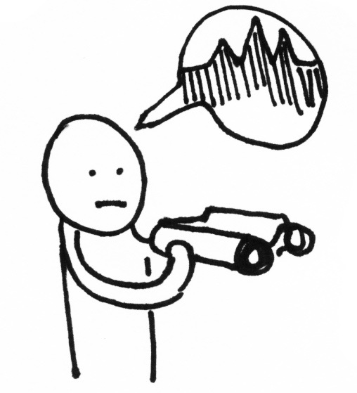


### 2. Observe the problem 

Walk someone through the issue even if they themselves do not know how to program. If no one is around, draft an email or direct message to someone you trust. Explain the code you have written in detail, describe what happens when the program runs, and break down any problems you run into.

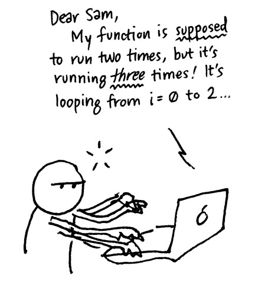

You probably won’t need to actually send this email! Often the act of writing will help you to locate and identify what you need to do next. Some programmers have even been known to explain their problem to a friendly inanimate object like a rubber ducky.

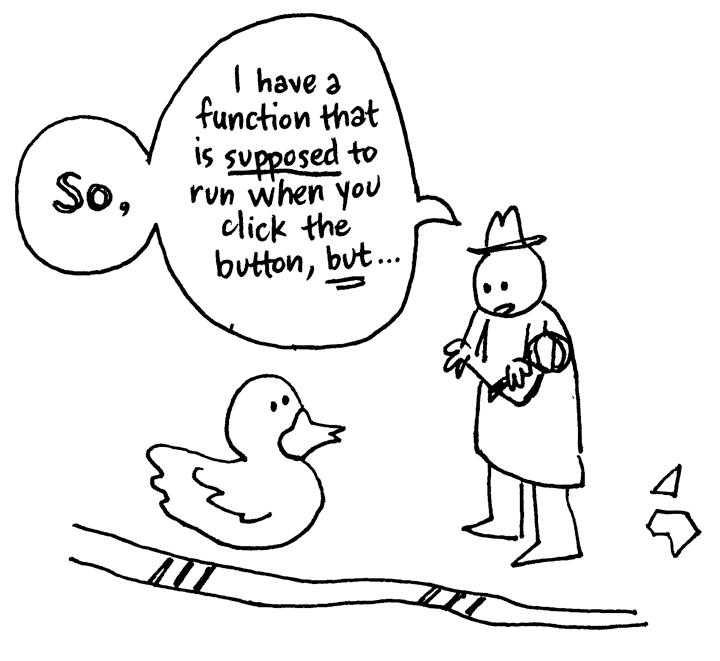

This is also a good time to add comments to your code that tell you exactly what each line does. Some coders also print out their code (or a section of it) and go through it line by line, tracing the changes to variables and making notes.

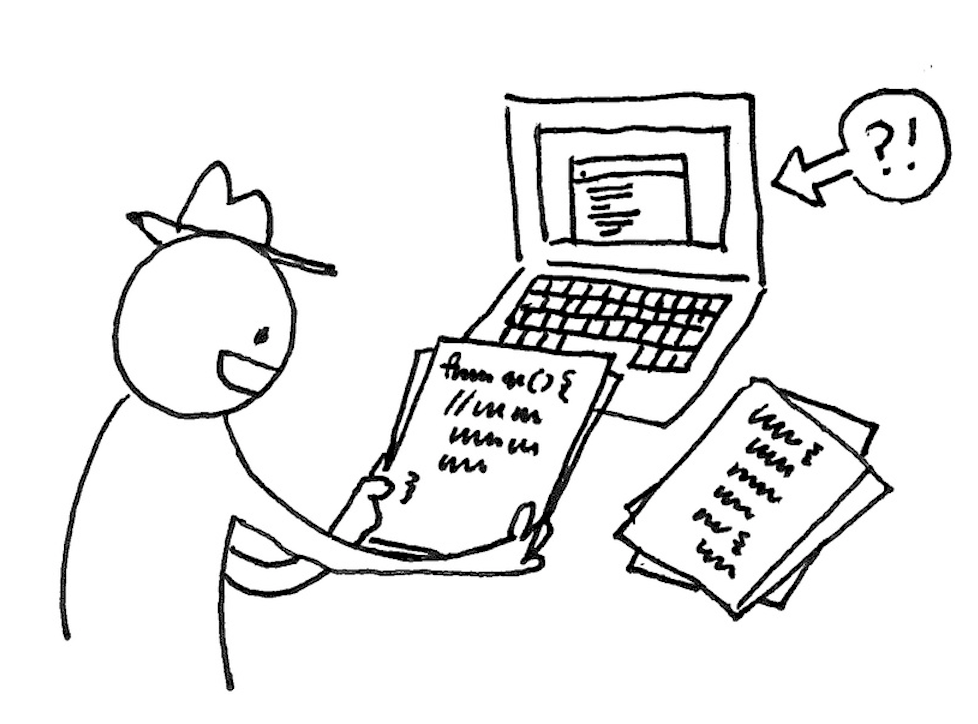


### 3. Before you start making changes…

Before doing anything to your code, save a copy that you can go back to. While debugging you are likely to introduce other problems, break things, or accidentally delete good work.

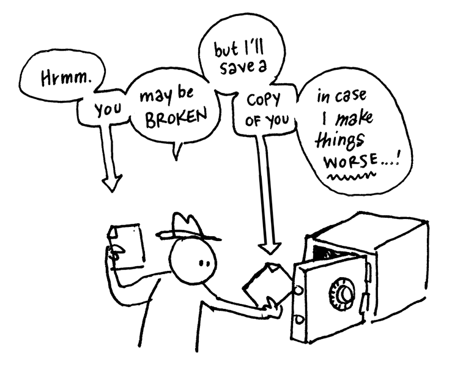

You don’t want to make bigger bugs in the process of debugging.

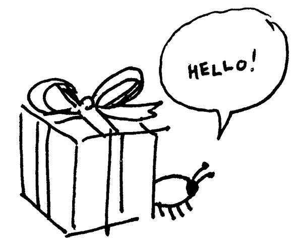

If you make a mistake or your problem gets worse, you can always UNDO or revert to your saved file.

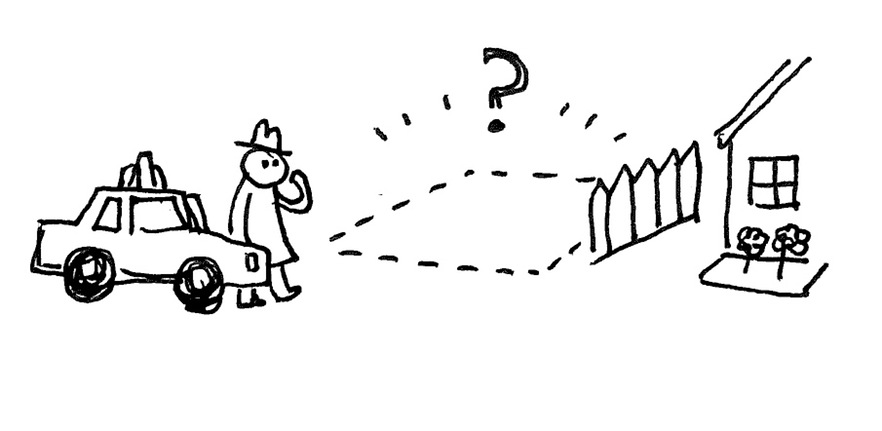

You can try version control such as [GitHub](https://github.com).

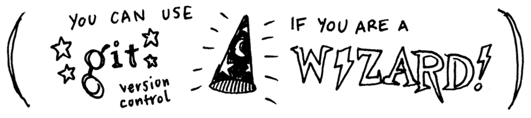

Write a list of what you are trying so you can keep track of what still needs to be checked. Be methodical; it will save you a lot of time in the long run.

Change only one thing at a time.

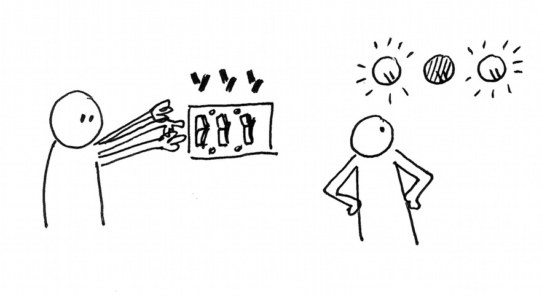

As you debug, you will be turning parts of your code on and off. Every time you make a change, test your program. If you make multiple changes before testing, it could be hard to tell which change has what effect and is likely to break things further.


### 4. Check the basics

Many bugs end up being very basic mistakes, like forgetting to plug in the power cord for an appliance! These mistakes are often “invisible” and require you to check for them. Check the simple stuff, like:

- Are you editing the correct file?

  In a basic sketch, you typically write code in the sketch.js file. In other projects, you might be writing code in [other files as well](https://developer.mozilla.org/en-US/docs/Learn/Getting_started_with_the_web/Dealing_with_files), so make sure you edit and save the correct files during various steps in the process.

  

- Are your file dependencies correct?

  Basic sketches are dependent on the [version of p5.js](https://p5js.org/download/) you have installed on your computer or linked in the HTML file of a p5.js project. When [using other libraries](https://developer.mozilla.org/en-US/docs/Learn/Tools_and_testing/Understanding_client-side_tools/Package_management), make sure they are linked in the HTML file or properly saved on your computer.

  

- Are there any typos in your file paths?

  When reading and writing files, or including [other libraries](https://developer.mozilla.org/en-US/docs/Learn/Tools_and_testing/Understanding_client-side_tools/Package_management),  check for spelling errors in the [file path](https://developer.mozilla.org/en-US/docs/Learn/Getting_started_with_the_web/Dealing_with_files#file_paths) or URL. Stick with simple file names when uploading and using files in your projects to help decrease the chances of spelling errors. Double-check that the types of files you are uploading are consistent with the functions you are using.

  

- Are all external files and services accessible?

  Check for any network issues that may be affecting your internet connection. Ensure all external libraries are correctly installed in the correct files for us in your projects when working off a local server. Double check [API endpoints](https://developer.mozilla.org/en-US/docs/Learn/JavaScript/Client-side_web_APIs/Introduction), links, URLs and file paths are all correct by testing them in basic programs.


### 5. Check black boxes

A black box describes any part of your system whose inner workings you don’t understand. For example, a function that you did not write and cannot explain, line by line, can be considered a black box. When you don’t know why specific inputs generate specific outputs, you don’t really understand the code. To check these, systematically remove each black box one-by-one and run your program. 

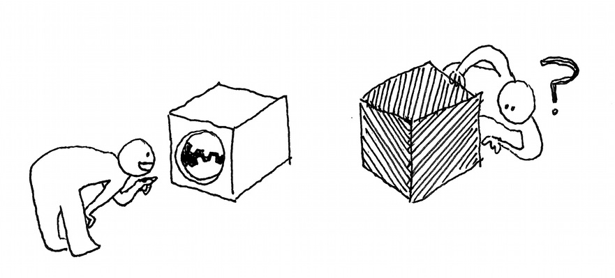


### 6. Add error reporting

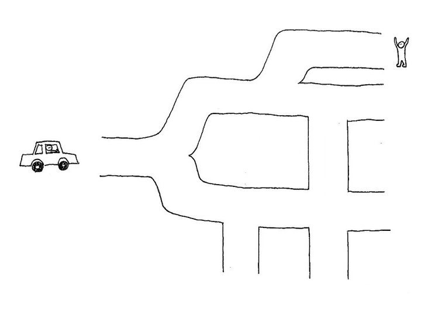

Error reporting is how your program tells you what it is doing. p5.js comes with some built-in error reporting that will tell you if you have made specific syntax errors. You can learn more about [error messages](#error-messages) in the second half of this guide.

It’s also useful to add your own error reporting using the `console.log()` function to print messages.

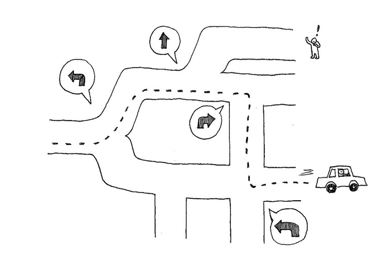

When you look at your console, you can see the order in which things happen and where you encounter problems. `console.log()` is also useful to print out values of variables so that you can see what they are doing at different points in your program.

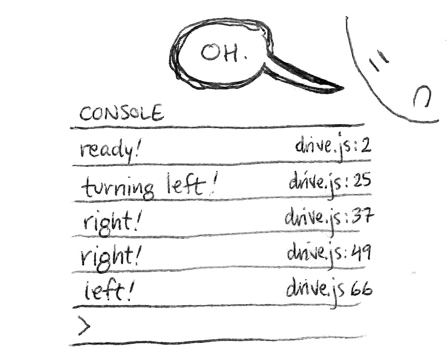


### 7. Search for more help

So, none of this works? There are many places you can look online to get more help:

- Search the internet. If you have had this problem, chances are many other people will have too.
- Search the [Processing Discourse](https://discourse.processing.org/c/p5js) and [p5.js Discord](https://discord.gg/SHQ8dH25r9).
- Search development forums such as [Stack Overflow](http://stackoverflow.com/).

More general  resources:

- Mozilla's [JavaScript Guide](https://developer.mozilla.org/en-US/docs/Web/JavaScript/Guide), [JavaScript](https://developer.mozilla.org/en-US/docs/Web/JavaScript/Reference), and [JavaScript error](https://developer.mozilla.org/en-US/docs/Web/JavaScript/Reference/Errors) references are really helpful for finding all of the built-in methods for objects such as strings, and learning about JavaScript error messages.
- Mozilla's [Debugging HTML](https://developer.mozilla.org/en-US/docs/Learn/HTML/Introduction_to_HTML/Debugging_HTML), [Debugging CSS](https://developer.mozilla.org/en-US/docs/Learn/CSS/Building_blocks/Debugging_CSS), and [Cross-browser testing](https://developer.mozilla.org/en-US/docs/Learn/Tools_and_testing/Cross_browser_testing/Introduction) references are helpful for finding bugs in HTML and CSS files.
- Marjin Haverbeke’s interactive textbook [*Eloquent JavaScript*](https://eloquentjavascript.net/).

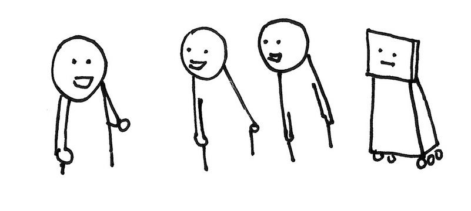

### 8. Ask others

Still not working?

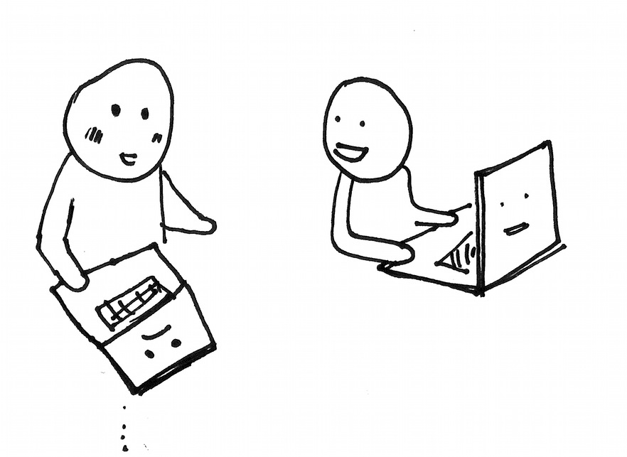

You can also ask people for help! They might be delighted to help and share their debugging experiences with you.

Send that email you wrote describing your problem and what you want to know. Post it to the [Processing Discourse](https://discourse.processing.org/c/p5js) and [p5.js Discord](https://discord.gg/SHQ8dH25r9) or other community forums. 


### 9. Good coding practices and how to prevent bugs!

Some bugs can be prevented with good coding practices. Some include:

- Start with pseudocode as comments, then add code underneath each step.
- Begin solving small problems! Do one thing at a time. It's okay to make smaller sketches to test one thing, then Voltron them together into a bigger sketch when you know they work! For example, draw a cloud then check the weather! Then draw a cloud that turns dark when it’s about to rain!
- Put `console.log()`s in your code as you develop.
- Test frequently so that if something changes, you know what you did since the last time you tested.
- Save different versions of your code as you test so that you can revert back to it later if something breaks.
- Do not optimize prematurely. Optimized code can often be harder to read. Clear code is more important than high-performing code when building your program. When you are sure everything works as expected, then you can optimize for performance!
- Do not abstract prematurely. You don't need to make functions or objects for things you think you'll use multiple times until you actually have to use them more than once.

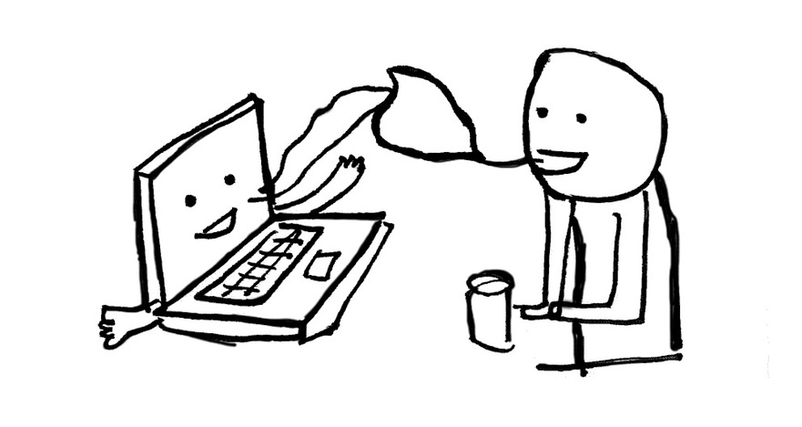


### 10. More resources

This guide has been inspired by several other fantastic resources on debugging when coding. Some of these are here:

- Clay Shirky, [A brief introduction to debugging](https://vimeo.com/channels/debugging)
- Eric Steven Raymond, [How to ask questions the smart way](http://www.catb.org/esr/faqs/smart-questions.html)


## Error Messages<a id="error-messages"></a>

Your web browser has a console area that communicates with programmers using text. It displays helpful **error messages** that describe lines of code that p5.js doesn’t understand. You can use various [JavaScript error messages](https://developer.mozilla.org/en-US/docs/Web/JavaScript/Reference/Errors) to locate bugs in your code. The examples below show how this works in the [p5.js Web Editor](https://editor.p5js.org).

**Note:** The p5.js Web Editor’s [friendly error systems (FES)](https://medium.com/processing-foundation/2017-marks-the-processing-foundations-sixth-year-participating-in-google-summer-of-code-d365f62fc463) also sends messages in the console to help you debug!


### Example 1: `SyntaxError` (missing parentheses)

<Columns>
<Column>

In this code, the programmer expected a rectangle to appear on the canvas; instead, the [p5.js Web Editor](https://editor.p5js.org/) displayed an error message in the console, and nothing appeared (not even a blank canvas).

#### Error Message:

```
SyntaxError: missing ) after argument list
```

#### Bug:

According to the message in the console, the programmer has made a `SyntaxError`, which means a character is misplaced or missing somewhere in the code.

The [p5.js Web Editor](https://editor.p5js.org/) highlighted line 9 in red, indicating where you can find the error. The message in the console also specifies that the error is on line 9 of the `sketch.js` file (click the arrow next to `SyntaxError`).

[Link to sample project](https://editor.p5js.org/Msqcoding/sketches/BMIIMpyKs)

</Column>
<Column>
#### Code:

```js
function setup() {
  createCanvas(400, 400);
}
function draw() {
  background(220);

  // rectangle
  rect(200,200,200,100;
}
```
</Column>
</Columns>

<Columns>
<Column>
#### Solution:

The programmer solved the problem by adding a parenthesis between the last argument and a semicolon. They discovered this by visiting the p5.js reference page for [`rect()`](https://p5js.org/reference/#/p5/rect) and comparing code.

#### Pro Tips:

1. Always refer to the [p5.js reference](https://p5js.org/reference/) to check that your code is written with the correct syntax.
2. If an error message appears and you don’t understand what it means, copy and paste it into Google and see if you can figure it out!
</Column>
<Column>
#### Code:
```js
function setup() {
  createCanvas(400, 400);
}
function draw() {
  background(220);

  // rectangle
  rect(200,200,200,100);
}
```
</Column>
</Columns>


### Example 2: Missing Arguments

<Columns>
<Column>

In this code, the programmer expected a circle to appear on the canvas; instead, the error below appeared in the console, and nothing appeared on the canvas.

#### Error Message:

```
p5.js says: [sketch.js, line 9] circle() was expecting at least 3 arguments but received only 2.canvas.
```

#### Bug:

According to the message in the console, [`circle()`](https://p5js.org/reference/#/p5/circle) only received 2 inputs when it expected 3. The message also specifies that the error is on line 9 of the sketch. 

</Column>
<Column>
#### Code:
```js
function setup() {
  createCanvas(400, 400);
}
function draw() {
  background(220);

  // circle
  circle(200,200);
}
```
</Column>
</Columns>

<Columns>
<Column>
#### Solution:

The programmer solved the problem by adding a third argument in [`circle()`](https://p5js.org/reference/#/p5/circle).

They discovered this by visiting the p5.js reference page for [`circle()`](https://p5js.org/reference/#/p5/circle) and comparing code.

#### Pro Tips:

1. Always refer to the [p5.js reference](https://p5js.org/reference/) to check that your code is written with the correct syntax.
2. If an error message appears and you don’t understand what it means, copy and paste it into Google and see if you can figure it out!

</Column>
<Column>
#### Code:

```js
function setup() {
  createCanvas(400, 400);
}
function draw() {
  background(220);

  // circle
  circle(200,200,200);
}
```
</Column>
</Columns>


### Example 3: `SyntaxError` (missing curly bracket example)

<Columns>
<Column>

In this code, the programmer expected an emoji to appear on the canvas.

#### Error Message:

```
SyntaxError: Unexpected end of input
```

#### Bug:

According to the message in the console, p5.js is flagging a `SyntaxError`, which means a character is misplaced or missing somewhere in the code. The message also specifies that the error is on line 11 of the sketch. 

The [p5.js Web Editor](https://editor.p5js.org/) highlighted line 11 in red, indicating where you can find the error. The message in the console also specifies that the error is on line 11 of the sketch.js file (click the arrow next to `SyntaxError`).

</Column>
<Column>
#### Code:

```js
function setup() {
  createCanvas(400, 400);
}
function draw() {
  background(220);

  // happy emoji
  text("😎", 180, 200);
}
```

</Column>
</Columns>

<Columns>
<Column>
#### Solution:

The programmer solved the problem by adding a *closing curly bracket* (`}`) on line 11 to close the [`draw()`](https://p5js.org/reference/#/p5/draw) function.

They discovered this by visiting the p5.js reference page for [`draw()`](https://p5js.org/reference/#/p5/draw) and comparing code.

#### Pro Tips:

1. Always refer to the [p5.js reference](https://p5js.org/reference/) to check that your code is written with the correct syntax.
2. If an error message appears and you don’t understand what it means, copy and paste it into Google and see if you can figure it out!

</Column>
<Column>
#### Code:

```js
function setup() {
  createCanvas(400, 400);
}
function draw() {
  background(220);

  // happy emoji
  text("😎", 180, 200);
}
```

</Column>
</Columns>

### Example 4. `ReferenceError`

<Columns>
<Column>

In this code, the programmer expected a circle to appear on the canvas; instead, the error below appeared in the console.

#### Error Message:

```
ReferenceError: myX is not defined
```

#### Bug:

According to the message in the console, the programmer has made a `ReferenceError`, which means they tried to use a variable that doesn’t exist (or hasn’t yet been initialized) in the current scope.

The p5.js Web Editor highlighted line 8 in red, indicating it as the source of the error. 

</Column>

<Column>
#### Code:

```js
function setup() {
  createCanvas(400, 400);
}
function draw() {
  background(220);

  circle(myX, 200, 200);
}
```

</Column>
</Columns>

<Columns>
<Column>

#### Solution:

The programmer solved the problem by noticing that the variable `myX,` which appears on line 8, was not declared or initialized in the sketch. They declared and initialized `myX` before `setup()` to fix the bug. 

#### Pro Tip:

If an error message appears and you don’t understand what it means, copy and paste it into Google and see if you can figure it out BEFORE calling on a teacher or a friend.

</Column>
<Column>
#### Code:

```js
let myX = 200;

function setup() {
  createCanvas(400, 400);
}
function draw() {
  background(220);

  circle(myX, 200, 200);
}
```

</Column>
</Columns>


### Example 5. `TypeError`

<Columns>
<Column>

In this code, the programmer expected a circle to appear on the canvas; instead, the error below appeared in the console.

#### Error Message:

```
p5.js says: [sketch.js, line 10] circle() was expecting Number for the first parameter, received string instead.
```

#### Bug:

According to the message in the console, the programmer made an error on line 10 - the [circle()](https://p5js.org/reference/#/p5/circle) function needs a [number](https://p5js.org/reference/#/p5/number) as the first parameter, but it was given a [string](https://p5js.org/reference/#/p5/string).

</Column>
<Column>
#### Code:

```js
let myX = "forty-five";

function setup() {
  createCanvas(400, 400);
}
function draw() {
  background(220);

  circle(myX, 200, 200);
}
```

</Column>
</Columns>

<Columns>
<Column>

#### Solution:

The programmer solved the problem by noticing that the variable `myX` was initialized with `"forty-five"`, which cannot be recognized as a [number](https://p5js.org/reference/#/p5/number). p5.js thinks it’s just a word with a [string](https://p5js.org/reference/#/p5/string) data type.

#### Pro Tip:

If an error message appears and you don’t understand what it means, copy and paste it into Google and see if you can figure it out BEFORE calling on a teacher or a friend.

</Column>
<Column>
#### Code:

```js
let myX = 200;

function setup() {
  createCanvas(400, 400);
}
function draw() {
  background(220);

  circle(myX, 200, 200);
}
```

</Column>
</Columns>


### Example 6. `ReferenceError`

<Columns>
<Column>

In this code, the programmer expected a circle to appear on the canvas; instead, the error below appeared in the console.

#### Error Message:

```
ReferenceError: localVariable is not defined.
p5.js says: [sketch.js, line 10] "localVariable" is not defined in the current scope. If you have defined it in your code, you should check its scope, spelling, and letter-casing (JavaScript is case-sensitive).
```

#### Bug:

According to the message in the console, the programmer has made a `ReferenceError: localVariable` is not defined.

It also says that on line 10, `localVariable` is not defined in the current scope.

This means that `localVariable` used in `draw()` is not defined to `draw()` - it can’t recognize it! It has local scope and is only recognizable within `setup()`, where it was declared.

</Column>
<Column>
#### Code:

```js
function setup() {
  createCanvas(400, 400);
  let localVariable = 200;
}
function draw() {
  background(220);

  circle(localVariable, 200, 200);
}
```

</Column>
</Columns>

<Columns>
<Column>

#### Solution:

The programmer solved the problem by declaring `localVariable` outside of [`setup()`](https://p5js.org/reference/#/p5/setup) and [`draw()`](https://p5js.org/reference/#/p5/draw) and initializing it in [`setup()`](https://p5js.org/reference/#/p5/setup).

#### Pro Tip:

If an error message appears and you don’t understand what it means, copy and paste it into Google and see if you can figure it out BEFORE calling on a teacher or a friend.

</Column>

<Column>
#### Code:

```js
// declare variable globally
let localVariable;

function setup() {
  createCanvas(400, 400);
  localVariable = 200;
}
function draw() {
  background(220);

  circle(localVariable, 200, 200);
}
```
</Column>
</Columns>


### Example 7: `SyntaxError` (missing argument in a function call)

<Columns>
<Column>

In this code, the programmer expected a butterfly to appear on the canvas; instead, the error below appeared in the console.

#### Error Message:

```
🌸 p5.js says: [sketch.js, line 14] textSize() was expecting Number for the first parameter but received an empty variable instead. If not intentional, this is often a problem with scope.
```

#### Bug:

According to the message in the console, the `textSize()` is missing an argument from the function declaration for `butterfly()`. The error is indicated on line 14, where the `butterfly()` function is called. 

This means that there is a missing argument in the function call that is supposed to be passed to `textSize()` from the function declaration. 

</Column>
<Column>
#### Code:

```js
function setup() {
  createCanvas(400, 400);
}

function draw() {
  background(220);
  
  //butterfly on the left
  butterfly(50,50);
}

/* function for a butterfly that lets you customize x, y and size */
function butterfly(x, y, size){
  textSize(size);
  text(`🦋`, x, y);
}
```

</Column>
</Columns>

<Columns>
<Column>
#### Solution:

The programmer solved the problem by declaring including 3 arguments in the function call for `butterfly(50, 50, 50);`

#### Pro Tip:

The number of arguments in the function call must match the parameters in its declaration. 

</Column>

<Column>
#### Code:

```js
function setup() {
  createCanvas(400, 400);
}

function draw() {
  background(220);
  
  //butterfly on the left
  butterfly(50,50, 50);
}

/* function for a butterfly that lets you customize x, y and size */
function butterfly(x, y, size){
  textSize(size);
  text(`🦋`, x, y);
}
```

</Column>
</Columns>


## Next Steps:

- [Watch the Coding Train video about errors!](https://www.youtube.com/watch?v=LuGsp5KeJMM)


## Resources

- [Dealing with files](https://developer.mozilla.org/en-US/docs/Learn/Getting_started_with_the_web/Dealing_with_files)
- [Download p5.js](https://p5js.org/download/)
- [Package management](https://developer.mozilla.org/en-US/docs/Learn/Tools_and_testing/Understanding_client-side_tools/Package_management)
- [Introduction to Web APIs](https://developer.mozilla.org/en-US/docs/Learn/JavaScript/Client-side_web_APIs/Introduction)
- [Processing Discourse](https://discourse.processing.org/c/p5js)
- [p5.js Discord](https://discord.gg/SHQ8dH25r9)
- [Stack Overflow](http://stackoverflow.com/)
- [JavaScript Guide](https://developer.mozilla.org/en-US/docs/Web/JavaScript/Guide)
- [JavaScript reference](https://developer.mozilla.org/en-US/docs/Web/JavaScript/Reference)
- [JavaScript error reference](https://developer.mozilla.org/en-US/docs/Web/JavaScript/Reference/Errors)
- [Debugging HTML](https://developer.mozilla.org/en-US/docs/Learn/HTML/Introduction_to_HTML/Debugging_HTML)
- [Debugging CSS](https://developer.mozilla.org/en-US/docs/Learn/CSS/Building_blocks/Debugging_CSS)
- [Cross-browser testing](https://developer.mozilla.org/en-US/docs/Learn/Tools_and_testing/Cross_browser_testing/Introduction) 
- [Eloquent JavaScript](https://eloquentjavascript.net/)
- [A brief introduction to debugging](https://vimeo.com/channels/debugging)
- [How to ask questions the smart way](http://www.catb.org/esr/faqs/smart-questions.html)
- [Friendly Error System for p5.js](https://medium.com/processing-foundation/2017-marks-the-processing-foundations-sixth-year-participating-in-google-summer-of-code-d365f62fc463)
- [p5.js reference](/reference/)
