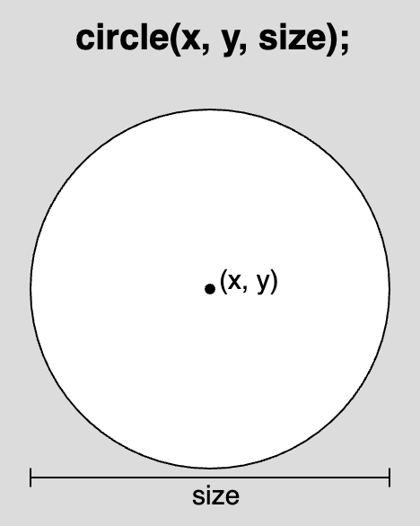

import EditableSketch from "../../../components/EditableSketch/index.astro";
import { Callout } from "../../../components/Callout";

Welcome to p5.js! New to p5.js and want to learn some basics for creating an interactive sketch? Follow this tutorial to create a simple [interactive landscape](https://editor.p5js.org/Msqcoding/sketches/SDbVilWaf). You will learn how to:

- Change the canvas size and background color
- Add, customize, and color shapes and text
- Add simple interactivity by having your sketch respond to the mouse pointer position
- Comment code
- Use [the p5.js reference](/reference/) pages to learn more


## Prerequisites

- [Setting Up Your Environment](setting-up-your-environment)

Before you begin you should be able to:

- Log in to the [p5.js Web Editor](https://editor.p5js.org/) and save a new project

**or** 

- Create and save a new p5.js project in [VS Code](https://code.visualstudio.com/) (or another code editor)

For a step-by-step guide to creating and saving projects in the [p5.js Web Editor](https://editor.p5js.org/) or [VS Code](https://code.visualstudio.com/), visit [Setting Up Your Environment](setting-up-your-environment).


## Step 1: Name and save a new p5.js project

- Create a new p5.js project, give it a name, and save it.

Using the [p5.js Web Editor](https://editor.p5js.org/):

- Log in to the [p5.js Web Editor](https://editor.p5js.org/).
- Name your project “Interactive Landscape” by clicking the *pencil icon* and typing “Interactive Landscape” into the text box that appears.
- Click on *File* and select *Save*.
- Confirm your project is saved by navigating to your gallery of saved sketches:
  - Click on *File* and select *Open*.
  - Your most recent sketches will appear at the top of the list of projects saved on your account.


#### Default Code

All p5.js projects include the p5.js library and three files: [`index.html`](https://www.classes.cs.uchicago.edu/archive/2021/spring/11111-1/happycoding/p5js/web-dev.html#:~:text=The%20index.,the%20page%20using%20HTML%20tags!), [style.css](https://happycoding.io/tutorials/p5js/web-dev), and `sketch.js`. Make changes on the canvas by adding code to the sketch.js file. New p5.js projects begin with the following code in the sketch.js file:

```js
function setup() {
  createCanvas(400, 400);
}
function draw() {
  background(220);
}
```

Every sketch.js file begins with two main functions: [`setup()`](/reference/p5/setup) and [`draw()`](/reference/p5/draw). 

[Functions](/reference/p5/function) are sequences of instructions that perform specific tasks. 

When the code in sketch.js is executed:

- [`setup()`](/reference/p5/setup) is called and runs one time. It can be used to set default values for your project.
  - Within the curly brackets (`{}`) for [`setup()`](/reference/p5/setup), `createCanvas(400, 400)` creates an HTML canvas that is 400 pixels wide and 400 pixels high that you can see in the preview window. 
- [`draw()`](/reference/p5/draw) is called directly after [`setup()`](/reference/p5/setup) and executes the lines of code inside its curly brackets 60 times per second until the program is stopped or the [`noLoop()`](/reference/p5/noLoop) function is called. 
  - Within the curly brackets of [`draw()`](/reference/p5/draw), also known as the [`draw()`](/reference/p5/draw) code block, the [`background()`](/reference/p5/background) function sets the color of the canvas background. The default value (220) sets the color of the canvas to gray.

Visit the [p5.js reference](/reference/) pages for [`setup()`](/reference/p5/setup), [`draw()`](/reference/p5/draw), [`createCanvas()`](/reference/p5/createCanvas), and [`background()`](/reference/p5/background) to learn more.

## Step 2: Change the size of the canvas

- Change the size of the canvas so that it is 600 pixels wide and 400 pixels high by changing the *arguments* for [`createCanvas()`](/reference/p5/createCanvas). Press *Play* to see changes in the preview window.
- Make sure you press the *Play* button or have the *Auto-refresh* box checked to update the canvas.

Your code should look like this:

```js
function setup() {
  createCanvas(600, 400);
}
function draw() {
  background(220);
}
```

<Callout title="Tip">
Click *Play* and check the box next to “Auto-refresh” on the [p5.js Web Editor](https://editor.p5js.org/) to continuously update the canvas as you add more code to your project. With this box checked, you won’t need to press the *Play* button every time you make changes to your sketch.
</Callout>

## Step 3: Use comments to describe code

- Write a comment that describes what `createCanvas(600, 400)` does. 

Your code can look like this:

```js
function setup() {
  // Creates a canvas 600 pixels wide
  // and 400 pixels high.
  createCanvas(600, 400);
}
function draw() {
  background(220);
}
```


### Comments

Using *comments* in your sketches can help you remember the purpose of each line of code. Since JavaScript can’t read comments, they are a great way to communicate your ideas to other people who explore your code, or to remind yourself of what your code is doing.

- Use two forward slashes anywhere in the sketch ( `//comment `) to embed single line comments.


### Statements

sketch.js files are written in *JavaScript*, where each line of code is called a *statement*. Each statement ends with a semicolon (`;`). It is best practice to add semicolons after every statement you write in the sketch.js file. You SHOULD NOT include a semicolon after curly brackets in functions and `if` statements.

For more information about comments and statements, watch [this video from The Coding Train.](https://www.youtube.com/watch?v=xJcrPJuem5Q)


## Step 4: Change the background color

- Change the color of the canvas background to a sky blue color by changing the *arguments* in the [`background()`](/reference/p5/background) function to `background(135, 206, 235)`. 
- Add comments to describe this line of code.
- Have the *Auto-refresh* box checked to update the canvas automatically.

Your code can look like this:

<EditableSketch code={`
function setup() {
  //creates a canvas 600 pixels wide
  //and 400 pixels high
  createCanvas(600, 400);
}
function draw() {
  //sky blue background
  background(135, 206, 235);
}
`} />

[`background()`](/reference/p5/background) and other p5.js commands, like shapes, are also functions. The [`background()`](/reference/p5/background) function specifically changes the color of the background of the canvas. According to the p5.js reference page for [`background()`](/reference/p5/background), the three *arguments* seen in the code above represent values for red, green, and blue that correspond to the blue color seen on the canvas.

There are over 10 million combinations of numbers for red, green, and blue that correspond to colors you can use. These are known as [RGB color codes](/reference/p5/color). In the code above we see that the value for R is 135, the value for G is 206, and the value for B is 235. This corresponds to the light blue color shown on the canvas. 

- View [this example](https://editor.p5js.org/Msqcoding/full/3j6stYuo2) to explore how changes in R, G, and B values in [`background()`](/reference/p5/background) affect the color of the canvas.

Visit the p5.js reference pages for [background()](/reference/p5/background) and [color](/reference/p5/color) to learn about more ways you can change the background color of the canvas.


#### Tip

Use [Google’s Color Picker](https://g.co/kgs/aCdbzD) to search for the code that can set the background to any color. Find the color you would like to use, copy the numbers in the box labeled RGB, and paste them into [`background()`](/reference/p5/background).


## Step 5: Draw shapes on the canvas

- Draw a sun in the top-right corner of the canvas using the [`circle()`](/reference/p5/circle) function. 
- Add a semicolon (`;`) to end this line of code.
- Add a comment that describes this line of code.

<Callout title="Note">
Be sure to add shapes within the curly brackets (in the code block) of the [`draw()`](/reference/p5/draw) function, and have the *Auto-refresh* box checked to update the canvas automatically.
</Callout>

Your code should look like this:

<EditableSketch code={`
function setup() {
  //creates a canvas 600 pixels wide
  //and 400 pixels high
  createCanvas(600, 400);
}
function draw() {
  //sky blue background
  background(135, 206, 235);
  //sun in top-right corner
  circle(550, 50, 100);
}
`} />

Some shape functions, such as [`circle()`](/reference/p5/circle), use numbers that describe the horizontal location (x-coordinate), vertical location (y-coordinate), and size (width and height) of a circle. The x- and y-coordinates indicate the center point (`x`, `y`) of the circle (see diagram below).

- The first *argument* in the [`circle()`](/reference/p5/circle) function used in the code example above, the number 550, is the x-coordinate of the center point. This means that the center point is located 550 pixels to the right of the left edge of the canvas.
- The second argument, the number 50, is the y-coordinate of the center point. This means that the center point is located 50 pixels below the top edge of the canvas.
- The third argument, the number 100, is the size of the circle (width & height). This means that the circle is 50 pixels wide and 50 pixels high.



Visit the p5.js reference page for [`circle()`](/reference/p5/circle) to learn more.

### p5.js Canvas Coordinates

The canvas comes with an invisible coordinate system that begins at a horizontal location of 0 and vertical location of 0 in the top-left corner. 


As an object on the canvas moves to the right of this point, its horizontal location increases. As an object on the canvas moves down from this point, its vertical location increases. As an object moves to the left on the canvas, its x-coordinate decreases; as an object moves up on the canvas, its y-coordinate decreases. The following examples display values for the x- or y-coordinates of a circle as its position changes on the canvas:

- [This example](https://editor.p5js.org/Msqcoding/full/AM5ZwrmNo) displays the x-coordinate of a circle as it moves horizontally on the canvas.
- [This example](https://editor.p5js.org/Msqcoding/full/jZeTUjZfZ) displays the y-coordinate of a circle as it moves vertically on the canvas.

The maximum values for the horizontal and vertical position of the canvas are set by the [`createCanvas()`](/reference/p5/createCanvas) function. The first number in [`createCanvas()`](/reference/p5/createCanvas) is the x-coordinate of the right edge, and the second number is the y-coordinate of the bottom edge. 

Learn more about the HTML canvas coordinate system and shapes on [this p5.js reference page](https://p5js.org/learn/coordinate-system-and-shapes.html). 


## Step 6: Color shapes and outlines on the canvas

- Color the sun by adding `fill("yellow")` on the line above [`circle()`](/reference/p5/circle).
- Color the outline of the sun by adding `stroke("orange") `on the line above [`circle()`](/reference/p5/circle).
- Change the thickness of the outline by adding `strokeWeight(20) `on the line above [`circle()`](/reference/p5/circle).
- Add comments to describe the code.

<Callout title="Note">
Be sure to add [`fill()`](/reference/p5/fill), [`stroke()`](/reference/p5/stroke), and [`strokeWeight()`](/reference/p5/strokeWeight) within [`draw()`](/reference/p5/draw)’s code block, on the lines BEFORE a shape is drawn. 
</Callout>

Your code should look like this:

<EditableSketch code={`
function setup() {
  // Creates a canvas 600 pixels wide
  // and 400 pixels high.
  createCanvas(600, 400);
}
function draw() {
  //sky blue background
  background(135, 206, 235);
  //sun in top right
  fill("yellow"); //yellow  

  stroke("orange"); //orange outline 

  strokeWeight(20); //large outline    

  circle(550, 50, 100);
}
`} />

The [`fill()`](/reference/p5/fill) function sets the color for any shape on the canvas, and the [`stroke()`](/reference/p5/stroke) function sets the color for lines and outlines. They both use the same arguments that [`background()`](/reference/p5/background) uses. The code above uses an [HTML color name](https://www.w3schools.com/tags/ref_colornames.asp) as the *arguments* for [`fill()`](/reference/p5/fill) and [`stroke()`](/reference/p5/stroke); we can also use [RGB and HEX color codes](https://p5js.org/learn/color.html). The [`strokeWeight()`](/reference/p5/strokeWeight) function uses a number to set the thickness for lines, outlines, and points that are below it; the default [`strokeWeight()`](/reference/p5/strokeWeight) is 1 pixel. In the code above, [`strokeWeight(20)`](/reference/p5/strokeWeight) sets the circle’s outline to 20 pixels.


<Callout title="Tip">
In the [p5.js Web Editor](https://editor.p5js.org/), you can search for different colors to use in [`fill()`](/reference/p5/fill), [`stroke()`](/reference/p5/stroke), and [`background()`](/reference/p5/background) by clicking on the small colored box next to the color’s name! Type an [HTML color name](https://www.w3schools.com/tags/ref_colornames.asp) as an *argument*, and the box will appear. Color names are [string](/reference/p5/string) data types and are therefore surrounded by quotation marks (`""`).


</Callout>

### Fill Order

The default value for [`fill()`](/reference/p5/fill) is white. This means that if [`fill()`](/reference/p5/fill) never appears in [`draw()`](/reference/p5/draw), all shapes will be white by default. To change the color of any shape on the canvas, you must call [`fill()`](/reference/p5/fill) before drawing the shape. The default value for [`stroke()`](/reference/p5/stroke) is black. To change the color and shape of the outline, [`stroke()`](/reference/p5/stroke) and [`strokeWeight()`](/reference/p5/strokeWeight) must be called before the shape is drawn. When drawing multiple shapes on the canvas, call [`fill()`](/reference/p5/fill), [`stroke()`](/reference/p5/stroke), and [`strokeWeight()`](/reference/p5/strokeWeight) each time the color of a shape or outline changes. 

- See [this sketch](https://editor.p5js.org/Msqcoding/sketches/k0zCPrquf) for an example.

Visit [the color reference](/reference/p5/color) page to learn more about [`fill()`](/reference/p5/fill),` `[`stroke()`](/reference/p5/stroke), and [`strokeWeight()`](/reference/p5/strokeWeight). Use the p5.js Web Editor’s color tool or [Google’s Color Picker](https://g.co/kgs/aCdbzD) to search for color codes to use in [`fill()`](/reference/p5/fill), [`stroke()`](/reference/p5/stroke), and [`background()`](/reference/p5/background).


## Step 7: Draw and color more shapes on your canvas

- Draw grass on the bottom half of the canvas:
  - Reset the values for the outline of shapes by adding `stroke(0)` and `strokeWeight(1)` below the code for the sun.
  - Add a rectangle shape to your canvas using `rect(0, 200, 600, 200)`.
  - Add `fill("green")` on the line above the rectangle statement to color the rectangle green.
  - Add a comment that describes the lines of code that create the grass.
- (Optional) Add more details to your landscape using shapes and colors. Click on the shape functions below to learn how to include them in your sketch:
  - [`ellipse()`](/reference/p5/ellipse)
  - [`square()`](/reference/p5/square)
  - [`quad()`](/reference/p5/quad)
  - [`triangle()`](/reference/p5/triangle)
  - [`line()`](/reference/p5/line)
  - [`point()`](/reference/p5/point)
  - [`arc()`](/reference/p5/arc)

<Callout title="Node">
- Be sure to add shapes and colors within the curly brackets of the [`draw()`](/reference/p5/draw)` `function.
- [`fill()`](/reference/p5/fill)` `should be called on the line BEFORE the line a shape is drawn on to color that specific shape. [`fill()`](/reference/p5/fill) must be called again to change the color of additional shapes.
</Callout>

<EditableSketch code={`
function setup() {
  //creates a canvas 600 pixels wide
  //and 400 pixels high
  createCanvas(600, 400);
}
function draw() {
  //sky blue background
  background(135, 206, 235);
  //sun in top right
  fill("yellow");//yellow  

  stroke("orange"); //orange outline 

  strokeWeight(20); //large outline    

  circle(550, 50, 100);
  //grass on bottom half

  stroke(0);//black outline

  strokeWeight(1);//outline thickness

  fill("green");

  rect(0, 200, 600, 200);
}
`} />

[`rect()`](/reference/p5/rect) uses numbers that describe the horizontal location (x-coordinate), vertical location (y-coordinate), width and height of a rectangle. The x- and y-coordinates (x, y) indicate the top left point of the rectangle (see the diagram below).

- The first *argument* in the [`rect()`](/reference/p5/rect) function used in the code example above, the number 0, is the x-coordinate. This means that the top left corner of the rectangle is on the left edge of the canvas.
- The second *argument*, the number 200, is the y-coordinate. This means that the top left corner of the rectangle is 200 pixels below the top edge of the canvas.
- The third *argument*, the number 600, is the width of the rectangle. This means that the rectangle is 600 pixels wide.
- The fourth *argument*, the number 200, is the height of the rectangle. This means that the rectangle is 200 pixels tall.


Visit the p5.js reference pages for [`rect()`](/reference/p5/rect), [simple shapes](https://p5js.org/examples/hello-p5-simple-shapes.html), and [color](https://p5js.org/learn/color.html) to learn more.


## Step 8: Add emojis

- Add a flower emoji and a ladybug emoji (or any other emojis you like) to your landscape: 
  - Draw a flower on the canvas using `text("🌸", 100, 250);`
  - Draw a ladybug on the canvas using `text("🐞", 300, 250);`
    - The emojis you select must be surrounded by quotation marks (for example, `"🌸"`).
    - See the following instructions on how to insert an emoji using your keyboard:
      - [Type with emojis on Mac](https://support.apple.com/guide/mac-help/use-emoji-and-symbols-on-mac-mchlp1560/14.0/mac/14.0#mchl9571760f)
      - [Type with emojis on Windows](https://blogs.windows.com/windowsexperience/2018/02/05/windows-10-tip-get-started-emoji-keyboard-shortcut/)
      - [Type with emojis on Chromebook](https://support.google.com/chromebook/answer/6076237?hl=en#zippy=%2Cinsert-emoji-or-other-images)
  - Adjust the size of the flower and ladybug using `textSize(75) `on the line before the emojis are drawn.
  - Add comments that describe the lines of code that create the flower and ladybug.
  - Make sure you press the *Play* button or have the *Auto-refresh* box checked to update the canvas.

<Callout title="Note">
Be sure to add [`textSize()`](/reference/p5/textSize) and [`text()`](/reference/p5/text) within the [`draw()`](/reference/p5/draw)’s code block AFTER the lines of code that draw the grass. If [`text()`](/reference/p5/text) appears before [`rect()`](/reference/p5/rect) in the code, and is placed where the rectangle is drawn on the canvas, there is a chance that the text will be hidden behind the rectangle! See the [Drawing Order](#drawing-order) section below for more explanation on how overlap can happen.
</Callout>

Your code should look like this:

<EditableSketch code={`
function setup() {
  //creates a canvas 600 pixels wide
  //and 400 pixels high
  createCanvas(600, 400);
}
function draw() {
  //sky blue background
  background(135, 206, 235);
  //sun in top right
  fill("yellow");//yellow  

  stroke("orange"); //orange outline 

  strokeWeight(20); //large outline    

  circle(550, 50, 100);
 
  //grass on bottom half

  stroke(0);//black outline

  strokeWeight(1);//outline thickness

  fill("green");

  rect(0, 200, 600, 200);
 
  //emojis
  textSize(75)
  text("🌸", 100, 250) //flower
  text("🐞", 300, 250) //ladybug
}
`} />

[`text()`](/reference/p5/text) uses a *string*, which is any text within quotation marks (`""`), and numbers that describe the x-coordinate and y-coordinate of the text. The x- and y-coordinates (x, y) indicate the bottom-left point of the text box (see the diagram below).

- The first *argument* in the [`text()`](/reference/p5/text) function used in the code example above, the string `"🌸"`, is the text that will appear on the canvas. All strings used in p5.js must be within quotation marks (`""`).
- The second *argument*, the number 100, is the x-coordinate. This means that the bottom-left corner of the text box is 100 pixels to the right of the left edge of the canvas.
- The third *argument*, the number 250, is the y-coordinate. This means that the bottom-left corner of the text box is 250 pixels below the top edge of the canvas.


[`textSize()`](/reference/p5/textSize) uses a number to describe the size, in pixels, for any [`text()`](/reference/p5/text) function that appears after it is called. Be sure to use [`textSize()`](/reference/p5/textSize) before you call the [`text()`](/reference/p5/text) function if you wish to change the size of the text that appears on the canvas. 

- See [this example](https://editor.p5js.org/Msqcoding/sketches/kQa37NCgT) for differences in text size.


### <a id="drawing-order"></a>Drawing Order

Since [`draw()`](/reference/p5/draw) executes the code within the brackets over and over again, shapes are drawn on the canvas like layers. Code that appears first will be drawn first, and code that appears further down in [`draw()`](/reference/p5/draw) will be drawn after. This is why we must set [`fill()`](/reference/p5/fill), [`stroke()`](/reference/p5/stroke), and [`textSize()`](/reference/p5/textSize) before we add shapes or text to the canvas. p5.js needs to know the color or size of shapes and text ***before*** they are drawn. This also allows for overlapping shapes and can sometimes hide shapes behind others! Be sure to check the x- and y-coordinates of your shapes to see if they are behind other shapes.  

See these sketches for examples of layering: [overlapping shapes (hidden)](https://editor.p5js.org/Msqcoding/sketches/A4qkDd729)|[overlapping shapes](https://editor.p5js.org/Msqcoding/sketches/s822PY5T8)

Visit the reference pages for [`text()`](/reference/p5/text),` `[`textSize()`](/reference/p5/textSize), and [`draw()`](/reference/p5/draw) to learn more.


### Data Types

Some functions in p5.js need *arguments* that are *string* data types, while other functions need arguments that are *number* data types.

- [Strings](/reference/p5/string): represented by text and always surrounded by quotation marks (`""`)
- [Numbers](/reference/p5/number): represented by a number 

For example:

- [`circle()`](/reference/p5/circle) uses 3 [numbers](https://p5js.org/examples/data-numbers.html): a [number](https://p5js.org/examples/data-numbers.html) that represents its x-coordinate, a [number](https://p5js.org/examples/data-numbers.html) that represents its y-coordinate, and a [number](https://p5js.org/examples/data-numbers.html) that represents its size in pixels. 
- [`text()`](/reference/p5/text)` `uses a [string](/reference/p5/string) that represents the text displayed, and 2 [numbers](/reference/p5/number): a [number](/reference/p5/number) that represents its x-coordinate and a [number](/reference/p5/number) that represents its y-coordinate. 
- [`fill()`](/reference/p5/fill),` `[`stroke()`](/reference/p5/stroke),` `and` `[`background()`](/reference/p5/background) use both [numbers](/reference/p5/number) and [strings](/reference/p5/string):
  - 1 [number](https://p5js.org/examples/data-numbers.html) for gray-scale color
  - 3 [numbers](https://p5js.org/examples/data-numbers.html) separated by commas for [RGB colors](https://p5js.org/learn/color.html)
  - a [string](/reference/p5/string) with an [HTML color name](https://www.w3schools.com/tags/ref_colornames.asp) or [HEX color values](https://www.w3schools.com/html/html_colors_hex.asp)


## Step 9: Make it interactive!

- Change the x- and y-coordinate for the ladybug emoji to `mouseX`, `mouseY`.
  - `text("🐞", mouseX, mouseY);`
- Move your mouse pointer across the canvas and see how the ladybug follows your mouse pointer location!
  - Make sure you press the *Play* button or have the *Auto-refresh* box checked to update the canvas.
- Add comments to describe how the ladybug can move with the mouse pointer.

Your code should look like this:

<EditableSketch code={`
function setup() {
  //creates a canvas 600 pixels wide
  //and 400 pixels high
  createCanvas(600, 400);
}
function draw() {
  //sky blue background
  background(135, 206, 235);
  //sun in top-right corner
  fill("yellow");
  circle(550, 50, 100);
 
  //grass on bottom half
  fill("green");
  rect(0, 200, 600, 200);
 
  //emojis
  textSize(75)
  text("🌸", 100, 250) //flower
  text("🐞", mouseX, mouseY) //ladybug
}
`} />

[`mouseX`](/reference/p5/mouseX) and [`mouseY`](/reference/p5/mouseY) are built-in variables that come with the p5.js library – they are referred to as system variables. Variables store values in them that can be used later in a sketch. They are also helpful to use when you know the value of something, such as x- and y-coordinates, is changing. [`mouseX`](/reference/p5/mouseX) and [`mouseY`](/reference/p5/mouseY) specifically store the x- and y-coordinates of the mouse pointer as it is dragged over the canvas. You can use [`mouseX`](/reference/p5/mouseX) and [`mouseY`](/reference/p5/mouseY) as any argument that requires a [number](/reference/p5/number)! 

See some of these examples of how you can use [`mouseX`](/reference/p5/mouseX) and [`mouseY`](/reference/p5/mouseY) in a sketch:

- [Display x- and y-coordinates of mouse (mouseX and mouseY)](https://editor.p5js.org/Msqcoding/sketches/v9PYEX_vY)
- [mouseX and mouseY changes color](https://editor.p5js.org/Msqcoding/sketches/VbLtYOfLc)
- [mouseX and mouseY changes size](https://editor.p5js.org/Msqcoding/sketches/gJ27u_HEZ)

Visit the p5.js reference pages for [`mouseX`](/reference/p5/mouseX) and [`mouseY`](/reference/p5/mouseY) to learn more! Be sure to review the p5.js coordinate system by visiting the p5.js reference page for the [canvas coordinate system and shapes.](https://p5js.org/learn/coordinate-system-and-shapes.html) Explore other system [variables](https://p5js.org/examples/data-variables.html) included in the [p5.js reference](https://p5js.org/reference/):

- [`width`](/reference/p5/width)`:` The width of the canvas
- [`height`](/reference/p5/height)`:` The height of the canvas
- [`pmouseX`](/reference/p5/pmouseX)`:` The previous x-coordinate of the mouse
- [`pmouseY:`](/reference/p5/pmouseY)` `The previous y-coordinate of the mouse


### Errors

It is easy to spell function names wrong or forget a comma. Syntax rules help the computer interpret code. When a “rule” is broken, an error message will appear in the console (for example, if [circle()](/reference/p5/circle) is spelled wrong). These errors are commonly referred to as “bugs.” The console displays messages from the editor with details about any mistakes you might have made. When your code does not execute correctly, there might be a bug in your code! Visit the [Field Guide to Debugging](field-guide-to-debugging) for examples of common errors and how to fix them.

For more information, watch [this video](https://www.youtube.com/watch?v=LuGsp5KeJMM\&list=PLRqwX-V7Uu6Zy51Q-x9tMWIv9cueOFTFA\&index=6) from The Coding Train.


## Next steps

- Next Tutorial: [Variables and Change Tutorial](variables-and-change)
- Begin your next sketch: 
  - You can duplicate [this template](https://editor.p5js.org/Msqcoding/sketches/nHyx0xDG6) to help you place shapes and text on the canvas!
    - Click on the [template link](https://editor.p5js.org/Msqcoding/sketches/nHyx0xDG6), click *File*, then *Duplicate*.
    - Rename your project and save.


## Previous step

- [How-to: Setting Up Your Environment](setting-up-your-environment)


## Resources

- [Video: The Coding Train 1.2: Tutorial](https://www.youtube.com/watch?v=MXs1cOlidWs\&list=PLRqwX-V7Uu6Zy51Q-x9tMWIv9cueOFTFA\&index=3)
- [Video: The Coding Train 1.3: Shapes and Drawing](https://www.youtube.com/watch?v=c3TeLi6Ns1E\&list=PLRqwX-V7Uu6Zy51Q-x9tMWIv9cueOFTFA\&index=4)
- [Video: The Coding Train 1.4: Color](https://www.youtube.com/watch?v=riiJTF5-N7c\&list=PLRqwX-V7Uu6Zy51Q-x9tMWIv9cueOFTFA\&index=5)
- [Video: The Coding Train 1.5: Errors and Console](https://www.youtube.com/watch?v=LuGsp5KeJMM\&list=PLRqwX-V7Uu6Zy51Q-x9tMWIv9cueOFTFA\&index=6)
- [Video: The Coding Train 1.6: Code Comments](https://www.youtube.com/watch?v=xJcrPJuem5Q)
- [Video: The Coding Train 2.1: Variables in p5.js (mouseX & mouseY)](https://www.youtube.com/watch?v=7A5tKW9HGoM\&list=PLRqwX-V7Uu6Zy51Q-x9tMWIv9cueOFTFA\&index=8)
- [p5.js Reference](https://p5js.org/reference/)
- [HTML color name](https://www.w3schools.com/tags/ref_colornames.asp)
- [HEX color values](https://www.w3schools.com/html/html_colors_hex.asp)
