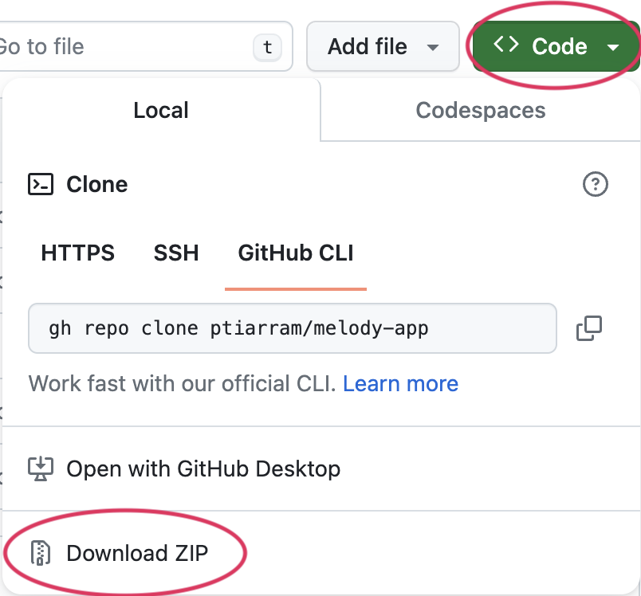

In this guide, we'll explore the fusion of p5.js and [Node.js](http://node.js) to create dynamic applications that save and retrieve user-generated drawings, animations, and sound projects! For example, you can create a [Melody App](/tutorials/melody-app-with-nodejs) where you save files with melodies you create by interacting with the canvas! Node.js allows you to easily save, replay, and edit these files right from your browser!


## Prerequisites

- This guide assumes you are familiar with the basic JavaScript concepts explored in the [Introduction to p5.js Tutorials](/tutorials/get-started) and basic web development concepts explored in the [Web Design](/tutorials/creating-styling-html) Tutorials.
- This guide requires that you use an interactive development environment (IDE) that is downloaded onto your computer. Be sure you understand how to load and save files in the IDE software you choose. Visit the [Setting Up Your Environment](/tutorials/setting-up-your-environment) tutorial to learn how to create and edit p5.js projects in the IDE [Visual Studio Code.](https://code.visualstudio.com/download)


## Introducing Hypertext Transfer Protocol (HTTP)

Have you ever wondered why many website urls begin with `https://...`? Computers connected to the internet are called [clients and servers](https://developer.mozilla.org/en-US/docs/Learn/Getting_started_with_the_web/How_the_Web_works). A client is the computer you use to access the internet, and servers are computers that store information such as web pages and apps. When you're working with a web browser to access the [internet](https://developer.mozilla.org/en-US/docs/Learn/Common_questions/Web_mechanics/How_does_the_Internet_work), the web browser uses [HTTP (Hypertext Transfer Protocol)](https://developer.mozilla.org/en-US/docs/Web/HTTP) to communicate with servers where resources like HTML documents, images, stylesheets, scripts, etc. live. Whenever you view any page on a web browser, it needs to communicate with web servers to retrieve the web pages you see!

When using the [p5.js Web Editor](https://editor.p5js.org/), your code is executed within a web browser; therefore, [HTTP methods](https://developer.mozilla.org/en-US/docs/Web/HTTP/Methods) are used to retrieve, store, change, and delete your projects. When you are building apps and projects where users read or write files by interacting with it, [HTTP methods](https://developer.mozilla.org/en-US/docs/Web/HTTP/Methods) are also used to make this process secure and easy! 


The following [HTTP methods](https://developer.mozilla.org/en-US/docs/Web/HTTP/Methods) are common when integrating HTTP requests into a p5.js project:

- [GET](https://developer.mozilla.org/en-US/docs/Web/HTTP/Methods/GET): When developing projects that require files to be retrieved from a specific server, the GET method is used. GET sends a request to the server to get the requested resource, typically identified with a url.
- [POST](https://developer.mozilla.org/en-US/docs/Web/HTTP/Methods/POST): When saving new files on a server, the POST method sends a request to submit changes to the server.
- [PUT](https://developer.mozilla.org/en-US/docs/Web/HTTP/Methods/PUT): When updating or replacing existing files on a server, the PUT method requests that a server update or replace a resource that already exists.
- [DELETE](https://developer.mozilla.org/en-US/docs/Web/HTTP/Methods/DELETE): When removing existing files on a server, the DELETE method requests that a server delete a resource that already exists.


### Step 1: Setting up the code in an external editor

Download and open [this project folder](https://github.com/MsQCompSci/melody_app_starter) in your editor. If you have never used Github before, here’s how to do this: press the “&lt;&gt; Code” button and select “Download Zip”. The zip folder that automatically downloads to your computer contains a folder named “public” that contains all the p5.js files needed to execute a p5.js program, a server.js file that enables Node.js, and a folder named “songs” that contains files you will read into your project.




### Step 2: Install Node.js & Express.js

[Node.js](https://nodejs.org/) provides a fast and efficient runtime environment to run JavaScript code outside of the web browser. [Express.js](https://expressjs.com/) is a framework that simplifies routines and methods in [Node.js](https://nodejs.org/) so that it is easier to make powerful web applications. Since [Express.js](https://expressjs.com/) depends on modules and features in [Node.js](https://nodejs.org/), you will install [Node.js](https://nodejs.org/) first. 

Learn more about [Node.js](https://nodejs.org/) and [Express.js](https://expressjs.com/) by visiting these resources:

- [Introduction to Node](https://www.youtube.com/watch?v=bjULmG8fqc8) - video tutorial
- [What is Node.js?](https://www.youtube.com/watch?v=yEHCfRWz-EI) - video
- [Node.js vs Express.js](https://www.youtube.com/watch?v=HFF4NQEGG-Y) - video
- [Node.js documentation](https://nodejs.org/docs/latest/api/)
- [Express.js reference](https://expressjs.com/en/4x/api.html)


#### Installing Node.js

For Windows and macOS:

- Download the Installer: Go to the [Node.js website](https://nodejs.org/) and download the installer for your operating system. It's recommended to download the LTS (Long Term Support) version for better stability.
* Run the Installer: Once the download is complete, run the installer and follow the prompts. This will install both [Node.js](https://nodejs.org/) and [npm](https://nodejs.org/en/learn/getting-started/an-introduction-to-the-npm-package-manager) (Node Package Manager), which is used for managing JavaScript packages.
- Verify Installation: To ensure [Node.js](https://nodejs.org/) and [npm](https://nodejs.org/en/learn/getting-started/an-introduction-to-the-npm-package-manager) are installed correctly, open your terminal (Command Prompt on Windows or Terminal on macOS) and type:

```sh
node -v

npm -v
```

Visit these resources for more information on how to use the terminal on your computer:

- [Command Prompt](https://learn.microsoft.com/en-us/windows-server/administration/windows-commands/windows-commands) - Windows
- [Mac Terminal](https://support.apple.com/guide/terminal/open-or-quit-terminal-apd5265185d-f365-44cb-8b09-71a064a42125/mac#:~:text=Click%20the%20Launchpad%20icon%20in,%2C%20then%20double%2Dclick%20Terminal) - Apple

These commands should return the versions of Node.js and npm installed on your computer. For example, you may see `v20.11.1` printed to the terminal after typing `node -v` and pressing the enter (or return) key. This means you have successfully installed version `20.11.1` of Node.js. If Node.js is not installed, an error message indicating that 'node' is not recognized as a command may be printed to the terminal instead. Similarly, you may see `10.2.4` after typing `npm -v` and pressing the enter key. If npm is not installed on your computer, you may receive an error message instead. In some cases, you may want to verify installation after you restart your computer to ensure that newly installed software is reflected in the terminal.


#### Installing Express.js

Use [`npm`](https://nodejs.org/en/learn/getting-started/an-introduction-to-the-npm-package-manager) to install Express.js: Change the directory in the terminal to point to the project folder from step 1. For example, if the folder is named `melody-app-starter-main” and was downloaded to the `downloads` folder on your computer, you can change the directory from the terminal by using the following command and pressing enter:

```sh
cd downloads/melody_app_starter-main
```

- **Create a [`package.json`](https://docs.npmjs.com/cli/v10/configuring-npm/package-json) file:** Type the following command in the terminal and press enter: 

  ```sh
  npm init -y
  ```

  The terminal should print out the contents of the new [`package.json`](https://docs.npmjs.com/cli/v10/configuring-npm/package-json) file you just created in your project directory. This command initializes a new Node.js project with default values. The message may include something like:

  ```json
  {
    "name": "melody_app_starter",
    "version": "1.0.0",
    "description": "p5.Oscillator and Express.js",
    "main": "server.js",
    "scripts": {
      "test": "echo \"Error: no test specified\" && exit 1",
      "start": "node server.js"
    },
    "keywords": [],
    "author": "",
    "license": "ISC"
  }
  ```

  Visit the [`package.json`](https://docs.npmjs.com/cli/v10/configuring-npm/package-json) documentation in the [npm reference](https://docs.npmjs.com/about-npm) to learn more.

- **Install Express.js:** Type the following command in the terminal and press enter:

  ```sh
  npm install express
  ```

  Note how `npm` is used to access Express.js!

- **Verify Installation:** You can verify that Express.js is installed on your computer by typing the following command in the terminal and pressing enter: 

  ```sh
  npm list
  ```

  Your terminal should display a tree structure listing all npm packages installed on your computer. If Express.js is installed, you should see something similar to this:

  ```
  melody_app_starter-main@1.0.0 /Users/..filepath
  
  └── express@4.19.1
  ```

  This indicates that your computer has version 4.19.1 of Express.js installed. You can also check the `node_modules` folder in your project directory (for example, in the folder `melody-app-starter-main`) to see if Express.js is listed there.

- **Run the Server:** In your terminal, type the following command and press enter:

  ```sh
  node server.js
  ```

  If everything is correctly installed and the Node.js server is working, a message should appear in your terminal that reads something like: 

  ```
  Server running at http://localhost:3000
  ```

- Test the Server: Open a web browser and go to [**http://localhost:3000**](http://localhost:3000). You should see an empty canvas element in the web browser.


### Step 3: Read filenames from a folder on the server

- Open VSCode, or your chosen code editor, and open the `melody_app_starter-main` file
- Look through the file tree and you should see
- To enable reading JSON files from the server, we include instructions in the server.js file that uses a [GET](https://developer.mozilla.org/en-US/docs/Web/HTTP/Methods/GET) HTTP request. In server.js, add the following code under `let app = express()`:

```js
//initialize file system module
let fs = require('fs');

// API endpoint to get list of songs
app.get('/songs', (req, res) => {
  fs.readdir('songs', (err, files) => {
    if (err) {
      res.status(500).send('Error reading song files');
    } else {
      res.json({ files });
    }
  });
});
```

The code above initializes the [file system module (`fs`)](https://nodejs.org/api/fs.html), which provides APIs that help users interact with file systems on their computers. It also uses the `app.get()` method, which handles GET HTTP requests to the `/songs`  URL. Here you use the file system module to read filenames from the folder, parse them as a JSON object, and send them in the response to the GET request.

Now that you have instructed the GET request on how to read the songs folder filenames, we can upload filenames as a JSON object in `sketch.js`.

- Use `preload()` and `loadJSON()` to load files from the songs folder in a global variable named `songs`. Visit the [p5.js reference](/reference) to learn more about [`preload()`](/reference/p5/preload) and [`loadJSON()`](/reference/p5/loadJSON).
- Use `console.log(songs)` in `setup()` to print the contents of the JSON array.

Your sketch.js file should look like this:

```js
//variable for JSON object with file names
let songs;

function preload() {
  //load and save the songs folder as JSON
  songs = loadJSON("/songs");
}

function setup() {
  createCanvas(400, 400);
  console.log(songs)
}

function draw() {
  background(220);
}
```

View your browser’s console to make sure the output of the `songs` variable looks something like this:

```
Object i
  files: Array(3)
    0: "C Major Scale.json"
    1: "Frere Jacques.json"
    2: "Mary's Lamb.json"
    length: 3
// ...prototype
```

Now you are ready to build the [Melody App](https://docs.google.com/document/u/0/d/1mzJv-7qU1_CmkWI0ZFeqf3CeBfpOOVIrvPRZtxqFxRI/edit)! You can access completed code for this guide in [this Github repository](https://github.com/MsQCompSci/melodyAppNodeStarter/tree/main).


## Next Steps

- [Melody App Tutorial](/tutorials/melody-app-with-nodejs)
- Read about the [`p5.Oscillator`](/reference/p5.Oscillator) library and play with [this example](https://editor.p5js.org/Msqcoding/sketches/wSFTn9G9E).
- Learn how to use [`app.post()`](https://expressjs.com/en/5x/api.html#app.post.method) and [`fs.writeFile()`](https://nodejs.org/en/learn/manipulating-files/writing-files-with-nodejs) to save files users create using your p5.js app by visiting the reference links.


## Resources

- [How the web works](https://developer.mozilla.org/en-US/docs/Learn/Getting_started_with_the_web/How_the_Web_works)
- [HTTP Methods](https://developer.mozilla.org/en-US/docs/Web/HTTP/Methods)
  - [GET](https://developer.mozilla.org/en-US/docs/Web/HTTP/Methods/GET)
  - [POST](https://developer.mozilla.org/en-US/docs/Web/HTTP/Methods/POST)
  - [PUT](https://developer.mozilla.org/en-US/docs/Web/HTTP/Methods/PUT)
  - [DELETE](https://developer.mozilla.org/en-US/docs/Web/HTTP/Methods/DELETE)
