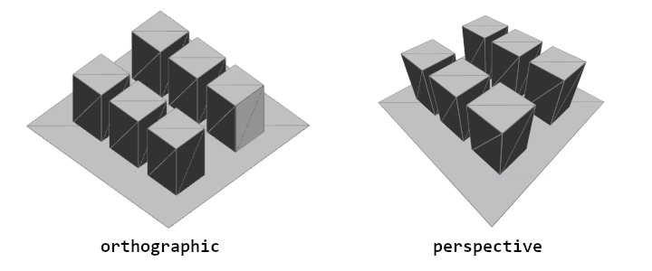
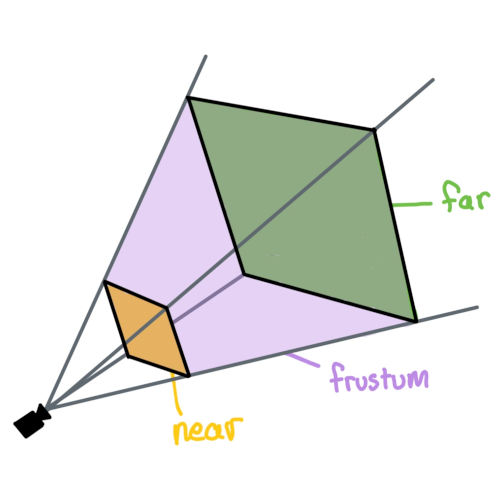

import EditableSketch from "../../../components/EditableSketch/index.astro";
import SketchEmbed from "../../../components/SketchEmbed/index.astro";
import Callout from "../../../components/Callout/index.astro";
import fs from "node:fs/promises";

Creating in 3D is about more than just geometry. Cameras, lights, and materials are important parts of creating a visually interesting 3D scene. p5.js has a number of tools that make it possible to transform the appearance of our geometry.


## Camera and view

The camera is an essential piece of a 3D scene. It gives us a sense of space and dimension and helps us frame our content. WebGL mode provides a perspective camera by default, but we can change this using the `perspective()` or `ortho()` functions.



A *perspective* camera skews objects so that they appear smaller as they get further away, vanishing at a single point in the distance. This is in contrast to an *orthographic* camera, where the geometry stays the same size as it gets further away and has no vanishing point. You can play around with both options in the example below.

<SketchEmbed
  code={await fs.readFile('src/content/tutorials/sketches/lights-camera-materials/camera/sketch.js')}
  cssCode={await fs.readFile('src/content/tutorials/sketches/lights-camera-materials/style.css')}
  bodyCode={await fs.readFile('src/content/tutorials/sketches/lights-camera-materials/camera/index.html')}
/>

*Field-of-view,* or FOV, is the term used to describe how much our camera can see, measured in angle. In simple examples, it might appear to have a zoom-like effect, but larger FOV angles cause shapes to have more perspective distortion. Sometimes, this effect is [used for artistic purposes.](https://en.wikipedia.org/wiki/Dolly_zoom)

<SketchEmbed
  width={400}
  code={await fs.readFile('src/content/tutorials/sketches/lights-camera-materials/fov/sketch.js')}
/>


Another important term to understand when working with cameras in 3D is the camera *frustum*. The frustum of the camera is the shape of the camera's view. It is a pyramid-like shape within which geometry will be displayed. The frustum includes two components, a *near plane* and a *far plane*. The near plane defines the minimum distance that geometry must be from the camera to be rendered. The far plane defines the maximum distance that the geometry can be from the camera and still be seen. Each of these can be changed to affect how close and how far the camera can see. This process of selectively including geometry is sometimes referred to as "clipping." You can set these using `perspective()` like so:

```js
perspective(
  fieldOfViewY, // Angle, in radians
  aspectRatio, // width / height
  nearPlaneDistance, // Minimum distance from camera
  farPlaneDistance // Maximum distance from camera
);
```



You can move cameras by passing arguments to `camera()`, but constantly moving and adjusting the camera in code can be tedious. [`orbitControl()`](/reference/p5/orbitControl) can be used to zoom, pan, and position the camera using the mouse. You can use it by calling it at the beginning your `draw()` function, outside of any `push()` and `pop()` calls:

<EditableSketch code={`
function setup() {
  createCanvas(200, 200, WEBGL);
  debugMode();
  describe('A cube you can look around by clicking and dragging');
}
function draw() {
  background(220);
 
  orbitControl();
  box(50);
}`} />

<Callout>
Try building a sculpture out of cubes that looks like one thing from one side, but something else when you orbit to a different side.
</Callout>

## Lighting

Light is another essential part of a 3D scene, helping convey shape and depth. p5.js has a few different types of light that can be used in a sketch:

- [`ambientLight()`](/reference/p5/ambientLight/): Ambient light makes everything display a little brighter, with no consideration for light position or direction.
- [`directionalLight()`](/reference/p5/directionalLight/): A directional light is a light without a position that shines from a single angle, which can be especially useful for communicating depth in a scene, or when a scene needs a 'sun' light. This function accepts color and direction arguments.
- [`pointLight()`](/reference/p5/pointLight/): A point light emits light from a single point in all directions, similar to a lightbulb. This function accepts color and position arguments.
- [`spotLight()`](/reference/p5/spotLight/): A spot light emits light from a single point in a single direction. This light is cast in a conical shape and its radius and concentration can be adjusted.
- [`imageLight()`](/reference/p5/imageLight/): Using an image as a light source is like placing your scene inside a huge sphere textured with that image, sending light into the scene.
- [`noLights()`](/reference/p5/noLights/): Makes it so that all subsequently drawn geometry is rendered without any lighting. This can be useful when you want flat, unshaded geometry.

These lights should be used within `draw()`. One image light and up to 5 lights of each other kind can be used simultaneously per shape drawn, allowing you to compose a scene with varied and complex lighting sources. You can also contain light functions within `push()` and `pop()` to contain lights to just one section of code, allowing you to use a different set of lights for another shape. Since lighting is done per shape, each object in a scene will not cast shadows on other objects.

Try checking and unchecking the boxes in the following interactive example to see how lighting can be blended together. For each active light source there are visual indicators of their position or direction, just know that these are here for illustrative purposes!

<SketchEmbed
  code={await fs.readFile('src/content/tutorials/sketches/lights-camera-materials/lights/sketch.js')}
  cssCode={await fs.readFile('src/content/tutorials/sketches/lights-camera-materials/style.css')}
  bodyCode={await fs.readFile('src/content/tutorials/sketches/lights-camera-materials/lights/index.html')}
/>

<Callout>
Comment and uncomment each light and experiment with their parameters.

<EditableSketch code={`
function setup() {
  createCanvas(200, 200, WEBGL);
  camera(0,-80, 800);
  describe('a box geometry with a number of lights affecting its appearance');
}
function draw() {
  background(220);
  orbitControl()
 
  // use comments to enable / disable lights
 
  ambientLight(20);
 
  pointLight(
    255, 0, 0, // color
    40, -40, 0 // position
  );
 
  directionalLight(
    0,255,0, // color
    1, 1, 0  // direction
  );
 
  let locX = (mouseX - width/2) * 2;
  let locY = (mouseY - height/2) * 2;
  spotLight(
    100, 100, 255, // color
    locX, locY, 200, // position
    -locX, -locY, -200, // direction
    PI/3 // radius of the spotlight cone
  );
 
  // noLights();
 
  rotateY(millis() * 0.001);
  box();
}
`} />
</Callout>

## Materials and textures

Objects can appear different based on their material properties. Materials dictate how light interacts with the geometry and how color (or texture) applies to the object. Materials can be varied, making objects shiny, rough, or textured with images.

There are five material properties in p5.js that combine to control the look of an object:

- [`fill()`](/reference/p5/fill/): This is the color used when there are no lights in the scene. When lights are added, this color mixes with the *diffuse* component of the light: the bright and dark areas of the surface due to light being directly cast on it.
- [`ambientMaterial()`](/reference/p5/ambientMaterial/): This is a color that mixes with the `ambientLight()` set in the scene. If it is not set, this will be the same as the fill color.
- [`specularMaterial()`](/reference/p5/specularMaterial/): This is a color that mixes with the *specular* component of the light: the reflected highlights on the surface of the shape. If this is not set, there will be no highlights on the shape.
- [`shininess()`](/reference/p5/shininess/): This number represents how sharp the specular highlights are. A value of 1 gives spread-out, blurry highlights. The higher the shininess, the sharper and smaller the highlights get. This only makes a difference if a specular material has been set.
- [`emissiveMaterial()`](/reference/p5/emissiveMaterial/): This is a color that gets added to the shape. It represents the light that the shape produces on its own, so it does not vary based on the other lights in the scene.

To determine the color of each pixel, each material component interacts with the scene's lights before being added together.

There is one other material setting called `normalMaterial()`. If this is set, all other material settings are ignored, and the color of the shape is based on the angle of its surface. If the surface is angled horizontally, it will appear more red. If it is angled vertically, it will appear more green. If it is angled towards the camera, it will appear more blue. This is often helpful for debugging shapes.

In the interactive example below, try selecting each of the different materials to see how they affect the appearance of the geometry.

<SketchEmbed
  code={await fs.readFile("src/content/tutorials/sketches/lights-camera-materials/material/sketch.js")}
  cssCode={await fs.readFile("src/content/tutorials/sketches/lights-camera-materials/style.css")}
  bodyCode={await fs.readFile("src/content/tutorials/sketches/lights-camera-materials/material/index.html")}
/>

<Callout>

Comment and uncomment the different lights in this example to see how they interact with the materials:

<EditableSketch code={`
function setup() {
  createCanvas(200, 200, WEBGL);
  describe('a sphere geometry with multiple materials applied to it');
}
function draw() {
  background(220);
  camera(200, -200, 600);
 
  noStroke();
  ambientLight(128);
  let locX = mouseX - width / 2;
  let locY = mouseY - height / 2;
  pointLight(255, 255, 255, locX, locY, 100);
  // normal material shows the geometry normals
  normalMaterial();
  // ambient materials reflect under any light
  ambientMaterial(255, 0, 0);
  // emissive materials show the same color regardless of light
  emissiveMaterial(0, 255, 0);
  // specular materials reflect the color of the light source
  // and can vary in 'shininess'
  shininess(10);
  specularMaterial(0, 0, 255);
  // box(50);
  sphere();
}
`} />

</Callout>

In WebGL mode, you don't need to have a single `fill()` value for the whole shape: you can apply a different fill color to each vertex. If the vertices of a triangle have different fill colors, the triangle will smoothly blend between the colors on the corners. This is a useful way to create smooth gradients across shapes, like in the example below. Try clicking and holding on the canvas to see the edges of the shape to get a sense of where WebGL is filling in the in-between sections for us.

<EditableSketch code={`
let palette = [
  '#588b8b',
  '#ffffff',
  '#ffd5c2',
  '#f28f3b',
  '#c8553d'
];
function setup() {
  createCanvas(200, 200, WEBGL);

  describe('a gradient from teal to white to orange');
}
function draw() {
  background(0);
 
  // Click and hold on the canvas to see where the edges
  // of the shapes are. Everything in between is blended for
  // you by WebGL!
  if (mouseIsPressed === true) {
    stroke(255, 0, 255);
  } else {
    noStroke();
  }
 
  beginShape(QUAD_STRIP);
  // Create a column of vertices for each color
  for (let i = 0; i < palette.length; i += 1) {
    fill(palette[i]);
    let x = map(i, 0, palette.length-1, -80, 80);
    vertex(x, -50);
    vertex(x, 50);
  }
  endShape();
}
`} />

More custom materials can be achieved by using the `texture()` function. This allows you to map an image to the surface of a geometry. These textures can be imported from an image and even generated within code using shaders. To map a texture to your geometry, use `loadImage()` within `preload()`, then call `texture()` before drawing your shape.

<EditableSketch base="/images/tutorials/" code={`
let myTexture;
function preload() {
  myTexture = loadImage('simpleTexture.png');
}
function setup() {
  createCanvas(200, 200, WEBGL);
  describe('a rotating box with a texture of a pink scribble mapped onto it');
}
function draw() {
  background(220);
 
  // apply the texture to the box
  texture(myTexture);
 
  push();
  rotateX(millis()/1000);
  rotateY(millis()/700);
  box();
  pop();
}
`} />

When you create custom geometry you can specify a texture coordinate for each vertex after each 3D position. By default, these coordinates are in pixels relative to the texture you have applied, but you can set `textureMode(NORMAL)` to use a 0-1 range, representing a fraction of the image's dimensions, which is helpful in making models that work for any image.

The texture coordinates of a vertex can stay the same while its 3D position changes. You can use this to distort and animate images. In the example below, changing vertex positions while keeping texture coordinates the same is used to wiggle a drawing. Click and hold on the canvas to see the edges of the grid of vertices being drawn.

<EditableSketch base="/images/tutorials/" code={`
let img;
function preload() {
  img = loadImage('wiggly-guy.png');
}
function setup() {
  createCanvas(200, 200, WEBGL);
  describe('A cartoon drawing of a person wiggling');
}
function draw() {
  background(255);
  translate(-width/2, -height/2);
 
  // Click and hold on the canvas to see where the
  // edges of the shapes are!
  if (mouseIsPressed === true) {
    stroke(255, 0, 0);
  } else {
    noStroke();
  }
 
  let t = millis();
 
  texture(img);
 
  // Draw a bunch of vertical strips of quads to make a grid
  for (let x = 0; x < 200; x += 20) {
    beginShape(QUAD_STRIP);
   
    // Each vertical strip will start from the top and go down
    for (let y = 0; y <= 200; y += 20) {
     
      // Iterate over each side of the strip, left then right
      for (let offset of [0, 20]) {
        // (x+offset, y) is the undistorted coordinate for this
        // vertex on the grid, so we'll use that for the texture
        // coordinates.
        //
        // For the 3D position of the vertex, we will animate them
        // moving around over time.
        let wiggledX = x + offset + 5 * sin(y*0.05 + t*0.01);
        let wiggledY = y + 5 * sin((x + offset)*0.05 + t*0.01);
        vertex(
          // The vertex position is distorted
          wiggledX, wiggledY, 0,
          // The texture coordinate is not
          x+offset, y
        );
      }
    }
    endShape();
  }
}
`} />

<Callout>
By distorting vertex positions, can you make an image of a character look like it's jumping? Waving? Walking?
</Callout>

## Conclusion

Having control over the camera, lighting, and materials will give you more flexibility to change the look of your sketch and open up the possibility for you to introduce your own style to your 3D sketches.

To make even more advanced materials for your shapes, artists often write *shaders.* Check out the [Introduction to Shaders](./intro-to-shaders) tutorial when you're ready to explore even more possibilities!


## Glossary

#### Camera

The viewpoint of a 3D scene


#### Perspective

A camera projection that gives the appearance of depth, achieved by making objects in the distance appear smaller.


#### Orthographic

A camera projection that is *orthogonal* and unaffected by depth. It gives the appearance of being two-dimensional.


#### Field-of-View

The angle representing how much can be seen by the camera.


#### Frustum

The geometric shape representing the full area that can be viewed by the camera.


#### Near and Far Plane

The near plane represents the minimum distance a geometry must be from the camera to be displayed, while the far plane represents the maximum distance.


#### Clipping

Selectively showing some geometry and not others, such as when geometry falls outside of the camera frustum.


#### Diffuse Light

The effect of light on a matte material. Since matte materials bounce light equally in all directions, the color you see will look the same regardless of your vantage point.


#### Specular Light

The effect of light on a shiny or glossy material, visible as reflected highlights. The positions of the highlights will change as you move around an object as the reflection angles change.


#### Shininess

How sharp the specular reflections on an object are. This property comes from how much reflected light spreads out after bouncing off of the surface of an object: the less it spreads out, the sharper the reflections and the shinier the object appears; the more it spreads out, the blurrier the reflections are and the less shiny the object appears.


#### Emissive Light

Light emitted from the surface of an object, which gets added to the light that comes from external light sources.


#### Ambient Light

A uniform amount of light coming from all directions, as if the scene were inside a big sphere emitting light.
