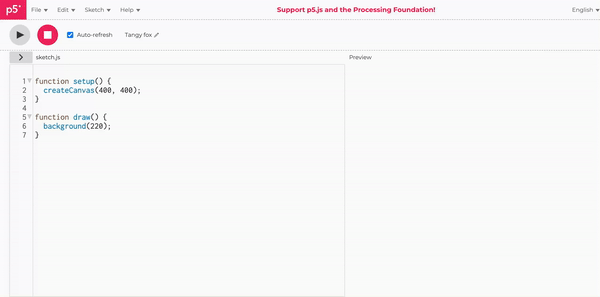
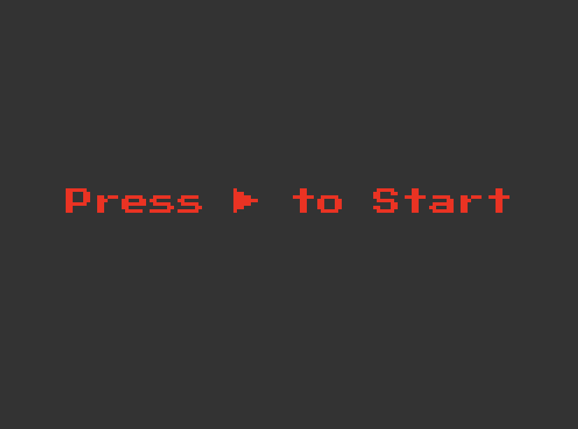
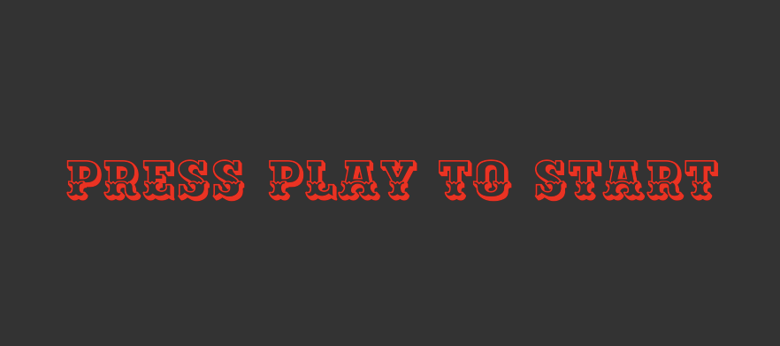

import EditableSketch from "../../../components/EditableSketch/index.astro";
import Callout from "../../../components/Callout/index.astro";

Welcome to the chapter finale. In the last two tutorials, you have embarked on a journey of building and styling your HTML, crafting responsive buttons, and executing the logic for your snake game. In this closing tutorial, our focus shifts to Fonts and their pivotal role in design. You'll learn the art of loading and selecting fonts for your sketch, contributing to your game's visual identity and user experience.


Fonts are important in design, and we will learn how to load and choose them for your snake game sketch. You will learn practical techniques for seamless integration and as we finish the series, you will have a complete snake game. You will also understand the important role fonts have in digital experiences, delve into typography, and add finishing touches to your digital masterpiece.


## Prerequisites

- You must have finished the [Creating and Styling HTML](/tutorials/creating-styling-html) and [Responding to Inputs tutorials](/tutorials/responding-to-inputs).
- [Complete Responding to inputs code](https://editor.p5js.org/ruthikegah/sketches/TKoGPLJfe)


### Step 1 – Learn about fonts

Fonts refer to a set of characters, symbols, and styles within a [typeface](https://fonts.google.com/knowledge/glossary/typeface). They dictate the visual appearance of text, encompassing factors like size, style, and weight.

For best practices, these are some guidelines you should consider while choosing a font to suit your project best:

- **Consider project requirements:** Understand your project's goals, audience, and tone. Different projects may require fonts with specific characteristics. For example, you may use a formal serif font to make an interactive version of a vintage newspaper, while you may use a playful sans-serif for a game.
- **Pairing fonts effectively:** Experiment with font pairings. Effective font pairings contribute to visual hierarchy and readability. For example, you may want to pair a distinctive display font with a legible sans-serif for body text.
- **Evaluate font properties:** Pay attention to font properties like thickness, slant, and width. Adjust these properties based on the project's visual requirements and the desired impact.
- **Readability:** Prioritize readability. Choose clear and legible fonts, especially for large bodies of text and consider factors like letter spacing and line height.
- **Explore font libraries:** [Google Fonts](https://fonts.google.com/) and [Font Squirrel](https://www.fontsquirrel.com/) offer diverse collections of free and open-source fonts. Use the search and filtering options to narrow your choices based on categories, popularity, and trending fonts. Take advantage of the live preview feature to see how fonts will appear in your design.
- **Accessibility:** Your sketch may run on a wide range of devices, from phones to large projector installations. Choose fonts that scale well across different screen sizes without sacrificing legibility. Google Fonts and Font Squirrel provide information on each font's character set, language support, and variability. This information will help you make informed choices for responsive designs.
- **License:** Be mindful of font licenses. Some fonts are free for commercial use, while others may have restrictions. Adhere to licensing agreements. 

Choosing suitable fonts involves a thoughtful and systematic approach. You can create visually appealing and user-friendly projects by considering factors such as readability, consistency, and responsive design. Remember to explore the font libraries, test fonts in various environments, and seek inspiration to make informed design decisions. With these guidelines, you'll be well-equipped to enhance your design projects with the perfect typography.

Check out [Google Fonts' "Choosing type" section](https://fonts.google.com/knowledge/choosing_type) to learn more about selecting fonts and best practices.

In this case, you will use the fonts to style your text prompts in your game, i.e., the Display message and Game Over prompt. Considering the project is a retro game console, we will use a retro font for our prompts. 


### Step 2 – Style text with web-safe fonts

Before moving to Google custom fonts that fit the project, let’s start with more common web-safe fonts like Arial and Courier New to style your texts. [Web-safe fonts](https://developer.mozilla.org/en-US/docs/Learn/CSS/Styling_text/Fundamentals#web_safe_fonts) are available on most computers by default. 

To set the font for your display messages, you will use the p5.js [`textFont()`](/reference/p5/textFont) function. This function sets the font for the contents of your [`text()`](/reference/p5/text) function. In your `displayStartMessage()` and `displayEndMessage()` functions, add your font:

```js
// Start message.
function displayStartMessage() {
  textSize(20);
  textAlign(CENTER);

  //Add font
  textFont('Courier New');
  fill(255, 0, 0);
  text('Press ▶ to Start', width / 2, height / 2);
}

// End message.
function displayEndMessage() {
  background(0);
  textSize(40);
  textAlign(CENTER);

  //Add font
  textFont('Courier New');
  fill(255, 0, 0);
  text('Game Over', width / 2, height / 2);
  textSize(14);
  text('Press ▶ to Start', width / 2, height / 2 + 50);
}
```

Next, you change the logo text. It's an HTML element, so you will be using the [`.style()`](/reference/p5.Element/style) method. As stated in the previous chapter, the `.style()` method is used to manipulate HTML elements. In your `gameBoyText` `div`, add your font like this:

```js
// Create the game boy text
let gameBoyText = createDiv('GameBoy');
gameBoyText.id('game-boy-text');
gameBoyText.style('margin', '10px 145px');
gameBoyText.style('font-size', '25px');
gameBoyText.style('color', '#fff');
gameBoyText.style('background-color', '#000');
gameBoyText.style('padding', '10px');
gameBoyText.style('border-radius', '5px');

// Add font
gameBoyText.style('font-family', 'Arial');
```

Your fonts should look like this:


In this exercise, you can observe the impact of different fonts on your project. The intention is to familiarize yourself with web-safe fonts. We will enhance this style in the following steps. For now, feel free to delete the changes made to the fonts.

<Callout>
Experiment with the textAlign() and textStyle() functions to see how they modify your fonts.

[Solution.](https://editor.p5js.org/ruthikegah/sketches/w1SZv_0w6)
</Callout>


### Step 3 – Download a font from Google fonts

Now, it’s time to add a custom font to your project. Go to [Google Fonts](https://fonts.google.com/) and search for PressStart2P, a font with a retro gaming design.


Click on Download Family to download the font. It usually comes in a zip file; open it and extract the .ttf file.

<Callout>
Search Google Fonts for other styles that you’d like to use for your game.
</Callout>


### Step 4 – Upload the font file to your project

In your web editor, click on the + icon on the top right corner of your screen and select Create Folder. Name your folder assets, click on the folder, and select upload file. Upload your `.ttf` file to your assets folder.




### Step 5 – Preload your font

p5.js’ [`preload()`](/reference/p5/preload)  function loads external assets before the rest of your sketch is executed. The `preload()` function is called directly before `setup()`. It is used to handle asynchronous loading of external files in a blocking way. If the `preload()` function is defined, `setup()` will wait until any load calls within have finished.

For example: 

<EditableSketch code={`
let myFont;
function preload() {
  // Load a custom font before the sketch starts
  myFont = loadFont('Bold.ttf');
}
function setup() {
  createCanvas(400, 200);
  background(255);
  // Apply the loaded font
  textFont(myFont);
  textSize(32);
  textAlign(CENTER, CENTER);
  fill(0);
  text('Custom Font Loaded!', width / 2, height / 2);
}
`} />

Inside the `preload()` function, you can use p5.js's various asset-loading functions such as `loadImage()`, `loadSound()`, and `loadFont()` to load external files. These functions take the path to the asset file as an argument.

At the start of your `sketch.js` file, write the following code:

```js
let myFont;
function preload(){
  myFont = loadFont("assets/PressStart2P-Regular.ttf");
}
```

You declare a variable myFont to store your font. The `preload()` function loads your font with the `loadFont()` function, passing your file path as the argument. 


### Step 6 – Use your fonts in your display messages

With your fonts loaded, using them where needed is relatively easy now. Call The p5.js [`textFont()`](/reference/p5/textFont) function and pass in your `myFont` variable as its argument. The `textFont()` function sets the font that will be used by your [`text()`](/reference/p5/text) function. Syntax:

```js
textFont(font);
```

Now use the `textFont()` function to load your font in your `displayStartMessage()` and `displayEndMessage()` like this: 

```js
// Start message.
function displayStartMessage() {
  textSize(20);
  textAlign(CENTER);
  fill(255, 0, 0);
  // Use your font
  textFont(myFont);
  text('Press ▶ to Start', width / 2, height / 2);
}

// End message.
function displayEndMessage() {
  background(0);
  textSize(40);
  textAlign(CENTER);
  fill(255, 0, 0);
  // Use your font
  textFont(myFont);
  text('Game Over', width / 2, height / 2);
  textSize(14);
  text('Press ▶ to Start', width / 2, height / 2 + 50);
}
```
 

Your Start message should look like this:



Your End message:


Adjust the `textSize()` if the text becomes too big or too small for the screen.

<Callout>
Make the `textSize()` a fraction of the sketch `height` or `width`.

[Solution.](https://editor.p5js.org/ruthikegah/sketches/_bnQ40m9l)

</Callout>


### Step 7 – Setting the font for your logo text

We are almost at the end of this project! The final thing to do now is to set a font for your logo text. Since it is an HTML element, you use the `.style()` method to directly manipulate the style of the element.

In your `gameBoyText` div, add another .style() method with the property `'font-family'` and value `'PressStart2P-Regular'` which is the name of the font you are using:

```js
// Create the game boy text
let gameBoyText = createDiv('GameBoy');
gameBoyText.id('game-boy-text');
gameBoyText.style('margin', '10px 145px');
gameBoyText.style('font-size', '25px');
gameBoyText.style('color', '#fff');
gameBoyText.style('background-color', '#000');
gameBoyText.style('padding', '10px');
gameBoyText.style('border-radius', '5px');

// Add font for gameBoyText
gameBoyText.style('font-family', 'PressStart2P-Regular');
```

Your logo should now look like this:


Make sure to adjust the size if the text becomes too large or small in your text area.

<Callout>
Load and try out other fonts to see which one you feel is best for your game.
</Callout>

Here are some other retro fonts that can give you that retro feel:

- [Amarante](https://fonts.google.com/specimen/Amarante)

  

  This font gives an elegant, narrow, serif typeface; it can work as a display face and surprisingly well in texts and headlines.

- [Geostar Fill](https://fonts.google.com/specimen/Geostar+Fill?query=Geos)

  

  Geostar is a great font for large headlines. Its single weight allows for easy legibility and captivates the audience at first glance. Because Geostar is so symmetrical, it is a fantastic option to add charisma and sophistication to your screen.

- [Ewert](https://fonts.google.com/specimen/Ewert?query=Ewert)

  

  Ewert is a slab serif wood type inspired by, and loosely based on, the collection of cultural infographic maps by Estonian graphic artist Olev Soans. It gives your screen text a stylish, robust fantasy aesthetic.


## Conclusion

Congratulations for making it this far! You have completed your p5.js GameBoy sketch. Throughout this series, you've embarked on a comprehensive coding journey, mastering key aspects of web development and creative coding:

- HTML Crafting: You learned how to structure and style your HTML elements with p5.js, setting the foundation for a visually appealing and responsive interface.
- Interactive Buttons: Implementing buttons with p5.js, you gained hands-on experience in creating interactive elements for user input, which is crucial for game control.
- Gameplay Logic: Delving into the core of game development, you implemented gameplay logic for a snake game. You tackled input handling, movement, collision detection, and scoring on the way to building a fully functional game.
- Font Integration: Understanding the significance of fonts in design, you explored the process of loading and selecting fonts using Google Fonts. Applying this knowledge, you stylized your game's display messages with a retro font.
- Design Principles: Beyond coding, you grasped essential design principles, considering factors like readability, consistency, and responsive design to enhance user experience.

With this series, you've acquired technical coding and input logic skills and honed your design sensibilities. The journey concludes with a fully functional retro game console and a snake game that reflects your newfound expertise. 

Congratulations again on reaching this milestone!

Here is an [example finished project](https://editor.p5js.org/ruthikegah/sketches/fDU72YAkp) for reference.


### Next steps

- [Abracadabra: Speak With Your Hands in p5.js and ml5.js](/tutorials/speak-with-your-hands)
- [Color Gradients](/tutorials/color-gradients)


### References

- [Google fonts](https://fonts.google.com/)
- [Understanding typography (Canva)](https://www.canva.com/learn/typography-guide/)
