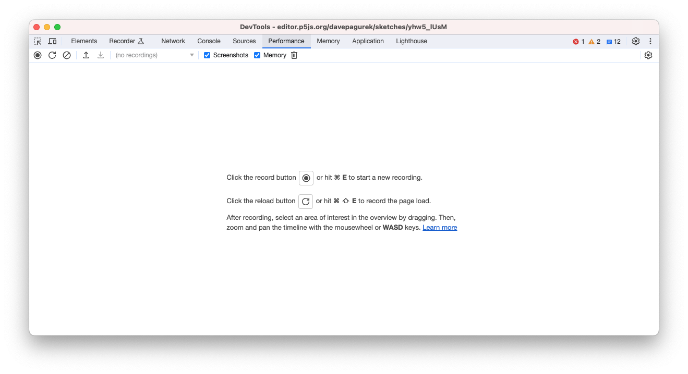
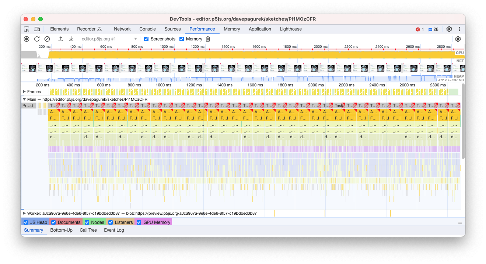

import SketchEmbed from "../../../components/SketchEmbed/index.astro";
import AnnotatedCode from "../../../components/AnnotatedCode/index.astro";
import EditableSketch from "../../../components/EditableSketch/index.astro";
import { Columns, Column } from "../../../components/Columns";
import Callout from "../../../components/Callout/index.astro";
import { Image } from "astro:assets";
import cubeImage from "../images/webgl/cube.png";
import cubeGridImage from "../images/webgl/cube-grid.png";

WebGL mode in p5.js gives you access to your computer's graphics hardware. This can allow you to produce 3D visuals even on lower-powered mobile devices. When doing more complex tasks, however, you can sometimes end up writing code that struggles to maintain a good framerate. We'll go over some ways to measure and debug your sketch's performance, and offer some tips for structuring your code for success.


## How well does your sketch run?

When performance drops, you will notice your draw function doesn’t run as often as it should. This can cause slow or choppy animation. When you make a change to improve performance, you will want to check to see if you made the situation noticeably better. In addition to seeing how smooth the animation feels, we can display the *frame rate.*

The frame rate counts the number of times `draw()` is called per second. The faster your sketch runs, the higher this number will be—at least, up to the point when your screen can't refresh any quicker. On many displays, this limit is 60. Don't worry if your sketch doesn't quite reach 60 frames per second: 30 frames per second will also appear smooth—feature films typically run at 24 frames per second.

To measure your sketch's frame rate, we can create a new `<p>` element on the page and update it every frame:

```js
let frameRateP;
function setup() {
  createCanvas(200, 200, WEBGL);
  frameRateP = createP();
}
function draw() {
  frameRateP.html(round(frameRate()));
  // Put the rest of your sketch here
}
```

It's normal for this value to flicker a bit. Sometimes you will want to display a *moving average* of the frame rate to get a better estimate. Augmenting the previous code to show a moving average looks like this:

```js
let frameRateP;
// Over how many frames should we average the frame rate?
let numSamples = 30;
// An array to store for all the individual samples
let frameRateSamples = [];
// A running count of the sum of the array
let frameRateSum = 0;
function setup() {
  createCanvas(200, 200, WEBGL);
  frameRateP = createP();
}
function draw() {
  let newSample = frameRate();
  frameRateSamples.push(newSample);
  frameRateSum += newSample;
  if (frameRateSamples.length > numSamples) {
    frameRateSum -= frameRateSamples.shift();
  }
  frameRateP.html(
    round(frameRateSum / frameRateSamples.length)
  );
  // Put the rest of your sketch here
}
```

<Callout>
What does it take to get the frame rate to drop? Try drawing many shapes in a `for` loop. How many shapes do you need to draw before you notice a change in frame rate? Is that number different when you look at your sketch on a phone instead of a desktop or laptop?
</Callout>

## Getting the best performance out of WebGL

Here are some best practices for WebGL sketches. Following these will start you off on good footing for performance.


### Prefer `p5.Framebuffer` over `p5.Graphics `in WebGL Mode

In 2D mode, if you need to draw something and then use it as a texture for something else, you would reach for a `p5.Graphics` object. This approach works well because much of what happens in 2D mode happens on your computer’s CPU. In WebGL mode, it will be faster to use a `p5.Framebuffer`, which lives on your computer's graphics hardware along with your WebGL sketch, minimizing data transfer.

Here's an example of some code that uses `p5.Graphics`, and an improved example using `p5.Framebuffer`:

<Columns>
<Column>
#### ❌ Using `p5.Graphics`
```js
let layer;
function setup() {
  createCanvas(200, 200, WEBGL);
  layer = createGraphics(200, 200);
  describe(
    'a rotating red cube with yellow ' +
    'dots on each face'
  );
}
function draw() {
  let t = millis() * 0.001;
  layer.background('red');
  layer.noStroke();
  layer.fill('yellow');
  for (let i = 0; i < 30; i += 1) {
    layer.circle(
      map(noise(i*10, 0, t), 0, 1, 0, width),
      map(noise(i*10, 100, t), 0, 1, 0, height),
      20
    );
  }
 
  background(255);
  lights();
  noStroke();
  texture(layer);
  rotateX(t);
  rotateY(t);
  box(100);
}
```
</Column>
<Column>
#### ✅ Using `p5.Framebuffer`

```js
let layer;
function setup() {
  createCanvas(200, 200, WEBGL);
  layer = createFramebuffer();
  describe(
    'a rotating red cube with yellow ' +
    'dots on each face'
  );
}
function draw() {
  let t = millis() * 0.001;
  layer.begin();
  background('red');
  noStroke();
  fill('yellow');
  for (let i = 0; i < 30; i += 1) {
    circle(
      map(noise(i*10, 0, t), 0, 1, -width/2, width/2),
      map(noise(i*10, 100, t), 0, 1, -height/2, height/2),
      20
    );
  }
  layer.end();
 
  background(255);
  lights();
  noStroke();
  texture(layer);
  rotateX(t);
  rotateY(t);
  box(100);
}
```
</Column>
<Column fixed>
<SketchEmbed width={200} height={200} code={`
let layer;
function setup() {
  createCanvas(200, 200, WEBGL);
  layer = createFramebuffer();
  describe('a rotating red cube with yellow dots on each face');
}
function draw() {
  let t = millis() * 0.001;
  layer.begin();
  background('red');
  noStroke();
  fill('yellow');
  for (let i = 0; i < 30; i += 1) {
    circle(
      map(noise(i*10, 0, t), 0, 1, -width/2, width/2),
      map(noise(i*10, 100, t), 0, 1, -height/2, height/2),
      20
    );
  }
  layer.end();
 
  background(255);
  lights();
  noStroke();
  texture(layer);
  rotateX(t);
  rotateY(t);
  box(100);
}
`} />
</Column>
</Columns>

<Callout>

If you were using a 2D mode `p5.Graphics`, switching to a `p5.Framebuffer` means using WebGL mode instead. WebGL mode can draw 2D shapes too! Try adapting a 2D sketch you've made in the past to WebGL mode. Remember that the point (0,0) is in the *top left* of the canvas in 2D mode, but in the *center* in WebGL mode!

</Callout>


### Replace static `p5.Graphics` with `p5.Image`

Sometimes, you can't use `p5.Framebuffer`—maybe because you really need to draw something in 2D mode. If you are using `p5.Graphics`, but you won't be changing its contents every frame, you can turn it into a `p5.Image` by calling `.get()` on it. This lets p5.js know that it doesn't need to send new image data to a texture every frame, and it can continue to reuse the initial texture instead.

<Columns>
<Column>
#### ❌ Using `p5.Graphics`

```js
let layer;
function setup() {
  createCanvas(200, 200, WEBGL);
  layer = createGraphics(200, 200);
  layer.background('red');
  layer.noStroke();
  layer.fill('yellow');
  layer.textAlign(CENTER, CENTER);
  layer.textSize(50);
  layer.text('Hello!', width/2, height/2);

  describe(
    'a rotating red cube with the word ' +
    '"Hello!" in yellow on each face'
  );
}
function draw() {
  let t = millis() * 0.001;
 
  background(255);
  lights();
  noStroke();
  texture(layer);
  rotateX(t);
  rotateY(t);
  box(100);
}
```
</Column>
<Column>
#### ✅ Using `p5.Image`

```js
let layerImg;
function setup() {
  createCanvas(200, 200, WEBGL);
  let layer = createGraphics(200, 200);
  layer.background('red');
  layer.noStroke();
  layer.fill('yellow');
  layer.textAlign(CENTER, CENTER);
  layer.textSize(50);
  layer.text('Hello!', width/2, height/2);
 
  // Save as a static image
  layerImg = layer.get();
 
  // We no longer need the original
  layer.remove();

  describe(
    'a rotating red cube with the word ' +
    '"Hello!" in yellow on each face'
  );
}
function draw() {
  let t = millis() * 0.001;
 
  background(255);
  lights();
  noStroke();
  texture(layerImg);
  rotateX(t);
  rotateY(t);
  box(100);
}
```
</Column>
<Column fixed>
<SketchEmbed width={200} height={200} code={`
let layerImg;
function setup() {
  createCanvas(200, 200, WEBGL);
  let layer = createGraphics(200, 200);
  layer.background('red');
  layer.noStroke();
  layer.fill('yellow');
  layer.textAlign(CENTER, CENTER);
  layer.textSize(50);
  layer.text('Hello!', width/2, height/2);
 
  // Save as a static image
  layerImg = layer.get();
 
  // We no longer need the original
  layer.remove();

  describe(
    'a rotating red cube with the word ' +
    '"Hello!" in yellow on each face'
  );
}
function draw() {
  let t = millis() * 0.001;
 
  background(255);
  lights();
  noStroke();
  texture(layerImg);
  rotateX(t);
  rotateY(t);
  box(100);
}
`} />
</Column>
</Columns>

<Callout>
Try making a slideshow of generative art images, where you use `.get()` on a `p5.Graphics` to create each slide!
</Callout>

### Use `p5.Geometry` for shapes that don't change

Using `beginShape()` and `endShape()` lets you create interesting geometry, but it spends time processing your shapes into a form that can be rendered. Similarly, you can make interesting shapes out of many simple pieces like `sphere()` and `box()`, but having too many at once can slow down a sketch.

If you have shapes (or pieces of shapes) that don't change internally over time, even if their *position, scales, and orientations* change, you can collapse them into a single, reusable model using `buildGeometry`. This means that p5.js can avoid recalculating positions again and again every frame.

<Columns>
<Column>
#### ❌ Redrawing the same shape

```js
function setup() {
  createCanvas(200, 200, WEBGL);
  describe('a rotating corkscrew');
}
function draw() {
  background(255);
  noStroke();
  lights();
  rotateY(millis() * 0.01);
 
  for (let y = -100; y <= 100; y += 0.5) {
    const angle = y * 0.1;
    const vec = createVector(50, 0)
      .rotate(angle);
    push();
    translate(vec.x, y, vec.y);
    sphere(5);
    pop();
  }
}
```
</Column>
<Column>
#### ✅ Using `buildGeometry()`

```js
let shape;
function setup() {
  createCanvas(200, 200, WEBGL);
  shape = buildGeometry(function() {
    for (let y = -100; y <= 100; y += 0.5) {
      let angle = y * 0.1;
      let vec = createVector(50, 0)
        .rotate(angle);
      push();
      translate(vec.x, y, vec.y);
      sphere(5);
      pop();
    }
  });
  describe('a rotating corkscrew');
}
function draw() {
  background(255);
  noStroke();
  lights();
  rotateY(millis() * 0.01);
 
  model(shape);
}
```
</Column>
<Column fixed>
<SketchEmbed width={200} height={200} code={`
let shape;
function setup() {
  createCanvas(200, 200, WEBGL);
  shape = buildGeometry(function() {
    for (let y = -100; y <= 100; y += 0.5) {
      let angle = y * 0.1;
      let vec = createVector(50, 0)
        .rotate(angle);
      push();
      translate(vec.x, y, vec.y);
      sphere(5);
      pop();
    }
  });
  describe('a rotating corkscrew');
}
function draw() {
  background(255);
  noStroke();
  lights();
  rotateY(millis() * 0.01);
 
  model(shape);
}
`} />
</Column>
</Columns>

<Callout>
Try making a swarm of bugs, flock of birds, or school of fish by making a `p5.Geometry` for one animal, then drawing it many times!
</Callout>


### Prefer shaders over modifying `pixels`

There are many effects one can achieve that involve looking at and modifying individual pixels on the canvas. Unfortunately, modifying `pixels` in your sketch involves looping through every pixel, one at a time, in JavaScript. A shader, on the other hand, can run in parallel for every pixel at once, making it a great alternative for when speed is required.

Here is an example of some noise-based dithering using `pixels`, and the equivalent filter using a shader. Be sure to check out our [introduction to shaders](https://docs.google.com/document/u/0/d/1R7eO9XHcACHnxanFCKVviBK2c1Pci0y9qfRwuHY2_PI/edit) for more information about shader programming.

<Columns>
<Column>
#### ❌ Using `pixels`

```js
function setup() {
  createCanvas(200, 200, WEBGL);
  pixelDensity(1);
  describe('a rotating cube with stippled shading');
}
function draw() {
  background(255);
  const t = millis() * 0.001;
  push();
  rotateX(t);
  rotateY(t);
  noStroke();
  lights();
  box(100);
  pop();
 
  loadPixels();
  for (let x = 0; x < width; x += 1) {
    for (let y = 0; y < height; y += 1) {
      let idx = (y * height + x) * 4;
      let newValue;
      if (pixels[idx] + noise(x, y)*50 >= 220) {
        newValue = 255;
      } else {
        newValue = 0;
      }
      pixels[idx] = newValue;
      pixels[idx + 1] = newValue;
      pixels[idx + 2] = newValue;
    }
  }
  updatePixels();
}
```

</Column>
<Column>
#### ✅ Using a shader

```js
let dither;
function setup() {
  createCanvas(200, 200, WEBGL);
  dither = createFilterShader(`
precision highp float;
uniform sampler2D tex0;
varying vec2 vTexCoord;
float random(vec2 p) {
  vec3 p3  = fract(vec3(p.xyx) * .1031);
  p3 += dot(p3, p3.yzx + 33.33);
  return fract((p3.x + p3.y) * p3.z);
}
void main() {
  float sample = texture2D(tex0, vTexCoord).r;
  sample += random(vTexCoord*100.0) * 0.2;
  // 0 if sample < 0.98; 1 otherwise
  float level = step(0.98, sample);
  gl_FragColor = vec4(vec3(level), 1.);
}
`);
  describe('a rotating cube with stippled shading');
}
function draw() {
  background(255);
  let t = millis() * 0.001;
  push();
  rotateX(t);
  rotateY(t);
  noStroke();
  lights();
  box(100);
  pop();
 
  filter(dither);
}
```
</Column>
<Column fixed>
<SketchEmbed width={200} height={200} code={`
function setup() {
  createCanvas(200, 200, WEBGL);
  dither = createFilterShader(\`
precision highp float;
uniform sampler2D tex0;
varying vec2 vTexCoord;

float random(vec2 p) {
  vec3 p3  = fract(vec3(p.xyx) * .1031);
  p3 += dot(p3, p3.yzx + 33.33);
  return fract((p3.x + p3.y) * p3.z);
}

void main() {
  float sample = texture2D(tex0, vTexCoord).r;
  sample += random(vTexCoord*100.0) * 0.2;
  // 0 if sample < 0.98; 1 otherwise
  float level = step(0.98, sample);
  gl_FragColor = vec4(vec3(level), 1.);
}
\`);
  describe('a rotating cube with stippled shading');
}
function draw() {
  background(255);
  let t = millis() * 0.001;
  push();
  rotateX(t);
  rotateY(t);
  noStroke();
  lights();
  box(100);
  pop();
 
  filter(dither);
}
`} />
</Column>
</Columns>


<Callout>
Try adapting the dithering shader into a grain shader by making it add a small random amount of color to each pixel!
</Callout>


## Other tips

Aside from the other structural changes we've listed so far, you may also be able to squeeze more performance out of your sketch by tweaking some minor settings that affect how the sketch gets rendered. These may provide varying levels of improvement on different browsers, screens, and computers, so try your changes out in a variety of spots.


### Pixel density

Some devices have high-resolution screens. To ensure that everything isn't tiny on your browser, those devices will render four pixels in a 2-by-2 grid for every pixel on a lower-density display. This makes images crisp, but it means there are four times the number of pixels to draw.

If your sketches are slower on these devices, consider adding `pixelDensity(1)` to only draw the number of pixels you specify in the width and height of your canvas. Your sketch may appear a bit blurry, but that could be fine depending on your sketch.

```js
function setup() {
  createCanvas(200, 200, WEBGL);
  pixelDensity(1);
}
```


### Antialiasing

Antialiasing is the process of smoothing the colors of pixels when a shape intersects only part of the pixel. This can avoid jagged lines and visible pixel grids. However, like high pixel density displays, this is done by doing extra calculations per pixel. Sometimes, when you don't need that extra smoothness, you can turn off antialiasing to run faster.

```js
function setup() {
  createCanvas(200, 200, WEBGL);
  setAttributes({ antialias: false });
}
```

### Curve Detail

When you aren't drawing premade shapes with `model()`, things generally run faster when fewer triangles and edges are involved. One way to tune how detailed your shapes are is with `curveDetail()`: the larger the value you give, the more edges and triangles are used when breaking down curves. Try using a level of detail smaller than the default value of 20.

<EditableSketch width={200} height={250} code={`
let detailSlider;
function setup() {
  createCanvas(200, 200, WEBGL);
  detailSlider = createSlider(
    3, // min
    20, // max
    20, // initial value
    1 // step
  );

  describe('an arch made of line segments')
}
function draw() {
  background(200);
  strokeWeight(3);
  curveDetail(detailSlider.value());
  curve(250, 600, 0, -30, 40, 0, 30, 30, 0, -250, 600, 0);
}
`} />

<Callout>
What level of detail do you need for the curve above to appear smooth to you? Does it change the level you need if you draw the curve larger? What about smaller?
</Callout>

## Debugging further

If your sketch is still running slowly and you don't know what part is causing it, it can be helpful to use your browser's profiler. This will vary based on your browser. For more information, you can get more detailed instructions [for Chrome here](https://developer.chrome.com/docs/devtools/performance/) or [for Firefox here](https://profiler.firefox.com/docs/#/./guide-getting-started).

In general, you start by opening up the browser's developer tools. An easy way to do that is to right-click somewhere on the page and click "Inspect." In the new toolbar that opens, there will be a tab labeled "Performance" that you can click on to get to the profiler. Here is what that looks like in Chrome:



Start running your sketch, then click the **record** button in the profiler. After a few seconds, you can click again to stop the recording. It will now look something like this:



The horizontal axis of this graph is time, showing what code is executing. The longer a block in the graph, the longer that code took to run. The vertical axis shows nested function calls. High up in the stack should be your `draw()` function, and below it will be any functions called within it, and below that will be any functions called by those functions. If you zoom in with your mouse wheel so that one `draw()` call takes up most of the width of the window, you can see a breakdown of how it spends its time by looking at the level right below it and how long those blocks are. The longest blocks are most likely the ones you want to try to optimize further.


## Conclusion

With these tips and tools, you should be able to hit the ground running with WebGL projects that run fast. Optimization can be complicated though, so don't worry if you get stuck! Consider [joining the p5.js Discord server](https://discord.gg/SHQ8dH25r9) where you will be able to ask for suggestions.
