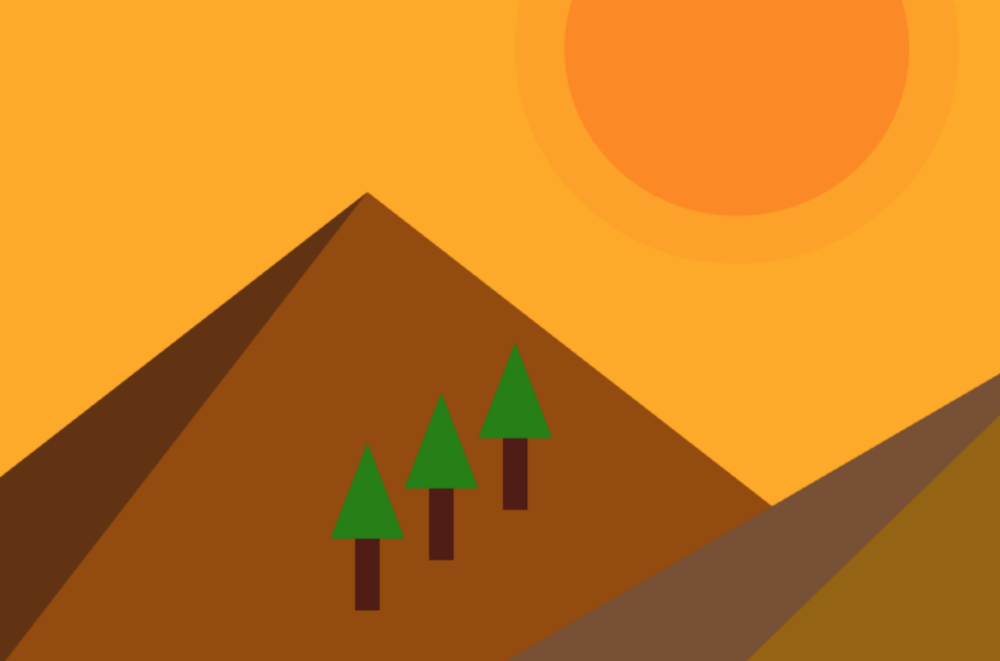
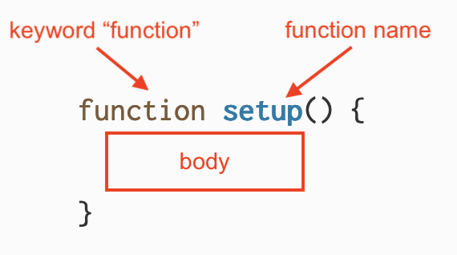
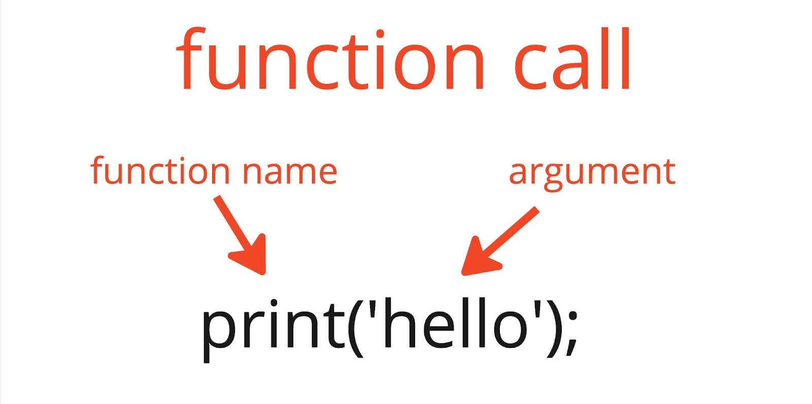
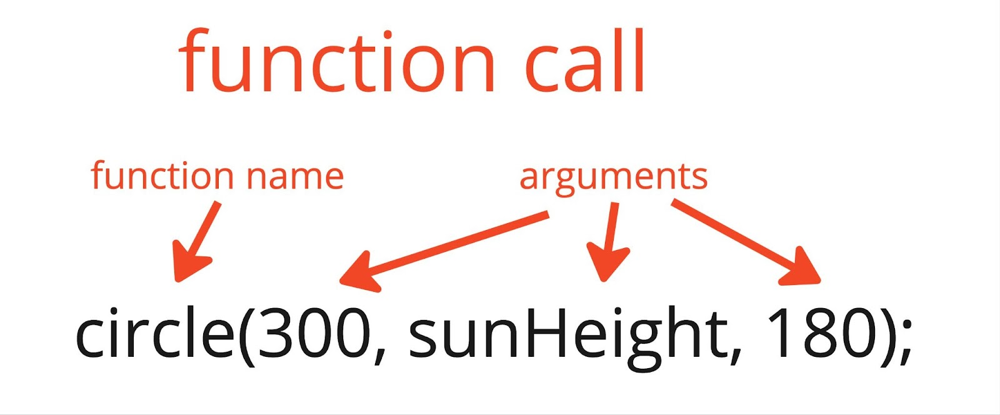
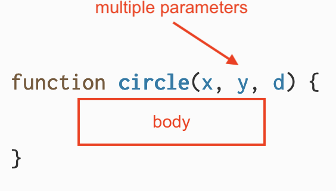
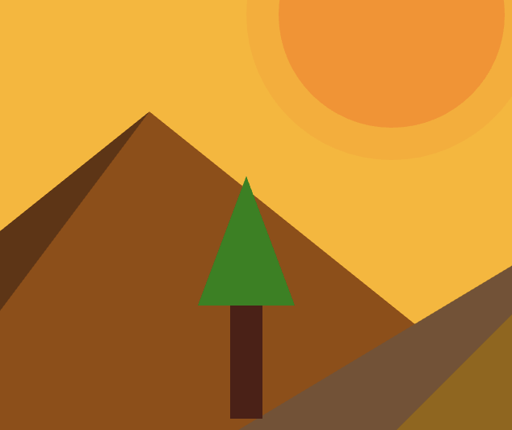

import { Callout } from "../../../components/Callout";

In this tutorial you will build upon the [sunrise animation](https://editor.p5js.org/gbenedis@gmail.com/sketches/9lz2aqfTO) from the last tutorial – [Conditionals and Interactivity](/tutorials/conditionals-and-interactivity) – to create a version using custom functions to help organize your code. Here is an [example](https://editor.p5js.org/gbenedis@gmail.com/sketches/lamalgcPZ) of the sketch you will create at the end of this tutorial.



You will learn about functions and how to use them to organize and improve your code. You will learn about these basic programming concepts:

- Functions built into the p5.js library
- How to create custom functions and use them to easily organize and reuse code
- Arguments, parameters, and return values 


## Prerequisites

- [How-to: Setting Up Your Environment](/tutorials/setting-up-your-environment)
- [Get Started tutorial](/tutorials/get-started)
- [Variables and Change tutorial](/tutorials/variables-and-change)
- [Conditionals and Interactivity tutorial](/tutorials/conditionals-and-interactivity)
- [Field Guide to Debugging](/tutorials/field-guide-to-debugging)

Before you begin, you should be able to:

- Add and customize shapes and text on the canvas
- Add simple interactivity using `mouseX`, `mouseY`, and `mouseIsPressed`
- Declare, initialize, use, and update custom variables
- Incorporate linear and random motion into a p5.js project
- Use conditional statements to control program flow
- Comment code and address error messages

Organizing code is a key skill in creating more complex and exciting programs. It can help to make your code readable to others, allowing them to understand your code and making collaboration easier. It also allows you to understand your own code and expand on ideas, and it even helps with debugging. Functions are a powerful way to make your code more organized, reusable, and accessible. 


## What is a function?

A *function* is a block of code assigned to a specific function name that completes a defined task. Most p5.js sketches already contain at least two *function declarations*, `setup()` and `draw()`. *Function declarations* are used to define functions before we use them. Here is the syntax for a function declaration in p5.js:



The keyword `function` lets p5.js know that a function is being declared. The name of the function defines how it will be called. In this example, the function’s name is `setup`. The name of the function is followed by a pair of parentheses `()`. The **body** of the function, which is a block of code in curly braces `{}`, runs when the function is called. In p5.js, `setup()` is a special built-in function that automatically runs when the play button is pressed. 

```js
// You define the setup() function at the beginning
// of your sketch. It creates a canvas for you to draw on!

function setup() {
  createCanvas(400, 400);
}
```

When a function is used, we say that the function is **called** in the program. The `setup()` function is *called* once when the sketch starts, which means the block of code in the body of `setup()` runs once at the beginning of the program. Similarly, `draw()` is another function built into the p5.js library that is declared in every sketch. When `draw()` is called, it runs the code block in its body repeatedly. It runs over and over again until your program stops.

Visit the p5.js reference pages for [`draw()`](/reference/p5/draw) and [`setup()`](/reference/p5/setup) to learn more.


## Defining custom functions

We can also create our own functions that group code together. In the last tutorial, [Conditionals and Interactivity](/tutorials/conditionals-and-interactivity), you created a [sunset animation](https://editor.p5js.org/gbenedis@gmail.com/sketches/9lz2aqfTO) where the code in `draw()` contained sections marked by comments for the sky, the sun, and the mountains. You can declare custom functions that group related code together with a specific name. 


### Step 1: Plan your functions with comments

- Duplicate your sunset animation, or [this example](https://editor.p5js.org/gbenedis@gmail.com/sketches/9lz2aqfTO), and name it “Organized Sunset Animation”. 
- Before defining custom functions, let’s start with an outline of how we might reorganize some of the code in the [sunset animation](https://editor.p5js.org/gbenedis@gmail.com/sketches/9lz2aqfTO):

  ```js
  function setup() {
    createCanvas(600, 400);
  }
  function draw() {
    // a function for the sky;
    // a function for the sun;
    // a function for the mountains;

    // a function to update the variables
  }
  ```

We can see that there are 4 different groups of related code that we can turn into custom functions: code that draws the sky, draws the sun, draws the mountains, and updates the variables. 

Now you can create 4 different custom functions for the sections of code described in the comments above containing the same code from the original sketch. Custom functions are defined outside of `setup()` and `draw()`, usually at the bottom of your code. 

Visit the p5.js reference page for [`function`](/reference/p5/function) to learn more.


### Step 2: Create and call a custom function for the sky

- Define a function named `sky()`. This function will render the color of the sky in the sketch.

  ```js
  // A function to draw the sky
  function sky() {
    background(redVal, greenVal, 0);
  }
  ```

- Using `sky()` in the sketch, we can make a **function call** in `draw() `with the following syntax:

  ```js
  function draw() {
    // call sky function
    sky();

    // a function for the sun;
    // a function for the mountains;
  
    // a function to update the variables
  }
  ```

Your code should look like this:

```js
//variables for color change
let redVal = 0;
let greenVal = 0;
//variable for sun position
let sunHeight = 600; //point below horizon

function setup() {
  createCanvas(600, 400);
  noStroke(); //removes shape outlines
}

function draw() {
  // call sky function
  sky();

  // a function for the sun;
  // a function for the mountains;

  // a function to update the variables
}

// A function to draw the sky
function sky() {
  background(redVal, greenVal, 0);
}
```

Calling `sky()` causes the code in the body of `sky()` to run when `draw()` runs, and the changing color of the sky is added to the canvas. A **function call** includes the function name followed by a pair of parentheses `()`.


### Step 3: Create and call a custom function for the sun

Move the code for drawing the sun into a function and call the function in draw.

- Declare a function called `sun()` after the function you defined for `sky()`, and include the code that draws the sun in the curly braces.
  - Add the following lines of code after the end of `function sky()`:

    ```js
    //a function to draw the sun
    function sun() {
      // Draw the sun.
      fill(255, 135, 5, 60);
      circle(300, sunHeight, 180);
      fill(255, 100, 0, 100);
      circle(300, sunHeight, 140);
    }  
    ```

- Replace the lines of code that draw the sun with this *function call* in `draw()`:

  ```js
  // call the sun function
  sun();
  ```

Your code should look like this:

```js
//variables for color change
let redVal = 0;
let greenVal = 0;

//variable for sun position
let sunHeight = 600; //point below horizon

function setup() {
  createCanvas(600, 400);
  noStroke(); //removes shape outlines
}

function draw() {
  // call sky function
  sky();

  // call sun function
  sun();

  // a function for the mountains;

  // a function to update the variables
}

// A function to draw the sky
function sky() {
  background(redVal, greenVal, 0);
}

// A function to draw the sun
function sun() {
  fill(255, 135, 5, 60);
  circle(300, sunHeight, 180);
  fill(255, 100, 0, 100);
  circle(300, sunHeight, 140);
}
```

In this step, you declare a new function named `sun()` that draws the sun using circles. The `draw()` function calls `sun()`, which calls `fill()` and `circle()`. `fill()` and `circle()` are also functions that are built into the p5.js library, and do not need to be declared by the programmer. 

The custom functions you declare create shapes, color, and animations from simple building blocks. That is the power of computing: you build upon a simple foundation to create complex sketches. You have used many of the built-in functions in p5.js to make animations and interactive art. Now you have the ability to create your own functions and expand the power of the p5.js library. By defining your own functions, you can create so many things!

You can learn more about all the built-in functions available by visiting the [reference page](https://p5js.org/reference/). All of the items followed by parentheses `()` are functions!


### Step 4: Create and call a custom function for the mountains

Move the code for drawing the mountains into a function:

- Declare a function called `mountains()` and include the code that draws the mountains in the curly braces.
  - Add the following lines to your sketch after `function sun()`:

    ```js
    //A function to draw mountains
    function mountains() {
      fill(110, 50, 18);
      triangle(200,400,520,253,800,400);
      fill(150, 75, 0);
      triangle(-100, 400, 150, 200, 400, 400);
      fill(150, 100, 0);
      triangle(200, 400, 450, 250, 800, 400);
      fill(100,50,12);
      triangle(-100,400,150,200,0,400);
      fill(120,80,50);
      triangle(200,400,450,250,300,400);
    }
    ```

- Remove the lines of code that draw the mountains from `draw()` and replace them with the mountains() function call:

  ```js
  // call the mountains function
  mountains();
  ```

Your code should look like this:

```js
//variables for color change
let redVal = 0;
let greenVal = 0;

//variable for sun position
let sunHeight = 600; //point below horizon

function setup() {
  createCanvas(600, 400);
  noStroke(); //removes shape outlines
}

function draw() {
  // call the sky function
  sky();

  // call the sun function
  sun();

  // call the mountains function
  mountains();
}

// A function to draw the sky
function sky() {
  background(redVal, greenVal, 0);
}

// A function to draw the sun
function sun() {
  fill(255, 135, 5, 60);
  circle(300, sunHeight, 180);
  fill(255, 100, 0, 100);
  circle(300, sunHeight, 140);
}

// A function to draw mountains
function mountains() {

  fill(110, 50, 18);
  triangle(200,400,520,253,800,400);
  fill(150, 75, 0);
  triangle(-100, 400, 150, 200, 400, 400);
  fill(150, 100, 0);
  triangle(200, 400, 450, 250, 800, 400);
  fill(100,50,12);
  triangle(-100,400,150,200,0,400);
  fill(120,80,50);
  triangle(200,400,450,250,300,400);
}
```

The `mountains()` function calls the`  fill()  `and `triangle() `functions to create the mountains, and passes the arguments for `x, y` and `size` to customize them. Notice how the functions help organize the code and make it easy to read! 

<Callout>

- Define a new function to draw other objects in your landscape. 
- Define a new function that updates your variables.

[Here is an example.](https://editor.p5js.org/Msqcoding/sketches/i2rLEvKct)

</Callout>


## Customizing Functions with Parameters

Your functions `sky()`, `sun()`, and `mountains()` all have empty parentheses in their function declaration, and in the function call. Other functions, like `print() `and` circle()`, require values placed inside of the parentheses when you call them. The values in the parentheses when a function is **called** are known as **arguments**. **Arguments** customize the function in some way. 



In the code snippet above, the `print()` function was passed an argument when it was called. The argument is the string `'hello'`. The `print()` function displays values placed in the parenthesis in the console. We could imagine that the function declaration for `print` looks something like this:


In a **function declaration**, the variables listed inside the parentheses are called **parameters**. Parameters act as placeholders that are replaced by the values for arguments in the function call. 

In the examples above, `print('hello')` is a function call that runs the code in the body of its function declaration. The value `'hello'` is passed into the function call as an argument. The argument replaces the `message` parameter in the function declaration. The block of code runs, replacing every instance of `message` with `'hello'`, and `'hello'` is printed in the console.



The function call for `circle()` requires 3 arguments – one for the x-coordinate, one for the y-coordinate, and one for the diameter (`d`) of the circle.

We can imagine that the function declaration in the p5.js library looks something like this:



The function declaration for `circle()` has 3 parameters in the parentheses separated by commas: `x`, `y`, and `d`. The arguments get assigned to their specific parameters. In this case, `x` is assigned 300, `y` is assigned the current value of `sunHeight`, and `d` is assigned 180. The body of the function contains the code to create the circle on the canvas which uses `x` and `y` to determine the circle’s location, and `d` for its diameter.

When you define your own function, you can place parameters in the parentheses of the function declaration. This way, you can use arguments to customize it in the function call. Make sure that the number of arguments you pass to the function call matches the number of parameters in its declaration! Explore this [example of butterflies](https://editor.p5js.org/Msqcoding/sketches/SgRfbWeWN) drawn on the canvas using multiple calls of the `butterfly()` function.

A function that requires one or more parameters requires the correct number of arguments to match the number of parameters in its declaration in order to run successfully. When a function does not receive enough arguments, the missing arguments are assigned a value of `undefined`, which can cause errors and produce strange results. See example 2 and example 7 in the [Field Guide to Debugging](/tutorials/field-guide-to-debugging) for examples of an error you may receive when using the incorrect number of arguments in a function call. 

Let’s see how this works by adding a tree to our sunrise animation.


### Step 5: Add custom functions with parameters 

First define a `tree()` function that has empty parentheses. You can draw a simple tree with a rectangle and triangle.

- Add a `tree()` function declaration to your sketch outside of `draw()`: 

  ```js
  //A function to draw trees
  function tree() {
    // Draw a tree.
    fill(80,30,20);
    rect(200,320,20,60);
    fill(20,130,5);
    triangle(180,320,210,240,240,320)
  }
  ```

- Include a function call for `tree()` in `draw()` after the landscape or mountains:

  ```js
  // call tree function
  tree(); 
  ```

 



Drawing a single tree with a function improves the organization of your code. The real power of this function comes from making it easy to draw multiple trees with different locations and sizes. We can add parameters to the `tree()` function declaration so that we can customize it and call it more than once using different arguments.

It is helpful to think of this function like a cookie cutter. For example, you can make a new tree that is similar to the one you created above, but with a different location and size each time you call the function. To accomplish this, you need to include parameters in the function declaration so that each tree can be customized. 

- Rewrite your function declaration for `tree() `to include 3 arguments: `x`, `y`, and `size`. These arguments are then used as placeholders in the `rect()` and `triangle()` functions. 

  ```js
  //A function to draw trees with different x and y and size
  function tree(x,y,size) {
    // Draw a tree.
    fill(80,30,20);
    rect(x-size,y,size*2,size*6);
    fill(20,130,5);
    triangle(x-size*3,y,x,y-size*8,x+size*3,y)
  }
```

- Draw two trees in your `draw()` function using arguments.

  ```js
  // draw two trees
  tree(150, 320, 10)
  tree(210, 320, 10)
  ```

Your code should look like this:

```js
//variables for color change
let redVal = 0;
let greenVal = 15;

//variable for sun position
let sunHeight = 600;

function setup() {
  createCanvas(600, 400);
  noStroke(); //removes shape outlines
}
function draw() {
  // call the sky function
  sky();

  // call the sun function
  sun();

  // call the mountains function
  mountains();

  // draw two trees
  tree(150, 320, 10)
  tree(210, 320, 10)
}

// A function to draw the sky
function sky() {
  background(redVal, greenVal, 0);
}

// A function to draw the sun
function sun() {
  fill(255, 135, 5, 60);
  circle(300, sunHeight, 180);
  fill(255, 100, 0, 100);
  circle(300, sunHeight, 140);
}

//A function to draw mountains
function mountains() {
  fill(110, 50, 18);
  triangle(200,400,520,253,800,400);
  fill(150, 75, 0);
  triangle(-100, 400, 150, 200, 400, 400);
  fill(150, 100, 0);
  triangle(200, 400, 450, 250, 800, 400);
  fill(100,50,12);
  triangle(-100,400,150,200,0,400);
  fill(120,80,50);
  triangle(200,400,450,250,300,400);
}

//A function to draw trees with different x and y and size
function tree(x,y,size) {
  fill(80,30,20);
  rect(x-size,y,size*2,size*6);
  fill(20,130,5);
  triangle(x-size*3,y,x,y-size*8,x+size*3,y)
}
```

The parameters that customize each tree are `x`, `y`, and `size`. These parameters specify the x-coordinate, y-coordinate, and size of the tree, respectively. In order to maintain the same relative shape of a tree, the `rect()` and `triangle()` functions use **numerical expressions** with parameters and [arithmetic operators.](https://developer.mozilla.org/en-US/docs/Web/JavaScript/Reference/Operators#arithmetic_operators) **Numerical expressions**, such as `x - size`, are mathematical calculations that result in a numerical value. When numbers and [arithmetic operators](https://developer.mozilla.org/en-US/docs/Web/JavaScript/Reference/Operators#arithmetic_operators) are used as arguments in function calls, they pass the result as an argument. 

For example, let’s follow, or *trace*, the function call `tree(210, 320, 10)` to see how the arguments find their way into the `rect()` function:

`tree(210, 320, 10)` is called in `draw()`, where `x = 210`, `y = 320`, and `size = 10`

- Here are the formulas used in the `rect()` function call: 

  ```js
  rect(x-size,y,size*2,size*6); 
  ```

- When `x = 210`, `y = 320`, and `size = 10`, the following values are plugged in:

  ```js
  rect(210-10,320,10*2,10*6);
  ```

- The resulting arguments are used to draw the shape on the canvas:

  ```js
  rect(200,320,20,60); 
  ```

Similarly:

- Here are the formulas used in the `triangle()` function call:

  ```js
  triangle(x-size*3, y, x, y-size*8, x+size*3,y) 
  ```

- When `x = 210`, `y = 320`, and `size = 10`, the following values are plugged in:

  ```js
  triangle(210-10*3, 320, 210, 210 + 10*3, 320);
  ```

- The resulting arguments are used to draw the shape on the canvas:

  ```js
  triangle(180, 320, 240, 320); 
  ```

When the arguments change, the tree is modified and can be at different locations, and with a different size. 

- Explore [this example](https://editor.p5js.org/Msqcoding/sketches/u0VkgENt4) to see how changes in specific arguments customize the tree drawn on the canvas.

You can figure out the exact formula for the `rect()` and `triangle()` functions through trial and error. Starting with a static tree and creating expressions for changes you want to make in the tree is a great place to start! You can even try to add parameters that changes the fill and stroke colors.

- Explore [this example](https://editor.p5js.org/Msqcoding/sketches/yqFWzi_5X) for step-by-step instructions on how to add x and y parameters using numerical expressions, and test your function using` mouseX` and `mouseY`.

For more examples of custom functions that include parameters, visit the p5.js reference page for [`function`](/reference/p5/function).

By creating two trees with the same `tree()` function, you reduce the amount of code in your sketch. This makes your code shorter so that it is easier to read. With less code, it is also easier to debug. 

<Callout>

- Call `tree()` with the wrong number of arguments. What happens?
- Modify one of your existing functions to use parameters.
- Declare another function that uses parameters to draw distinct objects in your landscape – for example, `seagull(x, y, size)` or `cloud(x, y, size)`.

Here is an [example](https://editor.p5js.org/Msqcoding/sketches/l4Mq4a4HG).

</Callout>


## Return Values

Functions such as `random()` produce, or **return**, values that can be used elsewhere in your code. Here’s an example of a function that adds 5 to its parameter and returns the result:

[The syntax for function declaration that returns the value “ans” with labeled arrows pointing to its various parts. An arrow labeled “keyword ‘function’” points to the word “function”;  an arrow labeled “function name” points to “plus5”; an arrow labeled “parameter” points to the letter “n” within parentheses; the body of the function is labeled “block of code in curly braces” with the code “let ans = n + 5” and “return ans;” on separate lines.](../images/introduction/function-return.jpg)

Similar to other function declarations, the keyword `function` is followed by the function name and a pair of parentheses. This function has one parameter, `n` within the parenthesis. The body of the function includes a numerical expression and **return statement**. The keyword `return` tells functions to finish executing the code block and provide a result as an output value.

Let’s try this out with a quick [example](https://editor.p5js.org/mcintyre/sketches/BvgR93OHj) that displays the value returned by `plus5()` as text. Open a new p5.js project and add the following code to the `script.js` file:

```js
function setup() {
  createCanvas(400, 400);
}

function draw() {
  background(220);
 
  // Make a calculation by calling plus5().
  let number = plus5(10);
 
  // Style the text.
  textAlign(CENTER);
  textSize(30);
 
  // Display the text.
  text(`10 + 5 = ${number}`, width / 2, height / 2);
}

function plus5(n) {
  let ans = n + 5;
  return ans;
}
```

In this sketch, you defined a variable `number` and assigned it to the value returned by the `plus5(10)` function call. The argument 10 replaces the parameter `n` in the function declaration. In the first line of `plus5()`, the result of 10+5 or 15 is stored in the variable `ans`. The function then returns a value of 15. Finally, you displayed the answer by passing `number `to the `text()` function using [string interpolation](https://developer.mozilla.org/en-US/docs/Web/JavaScript/Reference/Template_literals#string_interpolation).

Here’s another [example](https://editor.p5js.org/mcintyre/sketches/sWNY9_UO_) that uses `plus5()` to draw the path of a shooting star:

```js
function setup() {
  createCanvas(400, 400);
}
function draw() {
  // Draw the sky black with transparency.
  background(0, 50);
 
  // Set the stroke.
  stroke(255);
  strokeWeight(5);
 
  // Increase the x-coordinate with each frame.
  let x = frameCount;
 
  // Call plus5() to calculate the y-coordinate.
  let y = plus5(x);
 
  // Draw the shooting star.
  point(x, y);
}

function plus5(n) {
  let ans = n + 5;
  return ans;
}
```

In `draw()`, you stored the value in `frameCount` in the variable `x`, then passed it to `plus5()`. You also stored the value returned by `plus5(x)` in the variable `y`. Finally, you used `x` and `y` as the arguments in the `point()` function call to display a shooting star as it moves from left to right. The values stored in both x and y (in the draw function) increase as the sketch runs. Notice that the shooting star follows a diagonal line. 

Visit the p5.js reference page for [return](/reference/p5/return) to learn more.


### Step 6: Use custom functions inside other custom functions

To practice this idea, let’s return to our sunrise animation sketch and define a function that’s very similar to `plus5()` called `treeLine()`. It does a bit more math using its parameter and returns the result:

```js
// A function to calculate the y-coordinate of a tree along a straight line.
function treeLine(x) {
  let y = -0.7 * x + 450;
  return y;
}
```

The statement `let y = -0.7 * x + 450;` multiplies the parameter `x` by `-0.7`, then adds `450` to that value, stores the value in the variable `y`, and returns `y`.

- Declare the `treeline()` function and a `trees()` function to draw a few trees. Add a `treeLine()` function declaration to your sketch:
  - Add the following lines to your code below `draw()`:

    ```js
    function treeLine(x) {
      let y = -0.7 * x + 450;
      return y;
    }
    ```

- Add a `trees()` function declaration to your sketch. 
  - Add the following lines to your code below `draw()`:

    ```js
    function trees() {
      // First tree
      let x = 150;
      let y = treeLine(x);
      tree(x, y, 5);
     
      // Second tree
      x = 180;
      y = treeLine(x);
      tree(x, y, 5);
     
      // Third tree
      x = 210;
      y = treeLine(x);
      tree(x, y, 5);
    }
    ```

- Add a `trees()` function call to `draw()`.
  - Add the following lines inside `draw()`:

    ```js
    // call trees() function
    trees();
    ```

Your code should look like this:

```js
//variables for color change
let redVal = 0;
let greenVal = 15;

//variable for sun position
let sunHeight = 600;

function setup() {
  createCanvas(600, 400);
  noStroke(); //removes shape outlines
}

function draw() {
  // call the sky function
  sky();

  // call the sun function
  sun();


  // call the mountains function
  mountains();

  // draw two trees
  trees()
}

// A function to draw the sky
function sky() {
  background(redVal, greenVal, 0);
}

// A function to draw the sun
function sun() {
  fill(255, 135, 5, 60);
  circle(300, sunHeight, 180);
  fill(255, 100, 0, 100);
  circle(300, sunHeight, 140);
}

//A function to draw mountains
function mountains() {
  fill(110, 50, 18);
  triangle(200,400,520,253,800,400);
  fill(150, 75, 0);
  triangle(-100, 400, 150, 200, 400, 400);
  fill(150, 100, 0);
  triangle(200, 400, 450, 250, 800, 400);
  fill(100,50,12);
  triangle(-100,400,150,200,0,400);
  fill(120,80,50);
  triangle(200,400,450,250,300,400);
}

//A function to draw trees with different x and y and size
function tree(x,y,size) {
  fill(80,30,20);
  rect(x-size,y,size*2,size*6);
  fill(20,130,5);
  triangle(x-size*3,y,x,y-size*8,x+size*3,y)
}

//A function that creates a line for trees to be drawn
function treeLine(x) {
  let y = -0.7 * x + 450;
  return y;
}

//A function that draws many trees 
//using treeLine() and tree() functions
function trees() {
  // First tree
  let x = 150;
  let y = treeLine(x);
  tree(x, y, 5);
 
  // Second tree
  x = 180;
  y = treeLine(x);
  tree(x, y, 5);
 
  // Third tree
  x = 210;
  y = treeLine(x);
  tree(x, y, 5);
}
```

In the step above, you defined a function called `treeLine()` that calculates a line along which multiple trees can be drawn. You also defined a function that uses the `tree()` function you created earlier and the `treeLine()` function to draw multiple trees along a line in your landscape. 

[Here is an example of what your project could look like!](https://editor.p5js.org/gbenedis@gmail.com/sketches/lamalgcPZ)

<Callout>
- Modify the expression `let y = -0.7 * x + 450;` in the `treeLine()` to use values other than `-0.7` and `450`. 
- Change one number at a time and observe the results.
</Callout>


## The `keyPressed()` function

In addition to functions like `setup()` and `draw()`, you can use other built-in p5.js functions that add interactivity to your program. The function `keyPressed()` is a useful function to define in your program, as it gets triggered when the user presses a key. 


### Step 7: Add interactivity to your animation

Define the function `keyPressed()` at the bottom of your sketch.

```js
function keyPressed() {
  redVal=0;
  greenVal = 0;
  sunHeight = 600;
}
```

`keyPressed()` runs one time when any key on the keyboard is pressed. Here, we use it to reset variables back to their initial position when a key is pressed, essentially starting the animation from the beginning. 

[Link to example sketch](https://editor.p5js.org/gbenedis@gmail.com/sketches/lamalgcPZ)

`keyPressed()` can also access the `key` variable that a user presses, allowing for more user interactivity. Similarly, you can define a function `mousePressed()` in your sketch that runs once every time the user clicks the mouse. 

Here are some examples you can explore:

- [`keyPressed()`](https://editor.p5js.org/Msqcoding/sketches/QEqQlTWpU)
- [`keyPressed()` and `key`](https://editor.p5js.org/Msqcoding/sketches/HkDcaRKk4)
- [`mousePressed()`](https://editor.p5js.org/Msqcoding/sketches/bz6vz74tJ)

For more information on functions like [`keyPressed()`](/reference/p5/keyPressed) and [`mousePressed()`](/reference/p5/mousePressed), visit the [Events section of the p5.js reference](/reference#Events).


## Conclusion

Functions like `tree()` let you express a complex idea (drawing a tree) using a combination of simpler ideas (drawing [2D shapes](/reference#Shape)). The function `trees()` further expands this idea by creating a line of trees. Whether you’re sketching a landscape or designing an interactive light show, functions can help you construct complex ideas out of simpler ones. This is called **abstraction**. Abstraction allows you to focus at a higher level so that you are not distracted by all the details. Imagine what your code would look like if you animated a magic forest by calling `triangle()` and `rect()` hundreds of times. It would be hard to keep track of everything. Functions allow you to create abstractions that handle details such as the specific coordinates of the shapes in an elegant and organized way. As your sketches become more elaborate, you’ll find that creating the right abstractions makes it easier to focus on the big picture.

<Callout>
Declare a `butterfly()` function to display a butterfly `🦋`emoji that appears at random locations or flutters around. Call the `butterfly()` function in `draw()` to display.

Here is an [example](https://editor.p5js.org/gbenedis@gmail.com/sketches/yGn00cD2Q).

##### Or Try This Spicy Challenge!

Create an entirely new sketch and animate a different landscape. Use functions to plan and organize this exciting project. 
</Callout>

# Next Steps

- [Repeating with Loops](/tutorials/repeating-with-loops) 


# References

- [Expressions and operators](https://developer.mozilla.org/en-US/docs/Web/JavaScript/Reference/Operators#arithmetic_operators)
- [String Interpolation](https://developer.mozilla.org/en-US/docs/Web/JavaScript/Reference/Template_literals#string_interpolation)

