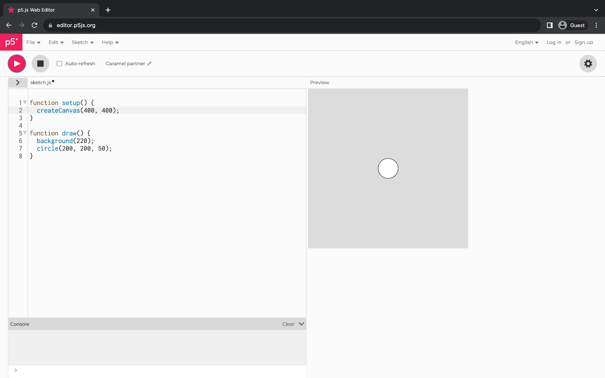

import AccessibleOutput from '../../../components/AccessibleOutput/index.astro';

# How to Use the p5.js Web Editor with a Screen Reader

This guide will introduce ways to make the p5.js Web Editor easier to use with a [screen reader](https://en.wikipedia.org/wiki/Screen_reader). We will introduce important keyboard shortcuts, menu settings, and demonstrate the p5.js Web Editor’s features for playing warning sounds for syntax errors and reading text descriptions of the canvas.


## Prerequisites

1. If you’re new to using the p5.js Web Editor, read the [Get Started](/tutorials/get-started) guide.
2. Read [Writing Accessible Canvas Descriptions](/tutorials/writing-accessible-canvas-descriptions) for a detailed introduction of [`textOutput()`](/reference/p5/textOutput) and [`gridOutput()`](/reference/p5/gridOutput). The p5.js Web Editor uses these functions to generate text descriptions of sketch canvases for a screen reader.


## Step 1 – Review the Available Keyboard Shortcuts

The p5.js Web Editor has keyboard shortcuts for general navigation and code editing. 

Read a list of the keyboard shortcuts by navigating to the ‘Help’ dropdown on the main menu and selecting ‘Keyboard Shortcuts’. 


Selecting ‘Keyboard Shortcuts’ will display a pop-up of available shortcuts. The list contains two sections, one for Code Editing shortcuts and another for General shortcuts. 

The specific key shortcut combinations depend on your operating system. For example, you can turn on accessible outputs by pressing CMD + SHIFT + 1 on macOS or CTRL + SHIFT + 1 on Windows and Linux. The list reflects the keystrokes for an English QWERTY macOS keyboard. 


The keyboard shortcuts are as follows:


### Code Editing Keyboard Shortcuts

Code editing keyboard shortcuts follow [Sublime Text shortcuts](https://shortcuts.design/toolspage-sublimetext.html).

- ⌘ + ⇧ + F Tidy
- ⌘ + F Find Text
- ⌘ + G Find Next Text Match
- ⌘ + ⇧ + G Find Previous Text Match
- ⌘ + ⌥ + F Replace Text Match
- ⌘ + \ [Indent Code Left
- ⌘ + ] Indent Code Right
- ⌘ + / Comment Line
- ⌘ + . Comment Line
- ⌘ + K Show Inline Color Picker


### General Keyboard Shortcuts

- ⌘ + S Save
- ⌘ + Enter Start Sketch
- ⌘ + ⇧ + Enter Stop Sketch
- ⌘ + ⇧ + 1 Turn On Accessible Output
- ⌘ + ⇧ + 2 Turn Off Accessible Output
- ⇧ + Right Go to Reference for Selected Item in Hinter


## Step 2 – Open the Accessibility Settings

Open the p5.js Web Editor’s preferences menu by selecting the ‘Open Preferences’ button at the top right, below the main menu.


Once you’ve opened the preferences menu, select the ‘Accessibility’ settings tab from the menu to access the available options.


The first accessibility setting lets you control whether to display line numbers. The p5.js Web Editor displays line numbers by default since they’re generally helpful for debugging. In the next few sections, you’ll explore the options for warning sounds and text descriptions.


## Step 3 – Enable Lint Warning Sounds

The p5.js Web Editor shows visual cues when it detects problems with your code. The code changes color when a function call has unmatched parentheses, like in the following code snippet:

```js
function draw() {
  // The function call is missing a
  // closing parenthesis.
  background(220
}
```

Within this example, the red text indicates a class of problems called [syntax errors](https://developer.mozilla.org/en-US/docs/Web/JavaScript/Reference/Global_Objects/SyntaxError). 

In addition to visual cues, the p5.js Web Editor can play a friendly warning noise when it detects syntax errors. To enable this feature, turn the ‘Lint warning sound’ to ‘On’ within the accessibility settings menu. You also have the option to preview the sound within this menu.


Now that you’ve enabled the warning sound, test it by introducing a syntax error. Remove a parenthesis from `background()`.


A syntax error appeared on line 6 because the `background()` call is missing a parenthesis. With ‘Lint warning sound’ on, the p5.js Web Editor will play a warning tone to call attention to the bug.


## Step 4 – Enable Plain-Text Descriptions

The p5.js Web Editor has two options for inserting text descriptions of the canvas. The first option is plain text, based on p5.js’ [`textOutput()`](/reference/p5/textOutput) function. It generates a list describing the canvas size, color, as well as each visual element’s color, position, and the area it covers within the canvas.

The p5.js Web Editor can automatically insert these plain text descriptions for you. To enable them, navigate back to the Accessibility settings menu and select the ‘Plain-text’ check-box under the ‘Accessible text bases canvas’ section. 


Now that plain-text descriptions are enabled, add a shape to your canvas and test out the description. As an example, the following image shows a circle within the [`draw()`](/reference/p5/draw) function.



The canvas now has the following plain-text description:

<AccessibleOutput>
Your output is a 400 by 400 pixel gray canvas containing the following shape:

- white circle, at middle, covering 1% of the canvas.

**white circle** location = middle area = 1%
</AccessibleOutput>

## Step 5 – Enable Table-Text Descriptions

The p5.js Web Editor has another option for text descriptions that can give you a sense of position. This feature uses the [`gridOutput()`](/reference/p5/gridOutput) function behind the scenes to do so. It places shape descriptions in a `<table>` element that’s used as a grid. Each shape in the grid is placed in a cell whose row and column correspond to the shape’s location on the canvas.

To enable these descriptions, head to the **Accessible text-based canvas** section of the Accessibility settings one more time. You will de-select the ‘Plain-text’ check-box and select ‘Table-text’ instead. If you have both these functions turned on, the screen reader will repeat information which could be confusing. 


Now, run your sketch again to test the table-text description. The previous example of a white circle produces the following canvas description:

<AccessibleOutput>

gray canvas, 400 by 400 pixels, contains 1 shape: 1 circle

<table>

<tr>

<td>

</td>

</tr>

<tr>

<td>

</td>

</tr>

<tr>

<td>

</td>

</tr>

<tr>

<td>

</td>

</tr>

<tr>

<td>

</td>

</tr>

<tr>

<td>

white circle

</td>

</tr>

<tr>

<td>

</td>

</tr>

<tr>

<td>

</td>

</tr>

<tr>

<td>

</td>

</tr>

<tr>

<td>

</td>

</tr>

</table>

**white circle**, location = bottom right, area = 1 %

</AccessibleOutput>

## Conclusion

The p5.js Web Editor has several features that make it easier to code while using a screen reader. Warning sounds can alert you to syntax errors while you code. Text descriptions of the canvas can help you to keep track of visual outputs. 

Keep in mind that the features described above only work within the p5.js Web Editor while you code. Check out [How to Label Your p5.js Canvas](https://p5js.org/learn/labeling-canvases.html) for detailed guidance on p5.js code accessibility. This is an important step for making your project accessible when sharing it outside of the p5.js Web Editor.
