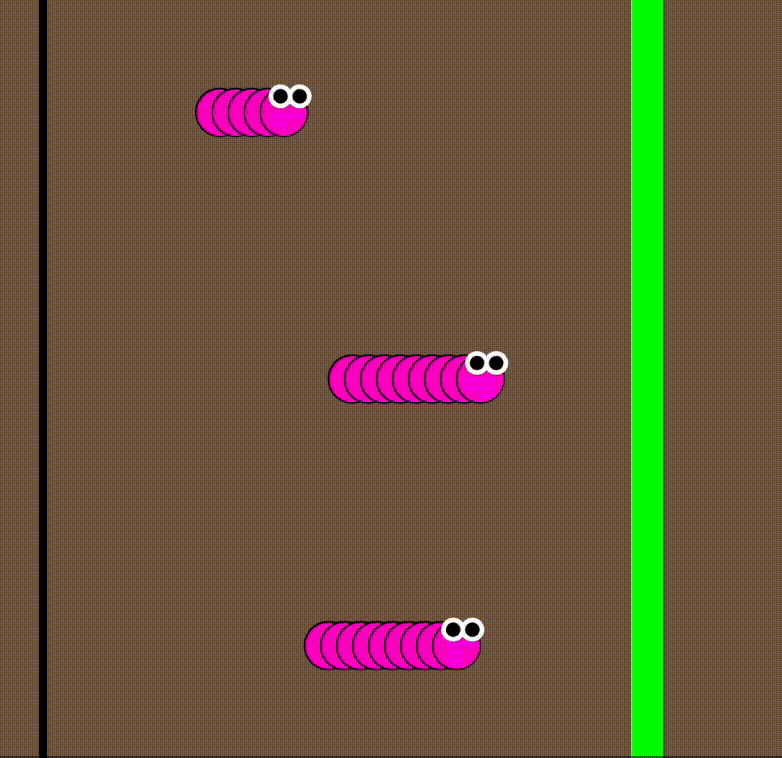

import EditableSketch from "../../../components/EditableSketch/index.astro";
import Callout from "../../../components/Callout/index.astro";
import AnnotatedLine from "../../../components/AnnotatedLine/index.astro";

## Introduction

Ever want to take your projects to the next level by drawing many shapes with only a few lines of code? Imagine drawing a row of trees, a stack of books, the arches of a rainbow, or the inside of a honeycomb. To create visuals that are made with versions of the same shape, we go beyond coding individual shapes, and venture into the wonderful world of loops and arrays. Let’s learn how to create repeating patterns with only a few lines of code!


Drawing each shape with a new line of code would be a tedious process. Instead, we can use *loops,* which allow us to execute and repeat blocks of code as many times as we want. In this tutorial, we use loops and arrays to create [a racing caterpillar sketch](https://editor.p5js.org/gbenedis@gmail.com/sketches/BrmtZ36ET).



A group of caterpillars will begin at the starting line of the race, and the first caterpillar to pass the finish line wins. The winning caterpillar will vary each time we run the sketch!

In this tutorial, you will:

- Draw and update repetitive tasks and shapes using *for loops*
- Use custom functions to update variables and program states and make changes in the program as the sketch runs.
- Use [conditional statements](/reference/p5/if-else) and `random()` to generate different outcomes
- Run and stop your sketch using mouse triggers and [Boolean variables](/reference/p5/boolean)
- Store the positions of the caterpillars in an array

### What you’ll need

- The [p5.js Web Editor](https://editor.p5js.org/)
- An understanding of p5.js drawing basic shapes and text using  x- and y-coordinates
  - You can refer to our previous tutorial, [Get Started](/tutorials/get-started)
- An understanding of variables and conditionals
  - You can refer to our previous tutorials, [Variables and Change](/tutorials/variables-and-change/) and [Conditionals and Interactivity](/tutorials/conditionals-and-interactivity)
- An understanding of custom functions and parameters
  - You can refer to our previous tutorial, [Organizing Code with Functions](/tutorials/organizing-code-with-functions)


## Step 1 – Draw the racetrack

- Open a new project in the [p5.js Web Editor](https://editor.p5js.org/), give it a name like “Caterpillar Race”, and save it.
- In `setup(),` create a 500x500 pixel canvas.
- Declare two new global variables above `setup()` to define the x-coordinates of your start line and finish line respectively. We will name the two variables startLine and finishLine.
  - Assign them values on the x-axis, depending on where you’d like to place your start and finish lines. In this example, we’ll set the startLine to 30, and finishLine to 360.
- In the `draw()` function:
  - Set a background color. For example, we’ll set it to brown with `background(121, 96, 76)`;
  - Draw a rectangle and set its x-coordinate as `startLine`. Set its height to `height` so that it stretches vertically across the canvas.
  - Draw another rectangle at `finishLine` and repeat the same step.
  - Fill the two rectangles with different colors.
- Don’t forget to name and save your sketch.

Your code could look like this:

<EditableSketch code={`
// Set variables to draw the racetrack.
let startLine = 30;
let finishLine = 400;
function setup() {
  // 500x500 canvas
  createCanvas(500, 500); 
}

function draw() {
  //set background color
  background(121, 96, 76);

  // Draw the start and finish lines.
  noStroke();
  fill(0);
  rect(startLine, 0, 5, height);
  fill(0, 255, 0);
  rect(finishLine, 0, 20, height);
}
`} />

## Step 2 – Draw one caterpillar segment and make it move.

Next, we will draw one segment of a caterpillar on the canvas and make it travel from the start line to the finish line. It will stop at the end of the race.

- Declare a new global variable named `circX` and assign it the value of `startLine`. 
  - This will be the x-coordinate of the caterpillar's segment.
- Declare a new global variable named `circY` and assign it the value of 250 (or half of the height). 
  - This will be the y-coordinate of the caterpillar's segment.
- In `draw()`:
  - Draw the caterpillar segment using the `circle()` function. Include `circX`, `circY`, and 50 as arguments to specify the x coordinate, y coordinate, and diameter: `circle(circX, circY, 50);`
  - We will also give the circle a white fill color and a thin black stroke.
  - Under the circle command, increment `circX` by 20 using `circX += 20;`
    - This means that every time the `draw()` function runs, the variable `circX` will increase by 20 pixels. The sketch will draw a new circle at an x-coordinate 20 pixels to the right of the previous circle creating the shape of a caterpillar..
- Add the following conditional statement at the end of `draw()`:

  ```js
  if (circX > finishLine) {
    noLoop();
  }
  ```

The `noLoop()` function stops the `draw()` function from running again. The `if` statement stops `draw()` using `noLoop()` when the x-coordinate of the circle passes the value of finishLine. Visit the p5.js reference for more information about [`noLoop()`](/reference/p5/noLoop).

In `setup()`, add: `frameRate(3);`

- A [frame rate](/reference/p5/frameRate) is the number of times `draw() `runs in one second. Setting it to a low number will make the movements more noticeable and dramatic for this animation.

Your code should look like this:

<EditableSketch code={`
// Set variables to draw the racetrack.
let startLine = 30;
let finishLine = 400;

// Set variables to draw circles starting point.
let circX = startLine;

let circY = 250;

function setup() {
  createCanvas(500, 500); 

  // Set a slow frame rate.
  frameRate(3);
}

function draw() {
  // Draw the background.
  background(121, 96, 76);

  // Draw the start and finish lines.
  noStroke();
  fill(0);
  rect(startLine, 0, 5, height);
  fill(0, 255, 0);
  rect(finishLine, 0, 20, height);

  // Draw a circle.
  fill(255);
  stroke(0);
  circle(circX, circY, 50);

  // Move the x-coordinate
  // to the right.
  circX += 20;

  // End the loop when x
  // reaches the finish line.
  if (circX > finishLine) {
    noLoop();
  }
}
`} />

### [If-statements](/reference/p5/if-else)

If-statements, like the one applied above, refer to blocks of code that are executed only when a given condition is true. It is normally written:

```js
if (<condition>) {
  <code>
}
```

The condition is specified inside the parentheses of the if-statement. The curly brackets `{ }` mark the start and end of the block of code. In Step 2, the condition `circX > finishLine` stops `draw()` from running again when the x-coordinate of the circle is greater than the value of `finishLine` by calling `noLoop()`.

Visit the p5.js reference for [if](/reference/p5/if-else) to learn more.


## Step 3 – Draw one caterpillar

We will repeat the caterpillar segment from Step 2 to make a row of circles that make up the caterpillar’s body. We will use a *for loop*, to draw multiple circles in a row.


### 3.1 – Declare the properties of the caterpillar’s body

Above `setup()`:

- Declare a new variable named `segments` and assign it a value of 6.
  - This variable defines how many circles that makeup the caterpillar’s body.
- Declare a new variable named `spacing` and assign it a value of 20.
  - This variable defines the pixel spacing between the caterpillars body segments.
- Declare a new variable named `segmentSize` and assign it a value of 50.
  - This variable defines the diameter of the circle body segments. 


### 3.2 – Construct the caterpillar’s body with a *for loop*

In `draw()`:

- After the code that draws the finish line, declare a new local variable `x` to position all the body segments: `let x = circX;`
- Add a *for loop* using: `for (let i = 0; i < length; i += 1) { }`
  - A *for loop* will repeat the code we write inside the curly brackets multiple times. 
  - Move the lines of code that draw the `circle()` into the curly brackets of the *for loop*.
- After the for loop, add: `circX += spacing` 
  - This moves the caterpillar body to the right each time `draw()` runs.

Your code should look like this:

<EditableSketch code={`
// Set variables to draw the racetrack.
let startLine = 30;
let finishLine = 400;

// Set variables for the caterpillar.
let circX = startLine;
let circY = 250;
let spacing = 20;
let segments = 6;
let segmentSize = 50;

function setup() {
  createCanvas(500, 500);

  // Set a slow frame rate.
  frameRate(3);
}

function draw() {
  // Draw the background.
  background(121, 96, 76);

  // Draw the start and finish lines.
  noStroke();
  fill(0);
  rect(startLine, 0, 5, height);
  fill(0, 255, 0);
  rect(finishLine, 0, 20, height);

  // a local variable to position the body segments
  let x = circX;

  // draw multiple circles (caterpillar body)
  for (let i = 0; i < segments; i += 1) {
    // Draw a circle.

    fill(255);
    stroke(0);
    circle(x, circY, segmentSize);
    x += spacing;
  }

  // Move the caterpillar  to the right.
  circX += spacing;
  // stop the animation  when x
  // reaches the finish line.
  if (circX > finishLine) {
    noLoop();
  }
}
`} />


### [For loops](/reference/p5/for)

A for loop can execute a section (or block) of code multiple times. For loops can be written like this:

```js
for (let i = 0; i < number; i += 1) { 
  // code that you want to execute number times
}
```

Inside the curly brackets `{}` of a for loop, we write the code that we want to execute repeatedly. We can specify the number of times we want the code to repeat by setting the loop’s condition.

A for loop is defined by three statements inside its parentheses, each separated by semicolons. They are:

<AnnotatedLine code={({ bottom }) => `for (${bottom('init', ' let i = 0; ')} ${bottom('cond', 'i < number;')} ${bottom('instr', '  i += 1  ')}) { }`}>
  <Fragment slot="init">Initialization</Fragment>
  <Fragment slot="cond">Condition</Fragment>
  <Fragment slot="instr">Instruction</Fragment>
</AnnotatedLine>

- **Initialization**: initialize the iteration variable `i` with a number to start counting with. 

  ```js
  let i = 0;
  ```

- **Condition:** the condition that keeps the loop running. As long as this condition is true, the for loop will continue to run. When this condition is `false`, the for loop will stop.

  ```js
  i < number;
  ```

- **Instruction:** this tells the program how to change the counting number each time the loop runs. 

  ```js
  i += 1;
  ```

The first expression, `let i = 0`, initializes or starts the for loop. 

- i is a variable that defines the initial state of the for loop. It’s also known as the *index* variable. Commonly, the index starts at a value of 0, and increases each loop. The name of this variable can be anything you like. Generally, single-letter variables such as `i`, `j` and `k` are used, but feel free to use something more descriptive.

The second expression, `i < number`, is the condition for the loop to keep running. It is known as a Boolean expression, as this expression can return `true` or `false`. As long as this expression is `true`, the for loop will continue to run, and in this case the index variable (`i`) will continue to increase.

- `number` can be any numerical value or variable that stores a numerical value. For counting, integers are often used.  
  - Example: `i < 5;` or `i < segments;`
- In this case, `number` determines the number of times the for loop will run because the initial value `i` begins at 0. 
- In the caterpillar example above, we set this value to the `segments` variable, which specifies the number of circles that make up the caterpillar's body. As long as the index has not reached the number stored in `segments`, the loop will continue to draw circles.
  - Once the number of circles drawn is no longer less than segments, the program exits the for loop, and continues to the next line of code.

The third expression, `i += 1`, is how the index will change at the end of each loop iteration.

- A [**loop iteration**](https://developer.mozilla.org/en-US/docs/Web/JavaScript/Guide/Loops_and_iteration) refers to a single time a loop runs. For example, if a for loop runs 3 times, it has 3 iterations.
- In this example, the `i` variable will increase by 1 each time the for loop runs. That means the first time this for loop runs, `i` is 0. The second time the loop runs, `i` is 1. The third time it runs, `i` is 2, and so forth (until it reaches the value `number`). This expression `i += 1` can also be written `i++`.

In summary: 

1. When a program executes a for loop, it first declares the loop’s index variable in the first expression. 
2. It checks the second expression, which is a Boolean expression. If it is `true,` it runs the code written inside the curly brackets.
3. At the end of a loop, the value of the iteration variable, `i`, changes as defined by the third expression. 
4. The loop repeats this process until the condition in the second expression is `false`. When the condition is `false`, the program exits the for loop and continues to the next lines of code in the sketch.

Visit the [for loops reference](/reference/p5/for) to learn more.


### 3.3 – Add more details to the caterpillar 

- Adjust the `fill()` color for your caterpillar’s body if you wish to. In this example, we’ll give it a pink color: `fill(255, 0, 200);`
- Draw the caterpillar’s eyes. The position of the eyes is the same as the x- and y-coordinates of the last circle that is drawn for the body.  This means that it comes AFTER the for loop has already drawn all circles, so we will add the eyes after the for loop, but before `noLoop()`. This ensures the eyes are drawn on top of the last circle in the caterpillars body.
  - Declare `eyeSize` as a new global variable above `setup(),` and assign it the value of 15.
  - Draw two circles.
    - Give them a black fill and a thick white stroke.
  - Add the first eye and set its coordinates and size: `circle(x, circY-eyeSize, eyeSize);`
    - This places the eye at the top of the last drawn circle.
  - Add the second eye and set its coordinates and size: `circle(x - eyeSize, circY-eyeSize, eyeSize);`
    - We subtract the second eye’s x-coordinate by `eyeSize` so both eyes are side by side with no overlap.
- When your caterpillar is complete, organize your code into a custom function named `drawCaterpillar()`. Feel free to modify the caterpillar as you like!
  - Define the `drawCaterpillar()` function outside of `draw()`.
  - The function should include your for loop of circles for the caterpillar’s body and the two circles for the caterpillar’s eyes.
  - Remember to call it in the `draw()` function! Type `drawCaterpillar();` in `draw()` before the if-statement that ends the loop.

Here is how your sketch could look to far:

<EditableSketch code={`
// Set variables to draw the racetrack.
let startLine = 30;
let finishLine = 400;

// Set variables for the caterpillar.
let circX = startLine;
let circY = 250;
let spacing = 20;
let segments = 6;
let segmentSize = 50;
let eyeSize = 15;

function setup() {
  createCanvas(500, 500);
  frameRate(3);
}

function draw() {
  // Draw the background.
  background(121, 96, 76);

  // Draw the start and finish lines.
  noStroke();
  fill(0);
  rect(startLine, 0, 5, height);
  fill(0, 255, 0);
  rect(finishLine, 0, 20, height);
  drawCaterpillar();

  circX += spacing;
  // End the loop when x
  // reaches the finish line.
  if (circX > finishLine) {
    noLoop();
  }
}

function drawCaterpillar() {
  // Create a loop of circles
  // to form the body.
  let x = circX;

  for (let i = 0; i < segments; i += 1) {
    fill(255, 0, 200);
    stroke(0);
    strokeWeight(1);
    circle(x, circY, segmentSize);

    x+=spacing;
  }
 
  // Draw the caterpillar's eyes.
  fill(0);
  stroke(255);
  strokeWeight(3);
  circle(x, circY - eyeSize, eyeSize);
  circle(x - eyeSize, circY - eyeSize, eyeSize);
}
`} />

<Callout>
Play around with different sizes for the caterpillar’s body and eyes by adjusting the `bodySize` and `eyeSize` variables.
</Callout>


## Step 4 – Generalize the `drawCaterpillar()` function

When the sketch first runs, we want each caterpillar to be at the starting line. This means we’ll need to add parameters to our function so that we can modify them to specify where the caterpillars are drawn.

- Go to the `drawCaterpillar()` function.
  - Add `x` as a parameter in the parentheses of the function: `function drawCaterpillar(x) { ...}`
    - Note that we had already declared `x` as a local variable in the `drawCaterpillar()` function. We can remove that declaration and use the `x` parameter instead.
  - Add `y` as the second parameter in the parentheses of the function `function drawCaterpillar(x,y) { ... }`
    - Substitute `y` for `circY` in the function body.

You can learn more about custom functions, arguments, and parameters in our previous tutorial, [Organizing Code with Functions](/tutorials/organizing-code-with-functions), and the p5.js reference for [functions](/reference/p5/function).

Your custom functions should now look similar to this:

```js
function drawCaterpillar(x,y) {
  // Create a loop of circles
  // to form the body.
  for (let i = 0; i < segments; i += 1) {
    fill(255, 0, 200);
    stroke(0);
    strokeWeight(1);
    circle(x, y, 50);

    x += spacing;
  }
 
  // Draw the caterpillar's eyes.
  fill(0);
  stroke(255);
  strokeWeight(3);
  circle(x, y - eyeSize, eyeSize);
  circle(x - eyeSize, y - eyeSize, eyeSize);
}
```

- In `draw()`, call `drawCaterpillar()` three times to get three caterpillars

Your draw function should look like this:

```js
function draw() {
  // Draw the background.
  background(121, 96, 76);
  // Draw the start and finish lines.
  noStroke();
  fill(0);
  rect(startLine, 0, 5, height);
  fill(0, 255, 0);
  rect(finishLine, 0, 20, height);

  // Draw 3 caterpillars.
  drawCaterpillar(circX,circY-150);
  drawCaterpillar(circX,circY);
  drawCaterpillar(circX,circY+150);

  circX += spacing;
  // End the loop when x
  // reaches the finish line.
  if (circX > finishLine) {
    noLoop();
  }
}
```


## Step 5 – Create a `drawCaterpillars()` function

Now we have 3 caterpillars traveling across the screen at the same time. We can use a loop to draw the three caterpillars instead of three individual function calls to `drawCaterpillar()`.

- Declare a new global variable above `setup()` in your sketch for the number of caterpillars you want in the race: `let numCaterpillars = 3;`
- Create a new custom function outside of `draw()` and name it `drawCaterpillars()`
  - Make a new for loop inside the `drawCaterpillars()` function.
    - Initialize and start the loop’s variable at 0 in the loop’s first expression.
    - Set the condition to `i < numCaterpillars` in the loop’s second expression.
    - Increment the loop’s variable in the third expression.
  - Call `drawCaterpillar(circX, circY);` inside the curly brackets of the for loop.
- In `draw()`, call `drawCaterpillars();`

Your `draw()` and `drawCaterpillars()` functions should look like this:

```js
let numCaterpillars = 3;

// ...variable declarations and setup

function draw() {
  // Draw the background.
  background(121, 96, 76);
  // Draw the start and finish lines.
  noStroke();
  fill(0);
  rect(startLine, 0, 5, height);
  fill(0, 255, 0);
  rect(finishLine, 0, 20, height);

  circX += spacing;

  // Draw the caterpillars on the canvas
  drawCaterpillars();

  // End the loop when x
  // reaches the finish line.
  if (circX > finishLine) {
    noLoop();
  }
}

function drawCaterpillars() {
  for (let i = 0; i < numCaterpillars; i += 1) {
    drawCaterpillar(circX,circY);
  }
}
```

The sketch should run but you will only see one caterpillar this time. This is because the three caterpillars are all drawn on top of each other. To fix this in the next step we will adjust the y coordinate of each caterpillar:

<EditableSketch code={`
let numCaterpillars = 3;

// Set variables to draw the racetrack.
let startLine = 30;
let finishLine = 400;

// Set variables for the caterpillar.
let circX = startLine;
let circY = 250;
let spacing = 20;
let segments = 6;
let segmentSize = 50;
let eyeSize = 15;

function setup() {
  createCanvas(500, 500);
  frameRate(3);
}

function draw() {
  // Draw the background.
  background(121, 96, 76);
  // Draw the start and finish lines.
  noStroke();
  fill(0);
  rect(startLine, 0, 5, height);
  fill(0, 255, 0);
  rect(finishLine, 0, 20, height);

  circX += spacing;

  // Draw the caterpillars on the canvas
  drawCaterpillars();
  // End the loop when x
  // reaches the finish line.
  if (circX > finishLine) {
    noLoop();
  }
}

function drawCaterpillars() {
  for (let i = 0; i < numCaterpillars; i += 1) {
    drawCaterpillar(circX,circY);
  }
}

function drawCaterpillar(x,y) {
  // Create a loop of circles
  // to form the body.
  for (let i = 0; i < segments; i += 1) {
    fill(255, 0, 200);
    stroke(0);
    strokeWeight(1);
    circle(x, y, 50);

    x += spacing;
  }
 
  // Draw the caterpillar's eyes.
  fill(0);
  stroke(255);
  strokeWeight(3);
  circle(x, y - eyeSize, eyeSize);
  circle(x - eyeSize, y - eyeSize, eyeSize);
}
`} />


## Step 6 – Position the caterpillars for the race

**Recap!** From Steps 3 and 4, we have two custom functions in our sketch.

- `drawCaterpillar(x,y)` draws one caterpillar using the parameters x and y.
- `drawCaterpillars()` calls the `drawCaterpillar()` function and places it inside a for loop so that we can draw multiple caterpillars.

Now, each caterpillar is at the same x- and y-coordinates. We will adjust the code in the for loop to space the caterpillars apart with the y-coordinate.

- Go to the `drawCaterpillars()` function declaration. 
  - Inside the *for loop*, add a new line of code: `let padding = height / numCaterpillars;`
    - This declares a new variable called `padding` which determines the vertical space between each caterpillar.
    - We assign it the value of the canvas’s `height`, divided by the number of caterpillars there are in the sketch. This divides the canvas vertically into rows (one for each caterpillar). The height of each row is the value of `padding`.
  - Initialize the variable `y` by assigning it this value: `let y = (i + 0.5) * padding`, where `y` determines the y-coordinate of each caterpillar.
    - Using the `i` variable, each iteration of the for loop positions a caterpillar in its own row 
    - Adding 0.5 to `i` centers the caterpillar in that row.
- Similar to Step 5, add `y` as an argument in the parentheses of the `drawCaterpillar()` function call. 
  - The line of code should now be: `drawCaterpillar(circX, y);`

In summary, we have assigned `x` and `y` as parameters to be used inside the `drawCaterpillar()` function. We use `circX` and `y` as arguments when calling this function in `drawCaterpillars()`.

You can learn more about custom functions, arguments, and parameters in our previous tutorial, [Organizing Code with Functions](/tutorials/organizing-code-with-functions).

Your `drawCaterpillars()` function should look like this so far:

```js
function drawCaterpillars() {
  for (let i = 0; i < numCaterpillars; i += 1) {
    let padding = height/numCaterpillars;
    let y = (i + 0.5) * padding;

    drawCaterpillar(circX, y, 6);
  }
}
```


### Drawing with for loop index variables

The index variable of a for loop (`i`) can incrementally increase or decrease with every loop iteration. In this tutorial, the `i` variable starts at 0 and increases by 1 each time the *for loop* runs. 

- The first time this for loop runs, `i` is 0. 
- The second time the loop runs, `i` is 1.
- The third time it runs, `i` is 2, and so forth.

We can use index variables in our drawings to add, subtract, multiply and divide numbers so their result is different for every iteration of the for loop. 

In this example, we use `i` to calculate consistent spacing between each caterpillar (see table below):

- During the first iteration `i` is 0 and `y` is `0.5 * padding`. The first caterpillar is drawn with that y value.
- During the second iteration, `i` is 1 and `y` becomes `1.5 * padding`. The second caterpillar is drawn at the new y value.
- During the third iteration, `i` is 2 and `y` becomes `2.5 * padding`. The third caterpillar is drawn at the new y value.

<table>

<tr>

<th>

Caterpillars (Loop iterations)

</th>

<th>

`x`

</th>

<th>

`y`

</th>

</tr>

<tr>

<td>

First

</td>

<td>

0

</td>

<td>

`0.5 * padding`

</td>

</tr>

<tr>

<td>

Second

</td>

<td>

1

</td>

<td>

`1.5 * padding`

</td>

</tr>

<tr>

<td>

Third

</td>

<td>

2

</td>

<td>

`2.5 * padding`

</td>

</tr>

</table>

`drawCaterpillar()` and `drawCaterpillars()` should now look like this:

```js
// ... variable declarations, setup(), and draw()

function drawCaterpillars() {
  for (let i = 0; i < numCaterpillars; i += 1) {
    // Space between each caterpillar.
    let padding = height / numCaterpillars;
    let y = (i + 0.5) * padding;

    // Draw the caterpillar
    drawCaterpillar(circX, y);
  }
}

function drawCaterpillar(x, y) {
  // Create a loop of circles
  // to form the body.
  for (let i = 0; i < segments; i += 1) {
    fill(255, 0, 200);
    stroke(0);
    strokeWeight(1);
    circle(x, y, 50);

    x+=spacing;
  }

  // Draw the caterpillar's eyes.
  fill(0);
  stroke(255);
  strokeWeight(3);
  circle(x, y - eyeSize, eyeSize);
  circle(x - eyeSize, y - eyeSize, eyeSize);
}
```

Here is how it should look all together:

<EditableSketch code={`
let numCaterpillars = 3;

// Set variables to draw the racetrack.
let startLine = 30;
let finishLine = 400;

// Set variables for the caterpillar.
let circX = startLine;
let circY = 250;
let spacing = 20;
let segments = 6;
let segmentSize = 50;
let eyeSize = 15;

function setup() {
  createCanvas(500, 500);
  frameRate(3);
}

function draw() {
  // Draw the background.
  background(121, 96, 76);
  // Draw the start and finish lines.
  noStroke();
  fill(0);
  rect(startLine, 0, 5, height);
  fill(0, 255, 0);
  rect(finishLine, 0, 20, height);

  circX += spacing;

  // Draw the caterpillars on the canvas
  drawCaterpillars();
  // End the loop when x
  // reaches the finish line.
  if (circX > finishLine) {
    noLoop();
  }
}

function drawCaterpillars() {
  for (let i = 0; i < numCaterpillars; i += 1) {
    // Space between each caterpillar.
    let padding = height / numCaterpillars;
    let y = (i + 0.5) * padding;

    // Draw the caterpillar
    drawCaterpillar(circX, y);
  }
}

function drawCaterpillar(x, y) {
  // Create a loop of circles
  // to form the body.
  for (let i = 0; i < segments; i += 1) {
    fill(255, 0, 200);
    stroke(0);
    strokeWeight(1);
    circle(x, y, 50);

    x+=spacing;
  }

  // Draw the caterpillar's eyes.
  fill(0);
  stroke(255);
  strokeWeight(3);
  circle(x, y - eyeSize, eyeSize);
  circle(x - eyeSize, y - eyeSize, eyeSize);
}
`} />

<Callout>
Change the value of the `numCaterpillars` global variable and see how the for loop in `drawCaterpillars()` spaces them out vertically on the canvas.
</Callout>


## Step 7 – Create an array to save the position of each caterpillar

Now that we’ve positioned the caterpillars vertically on the canvas, we want to give each one a unique x-coordinate. We can do this using an array. The array will contain the x coordinates for each caterpillar. Then we can move the caterpillars randomly across the screen, making a race possible.


### 7.1 – Create an [array](https://developer.mozilla.org/en-US/docs/Web/JavaScript/Reference/Global_Objects/Array)

- Declare the `caterpillarEnds` array right after `numCaterpillars`: `let caterpillarEnds = [];`
  - This array will hold the x position for the leftmost segment for each caterpillar.


You will learn more about arrays in the next tutorial, [Data Structure Garden](/tutorials/data-structure-garden). Visit the MDN reference for [arrays](https://developer.mozilla.org/en-US/docs/Web/JavaScript/Reference/Global_Objects/Array) to learn more.

- In `setup()`, add the x coordinate for each caterpillar, placing them all on the start line. 
  - Make a for loop that will repeat once for each caterpillar: `for (let i=0; i < numCaterpillars; i++) { }`
  - Inside the curly braces, add the line `caterpillarEnds.push(startLine);`
    - This will add the value `startLine` to the `caterpillarEnds` array once for each caterpillar that needs to be drawn in the sketch. 
    - The `.push()` method is used to add a new value to the end of an array.

Now `setup()` should look like this:

```js
function setup() {
  createCanvas(500, 500);

  // Set a slow frame rate.
  frameRate(6);

  for (let i=0; i < numCaterpillars; i++) {
    //add the position of last segment into an array
    caterpillarEnds.push(startLine);
  }
}
```

- In the `drawCaterpillars()` function, change the line `drawCaterpillar(circX,y)`:
  - Instead of using `circX`, we will now use the values in the `caterpillarEnds` array.
  - Since the index `i` in the for loop represents the correct index position in the `caterpillarEnds` array, we can change `circX` to `caterpillarEnds[i]`: `drawCaterpillar(caterpillarEnds[i], y);`
- Remove `circX` from the function.
  - Note: `circX` is still used at the end of `draw()`. Go ahead and remove that and we will add it back later.

Your `drawCaterpillars()` function should look like this:

```js
function drawCaterpillars() {
  for (let i = 0; i < numCaterpillars; i += 1) {  
    // Space between each caterpillar.
    let padding = height / numCaterpillars;
    let y = (i + 0.5) * padding;

    // Draw caterpillars using an array.
    drawCaterpillar(caterpillarEnds[i], y);
  }
}
```


### 7.2 – Move the caterpillars randomly

- Create a new custom function outside of `draw()` and name it `moveCaterpillars()`
- Define a new for loop that iterates the same number of times as there are caterpillars: `for (let i = 0; i < numCaterpillars; i += 1) { }`
  - This is the same for loop syntax used in the `drawCaterpillars()` function as it allows you to individually refer to each caterpillar.
- Within the loop, assign a local random value to `move`: 

  ```js
  let move = random(5,30);
  ```

- Once the race begins, this will randomly move each caterpillar between 5 and 30 pixels to the right each time `draw()` runs.
- You can modify the values in `random()` depending on the range of motion you want for your caterpillars. Visit the [p5.js reference for `random()`](/reference/p5/random) to learn more. 

Your function could look like this:

```js
function moveCaterpillars() {
  for (let i = 0; i < numCaterpillars; i += 1) {
    //Give each caterpillar a
    //random speed.
    move = random(5, 30);
    caterpillarEnds[i] += move;
  }
}
```

In summary, the order of events in the function above is:

- For every loop iteration, we assign `move` to a random number between 5 and 30.
  - This means every caterpillar is assigned a different random `move`.
- Then we update the value in the `i`<sup>th</sup> position in the `caterpillarEnds` array, which is what the `drawCaterpillar()` function uses to display the caterpillar.


### 7.3 – Move the caterpillars

- Finally, call the `moveCaterpillars()` function in `draw()` before the `drawCaterpillars()` function call. 

Your code should look like this!

<EditableSketch code={`
// Set variables to draw the racetrack.
let startLine = 30;
let finishLine = 400;

// Set variables for the caterpillar.
let spacing = 20;
let segmentSize = 30;
let eyeSize = 15;

let segments = 6;

// Set variables for the race.
let numCaterpillars = 3;
let caterpillarEnds = [];
function setup() {
  createCanvas(500, 500);
  frameRate(3);

  for (let i=0;i<numCaterpillars;i++) {
    caterpillarEnds.push(startLine)
  }
}

function draw() {
  // Draw the background.
  background(121, 96, 76);

  // Draw the start and finish lines.
  noStroke();
  fill(0);
  rect(startLine, 0, 5, height);
  fill(0, 255, 0);
  rect(finishLine, 0, 20, height);
  
  // Make changes to caterpillars’ positions.
  moveCaterpillars();

  // Draws caterpillars in their new positions.
  drawCaterpillars();
}

function moveCaterpillars() {
  for (let i = 0; i < numCaterpillars; i += 1) {
    //Give each caterpillar a
    //random speed.
    move = random(5, 30);

    // Update caterpillars' x-coordinates
    caterpillarEnds[i] += move;
  }
}

function drawCaterpillars() {
  for (let i = 0; i < numCaterpillars; i += 1) {
    // Give each caterpillar their
    // own x-coordinates.

    let padding = height / numCaterpillars;
    let y = (i + 0.5) * padding;
    drawCaterpillar(caterpillarEnds[i], y);
  }
}

function drawCaterpillar(x, y) {
  // Create a loop of circles
  // to form the body.
  for (let i = 0; i < segments; i += 1) {
    fill(255, 0, 200);
    stroke(0);
    strokeWeight(1);
    circle(x, y, 50);
    x += spacing; // Change x for next circle.
  }

  // Draw the caterpillar's eyes.
  fill(0);
  stroke(255);
  strokeWeight(3);
  circle(x, y - eyeSize, eyeSize);
  circle(x - eyeSize, y - eyeSize, eyeSize);
}
`} />


## Step 8 – Give the caterpillars a crawling motion

To replicate a ‘crawling’ movement, we will randomize the number of segments of each caterpillar using the `random()` function. As a refresher, the global `segments` variable determines the number of segments displayed for the caterpillars. We will now change that to be a parameter in the `drawCaterpillar()` function. 

- Go to the `drawCaterpillar()` function definition.
  - Add a new parameter called `segments`. It should now look like this: `function drawCaterpillar(x, y, segments) { ... }`
  - You can remove the `segments` global variable at the top of the sketch.
- Go to the `drawCaterpillars()` function definition.
  - Add `crawl` as the third argument in the parentheses where the `drawCaterpillar()` function is called: `drawCaterpillar(x, y, crawl);`
  - Above this line, assign a new random value to the `crawl` variable by typing: `let crawl = round(random(3, 6));`
    - This means that while the sketch is running, the program will continuously draw the caterpillars at random lengths (between 3 to 6 circles) while moving them from the start to the finish line.
    - You can modify the values in `random()` depending on how long and short you want the caterpillars to crawl.
    - The random value of the `crawl` variable will populate the `segments` parameter in the `drawCaterpillar()` function definition, which determines how many circles are drawn.

Your functions should look like this:

```js
// ... variable declarations, setup(), draw(), moveCaterpillars() functions
function drawCaterpillars() {
  for (let i = 0; i < numCaterpillars; i += 1) {
    // Update each caterpillar x-coordinate
    let padding = height / numCaterpillars;
    let y = (i + 0.5) * padding;

    // Update length of caterpillar.   
    let crawl = round(random(3, 6));

    // Draw caterpillars.
    drawCaterpillar(x, y, crawl);
  }
}

function drawCaterpillar(x, y, segments) {
  // Create a loop of circles
  // to form the body.
  for (let i = 0; i < segments; i += 1) {
    fill(255, 0, 200);
    stroke(0);
    strokeWeight(1);
    circle(x, y, 50);
    x += spacing;
  }

  // Draw the caterpillar's eyes.
  fill(0);
  stroke(255);
  strokeWeight(3);
  circle(x, y - eyeSize, eyeSize);
  circle(x - eyeSize, y - eyeSize, eyeSize);
}
```

## Step 9 – Start the race with a mouse trigger

- Declare a new boolean global variable called `isRacing` and set it to `false`: `let isRacing = false`;
  - This variable will behave as a state variable, storing information on whether or not the caterpillars are racing, as a Boolean value (`true` or `false`).
- Define a `mousePressed()` function.
  - In the function, set the `isRacing` boolean to `true`.
- The function should look like this:

  ```js
  // Start the race when the
  // user presses the mouse.
  function mousePressed() {
    isRacing = true;
  }
  ```

- In the `draw()` function, create a new if-statement before the `drawCaterpillars()` function call: `if (isRacing === true) { }`
- Move the `moveCaterpillars()` function call into the if-statement.
  - This means the caterpillars will only start moving once the race begins (after the mouse is pressed).
- Your code should look like this:

```js
// ... define global variables

let isRacing = false;

function setup() {
  createCanvas(500, 500);
  // Set a slow frame rate.
  frameRate(3);

  for (let i=0;i<numCaterpillars;i++) {
    caterpillarEnds.push(startLine)
  }
}

function draw() {
  // Draw the background.
  background(121, 96, 76);

  // Draw the start and finish lines.
  noStroke();
  fill(0);
  rect(startLine, 0, 5, height);
  fill(0, 255, 0);
  rect(finishLine, 0, 20, height);

  // Move caterpillars if
  // race has started.
  if (isRacing === true) {
    moveCaterpillars();
  }

  drawCaterpillars();
}

// Start the race when the
// user presses the mouse.
function mousePressed() {
  isRacing = true;
}

// ... moveCaterpillars, drawCaterpillars, and drawCaterpillar functions.
```


## Step 10 – Add messages for the start and end of the race

Well done! At this stage of your sketch, you have a caterpillar race that starts at the click of a mouse.

Now, all we have to do is add instructions on the canvas on how to use the program. We will also add a message at the end of the race to announce the winning caterpillar, which will be random. We will add back in the noLoop() function so the race ends when a winner is declared.


### 10.1 – Write a start message

- Create a new custom function after `draw()` and name it `writeStart()`.
- Inside the function, add: `text(“ 🏁 Click to start!”, width / 2, height / 2);`
  - This writes the instructions text and places it at the center of the canvas.
  - Align the text to the center by adding `textAlign(CENTER);` above the `text()` command.
  - Add styles to the text. In this example, we will give it a white color with no stroke and a text size of 24.
- Your `writeStart()` function should look like this:

  ```js
  function writeStart() {
   
    // Style the text.
    textSize(24);
    textAlign(CENTER);
    fill(255);
    noStroke();
   
    // Display the message.
    text("🏁 Click to start!", width / 2, height / 2);
  }
  ```

- Go back to the `draw()` function and add an else-statement: `else {}`
  - This else-statement will execute if the race has not yet started
- Call the `writeStart()` function inside this else-statement code block.

The `draw()` function should look like this:

```js
function draw() {
  // Draw the background.
  background(121, 96, 76);

  // Draw the start and finish lines.
  noStroke();
  fill(0);
  rect(startLine, 0, 5, height);
  fill(0, 255, 0);
  rect(finishLine, 0, 20, height);

  // Move caterpillars if
  // race has started.
  if (isRacing === true) {
    moveCaterpillars();
  } else { 
    // If the race hasn't started,
    // write instructions to start.
    writeStart();
  }

  //draw caterpillars at new position
  drawCaterpillars();
}
```


### 10.2 – Check for a winner and write who won.

We need to check if one of the caterpillars has won. If so we need to display that information and end the race.

- Create a new function below `draw()` to check the winner: `function checkWinner() {}` 
- Inside the curly braces for the function, write a for loop to check each of the caterpillars' x values to see if they have won: `for (let i = 0; i < caterpillarEnds.length; i += 1) {}`
- Inside of the for loop curly braces, include an if statement to see if each caterpillar crossed the finish line: `if (caterpillarEnds[i] >= finishLine) {}`
- Inside this if statement, write the winner into the text dynamically using a text literal:

  ```js
  text(`Caterpillar ${i + 1} wins!`, width / 2, height / 2);
  ```

  - This dynamically writes text displaying the index of the caterpillar who won. Since indices start at 0 and typically we count caterpillars starting at 1, we added 1 to the value of `i` 
  - Similar to Step 9.1, align the text to the center by adding: `textAlign(CENTER);` and add styles to the text. 
- Inside the if statement also include the `noLoop()` function  to cause `draw()` to stop running. 

Your `checkWinner()` function can look like this:

```js
function checkWinner() {
  for (let i = 0; i < caterpillarEnds.length; i += 1) {
    if (caterpillarEnds[i] >= finishLine) {
      // Style the text.
      textSize(24);
      textAlign(CENTER);
      fill(255);
      noStroke();

      // Display the message.
      text(`Caterpillar ${i + 1} wins!`, width / 2, height / 2);

      noLoop();
    }
  }
}
```

Your final sketch should look like this:

<EditableSketch code={`
// Set variables to draw the racetrack.
let startLine = 30;
let finishLine = 400;

// Set variables for the caterpillar.
let spacing = 20;
let segmentSize = 30;
let eyeSize = 15;

// Set variables for the race.
let numCaterpillars = 3;
let caterpillarEnds = [];

// Set a default state
// before the race begins.
let isRacing = false;

function setup() {
  createCanvas(500, 500);
 
  // Set a slow frame rate.
  frameRate(3);

  for (let i=0;i<numCaterpillars;i++) {
    caterpillarEnds.push(startLine)
  }
}

function draw() {
  // Draw the background,
  // start, and finish line.
  background(121, 96, 76);
  noStroke();
  fill(0);
  rect(startLine, 0, 5, height);
  fill(0, 255, 0);
  rect(finishLine, 0, 20, height);

  // Move caterpillars if
  // race has started.
  if (isRacing === true) {
    moveCaterpillars();
  } else { 
    // if the race hasn't started
    // instructions on start screen
    writeStart();
  }

  // Draw caterpillars at
  // the starting line.
  drawCaterpillars();
 
  // Check if there is a winner
  checkWinner();
}

// Draw a message at the
// start of the race.
function writeStart() {
  // Style the text.
  textSize(24);
  textAlign(CENTER);
  fill(255);
  noStroke();

  // Display the message.
  text("🏁 Click to start!", width / 2, height / 2);
}

// Draw one caterpillar.
function drawCaterpillar(x, y, segments) {
  // Create a loop of circles
  // to form the body.
  for (let i = 0; i < segments; i += 1) {
    fill(255, 0, 200);
    stroke(0);
    strokeWeight(1);
    circle(x, y, 50);
    x += spacing;
  }

  // Draw the caterpillar's eyes.
  fill(0);
  stroke(255);
  strokeWeight(3);
  circle(x, y - eyeSize, eyeSize);
  circle(x - eyeSize, y - eyeSize, eyeSize);
}

// Draw all the caterpillars.
function drawCaterpillars() {
  let padding = height / numCaterpillars;
  for (let i = 0; i < numCaterpillars; i += 1) {
    // Update each caterpillar x-coordinate   
    let y = (i + 0.5) * padding;

    // Update length of caterpillar.   
    crawl = random(3, 6);

    // Draw caterpillars.
    drawCaterpillar(caterpillarEnds[i], y, crawl);
  }
}

// Start the race when the
// user presses the mouse.
function mousePressed() {
  isRacing = true;
}

// Move the caterpillars.
function moveCaterpillars() {
  for (let i = 0; i < numCaterpillars; i += 1) {
    // Give each caterpillar a random
    // speed once the race has started.
    let move = round(random(5, 30));
   
    // Update caterpillars' x-coordinates
    caterpillarEnds[i] += move;
  }
}

// Display a message and stop the
// sketch if there's a winner.
function checkWinner() {
  for (let i = 0; i < caterpillarEnds.length; i += 1) {
    if (caterpillarEnds[i] >= finishLine) {
      // Style the text.
      textSize(24);
      textAlign(CENTER);
      fill(255);
      noStroke();

      // Display the message.
      text(\`Caterpillar \${i + 1} wins!\`,width/2,height/2);

      // end race by stopping draw() from running
      noLoop();
    }
  }
}
`} />

## Conclusion

Congratulations on completing this tutorial! You have now learned to use loops to generate multiple moving shapes in p5.js. Visit the [p5.js Reference](/reference) or the previous tutorials to learn more about [conditional statements, interactivity,](/tutorials/conditionals-and-interactivity) [variables](/tutorials/variables-and-change), and [functions](/tutorials/organizing-code-with-functions).


## Next Steps

- Next tutorial: [Data Structure Garden](/tutorials/data-structure-garden)


## References

- [Making decisions in your code - MDN](https://developer.mozilla.org/en-US/docs/Learn/JavaScript/Building_blocks/conditionals)
- [Loops and iteration - MDN](https://developer.mozilla.org/en-US/docs/Web/JavaScript/Guide/Loops_and_iteration)
- [Arrays - MDN](https://developer.mozilla.org/en-US/docs/Web/JavaScript/Reference/Global_Objects/Array)
  - [`.push()`](https://developer.mozilla.org/en-US/docs/Web/JavaScript/Reference/Global_Objects/Array/push)
