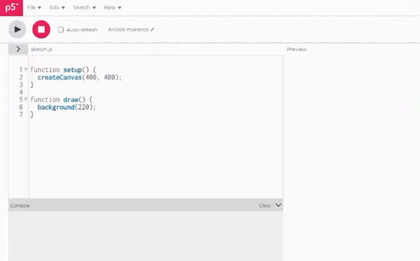

import EditableSketch from "../../../components/EditableSketch/index.astro";
import Callout from "../../../components/Callout/index.astro";

In the [previous tutorial](/tutorials/creating-styling-html), you learned how to set up and style HTML elements and built a GameBoy emulator, which prepared the foundation for your snake game. In this tutorial, you will explore how to help users interact with the GameBoy during gameplay. Our primary focus will be user inputs and creating buttons to control a game.


## Prerequisites

- [Creating and Styling HTML](/tutorials/creating-styling-html) and its prerequisites.
- [GameBoy emulator starter code](https://editor.p5js.org/ruthikegah/sketches/hRV_rPHC2)


### Step 1 – Create and style your buttons

Start with a completed GameBoy emulator from the [Creating and Styling HTML](/tutorials/creating-styling-html) tutorial. You can duplicate [this example](https://editor.p5js.org/ruthikegah/sketches/hRV_rPHC2) if needed. 

To create buttons in p5.js, you will use [`createButton()`](/reference/p5/createButton), which creates an HTML button element. You can program buttons to respond to user input, such as mouse clicks, becomes easier. This function lets you easily add buttons to your project without writing complex code and allows users to interact with your program and see changes as a result.

Syntax for creating a button element and storing it as a variable:

```js
createButton(label);
```

Example of a simple button labeled “click me”:

```js
function setup() {
  createCanvas(400, 300);

  // Create a simple button
  let button = createButton('click me');
}
```

Add the following code in `setup()` under the arrow buttons container: 

```js
// ... previous code

// Create an up button
let upButton = createButton('▲');
// Set its ID
upButton.id('up');
// Set its styles
upButton.style('color', 'white');
upButton.style('background-color', 'red');
upButton.style('width', '40px');
upButton.style('height', '40px');
upButton.style('margin-bottom', '10px');
upButton.style('border-radius', '5px');

arrowButtons.child(upButton);
```

In this step, you create a button that will enable the user to interact with the GameBoy during gameplay. Each button is assigned a variable that is used to style the button, and is set as a child to the arrow button container div element in the HTML. `.id()` is used to assign the button the ID `up`, `.style()` is used to set properties like color, size, and spacing, and `.child()` is used to add the button as a child to the arrow buttons container.

The `upButton` variable refers to a button in the `p5.Element` class, similar to the `<div>` elements created in the previous tutorial. Here, you use the variable name to give the button an id using the `.id()` method, styling using the `.style()` method, and adding it as a child to another element using the `.child()` method. Here you styled the button by setting properties like `background-color`, `color`, `font-size`, and spacing. Refer to [the previous](/tutorials/creating-styling-html) tutorial for the syntax for each method. Similarly, add the left, right, and down buttons to their appropriate containers and style them by adding code to `setup()`. 

Add the left, right, and down buttons to `setup()` under the code for the `leftRightContainer `using the following code:

```js
//...previous code up to leftRightContainer
arrowButtons.child(leftRightContainer);

// Create the left button
let leftButton = createButton('◀');
// Set its ID
leftButton.id('left');
// Set its styles
leftButton.style('color', 'white');
leftButton.style('background-color', 'red');
leftButton.style('width', '40px');
leftButton.style('height', '40px');
leftButton.style('margin-right', '30px');
leftButton.style('border-radius', '5px');
// Add it to the leftRightContainer
leftRightContainer.child(leftButton);

// Create the right button
let rightButton = createButton('▶');
// Set its ID
rightButton.id('right');
// Set its styles
rightButton.style('color', 'white');
rightButton.style('background-color', 'red');
rightButton.style('width', '40px');
rightButton.style('height', '40px');
rightButton.style('margin-left', '5px');
rightButton.style('border-radius', '5px');
// Add it to the leftRightContainer
leftRightContainer.child(rightButton);

// Create the down button
let downButton = createButton('▼');
arrowButtons.child(downButton);
// Set its ID
downButton.id('down');
// Set its styles
downButton.style('color', 'white');
downButton.style('background-color', 'red');
downButton.style('width', '40px');
downButton.style('height', '40px');
downButton.style('margin-top', '10px');
downButton.style('border-radius', '5px');
```

Above, you create the rest of the directional buttons. They interact with the GameBoy during gameplay. You use p5.js `createButton()` to make the button. Then, assign it an ID with `.id()`, give it style with `.style()`. For the styling, you give all the buttons a white color, a red background color, a height, a width of `40px` each, and a `border-radius` of `5px`.

<Callout title="Note">
Adjust the margins to achieve good spacing between the buttons.
</Callout>

Add the play and pause buttons to `setup()` under the code for the `actionButtons` using the following code:

```js
//... code in setup up to actionButtons

// Create the play button
let playButton = createButton('▶');
actionButtons.child(playButton);
// Set its ID
playButton.id('play');
// Set its styles
playButton.style('background-color', 'blue');
playButton.style('color', 'white');
playButton.style('width', '60px');
playButton.style('height', '60px');
playButton.style('font-size', '24px');
// Make it a circle
playButton.style('border-radius', '50%');
// Add spacing
playButton.style('margin-right', '10px');

// Create the pause button
let pauseButton = createButton('❚❚');
// Set its ID
pauseButton.id('pause');
// Set its styles
pauseButton.style('background-color', 'blue');
pauseButton.style('color', 'white');
pauseButton.style('width', '60px');
pauseButton.style('height', '60px');
pauseButton.style('font-size', '24px');
 // Make it a circle
pauseButton.style('border-radius', '50%');
actionButtons.child(pauseButton);
```

Likewise, for the action buttons (play and pause buttons), you create buttons and give them an id. Then, you add the buttons to their parent container, `actionButtons`. For the styling, you give it the color white and a blue background. You also set the width and height to `60px`, set `font-size` to `24px`, and set `border-radius` to `50%` to make them circles.

<Callout title="Note">
Add a margin to one of the buttons to get the desired, appropriate spacing. 
</Callout>

![A graphical representation of a classic handheld gaming device, reminiscent of a GameBoy. The screen area is large and dark, indicating it's switched off or in a standby mode, with a score display reading "Score: 0" at the top right corner. Below the screen is the label "GameBoy." It is in bold, blue text over a gray background. The device has a set of red arrow-shaped buttons on the left. They form a directional pad. On the right are two blue round buttons. They have the play and pause symbols. All the buttons are on a dark gray body. The image has a simple and clean aesthetic, capturing the essence of retro gaming hardware.](../images/web-design/gameboy-buttons.png)

<Callout>
Add more styles to your buttons to make them look how else you would like. Check out this [Resource](https://developer.mozilla.org/en-US/docs/Web/CSS/Reference) for more CSS properties.
</Callout>


### Step 2 – Implement logic for your snake game

Time to create the logic for your snake game with the snake logic, food logic, and game behavior logic. To ensure your code is not bulky, create another file for this part. 

On the top left of the p5.js Web Editor, in Sketch Files, click on the + icon and select Create File. Name your file `snakeGame.js` and click Add file.



Link your new JavaScript file by adding a new` <script>` tag in the `<head>` of the `index.html` file under the `<script>` tag for the `sketch.js` file:

```html
<script src="snakeGame.js"></script>
```

In the `snakeGame.js` file, begin by declaring the variables you will be using in your game logic. These variables will store essential information about the game state, player score, and user input. Declaring them at the beginning makes the code more organized and easier to break down and maintain. These variables will be used as parameters to define the game’s initial conditions. Add the following code to the `snakeGame.js` file:

```js
let cols = 20;
let rows = 15;
let gridSize = 20;
let winWidth = cols * gridSize;
let winHeight = rows * gridSize;
let food = { x: 0, y: 0 };
let snake = {
  x: 0,
  y: 0,
  xSpeed: 0,
  ySpeed: 0,
  body: [],
};
let score = 0;
let gamePaused = false;
let gameOver = false;
let gameStarted = false;
let fps = 5;
```

- The `cols` and `rows` variables represent the columns and rows of a grid that will determine size and dimension of the game window.
- The `gridSize` variable represents the size of each grid cell. It defines the width and height of each cell, influencing the overall layout and scale of the game.
- The `winWidth` and `winHeight` variables calculate the total width and height of the game window based on the number of columns (`cols`), rows (`rows`), and the size of each grid cell (`gridSize`). They set the dimensions of the canvas or game window.
- The food variable is stored as a JavaScript object that represents the current position of the food in the game. It has x and y properties to store the coordinates where the food should be placed. Refer to the [Data Structure Garden](/tutorials/data-structure-garden) tutorial to review JavaScript objects.
- The snake variable is an object that contains information about the snake in the game. It includes the current position (`x` and `y`), the speed of movement in the x and y directions (`xSpeed` and `ySpeed`), and an array (`body`) to store the segments of the snake’s body. Refer to the [Data Structure Garden](/tutorials/data-structure-garden) tutorial to review arrays.
- The `score` variable keeps track of the player’s score in the game. It is incremented each time the snake eats the food.
- The `gamePaused`, `gameOver`, and `gameStarted` variables have boolean values representing the game’s state. They are initially set to `false`. Refer to the [Repeating with Loops](/tutorials/repeating-with-loops) tutorial to review state variables.
- The `fps` variable defines the frames per second for the game loop. It determines the speed at which the game (drawing) updates and renders.

Next, write functions that handle the food behavior in your game. Add the following code to your `snakeGame.js` file:

```js
//...code from previous step

// Draw the food as
// a red square.
function drawFood() {
  let x = food.x * gridSize;
  let y = food.y * gridSize;
  fill(255, 255, 0);
  square(x, y, gridSize);
}

// Move the food to a
// random location.
function moveFood() {
  food.x = floor(random(cols));
  food.y = floor(random(rows));
}
```

- The `drawFood()` function handles the pixel positions for the food:
  - `let x = food.x * gridSize;` and `let y = food.y * gridSize;` statements convert the food’s grid position to pixel coordinates. 
  - It sets the color to yellow and draws a square representing the food.
- The `moveFood()` function generates random grid positions for the next food and updates its x and y coordinates. The [`floor()`](/reference/p5/floor) function ensures the random value is a whole number.

Refer to the [Organizing Code with Functions](/tutorials/organizing-code-with-functions) tutorial to review the syntax and use of custom functions. 

Together, these functions handle the visual representation and movement of the food in the game. The grid-based approach ensures the food aligns with the game’s grid system on the screen.

Finally, write functions that create and control the snake’s behavior. Add the following code in your `snakeGame.js` file:

```js
//...code from previous step

// Reset the snake's data.
function resetSnake() {
  // Start at the center.
  snake.x = floor(cols / 2);
  snake.y = floor(rows / 2);

  // Move to the right.
  snake.xSpeed = 1;
  snake.ySpeed = 0;

  // Add an array to manage
  // the body.
  snake.body = [];
 
  // Create a head segment.
  let head = {
    x: snake.x,
    y: snake.y,
  };
 
  // Add the head to the body.
  snake.body.push(head);
}

// End the game when the
// snake collides with an edge.
function checkEdges() {
  // Right edge.
  if (snake.x === cols) {
    gameOver = true;
    return;
  }
  // Left edge.
  if (snake.x === -1) {
    gameOver = true;
    return;
  }
  // Top edge.
  if (snake.y === -1) {
    gameOver = true;
    return;
  }
  // Bottom edge.
  if (snake.y === rows) {
    gameOver = true;
    return;
  }
}

// Move the snake forward.
function moveSnake() {
  snake.x = + snake.xSpeed;
  snake.y = + snake.ySpeed;
}

// Update the positions of the
// snake's body segments.
function updateBody() {
  // Update the end of the tail.
  for (let i = snake.body.length - 1; i > 0; i -= 1) {
    snake.body[i].x = snake.body[i - 1].x;
    snake.body[i].y = snake.body[i - 1].y;
  }
 
  // Update the head.
  snake.body[0].x = snake.x;
  snake.body[0].y = snake.y;
}

// Draw the snake.
function drawSnake() {
  fill(0, 255, 0);
  for (let segment of snake.body) {
    let x = segment.x * gridSize;
    let y = segment.y * gridSize;
    square(x, y, gridSize);
  }
}

// Update the snake's movement.
function changeDir(xSpeed, ySpeed) {
  snake.xSpeed = xSpeed;
  snake.ySpeed = ySpeed;
}

// Manage the snake's diet.
function checkFood() {
  if (snake.x === food.x && snake.y === food.y) {
    // Add a new body segment.
    let segment = { x: -1, y: -1 };
    snake.body.push(segment);
   
    // Update the score.
    score += 10;
   
    // Place the food in a
    // random location.
    moveFood();
  }
}

// End the game if the snake
// collides with its tail.
function checkSelf() {
  for (let i = 1; i < snake.body.length; i += 1) {
    let segment = snake.body[i];
    if (snake.x === segment.x && snake.y === segment.y) {
      gameOver = true;
      return;
    }
  }
}
```

- The `resetSnake()` function resets the snake to its initial state at the center of the grid:
  - The `snake.x = floor(cols/2);` and `snake.y = floor(rows/2);` statements calculate the x and y starting positions for the snake and find the center columns and row; `floor()` ensures it’s a whole number because the calculation doesn’t support a decimal value. 
  - It sets the initial direction to the right  with `snake.xSpeed = 1` and `snake.ySpeed = 0`, 
  - It creates an empty array to manage the snake’s body, creates a head segment with the current position, and adds it to the body array.

The `checkEdges()` function uses [if-statements](/reference/p5/if-else) to check if the snake has reached the right edge (`cols`), if the snake has reached the left edge (`-1`), if the snake has reached the top edge (`-1`), and if the snake has reached the bottom edge (`rows`). Whenever any of the conditions are met, it sets `gameOver` to `true`. This creates the rule in the game where if the snake reaches any edge, the game is over. The `moveSnake()` function updates the snake’s position based on its current speed. It updates the x and y positions by adding its `xSpeed` and `ySpeed`, respectively. Refer to the [Conditions and Interactivity](/tutorials/conditions-and-interactivity) tutorial to review the syntax for if-statements and updating variables.

- The `updateBody()` function updates the positions of the snake’s body segments. It does this by iterating through the snake `body` array starting from the end, updating each body segment’s position to match the position of the segment in front of it. Then it updates the head’s position to the snake’s current position. Refer to the [Repeating with Loops](/tutorials/repeating-with-loops) tutorial to review the syntax for loops and iteration.
- The `drawSnake()` function renders the snake on the canvas. It sets the color to green, iterates through each body segment, and draws a square on the canvas at its position.
- The `changeDir(xSpeed, ySpeed)` function passes in two parameters, `xSpeed` and `ySpeed`. It sets the snake’s `xSpeed` (x-axis movement) to the `xSpeed` parameter and the snake’s `ySpeed` (y-axis movement) to the `ySpeed` parameter, which changes the snake’s movement. Refer to the [Organizing Code with Functions](/tutorials/organizing-code-with-functions) tutorial to review functions, arguments and parameters.
- The `checkFood()` function checks for a match between the snake's and the food's positions, indicating the snake has eaten the food. Upon confirmation, it employs the `.push()` method to add a new segment with initial coordinates `{ x: -1, y: -1 }` to the snake's body array. This use of `.push()` adds to the array, making the snake longer. The segment `{ x: -1, y: -1 }` is a temporary off-grid placeholder. It stops the new segment from appearing in the play area at random before the game sets its position in the next snake body update (`updateBody()`). Additionally, the game increases the score by 10 and calls the `moveFood()` function to relocate the food.
- The `checkSelf()` function checks if the snake has collided with its own body. It iterates through the snake’s body segments (excluding the head), checks if the head’s position matches any body segment’s position, and if it is true, it sets `gameOver` to `true`. This adds the rule in the game where if the user crashes the snake into its own body, the game will be over.

These functions collectively handle various aspects of the snake game, including resetting the snake, checking collisions, updating the snake’s body, rendering the snake, and managing its interactions with food and itself. Your project should look like [this](https://editor.p5js.org/Msqcoding/sketches/7Hj2OCHyz).

<Callout>
Add a function for bonus food after every 5 food eats. **Hint:** Create a new variable for bonus food, modify the `checkFood()` function to handle bonus food, and then create the function for the bonus food.

[Solution.](https://editor.p5js.org/ruthikegah/sketches/Di7cPimzs)
</Callout>


### Step 3 – Write functions for button controls

You can also create functions for your game controls. In your `snakeGame.js` file, add the following code:

```js
// Directions: up, down, left, right.
function goUp() {
  snake.xSpeed = 0;
  snake.ySpeed = -1;
}
function goDown() {
  snake.xSpeed = 0;
  snake.ySpeed = 1;
}
function goLeft() {
  snake.xSpeed = -1;
  snake.ySpeed = 0;
}
function goRight() {
  snake.xSpeed = 1;
  snake.ySpeed = 0;
}
```

- The `goUp()` function sets the snake’s motion to move upward. It updates the `xSpeed` to 0 (no horizontal movement) and `ySpeed` to -1 (move upward on the y-axis).
- Similarly, the `goDown()` function sets the snake’s motion to move downward. It updates the `xSpeed` to 0 (move downward on the x-axis) and `ySpeed` to 1.
- The `goLeft()` function sets the snake’s motion to move to the left. It updates the `xSpeed` to -1 (move left on the x-axis) and `ySpeed` to 0.
- Similarly, the `goRight()` function sets the snake’s motion to move to the right. It updates the `xSpeed` to 1 (move right on the x-axis) and `ySpeed` to 0.

Next, write functions for arrow button clicks to enable you to control the direction actions with your keyboard arrow keys using the [`keyPressed()`](/reference/p5/keyPressed) function. Write the following code in your `snakeGame.js` file:

```js
function keyPressed() {
  if (keyCode === UP_ARROW) {
    goUp();
  }
  if (keyCode === DOWN_ARROW) {
    goDown();
  }
  if (keyCode === LEFT_ARROW) {
    goLeft();
  }
  if (keyCode === RIGHT_ARROW) {
    goRight();
  }
}
```

The `keyPressed()` function is a built-in p5.js function that gets called whenever a key is pressed. It checks the built in variable `keyCode`, which stores the value of the last key that was pressed on your keyboard, and calls the corresponding direction function (for example:  `goUp()`) based on the arrow key the user pressed.

Here is a simple illustration of the `keyPressed()` function. Click into the preview and then try pressing keys:

<EditableSketch code={`
//Variable for red, green and blue set to 0
let r, g, b = 0;

function setup(){
  createCanvas(400,200);
}

function draw(){
  background(r,g,b);
}

function keyPressed(){
  // Change the background color to a random color when any key is pressed
  r = random(255);
  g = random(255);
  b = random(255);
}
`} />

Next, define functions that handle the pause and play actions. Write the following code in your `snakeGame.js` file:

```js
//...code from previous step
function startGame() {
  score = 0;
  gameStarted = true;
  gamePaused = false;
  if (gameOver === true) {
    resetSnake();
    gameOver = false;
  }
  loop();
}

// Pause the game.
function pauseGame() {
  gamePaused = true;
}
```

The `startGame()` function begins or restarts the game. It sets the score to 0, marks the game as started by updating `gameStarted` and `gamePaused`. It checks if the game is over, resets the snake, and updates `gameOver` to false so the game can begin again. `loop();` is called to restart the game loop.

Finally, call these functions when the button elements are clicked using your buttons with `p5.Element`’s [`mouseClicked()`](/reference/p5.Element/mouseClicked) method for mouse clicks. For example, in your `sketch.js` file, under your `upButton`, add this block of code:

```js
upButton.mouseClicked(goUp);
```

The `.mouseClicked()` method sets a function to call when the mouse is clicked over a specific element (in this case, the `upButton`). Pass in your control functions as its argument. It works like the `keyPressed()` function but uses mouse clicks. When the button is clicked, it will execute the `goUp()` function. 

Call the function under each button like this:

```js
button.mouseClicked(buttonFunction)
```

<Callout>
Update your `keyPressed()` function to add WASD keys for direction, too. W for up, A for left, S for down, and D for right.

[Solution.](https://editor.p5js.org/ruthikegah/sketches/YLUMrQGAc)
</Callout>


### Step 4 – Write functions for message prompts

You will need message prompts for the user interface and feedback aspects of the game. In your `snakeGame.js` file, write the following code:

```js
// Start message.
function displayStartMessage() {
  textSize(16);
  textAlign(CENTER);
  fill(255, 0, 0);
  text('Press ▶ to Start', width / 2, height / 2);
}

// End message.
function displayEndMessage() {
  background(0);
  textSize(50);
  textAlign(CENTER);
  fill(255, 0, 0);
  text('Game Over', width / 2, height / 2);
  textSize(14);
  text('Press ▶ to Start', width / 2, height / 2 + 50);
}
```

The `displayStartMessage()` function is called when the game hasn’t started, prompting the player to press the play button, while the `displayEndMessage()` function is called when the game is over, displaying a “Game Over” message along with an instruction to restart the game.

<Callout>
Update the `displayEndMessage()` function to add your score when you die.

[Solution.](https://editor.p5js.org/ruthikegah/sketches/7x_6PA_hX)
</Callout>


### Step 5 – Implement your game logic in your sketch

Your game logic and functions are done, but the game is not complete until you add them to your sketch. First, start with actions crucial for setting up the game’s initial state before it starts running. These actions are the framerate, the initializing of the snake, and the initial position of the food. In your `sketch.js` file, at the bottom of your `setup()` function, write the following blocks of code:

```js
// Sets the framerate of the screen
frameRate(fps);
// Move the food to a
// random location.
moveFood();

// Reset the snake.
resetSnake();
```

This action calls your `moveFood()` function, which randomly repositions the food on the canvas. It also calls your `resetSnake()` function, which resets the snake. 

The [`frameRate()`](/reference/p5/frameRate) function sets the number of frames to draw per second. Pass in your `fps` variable as its value.

Finally, implement the rest of your game logic in your draw function. In your `sketch.js` file, inside your `draw()` function, write the following code:

```js
// Skip the rest of the draw function
// if the game hasn't started.
if (gameStarted === false) {
  displayStartMessage();
  return;
}
// Update the game state.
// print(`${snake.x}, ${snake.y}`);
if (gamePaused === false) {
  moveSnake();
  checkEdges();
  checkSelf();
  checkFood();
  updateBody();
}

// Draw the snake and its food.
drawFood();
drawSnake();

// Skip the rest of the draw function
// if the game has ended.
if (gameOver === true) {
  displayEndMessage();
  noLoop();
}
 
// Update the score.
textAlign(RIGHT);
fill(255);
text(`Score: ${score}`, width - 10, 20);
```

- The code checks if the game has not started (`gameStarted === false`). If the game hasn’t started, it calls the `displayStartMessage` function (presumably to show a start message) and then immediately exits the `draw()` function using return. This ensures that the rest of the `draw()` function is skipped if the game hasn’t started. 
- It updates the game state if the game is not paused (`gamePaused === false`). The functions `moveSnake()`, `checkEdges()`, `checkSelf()`, `checkFood()`, and `updateBody()` are called to handle the different aspects of the game logic, such as moving the snake, checking for collisions, handling food consumption, and updating the snake’s body.
- It calls functions `drawFood()` and `drawSnake()` to visually render the food and the snake on the canvas.
- It checks if the game has ended (`gameOver === true`). If the game is over, it calls the `displayEndMessage();` function, then stops the draw loop using `noLoop()`, which ensures that after the game is over, no further updates or rendering occur.
- Finally, it updates and displays the score on the canvas. The score is positioned at the top-right corner of the canvas using `textAlign(RIGHT)` and ``text(`Score: ${score}`, width - 10, 20)``.

This code structure handles different aspects of the game effectively. It ensures the start, update, draw, and end are managed based on the game state. The game state includes not started, not paused, and game over. The game’s logic is encapsulated in functions, promoting readability and maintainability. The `draw()` function is the main loop responsible for continuously updating and rendering the game based on its state.

Here is how the gameplay should look:


Good job, you have successfully created your very own snake game! You have accomplished something impressive. 

Buttons are a useful type of input, but there are many more for you to explore. Check out the [DOM section](/reference#DOM) of the p5.js Reference to see how other inputs work. 

<Callout>
Using the `createButton(), `make a sketch with a button that changes the color of your canvas.

[Solution.](https://editor.p5js.org/ruthikegah/sketches/3Hof7d-xE)
</Callout>


### Conclusion

Congratulations on finishing this tutorial. Mastering input responses in p5.js is a key step in adding interactivity to your web projects. In this tutorial, you have thoroughly explored how to make responsive buttons. You also bound them with functions before finally putting together the classic logic of a snake game. By integrating these elements, you not only enhanced our coding repertoire but also took a nostalgic concept and breathed new life into it with modern web technology. The skills you've honed here will serve as a robust foundation for developing even more intricate and engaging interactive applications. 

Here is the [complete Responding to Inputs code](https://editor.p5js.org/ruthikegah/sketches/TKoGPLJfe) for reference.


### Next steps

- [Loading and selecting fonts](/tutorials/loading-and-selecting-fonts)


### References

- [Functions on MDN](https://developer.mozilla.org/en-US/docs/Web/JavaScript/Guide/Functions)
- [Organizing Code with Functions Tutorial](/tutorials/organizing-code-with-functions)
