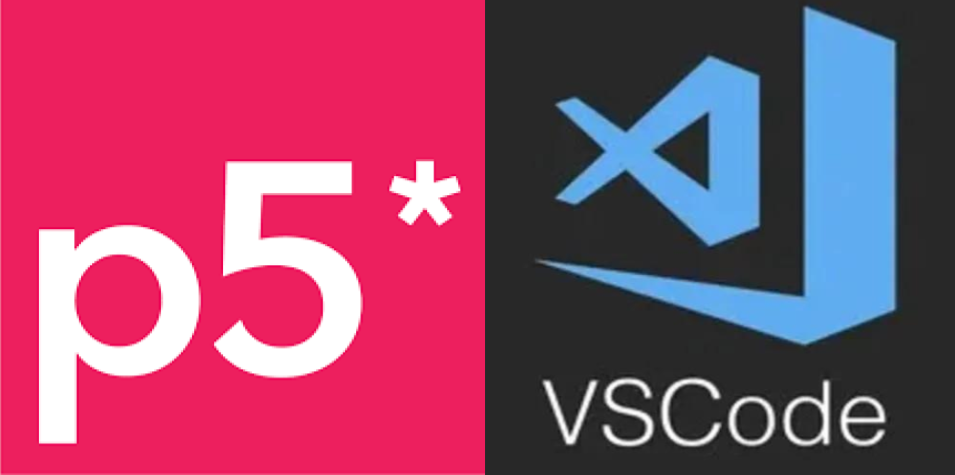
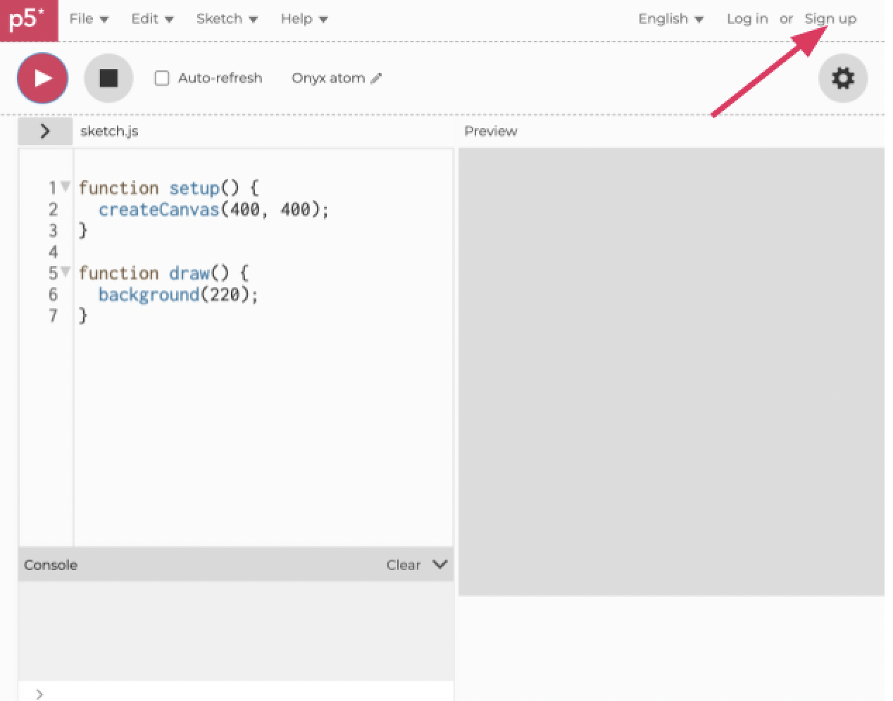
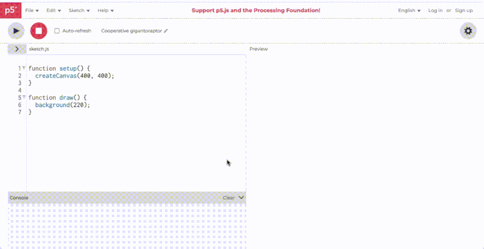
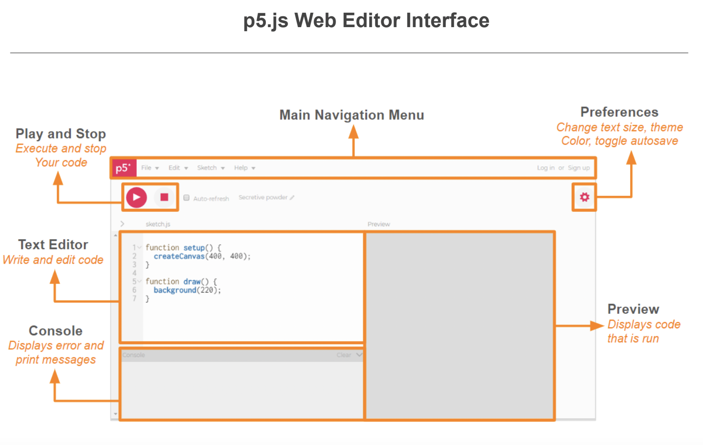
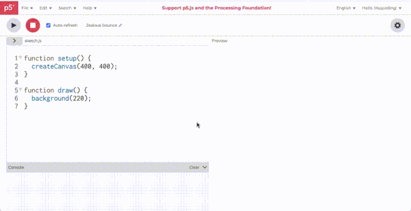
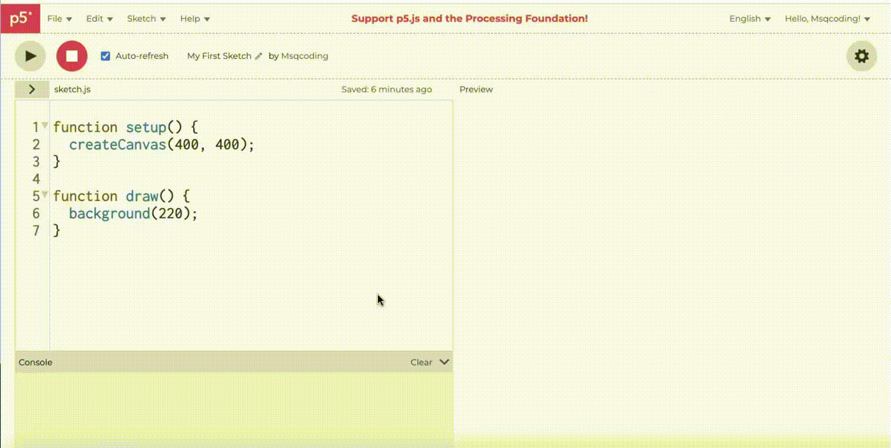

import EditableSketch from "../../../components/EditableSketch/index.astro";
import Callout from "../../../components/Callout/index.astro";




## Introduction

To begin writing code using [p5.js](/reference/), you need to set up the coding environment you will use to write and save your programs. In this guide, you will:

1. Set up your coding environment on the web using the [p5.js Web Editor](https://editor.p5js.org/), or on your computer using [Visual Studio Code (VS Code).](https://code.visualstudio.com/)
2. Use the [p5.js reference](/reference/) to help you write your first simple program using shapes and color.
3. Save and share your code.


## What you will need

1. Access to the internet and a desktop browser such as:
   - [Chrome](https://www.google.com/chrome/dr/download/?brand=SJWC\&geo=US\&gclid=Cj0KCQjw-pyqBhDmARIsAKd9XIM88u9RUlUagd7fpeqWx3AL_8VbhoIFULSME9tiz87t00L64-wLAlMaAm_QEALw_wcB\&gclsrc=aw.ds)
   - [Firefox](https://www.mozilla.org/en-US/firefox/)
   - [Safari](https://www.apple.com/safari/)
   - [Edge](https://www.microsoft.com/en-us/edge?ep=193\&form=MA13L2\&es=40)
2. A desktop computer, laptop, or chromebook


## Step 0: Choose the type of coding environment 

You can begin your coding journey with [p5.js](/reference/) using the [p5.js Web Editor](https://editor.p5js.org/) or [VS Code](https://code.visualstudio.com/). 

The [p5.js Web Editor](https://editor.p5js.org/) is a website where programmers can write, test, share, or remix p5.js programs without needing to download or configure a *code editor* on a computer. A *code editor* makes writing and reading code easier by organizing and coloring text in a way that helps programmers see different parts of the code.

[VS Code](https://code.visualstudio.com/) is a popular code editor you install on your computer that provides a more advanced coding experience. Depending on your needs, choose the coding environment that is best for you.

- [Link to p5.js Web Editor how-to](#web-editor)
- [Link to VS Code how-to](#vscode)

If you are new to p5.js, start with the [p5.js Web Editor](https://editor.p5js.org/)!


## Using the p5.js Web Editor<a id="web-editor"></a>

### Step 1: Open the [p5.js Web Editor](https://editor.p5js.org/) sign-up page

- Open a desktop browser on your computer and go to [https://editor.p5js.org/](https://editor.p5js.org/).
- Click the [“Sign up”](https://editor.p5js.org/signup) link on the top-right of the web page.




### Step 2: Create an account with [p5.js Web Editor](https://editor.p5js.org/)

- Once on the [sign-up page](https://editor.p5js.org/signup), create an account on the [p5.js Web Editor](https://editor.p5js.org/) using one of the following options:
- Manual sign-up
  - Create a username.
  - Enter your email address.
  - Create and confirm a password. 
  - Click the “Sign Up” button.



- Using a Google account
  - Click on the button on the bottom of the page that says “Login with Google.” 


- Follow the prompts to enter your email and password for your Google account (if necessary). 
- Using a Github account
  - Click on the button on the bottom of the page that says “Login with GitHub.” 


- Follow the prompts to enter your username and password for GitHub.
- Authorize the [p5.js Web Editor](https://editor.p5js.org/) to access your GitHub details by clicking the “Authorize processing” button.


### Step 3: Explore the [p5.js Web Editor](https://editor.p5js.org/)

The [p5.js Web Editor](https://editor.p5js.org/) is an online environment where programmers can write and test their p5.js code. Explore the different elements of the [p5.js Web Editor](https://editor.p5js.org/) and their functions. 

The following diagram labels and describes each element of the editor’s interface:




### Step 4: Name, save, and run your first sketch

- Name your projects by clicking on the pencil icon above the text editor and typing in a name for your project.
- Save projects by clicking on *File* in the top toolbar, and selecting *Save*. 
  - Make sure you are logged in to your account or you will not be able to save the sketch.
  - Saving projects frequently helps to ensure that code isn’t lost if something happens to your computer, browser, or internet connection while you are coding.



To view the output of your code, click the *Play* button in the top left corner: 



A *p5.js sketch* is a text file with code written in the *JavaScript* programming language. *JavaScript* is a programming language used to make web pages interactive. p5.js is a library written in *JavaScript* – which is why it ends in “*.js*” for *JavaScript*. With p5.js, you can create programs that are colorful and animated, with features that users can interact with! To learn more about some of the things you can do with p5.js, watch the [p5.js Welcome Video!](https://hello.p5js.org/) To learn more about JavaScript, you can visit [this resource.](https://developer.mozilla.org/en-US/docs/Web/JavaScript)

The editor begins with the following code in the *sketch.js* file:

```js
function setup() {
  createCanvas(400, 400);
}
function draw() {
  background(220);
}
```

The code above creates a canvas element in the preview that is 400 pixels wide and 400 pixels high. It also sets the background to a shade of gray. 


#### `createCanvas()`

Computer screens are made up of tiny lights called *pixels*, which are the smallest elements that make up any image. The line of code that creates a canvas in the preview window is [`createCanvas(400, 400)`](/reference/p5/createCanvas). Without this line of code, there will be no canvas to draw on! The numbers 400, 400 correspond to the width and the height of the canvas in pixels. These numbers are also known as *arguments* for the [`createCanvas()`](/reference/p5/createCanvas) function. 

Any values that you place within parentheses of a function are called *arguments*: any value used to customize functions. [`createCanvas()`](/reference/p5/createCanvas) appears within the [`setup()`](/reference/p5/setup) function to create an HTML canvas element that you can draw on. 

To learn more, visit the [p5.js reference](/reference) pages for [`setup()`](/reference/p5/setup) and [`createCanvas()`](/reference/p5/createCanvas).


### Step 5: Change the color of the canvas

- You can type commands for any sketch in the text editor, and view the output of your code in the preview window by clicking *Play*. 
- Change the background color of your canvas by changing the *argument* for the [`background()`](/reference/p5/background) function. 
  - Change `background(220);` to `background("aqua");` and press *Play*.

```js
function setup() {
  createCanvas(400, 400);
}
function draw() {
  background("aqua");
}
```


#### `background()`

The `background()` function colors the background a specific color. You can use words inside quotations or numbers to color the background of the canvas. To learn more, visit the [p5.js reference](/reference) pages for [`background()`](/reference/p5/background) & [color](/reference/p5/color).


### Step 6: Draw shapes on the canvas

- Draw a circle on the canvas.
  - Add the following text under the [`background()`](/reference/p5/background) function:

    ```js
    //circle in the center with a width of 100
    circle(200,200,100);
    ```

- Click the *Play* button.

Your code should look like this:

```js
function setup() {
  createCanvas(400, 400);
}
function draw() {
  background(220);

  // Draw a circle in the center with
  // a width of 100.
  circle(200, 200, 100);
}
```

#### `draw()`

You can draw shapes on the canvas by typing specific commands for shapes within the curly brackets `{}` after [`function draw()`](/reference/p5/draw). 

The sketch above draws a circle on the canvas by calling the [`circle()`](/reference/p5/circle) function within [`draw()`](/reference/p5/draw). The first two *arguments –* `200, 200` – place the circle in the center of the canvas, and the last *argument* – `100` – indicates that the circle is 100 pixels wide. The comments embedded in the sketch in the lines above the [`circle()`](/reference/p5/circle)` `function describe what the code does. To learn more, visit the [p5.js reference](/reference/) pages for [`draw()`](/reference/p5/draw) and [`circle()`](/reference/p5/circle).


### Step 7: Create!

p5.js has many functions you can use to incorporate both static and interactive elements in your canvas. 

- Replace the background and circle commands with the following text:

  ```js
  //when mouse button is pressed, circles turn black
  if (mouseIsPressed === true) {
    fill(0);
  } else {
    fill(255);
  }

  //white circles drawn at mouse position
  circle(mouseX, mouseY, 100);
  ```

Your code should look like this:

<EditableSketch code={`
function setup() {
  createCanvas(400, 400);
}
function draw() {
  //when mouse button is pressed, circles turn black
  if (mouseIsPressed === true) {
    fill(0);
  } else {
    fill(255);
  }

  //white circles drawn at mouse position
  circle(mouseX, mouseY, 100);
}
`} />

<Callout>
Press and hold the mouse button as you drag the mouse pointer over the canvas.
</Callout>


The code above draws white circles in the same position as the mouse pointer. When a mouse button is pressed, the circle’s color changes to black. 

Visit the [p5.js reference](/reference/) for more p5.js functions like [2D Primitive shapes](/reference/#Shape/). 


### Errors

It is easy to spell function names wrong or forget a comma. Syntax rules help the computer interpret code. When a “rule” is broken, an error message will appear in the console (for example, if [`circle()`](/reference/p5/circle) is spelled wrong). These errors are commonly referred to as “bugs.” The console displays messages from the editor with details about any mistakes you might have made. When your code does not execute correctly, there might be a bug in your code!

Visit the [Field Guide to Debugging](/tutorials/field-guide-to-debugging) for more information on how to fix errors in your code.


#### Accessibility Note:

If you are using a screen reader, you must turn on the accessible outputs in the [p5.js Web Editor](https://editor.p5js.org/) and add the accessibility library in your html. To learn more, visit our guide to [using the p5.js Web Editor with a screen reader.](/tutorials/p5js-with-screen-reader/)

### Step 8: Share Your Project

Once your project is saved, you can share it!

- Share projects by clicking *File* in the upper toolbar, selecting *Share*, and copying one of the links provided. You can share your projects in three different ways:
  - Embed: Add your p5.js sketch to a website or blog that uses html (does not show code).
  - Fullscreen: Share your project with a link (does not show code).
  - Edit: Share your project code in the p5.js editor with a link.


## Next steps: 

- Next Tutorial: [Get Started](/tutorials/get-started)
- Explore some [p5.js examples](/examples/)


## Resources:

- [p5.js Welcome Video](https://hello.p5js.org/)
- The Coding Train: [1.2: p5.js Web Editor - p5.js Tutorial](https://www.youtube.com/watch?v=MXs1cOlidWs)
- [p5.js reference page](/reference/)
- [Javascript - MDN reference](https://developer.mozilla.org/en-US/docs/Web/JavaScript)
- [Field Guide to Debugging](https://docs.google.com/document/d/1Uc5Uey4_UDgix6-O0ez-pcRD-FZQSOaRD9TAGZYzD6c/edit)
- [How to Use the p5.js Web Editor with a Screen Reader](/tutorials/p5js-with-screen-reader/)

---


## Using VS Code<a id="vscode"></a>

[VS Code](https://code.visualstudio.com/) offers a more advanced code editing experience compared to the Web Editor. We recommend this option if you’re already familiar with VS Code.


### Step 1: Download VS Code

- Download VS Code onto your device using [this link](https://code.visualstudio.com/download).
- Explore the features of VS Code and various setup options using [these resources](https://code.visualstudio.com/docs/getstarted/introvideos).


### Step 2: Install the p5.js library extension

- Open VS Code and navigate to the extensions manager on the left toolbar.
- Type [*p5.vscode*](https://marketplace.visualstudio.com/items?itemName=samplavigne.p5-vscode) in the search bar, select the extension, and click the install button.
- Familiarize yourself with details for this extension [here](https://github.com/antiboredom/p5.vscode/blob/master/README.md).


### Step 3: Create a p5.js project

- Click on *View* on the top toolbar and select Command Palette.
- Type *Create p5.js Project* in the search bar and select the folder on your machine in which you would like to save your project.


### Step 4: View your first sketch

To view the preview for your code:

- Right click on the *index.html* file in the *VSCODE* tab on the left Explorer panel.
- Select *Open Live Server*. 
- A window will open in your default browser with the output of your project.

A *p5.js sketch* is a text file with code written in the *JavaScript* programming language. *JavaScript* is a programming language used to make web pages interactive. p5.js is a library written in *JavaScript* – which is why it ends in “*.js*” for *JavaScript*. With p5.js, you can create programs that are colorful and animated, with features that users can interact with! To learn more about some of the things you can do with p5.js, watch the [p5.js Welcome Video!](https://hello.p5js.org/) To learn more about JavaScript, you can visit [this resource.](https://developer.mozilla.org/en-US/docs/Web/JavaScript)

The editor begins with the following code in the *sketch.js* file and preview:

<EditableSketch code={`
function setup() {
  createCanvas(400, 400);
}
function draw() {
  background(220);
}
`} />

The code above creates a canvas element in the preview that is 400 pixels wide and 400 pixels high. It also sets the background to a shade of gray. 


#### `createCanvas()`

Computer screens are made up of tiny lights called *pixels*, which are the smallest elements that make up any image. The line of code that creates a canvas in the preview window is [`createCanvas(400, 400)`](/reference/p5/createCanvas). Without this line of code, there will be no canvas to draw on! The numbers 400, 400 correspond to the width and the height of the canvas in pixels. These numbers are also known as *arguments* for the [`createCanvas()`](/reference/p5/createCanvas) function. 

Any values that you place within parentheses of a function are called *arguments*: any value used to customize functions. [`createCanvas()`](/reference/p5/createCanvas) appears within the [`setup()`](/reference/p5/setup) function to create an HTML canvas element that you can draw on. 

To learn more, visit the [p5.js reference](/reference/) pages for [`setup()`](/reference/p5/setup) & [`createCanvas()`](/reference/p5/createCanvas).


### Step 5: Change the color of the canvas

- Change the background color of your canvas by changing the *argument* for the [`background()`](/reference/p5/background) function. 
  - Change `background(220);` to `background("aqua");` and press *Play*.

Your code should look like this:

<EditableSketch code={`
function setup() {
  createCanvas(400, 400);
}
function draw() {
  background("aqua");
}
`} />


#### `background()`

The `background()` function colors the background a specific color. You can use words inside quotations or numbers to color the background of the canvas. To learn more, visit the [p5.js reference](/reference/) pages for [`background()`](/reference/p5/background) & [color](/reference/#Color).


### Step 6: Draw shapes on the canvas

- Draw a circle on the canvas.
  - Add the following text under the [`background()`](/reference/p5/background) function:

    ```js
    //circle in the center with a width of 100
    circle(200,200,100);
    ```

- Don’t forget to save your changes to update the preview window.

Your code should look like this:

<EditableSketch code={`
function setup() {
  createCanvas(400, 400);
}
function draw() {
  background(220);
  //circle in the center with a width of 100
  circle(200,200,100);
}
`} />


#### `draw()`

You can draw shapes on the canvas by typing specific commands for shapes within the curly brackets `{}` after [`function draw()`](/reference/p5/draw). 

The sketch above draws a circle on the canvas by calling the [`circle()`](/reference/p5/circle) function within [`draw()`](/reference/p5/draw). The first two *arguments* – `200, 200` – place the circle in the center of the canvas, and the last *argument* – `100` – indicates that the circle is 100 pixels wide. The comments embedded in the sketch in the lines above the [`circle()`](/reference/p5/circle)` `function describe what the code does. To learn more, visit the [p5.js reference](/reference/) pages for [`draw()`](/reference/p5/draw) and [`circle()`](/reference/p5/circle).


### Step 7: Create!

p5.js has many functions you can use to incorporate both static and interactive elements in your canvas. 

- Replace the circle command with the following text:

  ```js
  //when mouse button is pressed, circles turn black
  if (mouseIsPressed === true) {
    fill(0);
  } else {
    fill(255);
  }

  //white circles drawn at mouse position
  circle(mouseX, mouseY, 100);
  ```

Your code should look like this:

<EditableSketch code={`
function setup() {
  createCanvas(400, 400);
}
function draw() {
  background(220);
  //when mouse button is pressed, circles turn black
if (mouseIsPressed === true) {
    fill(0);
  } else {
    fill(255);
  }

 //white circles drawn at mouse position
  circle(mouseX, mouseY, 100);
}
`} />

<Callout>
Press and hold the mouse button as you drag the mouse pointer over the canvas.
</Callout>

The code above draws white circles in the same position as the mouse pointer. When a mouse button is pressed, the circle’s color changes to black. 

Visit the [p5.js reference](/reference/) for more p5.js functions, such as other shapes you can draw. 


### Errors

It is easy to spell function names wrong or forget a comma. Syntax rules help the computer interpret code. When a “rule” is broken (for example, if [`circle()`](/reference/p5/circle) is spelled wrong), a message will appear in the browser’s console. These errors are commonly referred to as bugs; when your code does not execute correctly, there might be a bug in your code! 

- Visit these resources for instructions on how to view the console in specific browsers: [Chrome](https://developer.chrome.com/docs/devtools/console/reference/) | [Firefox](https://firefox-source-docs.mozilla.org/devtools-user/web_console/) | [Safari](https://support.apple.com/guide/safari-developer/safari-developer-tools-overview-dev073038698/11.0/mac/10.13) | [Edge](https://learn.microsoft.com/en-us/microsoft-edge/devtools-guide-chromium/console/)
- Visit the [Field Guide to Debugging](https://docs.google.com/document/d/1Uc5Uey4_UDgix6-O0ez-pcRD-FZQSOaRD9TAGZYzD6c/edit) for more information on how to fix errors in your code.


### Accessibility note

If you are using a screen reader, use the [p5.js Web Editor](https://editor.p5js.org/) instead! To learn more, visit the “[How to Use the p5.js Web Editor with a Screen Reader](https://docs.google.com/document/u/0/d/1Q_leNn8lkeSUfAyq1jLQeLYq1h8pU9134QHNvMu4Tcw/edit)” resource.


## Next steps: 

- Next Tutorial: [Get Started](/tutorials/get-started)
- Explore some [p5.js examples](/examples/)


## Resources:

- [p5.js Welcome Video](https://hello.p5js.org/)
- The Coding Train: [1.2: p5.js Web Editor - p5.js Tutorial](https://www.youtube.com/watch?v=MXs1cOlidWs)
- [p5.js reference page](/reference/)
- [Javascript - MDN reference](https://developer.mozilla.org/en-US/docs/Web/JavaScript)
- [Field Guide to Debugging](https://docs.google.com/document/d/1Uc5Uey4_UDgix6-O0ez-pcRD-FZQSOaRD9TAGZYzD6c/edit)
- [p5.js with VSCode](https://www.youtube.com/watch?v=zMAnM9ly0a8) (video tutorial)
- [VSCode Overview](https://code.visualstudio.com/docs/getstarted/introvideos)
- [p5.vscode reference](https://github.com/antiboredom/p5.vscode/blob/master/README.md)
- Browser consoles in [Chrome](https://developer.chrome.com/docs/devtools/console/reference/) | [Firefox](https://firefox-source-docs.mozilla.org/devtools-user/web_console/) | [Safari](https://support.apple.com/guide/safari-developer/safari-developer-tools-overview-dev073038698/11.0/mac/10.13) | [Edge](https://learn.microsoft.com/en-us/microsoft-edge/devtools-guide-chromium/console/)
