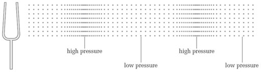

import Callout from "../../../components/Callout/index.astro";

## Introduction

[Music](https://www.britannica.com/art/music) is used by cultures around the world as a way to communicate their histories, emotions and experiences by combining vocal or instrumental [sounds](https://www.britannica.com/science/sound-physics). One of music's basic elements is a [*melody:*](https://www.masterclass.com/articles/music-101-what-is-melody) a group of musical notes that form compositions of sounds that are pleasing to hear.  In this tutorial you will explore how to use [`p5.Oscillator`](/reference/p5.Oscillator) objects to generate musical notes, and develop an web application where users create melodies, and play them back!

This tutorial is part 1 in a series of 3 tutorials that walk you through creating different versions of a melody app. 

- Part 1: In this tutorial you will develop a [simple melody app](https://editor.p5js.org/Msqcoding/sketches/w_4t5bFYe) where users can compose melodies from a musical scale, and play them back.  
- Part 2: In [Getting Started with Node.js](/tutorials/getting-started-with-nodejs), you will learn how to use [Node.js](https://nodejs.org/en/about) and [Express.js](https://expressjs.com/) to route [HTTP](https://developer.mozilla.org/en-US/docs/Web/HTTP) requests that retrieve and play melodies saved on your computer. 
- Part 3: In Melody App with Node.js (coming soon!), you will learn how to integrate your [simple melody app](https://editor.p5js.org/Msqcoding/sketches/w_4t5bFYe) with [Node.js](https://nodejs.org/en/about) and [Express.js](https://expressjs.com/). You will develop a more complex Melody App where users can heir melodies onto their computers, and retrieve them for playback later.


## Prerequisites

This tutorial requires:

- A computer with internet connection and speakers or headphones
- The [p5 Web Editor](https://editor.p5js.org/) (or an IDE and the most recent [p5.js library downloaded](https://p5js.org/download/))
- Understanding of basic programming concepts from [Introduction to p5.js tutorials](/tutorials/#introduction) such as:
  - variables
  - loading files
  - conditionals
  - arrays
  - for loops
  - JSON objects
- Understanding of basic web design principles introduced in the [Web Design tutorials](/tutorials/#web-design)
  - [p5.js DOM objects](/reference/#DOM)

**Note:** Sections 1.1 - 1.5 introduce concepts in other disciplines such as physics and music theory. These sections are resources for background knowledge recommended to understand how p5.Oscillator objects can be used to create melodies. Although it is highly recommended for you to review these section, it is not required to finish the [simple melody app.](https://editor.p5js.org/Msqcoding/sketches/w_4t5bFYe)

If you are already familiar with:

- [`p5.Oscillator` objects](#p5-oscillator-objects)
- [sound waves](#sound-waves)
- [pressure waves](#pressure-waves)
- [periodic waves and their characteristics](#periodic-wave-characteristics)
- [musical notes (frequency, pitch, and amplitude)](#musical-notes)

Skip to [Play musical notes with oscillators](https://docs.google.com/document/d/1mzJv-7qU1_CmkWI0ZFeqf3CeBfpOOVIrvPRZtxqFxRI/edit#heading=h.xqocsbtmp68w) to bypass background knowledge.


## Oscillators, science & music background information

### p5.Oscillator objects<a id="p5-oscillator-objects"></a>

[`p5.Oscillator`](/reference/p5.Oscillator) objects hold information to generate electrical signals called [oscillators ](https://www.techtarget.com/whatis/definition/oscillator)that can play [musical notes](https://www.simplifyingtheory.com/music-note/). These signals change between a minimum and maximum value in a pattern that repeats at a specific rate. When the signal is played through your speakers, we can hear that it generates a sound!

To understand how oscillators generate musical notes, we can dive into some science behind [sound](https://www.britannica.com/science/sound-physics).


##### Note

In the next section, [Science of sound and music](https://docs.google.com/document/d/1mzJv-7qU1_CmkWI0ZFeqf3CeBfpOOVIrvPRZtxqFxRI/edit#bookmark=id.xmj3wil8257x), the following concepts are introduced:

- [Sound as a pressure waves](https://www.physicsclassroom.com/class/sound/u11l1c.cfm)
- [Periodic wave characteristics](https://docs.google.com/document/d/1mzJv-7qU1_CmkWI0ZFeqf3CeBfpOOVIrvPRZtxqFxRI/edit#heading=h.p80snea79dfs)
- [Sound waves](https://www.open.edu/openlearn/science-maths-technology/engineering-technology/sound-music-technology-an-introduction/content-section-2.3) in relation to musical notes
  - [Pitch and frequency](https://www.physicsclassroom.com/class/sound/Lesson-2/Pitch-and-Frequency)
- Music Theory concepts such a [melodies](https://www.masterclass.com/articles/music-101-what-is-melody), [musical notes & frequency](https://www.idrumtune.com/ultimate-guide-to-musical-frequencies/) 


##### Skip ahead 

If you are already familiar with the background concepts above, jump over to the [Building a melody app](https://docs.google.com/document/d/1mzJv-7qU1_CmkWI0ZFeqf3CeBfpOOVIrvPRZtxqFxRI/edit#heading=h.xqocsbtmp68w) section to begin your project! 


## Science of sound & music 

[Melodies](https://www.masterclass.com/articles/music-101-what-is-melody) are a collection of [musical notes](https://www.simplifyingtheory.com/music-note/) that form [sounds](https://www.britannica.com/science/sound-physics) that are pleasing to hear. [Sounds](https://www.britannica.com/science/sound-physics) are described as **pressure waves**, and can be generated by **oscillators**.


### 1.1 - Sound and pressure waves<a id="sound-waves"></a>

Have you ever wondered if you can hear a sound in outer space? Or why sounds are lower when you are under water? 

In physical science, sound is energy created by vibrating [molecules and particles](https://letstalkscience.ca/educational-resources/backgrounders/introduction-particle-theory-matter) of air, or any other form of [matter](https://letstalkscience.ca/educational-resources/backgrounders/introduction-particle-theory-matter). The matter that carries sound from one place to another is called a **medium**, and can be a liquid (like water), a gas (like air) or a solid (like a wall or a door). These vibrating particles of matter create a **pressure wave** that carries the sound from one place to another, through the medium. 

A **pressure wave** is any disturbance that carries energy when the particles in the medium get closer together, and create areas of higher pressure. Consider the following gif of a tuning fork creating a sound:


[*Source: The Physics Classroom: Sound Waves and Music - Lesson 1 - The Nature of a Sound Wave*](https://www.physicsclassroom.com/class/sound/u11l1c.cfm)

We can see in the gif above that the tuning fork vibrates the [particles of matter](https://letstalkscience.ca/educational-resources/backgrounders/introduction-particle-theory-matter) around it, creating a  pressure wave that carries sound energy. When that pressure wave reaches your ear, you hear the particle vibrations as sound! The reason why you wouldn’t hear any sounds in outer space is because there is no medium to carry the sound energy! 

To get a better idea of how sound travels through matter, check out [this video](https://www.youtube.com/watch?v=px3oVGXr4mo) that demonstrates pressure waves formed by the sound of a clap!

Learn more about the science behind pressure waves and sound by visiting these resources: [Particle Theory of Matter](https://letstalkscience.ca/educational-resources/backgrounders/introduction-particle-theory-matter),  [Sound as a Pressure Wave](https://www.physicsclassroom.com/class/sound/u11l1c.cfm) and [Waves and the eardrum](https://www.physicsclassroom.com/mmedia/waves/edl.cfm).


### 1.2 - Periodic waves and sound<a id="pressure-waves"></a>

Pressure waves can be described by repeating patterns of compressed particles in a medium. **Compressions** are characterized by areas with high pressure where particles are close together. **Rarefactions** are characterized by low pressure areas where particles are more spread out. The image below illustrates the areas of high and low air pressure caused by a sound wave generated by a tuning fork. Notice how high air pressure corresponds to areas where air particles are close together, and low air pressure corresponds to areas where air particles are farther apart.



[*Source: Sound for Music Technology - The Open University*](https://www.open.edu/openlearn/science-maths-technology/engineering-technology/sound-music-technology-an-introduction/content-section-2.3)

Pressure waves that create sound are simply a sequence of repeating cycles of compressions and rarefactions in a medium. One cycle of the wave, one **oscillation,** includes an area with high pressure (compression) and an area with low pressure (rarefaction). Repeating oscillations at a fixed interval of time form **periodic waves** that we hear as musical notes and other sounds!

For example, speakers produce sound waves by moving its surface up and down in a periodic pattern generated by electric circuits. The gif below illustrates how sound waves produced by a speaker travel through particles of air:

![A black line on the left-hand side moves in a periodic pattern to imitate the surface of a speaker as it produces sound. Columns of black dots to the right of the surface represent the air particles around the speaker. As the surface moves to the right, it pushes surrounding air particles causing them to bump into others. As the surface moves to the left, it creates space for particles to spread out as they move back.  Red lines that mark areas where particles bump into others, appear to travel to the right through the air. A periodic sine curve that represents air pressure is drawn under the sound wave, with each peak aligned to a red line.  The sine curve appears to travel to the right as red lines move through air particles.](../images/advanced/pressurewave-animated.gif) 

[*Source: Flipping Physics*](https://www.flippingphysics.com/uploads/2/1/1/0/21103672/0327-animated-gif-6_2.gif)

The black line on the left represents the surface of the speaker, and columns of black dots represent particles of air. 

The speaker produces sound by moving its surface from right to left in a periodic pattern. As the surface of the speaker moves to the right, it pushes air particles to the right, and causes them to get closer together (compress). When particles compress they create areas of high air pressure and transfer sound energy down the medium. 

In the gif above, red lines label areas in the air where particles compress and transfer sound energy. A blue line, in the form of a [periodic sine curve](https://www.investopedia.com/terms/s/sinewave.asp#:~:text=A%20sine%20wave%20is%20a,oscillates%20above%20and%20below%20zero.), shows changes in pressure as sound travels through air. Areas where air particles compress align with the highest points on the blue line (high pressure). Areas where particles are more spread apart align with the lowest points on the blue line (low pressure). 

Did you notice how particles in a medium oscillate back and forth to carry sound energy, but never actually travel anywhere? The red lines illustrate how the sound energy is carried by the medium through the transfer of energy from its particles. Notice how the sound travels in the same direction that particles vibrate. This means that sound is a **longitudinal wave**! Visit this resource to learn more about [longitudinal waves](https://www.physicsclassroom.com/class/waves/Lesson-1/Categories-of-Waves).

Sound waves are commonly illustrated using a [periodic sine curve](https://www.investopedia.com/terms/s/sinewave.asp#:~:text=A%20sine%20wave%20is%20a,oscillates%20above%20and%20below%20zero.) that represents changes in pressure as sound travels through a medium (like the blue line in the gif above). 


#### Periodic wave characteristics<a id="periodic-wave-characteristics"></a>

Periodic waves are described using characteristics illustrated in the diagram below:

![A diagram of a periodic sine curve drawn over a horizontal line in the middle. Arrows label the wave characteristics:  “wavelength (distance per cycle)”, “frequency (cycles per time)”, “amplitude” and “equilibrium.” Horizontal arrows pointing from one peak to the next show that wavelength measures the length of one wave cycle, and frequency measures the number of wave cycles that occur over a specific period of time. The line in the middle of the wave is labeled the “equilibrium.” Vertical arrows that point from the highest point in the line to the equilibrium, or from the lowest point to the equilibrium, show that amplitude is a measure of the distance from the equilibrium.](../images/advanced/wave-diagram.png)

Label descriptions:

- **Equilibrium**: represents the *resting position* of an oscillation, and is often represented by a flat horizontal line in the middle of a wave.
  - For a pressure wave, equilibrium describes the pressure in a medium when there is no sound.
- **Wavelength**: the distance between two identical points on the wave, or the length of one oscillation.
  - The wavelength for a sound wave is the distance between two consecutive compressions, or two consecutive rarefactions.
- **Amplitude:** the distance between the equilibrium line, and the highest or lowest point on the wave 
  - For  a sound wave, the amplitude describes the intensity, or volume, of the sound.
* **Frequency:** the number of oscillations that occur in a specific period of time. 
  - Frequency is often measured in **Hertz (Hz)**, which measures the number of cycles per second. **1 Hz = cycle/second**
  - The frequency of a pressure wave, measured in **Hz,**  is the number of times a compression or rarefaction passes a point in one second.


### 1.3 - Musical notes and wave characteristics<a id="musical-notes"></a>

Since [musical notes](https://www.simplifyingtheory.com/music-note/) are [sounds](https://www.britannica.com/science/sound-physics) that are carried by periodic pressure waves, we can also describe them using wave characteristics. 

The **amplitude** of a sound wave is a measure of the sound's intensity, which we can hear through its volume. [Musical notes](https://www.simplifyingtheory.com/music-note/) played at high volumes have high amplitudes, while notes played at low volumes have low amplitude. To learn more about amplitude and music, [visit this resource](https://www.howmusicworks.org/103/Sound-and-Music/Amplitude-and-Frequency).

The **equilibrium** for a sound wave describes the energy that is transferred by the particles in the medium when no sound is traveling through it. We can imagine that at equilibrium, the volume of a sound is 0, and the pressure in the medium is at some resting value.

The **frequency** of sound waves can be heard through its tones, or pitch, which range from high to low. [Musical notes](https://www.simplifyingtheory.com/music-note/) are sound waves played at specific frequencies for a short period of time. Notes played at low frequencies correspond to low tones, much like the musical notes played on a bass guitar. Notes played at high frequencies correspond to high tones, much like the musical notes played on a flute. To learn more about how musical notes correspond to wave specific frequencies, [visit this resource](https://www.idrumtune.com/ultimate-guide-to-musical-frequencies/). 

Visit the [Sound Synthesis Tutorial from The Coding Train](https://www.youtube.com/watch?app=desktop\&v=Bk8rLzzSink) for a brief introduction to p5.Oscillator objects and waves.


## Play musical notes with osciallators

Let’s dive into the wonderful world of sound, music and oscillators to create a [simple melody app](https://editor.p5js.org/Msqcoding/sketches/w_4t5bFYe)! 


### Step 1 – Create a p5.oscillator object that can play a musical note

Open a new p5.js project, name it “Play a note,” and save the project. 

- Be sure that you have the [p5.js sound library](https://p5js.org/libraries/) linked in your `index.html` file.

Identify a frequency that matches a musical note, and store it in a global variable called `myFreq`. 

- For the [middle C](https://www.sciencedirect.com/topics/mathematics/middle-c) note, initialize `myFreq` with `262` by adding this code above `setup():`

  ```js
  // Variable for frequency (middle C).
  let myFreq = 262;
  ```

Visit [this resource](https://www.idrumtune.com/ultimate-guide-to-musical-frequencies/) for a list of musical notes and corresponding frequencies. [Middle C](https://www.sciencedirect.com/topics/mathematics/middle-c) has a frequency of 262 Hz. 

Declare a global variable that will store the [`p5.Oscillator`](/reference/p5.Oscillator) object.

- Add this code above `setup():`

  ```js
  // Variable for Oscillator.
  let osc;
  ```

Initialize `osc` with a [`p5.Oscillator`](/reference/p5.Oscillator) object using `myFreq` as an argument. 

- Add this code in `setup()`: 

  ```js
  /* Create an Oscillator object with a 
  Frequency defined by the variable myFreq */
  osc = new p5.Oscillator(myFreq);
  ```


<Callout title="Tip">
Ensure that the oscillator object was successfully initialized by adding `console.log(osc)` in the next line. You should see and object that looks like this:

```
r {started: false, phaseAmount: undefined, oscillator: OscillatorNode, f: 262, output: GainNode…}
```
</Callout>

You can confirm that you created an oscillator object with the correct frequency by examining the “`f`” property in the console, or printing it using `console.log(osc.f).` The frequency in the `osc.f` should match the frequency you identified for your note. 

Visit the [`p5.Oscillator`](/reference/p5.Oscillator) reference to learn more about the properties in p5.Oscillator objects. [See this resource](https://mixbutton.com/mixing-articles/music-note-to-frequency-chart/) for a chart that lists the frequencies for specific musical notes. 

Your sketch.js file should look like this:

```js
// Variable for frequency (middle C).
let myFreq = 262;

// Variable for Oscillator.
let osc;

function setup() {
  createCanvas(400, 400);

  /* Create an Oscillator object with a 
  Frequency defined by the variable myFreq */

  osc = new p5.Oscillator(myFreq);
  console.log(osc.f);
}

function draw() {
  background(220);
}
```


### Step 2 – Play a note

Most browsers require a user's permission to play or retrieve sounds, images and video. To bypass this feature, we can add a feature that gives the user control over when a sound is played.

Next, we'll enable a user to start the oscillator when they click the canvas by defining a  `mousePressed()` function that calls `osc.start()`.

- Add the following lines of code under `draw()`: 

  ```js
  // Starts the oscillator when the mouse is pressed.
  function mousePressed() {
    osc.start();
  }
  ```

- Run your code. You should hear middle C play after clicking on the canvas. 

If you do not hear any sounds after clicking the canvas , check that your code looks [like this](https://editor.p5js.org/Msqcoding/sketches/ObN4r-VJo). If a sound does not play, check that your browser settings allow for playing multimedia. You can use the following resources to help you:

- [Chrome Settings](https://support.google.com/chrome/answer/9692215?hl=en)
- [Safari Settings](https://testgenius.com/help/safari-enable-auto-play-settings.pdf)
- [Edge Settings](https://answers.microsoft.com/en-us/windows/forum/all/no-sound-on-edge/d78ee7a0-ee77-4d16-b406-919579b4397e)

We have created a musical note that plays forever, or until you stop running the code! 

Next, we'll enable a user to start and stop the sound  when they click the canvas.

- Replace the code in the `mousePressed()` function with this conditional statement:

  ```js
  // Toggle the note that is playing. 
  if (osc.started) {
    osc.stop();
  } else {
    osc.start();
  }
  ```

- Run your project. You should be able to hear the middle C note play when you click the canvas, and stop when you click the canvas again!

Your sketch.js file should look similar to this:

```js
// Variable for Oscillator.
let osc;

// Middle C frequency.
let myFreq = 262;
function setup() {
  createCanvas(400, 400);
  // Create the Oscillator object.
  osc = new Oscillator(myFreq);
  // console.log(osc.f);
}

function draw() {
  background(220);
}

function mousePressed() {
  // Toggle the note that is playing.
  if (osc.started) {
    osc.stop();
  } else {
    osc.start();
  }
}
```

In the code above, a new `p5.Oscillator` object is initialized with a frequency of 262 Hz and stored in the `osc` variable. The user can start and stop the oscillator by clicking the canvas. To add this interactivity, you added a conditional statement in `mousePress()` that used the oscillators `.started` property to check if the oscillator has started playing already. `osc.started` is `true` if the oscillator has started, and `false` otherwise. If the oscillator has started, the conditional instructs the program to stop the oscillator using the `.stop()` function, otherwise the oscillator starts using the `.start()` function.

Visit the p5.js reference for [`p5.Oscillator`](/reference/p5.Oscillator) to learn  more about its functions and properties.

[Example Project](https://editor.p5js.org/KM_Playground/sketches/Ccjew0snE)

<Callout>
- Display the oscillator's frequency in Hz on the canvas. ([example](https://editor.p5js.org/KM_Playground/sketches/3Ul83pu93))
- Play different frequencies by looking at this [chart](https://mixbutton.com/mixing-articles/music-note-to-frequency-chart/) and changing the value of the frequency variable. Round the frequencies to the nearest whole number. ([example](https://editor.p5js.org/KM_Playground/sketches/2ChPeL9r6))
</Callout>

<Callout title="Note">
In the next section, Musical scales and oscillators, we introduce the theory behind musical scales and melody composition by introducing [musical scales](https://piano-music-theory.com/2016/05/31/major-scales/), [melody composition](https://pulse.berklee.edu/?id=4\&lesson=73), [octaves](https://www.masterclass.com/articles/music-101-what-is-an-octave) & [musical scales and frequencies](https://www.swarthmore.edu/NatSci/ceverba1/Class/e5_2006/MusicalScales.html).


If you are already familiar with the background concepts above, skip ahead to the [Build a simple melody app](#build-simple-app) section!
</Callout>


## Musical scales and oscillators

Music composers and producers often create simple melodies by choosing notes from a specific ***musical scale*** to ensure melodies will sound pleasing to listeners. In western culture, **musical scales** are a collection of notes arranged according to ascending or descending frequencies. Ascending scales increase in frequency (from a low pitch to a higher pitch), and descending scales decrease in frequency (from a high pitch to a lower pitch). An **octave** is an ascending scale consisting of eight evenly spaced musical notes, where the frequency of the last note is two times the frequency of the first note. 

We chose one of the most fundamental scales in western music known as [C Major](https://pulse.berklee.edu/scales/c-major-scale.html) in the example for this tutorial. The first note in the [C Major](https://pulse.berklee.edu/scales/c-major-scale.html) scale is [middle C](https://www.skoove.com/blog/middle-c-on-piano/#:~:text=Middle%20C%20is%20a%20basic,the%20middle%20of%20the%20piano.), with a frequency of 264 Hz. The last note in the scale will have a frequency that is [double the frequency](https://www.swarthmore.edu/NatSci/ceverba1/Class/e5_2006/MusicalScales.html) for middle C. This means the last note in the scale is [C sharp](https://peabody.sapp.org/class/st2/lab/notehz/) with a frequency of 524 Hz. See table below for a list of frequencies and corresponding musical notes:

Musical Notes and Frequencies  in C Major

<table id="note-frequencies">

<tr>

<th>

**Note**

(4th Octave)

</th>

<th>

**Frequency** 

(Hz)

</th>

<th>

**Expression**

(`myFreq` = 242 Hz)

</th>

</tr>

<tr>

<td>

C

</td>

<td>

264 

</td>

<td>

`myFreq * 1`

</td>

</tr>

<tr>

<td>

D

</td>

<td>

294.75

</td>

<td>

`myFreq * 9/8`

</td>

</tr>

<tr>

<td>

E

</td>

<td>

327.5

</td>

<td>

`myFreq * 5/4`

</td>

</tr>

<tr>

<td>

F

</td>

<td>

349.33

</td>

<td>

`myFreq * 4/3`

</td>

</tr>

<tr>

<td>

G

</td>

<td>

393

</td>

<td>

`myFreq * 3/2`

</td>

</tr>

<tr>

<td>

A

</td>

<td>

436

</td>

<td>

`myFreq * 5/3`

</td>

</tr>

<tr>

<td>

B

</td>

<td>

491.25

</td>

<td>

`myFreq * 15/8`

</td>

</tr>

<tr>

<td>

C# 

(5th Octave)

</td>

<td>

524

</td>

<td>

`myFreq * 2`

</td>

</tr>

</table>

Visit these resources to explore more about [other musical scales](https://piano-music-theory.com/2016/05/31/major-scales/), [octaves](https://www.masterclass.com/articles/music-101-what-is-an-octave),  [melody composition and scales](https://pulse.berklee.edu/?id=4\&lesson=73), and [C Major](https://ux1.eiu.edu/~cfadd/3050/Adventures/chapter_12/ch12_4.htm).

This project uses [`p5.Oscillator`](/reference/p5.Oscillator) objects to generate the musical notes that will play during a melody. We learned to initialize a new [`p5.Oscillator`](/reference/p5.Oscillator) object in a variable with a specific frequency in Step 1. To generate oscillators for a musical scale, we can initialize multiple [`p5.Oscillator`](/reference/p5.Oscillator) objects with different frequencies in an array.

To learn more about arrays, visit the MDN resource for [JavaScript Arrays](https://developer.mozilla.org/en-US/docs/Web/JavaScript/Reference/Global_Objects/Array).


## Build a simple melody app<a id="build-simple-app"></a>

In the simple melody app project, we will enable users to choose any note in [C Major](https://ux1.eiu.edu/~cfadd/3050/Adventures/chapter_12/ch12_4.htm) to compose melodies. Frequencies and oscillator objects are stored in arrays so that they are ready to be played when the user selects them. Each note in  [C Major](https://ux1.eiu.edu/~cfadd/3050/Adventures/chapter_12/ch12_4.htm) has a specific frequency, so each note will have a specific oscillator object that will play it.


### Step 1 – Create p5.Oscillator objects for a musical scale

Open a new project in the [p5.js Web Editor](https://editor.p5js.org/), name it “Simple Melody App”  and save. 

- Be sure that you have the [p5.js sound library](https://p5js.org/libraries/) linked in your `index.html` file.

Choose a musical scale to use in your app.

- This tutorial uses the [C Major](https://ux1.eiu.edu/~cfadd/3050/Adventures/chapter_12/ch12_4.htm) scale (4th octave) where the first note is [middle C](https://ux1.eiu.edu/~cfadd/3050/Adventures/chapter_12/x_12.16.jpg) - the same note that has a frequency stored in the variable `myFreq.`
- Calculate the 8 frequencies that represent musical notes in a scale, starting with the frequency in a variable `myFreq`.

Refer to [this table](#note-frequencies) from the section above for more information on how to calculate the frequencies for notes in [C Major](https://ux1.eiu.edu/~cfadd/3050/Adventures/chapter_12/ch12_4.htm).

Declare a global variable `myFreq` and initialize it the frequency of the first note in the scale.  Declare another global variable called `frequencies` and initialize it with an array of frequencies you calculated that match the 8 notes in the scale. 

- Add this code before `setup()`:

  ```js
  // Variable for frequency (middle C).
  let myFreq = 262;
  
  // Array of frequencies in C Major.
  let frequencies = [
    myFreq,
    myFreq * 9/8,
    myFreq * 5/4,
    myFreq * 4/3,
    myFreq * 3/2,
    myFreq * 5/3,
    myFreq * 15/8,
    myFreq * 2
  ];
  ```

Access the elements in the `frequencies` array to initialize [`p5.Oscillator`](/reference/p5.Oscillator) objects for each note in [C Major](https://ux1.eiu.edu/~cfadd/3050/Adventures/chapter_12/ch12_4.htm). 

- Create a global variable called `oscillators` and initialize it with an empty array. This array will hold the [`p5.Oscillator`](/reference/p5.Oscillator) objects for each note.
  - Add this code above `setup()`:

    ```js
    // Empty array for oscillator objects.
    let oscillators = [];
    ```

- Initialize oscillators for notes that match the `frequencies` array, and add them to the `oscillators` array by calling [`.push()`](https://developer.mozilla.org/en-US/docs/Web/JavaScript/Reference/Global_Objects/Array/push) on the array with each new oscillator. 
  - Add this code in `setup()`:

    ```js
    // Initialize oscillators and place in oscillators array.
    for (let freq of frequencies) {
      osc = new p5.Oscillator(freq);
      oscillators.push(osc);
    }
    ```

Here you use a `for` loop to access each frequency in the `frequencies` array to initialize new [`p5.Oscillator`](/reference/p5.Oscillator) objects for each note. Each oscillator object is stored in the `oscillators` array.

<Callout title="Note">
The index of for specific frequencies in the `frequencies` array match the index of oscillator objects in the `oscillators` array. 
</Callout>

Double check oscillators are created correctly by printing the frequencies for each oscillator in the console.

- Add this line of code in `setup()`:

  ```js
  //double check each oscillator has correct frequency
  for (let freq of frequencies) {
    console.log(osc.f); 
  }
  ```

Your sketch.js file should look similar to this:

```js
// Middle C frequency.
let myFreq = 262;

// Array of frequencies in C Major.
let frequencies = [
  myFreq,
  myFreq * 9/8,
  myFreq * 5/4,
  myFreq * 4/3,
  myFreq * 3/2,
  myFreq * 5/3,
  myFreq * 15/8,
  myFreq * 2
];

// Empty array for oscillator objects.
let oscillators = [];

function setup() {
  createCanvas(400, 400);

  // Initialize oscillators and place in oscillators array.
  for (let freq of frequencies) {
    osc = new p5.Oscillator(freq);
    oscillators.push(osc);
  }

  // double check each oscillator has correct frequency
  for (let freq of frequencies){
    console.log(osc.f);
  }
}
function draw() {
  background(220);
}
```

[`p5.Oscillator`](/reference/p5.Oscillator)  objects have methods such as `.start()`, `.stop()`, and `.amp()` that help control the intensity of the sound they produce. They also have properties such a `.f` and `.started` that store, respectively, its frequency in Hz, and a boolean value that is `true` when the oscillator starts, and `false` otherwise. We will use these to add more interactive elements to the sketch later on.


<Callout title="Note">
In the next section, Melodies and tempo, we will introduce how [tempo](https://www.hoffmanacademy.com/blog/what-is-tempo-in-music/) and [note duration](https://classicalguitarshed.com/theory-note-duration/) play a role in creating [melodies](https://www.masterclass.com/articles/music-101-what-is-melody).

If you are already familiar with the background concepts above, skip ahead to [Step 2](#create-melody-object)!
</Callout>


## Melodies and tempo

**Melodies** are created when multiple [musical notes](https://www.simplifyingtheory.com/music-note/) are played one after the other. A simple melody can consist of musical notes, rhythm, and tempo. **Rhythm** describes how long each individual note is played, and is commonly measured in **beats**.  **Tempo** describes the number of **beats per minute (bpm)** for a melody. For example, the average pop melody is played at 120 beats per minute, which means that each beat is half a second long. **Beats** describe the pulse of a melody, whereas the tempo describes how fast each beat moves in time.

The amount of time each note is played, known as **note duration**, is measured in beats and directly affects a melody’s rhythm. Notes are often played for durations like 4 beats, 2 beats, 1 beat and half a beat. For a simple melody, each note is played for the same amount of time. A simple melody played at 120 bpm will have notes that are played every half a second, and last for half a second. To learn more about note duration, rhythm and tempo, [visit this resource](https://classicalguitarshed.com/theory-note-duration/).

Visit the MDN reference to review [JavaScript JSON objects](https://developer.mozilla.org/en-US/docs/Web/JavaScript/Reference/Global_Objects/JSON) - we will be storing our melodies as JSON objects that we can play back! 


We will use [JSON objects](https://developer.mozilla.org/en-US/docs/Web/JavaScript/Reference/Global_Objects/JSON)  to store melodies and their characteristics such as a name, musical notes, and tempo. We will call these ***melody objects***.


### Step 2 – Create a melody object<a id="create-melody-object"></a>

We can create a melody object that represents the notes in [C Major](https://ux1.eiu.edu/~cfadd/3050/Adventures/chapter_12/ch12_4.htm) by adding this code before` setup():`

```
// Melody Object for C Major
let melody = {
  name: 'C Major Scale',
  notesIndex: [0, 1, 2, 3, 4, 5, 6, 7],
  tempo: 120
};
```

Melody objects have the following properties:

- `name`: the name of the melody
- `notesIndex`: an array of numbers that specify the index in the `oscillators` array that corresponds to each note. `notesIndex `defines the order in which each note will be played
- `tempo`: the number of beats per minute used to calculate the duration of each note in the melody.

Visit the MDN reference for [JSON objects](https://developer.mozilla.org/en-US/docs/Web/JavaScript/Reference/Global_Objects/JSON) to learn more about how to access property values.


### Step 3: Play a note in a melody object

Before playing an entire melody, we first have to give the program instructions on how to play an individual note. 

Define a `playNote()` function with a parameter `n`, where `n` matches the index in the `melody.noteIndex`. `n` also matches the indices for notes in the `oscillators` array, and their frequencies in the `frequencies` array. 

- Add the following function declaration below `draw()`:

  ```js
  // Starts playing the note.
  function playNote(n) {
  }
  ```

Use a conditional statement that plays a note if the note is not already playing.

- Add the following code in `playNote(n)`:

  ```js
  // Starts oscillator if needed.
  if (oscillators[n].started === false) {
    oscillators[n].start();
  }
  ```

Add a short fade-in as the note plays using [`.amp()`](/reference/p5.Oscillator/amp) for a more natural listening experience. This method changes the amplitude of the oscillator, gradually raising the volume in the beginning.

- Add the following function declaration below `draw()`:

  ```js
  // Starts playing the note by increasing the volume with a 0.01 sec fade-in.
  oscillators[n].amp(1, 0.01);
  ```

The `playNote()` function should look like this:

```js
function playNote(n) {
  // Starts oscillator if needed.
  if (oscillators[n].started === false) {
    oscillators[n].start();

    // Starts playing the note by increasing the volume with a 0.01 sec fade-in.
    oscillators[n].amp(1, 0.01);
  }
}
```

The `playNote()` function:

- Receives a number `n` that indicates the index value for a note based on the `notesIndex` property in the `melody` object. 
- Start the oscillator at `oscillators[n]`, as long as it hasn’t already started. 
  - To check if the oscillator is playing, use its `.started` property in a conditional statement. 
  - Use the [`.start()`](/reference/p5.Oscillator/start) method to start the oscillator if its not already started
- Using the oscillators [`.amp()`](/reference/p5.Oscillator/amp)method, set the volume to 1, with a fade-in of 0.01 seconds

To stop the note, we can add a fade out using the [`.amp()`](/reference/p5.Oscillator/amp) to decrease the volume to 0, and stop the oscillator using [`.stop()`](/reference/p5.Oscillator/stop).

- Define a function called `stopNote()` with a parameter `n` by adding this code under `playNote()`:

  ```js
  // Stops playing the note.
  function stopNote(n) {
    // Lower oscillator volume to 0.
    oscillators[n].amp(0, 0.01);
    
    // Stop the oscillator.
    oscillators[n].stop();
  }
  ```

The `stopNote()` function:

- Receives a number `n` that indicates the index of the oscillator object that is playing
- Sets the volume to 0 with a fade out of 0.01 seconds using the oscillators [`amp()`](/reference/p5.Oscillator/amp) method
- Uses the [`stop()`](/reference/p5.Oscillator/stop) method to stop the oscillator 

We can call `stopNote() `in the `playNote()` function, and control the amount of time each note plays`. `First define a global variable `noteDuration `that uses the `melody.tempo` property to calculate the [amount of time each note should play.](https://classicalguitarshed.com/theory-note-duration/).

- Add the following code  before `setup()`:

  ```js
  // Calculate duration of each note in seconds.
  let noteDuration = 60 / melody.tempo;
  ```

In the Melodies and tempo section, we learned that [note duration](https://classicalguitarshed.com/theory-note-duration/) can be calculated using tempo because each note in our simple melody is played for the same amount of time. Since the tempo is measured in beats per minute, we can divide 60 seconds per minute by the tempo (`60 / melody.tempo`) to determine the number of seconds a note should play.

Modify `playNote()` by using [`setTimeout()`](https://developer.mozilla.org/en-US/docs/Web/API/setTimeout) to schedule the time when a specific note from `melody.notesIndex` plays. [`setTimeout()`](https://developer.mozilla.org/en-US/docs/Web/API/setTimeout) requires 3 arguments: the function to call after the set time, the set time to wait until the function is called (in milliseconds), and the argument to use in the function when it is called. 

- Trigger `stopNote()` after `noteDuration * 1000` milliseconds using `n` as the third parameter using [`setTimeout()`](https://developer.mozilla.org/en-US/docs/Web/API/setTimeout):
- Add this line of code at the end of `playNote()`:

  ```js
  // Stops playing the note after number of seconds stored in noteDuration
  setTimeout(stopNote, noteDuration * 1000, n);
  ```

[`setTimeout()`](https://developer.mozilla.org/en-US/docs/Web/API/setTimeout) calls `stopNote` after a period of time measured in milliseconds: 

- `noteDuration` can be converted from seconds to milliseconds using the expression  `noteDuration * 1000`. 
- The third argument, `n, `indicates the value to pass into the `stopNote() `function when it is called. This is the value for the index in the `melody.notesIndex` array that matches the index of the `oscillator` in the `oscillators` array that is playing. 
- Delaying `stopNote()` based on `noteDuration` plays the note for a 1/2 beat. 

For more information about the [`setTimeout()`](https://developer.mozilla.org/en-US/docs/Web/API/setTimeout) function visit the MDN reference.

Your `playNote()` and `stopNote()` functions should look like this:

```js
// Starts playing the note.
function playNote(n) {
  // Starts oscillator if needed.
  if (oscillators[n].started === false) {
    oscillators[n].start();
  }

  // Starts playing the note by increasing the volume with a 0.01 sec fade-in.
  oscillators[n].amp(1, 0.01);

  // Stops playing the note after number of seconds stored in noteDuration
  setTimeout(stopNote, noteDuration * 1000, n); 
}

// Stops playing the note.
function stopNote(n) {
  // Lower oscillator volume to 0.
  oscillators[n].amp(0, 0.01);

  // Stop the oscillator.
  oscillators[n].stop();
}
```

- Test `playNote()` by calling it at the end of setup using a specific note from the melody object. For example, you can add this line of code at the end of `setup()` and change the argument to test each:

  ```js
  //test playNote
  playNote(0);
  ```


### Step 4: Play a melody object 

Define the `play()` function to schedule when to play each note from the `oscillators` array based on the order in which their index appears in the  `melody.notesIndex` array, and the melody’s `noteDuration`. The elements in `melody.notesIndex `include all indices for notes in the melody, in the order they should be played. 

The value of `melody.notesIndex[0]` is the value of the index in the `oscillators` array that plays the first note in the melody. The last element in `melody.notesIndex `is  the index in the `oscillators` array for the last note. Each note can be played at a specific time after the melody starts using `setTimeout()` to trigger `playNote()` in a for loop.

- Add the function declaration for `play()` at the bottom of sketch.js:

  ```js
  // Plays the notes in a melody.
  function play() {
    // Read each [index, note] in melody.notesIndex
    for (let [index, note] of melody.notesIndex.entries()) {
      // Play each note at scheduled time
      setTimeout(playNote, noteDuration * 1000 * index, note);
    }
  }
  ```

- Test the `play()` function by calling it to the `mousePressed()` function. 

Your code should look like this:

```js
// Variable for frequency (middle C).
let myFreq = 262;

// Array of frequencies in C Major.
let frequencies = [
  myFreq,
  myFreq * 9/8,
  myFreq * 5/4,
  myFreq * 4/3,
  myFreq * 3/2,
  myFreq * 5/3,
  myFreq * 15/8,
  myFreq * 2
];

// Melody Object for C Major
let melody = {
  name: 'C Major Scale',
 notesIndex: [0, 1, 2, 3, 4, 5, 6, 7],
 tempo: 120
};

// Empty array for oscillator objects.
let oscillators = [];

// Calculate duration of each note in seconds.
let noteDuration = 60 / melody.tempo;

function setup() {
  createCanvas(400, 400);

  // Initialize oscillators and place in oscillators array.
  for (let freq of frequencies) {
    osc = new p5.Oscillator(freq);
    oscillators.push(osc);
  }

  //set color mode to HSB (better for using notes to color keys)
  colorMode(HSB);
}

function draw() {
  background(220);
  drawMelody();  
}

// Starts playing the note.
function playNote(n) {
  // Starts oscillator if needed.
  if (oscillators[n].started === false) {
    oscillators[n].start();

    // Starts playing the note by increasing the volume with a 0.01 sec fade-in.
    oscillators[n].amp(1, 0.01);
  }

  // Stops playing the note after number of seconds stored in noteDuration * 1000
  setTimeout(stopNote, noteDuration * 1000, n); 
}

// Stops playing the note.
function stopNote(n) {
  // Lower oscillator volume to 0.
  oscillators[n].amp(0, 0.01);

  // Stop the oscillator.
  oscillators[n].stop();
}

// Plays the notes in a melody.
function play() {
  // Read each [index, note] in melody.notesIndex
  for (let [index, note] of melody.notesIndex.entries()) {
    // Play each note at scheduled time
    setTimeout(playNote, noteDuration * 1000 * index, note);
  }
}

//play melody with mouse click
function mousePressed() {
  play();
}
```

The `play()` function:

- Uses a [for](/reference/p5/for) loop to iterate through all the elements in the `melody.notesIndex` array, and captures the index of the element in the `index` variable, and its value in the `note` variable. 
  - `index` indicates the order in which the note should be played.
  - `note` indicates the index for in the` oscillators` array that will play the note.
- Schedules the playback for each note in `melody.notesIndex` using `setTimeout()`
  - Calls `playNote(note)` after a time, in milliseconds, calculated by `noteDuration * 1000 * index`

`setTimeout()` schedules when each note should be played, and takes two or more arguments: the function to run (`playNote`), the delay before it runs (in milliseconds), and any arguments to pass to the function it runs. In this case, we want to pass a note to the `playNote` function. The delay is calculated using `noteDuration * 1000 * index`, where `index` is the index of the current note in the `melody.noteIndex` array that corresponds to the index of the `oscillator` in the `oscillators` array. 

This timing allows for the following schedule for playing notes in a melody:

- The first note in `melody.noteIndex` plays immediately when the melody starts (at 0 milliseconds).
- The second note plays after the after `noteDuration * 1000 * 1` milliseconds. This occurs 1/2 beat after the first note starts playing.
- Third note plays after the second note, delayed by `noteDuration * 1000 * 2` milliseconds.
- This process repeats until each element in the `melody.notesIndex `array is used. 

Each note's playtime is staggered by the duration and position of a single note in the melody. This allows for a smooth progression of notes played throughout the melody, and creates a rhythm where each note is played at a consistent interval, aligning with the melody's tempo.

[Example Code](https://editor.p5js.org/Msqcoding/sketches/hQbNZKWhJ)

<Callout>
- Change the values in the elements in `melody.notesIndex` and observe how the melody changes
- Change the value in   `melody.tempo `and observe how the melody changes
- Create new melody objects of your own and play them!
</Callout>


<Callout title="Note">
In the next section, User interface and Experience, we will introduce how to think about [user interface (UI)](https://clearbridgemobile.com/mobile-app-design-fundamentals-user-experience-user-interface/), [user experience (UX)](https://www.interaction-design.org/literature/topics/ux-design), and the importance of [visual feedback](https://uxplanet.org/the-details-that-matter-8b962ca58b49) while using an app. 


If you are already familiar with the background concepts above, skip ahead to [Step 7](#user-input)!
</Callout>


## User interface and experience

We have programmed our projects to play the notes from a melody object! Now we can add a [user interface (UI)](https://clearbridgemobile.com/mobile-app-design-fundamentals-user-experience-user-interface/)that allows users to select notes from the [C Major](https://pulse.berklee.edu/scales/c-major-scale.html) scale, and compose their own melodies. A [user interface (UI)](https://clearbridgemobile.com/mobile-app-design-fundamentals-user-experience-user-interface/) can provide anything you think a user may need to use your app successfully, and have a great time while doing so. It can  provide a fun and pleasant [user experience (UX)](https://www.interaction-design.org/literature/topics/ux-design). 

[Visual feedback](https://uxplanet.org/the-details-that-matter-8b962ca58b49) during their experience is an important part of keeping users interested in your app. for users as each note plays can make composing and playing back melodies a more satisfying experience that keeps people making more!

Visit these resources to learn more about [user interfaces (UI)](https://clearbridgemobile.com/mobile-app-design-fundamentals-user-experience-user-interface/), [user experiences (UX)](https://www.interaction-design.org/literature/topics/ux-design) and [visual feedback](https://uxplanet.org/the-details-that-matter-8b962ca58b49).


In this step you can design any user interface you like. As an example, we will be drawing a row of buttons that resemble the keys on a piano. To allow for an intuitive user experience, each note in the C Major scale will correspond to a button on the canvas, organized in order of decreasing frequency. When the note associated with a specific key is played, the key will light up with a bright color to add some visually pleasing feedback to the melody playback experience!


### Step 5 – Create a user interface 

In this step you will define a `drawMelody()` function that draws buttons that  resemble piano keys across the canvas. Each button corresponds to a specific musical note represented by a [p5.Oscillator](/reference/p5.Oscillator) object in the `oscillators` array. Since each there are 8 oscillator objects in  the  `oscillators` array and 8 musical note frequencies in the frequencies array, there will be 8 buttons drawn across the canvas. 

- Define global variables that hold the number of notes available for users in `numNotes`, and the width of the canvas in `cWidth`. Add the following code above `setup()`:

  ```js
  // number of notes that can be played (equal to the number of frequencies/oscillators)
  let numNotes = frequencies.length;
  
  // canvas width
  let cWidth = 400;
  ```

- Replace the width dimension in `createCanvas()` with `cWidth `and set the color mode to [HSB](https://www.learnui.design/blog/the-hsb-color-system-practicioners-primer.html). 

Your global variables and `setup()`:

```js
//...other variables

// number of notes that can be played (equal to the number of frequencies/oscillators)
let numNotes = frequencies.length;

// canvas width
let cWidth = 400;

function setup() {
  createCanvas(cWidth, 400);

  // Initialize oscillators and place in oscillators array.
  for (let freq of frequencies) {
    osc = new p5.Oscillator(freq);
    oscillators.push(osc);
  }

  //set color mode to HSB (better for using notes to color keys)
  colorMode(HSB);
}
```

`cWdith` and `numNotes` will be used to calculate the x-coordinate for each button on the canvas. Each button will change color, using [HSB color mode](https://www.learnui.design/blog/the-hsb-color-system-practicioners-primer.html), as a note plays, and will return back to a default color when a note is not playing.

In this example, you will draw a row of rectangular buttons on the canvas that behave like keys on a piano. Each key corresponds to a note in the C Major Scale. The keys change color when the note that matches a specific key is played. Each button (keys) represents a note in C Major, and appears on the canvas arranged in the order of increasing pitch.

- Define a function called `drawMelody()` that draws buttons for each note on the canvas in a row. 
- Define a local variable named `keyWidth` and initialize it with `cWidth/numNotes` minus the width of each key.
- Define a local variable `keyWidth` for x and y coordinates for each button using a for loop: 
  - `y` is a fixed value 
  -  `x` is dependent on the index variable `i` and the `keyWidth`
  - Use `x`, `y`, and `keyWidth` to draw rounded rectangle keys across the canvas.

Your `drawMelody()` function should look like this:

```js
// User Interface
function drawMelody() {
  // width of each key
  let keyWidth = cWidth/numNotes;

  // Loop for the number of notes available
  for (let i = 0; i < numNotes; i ++) {
    //set x for each element
    let x = i * keyWidth;
    let y = keyWidth*3; // y 3x width
    
    // Draw a rounded key.
    rect(x, y, keyWidth, keyWidth*2, 10);
  }
}
```

- Add `drawMelody()` to the `draw()` function, and click the canvas with your mouse! Observe how the colors  don’t change yet!

### Step 6: Add visual feedback

`drawMelody()` generates a color for each but that represents a note. Each time a note is played, its corresponding key will change in a color. This creates a visually pleasing element to the experience. The [`map()`](/reference/p5/map) function can be used to to set the color for each button in  [HSB color mode](https://www.learnui.design/blog/the-hsb-color-system-practicioners-primer.html) as it is playing using the index of each note in the `oscillators` array. 

- Add the following code to `drawMelody()` before `rect()`:

  ```js
  //Check if the oscillator[i] has started playing    
  if (oscillators[i].started) {
    // true: define a local variable h, using map(), numNotes and i
    // Set the color of the key using map()
    let h = map(i, 0, numNotes, 0, 360);
    
    // use h in fill
    fill(h, 100, 100);
  } else {
    fill("white");
  }
  ```

Your `drawMelody() `function should look like this:

```js
// User Interface
function drawMelody() {
  // draw rectangular buttons
  let keyWidth = cWidth/numNotes;

  // Loop for the number of notes available
  for (let i = 0; i < numNotes; i ++) {
    // set x for each element
    let x = i * keyWidth;
    let y = keyWidth*3; // height 3x width

    // Check if the oscillator[i] has started playing 
    if (oscillators[i].started) {
      // true: define a local variable h, using map() and numNotes
      // Set the color of the key  using map()
      let h = map(i, 0, numNotes, 0, 360);

      // use h in fill
      fill(h, 100, 100);
    } else {
      fill("white");
    }

    // Draw a rounded key height double the width.
    rect(x, y, keyWidth, keyWidth*2, 10);
  }
}
```

- Test your code by clicking the canvas! You should see a row of keys that become colorful as notes play!

Your code should look [like this](https://editor.p5js.org/Msqcoding/sketches/Qo-_4zCyE)

<Callout>
Change the range in the `map()` function. You can alter the range from `0, 360` to a different range in the `map(n, 0, numNotes, 0, 360)` line within `drawMelody()`. This will change the spectrum of hues that the notes are mapped to.

For example, mapping to `50, 250` instead of `0, 360` will use a different segment of the color spectrum.

</Callout>

To prepare for the next step, consider reviewing [p5.Element](/reference/p5.Element)s such as [createP()](/reference/p5/createP), [createSelect()](/reference/p5/createSelect), [createInput()](/reference/p5/createInput), and [createButton()](/reference/p5/createButton).  Also consider reviewing the MDN reference for [DOM elements](https://developer.mozilla.org/en-US/docs/Web/API/Document_Object_Model) and [html elements](https://developer.mozilla.org/en-US/docs/Web/HTML/Element).

You can also review how to use and modify [DOM objects](/referencegroup-DOM) by visiting the [Creating and Styling HTML tutorial](/tutorials/creating-styling-html). 


### Step 7 – Add user input to customize melodies<a id="user-input"></a>

Now that we have a sketch that will play a melody and display visuals as sounds play, we can add [DOM elements](https://developer.mozilla.org/en-US/docs/Web/API/Document_Object_Model) and canvas interactivity to help users customize their melody objects. [DOM elements](https://developer.mozilla.org/en-US/docs/Web/API/Document_Object_Model) are [HTML elements](https://developer.mozilla.org/en-US/docs/Web/HTML/Element) that we can include in p5.js web apps. 

Melody objects have 3 properties that can be customized: `name`, `notesIndex`, and `tempo`. Users also can interact with a button to playback the melody. Let’s start by adding a play button!


#### Step 7.1 - Add a play button

Erase the `mousePressed()` function from your code and call `createButton()` to create a button to play the melody. We can add [DOM objects](/reference/#DOM), such as buttons, to our project in `setup()`:

- Call `.position(x, y)` to position the button on your app.
- Call `.mouseClicked(play)` to call the `play()` function when the user clicks on the button.
- Add this code to `setup()`: 

  ```js
 // Play button.
 let playButton = createButton('🎵 Play your song when you are done! 🎶');
 playButton.position(cWidth * 0.2, 540);
 playButton.mouseClicked(play);
  ```

Your setup function might look like this:

```js
function setup() {
  createCanvas(cWidth, 400);

  // Initialize oscillators and place in oscillators array.
  for (let freq of frequencies) {
    osc = new p5.Oscillator(freq);
    oscillators.push(osc);
  }

  // set color mode to HSB (better for using notes to color keys)
  colorMode(HSB);

 // Play button.
 let playButton = createButton('🎵 Play your song when you are done! 🎶');
 playButton.position(cWidth * 0.2, 540);
 playButton.mouseClicked(play);
}
```

- Test your button to see if it works!

[Example](https://editor.p5js.org/Msqcoding/sketches/Hym5KUSH8)


#### Step 7.2 - Customize tempo

Let's add a dropdown menu with a list of tempos that the user can choose from. The value that they select will update the `melody` objects they are playing. Let’s start by placing some instructions on the app on what to do with the dropdown menu.

- Use `createP()` to create a paragraph that prompts users to set their tempo. Use `.style()` and `.position()` to style and position the paragraph element. 
  - Add this code in `setup()`:

    ```js
    // Text to prompt users to set tempo
    let p = createP('Step 1: Select tempo!');
    p.style("color", "magenta");
    p.position(10, 415);
    ```

To add a dropdown menu with tempo options, we’ll need an array, `tempoList`, with values they can choose from (measured in bpm). We will also need a variable that stores the dropdown menu DOM element. 

- Add this code before `setup()`: 

  ```js
  // Tempo selection list (in beats per min).
  let tempoList = [
    "100","110","120",
    "130", "140", "150",
    "160","170","180",
    "190", "200", "210",    
    "220","230", "240",
    "250", "260","270",
    "280", "290", "300"
  ];
  
  // Variable for tempo dropdown.
  let tempoSelect;
  ```

We can add [DOM objects](/reference#DOM), such as dropdown menus, to our project in `setup()`:

- Use `createSelect()` to create a dropdown box and store it in a variable called `tempoSelect`. Set the location of the dropdown box  with `.position()`. Set the first option to the index `0` using `.option()`
  - Add this code in `setup()`:

    ```js
    // Tempo dropdown.
    tempoSelect = createSelect();
    tempoSelect.position(10, 455);
    tempoSelect.option(0);
    ```

- Use a `for` loop to populate the dropdown options by adding this code in `setup()`:

  ```js
  // Add tempos to dropdown options.
  for (let tempo of tempoList){
    tempoSelect.option(tempo);
  }
  ```

- Test the dropdown to make sure the tempo list is correctly populated.
- Declare a custom function `setTempo()` that will set the `melody.tempo` and `noteDuration `of a melody object based on the user's choice from the dropdown menu. 
  - First, check that the tempo selected is not 0 (the default value). 
  - If not 0 then update `melody.tempo` and `noteDuration`
  - Do this by adding this code outside of `setup()`:

    ```js
    // Sets tempo of melody object
    function setTempo() {
      // Check that the tempo choice isn’t 0
      if (tempoSelect.selected() !== 0) {
        melody.tempo = tempoSelect.selected();
        noteDuration = 60 / melody.tempo;
      }
    }
    ```

- Use `.changed()` to call `setTempo()` when users select a tempo by adding this code in `setup()`:

  ```js
  // Call setTempo() when selected.
  tempoSelect.changed(setTempo);
  ```

- Display the Melody’s tempo on the canvas.
  - Add this code in `draw()`:

    ```js
    // Display melody tempo
    fill("magenta")
    textSize(20)
    text(`Tempo: ${melody.tempo}`, 300, 50);
    ```

- Confirm that `setTempo()` works by changing the tempo using the dropdown, then pressing the play button.

Your code could look like this [example](https://editor.p5js.org/Msqcoding/sketches/wRg-W6WZI).


#### Step 7.3 - Customize names

We will add some instructions for users on how to name their melodies, along with a text input box to type their melody names, and a button to update the melody object’s name.

- Use `createP()` to create a paragraph that prompts users to set the name of their melody, then use `.style()` and `.position()` to style and position the paragraph.
- Add the following code  in `setup()`:

  ```js
  // Directions to input text.
  let p2 = createP('Step 2: Type a name for your melody and click "Set name"');
  p2.style("color", "magenta");
  p2.position(10, 455);
  ```

- Use `createInput()` to create a textbox for users to enter a melody name, then use `.position()` and `.size()` to position and resize it.
  - Add the following code  in `setup()`:

    ```js
    // Name of song input
    nameInput = createInput("Type a name and set");
    nameInput.position(10, 490);
    nameInput.size(200);
    ```

- Use `createButton()` to create a button for users to set the melody name. Use `.position()` to place it on the app. Use `.mouseClicked()` to call `setName()` when the button is clicked.
  - Add the following code  in `setup()`:

    ```js
    // Name button.
    let nameButton = createButton('Set name');
    nameButton.position(250, 490);
    nameButton.mouseClicked(setName);
    ```

- Define a function called `setName()` to update the `melody.name` property with the value of the text input field.
  - Add this code outside of `setup()`:

    ```js
    // Set name of melody
    function setName(){
      melody.name = nameInput.value();
    }
    ```

- Display the Melody’s name on the canvas.
  - Add this code in `draw()`:

    ```js
    // Display melody name
    fill("magenta")
    textSize(20)
    text(`Melody Name: ${melody.name}`, 50, 50);
    ```

Your project should look similar to [this example](https://editor.p5js.org/Msqcoding/sketches/JoLAcmGcb).


#### Step 7.4 - Add a refresh button

Create a button that resets the melody object so that the user can populate a new melody object. Resetting the melody object allows users to begin composing a new melody by clearing all of its properties. As a result users can start their melody with an empty melody object. An empty melody object looks like the following:

```js
// Empty melody object
let melody = {
  name: "", 
  notesIndex: [], 
  tempo:0,
  duration: 0
};
```

- Declare a function that resets the melody object called `resetMelody()` by adding the following code outside of all other functions:

```js
// Reset melody object
function resetMelody() {
 // Reset melody object properties
  melody.name =  "";
  melody.notesIndex = [];
  melody.tempo = 0;

  // Reset tempo dropdown
  tempoSelect.selected(0);
}
```

- Use `createButton()` to create a button for users to reset the melody object. Use `.position()` to place it on the app. Use `.mouseClicked()` to call `setName()` when the button is clicked.
  - Add the following code in `setup()`:

    ```js
    // Reset button
    let resetButton = createButton('Reset Melody');
    resetButton.position(150, 580);
    resetButton.mouseClicked(resetMelody);
    ```

Your project should look similar to [this example](https://editor.p5js.org/Msqcoding/sketches/JoLAcmGcb).


### Step 8: Add interactive keys 

Add interactive mouse presses to each key on the canvas by declaring a function called `updateMelody().` This function plays notes that match the key that is pressed on the canvas, and adds the notes to `melody.notesIndex`. In `updateMelody()`:

- Define a local variable `keyWidth` for x and y coordinates for each button using a for loop. We will use the same code we used to generate each key in the user interface during Step 5.
  - `updateMelody()` should look like this:

    ```js
    // save notes based on rectangles on the screen
    function updateMelody() {
      // width of keys
      let keyWidth = width / numNotes;
      
      // Loop over each key  
      for (let i = 0; i < numNotes; i++) {
        //set x and y for each element
        let x = i * keyWidth;
        let y = keyWidth * 3;
      }
    }
    ```

- Add a conditional statement that checks if the mouse is hovering over the boundaries of each key, saves the specific note in the local `notes` variable, uses the `.push()` array method to add the note to `melody.notesIndex`, and plays the note.
  - Add the following code in `updateMelody()`:

    ```js
    // Check if the mouse is over the key
    if (mouseX > x && 
        mouseX < x + keyWidth && 
        mouseY > y && 
        mouseY < y + keyWidth * 2) {
    
      //save notes index array
      let notes = melody.notesIndex;
      
      //add new note index to the array
      notes.push(i);
      
      //reassign to melody object
      melody.notesIndex = notes;
      
      //play note at that index
      playNote(i);
    }
    ```

- Replace the function call in `mousePressed()` with a call to the `updateMelody()` function.

`updateMelody() `and `mousePressed()` should look like this:

```js
//update melody object when canvas clicked
function mousePressed() {
  updateMelody();
}

//save notes based on rectangles on the screen
function updateMelody() {
  //width of keys
  let keyWidth = width / numNotes;

  //Loop for the number of notes available
  for (let i = 0; i < numNotes; i++) {
    //set x and y for each element
    let x = i * keyWidth;
    let y = keyWidth * 3;

    // Check if the mouse is over the key
    if (mouseX > x && 
        mouseX < x + keyWidth && 
        mouseY > y && 
        mouseY < y + keyWidth * 2) {

      //save notes index array
      let notes = melody.notesIndex;

      //add new note index to the array
      notes.push(i);

      //reassign to melody object
      melody.notesIndex = notes;

      //play note at that index
      playNote(i);
    }
  }
}
```

For a more seamless user experience, replace the melody object for the C Major Scale with an empty melody object. This will start your Simple Melody App with an empty melody object so users can begin composing their own melodies!

[Final Simple Melody App Example](https://editor.p5js.org/Msqcoding/sketches/w_4t5bFYe)


## Next Steps:

- Follow [Getting Started with Node.js](/tutorials/getting-started-with-nodejs) to enable users to save and replay melodies from their computers.


## Resources

Coding Train: [Sound Synthesis p5.js Tutorial](https://www.youtube.com/watch?app=desktop\&v=Bk8rLzzSink)

Science resources

- [Sound - definition](https://www.britannica.com/science/sound-physics)
- [Particle Theory of matter](https://letstalkscience.ca/educational-resources/backgrounders/introduction-particle-theory-matter)
- [What does sound look like?](https://www.youtube.com/watch?v=px3oVGXr4mo) - video
- [Sound is a pressure wave](https://www.physicsclassroom.com/class/sound/u11l1c.cfm)
- [Pressure waves and cycles](https://www.open.edu/openlearn/science-maths-technology/engineering-technology/sound-music-technology-an-introduction/content-section-2.3)
- [Sound waves and the eardrum](https://www.physicsclassroom.com/mmedia/waves/edl.cfm)
- [Sine waves](https://www.investopedia.com/terms/s/sinewave.asp#:~:text=A%20sine%20wave%20is%20a,oscillates%20above%20and%20below%20zero.)
- [Categories of waves](https://www.physicsclassroom.com/class/waves/Lesson-1/Categories-of-Waves)
- [Pitch and frequency](https://www.physicsclassroom.com/class/sound/Lesson-2/Pitch-and-Frequency)

Music Resources

- [Music - definition](https://www.britannica.com/art/music)
- [What is Melody?](https://www.masterclass.com/articles/music-101-what-is-melody)
- [Musical note](https://www.simplifyingtheory.com/music-note/)
- [What is an oscillator?](https://www.techtarget.com/whatis/definition/oscillator)
- [Amplitude and Frequency](https://www.howmusicworks.org/103/Sound-and-Music/Amplitude-and-Frequency)
- [Understanding note frequencies](https://producelikeapro.com/blog/note-frequency-chart/)
- [What's synthesis and sound design?](https://www.youtube.com/watch?v=qV10Gb-Dvao) - video
- [What are musical frequencies?](https://www.idrumtune.com/ultimate-guide-to-musical-frequencies/)
- [Music note frequency chart](https://mixbutton.com/mixing-articles/music-note-to-frequency-chart/)
- [Middle C](https://www.sciencedirect.com/topics/mathematics/middle-c)
- [C Major](https://ux1.eiu.edu/~cfadd/3050/Adventures/chapter_12/ch12_4.htm)
- [Note duration](https://classicalguitarshed.com/theory-note-duration/)
- [What is tempo?](https://www.hoffmanacademy.com/blog/what-is-tempo-in-music/)
- [List of musical scales](https://piano-music-theory.com/2016/05/31/major-scales/)
- [Musical scales and frequencies](https://www.swarthmore.edu/NatSci/ceverba1/Class/e5_2006/MusicalScales.html)
- [What is an octave?](https://www.masterclass.com/articles/music-101-what-is-an-octave)
- [Understanding rhythm](https://www.masterclass.com/articles/understanding-rhythm-in-music#RmoSLdJ8MF39r27j2PKur)

Programming Resources

- [Node.js](https://nodejs.org/en/about)
- [Express.js](https://expressjs.com/)
- [HTTP](https://developer.mozilla.org/en-US/docs/Web/HTTP)
- [JavaScript Arrays](https://developer.mozilla.org/en-US/docs/Web/JavaScript/Reference/Global_Objects/Array)
  - [.push()](https://developer.mozilla.org/en-US/docs/Web/JavaScript/Reference/Global_Objects/Array/push)
- [JavaScript JSON Objects](https://developer.mozilla.org/en-US/docs/Web/JavaScript/Reference/Global_Objects/JSON)
- [setTimeout()](https://developer.mozilla.org/en-US/docs/Web/API/setTimeout)
- [User experience (UX) vs user interface (UI)](https://clearbridgemobile.com/mobile-app-design-fundamentals-user-experience-user-interface/)
- [The HSB color system](https://www.learnui.design/blog/the-hsb-color-system-practicioners-primer.html)
