import { Columns, Column } from "../../../components/Columns";
import { Callout } from "../../../components/Callout";

In this tutorial, we will learn how to use our hands to control sketches in p5.js. At the end, you'll be able to make cool things like a flower that opens and closes on your computer screen just by moving your hand!

Picture this: You're making a flower on your computer using p5.js. As you open your hand, the flower blooms. When you close your hand into a fist, the flower closes too.

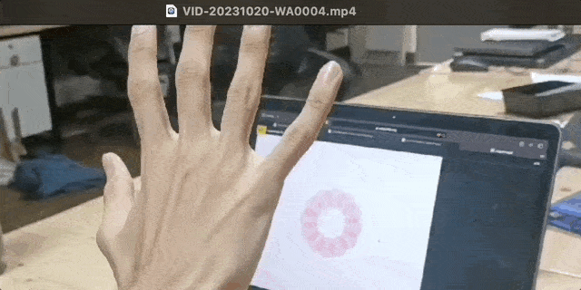


## Prerequisites

Before we start, you should know how to use some basic coding concepts like: 

- variables, 
- arrays, 
- loops, 
- objects, 
- interactivity with the mouse. 

You Will Need:

- A computer
- A webcam
- Internet connection
- A place to write and run your p5.js code. Look up [Setting Up Your Environment](/tutorials/setting-up-your-environment) for more info.

In past tutorials with interactivity, we learned how to use tools like the mouse and keyboard (physical objects) to interact with the computer. These tools have helped us talk with computers for many years. But now, we don't always need them. In this tutorial, we're going to learn how to control our p5.js drawings directly with our hands, like a magician waving her wand!

To do this, we will use the [ml5.js library](https://ml5js.org/) and a *machine learning model* called [HandPose](https://learn.ml5js.org/#/reference/handpose?id=handpose). The ml5.js HandPose model figures out the positions of your hand on the computer screen. 

*Machine learning* is like teaching a computer to learn and make choices by showing it lots of examples. The code looks at the examples and creates connections, kind of like how we learn. If we want to teach it to know the difference between cats and dogs, we show it lots of pictures and tell it which ones are cats and which ones are dogs. The more examples you show the machine learning model, the better it gets. You could then show it a new picture, and it would be able to tell if it's a cat or a dog. That's machine learning in action. For more examples of machine learning, watch [this video](https://www.youtube.com/watch?v=5q87K1WaoFI\&t=665s) on Youtube.

The [ml5.js](https://ml5js.org/) [HandPose](https://learn.ml5js.org/#/reference/handpose?id=handpose) machine learning model can recognize a hand in a picture and identify points on each finger. When we create interactive sketches with the mouse, we extract a mouse cursor position and use built-in variables like `mouseX` and `mouseY` to control things on the screen. The ml5.js lets us do something similar, but with your hand movements via a webcam.


### Step 1 - Set up ml5.js

- Open the [ml5.js HandPose Image](https://editor.p5js.org/ml5/sketches/Handpose_Image) example in the p5.js Web Editor. Make a copy and name it something like "Handpose Sketch".

  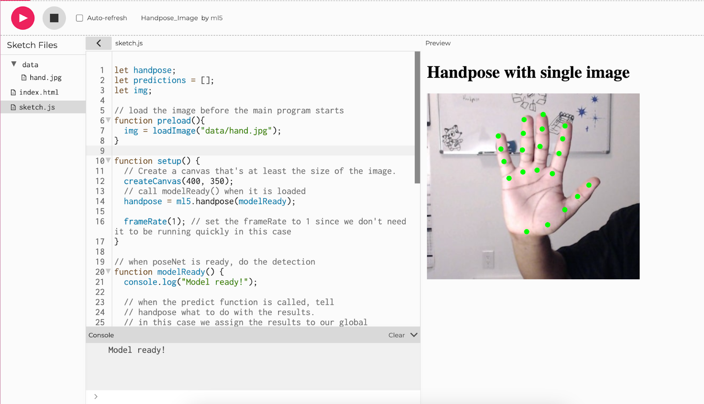


- Download the image of the hand from [this link](https://raw.githubusercontent.com/ml5js/ml5-library/49b9bf2/examples/p5js/Handpose/Handpose_Image/data/hand.jpg) and name it `hand.jpg`. Upload it inside your data folder. If the image already exists in the folder, replace it. 

<Columns>
<Column>

```js
let handpose;
let predictions = [];
let img;
// load the image before the main program starts
function preload(){
  img = loadImage("data/hand.jpg");
}
function setup() {
  // Create a canvas that's at least the size of the image.
  createCanvas(400, 350);
  // call modelReady() when it is loaded
  handpose = ml5.handpose(modelReady);
  frameRate(1); // set the frameRate to 1 since we don't need it to be running quickly in this case
}
// when poseNet is ready, do the detection
function modelReady() {
  console.log("Model ready!");
 
  // when the predict function is called, tell
  // handpose what to do with the results.
  // in this case we assign the results to our global
  // predictions variable
  handpose.on("predict", results => {
    predictions = results;
  });
  handpose.predict(img);
}
// draw() will not show anything until poses are found
function draw() {
  if (predictions.length > 0) {
    image(img, 0, 0, width, height);
    drawKeypoints();
    noLoop(); // stop looping when the poses are estimated
  }
}
// A function to draw ellipses over the detected keypoints
function drawKeypoints() {
  for (let i = 0; i < predictions.length; i += 1) {
    const prediction = predictions[i];
    for (let j = 0; j < prediction.landmarks.length; j += 1) {
      const keypoint = prediction.landmarks[j];
      fill(0, 255, 0);
      noStroke();
      ellipse(keypoint[0], keypoint[1], 10, 10);
    }
  }
}
```

</Column>
<Column>

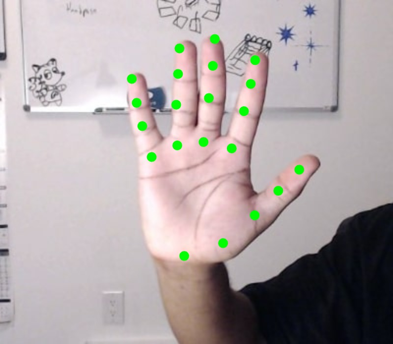

[Live](https://editor.p5js.org/vyasakanksha/sketches/I0TNZ9w_1)

</Column>
</Columns>


#### Deep Dive into ml5.js Sample Code

Let's dive into how [ml5.js](https://ml5js.org/) works, especially with the [HandPose](https://learn.ml5js.org/#/reference/handpose?id=handpose) model. [ml5.js](https://ml5js.org/) is a tool made to help us all use machine learning easily. It works great with p5.js, which means our computer can "see, hear, and understand" stuff using a camera, just like we do!

The [HandPose](https://learn.ml5js.org/#/reference/handpose) model uses image recognition algorithms to recognize your hand. It can spot your palm and fingers and keep track of them as you move your hand around in front of the camera. It can only detect one one hand at a time, but it can identify 21 different key-points on the hand in 3D space. This means that it gives us the x-y-z coordinates of each point. These key-points show us key parts of your palm and fingers. 

Now let’s start with the static image to see this in action.

<Columns>
<Column>

```js
//variable for handPose ml model
let handpose;
//array for hand point predictions
let predictions = [];
//variable for image
let img;
// load the image from the data folder before the main program starts
function preload(){
  img = loadImage("data/hand.jpg");
}
function setup() {
  // Create a canvas that's at least the size of the image.
  createCanvas(400, 350);
  // print to let us know that handpose model (which is initialized on the next line) started loading
  print("loading")
 
  /* initialize the handpose model,
 passes the modelReady function as a callback,
      and calls modelReady when the
      handpose model is loaded and ready to use. */
  handpose = ml5.handpose(modelReady);
  /* set the frameRate to 1 because an image does not change
      so model predictions shouldn't change */
  frameRate(1);
}
// when handPose ml model is ready this function will run
function modelReady() {
  // print to let us know that the model is loaded and ready to start predicting!
  console.log("Model ready!");
 
  /* when the predict function is called, we pass a function
     that tells handpose what to do with the results. */
   handpose.on("predict", function(results) {
    // results from the prediction is stored in the predictions variable
    predictions = results;
  });
  /* calls the handpose.predict method on img to predict points on the hand
    to identify landmarks and fingers */
   handpose.predict(img);
}
// draw() will not show anything until poses are found
function draw() {
  if (predictions.length > 0) {
    //display image on canvas
    image(img, 0, 0, width, height);
   
    //function to draw points for all predictions
    drawKeypoints();
    // stop draw from running again when poses are estimated
    noLoop();  
  }
}
// A function to draw ellipses over the detected keypoints
function drawKeypoints() {
 // Make sure that a prediction is present in the prediction array
 if (predictions.length > 0) {
    // The Handpose model keeps making predictions. To keep it simple, we just take the first prediction is this case
    let prediction = predictions[0];
           /* array for each prediction point
              indicies 0 - 4 : thumb
              indicies 5 - 8 : pointer
              indicies 9 - 12 : middle finger
              indicies 13 - 16 : ring finger
              indicies 17 - 20 : pinky
           */
     
     let keypoints = prediction.landmarks
   
    //display predictions object in the console   
    console.log(prediction)
   
    /* Loop through all the predicted key points
              index 0 : x
              index 1 : y
              index 2 : z  */
         
    for (let keypoint of keypoints) {
        //draw ellipses at each keypoint
        fill(0, 255, 0);
        noStroke();
        ellipse(keypoint[0], keypoint[1], 10, 10);
    }
  }
}
```

</Column>

<Column>


[Live](https://editor.p5js.org/vyasakanksha/sketches/jsco7Hu4T)

</Column>
</Columns>

Let's run the code. 

1. First, “loading” is printed in the console to let us know that the HandPose model is loading. 
2. Once it's ready, "Model ready!" is printed in the console. This means that the HandPose model has loaded and is all set to figure out where your hand is in the picture. 
3. The `modelReady` function is called when the model is loaded and ready to work. The HandPose model is hosted on the ml5.js website. It usually takes a few seconds to load. The `modelReady` function looks at the picture and tries to understand where the hand is. 
4. The Handpose `predict()` function (in the `modelReady` function) returns a JavaScript object which maps out the shape of the hand. This object is stored in a variable named `predictions. `To view this data we can add a print statement in the `draw()` function `console.log(predictions[0]).` This can be found inside the conditional right after `noLoop()`. The points on your hand which the model has predicted are printed in the next line.


### Step 2 - Let’s understand the data

Here's the output of that `console.log(predictions[0])`:

```js
{
  handInViewConfidence: 0.9990172386169434, 
  boundingBox: {
    topLeft: Array(2),
    bottomRight: Array(2),
  },
  landmarks: Array(21),
  annotations: {
    thumb: Array(4),
    indexFinger: Array(4),
    middleFinger: Array(4),
    ringFinger: Array(4)
    pinky: Array(4),
    palmBase: Array(1)
  }
}
```

When we run the program, it gives us array of objects that help us understand where different parts of the hand are:

- `handInViewConfidence`: This score tells us the probability that the hand is in the frame (how sure the program is that it sees a hand). A higher score means it's more confident it's looking at a hand.
- `boundingBox`: This tells us where the edges of the hand are. It gives the x-y coordinates of the top right corner and bottom left corner of a box that surrounds the hand. This box is shown as the green box in the image below.
- `landmarks`: An array of 21 predicted points that the model guesses, showing the different areas on the hand. These points start from the bottom of the palm and go up each finger, including four points on each finger. They're like markers that show different spots on your hand. 
- `annotations`: These are predictions where each finger is. For each finger, there are four points from the bottom to the tip, making it easy to tell which finger is which. In the picture, we can see these points as little green circles.

Each of the points in the landmarks and annotations has three numbers showing where they are in 3D space. These are the x-y-z points of that point. Index0 = x, index1 = y and index2 = z.  

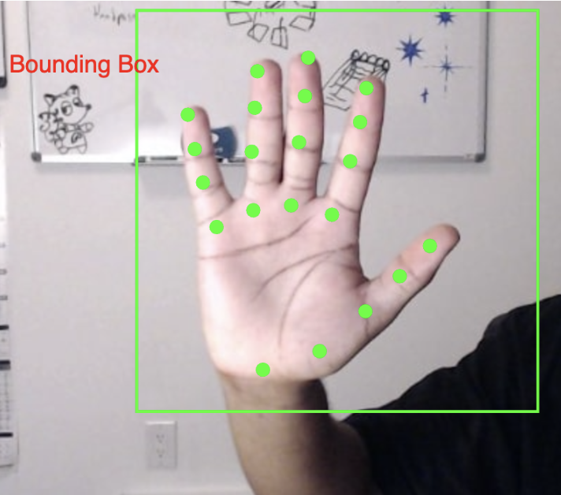


#### Example: Annotations

In the following example we draw the tip of each finger in a different color. Using the `annotations`, we get the array that contains the points for each finger. We already know that the tip of each finger is the last point in each array, and this point has x-y-z coordinates. Using the first two numbers for that point (the x-y coordinates), we can draw an ellipse right where the fingertip is. 

<Columns>
<Column>

```js
// preload(), setup(), modelReady(), and draw()

// A function that creates a finger Object
function createFinger(name, points, color) {
  return {
    name: name,
    points: points,
    color: color
  };
}
// A function to draw ellipses over the detected annotations
function drawKeypoints() {

  if (predictions.length > 0) {
    let prediction = predictions[0];
   
    // Create finger objects with the labels, points and color 
    let fingers = [
        createFinger("thumb", prediction.annotations.thumb, 'red'),
        createFinger("indexFinger", prediction.annotations.indexFinger, 'green'),
        createFinger("middleFinger", prediction.annotations.middleFinger, 'blue'),
        createFinger("ringFinger", prediction.annotations.ringFinger, 'yellow'),
        createFinger("pinky", prediction.annotations.pinky, 'purple')
      ];
    
    //iterate through each finger to access color and points
    for (let i = 0; i < fingers.length; i += 1) {
      let finger = fingers[i];
      fill(finger.color);
      noStroke();
     
      // Access the tip of the finger in the last element of the finger.points list (element with index 3) and draw the ellipse using its x-y coordinates
      ellipse(finger.points[3][0], finger.points[3][1], 10, 10);
    }
  }
}
```

</Column>
<Column>

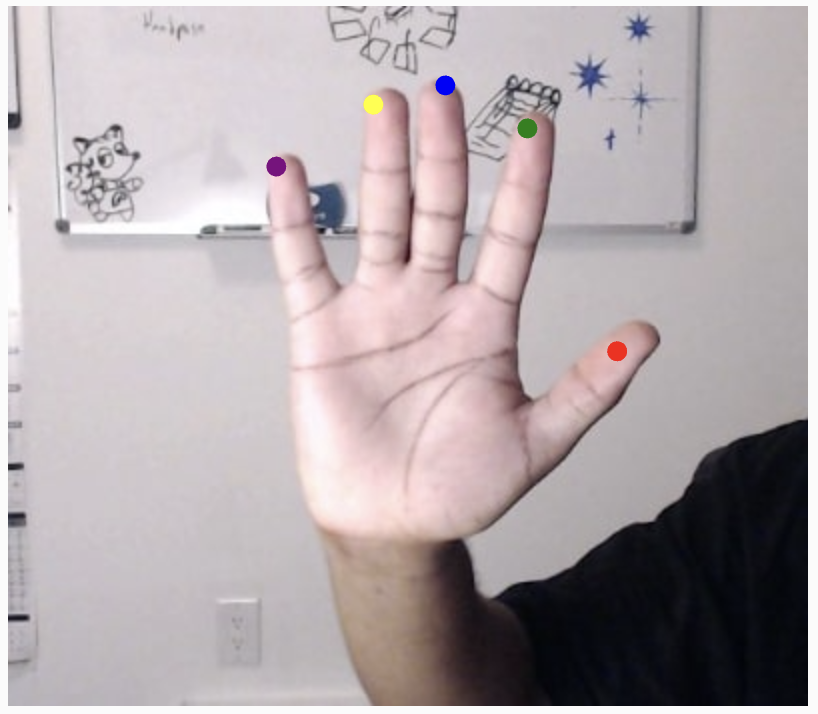

[Live](https://editor.p5js.org/vyasakanksha/sketches/JmQqw7sZV)

</Column>
</Columns>

Lets see what happens in the example code above:

- First, we add a function called `createFinger()` that creates a finger object which has: 
  - the name of the finger that correspond to the key in the `predictions[0].annotations` object, 
  - the points on finger which corresponds to the array for each finger, 
  - color of the dot for the finger you want to draw.

Then we move to the `drawKeypoints() `function. Here's what happens in that function:

- First, we add a condition to check if there is at least one prediction for the points on the hand. We assign the variable `prediction` to the first such prediction
- Then, we call the `createFinger()` function in a loop for each finger to a list of finger objects. This creates a array of objects containing info about each of the fingers
  - Each finger object contains three properties: a name, its points, and a color (as seen in the `createFinger()` function definition)
- Next, we have another loop to go through the fingers list and get the color for each finger. We then place that color in fill(). This makes sure that everything drawn after that line is drawn in that color
- Now we draw an ellipse using then x- and y-coordinates found in `finger.points[3]`, which is the tip of the finger
  - `finger.points[3][0]` corresponds to the x-coordinate of the point 
  - `finger.points[3][1]` corresponds to the y-coordinate of the point 


#### Example: Hats

In this example we make our fingers wear jester hats. To do this, all we need to do is replace the ellipse at the tip of each finger with the picture of a hat. 

<Columns>
<Column>

```js
//variable for handpose ml model
let handpose;

//array for hand point predictions
let predictions = [];

//variable for image
let img;

// New variable to store the image of the hat
let hatImage;

// load the image before the main program starts
function preload() {
  img = loadImage("data/hand.jpg");

  // load the picture of the hat
  hatImage = loadImage(""data/hat.png");
}
function setup() {
  // Create a canvas that's at least the size of the image.
  createCanvas(400, 350);
  print("loading")
  // call modelReady() when it is loaded
  handpose = ml5.handpose(modelReady);
  frameRate(1); // set the frameRate to 1 since we don't need it to be running quickly in this case
}

// draw() will not show anything until poses are found
function draw() {
  if (predictions.length > 0) {
    image(img, 0, 0, width, height);
    drawKeypoints();
    noLoop(); // stop looping when the poses are estimated
  }
}

// when the model is ready, a message appears in the console and it predicts where each landmark should be placed
function modelReady() {
  console.log("Model ready!");
    // when handpose is ready, do the detection
    handpose.on("predict", function(results) {
    predictions = results;
  });
  //calls the handpose.predict method on img to predict landmarks and fingers
  handpose.predict(img);
}

// A function to create the finger
function createFinger(name, points, color) {
  return {
    name: name,
    points: points,
    color: color
  };
}
// A function to draw ellipses over the detected annotations
function drawKeypoints() {
   if (predictions.length > 0) {
    let prediction = predictions[0];
   
    // Create finger objects with the labels, points and color 
    let fingers = [
        createFinger("thumb", prediction.annotations.thumb, 'red'),
        createFinger("indexFinger", prediction.annotations.indexFinger, 'green'),
        createFinger("middleFinger", prediction.annotations.middleFinger, 'blue'),
        createFinger("ringFinger", prediction.annotations.ringFinger, 'yellow'),
        createFinger("pinky", prediction.annotations.pinky, 'purple')
      ];
    for (let i = 0; i < fingers.length; i += 1) {
      let finger = fingers[i];
      fill(finger.color);
      noStroke();
     
      // Access the tip of the finger in the last element of the finger.points list (element with index 3) and draw the ellipse using its x-y coordinates
      ellipse(finger.points[3][0], finger.points[3][1], 10, 10);
      
      // Render the hat image instead of the dots in the previous example
      image(hatImage, finger.points[3][0] - hatImage.width / 2, finger.points[3][1] - hatImage.height / 2);
    }
  }
}
```

</Column>
<Column>

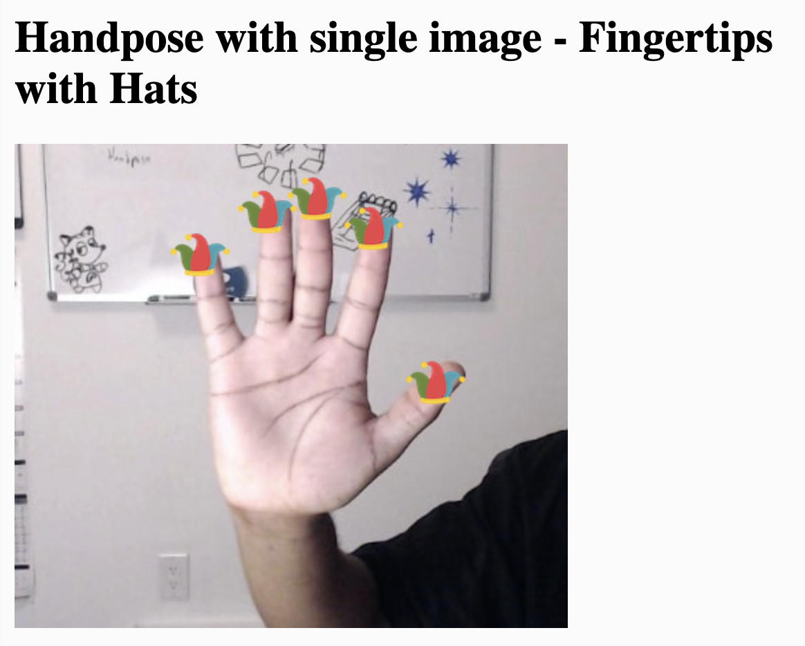

[Live](https://editor.p5js.org/vyasakanksha/sketches/UCskWrEkW)

</Column>
</Columns>

Lets understand the code in this example:

- First, upload a small .png file (100x100 pixels max) that has a transparent background. We create a new variable to store this image and then load it in the preload function. 
- Next, we place the image at the same location as each ellipse in the previous code example. 
- Next, we adjust the points to center the image at each fingertip point. The image will render so that  the fingertip point is the left bottom corner of the hat image, representing the (0,0) point. To center the hat image on that point, we subtract half the width of the image from the x-coordinate of the fingertip point and subtract half the height of the image from the y-coordinate of the fingertip point. 
- Finally, we render the hatImage instead of drawing the ellipses at the end of the `drawKeypoints()` function.


#### Example: Using a live Webcam feed

In this example we replace the static image with a live webcam feed. 

Let’s go back to the ml5.js Handpose, and open up the [Webcam reference for p5.js web editor](https://editor.p5js.org/ml5/sketches/Handpose_Webcam). Make a copy and name it something like “Handpose Webcam Sketch”. 

<Columns>
<Column>

```js
let handpose;
let video;
let predictions = [];
function setup() {
  createCanvas(640, 480);
  video = createCapture(VIDEO);
  video.size(width, height);
  handpose = ml5.handpose(video, modelReady);
  // This sets up an event that fills the global variable "predictions"
  // with an array every time new hand poses are detected
  handpose.on("predict", results => {
    predictions = results;
  });
  // Hide the video element, and just show the canvas
  video.hide();
}
function modelReady() {
  console.log("Model ready!");
}
function draw() {
  image(video, 0, 0, width, height);
  // We can call both functions to draw all keypoints and the skeletons
  drawKeypoints();
}
// A function to draw ellipses over the detected keypoints
function drawKeypoints() {
  for (let i = 0; i < predictions.length; i += 1) {
    const prediction = predictions[i];
    for (let j = 0; j < prediction.landmarks.length; j += 1) {
      const keypoint = prediction.landmarks[j];
      fill(0, 255, 0);
      noStroke();
      ellipse(keypoint[0], keypoint[1], 10, 10);
    }
  }
}
```

</Column>

<Column>

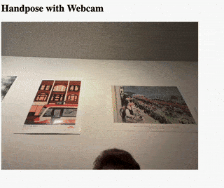

[Live](https://editor.p5js.org/vyasakanksha/sketches/_h4n2eFvE)

</Column>
</Columns>


#### Example: Hats using a live Webcam feed

Let's change this code to add hats on each fingertip. Here are the steps to make this happen:

1. Add a variable to store the hat image
2. Load the hat image in the `preload` function
3. In the `setup()` function we have a line that stores the predicted results from the HandPose model into the predictions array. We move the lines of code from the `setup()` to the `modelReady()` function. We do this to make our code work like the previous example. But, our sketch will work without making this change as well, as both ways are correct.
4. Add the `createFinger` function from the previous example
5. Replace the `drawKeypoints` function with the same function in the “Hats” example above. This code creates the fingers using the finger function and draws the hats on the predicted points for the fingertip. 

Now we are using a live video feed, so the fingertips are moving. 

<Columns>
<Column>

```js
//variable for handpose ml model
let handpose;
//variable to store the video feed
let video;
//array for hand point predictions
let predictions = [];
//variable to store the image of the hat
let hatImage;
// load the image of the hat before the main program starts
function preload() {
  hatImage = loadImage("data/hat.png");
}
function setup() {
  // create the canvas
 createCanvas(640, 480);
  /* capture the video feed and set it to the width and height of the current canvas */
 video = createCapture(VIDEO);
 video.size(width, height);
 /*call modelReady() when it is loaded and pass    the video feed to it */
 handpose = ml5.handpose(video, modelReady);
 /* This sets up an event that fills the global variable "predictions"
  with an array every time new hand poses are detected */
 handpose.on("predict", results => {
   predictions = results;
 });
 // Hide the video element, and just show the canvas
 video.hide();
}
// when the model is ready, a message appears in the console and it predicts where each landmark should be placed
function modelReady() {
  console.log("Model ready!");
    // when handpose is ready, do the detection
    handpose.on("predict", function(results) {
    predictions = results;
  });
   //calls the handpose.predict method on img to predict landmarks and fingers
  handpose.predict(video);
}
// A function to create the finger
function createFinger(name, points, color) {
  return {
    name: name,
    points: points,
    color: color
  };
}
function draw() {
  // render the video feed
  image(video, 0, 0, width, height);
  // We can call both functions to draw all keypoints and the skeletons
  drawKeypoints();
}
// A function to draw hats over the detected keypoints
function drawKeypoints() {
   if (predictions.length > 0) {
    let prediction = predictions[0];
   
    // Add the points for each finger to a struct
    let fingers = [
        createFinger("thumb", prediction.annotations.thumb, 'red'),
        createFinger("indexFinger", prediction.annotations.indexFinger, 'green'),
        createFinger("middleFinger", prediction.annotations.middleFinger, 'blue'),
        createFinger("ringFinger", prediction.annotations.ringFinger, 'yellow'),
        createFinger("pinky", prediction.annotations.pinky, 'purple')
      ];
    for (let i = 0; i < fingers.length; i += 1) {
      let finger = fingers[i];
      fill(finger.color);
      noStroke();
     
      // Access the tip of the finger in the last element of the finger.points list (element with index 3) and draw the ellipse using its x-y coordinates
      ellipse(finger.points[3][0], finger.points[3][1], 10, 10);
     
      image(hatImage, finger.points[3][0] - hatImage.width / 2, finger.points[3][1] - hatImage.height / 2);
    }
  }
}
```

</Column>

<Column>

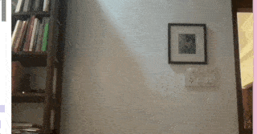

[Live](https://editor.p5js.org/vyasakanksha/sketches/4-E2ThsHY)

</Column>

</Columns>

<Callout>
Give each finger a different hat!
</Callout>


### Step 3 -  Adding interactivity 

Now that we understand the data that the ml5.js HandPose model provides to us, we can use it to interact with our sketches. There are some fun examples of interacting with sketches in the [Conditionals and Interactivity](/tutorials/conditionals-and-interactivity) tutorial. Let’s start with some of these examples - but use our hands instead of the mouse.

When we interacted with our sketches using the mouse, we used the `mouseX` and `mouseY` variables to track the x-y coordinates of the cursor. Now, we will use the x-y coordinates of the tip of a finger. 


#### Example: Move a ball with your index finger

In this example we control a circle on the screen with our index finger. 

Let’s start with the “Using a live Webcam feed” example. 

Here are the steps we follow to move a ball with our fingers: 

- We move the lines that store the predicted results from the HandPose model into the predictions array into the `setup() `function (like we did in the previous example).
- Replace the `drawKeypoints` function with a `drawObject` function. 
   - In the `drawObject` function we find the x-y coordinates of the fourth point index finger (which is at index 3 in the array). As we already know, this is the tip of the finger. We draw a large ellipse here by increasing the height (`h`) and weight (`w`) parameters to 33. 
   - We replace the call `drawKeypoints` to `drawObject `in the draw function.

We can now control the white circle on the screen with our index finger. 

<Columns>
<Column>

```js
//variable for handpose ml model
let handpose;
//variable to store the video feed
let video;
//array for hand point predictions
let predictions = [];
function setup() {
  // create the canvas
 createCanvas(640, 480);
  /* capture the video feed and set it to the width and height of the current canvas */
 video = createCapture(VIDEO);
 video.size(width, height);

  /* print to let us know that handpose model (which is initialized on the next line) is loading */
  print("loading")
  // call modelReady() when it is loaded
  handpose = ml5.handpose(video, modelReady);
  // Hide the video element, and just show the canvas
  video.hide();
}
// when the model is ready, a message appears in the console and it predicts where each landmark should be placed
function modelReady() {
  console.log("Model ready!");
    // when handpose is ready, do the detection
    handpose.on("predict", function(results) {
    predictions = results;
  });
  //calls the handpose.predict method on img to predict landmarks and fingers
  handpose.predict(video);
}
function draw() {
  // render the video feed
  image(video, 0, 0, width, height);
  // We can call a function to draw using the keypoints
  drawObject();
}
// A function to draw a ball at the tip of the finger
function drawObject() {
  if (predictions.length > 0) {
    let prediction = predictions[0];
    let x = prediction.annotations.indexFinger[3][0]
    let y = prediction.annotations.indexFinger[3][1]
    print(prediction, x, y)
    noStroke();   
    // Access the tip of the finger in the last element of the finger.points list (element with index 3) and draw the ellipse using its x-y coordinates and round them to the nearest integer
    ellipse(round(x), round(y), 33, 33);
  }
}
```

</Column>
<Column>

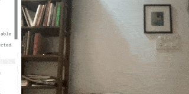

[Live](https://editor.p5js.org/vyasakanksha/sketches/xJkXVoQQs)

</Column>
</Columns>


#### Example: Move three balls with three different fingers

In this example we control three different circles on the screen with our index, middle, and ring fingers.

Let’s continue with the last sketch and modify it. Here is what we have to change in the `drawObject` function: 

- In the previous example we found the x-y coordinates of the fourth point index finger. We now add to this by finding the x-y coordinates of the middle finger and ring finger along with the index finger. We save each of them in different variables. 
- Then we draw an ellipse on each point.

We now have three circles on each of the three fingers.

<Columns>
<Column>

```js
// setup(), modelReady(), and draw()

// A function to draw a ball at the tip of the fingers
function drawObject() {
  if (predictions.length > 0) {
    let prediction = predictions[0];
    //index finger
    let indexX = prediction.annotations.indexFinger[3][0]
    let indexY = prediction.annotations.indexFinger[3][1]
    //middle finger    

    let middleX = prediction.annotations.middleFinger[3][0]
    let middleY = prediction.annotations.middleFinger[3][1]
    //ring finger
    let ringX = prediction.annotations.ringFinger[3][0]
    let ringY = prediction.annotations.ringFinger[3][1]
    noStroke();


    // Bottom circle
    ellipse(round(indexX), round(indexY), 33, 33);    // Top circle
    ellipse(round(middleX), round(middleY), 33, 33); // Middle circle
    ellipse(round(ringX), round(ringY), 33, 33); // Bottom circle
  }
}
```

</Column>
<Column>

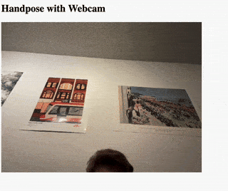

[Live](https://editor.p5js.org/vyasakanksha/sketches/tbB8BR-7c)

</Column>
</Columns>


<Callout>
Change the size of the ellipse based on the finger pointing to it. The pinky can create a small circle, and the thumb can create the largest. 
</Callout>


#### Example: Move object by pointing to where you want it

In this example we draw a rectangle on the right or left of the screen depending on which side of the screen the index finger is pointing to. 

Let’s go back to the “Move a ball with your index finger” example and modify it. Here is what we have to change in the `drawObject` function: 

- We start by changing the size of the ellipse we draw at the tip of our finger. We make the height (`h`) and weight (`w`) of the ellipse very small (20). We will use this to track where our finger is on the screen. 
- Next, we add a conditional to check if the x-coordinate of the tip of our finger is less than 300. Since the width of the screen is 600, 300 marks the halfway point. This tells us that our finger is pointing to the left half of the screen. We can now draw a rectangle covering the left half of the screen. If we code goes into the else case, we know that the x-coordinate of our finger is greater than 300. This shows that our finger is pointing to the right half of the screen. Here, we draw a rectangle covering the left half of the screen.

Let’s run the code. Move your finger from left to right, using the little gray dot to track where your finger is. As you move your index finger to point from right to left a rectangle appears in that half of the canvas. 

Even though we are drawing a new rectangle each time, it looks like we are moving the same rectangle with our finger!

<Columns>
<Column>

```js
// … setup(), modelReady(), and draw()

// A function to draw a rectangle on the half of the screen that the finger point is in
function drawObject() {
  if (predictions.length > 0) {
    let prediction = predictions[0];
    let x = prediction.annotations.indexFinger[3][0]
    let y = prediction.annotations.indexFinger[3][1]
    print(prediction, x, y)
    fill(51);
    noStroke();

    // A small ellipse to track the finger
    ellipse(round(x), round(y), 20, 20) 
    
    // If the finger point is in the left of the screen, draw the first rectangle; otherwise draw the second
    if (x < (300)) {
      rect(0, 0, 300, 480);  // Left
    }
    else {
      rect(300, 0, 300, 480); // Right
    }
  }
}
```

</Column>

<Column>

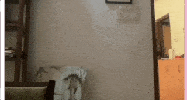

[Live](https://editor.p5js.org/vyasakanksha/sketches/kfseWyYR4)

</Column>

</Columns>


<Callout>

Create a small game. Divide your canvas into two and make a ball fall from the top of the screen. Each ball has a color, and based on the color you need to send it to the right or left by pointing to that side of the screen. Maintain a score.

</Callout>


#### Example: Change object color by pointing to it 

In this example we change the color of the object by pointing to it. We also draw a background in the draw loop to make sure our cursor is not drawing on the screen. 

Let’s continue with the last sketch and modify it. 

- First, we add a background to the sketch so that we only see the object and none of the background video around it. We add the line `fill(0, 255, 0);` line in the setup function to add a gray background.
- Next, we make changes in the `drawObject `function: 
   - First, we create a rectangle at x-coordinate 150 and y-coordinate 150 which width 100 and height 200.
   - Next, we add a conditional before drawing the rectangle that checks if the x coordinate of our index finger is inside the rectangle. This indicates that we are pointing inside the rectangle. In this care we set `fill(255, 204, 0)` which draws everything that comes after it in yellow color. 

Let’s run the code. Move your finger in front of the camera and follow the little gray dot to see where your finger is. Try and get it inside the rectangle and watch it change color!

<Columns>
<Column>

```js
//variable for handpose ml model
let handpose;
//variable to store the video feed
let video;
//array for hand point predictions
let predictions = [];

function setup() {
  createCanvas(600, 480);
  video = createCapture(VIDEO);
  video.size(width, height);
  print("loading");
  fill(0, 255, 0);
  handpose = ml5.handpose(video, modelReady);
  // This sets up an event that fills the global variable "predictions"
  // with an array every time new hand poses are detected
  handpose.on("predict", results => {
    predictions = results;
  });
  // Hide the video element, and just show the canvas
  video.hide();
}
// … modelReady(), and draw()
// A function to track the finger and draw the rectangle in the appropriate color
function drawObject() {
   if (predictions.length > 0) {
      let prediction = predictions[0];
      let x = prediction.annotations.indexFinger[3][0]
      let y = prediction.annotations.indexFinger[3][1]
      print(prediction, x, y)
      fill(51);
      noStroke();
      // A small ellipse to track the finger
      ellipse(round(x), round(y), 20, 20)
      // If the finger point is in the region of the rectangle, draw it in yellow; otherwise draw it in gray.
      if ((x > 150) && (x < 250) && (y > 150) && (y < 350))
    {
      fill(255, 204, 0);
    } else {
      fill(51);
    }
  }
  rect(150, 150, 100, 200);
 
}
```

</Column>

<Column>


[Live](https://editor.p5js.org/vyasakanksha/sketches/7BBJPBCyI)

</Column>

</Columns>

<Callout>
Control the [Recursive Tree](/examples/07_Repetition/05_Recursive_Tree) example or the direction of these [Smoke Particles](/examples/15_Math_And_Physics/03_Smoke_Particle_System) with your finger. 
</Callout>


#### Example: Making a flower bloom 

In this example we have a simple sketch where we use ellipses to simulate a flower blooming and control the bloom with our fingers. 

Let’s continue with the last sketch and modify it. 

- We add new variables to store the number of petals, size of the petals, the size of the bloom, the threshold, and the angle. We will understand more about these variables below. 

In the `drawObject()` function:

- We start by deciding how big we want our flower bloom to be, setting `targetSize` to 0 as our starting point.
- We find the tips of the thumb and pinky fingers using prediction.annotations. 
- Next, we measure how far apart these two points are. This distance helps us figure out if your hand is open or closed.
  - If your hand is wide open (the distance is bigger than our set threshold), we decide that our flower should be fully bloomed.
  - We have already set our threshold to 100. If we decide our flower should be bloomed we set targetSize to 200 pixels.
- Now, we move to the middle of our drawing area `(translate(width / 2, height / 2))` so we can draw our flower right in the center.We choose how our drawing will look by setting `noStroke()` (which means no outline) and `fill(220, 20, 60, 50)` to give our flower a lovely pink color. 
- We smoothly change the size of our flower bloom to match the `targetSize` we decided earlier, using a function called lerp. This makes the change look smooth and natural.
- Finally, we draw our flower. We draw each petal one by one in a circle to make the whole bloom. For each petal, we use the ellipse function to draw it, then rotate a little before drawing the next petal, so they spread out nicely.

Let’s run the code! Make a fist (like you are punching your camera), and then open it up to watch the flower bloom. 

<Columns>
<Column>

```js
//variable for handpose ml model
let handpose;
//variable to store the video feed
let video;
//array for hand point predictions
let predictions = [];
// variable to show the number of petals in the flower
let numPetals = 12;
// variable that calculates the angle between each petal, so they are evenly spaced in a circle. We divide a full circle (360 degrees) by the number of petals
let angle = 360 / numPetals;
// variable that sets the size of each individual petal. The bigger the number, the bigger each petal will be.
let petalSize = 100;
// variable that tracks the current size of the flower's bloom. It starts at 0 but will change based on the hand's movement.
let bloomSize = 0;
// variable that sets a distance threshold. It is used to decide if the hand is open or closed. If the distance between thumb and pinky is greater than this, the hand is considered open.
let threshold = 100;
function setup() {
  // create the canvas
  createCanvas(1000, 800);
 
  // Capture video.
  video = createCapture(VIDEO);
  video.size(width, height);
   
  // Measure angles in units of degrees.
  angleMode(DEGREES);
  // print to let us know that the HandPose model is still loading
  print("loading");
  // call modelReady() when it is loaded
  handpose = ml5.handpose(video, modelReady);
  // Hide the video element, and just show the canvas
  video.hide();
}
// when the model is ready, a message appears in the console and it predicts where each landmark should be placed
function modelReady() {
  console.log("Model ready!");
  // when handpose is ready, do the detection
  handpose.on("predict", function(results) {
    predictions = results;
  });
  // call modelReady() when it is loaded
  handpose = ml5.handpose(video, modelReady);
}
function draw() {
  background(255);
  drawObject();
}
// In this function we draw a flower in full bloom when the detected hand is open, and draw the flower closed when the hand is a fist
function drawObject() {
  // Set the target size of the bloom.
  let targetSize = 0;
 
  if (predictions.length > 0) {
    let prediction = predictions[0];
   
    // Find the thumb and pinky tips.
    let thumbTip = prediction.annotations.thumb[3];
    let pinkyTip = prediction.annotations.pinky[3];
   
    // Calculate the distance between the thumb and pinky.
    let distance = dist(thumbTip[0], thumbTip[1], pinkyTip[0], pinkyTip[1]);
   
    // If the hand is open, set the bloom's target size
    // to 200 pixels.
    if (distance > threshold) {
      targetSize = 200;
    }
  }
 
  // Move the origin (0, 0) to the center of the canvas.
  translate(width / 2, height / 2);
 
  // Set the drawing style.
  noStroke();
  fill(220, 20, 60, 50);
  // Smoothly transition the bloom size.
  bloomSize = lerp(bloomSize, targetSize, 0.1);
  // Draw the flower.
  for (let i = 0; i < numPetals; i += 1) {
    // Draw the petal.
    ellipse(bloomSize, 0, petalSize, petalSize);
   
    // Rotate the coordinate system for the next petal.
    rotate(angle);
  }
}
```

</Column>

<Column>

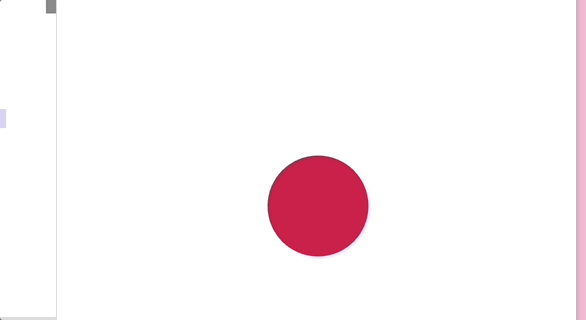

CAPTION TEXT: Sketch by [Akif Kazi](https://www.instagram.com/designer_akifkazi), Student at KJ Somaiya University, Mumbai.

[Live](https://editor.p5js.org/vyasakanksha/sketches/tqvxO53fn)

</Column>
</Columns>

<Callout>

- Create a sketch with many seeds (you can represent these with ellipses). Point to one and then use your fingers to make it bloom. 
- In your collection of p5.js sketches, find one that uses the mouse to interact with the sketch. Use your hands instead. 

</Callout>


### Next Steps

Explore the [PoseNet](https://learn.ml5js.org/#/reference/posenet) and [Facemesh](https://learn.ml5js.org/#/reference/facemesh) models in the ml5.js library. The PoseNet model detects points on the whole body, in the exact same way that HandPose detects it for the hand. The Facemesh model returns points on the face. You should understand the data that these models return and use them in your sketches. 

<Callout>

Using the Facemesh model, create the following:

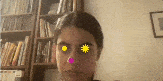

</Callout>


### Resources

- [ml5.js library](https://ml5js.org/)
- [ml5.js Handpose Examples](https://learn.ml5js.org/#/reference/handpose?id=examples)
- [Computer Scientist Explains ML in 5 Levels](https://www.youtube.com/watch?v=5q87K1WaoFI\&t=665s)
- [Interactivity in p5.js](/tutorial/conditionals-and-interactivity)
