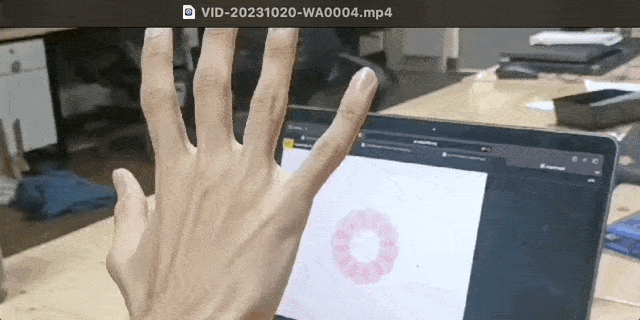
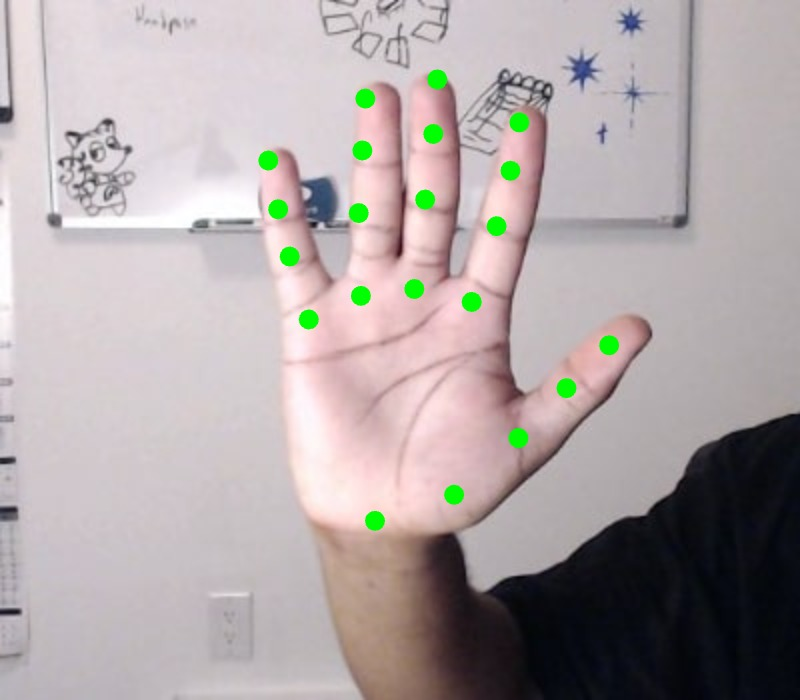
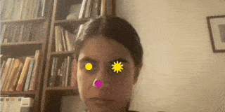

import { Columns, Column } from "../../../components/Columns";
import Callout from "../../../components/Callout/index.astro";
import EditableSketch from "../../../components/EditableSketch/index.astro";



In this tutorial, we will learn how to use our hands to control sketches in p5.js. At the end, you'll be able to make cool things like a flower that opens and closes on your computer screen just by moving your hand!

Picture this: You're making a flower on your computer using p5.js. As you open your hand, the flower blooms. When you close your hand into a fist, the flower closes too.

## Prerequisites

Before you begin, you should be familiar with:

- variables
- arrays
- loops
- objects
- mouse interactivity

You will need:

- A computer with a webcam
- An internet connection
- A p5.js editor. See [Setting Up Your Environment](/tutorials/setting-up-your-environment).

So far, we've used input devices like the mouse and keyboard to control our sketches. In this tutorial, we'll use the [ml5.js library's](https://ml5js.org/) [HandPose](https://docs.ml5js.org/#/reference/handpose) machine learning model to control p5.js sketches with our hands through a webcam.

Machine learning allows computers to recognize patterns from examples. The HandPose model has been trained to detect a hand and estimate the locations of 21 hand landmarks. We'll use these landmarks much like `mouseX` and `mouseY` to create interactive sketches.

### Example 1 - ml5.js with a Single Image

<Columns>
<Column>



You can follow along with the ml5.js HandPose Image [Full Sketch](https://editor.p5js.org/colemanliyah/sketches/QWb7V363L) example in the p5.js Web Editor by making a copy and naming it something like "Handpose Sketch".

1. Download the image of the hand from [this link](https://raw.githubusercontent.com/ml5js/ml5-library/49b9bf2/examples/p5js/Handpose/Handpose_Image/data/hand.jpg) and name it `hand.jpg`. Upload it inside your data folder. If the image already exists in the folder, replace it.

2. Update your index.html file to include script that calls the ml5.js api

```js
<html>
  <head>
    <meta charset="UTF-8" />
    <title>Handpose with Webcam</title>

    <script src="https://cdn.jsdelivr.net/npm/p5@2/lib/p5.js"></script>
    <script src="https://unpkg.com/ml5@1/dist/ml5.js"></script>
  </head>
  <body>
    <h1>Handpose with single image</h1>

    <script src="sketch.js"></script>
  </body>
</html>
```

3. Update script.js file to use ml5 hand pose library

<EditableSketch
scripts={["https://unpkg.com/ml5@1/dist/ml5.js"]}
code={`
let handPose;
let predictions = [];
let img;

  // Load the image before the main program starts
  async function setup() {
    // Create a canvas that's at least the size of the image.
    createCanvas(400, 350);

    // Load Image
    img = await loadImage("/assets/hand.jpg");

    // Load the handPose model.
    // Since loading a machine learning model takes time,
    // we use await to wait until the model is ready before continuing.
    handPose = await ml5.handPose();

    // Ask the model to find hands in the image.
    // When the model finishes detecting hands, it will run the callback function.
    predictions = await handPose.detect(img);
  }

  // draw() will not show anything until hands are detected
  function draw() {
    if (predictions.length > 0) {
      image(img, 0, 0, width, height);
      drawKeypoints();

      // Print the first hand prediction to the console.
      console.log(predictions[0]);

      // Stop looping when the hands are detected.
      noLoop();
    }
  }

  // A function to draw circles over the detected keypoints
  function drawKeypoints() {
    for (let i = 0; i < predictions.length; i += 1) {
    const prediction = predictions[i];

      for (let j = 0; j < prediction.keypoints.length; j += 1) {
        const keypoint = prediction.keypoints[j];

        fill(0, 255, 0);
        noStroke();
        circle(keypoint.x, keypoint.y, 10);
      }
    }
  }
`}
/>

</Column>
<Column class="basis-64 grow-0">

</Column>
</Columns>

#### Deep Dive into ml5.js Sample Code

Let's dive into how [ml5.js](https://ml5js.org/) works, especially with the [HandPose](https://docs.ml5js.org/#/reference/handpose) model. **ml5.js** is a library that makes machine learning easy to use with p5.js, allowing your sketches to respond to images, sound, and video.

The **HandPose** model analyzes images or webcam video to detect hands. It identifies 21 keypoints on each detected hand, including the wrist, palm, and fingertips. Each keypoint has an x- and y-coordinate, and a corresponding 3D position is also available through `keypoints3D`. We can use these keypoints to create interactive sketches that respond to hand movements.

1. First, the image is loaded, followed by the HandPose model. Since loading the model takes time, `await` pauses the program until the model is ready.
2. Once the model has loaded, `handPose.detect()` analyzes the image and stores the detected hand landmarks in the `predictions` variable.
3. The `draw()` function waits until at least one hand has been detected. It then displays the image, calls `drawKeypoints()`, and stops looping with `noLoop()`.
4. The `predictions` variable contains the detected hand data, including an array of keypoints. To inspect this data, add `console.log(predictions[0]);` inside the `if (predictions.length > 0)` block in `draw()`.

### Step 2 - Let’s understand the data

Here's the output of that `console.log(predictions[0])`:

```js
{
  keypoints: Array(21),
  keypoints3D: Array(21),
  handedness: "Left",
  confidence: 0.9955774545669556,
  wrist: Object…
}
```

When we run the program, it gives us array of objects that help us understand where different parts of the hand are:

- `confidence`: This score tells us how certain the model is that it has detected a hand. A higher value means the model is more confident.
- `keypoints`: An array of 21 predicted points representing the hand. Each keypoint contains an `x` and `y` coordinate, along with a name identifying the landmark.
- `keypoints3D`: An array of the same 21 points in 3D space. Each point has `x`, `y`, and `z` coordinates, where `z` represents the point's estimated depth relative to the camera.
- `handedness`: Indicates whether the detected hand is predicted to be the left or right hand.
- `wrist`: An object containing the coordinates of the wrist landmark.

### Example 2: Annotations

In the following example we draw the tip of each finger in a different color. Using the `annotations`, we get the array that contains the points for each finger. We already know that the tip of each finger is the last point in each array, and this point has x-y-z coordinates. Using the first two numbers for that point (the x-y coordinates), we can draw a circle right where the fingertip is. [Full Sketch](https://editor.p5js.org/colemanliyah/sketches/pU7lsTFNG)

<EditableSketch
scripts={["https://unpkg.com/ml5@1/dist/ml5.js"]}
code={`
let handPose;
let predictions = [];
let img;

  async function setup() {
    // Create a canvas
    createCanvas(400, 350);

    // Load the image and wait until it finishes loading
    img = await loadImage("/assets/hand.jpg");

    // Load the handPose model and wait until it finishes loading
    handPose = await ml5.handPose();

    // Ask the model to find hands in the image.
    // When detection is complete, store the results.
    predictions = await handPose.detect(img);
  }

  // draw() will not show anything until hands are detected
  function draw() {
    if (predictions.length > 0) {
      image(img, 0, 0, width, height);
      drawKeypoints();

      // Stop looping when the hands are detected.
      noLoop();
    }
  }

  // A function that creates a finger object
  function createFinger(name, points, color) {
    return {
    name: name,
    points: points,
    color: color,
    };
  }

  // Draw circles over the detected fingertips
  function drawKeypoints() {
    if (predictions.length > 0) {
      let prediction = predictions[0];

      // Create finger objects with the labels, points and color
      let fingers = [
        createFinger("thumb", prediction.keypoints.slice(0, 4), "red"),
        createFinger("indexFinger", prediction.keypoints.slice(4, 8), "green"),
        createFinger("middleFinger", prediction.keypoints.slice(8, 12), "blue"),
        createFinger("ringFinger", prediction.keypoints.slice(12, 16), "yellow"),
        createFinger("pinky", prediction.keypoints.slice(16, 20), "purple"),
      ];

      // Iterate through each finger to access color and points
      for (let i = 0; i < fingers.length; i += 1) {
        let finger = fingers[i];

        fill(finger.color);
        noStroke();

        // Access the fingertip (last point in each finger)
        let tip = finger.points[3];

        circle(tip.x, tip.y, 10);
      }
    }
  }
`}
/>

Lets see what happens in the example code above:

- First, we add a function called `createFinger()` that creates a finger object which has: 
  - the name of the finger that correspond to the key in the `predictions[0].annotations` object, 
  - the points on finger which corresponds to the array for each finger, 
  - color of the dot for the finger you want to draw.

Then we move to the `drawKeypoints() `function. Here's what happens in that function:

- First, we add a condition to check if there is at least one prediction for the points on the hand. We assign the variable `prediction` to the first such prediction
- Then, we call the `createFinger()` function in a loop for each finger to a list of finger objects. This creates a array of objects containing info about each of the fingers
  - Each finger object contains three properties: a name, its points, and a color (as seen in the `createFinger()` function definition)
- Next, we have another loop to go through the fingers list and get the color for each finger. We then place that color in fill(). This makes sure that everything drawn after that line is drawn in that color
- Now we draw an circle using then x- and y-coordinates found in `finger.points[3]`, which is the tip of the finger
  - `tip.x` corresponds to the x-coordinate of the point 
  - `tip.y` corresponds to the y-coordinate of the point 

#### Example 3: Hats

In this example we make our fingers wear hats. To do this, all we need to do is replace the circle at the tip of each finger with the picture of a hat. [Full Sketch](https://editor.p5js.org/colemanliyah/sketches/rXRTdmkpw)

<Columns>
<Column>

<EditableSketch
scripts={["https://unpkg.com/ml5@1/dist/ml5.js"]}
code={`
let handPose;
let predictions = [];
let img;

// New variable to store the image of the hat
let hatImage;

async function setup() {
  // Create a canvas
  createCanvas(400, 350);

  // Load the image and wait until it finishes loading
  img = await loadImage("/assets/hand.jpg");

  // Load the hat image
  hatImage = await loadImage("/assets/hat.jpg")

  console.log(img);

  // Load the handPose model and wait until it finishes loading
  handPose = await ml5.handPose();

  // Ask the model to find hands in the image.
  // When detection is complete, store the results.
  predictions = await handPose.detect(img);
}

// draw() will not show anything until hands are detected
  function draw() {
    if (predictions.length > 0) {
      image(img, 0, 0, width, height);
      drawKeypoints();

      // Stop looping when the hands are detected.
      noLoop();
    }
  }

  // Create a finger object
  function createFinger(name, points, color) {
    return {
    name: name,
    points: points,
    color: color,
    };
  }

  // Draw hat images over the detected fingertips
  function drawKeypoints() {
    if (predictions.length > 0) {
      let prediction = predictions[0];

      let fingers = [
        createFinger("thumb", prediction.keypoints.slice(0, 4), "red"),
        createFinger("indexFinger", prediction.keypoints.slice(4, 8), "green"),
        createFinger("middleFinger", prediction.keypoints.slice(8, 12), "blue"),
        createFinger("ringFinger", prediction.keypoints.slice(12, 16), "yellow"),
        createFinger("pinky", prediction.keypoints.slice(16, 20), "purple"),
      ];

      for (let i = 0; i < fingers.length; i += 1) {
        let finger = fingers[i];

        let tip = finger.points[3];

        fill(finger.color);
        noStroke();

        circle(tip.x, tip.y, 10);

        // Render the hat image at the fingertip
        let hatSize = 50;

        image(
          hatImage,
          tip.x - hatSize / 2,
          tip.y - hatSize / 2,
          hatSize,
          hatSize
        );
      }
    }
  }
`} />

</Column>
<Column class="basis-64 grow-0">

</Column>
</Columns>

Let's understand the code in this example:

- First, we create a new variable to store the image we want to place on the fingertips. We load this image in `setup()` using `loadImage()`.
- Next, we find the fingertip positions from the hand predictions, just like in the previous example.
- Then, instead of only drawing a circle, we place the image at each fingertip location.
- We resize the image using `hatSize` so that the original 980x980 image does not cover the whole canvas.
- Finally, we adjust the image position by subtracting half of the image size from the x and y coordinates. This centers the image on the fingertip point instead of placing the top-left corner of the image there.

#### Example 4: Using a live Webcam feed

In this example, we replace the static image with a live webcam feed. [Full Sketch](https://editor.p5js.org/ml5/sketches/QGH3dwJ1A)

<Columns>
<Column>

<EditableSketch
scripts={["https://unpkg.com/ml5@1/dist/ml5.js"]}
code={`
let handPose;
let video;
let hands = [];

  async function setup() {
    createCanvas(640, 480);

    // Create the webcam video and hide it
    video = createCapture(VIDEO);
    video.size(640, 480);
    video.hide();

    // Load the HandPose model
    handPose = await ml5.handPose();

    // Start detecting hands from the webcam video
    handPose.detectStart(video, gotHands);
  }

  function draw() {
    // Draw the webcam video
    image(video, 0, 0, width, height);

    // Draw all the tracked hand points
    for (let i = 0; i < hands.length; i++) {
      let hand = hands[i];

      for (let j = 0; j < hand.keypoints.length; j++) {
        let keypoint = hand.keypoints[j];

        fill(0, 255, 0);
        noStroke();
        circle(keypoint.x, keypoint.y, 10);
      }
    }
  }

  // Callback function for when HandPose outputs data
  function gotHands(results) {
    hands = results;
  }
`}
/>

</Column>

<Column class="basis-64 grow-0">

</Column>
</Columns>

#### Example 5 : Hats using a live Webcam feed

Let's change this code to add hats on each fingertip. [Full Sketch](https://editor.p5js.org/colemanliyah/sketches/pjzyE3gCp) Here are the steps:

1. Add a variable to store the hat image and load it `await loadImage()` in `setup()`

2. Update the HandPose model loading code to use `ml5.handPose()` and start detecting hands from the webcam using `detectStart()`.

3. Add the `createFinger()` function to organize each finger's keypoints, color, and name.

4. Update the `drawKeypoints()` function:
   - Create an array of finger objects using the predicted keypoints for each finger.
   - Access the last point in each finger's array, which represents the fingertip.
   - Draw the hat image centered on each fingertip.

Now we are using a live video feed, so the fingertips move as we move our hands!

<Columns>
<Column>

<EditableSketch
scripts={["https://unpkg.com/ml5@1/dist/ml5.js"]}
code={`
let handPose;
let video;
let predictions = [];
let hatImage;

  async function setup() {
    // Create the canvas
    createCanvas(640, 480);

    // Create the webcam video
    video = createCapture(VIDEO);
    video.size(width, height);
    video.hide();

    // Load the hat image and wait until it finishes loading
    hatImage = await loadImage("/assets/hat.jpg");

    console.log("Hat loaded!");

    // Load the HandPose model
    console.log("Loading HandPose...");
    handPose = await ml5.handPose();
    console.log("HandPose loaded!");

    // Start detecting hands from the webcam
    handPose.detectStart(video, gotHands);
  }

  // Separate callback function specifically for handling results
  function gotHands(results) {
    predictions = results;
  }

  function draw() {
    // Draw the webcam feed
    image(video, 0, 0, width, height);

    drawKeypoints();
  }

  // A function to create the finger object
  function createFinger(name, points, color) {
    return {
    name: name,
    points: points,
    color: color,
    };
  }

  // Draw hats over the detected fingertips
  function drawKeypoints() {
    if (predictions.length > 0 && hatImage) {
      let prediction = predictions[0];

      let fingers = [
        createFinger("thumb", prediction.keypoints.slice(1, 5), "red"),
        createFinger("indexFinger", prediction.keypoints.slice(5, 9), "green"),
        createFinger("middleFinger", prediction.keypoints.slice(9, 13), "blue"),
        createFinger("ringFinger", prediction.keypoints.slice(13, 17), "yellow"),
        createFinger("pinky", prediction.keypoints.slice(17, 21), "purple"),
      ];

      for (let i = 0; i < fingers.length; i += 1) {
        let finger = fingers[i];

        let tip = finger.points[3];

        fill(finger.color);
        noStroke();

        // Draw a circle at the fingertip
        circle(tip.x, tip.y, 10);

        // Resize and draw the hat image
        let hatSize = 50;

        image(
          hatImage,
          tip.x - hatSize / 2,
          tip.y - hatSize / 2,
          hatSize,
          hatSize
        );
      }
    }
  }
`}
/>

</Column>

<Column class="basis-64 grow-0">

</Column>

</Columns>

<Callout>Give each finger a different hat!</Callout>

### Adding interactivity

Now that we understand the data returned by the ml5.js HandPose model, we can use it to interact with our sketches. If you've completed the [Conditionals and Interactivity](https://p5js.org/tutorials/conditionals-and-interactivity/) tutorial, you'll notice that we're using our hand instead of the mouse.

When working with the mouse, we used the `mouseX` and `mouseY` variables to track the cursor. Here, we'll use the x- and y-coordinates of our index fingertip instead.

#### Example: Move a ball with your index finger

In this example, we'll control a circle on the screen using the tip of our index finger. [Full Sketch](https://editor.p5js.org/colemanliyah/sketches/o1XPooNsG)

Starting from the previous webcam example, we make a few changes:

- Replace the `drawKeypoints()` function with a new `drawObject()` function.
- In `drawObject()`, access the index fingertip by selecting the index finger:
  ```js
  let tip = prediction.index_finger_tip;
  ```
- Draw a larger ellipse (33 × 33 pixels) at the fingertip using `tip.x` and `tip.y`.
- Replace the call to `drawKeypoints()` with `drawObject()` inside the `draw()` function.

Now, moving your index finger moves the circle around the screen.

<Columns>
<Column>

<EditableSketch
scripts={["https://unpkg.com/ml5@1/dist/ml5.js"]}
code={`
let handPose;
let video;
let predictions = [];

  async function setup() {
    // Create the canvas
    createCanvas(640, 480);

    // Create the webcam video and match it to the canvas size
    video = createCapture(VIDEO);
    video.size(width, height);
    video.hide();

    // Load the HandPose model
    print("Loading HandPose...");
    handPose = await ml5.handPose();
    console.log("HandPose loaded!");

    // Start detecting hands from the webcam
    handPose.detectStart(video, gotHands);
  }

  // Callback function that receives new predictions
  function gotHands(results) {
    predictions = results;
  }

  function draw() {
    // Draw the webcam feed
    image(video, 0, 0, width, height);

    // Draw the circle at the fingertip
    drawObject();
  }

  // Draw a circle at the tip of the index finger
  function drawObject() {
    if (predictions.length > 0) {
      let prediction = predictions[0];

      let tip = prediction.index_finger_tip;

      noStroke();
      ellipse(round(tip.x), round(tip.y), 33, 33);
    }
  }
`}
/>

</Column>
<Column class="basis-64 grow-0">

</Column>
</Columns>

#### Example: Move three balls with three different fingers

In this example, we control three circles using our index, middle, and ring fingers. [Full Sketch](https://editor.p5js.org/colemanliyah/sketches/-LAVtHMgD)

Starting from the previous example, we only need to update the `drawObject()` function:

- Instead of getting only the index fingertip, also get the middle and ring fingertips:
  ```js
  let indexTip = prediction.index_finger_tip;
  let middleTip = prediction.middle_finger_tip;
  let ringTip = prediction.ring_finger_tip;
  ```
- Draw an ellipse at each fingertip using the `x` and `y` coordinates of each point.

Now, moving any of these three fingers moves its corresponding circle.

<Columns>
<Column>

<EditableSketch
scripts={["https://unpkg.com/ml5@1/dist/ml5.js"]}
code={`
let handPose;
let video;
let predictions = [];

  async function setup() {
    // Create the canvas
    createCanvas(640, 480);

    // Create the webcam video and match it to the canvas size
    video = createCapture(VIDEO);
    video.size(width, height);
    video.hide();

    // Load the HandPose model
    print("Loading HandPose...");
    handPose = await ml5.handPose();
    console.log("HandPose loaded!");

    // Start detecting hands from the webcam
    handPose.detectStart(video, gotHands);
  }

  // Callback function that receives new predictions
  function gotHands(results) {
    predictions = results;
  }

  function draw() {
    // Draw the webcam feed
    image(video, 0, 0, width, height);

    // Draw the circles
    drawObject();
  }

  // Draw circles at the tips of the index, middle, and ring fingers
  function drawObject() {
    if (predictions.length > 0) {
      let prediction = predictions[0];

      let indexTip = prediction.index_finger_tip;
      let middleTip = prediction.middle_finger_tip;
      let ringTip = prediction.ring_finger_tip;

      noStroke();

      ellipse(round(indexTip.x), round(indexTip.y), 33, 33);
      ellipse(round(middleTip.x), round(middleTip.y), 33, 33);
      ellipse(round(ringTip.x), round(ringTip.y), 33, 33);
    }
  }
`}
/>

</Column>
<Column class="basis-64 grow-0">

</Column>
</Columns>

<Callout>
  Change the size of the circle based on the finger pointing to it. The pinky
  can create a small circle, and the thumb can create the largest. 
</Callout>

#### Example: Move object by pointing to where you want it

In this example, we draw a rectangle on the left or right side of the screen depending on where the index finger is pointing. [Full Sketch](https://editor.p5js.org/colemanliyah/sketches/FHSACu2PO)

Starting from the “Move a ball with your index finger” example, we modify the `drawObject()` function:

- First, we make the circle smaller (20 pixels) so it acts as a tracker for the fingertip position.
- Next, we use a conditional statement to check the x-coordinate of the index fingertip.
  - If the fingertip is on the left half of the canvas (`x < width / 2`), we draw a rectangle on the left side.
  - Otherwise, we draw a rectangle on the right side.

As you move your index finger across the screen, the rectangle changes sides based on your fingertip position.

<Columns>
<Column>

<EditableSketch
scripts={["https://unpkg.com/ml5@1/dist/ml5.js"]}
code={`
let handPose;
let video;
let predictions = [];

  async function setup() {
    // Create the canvas
    createCanvas(640, 480);

    // Create the webcam video and match it to the canvas size
    video = createCapture(VIDEO);
    video.size(width, height);
    video.hide();

    // Load the HandPose model
    print("Loading HandPose...");
    handPose = await ml5.handPose();
    console.log("HandPose loaded!");

    // Start detecting hands from the webcam using the formal callback
    handPose.detectStart(video, gotHands);
  }

  // Callback function that receives new predictions
  function gotHands(results) {
    predictions = results;
  }

  function draw() {
    // Draw the webcam feed
    image(video, 0, 0, width, height);

    // Draw the rectangle based on finger position
    drawObject();
  }

  // Draw a rectangle on the side of the screen where the finger is pointing
  function drawObject() {
    if (predictions.length > 0) {
      let prediction = predictions[0];

      // Get the tip of the index finger
      let tip = prediction.index_finger_tip;

      let x = tip.x;
      let y = tip.y;

      // Small circle to track the fingertip
      fill(51);
      noStroke();
      circle(round(x), round(y), 20);

      // Draw rectangle on the left or right side of the screen
      if (x < width / 2) {
        rect(0, 0, width / 2, height);
      } else {
        rect(width / 2, 0, width / 2, height);
      }
    }
  }
`}
/>

</Column>

<Column class="basis-64 grow-0">

</Column>

</Columns>

<Callout>

Create a small game. Divide your canvas into two and make a ball fall from the top of the screen. Each ball has a color, and based on the color you need to send it to the right or left by pointing to that side of the screen. Maintain a score.

</Callout>

#### Example: Change object color by pointing to it 

In this example, we change the color of an object when we point at it. [Full Sketch](https://editor.p5js.org/colemanliyah/sketches/wrSsg1yxf)

Starting from the previous example, we modify the sketch to detect when our fingertip is inside a rectangle:

- First, we add `background(220)` in the `draw()` function so that we only see the object and not the webcam feed.
- Next, we update the `drawObject()` function:
  - We create a rectangle at position `(150, 150)` with a width of `100` and a height of `200`.
  - We use a conditional statement to check if the index fingertip is inside the rectangle.
  - If the fingertip is inside the rectangle, we change the fill color to yellow. Otherwise, the rectangle stays gray.

Move your finger in front of the camera and use the tracking dot to point at the rectangle. When your fingertip enters the rectangle, it changes color!

<Columns>
<Column>

<EditableSketch
scripts={["https://unpkg.com/ml5@1/dist/ml5.js"]}
code={`
let handPose;
let video;
let predictions = [];

  async function setup() {
    // Create the canvas
    createCanvas(600, 480);

    // Create the webcam video and match it to the canvas size
    video = createCapture(VIDEO);
    video.size(width, height);
    video.hide();

    // Load the HandPose model
    print("Loading HandPose...");
    handPose = await ml5.handPose();
    console.log("HandPose loaded!");

    // Start detecting hands from the webcam using the formal callback
    handPose.detectStart(video, gotHands);
  }

  // Callback function that receives new predictions
  function gotHands(results) {
    predictions = results;
  } 

  function draw() {
    // Draw a gray background instead of the video feed
    background(220);

    // Draw the interactive rectangle
    drawObject();
  }

  // Draw a rectangle that changes color when the finger points at it
  function drawObject() {
    if (predictions.length > 0) {
      let prediction = predictions[0];

      // Get the tip of the index finger
      let tip = prediction.index_finger_tip;

      let x = tip.x;
      let y = tip.y;

      // Small circle to track the fingertip
      fill(51);
      noStroke();
      circle(round(x), round(y), 20);

      // Change rectangle color when finger is inside it
      if (x > 150 && x < 250 && y > 150 && y < 350) {
        fill(255, 204, 0);
      } else {
        fill(51);
      }
    }

    // Draw the rectangle
    rect(150, 150, 100, 200);
  }
`}
/>

</Column>

<Column class="basis-64 grow-0">

</Column>

</Columns>

<Callout>
  Control the [Recursive Tree](/examples/repetition-recursive-tree/) example or
  the direction of these [Smoke
  Particles](/examples/math-and-physics-smoke-particle-system/) with your
  finger. 
</Callout>

#### Example: Making a flower bloom 

In this example, we use the distance between our thumb and pinky fingers to control a flower blooming animation. [Full Sketch](https://editor.p5js.org/colemanliyah/sketches/apeZ9dzcZ)

Starting from the previous sketch, we add variables to control the flower's petals, size, and bloom behavior.

In the `drawObject()` function:

- We start by setting `targetSize` to `0`, which means the flower begins closed.
- We find the positions of the thumb and pinky fingertips using `prediction.keypoints`.
- We calculate the distance between these two points:
  - If the distance is larger than our threshold, we know the hand is open and set `targetSize` to `200`.
  - If the hand is closed, the target size stays `0`, causing the flower to close.
- We move the drawing origin to the center of the canvas and use `lerp()` to smoothly animate the flower between closed and open states.
- Finally, we draw each petal in a circle by drawing a circle and rotating the canvas before drawing the next petal.

Run the code and try making a fist, then opening your hand. Watch the flower bloom as your hand opens!

<Columns>
<Column>

<EditableSketch
scripts={["https://unpkg.com/ml5@1/dist/ml5.js"]}
code={`
let handPose;
let video;
let predictions = [];

let numPetals = 12;
let angle = 360 / numPetals;
let petalSize = 100;
let bloomSize = 0;
let threshold = 100;

  async function setup() {
    // Create the canvas
    createCanvas(1000, 800);

    // Capture video
    video = createCapture(VIDEO);
    video.size(width, height);
    video.hide();

    // Measure angles in degrees
    angleMode(DEGREES);

    // Load the HandPose model
    print("Loading HandPose...");
    handPose = await ml5.handPose();
    console.log("HandPose loaded!");

  // Start detecting hands from the webcam using the formal callback
    handPose.detectStart(video, gotHands);
  }

  // Callback function that receives new predictions
  function gotHands(results) {
    predictions = results;
  }

  function draw() {
    background(255);
    drawObject();
  }

  // Draw a flower that blooms when the hand opens
  function drawObject() {
    let targetSize = 0;

    if (predictions.length > 0) {
    let prediction = predictions[0];

        // Find the thumb and pinky fingertips
        let thumbTip = prediction.keypoints[4];
        let pinkyTip = prediction.keypoints[20];

        // Calculate the distance between the thumb and pinky
        let distance = dist(
          thumbTip.x,
          thumbTip.y,
          pinkyTip.x,
          pinkyTip.y
        );

        // If the hand is open, bloom the flower
        if (distance > threshold) {
          targetSize = 200;
        }
    }

    // Move the origin to the center of the canvas
    translate(width / 2, height / 2);

    noStroke();
    fill(220, 20, 60, 50);

    // Smoothly change the flower size
    bloomSize = lerp(bloomSize, targetSize, 0.1);

    // Draw each petal around the flower
    for (let i = 0; i < numPetals; i += 1) {
      circle(bloomSize, 0, petalSize);
      rotate(angle);
    }
  }
`}
/>

</Column>

<Column class="basis-64 grow-0">

</Column>
</Columns>

<Callout>

- Create a sketch with many seeds (you can represent these with circles). Point to one and then use your fingers to make it bloom. 
- In your collection of p5.js sketches, find one that uses the mouse to interact with the sketch. Use your hands instead. 

</Callout>

### Next Steps

Explore the [BodyPose](https://docs.ml5js.org/#/reference/bodypose) and [Facemesh](https://docs.ml5js.org/#/reference/facemesh) models in the ml5.js library. The BodyPose model detects points on the whole body, in the exact same way that HandPose detects it for the hand. The Facemesh model returns points on the face. You should understand the data that these models return and use them in your sketches. 

<Callout>

Using the Facemesh model, create the following:



</Callout>

### Resources

- [ml5.js library](https://ml5js.org/)
- [ml5.js Handpose Examples](https://docs.ml5js.org/#/reference/handpose?id=examples)
- [Computer Scientist Explains ML in 5 Levels](https://www.youtube.com/watch?v=5q87K1WaoFI&t=665s)
- [Conditionals and Interactivity in p5.js](https://p5js.org/tutorials/conditionals-and-interactivity/)
