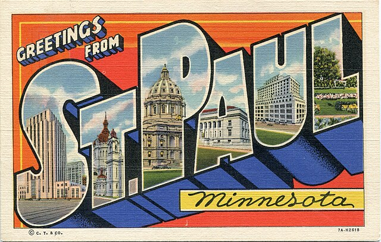
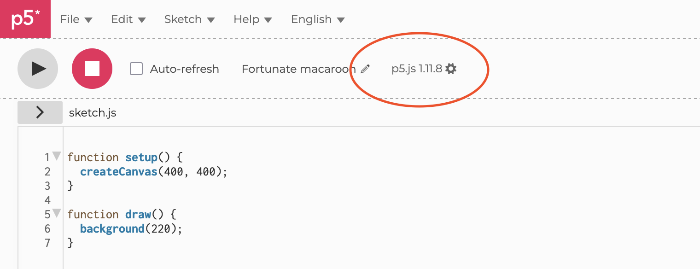
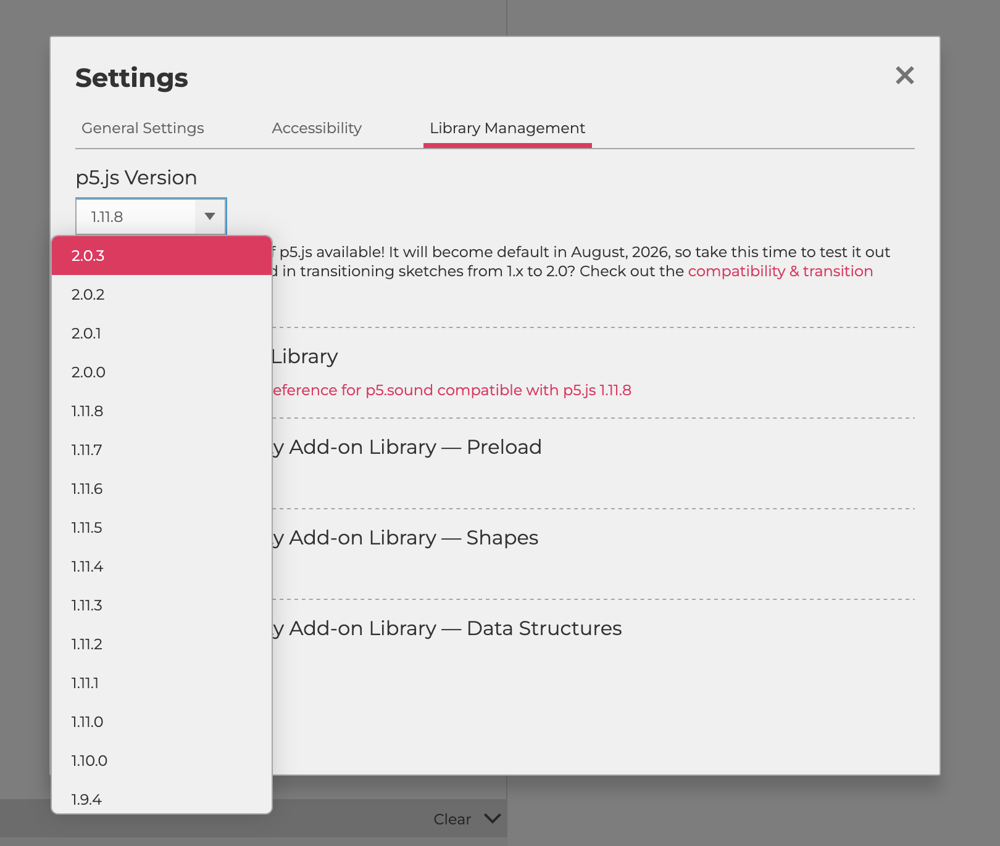
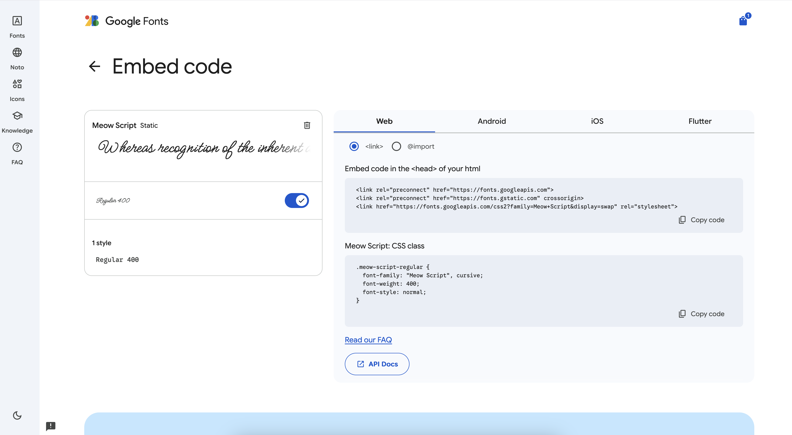

import EditableSketch from "../../../components/EditableSketch/index.astro";
import Callout from "../../../components/Callout/index.astro";
import SketchEmbed from "../../../components/SketchEmbed/index.astro";

p5.js 2.0 comes with some new tools for creative coding with typography. Let's use them to create a virtual, interactive postcard!

A common theme in old postcards is to have large block letters with local imagery showing through. Here's [an example of such a postcard](https://commons.wikimedia.org/wiki/File:Greetings_from_St._Paul,_Minnesota_postcard.jpg) from 1937:



We'll try to make something like this using the tools in p5.js 2.0!

The first step is to open an editor like [the p5.js Web Editor](https://editor.p5js.org) and change the version to 2.0. In the Web Editor, you can do that by clicking on the version in the header, and then picking the latest 2.0 version from the version dropdown.





## WebGL mode

We'll use some of p5.js 2.0's 3D features to do our block letters, so we'll create a **WebGL** canvas. We can also change the size to 600 by 400, a landscape aspect ratio for a postcard.

When debugging a 3D sketch, adding `orbitControl()` lets us click and drag to rotate the things we've drawn. If you run the sketch now, you'll see a box that you can spin around by clicking and dragging.

<EditableSketch code={`
function setup() {
  /////////////////////////////////////////////////////
  // Switch to WEBGL mode at postcard size
  /////////////////////////////////////////////////////
  createCanvas(600, 400, WEBGL);
}

function draw() {
  background(255);
  
  /////////////////////////////////////////////////////
  // Draw a box that you can orbit around
  /////////////////////////////////////////////////////
  orbitControl();
  box(50);
}
`} />

## 2D Text

To load something in version 2.0, we turn our setup function into an `async` function. Then we can `await` something that needs to load, like [`loadFont`](/reference/p5/loadfont), and assign it to a variable:

```js
/////////////////////////////////////////////////////
// Add `async` to setup
/////////////////////////////////////////////////////
async function setup() {
  createCanvas(600, 400, WEBGL);
  
  /////////////////////////////////////////////////////
  // Load fonts with `await`
  /////////////////////////////////////////////////////
  cursiveFont = await loadFont(
    "https://fonts.googleapis.com/css2?family=Meow+Script&display=swap"
  );
}
```

Let's load a font in our sketch! You can always upload your own font file and then load that, but we can also load a font directly from [Google Fonts](https://fonts.google.com/), a large font resource. In order to load fonts in the format Google Fonts uses, we need to add the `p5.woff2` addon by adding a script tag to our `index.html`:

```html
<!DOCTYPE html>
<html lang="en"><head>
    <script src="https://cdn.jsdelivr.net/npm/p5@2.0.3/lib/p5.js"></script>

    <!-- Add the p5.woff2 library with the line below: -->
    <script src="https://cdn.jsdelivr.net/npm/p5.woff2@0.0.3/lib/p5.woff2.js"></script>

    <link rel="stylesheet" type="text/css" href="style.css">
    <meta charset="utf-8">

  </head>
  <body>
    <main>
    </main>
    <script src="sketch.js"></script>

</body></html>
```

Now, let's [go to Google Fonts](https://fonts.google.com/), and browse for one that you like. I'm going to use a cursive font for the smaller text on the postcard, so I've used [Meow Script](https://fonts.google.com/specimen/Meow+Script). If you find a font you like, click Get Font, and then click Get Embed Code, you'll see something like this:



In the first code block, we can grab the URL from that last `<link>` tag and use that in `loadFont`.

Once we've loaded a font, we can draw text using it! `textFont(yourFont)` is used to set the font, and `text("something", x, y)` is used to draw text at a given position. You can choose how the text is aligned relative to that position with `textAlign`. Here, I'm using that position to define the top left of the text.

When we're drawing the text, we might want to position it and color it without affecting the rest of our code. When you sandwich a block of code between `push()` and `pop()`, p5 will contain any settings you change within just that block, leaving the rest unaffected.

<Callout>
Try taking out the `push` and `pop`. You'll see that the `fill(0)` starts to affect the box too.
</Callout>

<EditableSketch scripts={['https://cdn.jsdelivr.net/npm/p5.woff2@0.0.3/lib/p5.woff2.js']} code={`
/////////////////////////////////////////////////////
// Create variables to store the font, and to
// control the font size
/////////////////////////////////////////////////////
let cursiveFont;
let cursiveTextSize = 40;

/////////////////////////////////////////////////////
// Add \`async\` to setup
/////////////////////////////////////////////////////
async function setup() {
  createCanvas(600, 400, WEBGL);
  
  /////////////////////////////////////////////////////
  // Load a font URL from Google Fonts
  /////////////////////////////////////////////////////
  cursiveFont = await loadFont(
    "https://fonts.googleapis.com/css2?family=Meow+Script&display=swap"
  );
}

function draw() {
  background(255);
  
  orbitControl();
  
  /////////////////////////////////////////////////////
  // Between a push() and pop(), set text settings,
  // and then draw text
  /////////////////////////////////////////////////////
  push();
  textFont(cursiveFont);
  textSize(cursiveTextSize);
  fill(0);
  textAlign(LEFT, TOP);
  text("Greetings from", -width / 2 + 40, -height / 2 + 50);
  pop();
  
  box(50);
}
`} />

## 3D text

In p5.js 2.0, we can make 3D letters out of a font! We'll create three new variables at the top: `blockFont` to store a font for the main text, `blockTextSize` to control the font size, and `greeting` to control the words in the block text. This will let us change it easily later.

```js
let blockFont;
let blockText;
let blockTextSize = 130;
let greeting = 'P5.JS 2.0';
```

The bold version of [Tilt Warp from Google Fonts](https://fonts.google.com/specimen/Tilt+Warp) will work nicely for some block text, so we'll load that the same way we loaded the cursive font, storing it into `blockFont`.

```js
blockFont = await loadFont('https://fonts.googleapis.com/css2?family=Tilt+Warp&display=swap');
```


Then, we'll use [`textToModel`](/reference/p5.font/texttomodel/) to extrude the text into a 3D model. It takes in some text, x and y coordinates, and then an extra settings object controlling the smoothness of the text and how thick the extruded model should be.

We'll also set make sure the text is center aligned with `textAlign(CENTER)` and sized correctly with `textSize(textBlockSize)` before we create the model.

Finally, we'll draw the model instead of a box with `model(blockText)`.

<Callout>
Try using different `extrude` distances to change the thickness, and higher `sampleFactor` values to make smoother shapes (lower values will be coarser, and higher values will be smoother.)
</Callout>

<EditableSketch scripts={['https://cdn.jsdelivr.net/npm/p5.woff2@0.0.3/lib/p5.woff2.js']} code={`
let cursiveFont;
let cursiveTextSize = 40;

/////////////////////////////////////////////////////
// Create variables to store the block text font,
// the model, the text size, and its text content
/////////////////////////////////////////////////////
let blockFont;
let blockText;
let blockTextSize = 130;
let greeting = 'P5.JS 2.0';

async function setup() {
  createCanvas(600, 400, WEBGL);
  cursiveFont = await loadFont(
    "https://fonts.googleapis.com/css2?family=Meow+Script&display=swap"
  );
  
  /////////////////////////////////////////////////////
  // Load a second font
  /////////////////////////////////////////////////////
  blockFont = await loadFont('https://fonts.googleapis.com/css2?family=Tilt+Warp&display=swap');
  
  /////////////////////////////////////////////////////
  // Convert the text into a 3D model
  /////////////////////////////////////////////////////
  textAlign(CENTER, CENTER);
  textSize(blockTextSize);
  blockText = blockFont.textToModel(greeting, 0, 0, {
    extrude: 100,
    sampleFactor: 0.25,
  });
}

function draw() {
  background(255);
  
  orbitControl();
  
  push();
  textFont(cursiveFont);
  textSize(cursiveTextSize);
  fill(0);
  textAlign(LEFT, TOP);
  text("Greetings from", -width / 2 + 40, -height / 2 + 50);
  pop();
  
  /////////////////////////////////////////////////////
  // Instead of drawing a box, draw our text model
  /////////////////////////////////////////////////////
  model(blockText);
}
`} />

## Drawing a background image

Let's start adding images and color to make this look like a real postcard! I grabbed an image URL from [Wikimedia Commons](https://commons.wikimedia.org/wiki/Main_Page), a great source of [Creative Commons](https://creativecommons.org/) assets that you can use in your projects.

Like fonts, we need to create a variable at the top to store your image, and then assign to it inside `setup`. Since it's an image, we'll use `await loadImage(...)` rather than `loadFont` like before.

We'll draw it to the canvas in `draw()`. `imageMode(CENTER)` lets us position the image via the coordinate of its center rather than its top left. We then can draw an image using `image(img, x, y)`. To make it fill the canvas, we can use `image(x, y, width, height)`, but it will stretch and distort the image to do so. By specifying the position and size on the original image after that and adding `COVER` at the end, we can fill the destination area without distortion. (`CONTAIN` would fit the image snugly in the destination area without cutting off any of the original image.)

<EditableSketch scripts={['https://cdn.jsdelivr.net/npm/p5.woff2@0.0.3/lib/p5.woff2.js']} code={`
let blockFont;
let cursiveFont;
let blockText;

let blockTextSize = 130;
let cursiveTextSize = 40;
let greeting = 'P5.JS 2.0';

/////////////////////////////////////////////////////
// Create a variable to store the background image
/////////////////////////////////////////////////////
let bgImg;

async function setup() {
  createCanvas(600, 400, WEBGL);
  blockFont = await loadFont('https://fonts.googleapis.com/css2?family=Tilt+Warp&display=swap');
  cursiveFont = await loadFont(
    "https://fonts.googleapis.com/css2?family=Meow+Script&display=swap"
  );
  
  /////////////////////////////////////////////////////
  // Load the background image with loadImage
  /////////////////////////////////////////////////////
  bgImg = await loadImage('https://upload.wikimedia.org/wikipedia/commons/thumb/f/fd/Vancouver_%28BC%2C_Canada%29%2C_Canada_Place_--_2022_--_1906.jpg/640px-Vancouver_%28BC%2C_Canada%29%2C_Canada_Place_--_2022_--_1906.jpg');
  
  textAlign(CENTER, CENTER);
  textSize(blockTextSize);
  blockText = blockFont.textToModel(greeting, 0, 0, {
    extrude: 100,
    sampleFactor: 0.25,
  });
}

function draw() {
  background(255);
  /////////////////////////////////////////////////////
  // Draw the background image, filling the canvas
  /////////////////////////////////////////////////////
  imageMode(CENTER);
  image(
    bgImg,
    0, 0, width, height, // Destination size
    0, 0, bgImg.width, bgImg.height, // Source size
    COVER // Fill the area without distortion
  );
  
  orbitControl();
  
  push();
  textFont(cursiveFont);
  textSize(cursiveTextSize);
  fill(0);
  textAlign(LEFT, TOP);
  text("Greetings from", -width / 2 + 40, -height / 2 + 50);
  pop();
  
  model(blockText);
}
`} />

## Layering

To make the text more readable on the background, let's darken the background image.

In 2D mode, we use something called the [painter's algorithm](https://en.wikipedia.org/wiki/Painter%27s_algorithm) to draw with layers: anything you draw in your code goes on top of things drawn before it. In WebGL mode, although things are a little more complicated with 3D elements, you can still use the painter's algorithm! When you draw two things at the same depth, the latest one you draw goes on top.

So, after we've drawn the background image, we can draw a semitransparent black rectangle on top of it to darken it. We remove the stroke with `noStroke()` and set the fill with `fill()` before drawing a rectangular `plane()` that fills the canvas. `fill(0, 100)` sets the fill color to semitransparent black. If you need to brighten the background, you might use semitransparent white with `fill(255, 100)`. Tinker with the second parameter, the opacity between 0 and 255, to get the right amount of contrast for your text.

I've also updated the greeting text to be white with `fill(255)`.

<Callout title="Note">
In WebGL mode, if you want to treat 3D content like a flat 2D image, you can flatten it by calling `clearDepth()` after you draw it. Then, everything you draw next will go on top of it, regardless of its depth.
</Callout>

<EditableSketch scripts={['https://cdn.jsdelivr.net/npm/p5.woff2@0.0.3/lib/p5.woff2.js']} code={`
let blockFont;
let cursiveFont;
let blockText;

let blockTextSize = 130;
let cursiveTextSize = 40;
let greeting = 'P5.JS 2.0';

let bgImg;

async function setup() {
  createCanvas(600, 400, WEBGL);
  blockFont = await loadFont('https://fonts.googleapis.com/css2?family=Tilt+Warp&display=swap');
  cursiveFont = await loadFont(
    "https://fonts.googleapis.com/css2?family=Meow+Script&display=swap"
  );
  bgImg = await loadImage('https://upload.wikimedia.org/wikipedia/commons/thumb/f/fd/Vancouver_%28BC%2C_Canada%29%2C_Canada_Place_--_2022_--_1906.jpg/640px-Vancouver_%28BC%2C_Canada%29%2C_Canada_Place_--_2022_--_1906.jpg');
  
  textAlign(CENTER, CENTER);
  textSize(blockTextSize);
  blockText = blockFont.textToModel(greeting, 0, 0, {
    extrude: 100,
    sampleFactor: 0.25,
  });
}

function draw() {
  background(255);
  imageMode(CENTER);
  image(
    bgImg,
    0, 0, width, height, // Destination size
    0, 0, bgImg.width, bgImg.height, // Source size
    COVER // Fill the area without distortion
  );
  
  /////////////////////////////////////////////////////
  // Draw a semitransparent black rectangle
  /////////////////////////////////////////////////////
  push();
  noStroke();
  fill(0, 100);
  plane(width, height);
  pop();
  
  orbitControl();
  
  push();
  textFont(cursiveFont);
  textSize(cursiveTextSize);
  fill(255);
  textAlign(LEFT, TOP);
  text("Greetings from", -width / 2 + 40, -height / 2 + 50);
  pop();
  
  model(blockText);
}
`} />

## 3D rotation

Let's start to position the 3D text the way we'd see it in a postcard: a little lower in the canvas, and at an angle. To do this, we wrap the `model(blockText)` call in a `push()` and a `pop()`, and then we can start using `rotateX()` and `rotateY()` to tilt it.

<Callout title="Note">
By default, `rotateX()` and other rotation functions take angles in radians, so passing in `PI` as an angle will flip something backwards. Often, you'll use `PI * 0.1` or somet other fraction to get a smaller rotation.
</Callout>

At this point, the text starts clipping through the background image. We can replace the `orbitControl()` line with `clearDepth()`, which tells p5 to flatten everything drawn before it into a flat background that will go behind anything you draw next.

<EditableSketch scripts={['https://cdn.jsdelivr.net/npm/p5.woff2@0.0.3/lib/p5.woff2.js']} code={`
let blockFont;
let cursiveFont;
let blockText;

let blockTextSize = 130;
let cursiveTextSize = 40;
let greeting = 'P5.JS 2.0';

let bgImg;

async function setup() {
  createCanvas(600, 400, WEBGL);
  blockFont = await loadFont('https://fonts.googleapis.com/css2?family=Tilt+Warp&display=swap');
  cursiveFont = await loadFont(
    "https://fonts.googleapis.com/css2?family=Meow+Script&display=swap"
  );
  bgImg = await loadImage('https://upload.wikimedia.org/wikipedia/commons/thumb/f/fd/Vancouver_%28BC%2C_Canada%29%2C_Canada_Place_--_2022_--_1906.jpg/640px-Vancouver_%28BC%2C_Canada%29%2C_Canada_Place_--_2022_--_1906.jpg');
  
  textAlign(CENTER, CENTER);
  textSize(blockTextSize);
  blockText = blockFont.textToModel(greeting, 0, 0, {
    extrude: 100,
    sampleFactor: 0.25,
  });
}

function draw() {
  background(255);
  imageMode(CENTER);
  image(
    bgImg,
    0, 0, width, height, // Destination size
    0, 0, bgImg.width, bgImg.height, // Source size
    COVER // Fill the area without distortion
  );
  
  push();
  noStroke();
  fill(0, 100);
  plane(width, height);
  pop();
  
  /////////////////////////////////////////////////////
  // Remove orbitControl(), and clear the 3D depth
  /////////////////////////////////////////////////////
  clearDepth();
  
  push();
  textFont(cursiveFont);
  textSize(cursiveTextSize);
  fill(255);
  textAlign(LEFT, TOP);
  text("Greetings from", -width / 2 + 40, -height / 2 + 50);
  pop();
  
  /////////////////////////////////////////////////////
  // Wrap the model(...) call in push and pop, and
  // apply rotation in two axes
  /////////////////////////////////////////////////////
  push();
  translate(0, 40);
  rotateX(PI * 0.1);
  rotateY(PI * 0.1);
  model(blockText);
  pop();
}
`} />

## Lighting

For the block text, we want to show a photo through the letters, but have the sides be darker to keep the letter forms visible.

To start with, let's remove the stroke on it with `noStroke()`. Then, we'll turn on 3D lighting by using two light functions:

- [`ambientLight()`](/reference/p5/ambientlight) controls how bright a model is when no direct light hits it. By setting it to 0, anything facing away from the light will be black.
- [`directionalLight()`](/reference/p5/directionallight) casts light with a given color in a direction specified by `x`, `y`, and `z` coordinates. Here, we're casing two: one directly into the canvas, and one slightly left.

<EditableSketch scripts={['https://cdn.jsdelivr.net/npm/p5.woff2@0.0.3/lib/p5.woff2.js']} code={`
let blockFont;
let cursiveFont;
let blockText;

let blockTextSize = 130;
let cursiveTextSize = 40;
let greeting = 'P5.JS 2.0';

let bgImg;

async function setup() {
  createCanvas(600, 400, WEBGL);
  blockFont = await loadFont('https://fonts.googleapis.com/css2?family=Tilt+Warp&display=swap');
  cursiveFont = await loadFont(
    "https://fonts.googleapis.com/css2?family=Meow+Script&display=swap"
  );
  bgImg = await loadImage('https://upload.wikimedia.org/wikipedia/commons/thumb/f/fd/Vancouver_%28BC%2C_Canada%29%2C_Canada_Place_--_2022_--_1906.jpg/640px-Vancouver_%28BC%2C_Canada%29%2C_Canada_Place_--_2022_--_1906.jpg');
  
  textAlign(CENTER, CENTER);
  textSize(blockTextSize);
  blockText = blockFont.textToModel(greeting, 0, 0, {
    extrude: 100,
    sampleFactor: 0.25,
  });
}

function draw() {
  background(255);
  imageMode(CENTER);
  image(
    bgImg,
    0, 0, width, height, // Destination size
    0, 0, bgImg.width, bgImg.height, // Source size
    COVER // Fill the area without distortion
  );
  
  push();
  noStroke();
  fill(0, 100);
  plane(width, height);
  pop();
  
  clearDepth();
  
  push();
  textFont(cursiveFont);
  textSize(cursiveTextSize);
  fill(255);
  textAlign(LEFT, TOP);
  text("Greetings from", -width / 2 + 40, -height / 2 + 50);
  pop();
  
  push();
  translate(0, 40);
  rotateX(PI * 0.1);
  rotateY(PI * 0.1);
  /////////////////////////////////////////////////////
  // Remove stroke and add lighting
  /////////////////////////////////////////////////////
  noStroke();
  ambientLight(0);
  directionalLight(color("#FFFFFF"), 0, 0, -1);
  directionalLight(color("#FFFFFF"), -0.2, 0, -1);
  model(blockText);
  pop();
}
`} />

## Texture with a custom material

Now, let's make an image show through the block text! First, we need to load another image, similar to what we did before for the background.

Generally, when you want to use an image as a texture on some 3D content, you can use the `texture()` function. It doesn't seem to work for 3D text, though, even though it works for other 3D content such as a `sphere()`. So what's going on?

<EditableSketch code={`
let img;
async function setup() {
  createCanvas(200, 200, WEBGL);
  img = await loadImage('https://upload.wikimedia.org/wikipedia/commons/thumb/d/df/Grouse_mountain_%28ski_runs_close_up%29.JPG/640px-Grouse_mountain_%28ski_runs_close_up%29.JPG');
}
function draw() {
  background(255);
  orbitControl();
  noStroke();
  // Texturing the sphere works:
  texture(img);
  sphere(80);
}
`} />

<EditableSketch scripts={['https://cdn.jsdelivr.net/npm/p5.woff2@0.0.3/lib/p5.woff2.js']} code={`
let img;
let blockText;
async function setup() {
  createCanvas(200, 200, WEBGL);
  img = await loadImage('https://upload.wikimedia.org/wikipedia/commons/thumb/d/df/Grouse_mountain_%28ski_runs_close_up%29.JPG/640px-Grouse_mountain_%28ski_runs_close_up%29.JPG');
  let blockFont = await loadFont('https://fonts.googleapis.com/css2?family=Tilt+Warp&display=swap');
  textAlign(CENTER, CENTER);
  textSize(75);
  blockText = blockFont.textToModel('TEST', 0, 0, { extrude: 100, sampleFactor: 0.25 });
}
function draw() {
  background(255);
  orbitControl();
  noStroke();
  // Texturing the 3D text does not!
  texture(img);
  model(blockText);
}
`} />

3D content can optionally come with **texture coordinates** that specify, for each vertex in 3D space on the model, what 2D coordinate on the texture should be pinned to that vertex. Built-in p5 shapes like `sphere()` and `box()` come with some, but `textToModel` does not, so we end up with the top left pixel getting stretched over the whole model.

But that's ok! To get a texture to show through the text, we can make our own **custom shader material** to specify the texture coordinates.

When you draw shapes and models in WebGL mode, they get drawn with a **shader** to control their material. A shader is responsible for positioning all the points on the shape, and for coloring the faces of the shape. There are some built-in ones you can use -- by default, it's using a material shader, but you can try calling `normalMaterial()` before a call to `model()` or another 3D shape function to see another one that picks colors based on the orientation of the surface (its ["normal"](https://en.wikipedia.org/wiki/Normal_(geometry))) of a model.

<EditableSketch code={`
function setup() {
  createCanvas(200, 200, WEBGL);
}
function draw() {
  background(255);
  orbitControl();
  // Draw using the default material
  sphere(80);
}
`} />

<EditableSketch code={`
function setup() {
  createCanvas(200, 200, WEBGL);
}
function draw() {
  background(255);
  orbitControl();
  // Draw using a material visualizing the surface normal
  normalMaterial();
  sphere(80);
}
`} />

So, to map the image onto our 3D text, we'll create a custom shader. We'll declare a variable for it at the top and then create it in `setup()`. All we need to do is modify the default material but tell it how to create texture coordinates.

To do that, we'll use `baseMaterialShader().modify(...)`. This lets us tap into the default shader and choose what parts to modify. We just want to project the image onto the text as we see it, so we'll modify the inputs to the shader in world space, which takes transforms into account, by defining the `getWorldInputs` hook.

<Callout>
Try changing `getWorldInputs` to `getObjectInputs` later to see what the texture mapping looks like without the rotation applied!
</Callout>

Each hook takes in an inputs object for us to modify and return. Texture coordinates need to be in a `[0, 1]` range. The position of each vertex will be between `[-width/2, width/2]` in the x axis and `[-height/2, height/2]` in the y axis. So to map that to `[0, 1]`, we can divide by the width and height and add 0.5.

We can use our material at the bottom by setting `shader(textureMaterial)`. This will use our custom texture mapping, so we can then supply the texture to use by adding `texture(fgImg)`.

<EditableSketch scripts={['https://cdn.jsdelivr.net/npm/p5.woff2@0.0.3/lib/p5.woff2.js']} code={`
let img;
let blockText;
let textureMaterial;
async function setup() {
  createCanvas(200, 200, WEBGL);
  img = await loadImage('https://upload.wikimedia.org/wikipedia/commons/thumb/d/df/Grouse_mountain_%28ski_runs_close_up%29.JPG/640px-Grouse_mountain_%28ski_runs_close_up%29.JPG');
  let blockFont = await loadFont('https://fonts.googleapis.com/css2?family=Tilt+Warp&display=swap');
  textAlign(CENTER, CENTER);
  textSize(75);
  blockText = blockFont.textToModel('TEST', 0, 0, { extrude: 100, sampleFactor: 0.25 });

  textureMaterial = baseMaterialShader().modify(() => {
    getWorldInputs((inputs) => {
      let size = [200, 200]; // width and height
      inputs.texCoord = inputs.position.xy/size + 0.5;
      return inputs;
    });
  });
}
function draw() {
  background(255);
  orbitControl();
  noStroke();
  shader(textureMaterial);
  texture(img);
  model(blockText);
}
`} />

Here's how it looks in context:

<EditableSketch scripts={['https://cdn.jsdelivr.net/npm/p5.woff2@0.0.3/lib/p5.woff2.js']} code={`
let blockFont;
let cursiveFont;
let blockText;

let blockTextSize = 130;
let cursiveTextSize = 40;
let greeting = 'P5.JS 2.0';

let bgImg;
/////////////////////////////////////////////////////
// Create a variable to store the foreground image
/////////////////////////////////////////////////////
let fgImg;

/////////////////////////////////////////////////////
// Create a variable to store the material in
/////////////////////////////////////////////////////
let textureMaterial;

async function setup() {
  createCanvas(600, 400, WEBGL);
  blockFont = await loadFont('https://fonts.googleapis.com/css2?family=Tilt+Warp&display=swap');
  cursiveFont = await loadFont(
    "https://fonts.googleapis.com/css2?family=Meow+Script&display=swap"
  );
  bgImg = await loadImage('https://upload.wikimedia.org/wikipedia/commons/thumb/f/fd/Vancouver_%28BC%2C_Canada%29%2C_Canada_Place_--_2022_--_1906.jpg/640px-Vancouver_%28BC%2C_Canada%29%2C_Canada_Place_--_2022_--_1906.jpg');
  /////////////////////////////////////////////////////
  // Load the foreground image
  /////////////////////////////////////////////////////
  fgImg = await loadImage('https://upload.wikimedia.org/wikipedia/commons/thumb/0/0b/Grouse_Mountain_%288598307419%29.jpg/960px-Grouse_Mountain_%288598307419%29.jpg?20210319145510');
  
  textAlign(CENTER, CENTER);
  textSize(blockTextSize);
  blockText = blockFont.textToModel(greeting, 0, 0, {
    extrude: 100,
    sampleFactor: 0.25,
  });
  
  /////////////////////////////////////////////////////
  // Create a material
  /////////////////////////////////////////////////////
  textureMaterial = baseMaterialShader().modify(() => {
    getWorldInputs((inputs) => {
      let size = [600, 400];
      inputs.texCoord = inputs.position.xy/size + 0.5;
      return inputs;
    });
  });
}

function draw() {
  background(255);
  imageMode(CENTER);
  image(
    bgImg,
    0, 0, width, height, // Destination size
    0, 0, bgImg.width, bgImg.height, // Source size
    COVER // Fill the area without distortion
  );
  
  push();
  noStroke();
  fill(0, 100);
  plane(width, height);
  pop();
  
  clearDepth();
  
  push();
  textFont(cursiveFont);
  textSize(cursiveTextSize);
  fill(255);
  textAlign(LEFT, TOP);
  text("Greetings from", -width / 2 + 40, -height / 2 + 50);
  pop();
  
  push();
  translate(0, 40);
  rotateX(PI * 0.1);
  rotateY(PI * 0.1);
  noStroke();
  ambientLight(0);
  directionalLight(color("#FFFFFF"), 0, 0, -1);
  directionalLight(color("#FFFFFF"), -0.2, 0, -1);
  
  /////////////////////////////////////////////////////
  // Apply the foreground image as a texture, and
  // use the foreground material
  /////////////////////////////////////////////////////
  texture(fgImg);
  shader(textureMaterial);
  model(blockText);
  pop();
}
`} />

## Adding paper texture to the canvas

To give the whole composition an aged look, let's apply a paper texture to it. Like our other images, we can create a variable for it at the top, and then import it in `setup()`. I've grabbed another image from Wikimedia Commons.


To apply it, at the end of `draw()`, we'll first use `clearDepth()` to flatten the 3D content so we can do 2D techniques again. Between a `push()` and `pop()`, we'll **set the `blendMode()` to `MULTIPLY`** to multiply the image's colors with the content below. We'll then draw the paper image the same way we drew the background image.

<Callout>
Is the `MULTIPLY` blend mode darkening your image too much? Try changing the blend mode to `ADD` instead. Try out the [other available blend modes](/reference/p5/blendmode) for other interesting effects!
</Callout>

If your paper texture image is darkening the resulting image too much, we can draw it semi-transparent. Before calling `image()`, we can use `tint(255 255, 255, 100)` (or equivalently, `tint(255, 100)` for short) to tint it semitransparent. A tint darkens the color channels of your image: `tint(255, 0, 0)` leaves the red channel as-is and sets the others to 0 to make your image look red. To just reduce transparency, you can leave all channels at 255 except for the opacity channel, which we can reduce.

<EditableSketch scripts={['https://cdn.jsdelivr.net/npm/p5.woff2@0.0.3/lib/p5.woff2.js']} code={`
let blockFont;
let cursiveFont;
let blockText;

let blockTextSize = 130;
let cursiveTextSize = 40;
let greeting = 'P5.JS 2.0';

let bgImg;
let fgImg;
/////////////////////////////////////////////////////
// Create a variable for the paper image
/////////////////////////////////////////////////////
let paperImg;

let textureMaterial;

async function setup() {
  createCanvas(600, 400, WEBGL);
  blockFont = await loadFont('https://fonts.googleapis.com/css2?family=Tilt+Warp&display=swap');
  cursiveFont = await loadFont(
    "https://fonts.googleapis.com/css2?family=Meow+Script&display=swap"
  );
  bgImg = await loadImage('https://upload.wikimedia.org/wikipedia/commons/thumb/f/fd/Vancouver_%28BC%2C_Canada%29%2C_Canada_Place_--_2022_--_1906.jpg/640px-Vancouver_%28BC%2C_Canada%29%2C_Canada_Place_--_2022_--_1906.jpg');
  fgImg = await loadImage('https://upload.wikimedia.org/wikipedia/commons/thumb/0/0b/Grouse_Mountain_%288598307419%29.jpg/960px-Grouse_Mountain_%288598307419%29.jpg?20210319145510');
  /////////////////////////////////////////////////////
  // Load the paper image
  /////////////////////////////////////////////////////
  paperImg = await loadImage('https://upload.wikimedia.org/wikipedia/commons/thumb/6/6e/Brown_paper_bag_texture.jpg/640px-Brown_paper_bag_texture.jpg');
  
  textAlign(CENTER, CENTER);
  textSize(blockTextSize);
  blockText = blockFont.textToModel(greeting, 0, 0, {
    extrude: 100,
    sampleFactor: 0.25,
  });
  
  textureMaterial = baseMaterialShader().modify(() => {
    getWorldInputs((inputs) => {
      let size = [600, 400];
      inputs.texCoord = inputs.position.xy/size + 0.5;
      return inputs;
    });
  });
}

function draw() {
  background(255);
  imageMode(CENTER);
  image(
    bgImg,
    0, 0, width, height, // Destination size
    0, 0, bgImg.width, bgImg.height, // Source size
    COVER // Fill the area without distortion
  );
  
  push();
  noStroke();
  fill(0, 100);
  plane(width, height);
  pop();
  
  clearDepth();
  
  push();
  textFont(cursiveFont);
  textSize(cursiveTextSize);
  fill(255);
  textAlign(LEFT, TOP);
  text("Greetings from", -width / 2 + 40, -height / 2 + 50);
  pop();
  
  push();
  translate(0, 40);
  rotateX(PI * 0.1);
  rotateY(PI * 0.1);
  noStroke();
  ambientLight(0);
  directionalLight(color("#FFFFFF"), 0, 0, -1);
  directionalLight(color("#FFFFFF"), -0.2, 0, -1);
  
  texture(fgImg);
  shader(textureMaterial);
  model(blockText);
  pop();
  
  /////////////////////////////////////////////////////
  // Clear the depth again, and blend the paper image
  // on top of everything
  /////////////////////////////////////////////////////
  clearDepth();
  push();
  blendMode(MULTIPLY);
  tint(255, 100);
  image(
    paperImg,
    0, 0, width, height, // Destination size
    0, 0, paperImg.width, paperImg.height, // Source size
    COVER // Fill the area without distortion
  );
  pop();
}
`} />

## Living on the web: screen reader accessibility

We've got a nice looking postcard already! But since this isn't going to be a physical postcard--we're going to put it on a website--we want viewers who use screen readers to be able to tell what's on the canvas.

To do so, we can use `describe()` in setup, and write a short, descriptive string about what we've drawn.

```js
describe(`An old postcard that says, "Greetings from ${greeting}"`);
```

## Adding animation

Since this is a digital postcard, we can make it animated!

When designing motion, **entrance/exit animations** happen as something is introduced into the canvas or leaves the canvas. While it's visible, you might also want to add a **continuous animation**  to keep it looking alive, often layered on top of your entrance/exit to avoid unnaturally rigid transitions between states. You might also consider having **staggering the animation of each item** so that they overlap but with an offset, giving it a looser feel.

Animation in p5 is based on either the current time in milliseconds, accessed via `millis()`, or the current frame number, accessed via `frameCount`. By default, p5 tries to run at 60 frames per second (although you can change that with something like `frameRate(30)` in setup.) In all cases, we'll be mapping the time or frame number to a value that we want to animate.

### Continuous animation

A quick way to animate a 3D model all at once is in its material shader, where we can update all the vertex positions at once on the GPU. First, we need to pass the time into the shader. A uniform links a JavaScript variable to a value we can use in a shader, so we can create a uniformFloat that returns the current time. Using that, we can set a new value of inputs.position that adds a sine wave based on the time and the position x value.

```js
textureMaterial = baseMaterialShader().modify(() => {
  // Pass the current time into the shader
  const t = uniformFloat(() => millis());
  getWorldInputs((inputs) => {
    let size = [600, 400];
    inputs.texCoord = inputs.position.xy/size + 0.5;
    // Update vertex positions over time
    inputs.position = [
      inputs.position.x,
      inputs.position.y + 20 * sin(t * 0.001 + inputs.position.x * 0.01),
      inputs.position.z
    ]
    return inputs;
  });
});
```

Here's how that looks in context:

<SketchEmbed hideOffscreen scripts={['https://cdn.jsdelivr.net/npm/p5.woff2@0.0.3/lib/p5.woff2.js']} width={600} height={400} code={`
let blockFont;
let cursiveFont;
let blockText;

let blockTextSize = 130;
let cursiveTextSize = 40;
let greeting = 'P5.JS 2.0';

let bgImg;
let fgImg;
let paperImg;

let textureMaterial;

async function setup() {
  createCanvas(600, 400, WEBGL);
  blockFont = await loadFont('https://fonts.googleapis.com/css2?family=Tilt+Warp&display=swap');
  cursiveFont = await loadFont(
    "https://fonts.googleapis.com/css2?family=Meow+Script&display=swap"
  );
  bgImg = await loadImage('https://upload.wikimedia.org/wikipedia/commons/thumb/f/fd/Vancouver_%28BC%2C_Canada%29%2C_Canada_Place_--_2022_--_1906.jpg/640px-Vancouver_%28BC%2C_Canada%29%2C_Canada_Place_--_2022_--_1906.jpg');
  fgImg = await loadImage('https://upload.wikimedia.org/wikipedia/commons/thumb/0/0b/Grouse_Mountain_%288598307419%29.jpg/960px-Grouse_Mountain_%288598307419%29.jpg?20210319145510');
  paperImg = await loadImage('https://upload.wikimedia.org/wikipedia/commons/thumb/6/6e/Brown_paper_bag_texture.jpg/640px-Brown_paper_bag_texture.jpg');
  
  textAlign(CENTER, CENTER);
  textSize(blockTextSize);
  blockText = blockFont.textToModel(greeting, 0, 0, {
    extrude: 100,
    sampleFactor: 0.25,
  });
  
  textureMaterial = baseMaterialShader().modify(() => {
    /////////////////////////////////////////////////////
    // Pass the current time into the shader
    /////////////////////////////////////////////////////
    const t = uniformFloat(() => millis());
    getWorldInputs((inputs) => {
      let size = [600, 400];
      inputs.texCoord = inputs.position.xy/size + 0.5;
      /////////////////////////////////////////////////////
      // Update vertex positions over time
      /////////////////////////////////////////////////////
      inputs.position = [
        inputs.position.x,
        inputs.position.y + 20 * sin(t * 0.001 + inputs.position.x * 0.01),
        inputs.position.z
      ]
      return inputs;
    });
  });
  
  describe(\`An old postcard that says Greetings from... \${greeting}\`);
}

function draw() {
  background(255);
  imageMode(CENTER);
  image(
    bgImg,
    0, 0, width, height, // Destination size
    0, 0, bgImg.width, bgImg.height, // Source size
    COVER // Fill the area without distortion
  );
  
  push();
  noStroke();
  fill(0, 100);
  plane(width, height);
  pop();
  
  clearDepth();
  
  push();
  textFont(cursiveFont);
  textSize(cursiveTextSize);
  fill(255);
  textAlign(LEFT, TOP);
  text("Greetings from", -width / 2 + 40, -height / 2 + 50);
  pop();
  
  push();
  translate(0, 40);
  rotateX(PI * 0.1);
  rotateY(PI * 0.1);
  noStroke();
  ambientLight(0);
  directionalLight(color("#FFFFFF"), 0, 0, -1);
  directionalLight(color("#FFFFFF"), -0.2, 0, -1);
  
  texture(fgImg);
  shader(textureMaterial);
  model(blockText);
  pop();
  
  clearDepth();
  push();
  blendMode(MULTIPLY);
  tint(255, 100);
  image(
    paperImg,
    0, 0, width, height, // Destination size
    0, 0, paperImg.width, paperImg.height, // Source size
    COVER // Fill the area without distortion
  );
  pop();
}
`} />

### Entrance animation

We've seen how you can use `sin()` to make something continuously animate. But what if we just want to animate its entrance? Let's make our block text pop in.

A key concept here is **animation progress**, a value between 0 and 1. We need to turn the current time into a progress value. In p5, we can use `map(value, beforeA, beforeB, afterA, afterB, true)` to transform the current time from the 0-1000ms range to a 0-1 range. The `true` at the end of `map()` tells it to clamp it to that range, so it stays at 1 as we go past 1000ms. Here's how we can use that to animate a circle entering the canvas:

<EditableSketch code={`
function setup() {
  createCanvas(200, 200);
}

function draw() {
  background('white');
  fill('red');

  let progress = map(millis() % 3000, 1000, 2000, 0, 1, true);
  let x = lerp(-20, width/2, progress);
  circle(x, height/2, 20);
}
`} />

We could use that progress directly, but this produces linear motion which can look rather mechanical. We can run the linear progress through an **easing function** to get different styles of motion. An easing function takes in 0-1 linear progress and returns nonlinear progress. You can [copy-and-paste functions from this sketch](https://openprocessing.org/sketch/2676129) to try some out. Here, I've copied `easeOutElastic()`:

<EditableSketch code={`
function setup() {
  createCanvas(200, 200);
}

function easeOutElastic(t, magnitude = 0.7) {
  const p = 1 - magnitude;
  const scaledTime = t * 2;
  if ( t === 0 || t === 1 ) {
    return t;
  }
  const s = p / (2 * Math.PI) * Math.asin(1);
  return 2 ** (-10 * scaledTime)
    * Math.sin((scaledTime - s)
    * (2 * Math.PI) / p) + 1;
}

function draw() {
  background('white');
  fill('red');

  let progress = map(millis() % 3000, 1000, 2000, 0, 1, true);
  // Add easing:
  progress = easeOutElastic(progress);
  let x = lerp(-20, width/2, progress);
  circle(x, height/2, 20);
}
`} />

We can use that same `easeOutElastic` to animate a `scale()` that we apply before drawing the text model. That gives us this:

<EditableSketch scripts={['https://cdn.jsdelivr.net/npm/p5.woff2@0.0.3/lib/p5.woff2.js']} code={`
let blockFont;
let cursiveFont;
let blockText;

let blockTextSize = 130;
let cursiveTextSize = 40;
let greeting = 'P5.JS 2.0';

let bgImg;
let fgImg;
let paperImg;

let textureMaterial;

async function setup() {
  createCanvas(600, 400, WEBGL);
  blockFont = await loadFont('https://fonts.googleapis.com/css2?family=Tilt+Warp&display=swap');
  cursiveFont = await loadFont(
    "https://fonts.googleapis.com/css2?family=Meow+Script&display=swap"
  );
  bgImg = await loadImage('https://upload.wikimedia.org/wikipedia/commons/thumb/f/fd/Vancouver_%28BC%2C_Canada%29%2C_Canada_Place_--_2022_--_1906.jpg/640px-Vancouver_%28BC%2C_Canada%29%2C_Canada_Place_--_2022_--_1906.jpg');
  fgImg = await loadImage('https://upload.wikimedia.org/wikipedia/commons/thumb/0/0b/Grouse_Mountain_%288598307419%29.jpg/960px-Grouse_Mountain_%288598307419%29.jpg?20210319145510');
  paperImg = await loadImage('https://upload.wikimedia.org/wikipedia/commons/thumb/6/6e/Brown_paper_bag_texture.jpg/640px-Brown_paper_bag_texture.jpg');
  
  textAlign(CENTER, CENTER);
  textSize(blockTextSize);
  blockText = blockFont.textToModel(greeting, 0, 0, {
    extrude: 100,
    sampleFactor: 0.25,
  });
  
  textureMaterial = baseMaterialShader().modify(() => {
    const t = uniformFloat(() => millis());
    getWorldInputs((inputs) => {
      let size = [600, 400];
      inputs.texCoord = inputs.position.xy/size + 0.5;
      inputs.position = [
        inputs.position.x,
        inputs.position.y + 20 * sin(t * 0.001 + inputs.position.x * 0.01),
        inputs.position.z
      ]
      return inputs;
    });
  });
  
  describe(\`An old postcard that says Greetings from... \${greeting}\`);
}

/////////////////////////////////////////////////////
// Paste in an easing function
/////////////////////////////////////////////////////
function easeOutElastic(t, magnitude = 0.7) {
  const p = 1 - magnitude;
  const scaledTime = t * 2;

  if ( t === 0 || t === 1 ) {
    return t;
  }

  const s = p / (2 * Math.PI) * Math.asin(1);
  return 2 ** (-10 * scaledTime)
    * Math.sin((scaledTime - s)
    * (2 * Math.PI) / p) + 1;
}

function draw() {
  background(255);
  imageMode(CENTER);
  image(
    bgImg,
    0, 0, width, height, // Destination size
    0, 0, bgImg.width, bgImg.height, // Source size
    COVER // Fill the area without distortion
  );
  
  push();
  noStroke();
  fill(0, 100);
  plane(width, height);
  pop();
  
  clearDepth();
  
  push();
  textFont(cursiveFont);
  textSize(cursiveTextSize);
  fill(255);
  textAlign(LEFT, TOP);
  text("Greetings from", -width / 2 + 40, -height / 2 + 50);
  pop();
  
  push();
  translate(0, 40);
  rotateX(PI * 0.1);
  rotateY(PI * 0.1);
  noStroke();
  ambientLight(0);
  directionalLight(color("#FFFFFF"), 0, 0, -1);
  directionalLight(color("#FFFFFF"), -0.2, 0, -1);
  
  texture(fgImg);
  shader(textureMaterial);
  /////////////////////////////////////////////////////
  // Calculate entrance progress, and scale by it
  /////////////////////////////////////////////////////
  let progress = map(millis(), 0, 2000, 0, 1, true);
  progress = easeOutElastic(progress);
  scale(progress);
  model(blockText);
  pop();
  
  clearDepth();
  push();
  blendMode(MULTIPLY);
  tint(255, 100);
  image(
    paperImg,
    0, 0, width, height, // Destination size
    0, 0, paperImg.width, paperImg.height, // Source size
    COVER // Fill the area without distortion
  );
  pop();
}
`} />

### Staggered animation per letter

Right now, the whole text animates at once. If we want the text to feel less like a single object and more like the letters are connected with some give between them, we can animate each letter individually with staggered entrances. It will look like each letter has some inertia, and each one pulls the next along.

The first step is to work one letter at a time. We create a new `letters` variable where we split the greeting into an array of letters by calling `.split('')`. Then, we make `blockText` be an array of models instead of a single model by `map`ping each letter to a model.

```js
let letters = greeting.split('');

async function setup() {
  // ...

  blockText = letters.map((letter) => blockFont.textToModel(letter, 0, 0, {
    extrude: 100,
    sampleFactor: 0.25,
  }));

  // ...
}
```

    
 We have to draw and position each letter. We loop over each letter with forEach and position each one individually. We set the text size and font, and then use fontWidth to figure out how to move each letter. Starting from the left of the line, for each letter, we move halfway over to be in its center, draw model i, then move over the other half.

 Instead of using the same animation progress for each letter, we add a time offset for each one.

```js
function draw() {
  // ...

  // Start from the left of the line
  translate(-fontWidth(greeting)/2, 0);
  letters.forEach((letter, i) => {
    // Move to the center of the letter
    translate(fontWidth(letter) / 2, 0);

    // Calculate progress per letter
    let progress = map(millis(), i * 50, i * 50 + 2000, 0, 1, true);
    progress = easeOutElastic(progress);
    push();
    scale(progress);
    model(blockText[i]);
    pop();

    // Move to the left of the next letter
    translate(fontWidth(letter) / 2, 0);
  });
  // ...
}
```

<Callout>
Try experimenting with different offsets to see what kind of effect you get! I've used 50ms here.
</Callout>

<EditableSketch scripts={['https://cdn.jsdelivr.net/npm/p5.woff2@0.0.3/lib/p5.woff2.js']} code={`
let blockFont;
let cursiveFont;
let blockText;

let blockTextSize = 130;
let cursiveTextSize = 40;
let greeting = 'P5.JS 2.0';
/////////////////////////////////////////////////////
// Split the greeting text into an array of letters
/////////////////////////////////////////////////////
let letters = greeting.split('');

let bgImg;
let fgImg;
let paperImg;

let textureMaterial;

async function setup() {
  createCanvas(600, 400, WEBGL);
  blockFont = await loadFont('https://fonts.googleapis.com/css2?family=Tilt+Warp&display=swap');
  cursiveFont = await loadFont(
    "https://fonts.googleapis.com/css2?family=Meow+Script&display=swap"
  );
  bgImg = await loadImage('https://upload.wikimedia.org/wikipedia/commons/thumb/f/fd/Vancouver_%28BC%2C_Canada%29%2C_Canada_Place_--_2022_--_1906.jpg/640px-Vancouver_%28BC%2C_Canada%29%2C_Canada_Place_--_2022_--_1906.jpg');
  fgImg = await loadImage('https://upload.wikimedia.org/wikipedia/commons/thumb/0/0b/Grouse_Mountain_%288598307419%29.jpg/960px-Grouse_Mountain_%288598307419%29.jpg?20210319145510');
  paperImg = await loadImage('https://upload.wikimedia.org/wikipedia/commons/thumb/6/6e/Brown_paper_bag_texture.jpg/640px-Brown_paper_bag_texture.jpg');
  
  textAlign(CENTER, CENTER);
  textSize(blockTextSize);
  /////////////////////////////////////////////////////
  // Create a separate model per letter by mapping
  // the letters array
  /////////////////////////////////////////////////////
  blockText = letters.map((letter) => blockFont.textToModel(letter, 0, 0, {
    extrude: 100,
    sampleFactor: 0.25,
  }));
  
  textureMaterial = baseMaterialShader().modify(() => {
    const t = uniformFloat(() => millis());
    getWorldInputs((inputs) => {
      let size = [600, 400];
      inputs.texCoord = inputs.position.xy/size + 0.5;
      inputs.position = [
        inputs.position.x,
        inputs.position.y + 20 * sin(t * 0.001 + inputs.position.x * 0.01),
        inputs.position.z
      ]
      return inputs;
    });
  });
  
  describe(\`An old postcard that says Greetings from... \${greeting}\`);
}

function easeOutElastic(t, magnitude = 0.7) {
  const p = 1 - magnitude;
  const scaledTime = t * 2;

  if ( t === 0 || t === 1 ) {
    return t;
  }

  const s = p / (2 * Math.PI) * Math.asin(1);
  return 2 ** (-10 * scaledTime)
    * Math.sin((scaledTime - s)
    * (2 * Math.PI) / p) + 1;
}

function draw() {
  background(255);
  imageMode(CENTER);
  image(
    bgImg,
    0, 0, width, height, // Destination size
    0, 0, bgImg.width, bgImg.height, // Source size
    COVER // Fill the area without distortion
  );
  
  push();
  noStroke();
  fill(0, 100);
  plane(width, height);
  pop();
  
  clearDepth();
  
  push();
  textFont(cursiveFont);
  textSize(cursiveTextSize);
  fill(255);
  textAlign(LEFT, TOP);
  text("Greetings from", -width / 2 + 40, -height / 2 + 50);
  pop();
  
  push();
  translate(0, 40);
  rotateX(PI * 0.1);
  rotateY(PI * 0.1);
  noStroke();
  ambientLight(0);
  directionalLight(color("#FFFFFF"), 0, 0, -1);
  directionalLight(color("#FFFFFF"), -0.2, 0, -1);
  
  texture(fgImg);
  shader(textureMaterial);
  /////////////////////////////////////////////////////
  // Match the font and size from before
  /////////////////////////////////////////////////////
  textSize(blockTextSize);
  textFont(blockFont);
  /////////////////////////////////////////////////////
  // Draw the text by letter
  /////////////////////////////////////////////////////
  translate(-fontWidth(greeting)/2, 0);
  letters.forEach((letter, i) => {
    translate(fontWidth(letter) / 2, 0);
    /////////////////////////////////////////////////////
    // Calculate progress per letter
    /////////////////////////////////////////////////////
    let progress = map(millis(), i * 50, i * 50 + 2000, 0, 1, true);
    progress = easeOutElastic(progress);
    push();
    scale(progress);
    model(blockText[i]);
    pop();
    translate(fontWidth(letter) / 2, 0);
  });
  pop();
  
  clearDepth();
  push();
  blendMode(MULTIPLY);
  tint(255, 100);
  image(
    paperImg,
    0, 0, width, height, // Destination size
    0, 0, paperImg.width, paperImg.height, // Source size
    COVER // Fill the area without distortion
  );
  pop();
}
`} />

## Mouse interactivity

Let's make it so that when you mouse over each letter, the animation for that letter restarts! To do this, rather than having a **fixed** start time for each letter, we'll make a variable start time that we can update dynamically. We'll make a **variable** at the top with the start time for each letter, and then refer to those times in `draw()` when calculating the progress.

```js
let letterStartTimes = letters.map((letter, i) => i * 50);
```

Then, we can **update the start times** when the mouse is over each letter. To detect when the mouse is over a letter, we can figure out where on the screen each letter's center ends up after transforms are applied using `worldToScreen()`. We can then compare `worldToSCreen` return values to the mouse position, which is as `mouseX` and `mouseY`. If the distance between those coordinate is close enough, then we can say the mouse is over the letter.

```js
letters.forEach((letter, i) => {
  translate(fontWidth(letter) / 2, 0);
  
  /////////////////////////////////////////////////////
  // Convert the translated coordinate to screen space
  // and update the letter start time if it's close to
  // the mouse
  /////////////////////////////////////////////////////
  const screenCoord = worldToScreen(0, 0);
  if (dist(screenCoord.x, screenCoord.y, mouseX, mouseY) < 40) {
    letterStartTimes[i] = millis();
  }
  
  /////////////////////////////////////////////////////
  // Base progress off of the stored letter start time
  /////////////////////////////////////////////////////
  let progress = map(millis(), letterStartTimes[i], letterStartTimes[i] + 2000, 0, 1, true);
  progress = easeOutElastic(progress);
  push();
  scale(progress);
  model(blockText[i]);
  pop();
  translate(fontWidth(letter) / 2, 0);
});
```

Try wiggling your mouse over the letters!

<EditableSketch scripts={['https://cdn.jsdelivr.net/npm/p5.woff2@0.0.3/lib/p5.woff2.js']} code={`
let blockFont;
let cursiveFont;
let blockText;

let blockTextSize = 130;
let cursiveTextSize = 40;
let greeting = 'P5.JS 2.0';
let letters = greeting.split('');
/////////////////////////////////////////////////////
// Create an array with the start times for
// each letter
/////////////////////////////////////////////////////
let letterStartTimes = letters.map((letter, i) => i * 50);

let bgImg;
let fgImg;
let paperImg;

let textureMaterial;

async function setup() {
  createCanvas(600, 400, WEBGL);
  blockFont = await loadFont('https://fonts.googleapis.com/css2?family=Tilt+Warp&display=swap');
  cursiveFont = await loadFont(
    "https://fonts.googleapis.com/css2?family=Meow+Script&display=swap"
  );
  bgImg = await loadImage('https://upload.wikimedia.org/wikipedia/commons/thumb/f/fd/Vancouver_%28BC%2C_Canada%29%2C_Canada_Place_--_2022_--_1906.jpg/640px-Vancouver_%28BC%2C_Canada%29%2C_Canada_Place_--_2022_--_1906.jpg');
  fgImg = await loadImage('https://upload.wikimedia.org/wikipedia/commons/thumb/0/0b/Grouse_Mountain_%288598307419%29.jpg/960px-Grouse_Mountain_%288598307419%29.jpg?20210319145510');
  paperImg = await loadImage('https://upload.wikimedia.org/wikipedia/commons/thumb/6/6e/Brown_paper_bag_texture.jpg/640px-Brown_paper_bag_texture.jpg');
  
  textAlign(CENTER, CENTER);
  textSize(blockTextSize);
  blockText = letters.map((letter) => blockFont.textToModel(letter, 0, 0, {
    extrude: 100,
    sampleFactor: 0.25,
  }));
  
  textureMaterial = baseMaterialShader().modify(() => {
    const t = uniformFloat(() => millis());
    getWorldInputs((inputs) => {
      let size = [600, 400];
      inputs.texCoord = inputs.position.xy/size + 0.5;
      inputs.position = [
        inputs.position.x,
        inputs.position.y + 20 * sin(t * 0.001 + inputs.position.x * 0.01),
        inputs.position.z
      ]
      return inputs;
    });
  });
  
  describe(\`An old postcard that says Greetings from... \${greeting}\`);
}

function easeOutElastic(t, magnitude = 0.7) {
  const p = 1 - magnitude;
  const scaledTime = t * 2;

  if ( t === 0 || t === 1 ) {
    return t;
  }

  const s = p / (2 * Math.PI) * Math.asin(1);
  return 2 ** (-10 * scaledTime)
    * Math.sin((scaledTime - s)
    * (2 * Math.PI) / p) + 1;
}

function draw() {
  background(255);
  imageMode(CENTER);
  image(
    bgImg,
    0, 0, width, height, // Destination size
    0, 0, bgImg.width, bgImg.height, // Source size
    COVER // Fill the area without distortion
  );
  
  push();
  noStroke();
  fill(0, 100);
  plane(width, height);
  pop();
  
  clearDepth();
  
  push();
  textFont(cursiveFont);
  textSize(cursiveTextSize);
  fill(255);
  textAlign(LEFT, TOP);
  text("Greetings from", -width / 2 + 40, -height / 2 + 50);
  pop();
  
  push();
  translate(0, 40);
  rotateX(PI * 0.1);
  rotateY(PI * 0.1);
  noStroke();
  ambientLight(0);
  directionalLight(color("#FFFFFF"), 0, 0, -1);
  directionalLight(color("#FFFFFF"), -0.2, 0, -1);
  
  texture(fgImg);
  shader(textureMaterial);
  textSize(blockTextSize);
  textFont(blockFont);
  translate(-fontWidth(greeting)/2, 0);
  letters.forEach((letter, i) => {
    translate(fontWidth(letter) / 2, 0);
    
    /////////////////////////////////////////////////////
    // Convert the translated coordinate to screen space
    // and update the letter start time if it's close to
    // the mouse
    /////////////////////////////////////////////////////
    const screenCoord = worldToScreen(0, 0);
    if (dist(screenCoord.x, screenCoord.y, mouseX, mouseY) < 40) {
      letterStartTimes[i] = millis();
    }
    
    /////////////////////////////////////////////////////
    // Base progress off of the stored letter start time
    /////////////////////////////////////////////////////
    let progress = map(millis(), letterStartTimes[i], letterStartTimes[i] + 2000, 0, 1, true);
    progress = easeOutElastic(progress);
    push();
    scale(progress);
    model(blockText[i]);
    pop();
    translate(fontWidth(letter) / 2, 0);
  });
  pop();
  
  clearDepth();
  push();
  blendMode(MULTIPLY);
  tint(255, 100);
  image(
    paperImg,
    0, 0, width, height, // Destination size
    0, 0, paperImg.width, paperImg.height, // Source size
    COVER // Fill the area without distortion
  );
  pop();
}
`} />

## High-res exports

We have a small canvas here, what would you do if you wanted to get a high-res image saved?

Well, first, I'll add `setAttributes({ antialias: true })` after the `createCanvas` line to make sure our edges are nice and smooth.

Then, we can use `pixelDensity()` to make the sketch draw at higher resolution than what the screen needs. If the default size is 600x400, a pixel density of 2 will render 1200x800 pixels, even though the canvas looks the same size onscreen.

Often, to save an image, you'll wait for a key to be pressed (e.g. the s key), set the pixel density very high, redraw, save the canvas, then set it back. We'll use this technique by defining the keyPressed function, which p5.js will call whenever a key is pressed, and checking the value of key, a global variable set to the recent key. Here's a snippet you can add to a sketch to add that functionality:

```js
async function keyPressed() {
  if (key === 's') {
    const prevDensity = pixelDensity();
    pixelDensity(3); // Make the canvas high res
    await redraw(); // Redraw the canvas at high res
    save('sketch.png');
    pixelDensity(prevDensity); // Put the density back
  }
}
```

## Add your postcard to the collection!

If you've created your own 600x400 postcard on the p5.js web editor, feel free to [add it to our postcard wall!](https://davepagurek.github.io/p5-siggraph-labs-2025/) On that page, there are a number of other postcards people have made, and instructions at the bottom for how to add yours to the collection. We'd love to see what you make!
