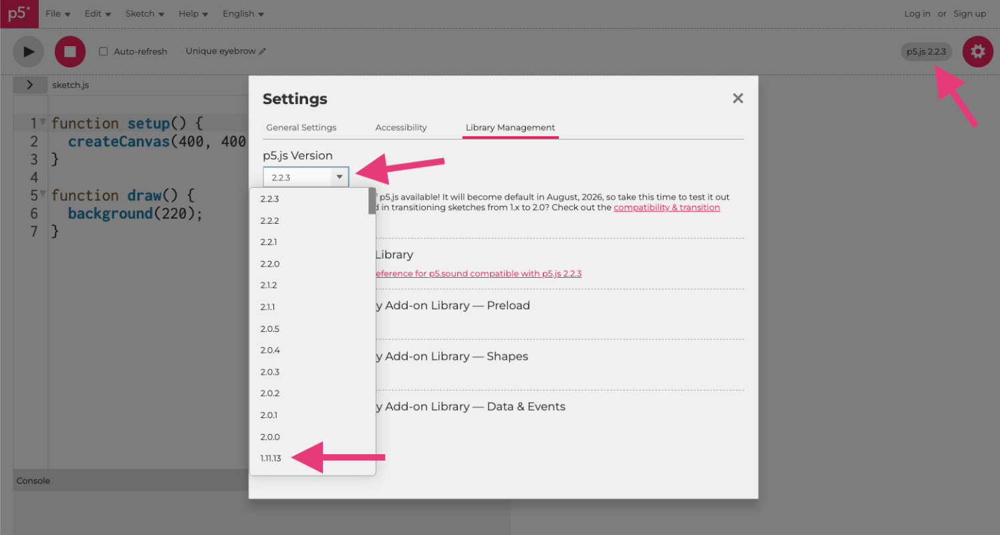
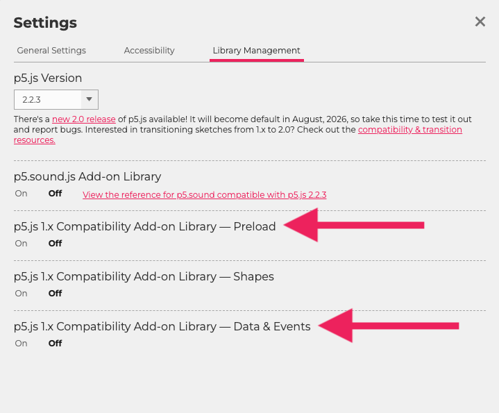

import Callout from "../../../components/Callout/index.astro";

## p5.js v2 Transition Guide for Middle School and High School Educators

As a middle school teacher, I know a version update to a tool you rely on can feel like a big adjustment, especially when you already have a set of lessons and activities you know and love. 

If you’re feeling some trepidation about the transition to p5.js v2, this guide is here to reassure you. Most of what your students already do works exactly the same as before.


After reviewing multiple middle school and high school p5.js curricula ([CS4All Creative Web](https://blueprint.cs4all.nyc/curriculum/creative-web/), [CS4All Introduction to Computational Media](https://blueprint.cs4all.nyc/curriculum/intro-to-computational-media/), [CodeHS Digital Art with p5.js](https://codehs.com/course/p5-js/overview), [CSinSF Creative Computing](https://sites.google.com/sfusd.edu/csinsfcreativecomputing/home?authuser=0), [Processing Foundation Art + Code](https://processing.github.io/art-plus-code/codeAsCreativeMedium-intro/)) just two areas consistently require updates when moving from p5.js v1 to v2: 


* Input Events
* Asset Loading

Although there are [other v2 updates](https://github.com/processing/p5.js-compatibility) (such as changes to curved shapes, text measurement, and utility functions), these do not typically appear in middle school or high school curricula and are unlikely to impact your work with students. 

This guide walks you through just the changes you’re likely to encounter in a Middle School (MS) or High School (HS) classroom. You’ll learn how to update your code for p5.js v2, and when compatibility add-ons might be helpful for older sketches.

I’ve tried to include everything you need and nothing you don’t, so you can get up to speed easily and feel confident teaching with p5.js v2.

## Versions in the Web Editor

Most of the time, you and your students can use p5.js v2 without changing anything.

However, if you open an older sketch (for example, something a student created in a previous year or an example from a curriculum designed for p5.js v1), and it doesn’t behave quite the same, you have options:

* You can **update the sketch** using the examples in this guide
* You can **turn on a [compatibility add-on](https://docs.google.com/document/d/1Dk5nqLYL_ryw_7xjADhgPHOi5N6xkC9v_FM2vOz_Hc8/edit?tab=t.ocxorofdcw24)**
* You can **switch the sketch back to p5.js v1** in the Editor




## Input Events

Input events are likely to be the first place you notice differences in p5.js v2. Students may use input events to: 

* Select or toggle buttons 
* Draw with the mouse while pressed
* Change variables when a key is pressed 
* Clear or save the canvas
* Moving a game character with arrow keys

This section covers the input event code you’re most likely to see in MS/HS classrooms and the changes introduced in p5.js v2.


### Mouse Clicks


In p5.js v1, checking for a specific mouse button looked like this: 

```js
if (mouseButton === RIGHT) {
  // do a thing (p5.js v1)
}
```

In p5.js v2, it looks like this:

```js
if (mouseButton.right) {
  // do a thing (p5.js v2)
}
```

**Reference:** [mouseButton](/reference/p5/mouseButton/)

<Callout title="Teacher Note">
In v2, mouseButton is now an object with boolean properties (left, right, center). This makes it possible to detect multiple buttons at once. This is especially helpful for drawing apps or paint tools, where students may want different behaviors for different mouse buttons.
</Callout>

### Keyboard Input

In p5.js v1, most MS/HS curricula checked for keys using code like: 

```js
if (keyIsPressed) {
  if (key === UP_ARROW){
    // do a thing (p5.js v1)
  }
}
```

`keyIsPressed` is often introduced early as a simple Boolean variable and `key ===` fits into the comparison structures students are already using.

In p5.js v2, the recommended way to check for keys is:

```js
if (keyIsDown(UP_ARROW)) {
  // do a thing (p5.js v2)
}
```

`keyIsDown()` is now the recommended approach because it works consistently across both v1 and v2 and supports checking multiple keys at once.


**Reference:** [keyIsDown](https://beta.p5js.org/reference/p5/keyIsDown/)

### Input Events Quick Reference


<table>

<tr>

<th>

p5.js v1

</th>

<th>

p5.js v2

</th>

<th>

Reference

</th>

</tr>

<tr>

<td>

`mouseButton === RIGHT`


</td>

<td>

`mouseButton.right`

</td>

<td>

[mouseButton](https://beta.p5js.org/reference/p5/mouseButton/)

</td>

</tr>

<tr>

<td>

`keyIsPressed` <br /> `key === UP_ARROW`

</td>

<td>

`keyIsDown(UP_ARROW)`

</td>

<td>

[keyIsDown](https://beta.p5js.org/reference/p5/keyIsDown/)

</td>

</tr>

</table>


### Compatibility Add-On (Optional)

For new teaching, follow the v2 code shown above.

If you have older sketches that you want to keep working without updating the code, the **Data & Events** compatibility add-on restores the v1 behavior. 

See *Compatibility Add-Ons* section below for more detail. 


## Loading Assets

As students advance in the curriculum, they may want to personalize their sketches by adding images, sounds, fonts, or other assets. 

In p5.js v1, this was done using `preload()`.  
In p5.js v2, we use `async` and `await` inside `setup()`. 

### `preload()` in p5.js v1

In p5.js v1, `preload()` stopped the sketch from running until everything inside it finished loading:

```js
let img;

function preload(){
  // used in p5.js v1, but not in v2
  img = loadImage("cat.jpg");
}

function setup(){
  createCanvas(100, 100);
  image(img, 0, 0);
}
```


### `async` and `await` in p5.js v2

In the p5.js v2, `preload()` is no longer used, and assets are loaded using `await` inside `async setup()`.  This works for images, sounds, fonts, and other files: 

```js
let img;

async function setup() {
  createCanvas(100, 100);
  
  // waits for asset to load
  img = await loadImage("cat.jpg");
  
  image (img, 0, 0);
}
```


### Asset Loading Quick Reference


<table>

<tr>

<th>

p5.js v1

</th>

<th>

p5.js v2

</th>


</tr>

<tr>

<td>

```js
function preload(){   
  img = loadImage(
    "cat.jpg"
  );
}
```

</td>

<td>

```js
async function setup() {
  createCanvas(100, 100);
  img = await loadImage(
    "cat.jpg"
  ); 
}
```

</td>


</tr>
</table>


**Reference:** [async_await](https://beta.p5js.org/reference/p5/async_await/)


### Compatibility Add-Ons (Optional)

For new teaching, follow the v2 code above.

If you have older sketches that you want to keep working without updating the code, the **Preload** compatibility add-on restores the v1 behavior. 

See *Compatibility Add-Ons* section below for more detail. 

## Compatibility Add-Ons

Compatibility add‑ons are optional helper files you can turn on in the p5.js Web Editor to make older p5.js v1 sketches behave the same way in p5.js v2, without updating the code.

These add-ons are only needed if you or your students open older sketches from online or older curriculum materials that use the p5.js v1 patterns and you aren’t ready to update the code to the v2 patterns yet.

For new teaching, it’s better to use the v2 ways of writing code so students learn the version that will be supported going forward.

* For Input Events, use the **Data & Events** Compatibility Add-On.
* For Asset Loading, use the **Preload** Compatibility Add-On. 




*You will also see a **Shapes** Compatibility Add-On - the Shapes API changes only affect more advanced custom shapes that do not commonly appear in MS/HS curricula, so most MS/HS teachers won’t need the Shapes Compatibility Add-On.*


## Teacher Quick Reference


<table>

<tr>

<th>

p5.js v1

</th>

<th>

p5.js v2

</th>

<th>

Reference

</th>

<tr>
<th colspan="3">
Input Events
</th>
</tr>

</tr>

<tr>

<td>

`mouseButton === RIGHT`


</td>

<td>

`mouseButton.right`

</td>

<td>

[mouseButton](https://beta.p5js.org/reference/p5/mouseButton/)

</td>

</tr>

<tr>

<td>

`keyIsPressed` <br />
`key === UP_ARROW`

</td>

<td>

`keyIsDown(UP_ARROW)`

</td>

<td>

[keyIsDown](https://beta.p5js.org/reference/p5/keyIsDown/)

</td>

</tr>


<tr>
<th colspan="3">
Asset Loading
</th>
</tr>


<tr>


</tr>

<tr>

<td>

```js
function preload(){   
  img = loadImage("cat.jpg");
}
```

</td>

<td>

```js
async function setup() {
  createCanvas(100, 100);
  img = await loadImage("cat.jpg"); 
}
```

</td>

<td>

[async_await](https://beta.p5js.org/reference/p5/async_await/)

</td>

</tr>
</table>


<Callout title="Teacher Note">
This quick reference includes only the p5.js v2 changes that commonly affect MS & HS curricula (input events and asset loading). Other v2 updates (such as changes to curved shapes, text measurement, and utility functions) do not appear in the reviewed curricula. For the full list of v2 changes, see the [Technical Transition Guide](https://github.com/processing/p5.js-compatibility). 
</Callout>

