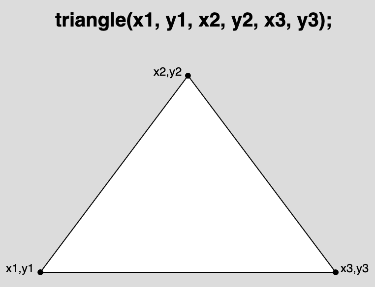
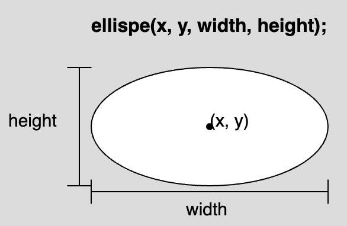

import Video from "../../../components/Video/index.astro"
import { Callout } from "../../../components/Callout/";
import EditableSketch from "../../../components/EditableSketch/index.astro";

Follow this tutorial to create an [animated landscape](https://editor.p5js.org/Msqcoding/sketches/WQWNKZppu) as you learn the basics of variables and creating motion in p5.js. 

<Video src="/public/videos/tutorials/landscape.mp4" alt="An animated landscape with a crescent moon and a mountain range in the background, and grass with growing trees in the foreground. Stars randomly appear as clouds move across the canvas." />

In this tutorial you will:

- Declare, initialize, and update variables in a p5.js sketch
- Use variables, operators, and random() in p5.js shape functions to create motion on the canvas
- Add both linear and random motion in a p5.js project


## Prerequisites:

- [Setting Up Your Environment](/tutorials/setting-up-your-environment)
- [Get Started](/tutorials/get-started)
- (optional) [Field Guide to Debugging](/tutorials/field-guide-to-debugging)

Before you begin, you should be able to:

- Log in to the [p5.js Web Editor](https://editor.p5js.org/) and save a new project
- Change the canvas size and background color
  - [`background()`](/reference/p5/background), [`createCanvas()`](/reference/p5/createCanvas), [`setup()`](/reference/p5/setup), [`draw()`](/reference/p5/draw)
- Add and customize shapes and text
  - 2D primitive shapes such as [`circle()`](/reference/p5/circle) and [`rect()`](/reference/p5/rect)
  - [`text()`](/reference/p5/text), [`fill()`](/reference/p5/fill), [`stroke()`](/reference/p5/stroke), [`textSize()`](/reference/p5/textSize)
- Add simple interactivity using [`mouseX`](/reference/p5/mouseX) and [`mouseY`](/reference/p5/mouseY)
- [Comment code](https://developer.mozilla.org/en-US/docs/MDN/Writing_guidelines/Writing_style_guide/Code_style_guide/JavaScript#comments)
- Read and address [error messages](/tutorials/field-guide-to-debugging)


## Step 1: Choose where to start<a id="step-1"></a>

Log in to the [p5.js Web Editor](https://editor.p5js.org/) and choose one of the following options:

- If you followed our previous [Get Started Tutorial](/tutorials/get-started):
  - Duplicate your [interactive landscape](https://editor.p5js.org/p5Master718/sketches/aDwxcxCbV) and give it a new name.
    - Open your [interactive landscape](https://editor.p5js.org/p5Master718/sketches/aDwxcxCbV), click *File*, then *Duplicate*.
    - Change its name to something like “Animated Landscape.”
  - Skip to [Step 3](#step-3).
- If you are starting from scratch:
  - Use [this template](https://editor.p5js.org/Msqcoding/sketches/nHyx0xDG6) that contains code that helps you position shapes and text on the canvas:
  - Duplicate the [template](https://editor.p5js.org/Msqcoding/sketches/nHyx0xDG6) and give it a new name. 
    - Open this [template link](https://editor.p5js.org/Msqcoding/sketches/nHyx0xDG6), click *File*, then *Duplicate*.
    - Change its name to something like “Animated Landscape.”
  - You can also open a new p5.js project without the template, name it “Animated Landscape,” and save it. 
    - Copy the following lines into the [`draw()`](/reference/p5/draw) function if you want to use the helper code:

      ```js
      //displays the x and y position of the mouse on the canvas
      fill(255) //white text
      text(`${mouseX}, ${mouseY}`, 20, 20);
      ```

<Callout title="Tip">
Click *Play* and check the box next to “Auto-refresh” on the [p5.js Web Editor](https://editor.p5js.org/) to continuously update the canvas as you add more code to your project. With this box checked, you won’t need to press the *Play* button every time you make changes to your sketch. 
</Callout>

If you duplicated the [template](https://editor.p5js.org/Msqcoding/sketches/nHyx0xDG6), your code should look like this:

<EditableSketch code={`
function setup() {
  createCanvas(400, 400);
}

function draw() {
  background(220);
  //Place code here

  // places the x and y position of the mouse on the canvas
  fill(0)
  text(\`\${mouseX}, \${mouseY}\`, 20, 20);
}
`} />

The line of code ``text(`${mouseX}, ${mouseY}`, 20, 20);`` displays the x- and y-coordinates for your mouse pointer as a coordinate pair x, y. The first number, the value in the variable [mouseX](/reference/p5/mouseX), represents the x-coordinate of your mouse pointer as it moves across the canvas. The second number, the value in the variable [mouseY](/reference/p5/mouseY), represents the y-coordinate of the mouse pointer.


<Callout title="Tip">
To keep this text shown, make sure this code appears on the last lines in [`draw()`](/reference/p5/draw). You may need to change the color of the text by changing the value in [`fill()`](/reference/p5/fill) if it blends in with the background. When you do not need the coordinates anymore, type `//` before the [`fill()`](/reference/p5/fill) and [`text()`](/reference/p5/text) functions. This tells the program to skip those lines of code by hiding them as comments! 

**Don’t forget:** The last line of code in your program should be `}` (a closing curly bracket), which closes the block for the [`draw()`](/reference/p5/draw) function.
</Callout>

Visit this [reference](https://developer.mozilla.org/en-US/docs/MDN/Writing_guidelines/Writing_style_guide/Code_style_guide/JavaScript#comments) or watch [this video](https://www.youtube.com/watch?v=xJcrPJuem5Q) to learn more about comments.


##### Variables

Variables store values in them that we can use in our sketch. **Variables are very helpful when adding elements to your sketch that will change over time.** They can be used in calculations, messages, as function arguments, and so much more!

[`mouseX`](/reference/p5/mouseX) and [`mouseY`](/reference/p5/mouseY) are variables that are built into the p5.js library. They store the x- and y-coordinates of the mouse pointer as it is dragged over the canvas. In the [Get Started](/tutorials/get-started) tutorial, you created an [interactive landscape](https://editor.p5js.org/p5Master718/sketches/aDwxcxCbV) where [`mouseX`](/reference/p5/mouseX) and [`mouseY`](/reference/p5/mouseY) were used as x- and y-coordinates of a ladybug or other emoji. This allowed the emoji to follow the mouse pointer as it was dragged across the canvas, making your artwork interactive! 

In the template above, you use [`mouseX`](/reference/p5/mouseX) and [`mouseY`](/reference/p5/mouseY) to print the x- and y-coordinates of the mouse on the canvas using the [`text()`](/reference/p5/text) function. Variables can be displayed on the canvas alongside text using the [`text()`](/reference/p5/text) function and [string interpolation](https://www.geeksforgeeks.org/string-interpolation-in-javascript/) (example 2).


##### String Interpolation

In [Get Started,](/tutorials/get-started) you learned that strings are [data types](https://developer.mozilla.org/en-US/docs/Web/JavaScript/Data_structures) that are always surrounded by quotation marks (`""`). To use variables and strings together, we can use [template literals](https://developer.mozilla.org/en-US/docs/Web/JavaScript/Reference/Template_literals) to help us! Template literals begin and end with backticks (`\`\``) instead of quotation marks (`""`). You can type any character in between the backticks to generate a string like in [this example](https://editor.p5js.org/Msqcoding/sketches/pfSJLvxOB). You can include a variable in the string using the `${}` placeholder, and by placing the name of the variable inside the curly brackets like in [this example](https://editor.p5js.org/Msqcoding/sketches/8sM-h5Hd9).

Visit [string interpolation](https://www.geeksforgeeks.org/string-interpolation-in-javascript/) (example 2),  [template literals](https://developer.mozilla.org/en-US/docs/Web/JavaScript/Reference/Template_literals), or the p5.js reference page for [string](/reference/p5/string) to learn more!

<Callout title="Note">
Variables with [numbers](/reference/p5/number) in them can be used as arguments where numbers are required. If a variable that stores a [string](/reference/p5/string) is used where a number should be, the console will show an error message like `“...was expecting Number for the first parameter, received string instead.”` Visit the Error Messages section in the [Field Guide to Debugging](/tutorials/field-guide-to-debugging) for some common errors and how to fix them!
</Callout>


## Step 2: Create a background landscape<a id="step-2"></a>

- Color the background. 
- Add and color landscape shapes (a sun or moon, mountains, buildings, houses, trees, etc.)
- Add comments that describe each section of code.

See [Steps 4 - 6 in Get Started](/tutorials/get-started) for more information on how to use color and shapes on the canvas.

Your code could look like this:

<EditableSketch code={`
function setup() {
  createCanvas(400, 400);
}

function draw() {
  background('navy'); //navy background

  //moon
  fill(255);
  stroke(0);
  circle(350, 50, 100);

  //overlapping navy circle for crescent moon
  stroke("navy");   
  fill("navy");
  circle(320,50,100);

  //big gray mountains
  stroke(0);
  fill(80);
  triangle(-40,300,75,100, 250,300);
  triangle(100,300,300,100, 500,300);

  //grass
  fill('rgb(50,76,50)');
  rect(0,300, 400, 100);

  //displays the x and y position of the mouse on the canvas
  fill(255) //white text
  text(\`mouseX: \${mouseX}, mouseY: \${mouseY}\`, 20, 20);  
}
`} />

The code above uses [`circle()`](/reference/p5/circle) and [`triangle()`](/reference/p5/triangle) shapes to create objects in the landscape, and [`fill()`](/reference/p5/fill) and [`stroke()`](/reference/p5/stroke) to color shapes and outlines. 

- [`background()`](/reference/p5/background) is used to change the color of the canvas background.
- [`draw()`](/reference/p5/draw) executes code over and over again. This allows for shapes that appear last in [`draw()`](/reference/p5/draw) to overlap with shapes that come first if they are placed close together.
  - The crescent moon was created by overlapping two [`circle()`](/reference/p5/circle) shapes.
    - [This example](https://editor.p5js.org/Msqcoding/sketches/eHkwP3yBC) uses two circles that overlap to create a crescent moon.
  - The mountains were created using two overlapping [`triangle()`](/reference/p5/triangle) shapes (see diagram below).
    - [This example](https://editor.p5js.org/p5Master718/sketches/CxuLJszOL) shows how you can use triangles that overlap to create a mountain with some more detail.
- [`triangle()`](/reference/p5/triangle) needs the location of 3 points on the canvas in order to appear. Each point has an x-coordinate and a y-coordinate value. The first two numbers are the x- and y-coordinates of the first point (x<sub>1, </sub>y<sub>1</sub>), the second two numbers are the coordinates of the next point (x<sub>2, </sub>y<sub>2</sub>), and the last two are the coordinates of the last point (x<sub>3, </sub>y<sub>3</sub>).



Your landscape may look very different from the code sample above. Feel free to use any of the following shapes in your sketch (click on the links to learn more): [`rect()`](/reference/p5/rect)  |  [`triangle()`](/reference/p5/triangle)  |  [`ellipse()`](/reference/p5/ellipse)  |  [`circle()`](/reference/p5/circle)  |  [`line()`](/reference/p5/line)  |  [`square()`](/reference/p5/square)  |  [`quad()`](/reference/p5/quad)  |  [`point()`](/reference/p5/point)  |  [`arc()`](/reference/p5/arc)

Visit the following resources to learn more about using shapes and colors in your projects: [`fill()`](/reference/p5/fill)  |  [`stroke()`](/reference/p5/stroke)  |  [`background()`](/reference/p5/background)  |  [`draw()`](/reference/p5/draw)

Be sure to avoid common errors highlighted in the [Field Guide to Debugging](/tutorials/field-guide-to-debugging) and [this video](https://www.youtube.com/watch?v=LuGsp5KeJMM\&list=PLRqwX-V7Uu6Zy51Q-x9tMWIv9cueOFTFA\&index=6) from The Coding Train.


## Step 3: Draw shapes using custom variables<a id="step-3"></a>

- Place a white cloud in the sky on your canvas using the [`ellipse()`](/reference/p5/ellipse)` `method.
  - Add these lines of text directly under the code for the grass:

    ```js
    //cloud
    fill(255);
    ellipse(50, 50, 80, 40);
    ```

- Create a custom variable named `cloudOneX` and store the number 50 in it – this variable will store the value for the x-coordinate of the white cloud throughout the program.
  - Add these lines of text before [`setup()`](/reference/p5/setup):

    ```js
    //custom variable for x coordinate of cloud
    let cloudOneX = 50;
    ```

- Replace the x-coordinate in `ellipse(50, 50, 80, 40);` with the `cloudOneX` variable. 
  - This line of code should now look like this:

    ```js
    ellipse(cloudOneX, 50, 80, 40);
    ```

Your code can look like this:

<EditableSketch code={`
//custom variable for x coordinate of cloud
let cloudOneX = 50;

function setup() {
  createCanvas(400, 400);
}

function draw() {
  background('navy'); //navy background

  //moon
  fill(255);
  stroke(0);
  circle(350, 50, 100);

  //overlapping navy circle for crescent moon
  stroke("navy");   
  fill("navy");
  circle(320,50,100);

  //big gray mountains
  stroke(0);
  fill(80);
  triangle(-40,300,75,100, 250,300);
  triangle(100,300,300,100, 500,300);

  //grass
  fill('rgb(50,76,50)');
  rect(0,300, 400, 100);
  
  //cloud
  fill(255);
  ellipse(cloudOneX, 50, 80, 40);

  //displays the x and y position of the mouse on the canvas
  fill(255) //white text
  text(\`mouseX: \${mouseX}, mouseY: \${mouseY}\`, 20, 20);
} 
`} />

[`ellipse()`](/reference/p5/ellipse) needs 4 numbers in order to appear on the canvas. The first two numbers (x, y) are the x- and y-coordinates of the center point. The last two numbers describe the pixel width and height of the ellipse.



In the code above, the cloud is drawn using [`ellipse()`](/reference/p5/ellipse) with `cloudOneX` (which stores the number 50) as its x-coordinate, 50 as a y-coordinate, a width of 80 pixels, and a height of 40 pixels.


##### Custom Variables

Custom variables store values, like [numbers](/reference/p5/number) or [strings](/reference/p5/string), that can change later. Since custom variables store values that can change, we can use them to change the x- or y-coordinates and size of shapes on the canvas. When the x- or y-coordinate of a shape changes, it appears to be moving. In this step:

- you placed a white cloud on the canvas using [`ellipse()`](/reference/p5/ellipse) with the number 50 as an x-coordinate;
- you *declared* a custom variable named `cloudOneX` before [`setup();`](/reference/p5/setup)
  - When you want to create custom variables to use in your program, you must give them a name and *declare* them by using the keyword [`let`](/reference/p5/let). 
  - You can *declare* a variable using any name; however, it is best to use a name that will help you remember what the variable is used for!
- you *initialized* `cloudOneX` by assigning it the number 50.
  - A value can be stored in a variable using the *assignment operator* (`=`) – it assigns a value to a specific variable.
  - When a value is stored in a custom variable for the first time, it is called *initializing* the variable.


Finally, you can use the variable name `cloudOneX` as the argument for the x-coordinate in [`ellipse()`](/reference/p5/ellipse). Since the variable `cloudOneX` has the number 50 stored in it, we can use `cloudOneX` as an argument in any function that requires a number. Here, you used it as the x-coordinate of the white cloud by replacing the number 50 with the variable name `cloudOneX`: `ellipse(cloudOneX, 50, 80, 40);`.


##### Variable Scope

A *variable’s scope* describes where the variable can be used in a program. It is often useful to declare custom variables outside of [`setup()`](/reference/p5/setup) and [`draw()`](/reference/p5/draw) because it allows the variables to have a *global scope*. A variable with a *global scope* can be used anywhere in the program. Global variables are often declared on the very first lines of code. This helps programmers get an understanding of what is changing, makes the code easier to maintain, and avoids confusion further down in code. Built-in variables such as [`mouseX`](/reference/p5/mouseX), [`mouseY`](/reference/p5/mouseY), [`width`](/reference/p5/width), and [`height`](/reference/p5/height) do not have to be declared because they are built into the p5.js library, and you can use them anywhere in your code because they have global scope! 

Variables declared inside of other functions (like [`draw()`](/reference/p5/draw) and [`setup()`](/reference/p5/setup)) have *local scope* – which means they can only be used within the block or function where they are declared. Variables declared in [`setup()`](/reference/p5/setup) cannot be used in [`draw()`](/reference/p5/draw) or any other function, and variables defined in [`draw()`](/reference/p5/draw) cannot be used in [`setup()`](/reference/p5/setup). View [this example](https://editor.p5js.org/p5Master718/sketches/aa8bBwGHb) of global and local variable scope.

Visit these p5.js reference pages to learn more about declaring, initializing, and using custom variables: [`let`](/reference/p5/let), [numbers](/reference/p5/number), & [strings](/reference/p5/string).


##### Using Variables for Animation

A shape on the canvas appears to be moving when its x- or y-coordinates change. We can use variables in place for the x- or y-coordinates of anything that appears on the canvas. In the example:

- Change the value stored in `cloudOneX` by replacing the value it is initialized with and observe changes in the white cloud on the canvas.
  - If the value in `cloudOneX` increases, the white cloud appears to be moving to the right.
  - If the value in `cloudOneX` decreases, the white cloud appears to be moving to the left.

In the next step, we will change the value in `cloudOneX` so that the cloud appears to be moving horizontally on the canvas.


## Step 4: Add horizontal motion,<a id="step-4"></a>

- In the line under the white cloud, add these lines of code:

  ```js
  //sets the x coordinate to the frame count
  //resets at left edge
  cloudOneX = frameCount % width
  ```

Your code can look like this:

<EditableSketch code={`
//custom variable for x coordinate of cloud
let cloudOneX = 50;

function setup() {
  createCanvas(400, 400);
}

function draw() {
  background('navy'); //navy background
  
  //moon
  fill(255);
  stroke(0);
  circle(350, 50, 100);
  //overlap by navy circle for crescent moon
  stroke("navy");   
  fill("navy");
  circle(320,50,100);

  //big gray mountains
  stroke(0);
  fill(80);
  triangle(-40,300,75,100, 250,300);
  triangle(100,300,300,100, 500,300);
  
  //grass
  fill('rgb(50,76,50)');
  rect(0,300, 400, 100);
  
  //cloud
  fill(255);
  ellipse(cloudOneX, 50, 80, 40);

  //sets the x coordinate to the frame count
  //resets at left edge
  cloudOneX = frameCount % width

  //displays the x and y position of the mouse on the canvas
  fill(255) //white text
  text(\`mouseX: \${mouseX}, mouseY: \${mouseY}\`, 20, 20);  
}
`} />


In the step above, you set `cloudOneX` to the value of `frameCount % width`. Recall that [`draw()`](/reference/p5/draw) runs over and over again, in a loop:

- [`frameCount`](/reference/p5/frameCount) is a built-in variable that saves the number of times [`draw()`](/reference/p5/draw) runs. This value continues to increase as long as your program is running.
  - See [this example](https://editor.p5js.org/p5Master718/sketches/hT1KJ-RF4) to view the values stored in [`frameCount`](/reference/p5/frameCount).
- [`width`](/reference/p5/width) is a built-in variable that stores the width of the canvas defined in [`createCanvas()`](/reference/p5/createCanvas). We can see that in this example, the [`width`](/reference/p5/width) is 400 and the [`height`](/reference/p5/height) is 400.
- [`%`](https://developer.mozilla.org/en-US/docs/Web/JavaScript/Reference/Operators/Remainder) is the remainder operator (also referred to as modulo) – it divides a number on the left ([`frameCount`](/reference/p5/frameCount)) by a number on the right (400), and returns the remainder. Refer to the table below, which displays how [`frameCount`](/reference/p5/frameCount) and `frameCount % width` change while the program is running (**when [`width`](/reference/p5/width) is 400**):

<table>

<tr>

<th>

`frameCount`

</th>

<th>

`frameCount % width`

</th>

</tr>

<tr>

<td>

0

</td>

<td>

0

</td>

</tr>

<tr>

<td>

100

</td>

<td>

100

</td>

</tr>

<tr>

<td>

300

</td>

<td>

300

</td>

</tr>

<tr>

<td>

400

</td>

<td>

0

</td>

</tr>

<tr>

<td>

500

</td>

<td>

100

</td>

</tr>

<tr>

<td>

700

</td>

<td>

300

</td>

</tr>

<tr>

<td>

800

</td>

<td>

0

</td>

</tr>

</table>

- For `cloudOneX = frameCount % width`:
  - If [`frameCount`](/reference/p5/frameCount) is less than 400, `frameCount % width` will return the value in [`frameCount`](/reference/p5/frameCount). 
    - For example: when [`frameCount`](/reference/p5/frameCount) is 40, then `frameCount % width` will return 40 and store it in `cloudOneX`.` `This moves the white cloud to the x-coordinate 40. 
  - As [`frameCount`](/reference/p5/frameCount) increases, new values will be stored in `cloudOneX`, and the white cloud will appear to move to the right (a higher x-coordinate).
  - When [`frameCount`](/reference/p5/frameCount) is equal to [`width`](/reference/p5/width), `frameCount % width` will return 0. This will reset the position of the cloud back to the x-coordinate 0 – the left edge of the canvas.
  - When [`frameCount`](/reference/p5/frameCount) is greater than [`width`](/reference/p5/width), `frameCount % width` will return the values in [`frameCount`](/reference/p5/frameCount) again.
    - For example: when [`frameCount`](/reference/p5/frameCount) is 440, then `frameCount % width` will return 40 and store it in `cloudOneX`.
  - When [`frameCount`](/reference/p5/frameCount) reaches any multiple of [`width`](/reference/p5/width), `frameCount % width` will be 0 and it will appear as if the cloud has reset its position back to the left edge of the canvas (where the x-coordinate is 0).

When the program runs:

- `cloudOneX` is declared and initialized with a value of 50.
- [`setup()`](/reference/p5/setup) runs and creates a canvas with a [`width`](/reference/p5/width) of 400 pixels.
- The first time [`draw()`](/reference/p5/draw) runs:
  - the background and all shapes on the landscape are drawn on the canvas;
  - the cloud is drawn with an x-coordinate `cloudOneX` (which stores the number 50);
  - `cloudOneX` stores the remainder in the operation `frameCount % width`.
- The second time [`draw()`](/reference/p5/draw) runs:
  - all shapes are covered when the background and landscape are drawn on the canvas again;
  - a new cloud is drawn on top with the new value for `cloudOneX`, creating the illusion that it has moved from an x-coordinate of 0 to 400, then resets;
  - this pattern continues until [`draw()`](/reference/p5/draw) is stopped.

See [this example](https://editor.p5js.org/p5Master718/sketches/wpAhQK9WN), which displays values for [`frameCount`](/reference/p5/frameCount) and `frameCount % width` as shapes move across the canvas. Visit the [Remainder reference on MDN](https://developer.mozilla.org/en-US/docs/Web/JavaScript/Reference/Operators/Remainder) to learn more!


##### Animation and draw()

The [`draw()`](/reference/p5/draw) function runs code repeatedly and behaves much like a flipbook when animating a series of still drawings. 

- Example of a [flipbook animation](https://www.youtube.com/watch?v=J2xrN5WQuxw)

Each time [`draw()`](/reference/p5/draw) reads the lines of code for the background and landscape shapes, it covers anything drawn on the canvas the previous time [`draw()`](/reference/p5/draw) ran. This makes it appear as if we flipped to the next page in our flipbook when things on the canvas change each time [`draw()`](/reference/p5/draw) runs.

- [This example](https://editor.p5js.org/p5Master718/sketches/H3dfPaKaN) shows the changes in the x-coordinate of a circle as it moves horizontally on the canvas. 
- [This example](https://editor.p5js.org/p5Master718/sketches/CHPMI1xBJ) shows the changes in the y-coordinate of a circle as it moves vertically on the canvas.
- [This example](https://editor.p5js.org/p5Master718/full/vEDfXfXBJ) shows changes to the size of a circle as the program runs.
- These examples show how new shapes are drawn at a new location every time the [`draw()`](/reference/p5/draw) function runs: [horizontal motion](https://editor.p5js.org/p5Master718/sketches/hSv6uLFvv) | [vertical motion](https://editor.p5js.org/p5Master718/sketches/Xk_MUZ9yT) | [random motion](https://editor.p5js.org/Msqcoding/sketches/yLtbuqPIG)
  - In these examples, [`background()`](/reference/p5/background) is removed to eliminate the “flipbook” illusion that [`draw()`](/reference/p5/draw) provides. Now we can see every new shape drawn because the background is not there to cover it.

Visit the p5.js reference for [`draw()`](/reference/p5/draw) for more information.


##### `frameRate()`, `frameCount` and `console.log()`

The number of times [`draw()`](/reference/p5/draw) runs is stored in the variable [`frameCount`](/reference/p5/frameCount), and the number of times [`draw()`](/reference/p5/draw) runs in 1 second is known as the *frame rate*. By default, the frame rate is set by your computer, which is about 60 for most computers. This indicates that the code appearing in [`draw()`](/reference/p5/draw) will run about 60 times in a second.  

We can set and display the value for [`draw()`](/reference/p5/draw)’s *frame rate* using the [`frameRate()`](/reference/p5/frameRate) function. We can view the value for the frame rate and [`frameCount`](/reference/p5/frameCount) using [`console.log()`](/reference/console/log) to display the values and messages in the console.

- [This example](https://editor.p5js.org/p5Master718/sketches/7j0u_pljk) shows a random circle animation and prints the frame rate in the console. 
- [This example](https://editor.p5js.org/p5Master718/sketches/CH2Nmbzwz) shows a random circle animation, sets the frame rate to a new value, and displays it in the console.

For more information, visit the following p5.js reference pages: [`frameRate()`](/reference/p5/frameRate)  |  [`frameCount`](/reference/p5/frameCount)  |  [`console.log()`](/reference/console/log)


## Step 5: Add more moving clouds & change frame rate<a id="step-5"></a>

- Slow down the animation by setting the frame rate to 15:
  - Add this in the line under [`background()`](/reference/p5/background): `frameRate(15); //set frame rate to 15`
- Repeat [Step 4](#step-4) to add more clouds to your landscape with different x and y values. 
  - You can add this text under the first cloud:

    ```js
    ellipse(cloudOneX - 40, 100, 60, 20);
    ellipse(cloudOneX + 20, 150, 40, 10);
    ```

Your code can look like this:

<EditableSketch code={`
//custom variable for x coordinate of clouds
let cloudOneX = 50;

function setup() {
  createCanvas(400, 400);
}

function draw() {
  background('navy'); //navy background
  frameRate(15); //set frame rate to 15
  
  //moon
  fill(255);
  stroke(0);
  circle(350, 50, 100);

  //overlap by navy circle for crescent moon
  stroke("navy");   
  fill("navy");
  circle(320,50,100);

  //big gray mountains
  stroke(0);
  fill(80);
  triangle(-40,300,75,100, 250,300);
  triangle(100,300,300,100, 500,300);

  //grass
  fill('rgb(50,76,50)');
  rect(0,300, 400, 100);

  //clouds
  fill(255);
  ellipse(cloudOneX, 50, 80, 40);
  ellipse(cloudOneX - 40, 100, 60, 20);
  ellipse(cloudOneX + 20, 150, 40, 10);

  //sets the x coordinate to the frame count
  //resets at left edge
  cloudOneX = frameCount % width

  //displays the x and y position of the mouse on the canvas
  fill(255) //white text
  text(\`mouseX: \${mouseX}, mouseY: \${mouseY}\`, 20, 20);
}
`} />

In the step above, you added:

- A second cloud at an x-coordinate `cloudOneX - 40` and y-coordinate `100`
  - This draws a second cloud 40 pixels to the left and 20 pixels below the first cloud.
- A third cloud at an x-coordinate `cloudOneX + 20` and y-coordinate `150`
  - This draws a third cloud 20 pixels to the right and 70 pixels below the first cloud.

Here, we used `cloudOneX` as a *reference point* – the point used as a guide when placing shapes on the canvas that move together. 

- [This example](https://editor.p5js.org/p5Master718/sketches/FiePhOrbF) illustrates how a reference point (x, y) can be used to change the location of multiple shapes at once.


## Step 6: Add vertical motion

Add a tree (or another object) to the landscape that moves vertically (up or down).

- Draw a tree on the canvas.
  - Add this text in between the code where the clouds are drawn and the code where variables increase:

    ```js
    //growing tree
    //trunk
    fill("rgb(118,80,72)");
    rect(40, 270, 15, 50);
    //leaves
    fill("green");
    triangle(25, 270, 45, 240, 70, 270);
    ```

- Subtract the top angle of a triangle that draws leaves (240) by `frameCount % 290` – the value stored in `cloudOneX`:
  - Modify the value for y<sub>2</sub> in the triangle above by subtracting it by `frameCount % 290`:

    ```js
    //leaves
    fill("green");
    triangle(25, 270, 45, 240 - frameCount % 290, 70, 270);
    ```

- Add more trees that grow the same way.
  - Add this line of text under the first tree:

    ```js
    //trunk
    fill("rgb(118,80,72)");
    rect(340, 330, 15, 50);
    //leaves
    fill("green");
    triangle(325, 330, 345, 240 - frameCount % 290, 370, 330);
    ```

Your code can look like this:

<EditableSketch code={`
//custom variable for x coordinate of clouds
let cloudOneX = 50;

function setup() {
  createCanvas(400, 400);
}

function draw() {
  background('navy'); //navy background
  frameRate(15); //set frame rate to 15

  //moon
  fill(255);
  stroke(0);
  circle(350, 50, 100);

  //overlap by navy circle for crescent moon
  stroke("navy");   
  fill("navy");
  circle(320,50,100);

  //big gray mountains
  stroke(0);
  fill(80);
  triangle(-40,300,75,100, 250,300);
  triangle(100,300,300,100, 500,300);

  //grass
  fill('rgb(50,76,50)');
  rect(0,300, 400, 100);

  //clouds
  fill(255);
  ellipse(cloudOneX, 50, 80, 40);
  ellipse(cloudOneX - 40, 100, 60, 20);
  ellipse(cloudOneX + 20, 150, 40, 10);

  //growing trees

  //trunk
  fill("rgb(118,80,72)");
  rect(40, 270, 15, 50);

  //leaves
  fill("green");
  triangle(25, 270, 45, 240 - frameCount % 2900,70, 270);

  //trunk
  fill("rgb(118,80,72)");
  rect(340, 330, 15, 50);

  //leaves
  fill("green");
  triangle(325, 330, 345, 240 - frameCount % 290, 370, 330);

  //sets the x coordinate to the frame count
  //resets at left edge

  cloudOneX = frameCount % width

  //displays the x and y position of the mouse on the canvas
  fill(255) //white text
  text(\`mouseX: \${mouseX}, mouseY: \${mouseY}\`, 20, 20);
}
`} />

In this step, you:

- added a tree made of a rectangle (tree trunk) and a triangle (leaves);
- modified the value for the y-coordinate of the top corner of the triangle (`y2`) by subtracting it by `frameCount % 290` (see [triangle()](/reference/p5/triangle) Diagram for a reminder of `y2`):
  - Since you want the tree leaves to grow, the top corner of the triangle needs to move up on the canvas each time [`draw()`](/reference/p5/draw) runs. As seen in [this example](https://editor.p5js.org/p5Master718/sketches/605MEWNxh), the y-coordinate (`y2`) of the point that moves up on the canvas decreases. 
  - To achieve this motion, you modified the value for `y2` by subtracting `240 - frameCount % 290`. This decreases `y2` by the remainder when [`frameCount`](/reference/p5/framecount) is divided by 290. 
  - As you saw in [Step 5](#step-5), each time the [`draw()`](/reference/p5/draw) function runs, the value returned by `frameCount % 290` increases by `1` so that `y2` also changes.
    - Before [`draw()`](/reference/p5/draw) runs, `y2` is `240`.
    - The first time [`draw()`](/reference/p5/draw) runs, the value from `frameCount % 290` is `1`, and `y2` becomes `239`.
    - The second time [`draw()`](/reference/p5/draw) runs, the value from `frameCount % 290` is `2`, and `y2` becomes `238`.
    - The third time [`draw()`](/reference/p5/draw) runs, the value in `frameCount % 290` is `3`, and `y2` becomes `237`.
    - Once [`frameCount`](/reference/p5/framecount) becomes a number that is a multiple of `290`, the value in `frameCount % 290` is `0`, and `y2` is set back to its original value of `240`.
    - This pattern continues until [`draw()`](/reference/p5/draw) is stopped.

Visit the following p5.js reference pages for more information: [`frameRate()`](/reference/p5/frameRate)  |  [`frameCount`](/reference/p5/frameCount) | [`triangle()`](/reference/p5/triangle)


## Step 7: Add random motion<a id="step-7"></a>

- Add shooting stars that appear at random locations in the sky.
  - Declare two variables, `lineXone` and `lineYone`, and initialize them with `0` by adding these lines of text before [`setup()`](/reference/p5/setup):

    ```js
    //custom variable for shooting stars
    let lineXone = 0;
    let lineYone = 0;
    ```

- Draw a line that will represent a shooting star by adding this text under `frameRate(15)`:

  ```js
  //shooting star
  stroke("yellow");
  line(lineXone, lineYone, lineXone + 30, lineYone - 30);
  ```

- Set `lineXone` and `lineYone` to random values by adding this text after the line of code where `cloudOneX` is assigned to `frameCount % width`:

  ```js
  //set shooting star to random location
  lineXone = random(0, width);
  lineYone = random(0, height/2);
  ```

- Delete the lines of code at the bottom of `draw()` that show the x- and y-coordinates of the mouse pointer to view your final project.
- Share with your friends!

Your code should look like this:

<EditableSketch code={`
//custom variable for x coordinate of clouds
let cloudOneX = 50;

//custom variable for shooting stars
let lineXone = 0;
let lineYone = 0;

function setup() {
  createCanvas(400, 400);
}

function draw() {
  background('navy'); //navy background
  frameRate(15); //set frame rate to 15

  //shooting star
  stroke("yellow");
  line(lineXone, lineYone, lineXone + 30, lineYone - 30);

  //moon
  fill(255);
  stroke(0);
  circle(350, 50, 100);

  //overlap by navy circle for crescent moon
  stroke("navy");   
  fill("navy");
  circle(320,50,100);

  //big gray mountains
  stroke(0);
  fill(80);
  triangle(-40,300,75,100, 250,300);
  triangle(100,300,300,100, 500,300);

  //grass
  fill('rgb(50,76,50)');
  rect(0,300, 400, 100);

  //clouds
  fill(255);
  ellipse(cloudOneX, 50, 80, 40);
  ellipse(cloudOneX - 40, 100, 60, 20);
  ellipse(cloudOneX + 20, 150, 40, 10);

  //growing trees
  //trunk
  fill("rgb(118,80,72)");
  rect(40, 270, 15, 50);

  //leaves
  fill("green");
  triangle(25, 270, 45, 240 - frameCount % 2900,70, 270);

  //trunk
  fill("rgb(118,80,72)");
  rect(340, 330, 15, 50);

  //leaves
  fill("green");
  triangle(325, 330, 345, 240 - frameCount % 290, 370, 330);

  //sets the x coordinate to the frame count
  //resets at left edge
  cloudOneX = frameCount % width

  //set shooting star to random location
  lineXone = random(0, width);
  lineYone = random(0, height/2); 
}
`} />

In the step above, you created two new variables, `lineXone` and `lineYone`, which are used to draw a line representing a shooting star in the sky. The line is drawn using the [`line()`](/reference/p5/line) function (see diagram below).


[`line()`](/reference/p5/line) needs 4 numbers to appear on the canvas. The first two numbers are the coordinates of the first point (x<sub>1</sub>,y<sub>1</sub>) – x<sub>1 </sub>is the x-coordinate and y<sub>1 </sub>the y-coordinate. The last two numbers are the coordinates of the second point (x<sub>2</sub>,y<sub>2</sub>), where x<sub>2 </sub>is the x-coordinate and y<sub>2</sub> is the y-coordinate. 

Visit the p5.js reference page for [`line()`](/reference/p5/line) to learn more.

In this project, you drew a line that begins at a point (`lineXone`, `lineYone`), where x<sub>1 </sub>is the value stored in `lineXone` and y<sub>1 </sub>is the value stored in `lineYone`. The line ends at a point (`30`, `lineXone + 30`), where x<sub>2 </sub>is `30` pixels to the right of x<sub>1</sub> and y<sub>2</sub> is 30 pixels above y<sub>1</sub>. 

By using x<sub>1</sub>,y<sub>1 </sub>to modify values for x<sub>2</sub>,y<sub>2</sub>, both ends of the line can move in the same way. This allows for the line to move around the canvas without changing its shape as `lineXone` and `lineYone` change.

- View [this example](https://editor.p5js.org/p5Master718/sketches/IqEQilUij) to see how the line moves around the canvas as x<sub>1</sub>,y<sub>1 </sub>changes. 
- View [this example](https://editor.p5js.org/p5Master718/sketches/iBKcrJGwi) to see how the line changes as the distance between points changes.

[`random()`](/reference/p5/random) is used to generate random numbers between a minimum and maximum value. You used it to reassign `lineXone `and `lineYone` to random numbers, placing them in random positions within the sky of your landscape. 

Examples using [`random()`](/reference/p5/random):

- [Changing line position with random](https://editor.p5js.org/Msqcoding/sketches/9OI5Y0uDk)
- [Changing color with random](https://editor.p5js.org/Msqcoding/sketches/mcfTlMLQX)

Visit the p5.js reference page for [`random()`](/reference/p5/random) to learn more about how random numbers are generated.

When [`draw()`](/reference/p5/draw) runs:

- The background is set.
- The shooting star is placed on the canvas along with the rest of the landscape, and `cloudOneX` is changed.
- `lineXone` is changed to a random number between `0` and [`width`](/reference/p5/width) (so that it always appears on the canvas).
- `lineYone` is changed to a random number between `0` and [`height`](/reference/p5/height)`/2`.
  - [`height`](/reference/p5/height)`/2` indicates that the shooting star can only appear on the top half of the canvas.

When [`draw()`](/reference/p5/draw) runs again, the same process occurs, and the shooting star is placed at a new random location within the top half of the canvas. This continues until [`draw()`](/reference/p5/draw) is stopped.


##### Error Messages

p5.js uses the console to communicate with programmers about lines of code that it does not understand. These are called [error messages.](https://developer.mozilla.org/en-US/docs/Web/JavaScript/Reference/Errors) Programmers use this to locate and fix “*bugs*” in their code. Read the [Field Guide to Debugging](/tutorials/field-guide-to-debugging) or watch [this video](https://www.youtube.com/watch?v=LuGsp5KeJMM\&list=PLRqwX-V7Uu6Zy51Q-x9tMWIv9cueOFTFA\&index=6) to learn more!


## Next Step

- [Conditions and Interactivity](/tutorials/conditions-and-interactivity)


## Previous Steps

- [Get Started](/tutorials/get-started)
- [Setting Up Your Environment](/tutorials/setting-up-your-environment)


## Resources

- [Coding Train Video Tutorials: ](https://thecodingtrain.com/tracks/code-programming-with-p5-js)
  - [1.5 - Errors](https://www.youtube.com/watch?v=LuGsp5KeJMM)
  - [1.6 - Comments](https://www.youtube.com/watch?v=xJcrPJuem5Q)
  - [2.1 - mouseX & mouseY](https://youtu.be/7A5tKW9HGoM)
  - [2.2 - Variables](https://www.youtube.com/watch?v=dRhXIIFp-ys)
  - [2.4 - random()](https://www.youtube.com/watch?v=POn4cZ0jL-o)
- [Grow Flipbook Video](https://www.youtube.com/watch?v=J2xrN5WQuxw)
* [Guidelines for writing JavaScript code](https://developer.mozilla.org/en-US/docs/MDN/Writing_guidelines/Writing_style_guide/Code_style_guide/JavaScript#comments)
* [Template Literals](https://developer.mozilla.org/en-US/docs/Web/JavaScript/Reference/Template_literals)
* [Remainder (`%`)](https://developer.mozilla.org/en-US/docs/Web/JavaScript/Reference/Operators/Remainder)
* [String Interpolation in JavaScript](https://www.geeksforgeeks.org/string-interpolation-in-javascript/)
