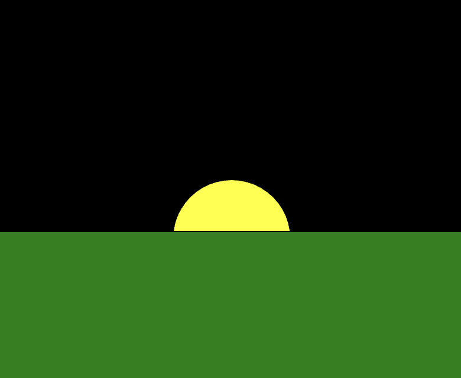

import Callout from "../../../components/Callout/index.astro";
import { Columns, Column } from "../../../components/Columns";
import AnnotatedLine from "../../../components/AnnotatedLine/index.astro";
import Video from "../../../components/Video/index.astro"

En este tutorial aprenderás nuevas formas de agregar interacción del usuario a tus sketches y de controlar el orden en que se ejecuta el código.

Aprenderás estos conceptos básicos de programación creando un sketch de [sol interactivo](https://editor.p5js.org/gbenedis@gmail.com/sketches/nNVmHVf5m) y una [animación de amanecer](https://editor.p5js.org/gbenedis@gmail.com/sketches/9lz2aqfTO):

- Sentencias condicionales (`if`, `if-else` y `else-if`)
- Variables booleanas, operadores de comparación y expresiones
- Operador de asignación de suma/resta
- Incremento y decremento
- Interactividad con las pulsaciones del botón del mouse y la ubicación del puntero

Controlar el flujo de tu programa es fundamental para aprovechar el poder de la computación y hace posible crear animaciones y juegos emocionantes en p5.js. Normalmente, las líneas de código se ejecutan en orden. En tutoriales anteriores has visto cómo la función [`draw()`](/reference/p5/draw) ejecuta el código de arriba abajo de forma repetida. Esto permite superponer formas y crear animaciones tipo “libro animado”. 


### Requisitos previos

- [Configurar tu entorno](/tutorials/setting-up-your-environment)
- [Tutorial de introducción](/tutorials/get-started)
- [Tutorial de Variables y cambio](/tutorials/variables-and-change/)

Antes de empezar, deberías ser capaz de:

- Agregar y personalizar formas y texto en el lienzo usando p5.js
  - [`circle()`](/reference/p5/circle) | [`rect()`](/reference/p5/rect) | [`ellipse()`](/reference/p5/ellipse) | [`triangle()`](/reference/p5/triangle) | [`line()`](/reference/p5/line)
  - [`fill()`](/reference/p5/fill), [`stroke()`](/reference/p5/stroke), [`text()`](/reference/p5/text), [`textSize()`](/reference/p5/textSize)
- Usar variables integradas como [`mouseX`](/reference/p5/mouseX) y [`mouseY`](/reference/p5/mouseY)
- Declarar, inicializar, usar y actualizar variables personalizadas con `let` y el [operador de asignación](https://developer.mozilla.org/en-US/docs/Web/JavaScript/Reference/Operators/Assignment)
- Incorporar movimiento lineal y aleatorio usando [`random()`](/reference/p5/random), [`frameRate()`](/reference/p5/frameRate) y [`frameCount`](/reference/p5/frameCount)
- Comentar código y atender los mensajes de error: para saber más sobre mensajes de error y depuración, lee la referencia [Guía de campo para la depuración](/tutorials/field-guide-to-debugging).


## Parte 1: Sol interactivo

Crear un sketch de [sol interactivo](https://editor.p5js.org/gbenedis@gmail.com/sketches/nNVmHVf5m) es una excelente manera de aprender a usar *sentencias condicionales* e interacción del usuario. 


##  

### La sentencia IF (una sentencia condicional)

Las [*sentencias condicionales*](https://developer.mozilla.org/en-US/docs/Learn/JavaScript/Building_blocks/conditionals) controlan cuándo se ejecutan determinadas líneas de código. Por ejemplo, antes del amanecer el cielo está oscuro. Una vez que sale el sol es de día y el cielo tiene un color más claro. Puedes escribir una *sentencia condicional* (también conocida como *sentencia `if`*) para cambiar el color del cielo según la posición del sol. SI el sol está alto, entonces el cielo debería tener un color claro; de lo contrario, el cielo debería estar oscuro. Las sentencias `if` pueden comprobar la posición del sol y controlar el código que se ejecuta según dónde se encuentre en el cielo.

Antes de poder usar sentencias condicionales que comprueben la posición del sol, podemos agregar variables personalizadas que nos ayuden a actualizar esa posición conforme el puntero se arrastra por el lienzo.


#### Paso uno: define e inicializa variables personalizadas

- Abre un nuevo proyecto de p5.js, nómbralo “Sol interactivo” y guarda el sketch.

- Declara una variable personalizada para la coordenada y del sol llamada `sunHeight`, y una variable personalizada para la coordenada y del horizonte llamada `horizon`. Inicializa la variable del horizonte con 200. 

  - Agrega las siguientes líneas de código a tu sketch antes de [`setup()`](/reference/p5/setup):

    ```js
    //variables personalizadas para la coordenada y del sol y del horizonte
    let sunHeight;
    let horizon = 200;
    ```

- Actualiza `sunHeight` con la coordenada y del puntero, `mouseY`.

  - Agrega el siguiente código dentro de [`draw()`](/reference/p5/draw):

    ```
    //el sol sigue la coordenada y del puntero
    sunHeight = mouseY;
    ```

Tu código debería verse así:

```js
//variables personalizadas para la coordenada y del sol y del horizonte
let sunHeight;
let horizon = 200;
function setup() {
  createCanvas(400, 400);
}
function draw() {
  background(0);
 
  //el sol sigue la coordenada y del puntero
  sunHeight = mouseY;
}
```

Como la altura del sol va cambiando, guardamos la coordenada y del puntero, `mouseY`, en la variable `sunHeight`. Hacer esto dentro de `draw()` actualiza `sunHeight` continuamente cada vez que `draw()` se ejecuta. Aunque el horizonte no cambia, se usa una variable personalizada para el horizonte como punto de referencia y para hacer el código más legible. 

Visita la referencia de p5.js para más información sobre [`mouseY`](/reference/p5/mouseY) y [`let`](/reference/p5/let).


#### Paso dos: dibuja formas y colorea el lienzo

- Dibuja un sol que use la variable personalizada `sunHeight` como su coordenada y.

  - Agrega el siguiente código dentro de [`draw()`](/reference/p5/draw):

    ```js
    //sol
    fill("yellow");
    circle(200, sunHeight, 160);
    ```

- Dibuja una línea para mostrar el horizonte.

  - Agrega el siguiente código dentro de [`draw()`](/reference/p5/draw):

    ```js
    // dibuja la línea del horizonte
    stroke("green");
    line(0,horizon,400,horizon);
    ```

Tu código debería verse así:

```js
//variables personalizadas para la coordenada y del sol y del horizonte
let sunHeight;
let horizon = 200;
function setup() {
  createCanvas(400, 400);
}
function draw() {
  background(0);
 
  //el sol sigue la coordenada y del puntero
  sunHeight = mouseY;

  //sol
  fill("yellow");
  circle(200, sunHeight, 100);


  // dibuja la línea del horizonte
  stroke('green');
  line(0,horizon,400,horizon);
}
```

El sol sigue al puntero mientras este se mueve verticalmente por el lienzo porque `sunHeight` se usa como argumento para la coordenada y del círculo en: `circle(200, sunHeight, 100)`. Se dibuja una línea en el lienzo con `horizon` como argumento para las coordenadas y de cada extremo: `y1, y2`. Esto marca la línea del horizonte en el lienzo, que se usará para cambiar el color del fondo. 

Visita las páginas de referencia de p5.js sobre [formas 2D](/reference#Shape), [color](/reference#Color), [fundamentos](/reference#Foundation) y [eventos del mouse](/reference#Mouse) para aprender más sobre formas y variables. Lee la [Guía de campo para la depuración](/tutorials/field-guide-to-debugging) (Ejemplos 1 y 2) para obtener ayuda con errores comunes.


#### Paso tres: usa una sentencia condicional con una expresión booleana para cambiar el color del fondo

- Establece el color del fondo en azul claro cuando el sol esté por encima del horizonte.
  - Agrega las siguientes líneas a tu sketch dentro de [`draw()`](/reference/p5/draw), después de la línea de código `sunHeight = mouseY`:

    ```js
    //fondo azul claro si el sol está sobre el horizonte
    if(sunHeight < horizon){
      background("lightblue");
    }
    ```

Tu código debería verse así:

```js
//variables personalizadas para la coordenada y del sol y del horizonte
let sunHeight;
let horizon = 200;
function setup() {
  createCanvas(400, 400);
}
function draw() {
  background(0);
 
  //el sol sigue la coordenada y del puntero
  sunHeight = mouseY;


   //fondo azul claro si el sol está sobre el horizonte
  if(sunHeight < horizon){ //comprueba si es de día
     background("lightblue");
  }
  //sol
  fill("yellow");
  circle(200, sunHeight, 100);


  // dibuja la línea del horizonte
  stroke('green');
  line(0,horizon,400,horizon);
}
```

¡Ejecuta el código y experimenta moviendo el sol con el puntero!

En el código anterior, el fondo es negro por defecto porque la primera sentencia que se lee en `draw()` es `background(0)`. Cuando el sol está por debajo de la línea del horizonte, el fondo permanece negro porque la sentencia `if` omite el *bloque de código* dentro de las llaves: `background("lightblue")`. Cuando el sol está por encima de la línea del horizonte, el *bloque de código* dentro de las llaves sí se ejecuta. Esto restablece el color, pasando del negro por defecto a un azul claro. 

Aquí estás controlando cuándo se ejecutan `background(0)` y `background("lightblue")`. Una *sentencia condicional* (o *sentencia `if`*) es una forma de controlar cuándo se ejecutan determinadas líneas de código, lo que cambia lo que ocurre en el sketch. 


#### Sintaxis de la sentencia IF

Una sentencia `if` comienza con la palabra clave `if`, seguida de una o más condiciones entre paréntesis, y de un *bloque de código* entre llaves. El bloque de código se ejecuta si la condición es `true`. La sintaxis de una sentencia `if` se define así:

```js
if (condition) {
  // código que se ejecuta si la condición es verdadera
} 
```


#### Expresiones y valores booleanos

El código dentro de los paréntesis después de la palabra clave `if` puede ser un *valor booleano* o una *expresión booleana*. En el ejemplo de abajo se usa una expresión booleana para comprobar si el valor de la variable `sunHeight` es menor que el valor de la variable `horizon`:

<AnnotatedLine code={({ bottom }) => `
if (${bottom('bool', 'sunHeight < horizon')}) {
  ${bottom('block', 'background("lightblue");')}
}
`}>
  <Fragment slot="bool">Expresión booleana</Fragment>
  <Fragment slot="block">Bloque de código</Fragment>
</AnnotatedLine>

Las *expresiones booleanas* producen un valor *booleano*. Los valores *booleanos* solo pueden ser `true` o `false`*.* A diferencia de los números o las cadenas de texto, solo existen dos valores booleanos. Las *expresiones booleanas* ayudan a comprobar si las condiciones son `true` o `false`; por eso usan símbolos llamados *operadores de comparación*. Los *operadores de comparación* son símbolos especiales que comparan dos valores (ve la tabla de abajo).

Entre los símbolos de [*operadores de comparación*](https://developer.mozilla.org/en-US/docs/Web/JavaScript/Reference/Operators) que puedes usar para crear expresiones booleanas están:

<table>

<tr>

<th>

Símbolo

</th>

<th>

Significado (enlace a la referencia de p5.js)

</th>

<th>

Ejemplo

</th>

</tr>

<tr>

<td>

`<`

</td>

<td>

[menor que](/reference/p5/lt)

</td>

<td>

`x < 5`

</td>

</tr>

<tr>

<td>

`<=`

</td>

<td>

[menor o igual que](/reference/p5/lte)

</td>

<td>

`x <= 5`

</td>

</tr>

<tr>

<td>

`>`

</td>

<td>

[mayor que](/reference/p5/gt)

</td>

<td>

`x > 5`

</td>

</tr>

<tr>

<td>

`>=`

</td>

<td>

[mayor o igual que](/reference/p5/gte)

</td>

<td>

`x >= 5`

</td>

</tr>

<tr>

<td>

`===`

</td>

<td>

Igualdad estricta (significa que los valores de tipos distintos se consideran no iguales)

</td>

<td>

`x === 5`

</td>

</tr>

<tr>

<td>

`!==`

</td>

<td>

distinto de

</td>

<td>

`x !== 5`

</td>

</tr>

</table>

Visita la referencia de MDN para aprender más sobre [expresiones y operadores](https://developer.mozilla.org/en-US/docs/Web/JavaScript/Reference/Operators). 

Puedes pensar en las *expresiones booleanas* como si la computadora hiciera una pregunta. En el código agregado en el paso tres, la expresión booleana es `sunHeight < horizon`. Está preguntando si el valor de la variable `sunHeight` es menor que el valor de la variable `horizon`. Si la respuesta a la pregunta es sí, es decir, si `sunHeight < horizon` da como resultado un valor `true`, entonces el bloque de código se ejecuta. Si la respuesta es no, el bloque de código se omite. 

Podemos ver el valor de `sunHeight < horizon` en la consola agregando `console.log(sunHeight < horizon)` en [`draw()`](/reference/p5/draw) después de `sunHeight = mouseY`. Observa cómo el valor impreso en la consola cambia de `true` a `false` mientras mueves el puntero por el lienzo: el valor es `false` cuando el sol está por debajo de la línea del horizonte, y `true` cuando está por encima. Consulta [este sketch](https://editor.p5js.org/gbenedis@gmail.com/sketches/nNVmHVf5m) para ver un ejemplo.

Visita la página de referencia de p5.js sobre [fundamentos](/reference#Foundation) para aprender más sobre las sentencias `if` y los valores booleanos.


### La sentencia IF-ELSE 

Otra sentencia condicional importante es la *sentencia `if-else`*, en la que se pueden controlar dos bloques de código. La sintaxis de la sentencia `if-else` se define así:

```js
if (condition) {
  // código que se ejecuta si la condición es verdadera
} else {
  // código que se ejecuta si la condición es falsa
}
```

Si la condición es `true`, se ejecuta el primer bloque de código. Si es `false`, se ejecuta el bloque de código que sigue a la palabra clave `else`. Si tu código requiere dos cambios a partir de una sola condición, la sentencia `if-else` es una mejor manera de estructurarlo. Ayuda visualizar las sentencias `if` como diagramas de burbujas, como el de abajo, que muestra cómo el primer bloque de código se ejecuta cuando la condición es verdadera, y el segundo bloque de código se ejecuta cuando es falsa.


Por ejemplo, puedes modificar la sentencia `if` de tu animación de amanecer quitando la función [`background()`](/reference/p5/background) y agregando la siguiente sentencia `if-else`: 

<Columns>
<Column>
##### Código original:

```js
//...función draw

background(0); // cielo nocturno

//el sol sigue la coordenada y del puntero
sunHeight = mouseY;

//fondo azul claro si el sol está sobre el horizonte

if (sunHeight < horizon) {
  background("lightblue"); // cielo azul
}
```
</Column>
<Column>
##### Código modificado:

```js
//...función draw

//el sol sigue la coordenada y del puntero
sunHeight = mouseY;

//fondo azul claro si el sol está sobre el horizonte

// con sentencia if-else

if (sunHeight < horizon) {
  background("lightblue"); // cielo azul si está sobre el horizonte
} else {
  background(0); // cielo nocturno en caso contrario
}
```
</Column>
</Columns>

En el código anterior vemos que, si el sol está por encima del horizonte, `sunHeight < horizon `devuelve `true` y se ejecuta el código `background("lightblue")`. Cuando `sunHeight` NO es menor que el horizonte, se ejecuta el bloque de código que sigue a la palabra clave `else`, `background(0)`. Aunque ambas formas de escribir el código tienen el mismo efecto visual, a veces puede ser más claro y más eficiente usar `if-else`, sobre todo cuando se pueden controlar dos bloques de código distintos. 

Visita las páginas de referencia de p5.js sobre [`if`](/reference/p5/if) y [`Boolean`](/reference/p5/Boolean) para aprender más.


#### Paso cuatro: agrega pasto para ocultar el sol  

Agrega un paisaje con pasto a tu sketch para que no se vea el sol por debajo del horizonte.

- Dibuja un rectángulo verde en el paisaje después del sol, de modo que lo oculte cuando esté por debajo del horizonte. El argumento para la coordenada y de este rectángulo es la ubicación de la línea del horizonte.
  - Agrega el siguiente código en [`draw()`](/reference/p5/draw) después de la línea del horizonte:

    ```js
    //pasto
    fill("green"); 
    rect(0, horizon, 400, 400);
    ```

Tu código debería verse así:

```js
//variables personalizadas para la coordenada y del sol y del horizonte
let sunHeight;
let horizon = 200;
function setup() {
  createCanvas(400, 400);
}
function draw() {

  //el sol sigue la coordenada y del puntero
  sunHeight = mouseY;

  //fondo azul claro si el sol está sobre el horizonte

  //con sentencia if-else

  if (sunHeight < horizon) {
    background("lightblue"); // cielo azul si está sobre el horizonte
  } else {
    background(0); // cielo nocturno en caso contrario
  }

  //sol
  fill("yellow");
  circle(200, sunHeight, 100);


  // dibuja la línea del horizonte
  stroke('green');
  line(0,horizon,400,horizon);

  //pasto

  fill("green");

  rect(0, horizon, 400, 200);

}
```

Ejecuta el sketch y mueve el sol por debajo del horizonte. ¿Ves cómo cambia el cielo conforme el sol desaparece? Enlace al [sketch de ejemplo de la animación de amanecer](https://editor.p5js.org/Msqcoding/sketches/StUo5StZi).

<Callout>
- ¡Usa sentencias condicionales para cambiar el color del pasto! Por ejemplo, cuando el sol sale sobre un paisaje con pasto, su color pasa de un verde oscuro a un verde más claro. 
- ¡Agrega al paisaje de tu sketch más formas cuyos colores cambien! 

[Ejemplo](https://editor.p5js.org/gbenedis@gmail.com/sketches/nNVmHVf5m)
</Callout>


## Parte 2: Animación de amanecer

A continuación crearás una [animación de amanecer](https://editor.p5js.org/gbenedis@gmail.com/sketches/9lz2aqfTO) en la que el sol se mueve por su cuenta y produce un cambio gradual en el color del cielo.

<Video src="/videos/tutorials/sunrise.mp4" alt="Un sol se eleva en un cielo rojo anaranjado detrás de una cordillera." />


#### Paso uno: declara e inicializa variables para la ubicación del sol y el color del fondo

- Abre un nuevo proyecto de p5.js, nómbralo “Animación de amanecer” y guárdalo.

- Declara una variable personalizada para la coordenada y del sol e inicialízala con 600. 

  - Agrega las siguientes líneas a tu sketch antes de [`setup()`](/reference/p5/setup):

    ```js
    //variable para la posición inicial del sol
    //punto por debajo del horizonte
    let sunHeight = 600;
    ```

- Declara una variable personalizada para el valor de los componentes rojo y verde del color del cielo, e inicialízalas con 0.

  - Agrega las siguientes líneas a tu sketch antes de [`setup()`](/reference/p5/setup):

    ```js
    //variables para el cambio de color
    let redVal = 0;
    let greenVal = 0;
    ```

Repasa la referencia de p5.js sobre [`fill()`](/reference/p5/fill) o la referencia de MDN sobre [RGB](https://developer.mozilla.org/en-US/docs/Glossary/RGB) para recordar los códigos de color.

Tu código debería verse así:

```js
//variable para la posición inicial del sol

let sunHeight = 600; //punto por debajo del horizonte

//variables para el cambio de color

let redVal = 0;

let greenVal = 0;


function setup() {
  createCanvas(600, 400);
}
function draw() {

}
```

En este paso creaste las variables `redVal`,` greenVal`,` `y`  sunHeight  `para almacenar valores que se usarán en el programa. El valor inicial de `sunHeight` es un punto por debajo del horizonte, y los valores iniciales de `redVal` y `greenVal` indican un color negro. Estos establecen la posición del sol y el color del cielo cuando comienza la animación. Se les llama *condiciones iniciales* de la animación. Ahora estas variables están disponibles para hacer cambios en el lienzo.


#### Paso dos: usa variables personalizadas para dibujar el paisaje

- Dibuja el fondo a partir de las variables personalizadas para rojo y verde.

  - Agrega el siguiente código dentro de [`draw()`](/reference/p5/draw):

    ```js
     //rellena el fondo a partir de las variables personalizadas
     //el valor del azul se fija en 0 y no cambiará
     background(redVal, greenVal, 0);
    ```

- Dibuja un sol que use la variable personalizada` sunHeight` como su coordenada y.
  - Agrega el siguiente código después de rellenar el fondo:

    ```js
    //sol
    fill(255, 135, 5, 60);
    circle(300, sunHeight, 180);
    fill(255, 100, 0, 100);
    circle(300, sunHeight, 140);
    ```

- Agrega algunas montañas triangulares al paisaje. 

  - Agrega el siguiente código después de dibujar el sol:

    ```js
    //montañas
    fill(110, 50, 18);
    triangle(200, 400, 520, 253, 800, 400);
    fill(110,95,20);
    triangle(200,400,520,253,350,400);  

    fill(150, 75, 0);
    triangle(-100, 400, 150, 200, 400, 400);
    fill(100, 50, 12);
    triangle(-100, 400, 150, 200, 0, 400); 

    fill(150, 100, 0);
    triangle(200, 400, 450, 250, 800, 400);
    fill(120, 80, 50);
    triangle(200, 400, 450, 250, 300, 400);
    ```

Tu código debería verse así:

```js
//variable para la posición inicial del sol

let sunHeight = 600; //punto por debajo del horizonte

//variables para el cambio de color

let redVal = 0;

let greenVal = 0;


function setup() {
  createCanvas(600, 400);
}
function draw() {

  //rellena el fondo con un color basado en las variables personalizadas
  background(redVal, greenVal, 0);

  //sol
  fill(255, 135, 5, 60);
  circle(300, sunHeight, 180);
  fill(255, 100, 0, 100);
  circle(300, sunHeight, 140);

  //montañas
  fill(110, 50, 18);
  triangle(200, 400, 520, 253, 800, 400);
  fill(110,95,20);
  triangle(200,400,520,253,350,400);  
  
  fill(150, 75, 0);
  triangle(-100, 400, 150, 200, 400, 400);
  fill(100, 50, 12);
  triangle(-100, 400, 150, 200, 0, 400); 
  
  fill(150, 100, 0);
  triangle(200, 400, 450, 250, 800, 400);
  fill(120, 80, 50);
  triangle(200, 400, 450, 250, 300, 400);  
}
```

En este paso personalizaste el paisaje de tu animación usando variables personalizadas en tus funciones `background()` y `circle()`. Recuerda: ¡el sol queda oculto detrás de las montañas porque se dibujó primero!

<Callout>
¡Agrega todas las formas que quieras para que tu paisaje sea único e interesante!
</Callout>


#### Paso tres: usa sentencias condicionales para actualizar variables personalizadas

- Haz que el sol se mueva cambiando la variable `sunHeight` mientras sea mayor que 130.

  - Agrega el siguiente código dentro de [`draw()`](/reference/p5/draw):

    ```js
    // disminuye sunHeight en 2 hasta que llegue a 130
    if (sunHeight > 130) {
      sunHeight -=2;
    }
    ```

- Cambia gradualmente el color del cielo modificando los valores de las variables `redVal` y `greenVal `mientras la variable `sunHeight `sea menor que 480.

  - Agrega el siguiente código dentro de [`draw()`](/reference/p5/draw):

    ```js
    // aumenta las variables de color en 4 o en 1 durante el amanecer
    if (sunHeight < 480) {
      redVal += 4;
      greenVal += 1;
    }
    ```

Tu código debería verse así: 

```js
//variable para la posición inicial del sol
let sunHeight = 600; //punto por debajo del horizonte

//variables para el cambio de color
let redVal = 0;
let greenVal = 0;

function setup() {
  createCanvas(600, 400);
}
function draw() {
  //rellena el fondo a partir de las variables personalizadas
  background(redVal, greenVal, 0);
 
  //sol
  fill(255, 135, 5, 60);
  circle(300, sunHeight, 180);
  fill(255, 100, 0, 100);
  circle(300, sunHeight, 140);
 
  //montañas
  fill(110, 50, 18);
  triangle(200, 400, 520, 253, 800, 400);
  fill(110,95,20);
  triangle(200,400,520,253,350,400); 
 
  fill(150, 75, 0);
  triangle(-100, 400, 150, 200, 400, 400);
  fill(100, 50, 12);
  triangle(-100, 400, 150, 200, 0, 400);
 
  fill(150, 100, 0);
  triangle(200, 400, 450, 250, 800, 400);
  fill(120, 80, 50);
  triangle(200, 400, 450, 250, 300, 400);
 
  // disminuye sunHeight en 2 hasta que llegue a 130
  if (sunHeight > 130) {
    sunHeight -= 2;
  }
   
  // aumenta las variables de color en 4 o en 1 durante el amanecer
  if (sunHeight < 480) {
    redVal += 4;
    greenVal += 1;
  } 
}
```

¡Cuando el sketch se ejecuta, el sol se mueve solo! El movimiento se debe a la sentencia `sunHeight -= 2,` que disminuye en `2` el valor de `sunHeight` cada vez que se ejecuta [`draw()`](/reference/p5/draw). El valor de `sunHeight` deja de cambiar cuando la expresión booleana de la sentencia `if`, `sunHeight > 130`, es `false`. Esto ocurre cuando `sunHeight` toma cualquier valor menor o igual que 130.

Cuando el valor de una variable disminuye en cierta cantidad, se le llama *decrementar*, y se usa el símbolo de **resta y asignación** `-=`. Cuando una variable aumenta en cierta cantidad, se le llama *incrementar*, y se usa el operador de **suma y asignación +=**. Cada vez que una variable se incrementa o se decrementa, el valor almacenado en esa variable cambia, y el nuevo valor se guarda en la misma variable.

Visita la referencia de MDN sobre los siguientes operadores para aprender más: [`=`](https://developer.mozilla.org/en-US/docs/Web/JavaScript/Reference/Operators/Assignment) | [`+=`](https://developer.mozilla.org/en-US/docs/Web/JavaScript/Reference/Operators/Addition_assignment) | [`-=`](https://developer.mozilla.org/en-US/docs/Web/JavaScript/Reference/Operators/Subtraction_assignment)

<Callout>
Imprime el valor de `sunHeight` en la consola usando `console.log(sunHeight)` para ver cómo cambia con el tiempo.

[Ejemplo](https://editor.p5js.org/gbenedis@gmail.com/sketches/IHAcGOxNz)
</Callout>

El color del cielo cambia porque `redVal` y `greenVal` cambian de forma gradual. Según la expresión booleana de la segunda sentencia condicional, cuando `sunHeight` es menor que 480, las variables de color cambian: `redVal` aumenta en 4 y `greenVal` aumenta en 1. Cada vez que se ejecuta [`draw()`](/reference/p5/draw), `redVal` y `greenVal` aumentan y se usan para modificar el color del fondo en la siguiente ejecución. Esto crea un efecto animado de amanecer. 

La sentencia `greenVal +=1` también puede escribirse como `greenVal++`. A `++` se le llama **operador de incremento**, y a `--` se le llama **operador de decremento**. 

Las siguientes sentencias tienen el mismo efecto:

```js
// Incrementar en 1.
grow++;
grow += 1;

// Decrementar en 1.
shrink--;
shrink -= 1;
```

Visita la referencia de MDN sobre [++](https://developer.mozilla.org/en-US/docs/Web/JavaScript/Reference/Operators/Increment) y [--](https://developer.mozilla.org/en-US/docs/Web/JavaScript/Reference/Operators/Decrement) para aprender más.

La primera vez que se ejecuta [`draw()`](/reference/p5/draw), el fondo es negro y `sunHeight` disminuye. Después de que el sol alcanza una coordenada y de 480, el color del cielo empieza a cambiar conforme aumentan los valores de `redVal` y `greenVal`. El sol deja de moverse cuando `sunHeight` llega a 130 debido a la primera sentencia condicional:

```js
if (sunHeight > 130) {
  sunHeight -= 2;
}
```

Aquí, `sunHeight `disminuye en 2 cada vez que se ejecuta [`draw()`](/reference/p5/draw) mientras `sunHeight `sea mayor que 130. Cuando llega a 130 o menos, la expresión booleana entre paréntesis es `false` y el código dentro de las llaves deja de ejecutarse. Esto hace que el sol deje de moverse cuando su coordenada y es 130 o menos.


### Condicionales anidados 

Cuando compruebas varias condiciones al mismo tiempo, puedes “anidar” una condición dentro de otra así:

```js
//sunHeight siempre es mayor que 130 para que las variables cambien
if (sunHeight > 130) {
  sunHeight -=2;

  //condición anidada 
  if (sunHeight < 480) {
    redVal +=4;    
    greenVal +=1;
  }
}
```

Cuando pones una sentencia `if` *dentro* de otra sentencia `if`, se le llama sentencia **condicional anidada**. Esto exige que ambas expresiones booleanas sean `true` para que los bloques de código se ejecuten. La diferencia en este ejemplo, comparado con tu código antes de la condición anidada, es que ahora el color del cielo también deja de cambiar una vez que el sol alcanza un valor de y de 130. 

En el código anterior, si `sunHeight` es mayor que 130, se ejecuta el bloque de código dentro de las llaves:
- `sunHeight` disminuye en 2
- Mientras `sunHeight > 130` y `sunHeight < 480` sean `true`, se ejecuta el bloque de código que cambia los valores de `redVal` y `greenVal`.

Observa que, si la expresión booleana de la primera sentencia `if` es `false`, la segunda condición no se comprueba. Esto significa que, mientras `sunHeight` esté entre 130 y 480, `redVal` y `greenVal` cambiarán. Después de que `sunHeight` llegue a 130 o menos, todas las variables dejarán de cambiar. En este caso, `sunHeight > 130` debe ser `true` y `sunHeight < 480` debe ser `true` para que se ejecute el bloque de la sentencia condicional anidada. Enlace al ejemplo del [proyecto terminado](https://editor.p5js.org/gbenedis@gmail.com/sketches/9lz2aqfTO), con [`noStroke()`](/reference/p5/noStroke) en setup para quitar los contornos de las formas.


### Operadores lógicos: `&&` y `||`

Otra forma de escribir sentencias condicionales con más de una condición es usando operadores lógicos. El operador AND (`&&`) se usa cuando *ambas* condiciones deben ser `true` para que se ejecute un bloque de código. El operador OR (`||`) se usa cuando *alguna* de las condiciones debe ser verdadera para que se ejecute un bloque de código.

Podemos reescribir el condicional anidado del sketch de amanecer animado usando el operador lógico AND (`&&`), ya que requiere que `sunHeight` sea mayor que 130 *Y* menor que 480. En el ejemplo de código de abajo, las expresiones booleanas a cada lado del operador deben ser `true` para que se ejecute el código de su bloque: 

```js
if (sunHeight > 130 && sunHeight < 480) {
  //Bloque de código que se ejecuta cuando ambas condiciones son verdaderas
}
```

Visita la referencia de MDN sobre [AND lógico (`&&`)](https://developer.mozilla.org/en-US/docs/Web/JavaScript/Reference/Operators/Logical_AND) y [OR lógico (`||`)](https://developer.mozilla.org/en-US/docs/Web/JavaScript/Reference/Operators/Logical_OR) para aprender más sobre los operadores lógicos.

<Callout>
Practica con los operadores lógicos agregando el siguiente código dentro de `draw()`: 

```js
if (mouseIsPressed == true && sunHeight === 130) {
  background(0);
}
```

[Ejemplo](https://editor.p5js.org/gbenedis@gmail.com/sketches/9lz2aqfTO)
</Callout>


### Variables booleanas: `mouseIsPressed` y `keyIsPressed`

`mouseIsPressed` y `keyIsPressed `son variables especiales integradas en p5.js que contienen valores booleanos. `mouseIsPressed `es `true` cuando el botón del mouse está presionado sobre el lienzo; de lo contrario es `false`. `keyIsPressed `es `true` cuando cualquier tecla del teclado está presionada; de lo contrario es `false`. 

Explora [este ejemplo](https://editor.p5js.org/Msqcoding/sketches/CnKfDeaBG) para ver cómo cambia en la consola el valor almacenado en `mouseIsPressed` cuando se presiona el botón del mouse. 

En el reto “¡Prueba esto!”, cuando `sunHeight` es igual a 130 *Y* el botón del mouse está presionado, el cielo se oscurece. ¡Quizás muestra un eclipse solar! 

Incluso podemos usar `mouseIsPressed` por sí solo en la sentencia `if`:

```js
if (mouseIsPressed && sunHeight === 130) {
  background(0);
}
```

Como `mouseIsPressed` ya almacena un valor `true `o `false`, no necesitamos usar un operador de comparación para crear una expresión booleana. Las expresiones booleanas se evalúan a valores booleanos, y las variables booleanas almacenan valores booleanos. Las sentencias condicionales solo requieren que los valores booleanos sean `true` para que el código se ejecute. Si `mouseIsPressed` es `true`, el bloque de código de la sentencia condicional se ejecutará. 

Explora estos ejemplos que usan `mouseIsPressed` y `keyIsPressed`:

- [Mouse y teclas](https://editor.p5js.org/Msqcoding/sketches/MQtma5kta): explora cómo pueden usarse `mouseIsPressed` y `keyIsPressed` en sentencias condicionales sin operadores lógicos. 
- [Botón en el que se puede hacer clic](https://editor.p5js.org/Msqcoding/sketches/gmRjOEyu_): ¡explora este ejemplo que usa `mouseIsPressed`, `mouseX` y `mouseY` para crear un botón en el que se puede hacer clic!
- [Varias teclas:](https://editor.p5js.org/Msqcoding/sketches/kyYpyMh0p) explora este ejemplo que usa varias teclas para hacer cambios en el lienzo.

Visita las páginas de referencia de p5.js sobre [`mouseIsPressed`](/reference/p5/mouseIsPressed), [`keyIsPressed`](/reference/p5/keyIsPressed) [`key`](/reference/p5/key) y [`keyCode`](/reference/p5/keyCode) para aprender más. 


## Conclusión

Ahora que tienes una animación de amanecer temporizada, prueba cambiar las formas y los colores para modificar el sketch. Intenta agregar nuevas funcionalidades e interacciones, quizá incluso algunas sentencias condicionales nuevas. Tal vez puedas intentar iniciar la animación con una pulsación de tecla o del botón del mouse. 


## Próximos pasos

- [Organizar el código con funciones](/tutorials/organizing-code-with-functions)


## Referencias

- [Tomar decisiones en tu código](https://developer.mozilla.org/en-US/docs/Learn/JavaScript/Building_blocks/conditionals)
- [Operador =](https://developer.mozilla.org/en-US/docs/Web/JavaScript/Reference/Operators/Assignment)
- [Operador +=](https://developer.mozilla.org/en-US/docs/Web/JavaScript/Reference/Operators/Addition_assignment)
- [Operador -=](https://developer.mozilla.org/en-US/docs/Web/JavaScript/Reference/Operators/Subtraction_assignment)
- [Incremento (++)](https://developer.mozilla.org/en-US/docs/Web/JavaScript/Reference/Operators/Increment)
- [Decremento (--)](https://developer.mozilla.org/en-US/docs/Web/JavaScript/Reference/Operators/Decrement)
- [AND lógico (&&)](https://developer.mozilla.org/en-US/docs/Web/JavaScript/Reference/Operators/Logical_AND)
- [OR lógico (||)](https://developer.mozilla.org/en-US/docs/Web/JavaScript/Reference/Operators/Logical_OR)
