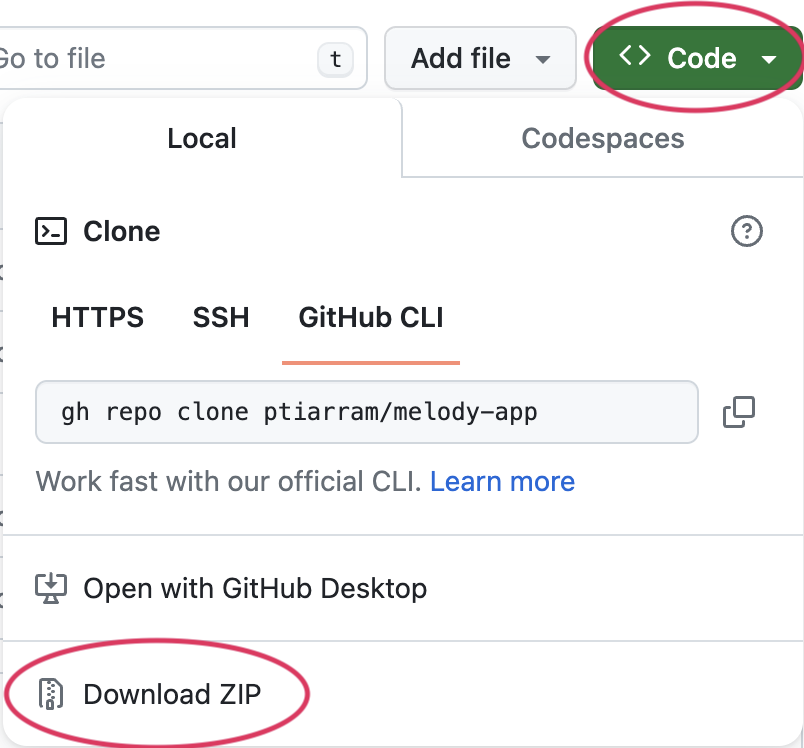

En esta guía, exploraremos la combinación de p5.js y [Node.js](http://node.js) para crear aplicaciones dinámicas que guarden y recuperen dibujos, animaciones y proyectos sonoros generados por las personas usuarias. Por ejemplo, puedes crear una [aplicación simple de melodías](/tutorials/simple-melody-app/) en la que guardes archivos con melodías creadas al interactuar con el lienzo. Node.js te permite guardar, reproducir de nuevo y editar estos archivos fácilmente desde el navegador.


Este tutorial es la parte 2 de una serie de 3 tutoriales que te guían en la creación de distintas versiones de una aplicación de melodías.

- Parte 1: Desarrollarás una [aplicación simple de melodías](https://editor.p5js.org/Msqcoding/sketches/w_4t5bFYe) donde las personas usuarias pueden componer melodías a partir de una escala musical y reproducirlas.
- Parte 2: En este tutorial, aprenderás a usar [Node.js](https://nodejs.org/en/about) y [Express.js](https://expressjs.com/) para enrutar solicitudes [HTTP](https://developer.mozilla.org/en-US/docs/Web/HTTP) que recuperan y reproducen melodías guardadas en tu computadora.
- Parte 3: En Aplicación de melodías con Node.js (¡próximamente!), aprenderás a integrar tu [aplicación simple de melodías](https://editor.p5js.org/Msqcoding/sketches/w_4t5bFYe) con [Node.js](https://nodejs.org/en/about) y [Express.js](https://expressjs.com/). Desarrollarás una aplicación de melodías más compleja en la que las personas usuarias podrán guardar melodías en sus computadoras y recuperarlas para reproducirlas más tarde.


## Requisitos previos

- Esta guía asume que ya conoces los conceptos básicos de JavaScript presentados en los [tutoriales de introducción a p5.js](/tutorials/get-started) y los conceptos básicos de desarrollo web explicados en los tutoriales de [Diseño web](/tutorials/creating-styling-html).
- Esta guía requiere que uses un entorno de desarrollo integrado (IDE) instalado en tu computadora. Asegúrate de entender cómo cargar y guardar archivos en el IDE que elijas. Visita el tutorial [Configurar tu entorno](/tutorials/setting-up-your-environment) para aprender a crear y editar proyectos de p5.js en el IDE [Visual Studio Code.](https://code.visualstudio.com/download)


## Introducción al Protocolo de Transferencia de Hipertexto (HTTP)

¿Alguna vez te has preguntado por qué muchas URL de sitios web comienzan con `https://...`? A las computadoras conectadas a internet se les llama [clientes y servidores](https://developer.mozilla.org/en-US/docs/Learn/Getting_started_with_the_web/How_the_Web_works). Un cliente es la computadora que usas para acceder a internet, y los servidores son computadoras que almacenan información como páginas web y aplicaciones. Cuando usas un navegador web para acceder a [internet](https://developer.mozilla.org/en-US/docs/Learn/Common_questions/Web_mechanics/How_does_the_Internet_work), el navegador utiliza [HTTP (Hypertext Transfer Protocol)](https://developer.mozilla.org/en-US/docs/Web/HTTP) para comunicarse con los servidores donde viven recursos como documentos HTML, imágenes, hojas de estilo, scripts, etc. Cada vez que ves una página en el navegador, este necesita comunicarse con servidores web para recuperar el contenido que estás viendo.

Cuando usas el [Editor Web de p5.js](https://editor.p5js.org/), tu código se ejecuta dentro de un navegador web; por eso, los [métodos HTTP](https://developer.mozilla.org/en-US/docs/Web/HTTP/Methods) se utilizan para recuperar, almacenar, modificar y eliminar tus proyectos. Cuando construyes aplicaciones y proyectos en los que las personas usuarias leen o escriben archivos al interactuar con ellos, los [métodos HTTP](https://developer.mozilla.org/en-US/docs/Web/HTTP/Methods) también se usan para que este proceso sea seguro y sencillo.


Los siguientes [métodos HTTP](https://developer.mozilla.org/en-US/docs/Web/HTTP/Methods) son comunes al integrar solicitudes HTTP en un proyecto de p5.js:

- [GET](https://developer.mozilla.org/en-US/docs/Web/HTTP/Methods/GET): Cuando desarrollas proyectos que requieren recuperar archivos desde un servidor específico, se utiliza el método GET. GET envía una solicitud al servidor para obtener el recurso solicitado, normalmente identificado por una URL.
- [POST](https://developer.mozilla.org/en-US/docs/Web/HTTP/Methods/POST): Al guardar archivos nuevos en un servidor, el método POST envía una solicitud para enviar cambios al servidor.
- [PUT](https://developer.mozilla.org/en-US/docs/Web/HTTP/Methods/PUT): Al actualizar o reemplazar archivos existentes en un servidor, el método PUT solicita que el servidor actualice o sustituya un recurso que ya existe.
- [DELETE](https://developer.mozilla.org/en-US/docs/Web/HTTP/Methods/DELETE): Al eliminar archivos existentes en un servidor, el método DELETE solicita que el servidor borre un recurso que ya existe.


### Paso 1: Configurar el código en un editor externo

Descarga y abre [esta carpeta de proyecto](https://github.com/MsQCompSci/melody_app_starter) en tu editor. Si nunca has usado GitHub, aquí tienes cómo hacerlo: presiona el botón “&lt;&gt; Code” y selecciona “Download Zip”. El archivo `.zip` que se descarga automáticamente a tu computadora contiene una carpeta llamada `public` con todos los archivos de p5.js necesarios para ejecutar un programa de p5.js, un archivo `server.js` que habilita Node.js y una carpeta llamada `songs` con los archivos que leerás en tu proyecto.




### Paso 2: Instalar Node.js y Express.js

[Node.js](https://nodejs.org/) proporciona un entorno de ejecución rápido y eficiente para ejecutar código JavaScript fuera del navegador web. [Express.js](https://expressjs.com/) es un framework que simplifica rutinas y métodos de [Node.js](https://nodejs.org/) para que sea más fácil crear aplicaciones web potentes. Como [Express.js](https://expressjs.com/) depende de módulos y funcionalidades de [Node.js](https://nodejs.org/), primero instalarás [Node.js](https://nodejs.org/).

Aprende más sobre [Node.js](https://nodejs.org/) y [Express.js](https://expressjs.com/) visitando estos recursos:

- [Introduction to Node](https://www.youtube.com/watch?v=bjULmG8fqc8) - videotutorial
- [What is Node.js?](https://www.youtube.com/watch?v=yEHCfRWz-EI) - video
- [Node.js vs Express.js](https://www.youtube.com/watch?v=HFF4NQEGG-Y) - video
- [Documentación de Node.js](https://nodejs.org/docs/latest/api/)
- [Referencia de Express.js](https://expressjs.com/en/4x/api.html)


#### Instalar Node.js

Para Windows y macOS:

- Descarga el instalador: Ve al [sitio web de Node.js](https://nodejs.org/) y descarga el instalador para tu sistema operativo. Se recomienda descargar la versión LTS (Long Term Support) para tener mayor estabilidad.
- Ejecuta el instalador: Cuando termine la descarga, ejecuta el instalador y sigue las instrucciones. Esto instalará tanto [Node.js](https://nodejs.org/) como [npm](https://nodejs.org/en/learn/getting-started/an-introduction-to-the-npm-package-manager) (Node Package Manager), que se usa para gestionar paquetes de JavaScript.
- Verifica la instalación: Para asegurarte de que [Node.js](https://nodejs.org/) y [npm](https://nodejs.org/en/learn/getting-started/an-introduction-to-the-npm-package-manager) estén instalados correctamente, abre tu terminal (Símbolo del sistema en Windows o Terminal en macOS) y escribe:

```sh
node -v

npm -v
```

Visita estos recursos para obtener más información sobre cómo usar la terminal en tu computadora:

- [Símbolo del sistema](https://learn.microsoft.com/en-us/windows-server/administration/windows-commands/windows-commands) - Windows
- [Terminal de Mac](https://support.apple.com/guide/terminal/open-or-quit-terminal-apd5265185d-f365-44cb-8b09-71a064a42125/mac#:~:text=Click%20the%20Launchpad%20icon%20in,%2C%20then%20double%2Dclick%20Terminal) - Apple

Estos comandos deberían mostrar las versiones de Node.js y npm instaladas en tu computadora. Por ejemplo, podrías ver `v20.11.1` en la terminal después de escribir `node -v` y presionar la tecla Enter (o Return). Esto significa que instalaste correctamente la versión `20.11.1` de Node.js. Si Node.js no está instalado, es posible que en su lugar aparezca un mensaje de error indicando que `node` no se reconoce como un comando. Del mismo modo, podrías ver `10.2.4` después de escribir `npm -v` y presionar Enter. Si npm no está instalado en tu computadora, también podrías recibir un mensaje de error. En algunos casos, conviene verificar la instalación después de reiniciar la computadora para asegurarte de que el software recién instalado aparezca correctamente en la terminal.


#### Instalar Express.js

Usa [`npm`](https://nodejs.org/en/learn/getting-started/an-introduction-to-the-npm-package-manager) para instalar Express.js: cambia el directorio en la terminal para que apunte a la carpeta del proyecto del paso 1. Por ejemplo, si la carpeta se llama `melody-app-starter-main` y se descargó en la carpeta `downloads` de tu computadora, puedes cambiar el directorio desde la terminal usando el siguiente comando y presionando Enter:

```sh
cd downloads/melody_app_starter-main
```

- **Crea un archivo [`package.json`](https://docs.npmjs.com/cli/v10/configuring-npm/package-json):** Escribe el siguiente comando en la terminal y presiona Enter:

  ```sh
  npm init -y
  ```

  La terminal debería mostrar el contenido del nuevo archivo [`package.json`](https://docs.npmjs.com/cli/v10/configuring-npm/package-json) que acabas de crear en el directorio de tu proyecto. Este comando inicializa un proyecto nuevo de Node.js con valores predeterminados. El mensaje puede incluir algo como esto:

  ```json
  {
    "name": "melody_app_starter",
    "version": "1.0.0",
    "description": "p5.Oscillator and Express.js",
    "main": "server.js",
    "scripts": {
      "test": "echo \"Error: no test specified\" && exit 1",
      "start": "node server.js"
    },
    "keywords": [],
    "author": "",
    "license": "ISC"
  }
  ```

  Consulta la documentación de [`package.json`](https://docs.npmjs.com/cli/v10/configuring-npm/package-json) en la [referencia de npm](https://docs.npmjs.com/about-npm) para aprender más.

- **Instala Express.js:** Escribe el siguiente comando en la terminal y presiona Enter:

  ```sh
  npm install express
  ```

  Observa cómo se usa `npm` para acceder a Express.js.

- **Verifica la instalación:** Puedes comprobar que Express.js está instalado en tu computadora escribiendo el siguiente comando en la terminal y presionando Enter:

  ```sh
  npm list
  ```

  Tu terminal debería mostrar una estructura en árbol con todos los paquetes de npm instalados en tu computadora. Si Express.js está instalado, deberías ver algo similar a esto:

  ```
  melody_app_starter-main@1.0.0 /Users/..filepath
  
  └── express@4.19.1
  ```

  Esto indica que en tu computadora está instalada la versión 4.19.1 de Express.js. También puedes revisar la carpeta `node_modules` en el directorio de tu proyecto (por ejemplo, en la carpeta `melody-app-starter-main`) para ver si Express.js aparece allí.

- **Ejecuta el servidor:** En tu terminal, escribe el siguiente comando y presiona Enter:

  ```sh
  node server.js
  ```

  Si todo está instalado correctamente y el servidor de Node.js funciona, debería aparecer un mensaje en la terminal como este:

  ```
  Server running at http://localhost:3000
  ```

- **Prueba el servidor:** Abre un navegador web y ve a [**http://localhost:3000**](http://localhost:3000). Deberías ver un elemento `canvas` vacío en el navegador.


### Paso 3: Leer nombres de archivos desde una carpeta en el servidor

- Abre VSCode, o el editor de código que prefieras, y abre el archivo `melody_app_starter-main`.
- Revisa el árbol de archivos para ubicar las carpetas y archivos del proyecto.
- Para permitir leer archivos JSON desde el servidor, agregaremos instrucciones en el archivo `server.js` usando una solicitud HTTP [GET](https://developer.mozilla.org/en-US/docs/Web/HTTP/Methods/GET). En `server.js`, agrega el siguiente código debajo de `let app = express()`:

```js
//initialize file system module
let fs = require('fs');

// API endpoint to get list of songs
app.get('/songs', (req, res) => {
  fs.readdir('songs', (err, files) => {
    if (err) {
      res.status(500).send('Error reading song files');
    } else {
      res.json({ files });
    }
  });
});
```

El código anterior inicializa el [módulo del sistema de archivos (`fs`)](https://nodejs.org/api/fs.html), que proporciona APIs para interactuar con los sistemas de archivos de una computadora. También usa el método `app.get()`, que maneja solicitudes HTTP GET dirigidas a la URL `/songs`. Aquí usarás el módulo del sistema de archivos para leer los nombres de archivos de la carpeta, convertirlos en un objeto JSON y enviarlos como respuesta a la solicitud GET.

Ahora que ya indicaste a la solicitud GET cómo leer los nombres de archivo de la carpeta `songs`, podemos cargar esos nombres como un objeto JSON en `sketch.js`.

- Usa `preload()` y `loadJSON()` para cargar los archivos de la carpeta `songs` en una variable global llamada `songs`. Visita la [referencia de p5.js](/reference) para aprender más sobre [`preload()`](/reference/p5/preload) y [`loadJSON()`](/reference/p5/loadJSON).
- Usa `console.log(songs)` en `setup()` para imprimir el contenido del arreglo JSON.

Tu archivo `sketch.js` debería verse así:

```js
//variable for JSON object with file names
let songs;

function preload() {
  //load and save the songs folder as JSON
  songs = loadJSON("/songs");
}

function setup() {
  createCanvas(400, 400);
  console.log(songs)
}

function draw() {
  background(220);
}
```

Mira la consola del navegador para asegurarte de que la salida de la variable `songs` se vea más o menos así:

```
Object i
  files: Array(3)
    0: "C Major Scale.json"
    1: "Frere Jacques.json"
    2: "Mary's Lamb.json"
    length: 3
// ...prototype
```

Ahora estás listo para crear la [aplicación de melodías](./simple-melody-app). Puedes acceder al código completo de esta guía en [este repositorio de GitHub](https://github.com/MsQCompSci/melodyAppNodeStarter/tree/main).


## Próximos pasos

- Lee sobre la biblioteca [`p5.Oscillator`](/reference/p5.sound/p5.Oscillator/) y experimenta con [este ejemplo](https://editor.p5js.org/Msqcoding/sketches/wSFTn9G9E).
- Aprende a usar [`app.post()`](https://expressjs.com/en/5x/api.html#app.post.method) y [`fs.writeFile()`](https://nodejs.org/en/learn/manipulating-files/writing-files-with-nodejs) para guardar archivos creados por las personas usuarias con tu aplicación de p5.js, visitando los enlaces de referencia.


## Recursos

- [Cómo funciona la web](https://developer.mozilla.org/en-US/docs/Learn/Getting_started_with_the_web/How_the_Web_works)
- [Métodos HTTP](https://developer.mozilla.org/en-US/docs/Web/HTTP/Methods)
  - [GET](https://developer.mozilla.org/en-US/docs/Web/HTTP/Methods/GET)
  - [POST](https://developer.mozilla.org/en-US/docs/Web/HTTP/Methods/POST)
  - [PUT](https://developer.mozilla.org/en-US/docs/Web/HTTP/Methods/PUT)
  - [DELETE](https://developer.mozilla.org/en-US/docs/Web/HTTP/Methods/DELETE)
