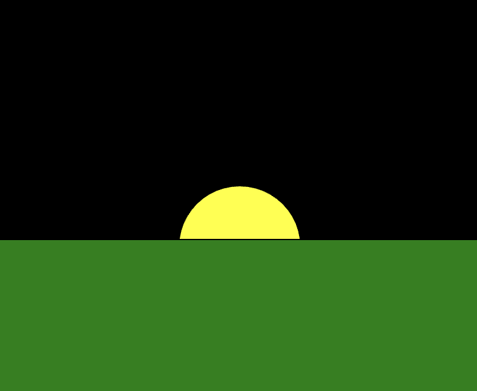
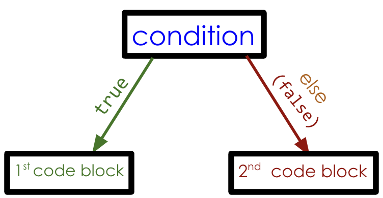

import Callout from "../../../components/Callout/index.astro";
import { Columns, Column } from "../../../components/Columns";
import AnnotatedLine from "../../../components/AnnotatedLine/index.astro";
import Video from "../../../components/Video/index.astro"

इस ट्यूटोरियल में, आप अपने स्केच में यूज़र इंटरैक्शन जोड़ने के नए तरीके सीखेंगे और यह समझेंगे कि कोड किस क्रम में चलता है उसे कैसे नियंत्रित किया जाए।

आप इन बुनियादी प्रोग्रामिंग कॉन्सेप्ट्स को एक [interactive sun](https://editor.p5js.org/gbenedis@gmail.com/sketches/nNVmHVf5m) स्केच और एक [sunrise animation](https://editor.p5js.org/gbenedis@gmail.com/sketches/9lz2aqfTO) बनाकर सीखेंगे:

- कंडीशनल स्टेटमेंट्स (if, if-else, और else-if)
- Boolean वेरिएबल्स, comparison operators, और expressions
- Addition/subtraction assignment operator
- Incrementing और decrementing
- माउस बटन प्रेस और माउस पॉइंटर की स्थिति के साथ इंटरैक्टिविटी

अपने प्रोग्राम के flow को नियंत्रित करना कंप्यूटिंग की शक्ति का एक केंद्रीय हिस्सा है और यही p5.js में रोमांचक एनीमेशन और गेम्स बनाना संभव बनाता है। आमतौर पर, कोड की लाइनों का निष्पादन क्रम में होता है। पिछले ट्यूटोरियल्स में, आपने देखा है कि [`draw()`](/reference/p5/draw) फ़ंक्शन ऊपर से नीचे तक कोड को बार-बार चलाता है। इससे overlapping shapes और “flip book” जैसी एनीमेशन बन पाती हैं।


### आवश्यक पूर्व ज्ञान (Prerequisites)

- [Setting Up Your Environment](/tutorials/setting-up-your-environment)
- [Get Started Tutorial](/tutorials/get-started)
- [Variables and Change Tutorial](/tutorials/variables-and-change/)

शुरू करने से पहले, आपको निम्नलिखित चीज़ें आनी चाहिए:

- p5.js का उपयोग करके कैनवास पर आकृतियाँ और टेक्स्ट जोड़ना और उन्हें कस्टमाइज़ करना  
  - [`circle()`](/reference/p5/circle) | [`rect()`](/reference/p5/rect) | [`ellipse()`](/reference/p5/ellipse) | [`triangle()`](/reference/p5/triangle) | [`line()`](/reference/p5/line)  
  - [`fill()`](/reference/p5/fill), [`stroke()`](/reference/p5/stroke), [`text()`](/reference/p5/text), [`textSize()`](/reference/p5/textSize)
- [`mouseX`](/reference/p5/mouseX) और [`mouseY`](/reference/p5/mouseY) जैसे built-in वेरिएबल्स का उपयोग करना  
- `let` और [assignment operator](https://developer.mozilla.org/en-US/docs/Web/JavaScript/Reference/Operators/Assignment) का उपयोग करके custom वेरिएबल्स को declare, initialize, उपयोग और अपडेट करना  
- [`random()`](/reference/p5/random), [`frameRate()`](/reference/p5/frameRate) और [`frameCount`](/reference/p5/frameCount) का उपयोग करके linear और random motion को शामिल करना  
- कोड में comments लिखना और error messages को समझना — error messages और debugging के बारे में अधिक जानने के लिए, [Field Guide to Debugging](/tutorials/field-guide-to-debugging) पढ़ें।


## भाग 1: Interactive Sun

एक [interactive sun](https://editor.p5js.org/gbenedis@gmail.com/sketches/nNVmHVf5m) स्केच बनाना *conditional statements* और यूज़र इंटरैक्शन का उपयोग करना सीखने का एक शानदार तरीका है।


## 

### IF स्टेटमेंट (एक conditional statement)

[*Conditional statements*](https://developer.mozilla.org/en-US/docs/Learn/JavaScript/Building_blocks/conditionals) यह नियंत्रित करते हैं कि कोड की कौन-सी विशेष लाइनों को कब चलाया जाए। उदाहरण के लिए, सूर्योदय से पहले आसमान अंधेरा होता है। जैसे ही सूरज ऊपर आता है, दिन हो जाता है और आसमान का रंग हल्का हो जाता है। आप सूरज की स्थिति के आधार पर आसमान का रंग बदलने के लिए एक *conditional statement* (जिसे *if statement* भी कहा जाता है) लिख सकते हैं। यदि सूरज ऊपर है, तो आसमान का रंग हल्का होना चाहिए; अन्यथा आसमान गहरा होना चाहिए। If statements सूरज की स्थिति की जाँच कर सकते हैं और इस आधार पर यह नियंत्रित कर सकते हैं कि उसकी स्थिति के अनुसार कौन-सा कोड चले।

सूरज की स्थिति की जाँच करने वाले conditional statements का उपयोग करने से पहले, हम कुछ custom वेरिएबल्स जोड़ सकते हैं जो माउस पॉइंटर को कैनवास पर ड्रैग करने पर सूरज की स्थिति को अपडेट करने में हमारी मदद करेंगे।


#### स्टेप वन: Custom वेरिएबल्स को define और initialize करें

- एक नया p5.js प्रोजेक्ट खोलें, उसका नाम “Interactive Sun” रखें, और स्केच को सेव करें।

- सूरज के y-coordinate के लिए `sunHeight` नाम का एक custom वेरिएबल declare करें, और horizon के y-coordinate के लिए `horizon` नाम का एक custom वेरिएबल बनाएं। `horizon` वेरिएबल को 200 से initialize करें।  

  - अपने स्केच में [`setup()`](/reference/p5/setup) से पहले निम्नलिखित कोड की लाइनें जोड़ें:

    ```js
    //custom variables for y-coordinate of sun & horizon
    let sunHeight;
    let horizon = 200;
    ```

- `sunHeight` को माउस पॉइंटर के y-coordinate, यानी `mouseY`, के बराबर अपडेट करें।

  - [`draw()`](/reference/p5/draw) के अंदर निम्नलिखित कोड जोड़ें:

    ```
    //sun follows y-coordinate of mouse
    sunHeight = mouseY;
    ```

आपका कोड इस प्रकार दिखना चाहिए:

```js
//custom variables for y-coordinate of sun & horizon
let sunHeight;
let horizon = 200;
function setup() {
  createCanvas(400, 400);
}
function draw() {
  background(0);
  
  //sun follows y-coordinate of mouse
  sunHeight = mouseY;
}
```

चूंकि सूरज की ऊंचाई बदल रही है, हम माउस के y-coordinate `mouseY` को `sunHeight` वेरिएबल में स्टोर करते हैं। इसे `draw()` के अंदर रखने से हर बार जब `draw()` चलता है, `sunHeight` लगातार अपडेट होता रहता है। हालांकि horizon नहीं बदल रहा है, फिर भी उसके लिए एक custom वेरिएबल का उपयोग reference point के रूप में और कोड को अधिक readable बनाने के लिए किया जाता है।

[`mouseY`](/reference/p5/mouseY) और [`let`](/reference/p5/let) के बारे में अधिक जानकारी के लिए p5.js reference देखें।


#### स्टेप टू: आकृतियाँ बनाएं और कैनवास को रंग दें

- एक सूरज बनाएं जो अपने y-coordinate के लिए custom वेरिएबल `sunHeight` का उपयोग करता हो।

  - [`draw()`](/reference/p5/draw) के अंदर निम्नलिखित कोड जोड़ें:

    ```js
    //sun
    fill("yellow");
    circle(200, sunHeight, 160);
    ```

- horizon दिखाने के लिए एक रेखा बनाएं।

  - [`draw()`](/reference/p5/draw) के अंदर निम्नलिखित कोड जोड़ें:

    ```js
    // draw line for horizon
    stroke("green");
    line(0,horizon,400,horizon);
    ```

आपका कोड इस प्रकार दिखना चाहिए:

```js
//custom variables for y-coordinate of sun & horizon
let sunHeight;
let horizon = 200;
function setup() {
  createCanvas(400, 400);
}
function draw() {
  background(0);
  
  //sun follows y-coordinate of mouse
  sunHeight = mouseY;

  //sun
  fill("yellow");
  circle(200, sunHeight, 100);


  // draw line for horizon
  stroke('green');
  line(0,horizon,400,horizon);
}
```

सूरज माउस पॉइंटर का ऊर्ध्वाधर दिशा में अनुसरण करता है क्योंकि `circle(200, sunHeight, 100)` में सर्कल के y-coordinate के लिए `sunHeight` का उपयोग किया गया है। कैनवास पर एक रेखा खींची जाती है जिसमें प्रत्येक endpoint के y-coordinates (`y1, y2`) के लिए `horizon` को argument के रूप में उपयोग किया गया है। यह कैनवास पर horizon रेखा को दर्शाता है, जिसका उपयोग आगे background का रंग बदलने के लिए किया जाएगा।

आकृतियों और वेरिएबल्स के बारे में अधिक जानने के लिए p5.js reference के [2D shapes](/reference#Shape), [color](/reference#Color), [foundations](/reference#Foundation) और [mouse events](/reference#Mouse) पेज देखें। सामान्य bugs के समाधान के लिए [Field Guide to Debugging](/tutorials/field-guide-to-debugging) (Examples 1 & 2) पढ़ें।


#### स्टेप थ्री: Background का रंग बदलने के लिए Boolean expression के साथ एक conditional statement का उपयोग करें

- जब सूरज horizon से ऊपर हो, तो background का रंग हल्का नीला सेट करें।  
  - अपने स्केच में [`draw()`](/reference/p5/draw) के अंदर `sunHeight = mouseY` वाली लाइन के बाद निम्नलिखित कोड जोड़ें:

    ```js
    //light blue background if sun is above horizon
    if(sunHeight < horizon){
      background("lightblue");
    }
    ```

आपका कोड इस प्रकार दिखना चाहिए:

```js
//custom variables for y-coordinate of sun & horizon
let sunHeight;
let horizon = 200;
function setup() {
  createCanvas(400, 400);
}
function draw() {
  background(0);
  
  //sun follows y-coordinate of mouse
  sunHeight = mouseY;

  //light blue background if sun is above horizon
  if(sunHeight < horizon){ //check if it is daytime
    background("lightblue");
  }

  //sun
  fill("yellow");
  circle(200, sunHeight, 100);


  // draw line for horizon
  stroke('green');
  line(0,horizon,400,horizon);
}
```

कोड को चलाएँ और माउस की मदद से सूरज को हिलाकर प्रयोग करें!

ऊपर दिए गए कोड में, डिफ़ॉल्ट रूप से background काला है क्योंकि `draw()` में सबसे पहले पढ़ी जाने वाली स्टेटमेंट `background(0)` है। जब सूरज horizon रेखा के नीचे होता है, तो background काला ही रहता है क्योंकि if स्टेटमेंट curly braces के अंदर वाले *code block* — `background("lightblue")` — को छोड़ देता है। जब सूरज horizon रेखा के ऊपर होता है, तब curly braces के अंदर वाला *code block* चलता है। इससे रंग डिफ़ॉल्ट काले रंग से बदलकर हल्का नीला हो जाता है।

यहाँ आप नियंत्रित कर रहे हैं कि `background(0)` और `background("lightblue")` कब चलें। एक *conditional statement* (या *if statement*) इस बात को नियंत्रित करने का तरीका है कि कोड की कौन-सी विशेष लाइनें कब चलें, जिससे स्केच में होने वाला व्यवहार बदलता है।


#### IF स्टेटमेंट का सिंटैक्स

एक if स्टेटमेंट की शुरुआत `if` कीवर्ड से होती है, जिसके बाद parenthesis के अंदर condition(s) लिखी जाती हैं, और curly braces के अंदर कोड की लाइनें होती हैं जिन्हें *code block* कहा जाता है। यदि condition `true` होती है, तो code block चलता है। if स्टेटमेंट का सिंटैक्स इस प्रकार होता है:

```js
if (condition) {
  // code to run if the condition is true
}
```


#### Boolean expressions और values

`if` कीवर्ड के बाद parentheses के अंदर लिखा गया कोड एक *Boolean value* या एक *Boolean expression* हो सकता है। नीचे दिए गए उदाहरण में, एक Boolean expression का उपयोग यह जाँचने के लिए किया गया है कि `sunHeight` वेरिएबल का मान `horizon` वेरिएबल के मान से कम है या नहीं:

<AnnotatedLine code={({ bottom }) => `
if (${bottom('bool', 'sunHeight < horizon')}) {
  ${bottom('block', 'background("lightblue");')}
}
`}>
  <Fragment slot="bool">Boolean expression</Fragment>
  <Fragment slot="block">Code block</Fragment>
</AnnotatedLine>

*Boolean expressions* ऐसे कथन (statements) होते हैं जिनका परिणाम एक *Boolean* value होता है। *Boolean* values केवल `true` या `false` हो सकती हैं। संख्याओं या strings के विपरीत, Boolean की केवल दो ही संभावित values होती हैं। *Boolean expressions* यह जाँचने में मदद करते हैं कि कोई condition `true` है या `false`; इसलिए वे *comparison operators* नामक प्रतीकों का उपयोग करते हैं। *Comparison operators* विशेष symbols होते हैं जो दो values की तुलना करते हैं (नीचे दी गई तालिका देखें)।

[*Comparison operator*](https://developer.mozilla.org/en-US/docs/Web/JavaScript/Reference/Operators) के symbols, जिनका उपयोग आप Boolean expressions बनाने के लिए कर सकते हैं, निम्नलिखित हैं:

<table>

<tr>

<th>

Symbol

</th>

<th>

Meaning (p5.js ref link)

</th>

<th>

Example

</th>

</tr>

<tr>

<td>

`<`

</td>

<td>

[less than](/reference/p5/lt)

</td>

<td>

`x < 5`

</td>

</tr>

<tr>

<td>

`<=`

</td>

<td>

[less than or equal to](/reference/p5/lte)

</td>

<td>

`x <= 5`

</td>

</tr>

<tr>

<td>

`>`

</td>

<td>

[greater than](/reference/p5/gt)

</td>

<td>

`x > 5`

</td>

</tr>

<tr>

<td>

`>=`

</td>

<td>

[greater than or equal to](/reference/p5/gte)

</td>

<td>

`x >= 5`

</td>

</tr>

<tr>

<td>

`===`

</td>

<td>

Strict equality (अर्थात अलग-अलग types की values को बराबर नहीं माना जाता)

</td>

<td>

`x === 5`

</td>

</tr>

<tr>

<td>

`!==`

</td>

<td>

बराबर नहीं (not equal to)

</td>

<td>

`x !== 5`

</td>

</tr>

</table>

[expressions and operators](https://developer.mozilla.org/en-US/docs/Web/JavaScript/Reference/Operators) के बारे में अधिक जानने के लिए MDN reference देखें।

आप *Boolean expressions* को ऐसे समझ सकते हैं जैसे कंप्यूटर कोई प्रश्न पूछ रहा हो। स्टेप थ्री में जो कोड जोड़ा गया था, उसमें Boolean expression `sunHeight < horizon` है। यह पूछ रहा है कि क्या `sunHeight` वेरिएबल का मान `horizon` वेरिएबल के मान से कम है। यदि इस प्रश्न का उत्तर हाँ है, यानी `sunHeight < horizon` का परिणाम `true` है, तो code block चलता है। यदि उत्तर नहीं है, तो code block को छोड़ दिया जाता है।

हम `sunHeight < horizon` की value को console में देख सकते हैं। इसके लिए [`draw()`](/reference/p5/draw) में `sunHeight = mouseY` के बाद `console.log(sunHeight < horizon)` जोड़ें। ध्यान दें कि जब आप माउस को कैनवास पर घुमाते हैं, तो console में प्रिंट होने वाली value `true` और `false` के बीच बदलती रहती है: जब सूरज horizon रेखा के नीचे होता है, तो value `false` होती है, और जब वह horizon रेखा के ऊपर होता है, तो value `true` होती है। उदाहरण के लिए [इस स्केच](https://editor.p5js.org/gbenedis@gmail.com/sketches/nNVmHVf5m) को देखें।

if statements और Boolean values के बारे में अधिक जानने के लिए p5.js reference के [foundations](/reference#Foundation) पेज पर जाएँ।


### IF-ELSE स्टेटमेंट

एक और महत्वपूर्ण conditional है *if-else statement*, जिसमें दो code blocks होते हैं जिन्हें नियंत्रित किया जा सकता है। if-else स्टेटमेंट का सिंटैक्स इस प्रकार है:

```js
if (condition) {
  // code to run if the condition is true
} else {
  // code to run if the condition is false
}
```

यदि condition `true` होती है, तो पहला code block चलता है। यदि condition `false` होती है, तो `else` कीवर्ड के बाद वाला code block चलता है। यदि आपके कोड में एक ही condition के आधार पर दो अलग-अलग बदलाव करने हों, तो if-else statement आपके कोड को संरचित करने का बेहतर तरीका है। if statements को समझने के लिए उन्हें bubble map की तरह देखना मददगार होता है, जैसा नीचे दिखाया गया है — जहाँ condition `true` होने पर पहला code block चलता है और `false` होने पर दूसरा code block।



उदाहरण के लिए, आप अपने sunset animation में if statement को संशोधित कर सकते हैं। इसके लिए [`background()`](/reference/p5/background) फ़ंक्शन को हटाएँ और नीचे दिया गया if-else statement जोड़ें:

<Columns>
<Column>
##### मूल कोड:

```js
//...function draw

background(0); // night sky

//sun follows y-coordinate of mouse
sunHeight = mouseY;

//light blue background if sun is above horizon

if (sunHeight < horizon) {
  background("lightblue"); // blue sky
}
```
</Column>
<Column>
##### संशोधित कोड:

```js
//...function draw

//sun follows y-coordinate of mouse
sunHeight = mouseY;

//light blue background if sun is above horizon

// with if-else statement

if (sunHeight < horizon) {
  background("lightblue"); // blue sky if above horizon
} else {
  background(0); // night sky otherwise
}
```
</Column>
</Columns>

ऊपर दिए गए कोड में, यदि सूरज horizon के ऊपर है, तो `sunHeight < horizon` का परिणाम `true` होता है और `background("lightblue")` वाला कोड चलता है। जब `sunHeight`, horizon से कम नहीं होता है, तो `else` कीवर्ड के बाद वाला code block — `background(0)` — चलता है। हालांकि दोनों तरीकों से लिखे गए कोड का दृश्य परिणाम समान होता है, लेकिन कई बार if-else का उपयोग करना अधिक स्पष्ट और प्रभावी होता है, खासकर जब दो अलग-अलग code blocks को नियंत्रित करना हो।

[`if`](/reference/p5/if) और [`Boolean`](/reference/p5/Boolean) के बारे में अधिक जानने के लिए p5.js reference पेज देखें।


#### स्टेप फोर: सूरज को छिपाने के लिए घास जोड़ें

अपने स्केच में एक घास वाला लैंडस्केप जोड़ें ताकि horizon के नीचे होने पर सूरज दिखाई न दे।

- सूरज के बाद लैंडस्केप पर एक हरा rectangle बनाएं, ताकि जब सूरज horizon के नीचे हो तो वह छिप जाए। इस rectangle के y-coordinate के लिए `horizon` लाइन की स्थिति का उपयोग करें।  
  - [`draw()`](/reference/p5/draw) में horizon वाली लाइन के बाद निम्नलिखित कोड जोड़ें:

    ```js
    //grass
    fill("green"); 
    rect(0, horizon, 400, 400);
    ```

आपका कोड इस प्रकार दिखना चाहिए:

```js
//custom variables for y-coordinate of sun & horizon
let sunHeight;
let horizon = 200;
function setup() {
  createCanvas(400, 400);
}
function draw() {

  //sun follows y-coordinate of mouse
  sunHeight = mouseY;

  //light blue background if sun is above horizon

  //with if-else statement

  if (sunHeight < horizon) {
    background("lightblue"); // blue sky if above horizon
  } else {
    background(0); // night sky otherwise
  }

  //sun
  fill("yellow");
  circle(200, sunHeight, 100);


  // draw line for horizon
  stroke('green');
  line(0,horizon,400,horizon);

  //grass

  fill("green");

  rect(0, horizon, 400, 200);

}
```

स्केच को चलाएँ और सूरज को horizon के नीचे ले जाएँ। ध्यान दें कि जैसे ही सूरज गायब होता है, आसमान का रंग कैसे बदलता है? [sunrise animation sample sketch](https://editor.p5js.org/Msqcoding/sketches/StUo5StZi) देखें।

<Callout>
- घास का रंग बदलने के लिए conditional statements का उपयोग करें! उदाहरण के लिए, जब सूरज घास वाले लैंडस्केप पर उगता है, तो उसका रंग गहरे हरे से हल्के हरे में बदल सकता है।  
- अपने स्केच के लैंडस्केप में कुछ और आकृतियाँ जोड़ें जिनके रंग भी बदलते हों!  

[Example](https://editor.p5js.org/gbenedis@gmail.com/sketches/nNVmHVf5m)
</Callout>


## भाग 2: Sunrise Animation

अब आप एक [sunrise animation](https://editor.p5js.org/gbenedis@gmail.com/sketches/9lz2aqfTO) बनाएँगे, जिसमें सूरज अपने आप ऊपर की ओर चलेगा और आसमान के रंग में धीरे-धीरे बदलाव लाएगा।

<Video src="/videos/tutorials/sunrise.mp4" alt="एक लाल-नारंगी आसमान में पहाड़ों की श्रृंखला के पीछे से सूरज उगता है।" />


#### स्टेप वन: सूरज की स्थिति और background रंग के लिए वेरिएबल्स declare और initialize करें

- एक नया p5.js प्रोजेक्ट खोलें, उसका नाम “Sunrise Animation” रखें, और उसे सेव करें।

- सूरज के y-coordinate के लिए एक custom वेरिएबल declare करें और उसे 600 से initialize करें।  

  - [`setup()`](/reference/p5/setup) से पहले अपने स्केच में निम्नलिखित लाइनें जोड़ें:

    ```js
    //variable for initial sun position
    //point below horizon
    let sunHeight = 600;
    ```

- आसमान के रंग के red और green components की value के लिए custom वेरिएबल्स declare करें और उन्हें 0 से initialize करें।  

  - [`setup()`](/reference/p5/setup) से पहले अपने स्केच में निम्नलिखित लाइनें जोड़ें:

    ```js
    //variables for color change
    let redVal = 0;
    let greenVal = 0;
    ```

रंग कोड्स के बारे में याद ताज़ा करने के लिए p5.js reference में [`fill()`](/reference/p5/fill) या MDN reference में [RGB](https://developer.mozilla.org/en-US/docs/Glossary/RGB) देखें।

आपका कोड इस प्रकार दिखना चाहिए:

```js
//variable for initial sun position

let sunHeight = 600; //point below horizon

//variables for color change

let redVal = 0;

let greenVal = 0;


function setup() {
  createCanvas(600, 400);
}
function draw() {

}
```

इस स्टेप में आपने `redVal`, `greenVal`, और `sunHeight` वेरिएबल्स बनाए हैं ताकि वे प्रोग्राम में उपयोग होने वाली values को स्टोर कर सकें। `sunHeight` की प्रारंभिक value horizon के नीचे का एक बिंदु है, और `redVal` तथा `greenVal` की प्रारंभिक values काले रंग को दर्शाती हैं। ये एनीमेशन की शुरुआत में सूरज की स्थिति और आसमान के रंग को निर्धारित करती हैं। इन्हें एनीमेशन की *initial conditions* कहा जाता है। अब इन वेरिएबल्स का उपयोग करके आप कैनवास पर बदलाव कर सकते हैं।


#### स्टेप टू: Custom वेरिएबल्स का उपयोग करके लैंडस्केप बनाएं

- red और green के custom वेरिएबल्स के आधार पर background बनाएं।

  - [`draw()`](/reference/p5/draw) के अंदर निम्नलिखित कोड जोड़ें:

    ```js
     //fill background based on custom variables
     //the value of blue is set to 0 and will not change
     background(redVal, greenVal, 0);
    ```

- एक सूरज बनाएं जो अपने y-coordinate के लिए custom वेरिएबल `sunHeight` का उपयोग करता हो।  
  - background को fill करने के बाद निम्नलिखित कोड जोड़ें:

    ```js
    //sun
    fill(255, 135, 5, 60);
    circle(300, sunHeight, 180);
    fill(255, 100, 0, 100);
    circle(300, sunHeight, 140);
    ```

- लैंडस्केप में कुछ त्रिकोणीय पहाड़ जोड़ें।  

  - सूरज बनाने के बाद निम्नलिखित कोड जोड़ें:

    ```js
    //mountains
    fill(110, 50, 18);
    triangle(200, 400, 520, 253, 800, 400);
    fill(110,95,20);
    triangle(200,400,520,253,350,400);  

    fill(150, 75, 0);
    triangle(-100, 400, 150, 200, 400, 400);
    fill(100, 50, 12);
    triangle(-100, 400, 150, 200, 0, 400); 

    fill(150, 100, 0);
    triangle(200, 400, 450, 250, 800, 400);
    fill(120, 80, 50);
    triangle(200, 400, 450, 250, 300, 400);
    ```

आपका कोड इस प्रकार दिखना चाहिए:

```js
//variable for initial sun position

let sunHeight = 600; //point below horizon

//variables for color change

let redVal = 0;

let greenVal = 0;


function setup() {
  createCanvas(600, 400);
}
function draw() {

  //fill background with color based on custom variables
  background(redVal, greenVal, 0);

  //sun
  fill(255, 135, 5, 60);
  circle(300, sunHeight, 180);
  fill(255, 100, 0, 100);
  circle(300, sunHeight, 140);

  //mountains
  fill(110, 50, 18);
  triangle(200, 400, 520, 253, 800, 400);
  fill(110,95,20);
  triangle(200,400,520,253,350,400);  
  
  fill(150, 75, 0);
  triangle(-100, 400, 150, 200, 400, 400);
  fill(100, 50, 12);
  triangle(-100, 400, 150, 200, 0, 400); 
  
  fill(150, 100, 0);
  triangle(200, 400, 450, 250, 800, 400);
  fill(120, 80, 50);
  triangle(200, 400, 450, 250, 300, 400);  
}
```

इस स्टेप में आपने अपनी एनीमेशन के लैंडस्केप को customize किया है, जहाँ आपने `background()` और `circle()` फ़ंक्शन्स में custom वेरिएबल्स का उपयोग किया। ध्यान रखें, सूरज पहाड़ों के पीछे छिपा हुआ है क्योंकि उसे पहले draw किया गया था!

<Callout>
अपने लैंडस्केप को अनोखा और रोचक बनाने के लिए जितनी चाहें उतनी आकृतियाँ जोड़ें!
</Callout>


#### स्टेप थ्री: Custom वेरिएबल्स को अपडेट करने के लिए conditional statements का उपयोग करें

- `sunHeight` वेरिएबल को तब तक बदलते हुए सूरज को चलाएँ जब तक उसकी value 130 से कम हो।  

  - [`draw()`](/reference/p5/draw) के अंदर निम्नलिखित कोड जोड़ें:

    ```js
    // reduce sunHeight by 2 until it reaches 130
    if (sunHeight > 130) {
      sunHeight -=2;
    }
    ```

- `sunHeight` वेरिएबल की value 480 से कम होने तक `redVal` और `greenVal` वेरिएबल्स की values बदलकर आसमान के रंग में धीरे-धीरे बदलाव करें।  

  - [`draw()`](/reference/p5/draw) के अंदर निम्नलिखित कोड जोड़ें:

    ```js
    // increase color variables by 4 or 1 during sunrise
    if (sunHeight < 480) {
      redVal += 4;
      greenVal += 1;
    }
    ```

आपका कोड इस प्रकार दिखना चाहिए:

```js
//variable for initial sun position
let sunHeight = 600; //point below horizon

//variables for color change
let redVal = 0;
let greenVal = 0;

function setup() {
  createCanvas(600, 400);
}
function draw() {
  //fill background based on custom variables
  background(redVal, greenVal, 0);
 
  //sun
  fill(255, 135, 5, 60);
  circle(300, sunHeight, 180);
  fill(255, 100, 0, 100);
  circle(300, sunHeight, 140);
 
  //mountains
  fill(110, 50, 18);
  triangle(200, 400, 520, 253, 800, 400);
  fill(110,95,20);
  triangle(200,400,520,253,350,400); 
 
  fill(150, 75, 0);
  triangle(-100, 400, 150, 200, 400, 400);
  fill(100, 50, 12);
  triangle(-100, 400, 150, 200, 0, 400);
 
  fill(150, 100, 0);
  triangle(200, 400, 450, 250, 800, 400);
  fill(120, 80, 50);
  triangle(200, 400, 450, 250, 300, 400);
 
  // reduce sunHeight by 2 until it reaches 130
  if (sunHeight > 130) {
    sunHeight -= 2;
  }
   
  // increase color variables by 4 or 1 during sunrise 
  if (sunHeight < 480) {
    redVal += 4;
    greenVal += 1;
  } 
}
```

जब स्केच चलता है, तो सूरज अपने आप ऊपर की ओर बढ़ता है! यह गति `sunHeight -= 2` स्टेटमेंट के कारण होती है, जो हर बार [`draw()`](/reference/p5/draw) चलने पर `sunHeight` की value को `2` से घटा देता है। `sunHeight` की value तब बदलना बंद हो जाती है जब if स्टेटमेंट में दिया गया Boolean expression, `sunHeight > 130`, `false` हो जाता है। यह तब होता है जब `sunHeight` की value 130 से अधिक हो जाती है।

जब किसी वेरिएबल की value को घटाया जाता है, तो उसे *decrementing* कहा जाता है, और इसके लिए **subtract assign** `-=` ऑपरेटर का उपयोग किया जाता है। जब किसी वेरिएबल की value बढ़ाई जाती है, तो उसे *incrementing* कहा जाता है, और इसके लिए **add assign** `+=` ऑपरेटर का उपयोग किया जाता है। जब भी किसी वेरिएबल को increment या decrement किया जाता है, उसकी पुरानी value बदलकर नई value उसी वेरिएबल में स्टोर हो जाती है।

इन ऑपरेटर्स के बारे में अधिक जानने के लिए MDN reference देखें: [`=`](https://developer.mozilla.org/en-US/docs/Web/JavaScript/Reference/Operators/Assignment) | [`+=`](https://developer.mozilla.org/en-US/docs/Web/JavaScript/Reference/Operators/Addition_assignment) | [`-=`](https://developer.mozilla.org/en-US/docs/Web/JavaScript/Reference/Operators/Subtraction_assignment)

<Callout>
समय के साथ `sunHeight` की value कैसे बदलती है, यह देखने के लिए `console.log(sunHeight)` का उपयोग करके उसकी value को console में प्रिंट करें।

[Example](https://editor.p5js.org/gbenedis@gmail.com/sketches/IHAcGOxNz)
</Callout>

आसमान का रंग इसलिए बदलता है क्योंकि `redVal` और `greenVal` धीरे-धीरे बदलते रहते हैं। दूसरे conditional statement में दिए गए Boolean expression के अनुसार, जब `sunHeight` 480 से कम होता है, तो रंग से जुड़े वेरिएबल्स बदलते हैं: `redVal` की value 4 से बढ़ती है, और `greenVal` की value 1 से बढ़ती है। हर बार जब [`draw()`](/reference/p5/draw) चलता है, `redVal` और `greenVal` की values बढ़ती हैं और अगली बार background का रंग निर्धारित करने में उपयोग होती हैं। इससे एक animated sunrise effect बनता है।

स्टेटमेंट `greenVal += 1` को `greenVal++` के रूप में भी लिखा जा सकता है। `++` को **increment operator** कहा जाता है, और `--` को **decrement operator** कहा जाता है।

निम्नलिखित स्टेटमेंट्स का प्रभाव एक जैसा होता है:

```js
// Increment by 1.
grow++;
grow += 1;

// Decrement by 1.
shrink--;
shrink -= 1;
```

इन ऑपरेटर्स के बारे में अधिक जानने के लिए MDN reference में [++](https://developer.mozilla.org/en-US/docs/Web/JavaScript/Reference/Operators/Increment) और [--](https://developer.mozilla.org/en-US/docs/Web/JavaScript/Reference/Operators/Decrement) देखें।

जब [`draw()`](/reference/p5/draw) पहली बार चलता है, तो background काला होता है और `sunHeight` की value घटती है। जब सूरज का y-coordinate 480 तक पहुँचता है, तब `redVal` और `greenVal` की values बढ़ने लगती हैं और आसमान का रंग धीरे-धीरे बदलना शुरू होता है। पहली conditional statement के कारण, जब `sunHeight` 130 तक पहुँच जाता है, तब सूरज की गति रुक जाती है:

```js
if (sunHeight > 130) {
  sunHeight -= 2;
}
```

यहाँ, `sunHeight` की value हर बार [`draw()`](/reference/p5/draw) चलने पर 2 से घटती है, जब तक `sunHeight` 130 से अधिक है। जब इसकी value 130 या उससे कम हो जाती है, तो parentheses के अंदर दिया गया Boolean expression `false` हो जाता है, और curly braces के अंदर का कोड चलना बंद हो जाता है। इसी कारण, जब सूरज का y-coordinate 130 या उससे कम हो जाता है, तो उसकी गति रुक जाती है।


### Nested Conditionals

जब एक साथ कई conditions की जाँच करनी हो, तो आप एक condition को दूसरी के अंदर “nest” कर सकते हैं, जैसे इस प्रकार:

```js
//sunHeight is always greater than 130 for variables to change
if (sunHeight > 130) {
  sunHeight -=2;

  //nested condition 
  if (sunHeight < 480) {
    redVal +=4;    
    greenVal +=1;
  }
}
```


जब आप एक if स्टेटमेंट को *दूसरे* if स्टेटमेंट के अंदर लिखते हैं, तो उसे **nested conditional** स्टेटमेंट कहा जाता है। इसमें कोड ब्लॉक चलने के लिए दोनों Boolean expressions का `true` होना आवश्यक होता है। इस उदाहरण में, पहले वाले कोड की तुलना में अंतर यह है कि अब जब सूरज का y-value 130 तक पहुँचता है, तो आसमान का रंग बदलना भी बंद हो जाता है।

ऊपर दिए गए कोड में, यदि `sunHeight` 130 से अधिक है, तो curly braces के अंदर का code block चलता है:
- `sunHeight` की value 2 से घटती है  
- जब तक `sunHeight > 130` और `sunHeight < 480` दोनों `true` हैं, तब तक `redVal` और `greenVal` की values बदलने वाला code block चलता है।

ध्यान दें कि यदि पहले if स्टेटमेंट का Boolean expression `false` है, तो दूसरी condition की जाँच ही नहीं होती। इसका मतलब है कि जब तक `sunHeight` 130 और 480 के बीच है, `redVal` और `greenVal` बदलते रहेंगे। जब `sunHeight` 130 या उससे कम हो जाता है, तो सभी वेरिएबल्स बदलना बंद कर देते हैं। इस स्थिति में nested conditional का code block चलने के लिए `sunHeight > 130` और `sunHeight < 480` दोनों का `true` होना आवश्यक है। उदाहरण के लिए [finished project](https://editor.p5js.org/gbenedis@gmail.com/sketches/9lz2aqfTO) देखें, जिसमें [`noStroke()`](/reference/p5/noStroke) को `setup()` में उपयोग किया गया है ताकि आकृतियों की outlines हटाई जा सकें।

### Logical Operators: `&&` और `||`

एक से अधिक conditions वाले conditional statements को लिखने का एक और तरीका logical operators का उपयोग करना है। AND operator (`&&`) तब उपयोग किया जाता है जब *दोनों* conditions का `true` होना आवश्यक हो ताकि code block चले। OR operator (`||`) तब उपयोग किया जाता है जब *कम से कम एक* condition का `true` होना पर्याप्त हो।

Animated sunrise स्केच में nested conditional को AND (`&&`) logical operator का उपयोग करके दोबारा लिखा जा सकता है, क्योंकि इसमें आवश्यक है कि `sunHeight` 130 से कम *और* 480 से अधिक हो। नीचे दिए गए कोड उदाहरण में, operator के दोनों तरफ की Boolean expressions का `true` होना आवश्यक है ताकि उसके code block का कोड चले:

```js
if (sunHeight < 130 && sunHeight > 480) {
  //Code block that runs when both conditions are true
}
```

logical operators के बारे में अधिक जानने के लिए MDN reference में [logical AND (`&&`)](https://developer.mozilla.org/en-US/docs/Web/JavaScript/Reference/Operators/Logical_AND) और [logical OR (`||`)](https://developer.mozilla.org/en-US/docs/Web/JavaScript/Reference/Operators/Logical_OR) देखें।

<Callout>
Logical operators के साथ अभ्यास करने के लिए `draw()` के अंदर निम्नलिखित कोड जोड़ें:

```js
if (mouseIsPressed == true && sunHeight === 130) {
  background(0);
}
```

[Example](https://editor.p5js.org/gbenedis@gmail.com/sketches/9lz2aqfTO)
</Callout>


### Boolean Variables: `mouseIsPressed` और `keyIsPressed`

`mouseIsPressed` और `keyIsPressed` p5.js में पहले से मौजूद विशेष वेरिएबल्स हैं, जिनमें Boolean values होती हैं। `mouseIsPressed` की value `true` होती है जब कैनवास पर माउस बटन दबाया जाता है; अन्यथा इसकी value `false` होती है। `keyIsPressed` की value `true` होती है जब कीबोर्ड की कोई भी key दबाई जाती है; अन्यथा यह `false` होती है।

`mouseIsPressed` की value माउस बटन दबाने पर console में कैसे बदलती है, यह देखने के लिए [इस उदाहरण](https://editor.p5js.org/Msqcoding/sketches/CnKfDeaBG) को देखें।

“Try this!” चैलेंज में, जब `sunHeight` की value 130 के बराबर होती है *और* माउस बटन दबाया जाता है, तो आसमान गहरा हो जाता है। शायद यह एक solar eclipse दिखा रहा हो!

हम `mouseIsPressed` को if स्टेटमेंट में अपने आप भी उपयोग कर सकते हैं:

```js
if (mouseIsPressed && sunHeight === 130) {
  background(0);
}
```

चूंकि `mouseIsPressed` पहले से ही `true` या `false` की value स्टोर करता है, इसलिए हमें Boolean expression बनाने के लिए comparison operator की आवश्यकता नहीं होती। Boolean expressions का परिणाम Boolean values होता है, और Boolean variables Boolean values को स्टोर करते हैं। Conditional statements को केवल इतना चाहिए कि Boolean value `true` हो ताकि कोड चले। यदि `mouseIsPressed` की value `true` है, तो conditional statement का code block चल जाएगा।

इन उदाहरणों को देखें, जो `mouseIsPressed` और `keyIsPressed` का उपयोग करते हैं:

- [Mouse and keys](https://editor.p5js.org/Msqcoding/sketches/MQtma5kta): देखें कि `mouseIsPressed` और `keyIsPressed` को logical operators के बिना conditional statements में कैसे उपयोग किया जा सकता है।  
- [Clickable button](https://editor.p5js.org/Msqcoding/sketches/gmRjOEyu_): इस उदाहरण में `mouseIsPressed`, `mouseX`, और `mouseY` का उपयोग करके एक clickable button बनाया गया है।  
- [Multiple keys](https://editor.p5js.org/Msqcoding/sketches/kyYpyMh0p): इस उदाहरण में कई keys का उपयोग करके कैनवास पर बदलाव किए गए हैं।

अधिक जानकारी के लिए p5.js reference में [`mouseIsPressed`](/reference/p5/mouseIsPressed), [`keyIsPressed`](/reference/p5/keyIsPressed), [`key`](/reference/p5/key) और [`keyCode`](/reference/p5/keyCode) देखें।


## निष्कर्ष

अब जब आपने एक timed sunrise animation बना लिया है, तो स्केच में बदलाव करने के लिए आकृतियों और रंगों को बदलकर प्रयोग करें। नई विशेषताएँ और इंटरैक्शन जोड़ने की कोशिश करें, शायद कुछ नए conditional statements भी जोड़ें। आप एनीमेशन को key press या mouse press से शुरू करने की भी कोशिश कर सकते हैं।


## अगले कदम

- [Organizing Code with Functions](/tutorials/organizing-code-with-functions)


## संदर्भ

- [Making decisions in your code](https://developer.mozilla.org/en-US/docs/Learn/JavaScript/Building_blocks/conditionals)
- [= operator](https://developer.mozilla.org/en-US/docs/Web/JavaScript/Reference/Operators/Assignment)
- [+= operator](https://developer.mozilla.org/en-US/docs/Web/JavaScript/Reference/Operators/Addition_assignment)
- [-= operator](https://developer.mozilla.org/en-US/docs/Web/JavaScript/Reference/Operators/Subtraction_assignment)
- [Increment (++)](https://developer.mozilla.org/en-US/docs/Web/JavaScript/Reference/Operators/Increment)
- [Decrement (--)](https://developer.mozilla.org/en-US/docs/Web/JavaScript/Reference/Operators/Decrement)
- [Logical AND (&&)](https://developer.mozilla.org/en-US/docs/Web/JavaScript/Reference/Operators/Logical_AND)
- [Logical OR (||)](https://developer.mozilla.org/en-US/docs/Web/JavaScript/Reference/Operators/Logical_OR)
