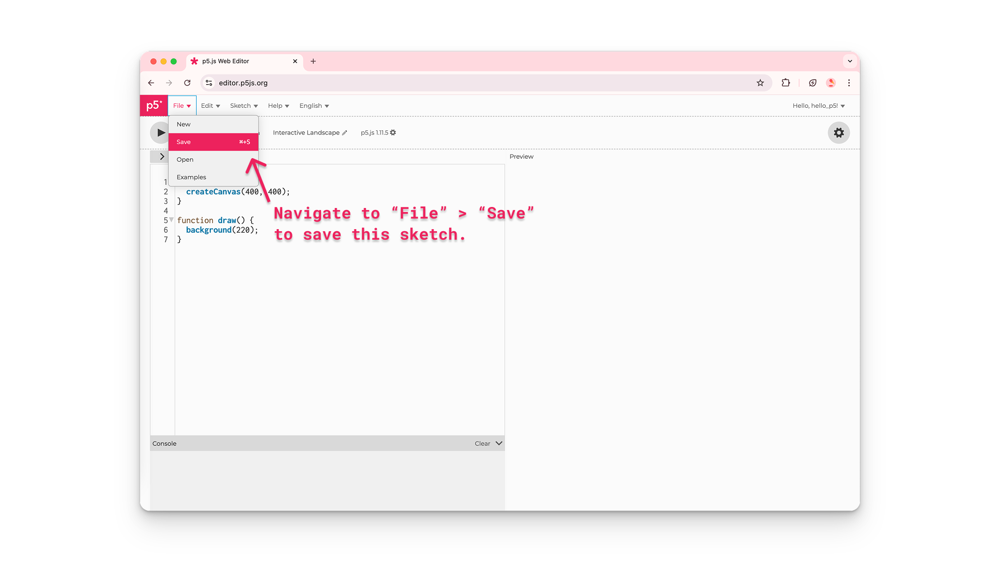

import EditableSketch from "../../../components/EditableSketch/index.astro";
import Callout from "../../../components/Callout/index.astro";

p5.js में आपका स्वागत है! क्या आप p5.js में नए हैं और एक इंटरएक्टिव स्केच बनाने की कुछ बेसिक चीज़ें सीखना चाहते हैं? इस ट्यूटोरियल को फॉलो करें और एक सरल [इंटरएक्टिव दृश्य](https://editor.p5js.org/Msqcoding/sketches/SDbVilWaf) बनाएं। इस ट्यूटोरियल में आप सीखेंगे कि कैसे:

- कैनवास का साइज और पृष्ठभूमि रंग बदलें
- शेप्स और टेक्स्ट जोड़ें, उन्हें कस्टमाइज़ करें और रंग दें
- माउस पॉइंटर की पोज़िशन के अनुसार स्केच को रेस्पॉन्ड करवाकर सरल इंटरएक्टिविटी जोड़ें
- कोड में कमेंट लिखें
- और ज़्यादा सीखने के लिए [p5.js reference](/reference/) पेज़ का उपयोग करें


## आवश्यकताएँ

- [अपने एनवायरनमेंट को सेट करना](../setting-up-your-environment)

शुरू करने से पहले आपको यह करना आना चाहिए:

- [p5.js Web Editor](https://editor.p5js.org/) में लॉग इन करना और एक नया प्रोजेक्ट सेव करना

**या**

- [VS Code](https://code.visualstudio.com/) (या किसी अन्य कोड एडिटर) में एक नया p5.js प्रोजेक्ट बनाना और सेव करना

[p5.js Web Editor](https://editor.p5js.org/) या [VS Code](https://code.visualstudio.com/) में प्रोजेक्ट बनाने और सेव करने की स्टेप-बाय-स्टेप गाइड के लिए, [अपने एनवायरनमेंट को सेट करना](../setting-up-your-environment) देखें।


## चरण 1: नया p5.js प्रोजेक्ट नाम दें और सेव करें

- एक नया p5.js प्रोजेक्ट बनाएं, उसे नाम दें और सेव करें।

[p5.js Web Editor](https://editor.p5js.org/) का उपयोग करते हुए:

- [p5.js Web Editor](https://editor.p5js.org/) में लॉग इन करें।
- *पेंसिल आइकन* पर क्लिक करके और दिखाई देने वाले टेक्स्ट बॉक्स में “Interactive Landscape” टाइप करके अपने प्रोजेक्ट का नाम “Interactive Landscape” रखें।


- *File* पर क्लिक करें और *Save* चुनें।



- यह पुष्टि करने के लिए कि आपका प्रोजेक्ट सेव हो गया है, अपने सेव किए गए स्केचेस की गैलरी पर जाएँ:
  - *File* पर क्लिक करें और *Open* चुनें।
  - आपके हाल ही में बनाए गए स्केचेस आपके अकाउंट में सेव किए गए प्रोजेक्ट्स की लिस्ट में सबसे ऊपर दिखाई देंगे।


### डिफ़ॉल्ट कोड

सभी p5.js प्रोजेक्ट्स में p5.js लाइब्रेरी और तीन फ़ाइलें शामिल होती हैं: [`index.html`](https://www.classes.cs.uchicago.edu/archive/2021/spring/11111-1/happycoding/p5js/web-dev.html#:~:text=The%20index.,the%20page%20using%20HTML%20tags!), [style.css](https://happycoding.io/tutorials/p5js/web-dev), और `sketch.js`। कैनवास में बदलाव करने के लिए `sketch.js` फ़ाइल में कोड जोड़ें। नए p5.js प्रोजेक्ट्स `sketch.js` फ़ाइल में नीचे दिया गया कोड लेकर शुरू होते हैं:

```js
function setup() {
  createCanvas(400, 400);
}
function draw() {
  background(220);
}
```

हर `sketch.js` फ़ाइल दो मुख्य फ़ंक्शन्स से शुरू होती है: [`setup()`](/reference/p5/setup) और [`draw()`](/reference/p5/draw)।

[फ़ंक्शन्स](/reference/p5/function) निर्देशों के ऐसे क्रम होते हैं जो किसी विशेष कार्य को पूरा करते हैं।

जब `sketch.js` में मौजूद कोड एक्सीक्यूट होता है:

- [`setup()`](/reference/p5/setup) कॉल किया जाता है और केवल एक बार चलता है। इसका उपयोग आपके प्रोजेक्ट के लिए डिफ़ॉल्ट वैल्यूज़ सेट करने के लिए किया जा सकता है।
  - [`setup()`](/reference/p5/setup) के कर्ली ब्रैकेट्स (`{}`) के अंदर, `createCanvas(400, 400)` एक HTML कैनवास बनाता है जो 400 पिक्सेल चौड़ा और 400 पिक्सेल ऊँचा होता है, जिसे आप प्रीव्यू विंडो में देख सकते हैं।
- [`draw()`](/reference/p5/draw) को [`setup()`](/reference/p5/setup) के तुरंत बाद कॉल किया जाता है और यह अपने कर्ली ब्रैकेट्स के अंदर मौजूद कोड को प्रति सेकंड 60 बार चलाता है, जब तक प्रोग्राम रोका न जाए या [`noLoop()`](/reference/p5/noLoop) फ़ंक्शन कॉल न किया जाए।
  - [`draw()`](/reference/p5/draw) के कर्ली ब्रैकेट्स के अंदर, जिसे [`draw()`](/reference/p5/draw) कोड ब्लॉक भी कहा जाता है, [`background()`](/reference/p5/background) फ़ंक्शन कैनवास के पृष्ठभूमि का रंग सेट करता है। डिफ़ॉल्ट वैल्यू (220) कैनवास का रंग ग्रे सेट करती है।

[`setup()`](/reference/p5/setup), [`draw()`](/reference/p5/draw), [`createCanvas()`](/reference/p5/createCanvas), और [`background()`](/reference/p5/background) के बारे में और जानने के लिए [p5.js reference](/reference/) पेज़ देखें।

## चरण 2: कैनवास का साइज बदलें

- [`createCanvas()`](/reference/p5/createCanvas) के *arguments* बदलकर कैनवास का साइज 600 पिक्सेल चौड़ा और 400 पिक्सेल ऊँचा करें। प्रीव्यू विंडो में बदलाव देखने के लिए *Play* दबाएँ।
- यह सुनिश्चित करें कि आप *Play* बटन दबाएँ या कैनवास को अपडेट करने के लिए *Auto-refresh* बॉक्स चेक हो।

आपका कोड कुछ ऐसा दिखना चाहिए:

```js
function setup() {
  createCanvas(600, 400);
}
function draw() {
  background(220);
}
```

<Callout title="टिप"> 
[p5.js Web Editor](https://editor.p5js.org/) में *Play* पर क्लिक करें और “Auto-refresh” के पास वाले बॉक्स को चेक करें, ताकि जैसे-जैसे आप अपने प्रोजेक्ट में और कोड जोड़ें, कैनवास अपने आप लगातार अपडेट होता रहे। इस बॉक्स के चेक रहने पर हर बदलाव के बाद आपको बार-बार *Play* बटन दबाने की ज़रूरत नहीं होगी।
</Callout> 

## चरण 3: कोड को समझाने के लिए कमेंट्स का उपयोग करें

- ऐसा एक कमेंट लिखें जो बताए कि `createCanvas(600, 400)` क्या करता है।

आपका कोड कुछ इस तरह दिख सकता है:

```js
function setup() {
  // 600 पिक्सेल चौड़ा
  // और 400 पिक्सेल ऊँचा कैनवास बनाता है।
  createCanvas(600, 400);
}
function draw() {
  background(220);
}
```


### कमेंट्स

अपने स्केच में *comments* का उपयोग करने से आपको कोड की हर लाइन का उद्देश्य याद रखने में मदद मिलती है। क्योंकि JavaScript कमेंट्स को पढ़ नहीं सकता, इसलिए ये आपके कोड को देखने वाले दूसरे लोगों तक अपने विचार पहुँचाने का अच्छा तरीका होते हैं, या फिर खुद को यह याद दिलाने के लिए कि आपका कोड क्या कर रहा है।

- स्केच में कहीं भी दो फॉरवर्ड स्लैश (`//comment`) का उपयोग करके सिंगल लाइन कमेंट जोड़ें।


### स्टेटमेंट्स

`sketch.js` फ़ाइलें *JavaScript* में लिखी जाती हैं, जहाँ कोड की हर लाइन को *statement* कहा जाता है। हर स्टेटमेंट के अंत में एक सेमीकोलन (`;`) होता है। `sketch.js` फ़ाइल में लिखे गए हर स्टेटमेंट के बाद सेमीकोलन लगाना एक अच्छी प्रैक्टिस मानी जाती है। लेकिन फ़ंक्शन्स और `if` स्टेटमेंट्स में कर्ली ब्रैकेट्स के बाद सेमीकोलन **नहीं** लगाना चाहिए।

कमेंट्स और स्टेटमेंट्स के बारे में और जानकारी के लिए, [The Coding Train का यह वीडियो देखें।](https://www.youtube.com/watch?v=xJcrPJuem5Q)


## चरण 4: पृष्ठभूमि का रंग बदलें

- [`background()`](/reference/p5/background) फ़ंक्शन के *arguments* बदलकर कैनवास के पृष्ठभूमि का रंग आसमानी नीला (sky blue) करें, इसके लिए `background(135, 206, 235)` का उपयोग करें।
- इस लाइन के कोड को समझाने के लिए कमेंट्स जोड़ें।
- कैनवास को अपने आप अपडेट करने के लिए *Auto-refresh* बॉक्स चेक रखें।

आपका कोड कुछ इस तरह दिख सकता है:

<EditableSketch code={`
function setup() {
  // 600 पिक्सेल चौड़ा
  // और 400 पिक्सेल ऊँचा कैनवास बनाता है
  createCanvas(600, 400);
}
function draw() {
  // आसमानी नीला पृष्ठभूमि
  background(135, 206, 235);
}
`} />

[`background()`](/reference/p5/background) और p5.js के अन्य कमांड्स, जैसे कि शेप्स, भी फ़ंक्शन्स होते हैं। [`background()`](/reference/p5/background) फ़ंक्शन खास तौर पर कैनवास के पृष्ठभूमि का रंग बदलता है। [`background()`](/reference/p5/background) के p5.js reference पेज के अनुसार, ऊपर दिए गए कोड में दिखाए गए तीन *arguments* लाल (red), हरा (green), और नीला (blue) के वैल्यूज़ को दर्शाते हैं, जो कैनवास पर दिखाई देने वाले नीले रंग से मेल खाते हैं।

लाल, हरा, और नीला के लिए संख्याओं के 10 मिलियन से भी ज़्यादा कॉम्बिनेशन्स होते हैं, जिनसे अलग-अलग रंग बनाए जा सकते हैं। इन्हें [RGB color codes](/reference/p5/color) कहा जाता है। ऊपर दिए गए कोड में, R की वैल्यू 135 है, G की वैल्यू 206 है, और B की वैल्यू 235 है। यह कैनवास पर दिख रहे हल्के नीले रंग से मेल खाता है।

- R, G, और B वैल्यूज़ में बदलाव करने से [`background()`](/reference/p5/background) कैनवास के रंग को कैसे बदलता है, इसे समझने के लिए [यह उदाहरण देखें](https://editor.p5js.org/Msqcoding/full/3j6stYuo2)।

कैनवास के पृष्ठभूमि रंग को बदलने के और तरीकों के बारे में जानने के लिए p5.js reference पेज देखें: [background()](/reference/p5/background) और [color](/reference/p5/color)।


#### टिप

किसी भी रंग का पृष्ठभूमि सेट करने के लिए कोड ढूँढने हेतु [Google’s Color Picker](https://g.co/kgs/aCdbzD) का उपयोग करें। जिस रंग का आप उपयोग करना चाहते हैं उसे चुनें, RGB लेबल वाले बॉक्स में दिए गए नंबर कॉपी करें, और उन्हें [`background()`](/reference/p5/background) में पेस्ट करें।


## चरण 5: कैनवास पर शेप्स बनाएं

- [`circle()`](/reference/p5/circle) फ़ंक्शन का उपयोग करके कैनवास के ऊपर-दाएँ कोने में एक सूरज बनाएं।
- इस लाइन के कोड के अंत में सेमीकोलन (`;`) जोड़ें।
- इस लाइन के कोड को समझाने के लिए एक कमेंट जोड़ें।

<Callout title="नोट">
यह सुनिश्चित करें कि आप शेप्स को [`draw()`](/reference/p5/draw) फ़ंक्शन के कर्ली ब्रैकेट्स (कोड ब्लॉक) के अंदर जोड़ें, और कैनवास को अपने आप अपडेट करने के लिए *Auto-refresh* बॉक्स चेक रखें।
</Callout>

आपका कोड कुछ इस तरह दिखना चाहिए:

<EditableSketch code={`
function setup() {
  // 600 पिक्सेल चौड़ा
  // और 400 पिक्सेल ऊँचा कैनवास बनाता है
  createCanvas(600, 400);
}
function draw() {
  // आसमानी नीला पृष्ठभूमि
  background(135, 206, 235);
  // ऊपर-दाएँ कोने में सूरज
  circle(550, 50, 100);
}
`} />

कुछ शेप फ़ंक्शन्स, जैसे [`circle()`](/reference/p5/circle), ऐसे नंबरों का उपयोग करते हैं जो सर्कल की हॉरिज़ॉन्टल लोकेशन (x-coordinate), वर्टिकल लोकेशन (y-coordinate), और साइज (चौड़ाई और ऊँचाई) को बताते हैं। x और y कोऑर्डिनेट्स सर्कल के सेंटर पॉइंट (`x`, `y`) को दर्शाते हैं (नीचे दिए गए डायग्राम को देखें)।

- ऊपर दिए गए कोड उदाहरण में उपयोग किए गए [`circle()`](/reference/p5/circle) फ़ंक्शन का पहला *argument*, नंबर 550, सेंटर पॉइंट का x-coordinate है। इसका मतलब है कि सेंटर पॉइंट कैनवास के बाएँ किनारे से 550 पिक्सेल दाईं ओर स्थित है।
- दूसरा argument, नंबर 50, सेंटर पॉइंट का y-coordinate है। इसका मतलब है कि सेंटर पॉइंट कैनवास के ऊपर वाले किनारे से 50 पिक्सेल नीचे स्थित है।
- तीसरा argument, नंबर 100, सर्कल का डायमीटर है। इसका मतलब है कि सर्कल 100 पिक्सेल चौड़ा और 100 पिक्सेल ऊँचा है।


[`circle()`](/reference/p5/circle) के बारे में और जानने के लिए p5.js reference पेज देखें।

### p5.js कैनवास कोऑर्डिनेट्स

कैनवास में एक अदृश्य कोऑर्डिनेट सिस्टम होता है, जो ऊपर-बाएँ कोने में हॉरिज़ॉन्टल लोकेशन 0 और वर्टिकल लोकेशन 0 से शुरू होता है।

![एक HTML `canvas` एलिमेंट का डायग्राम जिसमें ग्रिड पैटर्न दिखाया गया है। हॉरिज़ॉन्टल एक्सिस x-coऑर्डिनेट्स को दर्शाती है, वर्टिकल एक्सिस y-coऑर्डिनेट्स को दर्शाती है, और ग्रिड के हर इंटरसेक्शन पर एक विशेष (x,y) कोऑर्डिनेट पेयर दिखता है। x-axis के साथ एक तीर दिखाता है कि कैनवास पर दाईं ओर जाने पर x-coऑर्डिनेट्स बढ़ते हैं। y-axis के साथ एक तीर दिखाता है कि कैनवास पर नीचे जाने पर y-coऑर्डिनेट्स बढ़ते हैं।](../images/introduction/coordinates.png)

जब कैनवास पर कोई ऑब्जेक्ट इस पॉइंट से दाईं ओर जाता है, तो उसकी हॉरिज़ॉन्टल लोकेशन बढ़ती है। जब कोई ऑब्जेक्ट इस पॉइंट से नीचे की ओर जाता है, तो उसकी वर्टिकल लोकेशन बढ़ती है। जब कोई ऑब्जेक्ट कैनवास पर बाईं ओर जाता है, तो उसका x-coordinate घटता है; और जब कोई ऑब्जेक्ट ऊपर की ओर जाता है, तो उसका y-coordinate घटता है। नीचे दिए गए उदाहरण दिखाते हैं कि कैनवास पर सर्कल की पोज़िशन बदलने पर x या y-coऑर्डिनेट्स की वैल्यू कैसे बदलती है:

- [यह उदाहरण](https://editor.p5js.org/Msqcoding/full/AM5ZwrmNo) दिखाता है कि कैनवास पर हॉरिज़ॉन्टली मूव करने पर सर्कल का x-coordinate कैसे बदलता है।
- [यह उदाहरण](https://editor.p5js.org/Msqcoding/full/jZeTUjZfZ) दिखाता है कि कैनवास पर वर्टिकली मूव करने पर सर्कल का y-coordinate कैसे बदलता है।

कैनवास की हॉरिज़ॉन्टल और वर्टिकल पोज़िशन की अधिकतम वैल्यूज़ [`createCanvas()`](/reference/p5/createCanvas) फ़ंक्शन द्वारा सेट की जाती हैं। [`createCanvas()`](/reference/p5/createCanvas) में दिया गया पहला नंबर दाएँ किनारे का x-coordinate होता है, और दूसरा नंबर नीचे वाले किनारे का y-coordinate होता है।

HTML कैनवास के कोऑर्डिनेट सिस्टम और शेप्स के बारे में और जानने के लिए [इस p5.js reference पेज](/reference) को देखें।


## चरण 6: कैनवास पर शेप्स और आउटलाइन को रंग दें

- [`circle()`](/reference/p5/circle) के ऊपर वाली लाइन में `fill("yellow")` जोड़कर सूरज को रंग दें।
- [`circle()`](/reference/p5/circle) के ऊपर वाली लाइन में `stroke("orange")` जोड़कर सूरज की आउटलाइन का रंग सेट करें।
- [`circle()`](/reference/p5/circle) के ऊपर वाली लाइन में `strokeWeight(20)` जोड़कर आउटलाइन की मोटाई बदलें।
- कोड को समझाने के लिए कमेंट्स जोड़ें।

<Callout title="नोट">
यह सुनिश्चित करें कि [`fill()`](/reference/p5/fill), [`stroke()`](/reference/p5/stroke), और [`strokeWeight()`](/reference/p5/strokeWeight) को [`draw()`](/reference/p5/draw) के कोड ब्लॉक के अंदर और किसी भी शेप को ड्रॉ करने से **पहले** जोड़ा जाए।
</Callout>

आपका कोड कुछ इस तरह दिखना चाहिए:

<EditableSketch code={`
function setup() {
  // 600 पिक्सेल चौड़ा
  // और 400 पिक्सेल ऊँचा कैनवास बनाता है
  createCanvas(600, 400);
}
function draw() {
  // आसमानी नीला पृष्ठभूमि
  background(135, 206, 235);
  // ऊपर-दाएँ कोने में सूरज
  fill("yellow"); // पीला रंग

  stroke("orange"); // नारंगी आउटलाइन

  strokeWeight(20); // मोटी आउटलाइन

  circle(550, 50, 100);
}
`} />

[`fill()`](/reference/p5/fill) फ़ंक्शन कैनवास पर किसी भी शेप का रंग सेट करता है, और [`stroke()`](/reference/p5/stroke) फ़ंक्शन लाइनों और आउटलाइनों का रंग सेट करता है। ये दोनों वही *arguments* इस्तेमाल करते हैं जो [`background()`](/reference/p5/background) में उपयोग होते हैं। ऊपर दिए गए कोड में [`fill()`](/reference/p5/fill) और [`stroke()`](/reference/p5/stroke) के लिए एक [HTML color name](https://www.w3schools.com/tags/ref_colornames.asp) को *argument* के रूप में इस्तेमाल किया गया है; हम [RGB और HEX color codes](https://htmlcolorcodes.com/) भी उपयोग कर सकते हैं। [`strokeWeight()`](/reference/p5/strokeWeight) फ़ंक्शन एक नंबर का उपयोग करके लाइनों, आउटलाइनों और पॉइंट्स की मोटाई सेट करता है; डिफ़ॉल्ट [`strokeWeight()`](/reference/p5/strokeWeight) 1 पिक्सेल होती है। ऊपर दिए गए कोड में, [`strokeWeight(20)`](/reference/p5/strokeWeight) सर्कल की आउटलाइन को 20 पिक्सेल मोटा सेट करता है।


<Callout title="टिप">
[p5.js Web Editor](https://editor.p5js.org/) में, आप [`fill()`](/reference/p5/fill), [`stroke()`](/reference/p5/stroke), और [`background()`](/reference/p5/background) के लिए अलग-अलग रंग खोज सकते हैं। इसके लिए रंग के नाम के पास दिखने वाले छोटे रंगीन बॉक्स पर क्लिक करें। *Argument* के रूप में एक [HTML color name](https://www.w3schools.com/tags/ref_colornames.asp) टाइप करें, और वह बॉक्स दिखाई देगा। रंगों के नाम [string](/reference/p5/String) डेटा टाइप होते हैं, इसलिए इन्हें उद्धरण चिह्नों (`""`) में लिखा जाता है।

![fill(“yellow”) का उपयोग करके सर्कल को पीला रंग देने के बाद, p5.js Web Editor में कोड लिख रहा एक यूज़र “yellow” HTML रंग के पास दिखाई देने वाले पीले बॉक्स पर क्लिक करता है। इससे कलर टूल खुलता है, जहाँ से वह लाल रंग चुनता है। इसके बाद कोड एडिटर पर क्लिक करते ही सर्कल का रंग पीले से लाल हो जाता है।](../images/introduction/editor-color-picker.gif)
</Callout>

### Fill का क्रम

[`fill()`](/reference/p5/fill) की डिफ़ॉल्ट वैल्यू सफ़ेद (white) होती है। इसका मतलब है कि अगर [`draw()`](/reference/p5/draw) के अंदर कभी भी [`fill()`](/reference/p5/fill) का उपयोग नहीं किया जाता, तो सभी शेप्स डिफ़ॉल्ट रूप से सफ़ेद रंग की होंगी। कैनवास पर किसी भी शेप का रंग बदलने के लिए, शेप ड्रॉ करने से पहले [`fill()`](/reference/p5/fill) को कॉल करना ज़रूरी है। [`stroke()`](/reference/p5/stroke) की डिफ़ॉल्ट वैल्यू काली (black) होती है। आउटलाइन का रंग और मोटाई बदलने के लिए, शेप ड्रॉ करने से पहले [`stroke()`](/reference/p5/stroke) और [`strokeWeight()`](/reference/p5/strokeWeight) को कॉल करना ज़रूरी है। जब कैनवास पर कई शेप्स ड्रॉ की जाती हैं, तो हर बार जब किसी शेप या उसकी आउटलाइन का रंग बदलता है, तब [`fill()`](/reference/p5/fill), [`stroke()`](/reference/p5/stroke), और [`strokeWeight()`](/reference/p5/strokeWeight) को दोबारा कॉल करें।

- उदाहरण के लिए [इस स्केच](https://editor.p5js.org/Msqcoding/sketches/k0zCPrquf) को देखें।

[`fill()`](/reference/p5/fill), [`stroke()`](/reference/p5/stroke), और [`strokeWeight()`](/reference/p5/strokeWeight) के बारे में और जानने के लिए [color reference](/reference/p5/color) पेज देखें। [`fill()`](/reference/p5/fill), [`stroke()`](/reference/p5/stroke), और [`background()`](/reference/p5/background) में उपयोग करने के लिए रंग कोड खोजने हेतु p5.js Web Editor के कलर टूल या [Google’s Color Picker](https://g.co/kgs/aCdbzD) का उपयोग करें।


## चरण 7: अपने कैनवास पर और शेप्स ड्रॉ करें और उन्हें रंग दें

- कैनवास के निचले आधे हिस्से में घास बनाएं:
  - सूरज के कोड के नीचे `stroke(0)` और `strokeWeight(1)` जोड़कर शेप्स की आउटलाइन की वैल्यूज़ को रीसेट करें।
  - `rect(0, 200, 600, 200)` का उपयोग करके कैनवास पर एक रेक्टैंगल शेप जोड़ें।
  - रेक्टैंगल को हरा रंग देने के लिए `fill("green")` को रेक्टैंगल वाली लाइन के ऊपर जोड़ें।
  - घास बनाने वाली कोड लाइनों को समझाने के लिए कमेंट्स जोड़ें।
- (वैकल्पिक) शेप्स और रंगों का उपयोग करके अपने दृश्य में और डिटेल्स जोड़ें। नीचे दिए गए शेप फ़ंक्शन्स पर क्लिक करके जानें कि उन्हें अपने स्केच में कैसे शामिल करें:
  - [`ellipse()`](/reference/p5/ellipse)
  - [`square()`](/reference/p5/square)
  - [`quad()`](/reference/p5/quad)
  - [`triangle()`](/reference/p5/triangle)
  - [`line()`](/reference/p5/line)
  - [`point()`](/reference/p5/point)
  - [`arc()`](/reference/p5/arc)

<Callout title="नोट">
- यह सुनिश्चित करें कि आप शेप्स और रंगों को [`draw()`](/reference/p5/draw) फ़ंक्शन के कर्ली ब्रैकेट्स के अंदर जोड़ें।
- किसी खास शेप को रंग देने के लिए [`fill()`](/reference/p5/fill) को उस शेप को ड्रॉ करने वाली लाइन **से पहले** कॉल करना ज़रूरी है। अतिरिक्त शेप्स का रंग बदलने के लिए [`fill()`](/reference/p5/fill) को फिर से कॉल करना होगा।
</Callout>

<EditableSketch code={`
function setup() {
  // 600 पिक्सेल चौड़ा
  // और 400 पिक्सेल ऊँचा कैनवास बनाता है
  createCanvas(600, 400);
}
function draw() {
  // आसमानी नीला पृष्ठभूमि
  background(135, 206, 235);
  // ऊपर-दाएँ कोने में सूरज
  fill("yellow"); // पीला रंग

  stroke("orange"); // नारंगी आउटलाइन

  strokeWeight(20); // मोटी आउटलाइन

  circle(550, 50, 100);
  // नीचे के आधे हिस्से में घास

  stroke(0); // काली आउटलाइन

  strokeWeight(1); // आउटलाइन की मोटाई

  fill("green");

  rect(0, 200, 600, 200);
}
`} />

[`rect()`](/reference/p5/rect) ऐसे नंबरों का उपयोग करता है जो रेक्टैंगल की हॉरिज़ॉन्टल लोकेशन (x-coordinate), वर्टिकल लोकेशन (y-coordinate), चौड़ाई (width) और ऊँचाई (height) को दर्शाते हैं। x और y कोऑर्डिनेट्स (x, y) रेक्टैंगल के ऊपर-बाएँ कोने के पॉइंट को दर्शाते हैं (नीचे दिए गए डायग्राम को देखें)।

- ऊपर दिए गए कोड उदाहरण में उपयोग किए गए [`rect()`](/reference/p5/rect) फ़ंक्शन का पहला *argument*, नंबर 0, x-coordinate है। इसका मतलब है कि रेक्टैंगल का ऊपर-बाएँ कोना कैनवास के बाएँ किनारे पर है।
- दूसरा *argument*, नंबर 200, y-coordinate है। इसका मतलब है कि रेक्टैंगल का ऊपर-बाएँ कोना कैनवास के ऊपर वाले किनारे से 200 पिक्सेल नीचे है।
- तीसरा *argument*, नंबर 600, रेक्टैंगल की चौड़ाई है। इसका मतलब है कि रेक्टैंगल 600 पिक्सेल चौड़ा है।
- चौथा *argument*, नंबर 200, रेक्टैंगल की ऊँचाई है। इसका मतलब है कि रेक्टैंगल 200 पिक्सेल ऊँचा है।

![एक रेक्टैंगल का डायग्राम जिसमें हॉरिज़ॉन्टल लंबाई को “width”, वर्टिकल लंबाई को “height”, और ऊपर-बाएँ कोने के पॉइंट को “(x,y)” के रूप में दिखाया गया है। `rect()` फ़ंक्शन का उपयोग करने का सिंटैक्स डायग्राम के ऊपर इस तरह दिखाया गया है: “rect(x, y, width, height);”](../images/introduction/rect-diagram.png)

[`rect()`](/reference/p5/rect), [simple shapes](/reference/#Shape), और [color](/reference/#Color) के बारे में और जानने के लिए p5.js reference पेज देखें।


## चरण 8: इमोजी जोड़ें

- अपने दृश्य में एक फूल का इमोजी और एक लेडीबग इमोजी (या कोई भी अन्य इमोजी जो आपको पसंद हो) जोड़ें:
  - `text("🌸", 100, 250);` का उपयोग करके कैनवास पर एक फूल बनाएं।
  - `text("🐞", 300, 250);` का उपयोग करके कैनवास पर एक लेडीबग बनाएं।
    - चुने गए इमोजी को हमेशा उद्धरण चिह्नों (`""`) के अंदर लिखा जाना चाहिए (उदाहरण के लिए, `"🌸"`)।
    - कीबोर्ड से इमोजी डालने के लिए नीचे दिए गए निर्देश देखें:
      - [Mac पर इमोजी टाइप करें](https://support.apple.com/guide/mac-help/use-emoji-and-symbols-on-mac-mchlp1560/14.0/mac/14.0#mchl9571760f)
      - [Windows पर इमोजी टाइप करें](https://blogs.windows.com/windowsexperience/2018/02/05/windows-10-tip-get-started-emoji-keyboard-shortcut/)
      - [Chromebook पर इमोजी टाइप करें](https://support.google.com/chromebook/answer/6076237?hl=en#zippy=%2Cinsert-emoji-or-other-images)
  - इमोजी ड्रॉ करने से पहले वाली लाइन में `textSize(75)` जोड़कर फूल और लेडीबग का साइज बदलें।
  - फूल और लेडीबग बनाने वाली कोड लाइनों को समझाने के लिए कमेंट्स जोड़ें।
  - कैनवास को अपडेट करने के लिए *Play* बटन दबाएँ या *Auto-refresh* बॉक्स चेक रखें।

<Callout title="नोट">
यह सुनिश्चित करें कि [`textSize()`](/reference/p5/textSize) और [`text()`](/reference/p5/text) को [`draw()`](/reference/p5/draw) के कोड ब्लॉक के अंदर **घास ड्रॉ करने वाले कोड के बाद** जोड़ा जाए। अगर [`text()`](/reference/p5/text) को [`rect()`](/reference/p5/rect) से पहले लिखा गया है और वह उसी जगह पर ड्रॉ हो रहा है जहाँ रेक्टैंगल है, तो टेक्स्ट रेक्टैंगल के पीछे छुप सकता है। ओवरलैप कैसे हो सकता है, इसे समझने के लिए नीचे दिए गए [Drawing Order](#drawing-order) सेक्शन को देखें।
</Callout>

आपका कोड कुछ इस तरह दिखना चाहिए:

<EditableSketch code={`
function setup() {
  // 600 पिक्सेल चौड़ा
  // और 400 पिक्सेल ऊँचा कैनवास बनाता है
  createCanvas(600, 400);
}
function draw() {
  // आसमानी नीला पृष्ठभूमि
  background(135, 206, 235);
  // ऊपर-दाएँ कोने में सूरज
  fill("yellow"); // पीला रंग

  stroke("orange"); // नारंगी आउटलाइन

  strokeWeight(20); // मोटी आउटलाइन

  circle(550, 50, 100);

  // नीचे के आधे हिस्से में घास

  stroke(0); // काली आउटलाइन

  strokeWeight(1); // आउटलाइन की मोटाई

  fill("green");

  rect(0, 200, 600, 200);

  // इमोजी
  textSize(75);
  text("🌸", 100, 250); // फूल
  text("🐞", 300, 250); // लेडीबग
}
`} />

[`text()`](/reference/p5/text) एक *string* का उपयोग करता है, यानी ऐसा कोई भी टेक्स्ट जो उद्धरण चिह्नों (`""`) के अंदर लिखा हो, और ऐसे नंबरों का उपयोग करता है जो टेक्स्ट के x-coordinate और y-coordinate को दर्शाते हैं। x और y कोऑर्डिनेट्स (x, y) टेक्स्ट बॉक्स के नीचे-बाएँ पॉइंट को दर्शाते हैं (नीचे दिए गए डायग्राम को देखें)।

- ऊपर दिए गए कोड उदाहरण में उपयोग किए गए [`text()`](/reference/p5/text) फ़ंक्शन का पहला *argument*, string `"🌸"`, वह टेक्स्ट है जो कैनवास पर दिखाई देगा। p5.js में उपयोग की जाने वाली सभी strings को उद्धरण चिह्नों (`""`) में लिखा जाना चाहिए।
- दूसरा *argument*, नंबर 100, x-coordinate है। इसका मतलब है कि टेक्स्ट बॉक्स का नीचे-बाएँ कोना कैनवास के बाएँ किनारे से 100 पिक्सेल दाईं ओर स्थित है।
- तीसरा *argument*, नंबर 250, y-coordinate है। इसका मतलब है कि टेक्स्ट बॉक्स का नीचे-बाएँ कोना कैनवास के ऊपर वाले किनारे से 250 पिक्सेल नीचे स्थित है।

![एक डायग्राम जिसमें “string” शब्द को डैश्ड लाइनों से बने एक रेक्टैंगल के अंदर दिखाया गया है, और नीचे-बाएँ कोने में “(x,y)” लिखा हुआ एक पॉइंट है। डैश्ड आउटलाइन उस अदृश्य बॉक्स को दर्शाती है जो टेक्स्ट को घेरता है, और “(x,y)” वह कोऑर्डिनेट्स दर्शाता है जो HTML `canvas` पर उसकी लोकेशन बताते हैं।](../images/introduction/text-diagram.png)

[`textSize()`](/reference/p5/textSize) एक नंबर का उपयोग करता है जो पिक्सेल में टेक्स्ट का साइज बताता है, और यह उस किसी भी [`text()`](/reference/p5/text) फ़ंक्शन पर लागू होता है जो इसके बाद लिखा गया हो। अगर आप कैनवास पर दिखाई देने वाले टेक्स्ट का साइज बदलना चाहते हैं, तो [`text()`](/reference/p5/text) फ़ंक्शन को कॉल करने से पहले [`textSize()`](/reference/p5/textSize) का उपयोग करना सुनिश्चित करें।

- टेक्स्ट साइज में अंतर देखने के लिए [यह उदाहरण देखें](https://editor.p5js.org/Msqcoding/sketches/kQa37NCgT)।


### <a id="drawing-order"></a>ड्रॉइंग ऑर्डर

क्योंकि [`draw()`](/reference/p5/draw) अपने कर्ली ब्रैकेट्स के अंदर मौजूद कोड को बार-बार चलाता है, इसलिए कैनवास पर शेप्स लेयर्स की तरह ड्रॉ होती हैं। जो कोड पहले लिखा होता है वह पहले ड्रॉ होता है, और जो कोड [`draw()`](/reference/p5/draw) में नीचे लिखा होता है वह बाद में ड्रॉ होता है। यही कारण है कि कैनवास पर शेप्स या टेक्स्ट जोड़ने से **पहले** हमें [`fill()`](/reference/p5/fill), [`stroke()`](/reference/p5/stroke), और [`textSize()`](/reference/p5/textSize) सेट करने होते हैं। p5.js को शेप्स और टेक्स्ट का रंग या साइज ड्रॉ होने से ***पहले*** पता होना चाहिए। यह तरीका शेप्स को एक-दूसरे के ऊपर ओवरलैप होने की सुविधा भी देता है, और कभी-कभी कुछ शेप्स दूसरों के पीछे छुप भी सकती हैं। यह देखने के लिए कि कहीं आपकी शेप्स दूसरी शेप्स के पीछे तो नहीं हैं, उनकी x और y कोऑर्डिनेट्स ज़रूर चेक करें।

लेयरिंग के उदाहरण देखने के लिए इन स्केचेस को देखें: [overlapping shapes (hidden)](https://editor.p5js.org/Msqcoding/sketches/A4qkDd729) और [overlapping shapes](https://editor.p5js.org/Msqcoding/sketches/s822PY5T8)

और जानकारी के लिए [`text()`](/reference/p5/text), [`textSize()`](/reference/p5/textSize), और [`draw()`](/reference/p5/draw) के reference पेज देखें।


### डेटा टाइप्स

p5.js की कुछ फ़ंक्शन्स को *arguments* के रूप में *string* डेटा टाइप्स की ज़रूरत होती है, जबकि कुछ फ़ंक्शन्स को *number* डेटा टाइप्स की ज़रूरत होती है।

- [Strings](/reference/p5/String): टेक्स्ट द्वारा दर्शाए जाते हैं और हमेशा उद्धरण चिह्नों (`""`) में लिखे जाते हैं
- [Numbers](/reference/p5/number): किसी संख्या द्वारा दर्शाए जाते हैं

उदाहरण के लिए:

- [`circle()`](/reference/p5/circle) 3 [numbers](/reference/p5/number) का उपयोग करता है: एक संख्या जो उसका x-coordinate दर्शाती है, एक संख्या जो उसका y-coordinate दर्शाती है, और एक संख्या जो पिक्सेल में उसका साइज बताती है।
- [`text()`](/reference/p5/text) एक [string](/reference/p5/String) का उपयोग करता है जो कैनवास पर दिखने वाले टेक्स्ट को दर्शाती है, और 2 [numbers](/reference/p5/number) का उपयोग करता है: एक संख्या जो उसका x-coordinate दर्शाती है और एक संख्या जो उसका y-coordinate दर्शाती है।
- [`fill()`](/reference/p5/fill), [`stroke()`](/reference/p5/stroke), और [`background()`](/reference/p5/background) [numbers](/reference/p5/number) और [strings](/reference/p5/String) — दोनों का उपयोग करते हैं:
  - ग्रे-स्केल रंग के लिए 1 नंबर
  - [RGB रंगों](https://www.w3schools.com/html/html_colors_rgb.asp) के लिए कॉमा से अलग किए गए 3 नंबर
  - एक [string](/reference/p5/String), जिसमें [HTML color name](https://www.w3schools.com/tags/ref_colornames.asp) या [HEX color values](https://www.w3schools.com/html/html_colors_hex.asp) दिए जाते हैं


## चरण 9: इसे इंटरएक्टिव बनाएं!

- लेडीबग इमोजी के x- और y-coordinate को `mouseX`, `mouseY` में बदलें।
  - `text("🐞", mouseX, mouseY);`
- कैनवास पर माउस पॉइंटर को इधर-उधर ले जाएँ और देखें कि लेडीबग आपके माउस पॉइंटर की लोकेशन को कैसे फॉलो करता है!
  - यह सुनिश्चित करें कि आप *Play* बटन दबाएँ या *Auto-refresh* बॉक्स चेक हो, ताकि कैनवास अपडेट होता रहे।
- यह समझाने के लिए कमेंट्स जोड़ें कि लेडीबग माउस पॉइंटर के साथ कैसे मूव करता है।

आपका कोड कुछ इस तरह दिखना चाहिए:

<EditableSketch code={`
function setup() {
  // 600 पिक्सेल चौड़ा
  // और 400 पिक्सेल ऊँचा कैनवास बनाता है
  createCanvas(600, 400);
}
function draw() {
  // आसमानी नीला पृष्ठभूमि
  background(135, 206, 235);
  // ऊपर-दाएँ कोने में सूरज
  fill("yellow");
  circle(550, 50, 100);

  // नीचे के आधे हिस्से में घास
  fill("green");
  rect(0, 200, 600, 200);

  // इमोजी
  textSize(75);
  text("🌸", 100, 250); // फूल
  text("🐞", mouseX, mouseY); // लेडीबग
}
`} />

[`mouseX`](/reference/p5/mouseX) और [`mouseY`](/reference/p5/mouseY) p5.js लाइब्रेरी के साथ आने वाले built-in variables हैं — इन्हें system variables कहा जाता है। Variables अपने अंदर वैल्यूज़ स्टोर करते हैं, जिन्हें बाद में स्केच में इस्तेमाल किया जा सकता है। ये तब बहुत उपयोगी होते हैं जब किसी चीज़ की वैल्यू, जैसे x- और y-coordinates, लगातार बदल रही हो। [`mouseX`](/reference/p5/mouseX) और [`mouseY`](/reference/p5/mouseY) खास तौर पर माउस पॉइंटर के x- और y-coordinates को स्टोर करते हैं, जब वह कैनवास पर मूव करता है। आप [`mouseX`](/reference/p5/mouseX) और [`mouseY`](/reference/p5/mouseY) को किसी भी ऐसे argument के रूप में इस्तेमाल कर सकते हैं जहाँ [number](/reference/p5/number) की ज़रूरत हो!

यह देखने के लिए कि आप [`mouseX`](/reference/p5/mouseX) और [`mouseY`](/reference/p5/mouseY) को स्केच में कैसे उपयोग कर सकते हैं, इन उदाहरणों को देखें:

- [माउस के x- और y-coordinates दिखाना (mouseX और mouseY)](https://editor.p5js.org/Msqcoding/sketches/v9PYEX_vY)
- [mouseX और mouseY से रंग बदलना](https://editor.p5js.org/Msqcoding/sketches/VbLtYOfLc)
- [mouseX और mouseY से साइज बदलना](https://editor.p5js.org/Msqcoding/sketches/gJ27u_HEZ)

[`mouseX`](/reference/p5/mouseX) और [`mouseY`](/reference/p5/mouseY) के बारे में और जानने के लिए p5.js reference पेज देखें। साथ ही, कैनवास के कोऑर्डिनेट सिस्टम और शेप्स को दोबारा समझने के लिए p5.js reference में दिए गए कैनवास कोऑर्डिनेट सिस्टम वाले पेज को भी देखें। p5.js में शामिल अन्य system variables को देखने के लिए [p5.js reference](https://p5js.org/reference/) एक्सप्लोर करें:

- [`width`](/reference/p5/width): कैनवास की चौड़ाई
- [`height`](/reference/p5/height): कैनवास की ऊँचाई
- [`pmouseX`](/reference/p5/pmouseX): माउस का पिछला x-coordinate
- [`pmouseY`](/reference/p5/pmouseY): माउस का पिछला y-coordinate


### Errors

फ़ंक्शन के नाम गलत स्पेल करना या कॉमा भूल जाना आसान होता है। Syntax rules कंप्यूटर को कोड को समझने में मदद करती हैं। जब कोई “rule” टूटता है, तो कंसोल में एक error message दिखाई देता है (उदाहरण के लिए, अगर [`circle()`](/reference/p5/circle) को गलत स्पेल किया गया हो)। इन errors को आम तौर पर “bugs” कहा जाता है। कंसोल में एडिटर की ओर से ऐसे मैसेज दिखते हैं जिनमें उन गलतियों की जानकारी होती है जो आपने की हो सकती हैं। जब आपका कोड सही तरह से execute नहीं होता, तो संभव है कि आपके कोड में कोई bug हो! आम errors और उन्हें ठीक करने के तरीकों के उदाहरण देखने के लिए [Field Guide to Debugging](field-guide-to-debugging) देखें।

और जानकारी के लिए, The Coding Train का [यह वीडियो देखें](https://www.youtube.com/watch?v=LuGsp5KeJMM&list=PLRqwX-V7Uu6Zy51Q-x9tMWIv9cueOFTFA&index=6)।


## Next steps

- अगला ट्यूटोरियल: [Variables and Change Tutorial](../variables-and-change)
- अपना अगला स्केच शुरू करें:
  - शेप्स और टेक्स्ट को कैनवास पर रखने में मदद के लिए आप [इस टेम्पलेट](https://editor.p5js.org/Msqcoding/sketches/nHyx0xDG6) को डुप्लिकेट कर सकते हैं!
    - [टेम्पलेट लिंक](https://editor.p5js.org/Msqcoding/sketches/nHyx0xDG6) पर क्लिक करें, *File* पर क्लिक करें, फिर *Duplicate* चुनें।
    - अपने प्रोजेक्ट का नाम बदलें और सेव करें।


## Previous step

- [How-to: Setting Up Your Environment](../setting-up-your-environment)


## Resources

- [वीडियो: The Coding Train 1.2: Tutorial](https://www.youtube.com/watch?v=MXs1cOlidWs&list=PLRqwX-V7Uu6Zy51Q-x9tMWIv9cueOFTFA&index=3)
- [वीडियो: The Coding Train 1.3: Shapes and Drawing](https://www.youtube.com/watch?v=c3TeLi6Ns1E&list=PLRqwX-V7Uu6Zy51Q-x9tMWIv9cueOFTFA&index=4)
- [वीडियो: The Coding Train 1.4: Color](https://www.youtube.com/watch?v=riiJTF5-N7c&list=PLRqwX-V7Uu6Zy51Q-x9tMWIv9cueOFTFA&index=5)
- [वीडियो: The Coding Train 1.5: Errors and Console](https://www.youtube.com/watch?v=LuGsp5KeJMM&list=PLRqwX-V7Uu6Zy51Q-x9tMWIv9cueOFTFA&index=6)
- [वीडियो: The Coding Train 1.6: Code Comments](https://www.youtube.com/watch?v=xJcrPJuem5Q)
- [वीडियो: The Coding Train 2.1: Variables in p5.js (mouseX & mouseY)](https://www.youtube.com/watch?v=7A5tKW9HGoM&list=PLRqwX-V7Uu6Zy51Q-x9tMWIv9cueOFTFA&index=8)
- [p5.js Reference](https://p5js.org/reference/)
- [HTML color name](https://www.w3schools.com/tags/ref_colornames.asp)
- [HEX color values](https://www.w3schools.com/html/html_colors_hex.asp)


## Bibliography

- [Introduction to Computational Media Curriculum](https://cs4all-icm.gitbook.io/js-intro-to-computational-media-2.0), [NYCPS Computer Science Education team](https://sites.google.com/schools.nyc.gov/cs4allnyc/)
- [Creative Web Curriculum](https://blueprint.cs4all.nyc/curriculum/creative-web/), [NYCPS Computer Science Education team](https://sites.google.com/schools.nyc.gov/cs4allnyc/)

