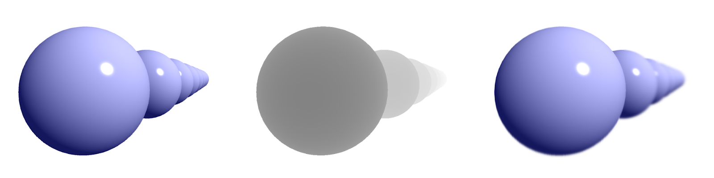

import SketchEmbed from "../../../components/SketchEmbed/index.astro";
import AnnotatedCode from "../../../components/AnnotatedCode/index.astro";
import EditableSketch from "../../../components/EditableSketch/index.astro";
import Callout from "../../../components/Callout/index.astro";
import { Columns, Column } from "../../../components/Columns";
import { Image } from "astro:assets";
import cubeImage from "../images/webgl/cube.png";
import cubeGridImage from "../images/webgl/cube-grid.png";

스케치를 만들다 보면, 화면에 바로 그리기보다는 이미지로 만들어 두고 싶을 때가 있습니다. 그러면 해당 이미지를 3D 도형의 텍스처로 사용할 수도 있고, 복잡한 렌더링 효과나 반복되는 이미지를 효율적으로 만들 수도 있습니다.

2D 모드에서는 이런 용도로 `p5.Graphics`를 쓸 수 있습니다. `p5.Graphics`도 WebGL 모드에서 동작하지만, 더 높은 성능과 다양한 기능이 필요하다면 `p5.Framebuffer`가 더 적합합니다.


## 프레임버퍼가 특별한 이유

프레임버퍼는 컴퓨터의 GPU(Graphics Processing Unit, 그래픽 처리 장치) 위에서 동작합니다. GPU는 이미지를 이루는 픽셀들을 아주 빠르게, 동시에 여러 개씩 처리할 수 있는 컴퓨터 장치입니다. 반면, 우리가 작성하는 자바스크립트 코드는 CPU(Central Processing Unit, 중앙 처리 장치)에서 한 번에 하나씩 실행됩니다. 프레임버퍼는 GPU에서 바로 연산이 이뤄지기 때문에, CPU와 GPU 사이에서 데이터를 많이 옮기지 않고도 빠르게 읽고 쓸 수 있습니다.

프레임버퍼는 일반적인 이미지나 캔버스보다 더 많은 정보를 담을 수 있습니다. 더 높은 정밀도의 부동소수점 숫자를 사용해 색을 저장하면 반올림 오차로 인한 이상한 시각 효과 없이 더 정확한 색을 표현할 수 있습니다. 또 프레임버퍼 안에 그려진 내용의 3D 깊이 정보도 저장할 수 있어서, 심도 흐림(depth of field)이나 그림자 같은 시각 효과를 만드는 데 도움이 됩니다.

<table>

<tr>

<td colspan="3">



</td>

</tr>

<tr>

<th width="300">

프레임버퍼 색상

</th>

<th width="300">

프레임버퍼 깊이

</th>

<th width="300">

색상 + 깊이로 초점 흐림을 적용한 최종 이미지

</th>

</tr>

</table>

{/*Note for contributors: Image generated from https://editor.p5js.org/davepagurek/sketches/OUBu-yXuk*/}

## `p5.Framebuffer` 사용하기

`p5.Framebuffer`는 메인 캔버스와 비슷하게 그림을 그릴 수 있는 표면입니다. 메인 캔버스에 그림을 그리는 것은 종이 한 장에 그림을 그리는 것에 비유할 수 있습니다. `p5.Framebuffer`에 `begin()`을 호출하는 것은 원래 종이 위에 새로운 종이 한 장을 덧대는 것과 비슷하며, 새로 그려지는 것은 모두 그 위에 쌓입니다. `p5.Framebuffer`에서 `end()`를 호출하면 그 종이를 다시 걷어 내는 것과 같아서, 이후에 그리는 내용은 다시 메인 캔버스에 바로 그려집니다.

`p5.Framebuffer`는 `createFramebuffer()` 함수로 만들 수 있습니다. 매개변수로 객체를 넘겨 너비와 높이를 지정할 수도 있습니다. 기본적으로 `p5.Framebuffer`는 메인 캔버스와 같은 크기로 만들어집니다. 색상과 깊이 정보를 저장하는 방식도 여러 옵션으로 조정할 수 있는데, 이에 대해서는 뒤에서 다시 다루겠습니다. 자세한 내용은 [`createFramebuffer()` 문서](/reference/p5/createFramebuffer/)에서 확인해 보세요.

아마 `p5.Graphics` 객체에 그리는 방식은 이미 익숙할 것입니다. 아래는 `p5.Graphics`를 텍스처로 사용할 때와, 같은 효과를 `p5.Framebuffer`로 구현할 때의 코드 비교 예시입니다.

<Columns>
<Column>
#### `p5.Graphics` 사용

```js
let layer;
function setup() {
  createCanvas(200, 200, WEBGL);
  layer = createGraphics(200, 200);
  describe('각 면에 노란 점이 있는, 회전하는 빨간 정육면체');
}
function draw() {
  let t = millis() * 0.001;
  layer.background('red');
  layer.noStroke();
  layer.fill('yellow');
  for (let i = 0; i < 30; i += 1) {
    layer.circle(
      map(noise(i*10, 0, t), 0, 1, 0, width),
      map(noise(i*10, 100, t), 0, 1, 0, height),
      20
    );
  }
 
  background(255);
  lights();
  noStroke();
  texture(layer);
  rotateX(t);
  rotateY(t);
  box(100);
}
```
</Column>
<Column>
#### `p5.Framebuffer` 사용

```js
let layer;
function setup() {
  createCanvas(200, 200, WEBGL);
  layer = createFramebuffer();
  describe('각 면에 노란 점이 있는, 회전하는 빨간 정육면체');
}
function draw() {
  let t = millis() * 0.001;
  layer.begin();
  background('red');
  noStroke();
  fill('yellow');
  for (let i = 0; i < 30; i += 1) {
    circle(
      map(noise(i*10, 0, t), 0, 1, -width/2, width/2),
      map(noise(i*10, 100, t), 0, 1, -height/2, height/2),
      20
    );
  }
  layer.end();
 
  background(255);
  lights();
  noStroke();
  texture(layer);
  rotateX(t);
  rotateY(t);
  box(100);
}
```
</Column>
<Column fixed>
#### 결과

<SketchEmbed width="200" height="200" code={`
  let layer;
  function setup() {
    createCanvas(200, 200, WEBGL);
    layer = createFramebuffer();
    describe('각 면에 노란 점이 있는, 회전하는 빨간 정육면체');
  }
  function draw() {
    let t = millis() * 0.001;
    layer.begin();
    background('red');
    noStroke();
    fill('yellow');
    for (let i = 0; i < 30; i += 1) {
      circle(
        map(noise(i*10, 0, t), 0, 1, -width/2, width/2),
        map(noise(i*10, 100, t), 0, 1, -height/2, height/2),
        20
      );
    }
    layer.end();
  
    background(255);
    lights();
    noStroke();
    texture(layer);
    rotateX(t);
    rotateY(t);
    box(100);
  }
`} />
</Column>
</Columns>

기본적으로 `p5.Framebuffer`는 화면에 바로 그려지지 않습니다. `draw()`가 끝났을 때 실제로 보이는 것은 메인 캔버스뿐입니다. `p5.Framebuffer`의 내용을 보이게 하려면, 마치 스탬프로 찍듯이 메인 캔버스 위에 찍어 주어야 합니다. 대개 `image(yourFramebuffer, x, y, width, height)`를 이용해 프레임버퍼의 이미지를 화면에 표시합니다. 메인 캔버스와 마찬가지로 `p5.Framebuffer`도 직접 지우라고 할 때만 지워지므로, 아래 예제처럼 메인 캔버스 위에 원하는 만큼 여러 번 찍을 수 있습니다.

<AnnotatedCode lang="javascript" columns={true} code={({ begin, end }) =>`
  ${begin('header')}

  ${end('header')}
  ${begin('setup')}
  let layer;
  function setup() {
    createCanvas(windowWidth, windowHeight, WEBGL);
    layer = createFramebuffer();
  }
  function draw() {
  ${end('setup')}
  ${begin('begin')}
    // 프레임버퍼에 그리기 시작합니다
    layer.begin();
  ${end('begin')}
  ${begin('draw')}
    clear();
  
    lights();
    noStroke();
    rotateX(millis() * 0.001);
    rotateY(millis() * 0.001);
    box(min(width/2, height/2));
  ${end('draw')}
  ${begin('stop')}
    // 프레임버퍼에 그리기를 멈춥니다
    layer.end();
  ${end('stop')}
  ${begin('grid')}
    // 레이어를 메인 캔버스에 그립니다
    clear();
    translate(-width/2, -height/2);
    for (let x = 0; x < 4; x += 1) {
      for (let y = 0; y < 4; y += 1) {
        image(
          layer,
          x*width/4, y*height/4,
          width/4, height/4
        );
      }
    }
  }
  ${end('grid')}
`}>
  <Fragment slot="header">
    <th>
    </th>
    <th>
      메인 캔버스
    </th>
    <th>
      `layer`
    </th>
  </Fragment>
  <Fragment slot="setup">
    <td>
      처음에는 무엇을 그리든 모두 메인 캔버스로 갑니다. 오른쪽에는 현재 그리고 있는 표면을 빨간 테두리로 표시했습니다.
    </td>
    <td>
      <table style="border:2px solid red; border-collapse:separate; margin:5px" width="100" height="100"></table>
    </td>
    <td>
      <table style="border:2px solid gray; border-collapse:separate; margin:5px" width="100" height="100"></table>
    </td>
  </Fragment>
  <Fragment slot="begin">
    <td>
      `p5.Framebuffer`에서 `begin()`을 호출하면, 그 이후에 그려지는 모든 것은 메인 캔버스 대신 해당 레이어로 갑니다.
    </td>
    <td>
      <table style="border:2px solid gray; border-collapse:separate; margin:5px" width="100" height="100"></table>
    </td>
    <td>
      <table style="border:2px solid red; border-collapse:separate; margin:5px" width="100" height="100"></table>
    </td>
  </Fragment>
  <Fragment slot="draw">
    <td>
      여기서는 `p5.Framebuffer`의 내용을 지우고 큐브를 그립니다. 이 단계가 끝나면 메인 캔버스는 여전히 비어 있지만, `p5.Framebuffer` 안에는 큐브가 그려져 있습니다.
    </td>
    <td>
      <table style="border:2px solid gray; border-collapse:separate; margin:5px" width="100" height="100"></table>
    </td>
    <td>
      <table style="border:2px solid red; border-collapse:separate; margin:5px" width="100" height="100">
        <td>
          <Image alt="캔버스를 가득 채운 큐브" src={cubeImage} width="100%" />
        </td>
      </table>
    </td>
  </Fragment>
  <Fragment slot="stop">
    <td>
      `p5.Framebuffer`에서 `end()`를 호출하면, 그 이후에 그려지는 모든 것은 다시 메인 캔버스로 갑니다.
    </td>
    <td>
      <table style="border:2px solid red; border-collapse:separate; margin:5px" width="100" height="100"></table>
    </td>
    <td>
      <table style="border:2px solid gray; border-collapse:separate; margin:5px" width="100" height="100">
        <td>
          <Image alt="캔버스를 가득 채운 큐브" src={cubeImage} width="100%" />
        </td>
      </table>
    </td>
  </Fragment>
  <Fragment slot="grid">
    <td>
      여기서는 메인 캔버스에 4x4 격자를 그리고, 각 칸마다 `layer` `p5.Framebuffer`의 복사본을 하나씩 그립니다.
    </td>
    <td>
      <table style="border:2px solid red; border-collapse:separate; margin:5px" width="100" height="100">
        <td>
          <Image alt="캔버스를 가득 채우는 4x4 격자로 반복된 큐브 이미지" src={cubeGridImage} width="100%" />
        </td>
      </table>
    </td>
    <td>
      <table style="border:2px solid gray; border-collapse:separate; margin:5px" width="100" height="100">
        <td>
          <Image alt="캔버스를 가득 채운 큐브" src={cubeImage} width="100%" />
        </td>
      </table>
    </td>
  </Fragment>
</AnnotatedCode>

<Callout>
곤충의 눈으로 본 것 같은 장면을 만들어 볼까요? `p5.Framebuffer`를 벌집 모양으로 반복해 그려 보세요.
</Callout>

## 피드백을 활용하여 스케치하기

[비디오 피드백](https://en.wikipedia.org/wiki/Video_feedback)은 비디오의  다음 프레임을 그릴 때 이전 프레임을 다시 사용하는 기법입니다. 이 방법을 사용하면 대상의 궤적이 끝없이 이어지는 것처럼 보이는 시각 효과를 만들 수 있습니다. 두 거울 사이에 섰을 때 보이는 장면과 비슷한 느낌입니다.

스케치에서 피드백을 사용하려면 보통 `p5.Framebuffer` 레이어에 먼저 그려 현재 프레임의 이미지를 만들어 둡니다. 그리고 다음 프레임을 그릴 때 이전 프레임의 이미지를 겹쳐 넣습니다.

가장 빠른 방법은 **두 개의 레이어**를 만들어 반복 사용하는 것입니다. 각각 이전 프레임, 다음 프레임을 보관합니다. `draw()`가 시작되면 이 두 레이어를 서로 바꿉니다. 원래 다음 프레임이던 것이 이제는 이전 프레임이 됩니다. 이렇게 교체된 다음 프레임 레이어에는 더 이상 필요 없는 두 프레임 전의 이미지가 들어 있습니다. 이 내용을 지우고 새로운 이미지를 그립니다. 컴퓨터 그래픽스에서는 이 기법을 "핑퐁(ping-ponging)"이라고 부릅니다.

<EditableSketch code={`
  let prev, next;
  function setup() {
    createCanvas(200, 200, WEBGL)
    prev = createFramebuffer({ format: FLOAT });
    next = createFramebuffer({ format: FLOAT });
    imageMode(CENTER);

    describe('회전하는 다채로운 구가 뒤로 점점 사라지는 궤적을 남긴다');
  }
  function draw() {
    // prev와 next를 서로 바꿉니다
    [prev, next] = [next, prev];
    // next를 비우고 새 다음 프레임을 그립니다
    next.begin();
    clear();
    // 지난 프레임을 살짝 회전하고 축소해서 그립니다
    push();
    rotate(0.01);
    scale(0.99);
    image(prev, 0, 0);
    pop();
    // 그 위에 구를 하나 추가합니다
    translate(sin(frameCount*0.1)*50, sin(frameCount*0.11)*50);
    noStroke();
    normalMaterial();
    sphere(25);
    next.end();
    background(255);
    image(next, 0, 0);
  }
`} />

<Callout>
피드백 기법은 음악 플레이어의 오디오 시각화에 자주 사용됩니다. [음악에 반응하는](https://p5js.org/ko/reference/p5.sound/p5.Amplitude) 스케치에 피드백을 적용해 보세요!
</Callout>

고급 피드백 효과를 만들 때 도움이 되는 팁 몇 가지를 소개합니다.

### 피드백으로 흐림 효과(fading) 만들기: `FLOAT` 정밀도 사용하기

`p5.Framebuffer`는 `createFramebuffer({ format: FLOAT })`로 더 높은 정밀도의 부동소수점 숫자 형식으로 이미지를 저장할 수 있기 때문에, 피드백 효과에 특히 잘 어울립니다. 보통 빨강, 초록, 파랑 색상 값은 0\~255 사이의 정수로 저장됩니다. 이미지를 한 번 그릴 때마다 색상 값은 해당 범위 안에서 반올림됩니다. 피드백 스케치에서는 하나의 프레임이 여러 번 반복해 그려지는데, 이 과정에서 반올림 오차가 크게 누적될 수 있습니다. 그 결과 색이 완전히 흐려지지 않는 문제가 생기기도 합니다. float 정밀도를 사용하면 해당 문제를 해결할 수 있습니다!


### 3D에서 피드백 사용하기: 깊이를 기억하기

위 예제에서는 `image(prev, 0, 0)`으로 이전 프레임을 다음 프레임에 그렸습니다. 이 코드는 화면에 사각형 하나를 그리는 셈인데, 이 사각형도 3D 공간을 차지합니다. 그래서 카메라에서 더 멀리 떨어진 곳에 무언가를 그리려 하면, 앞서 `image()`로 그린 사각형으로 가려져 안 보이게 됩니다.


<AnnotatedCode code={({ begin, end }) =>`
  ${begin('transform')}
  push();
  translate(0, 0, -500);
  // 카메라가 z1만큼 떨어져 있고
  // 객체를 z2만큼 뒤로 옮겼다면,
  // 원래와 같은 크기로 보이게 하려면
  // (z2 + z1) / z1 만큼 크기를 키워야 합니다
  scale((500 + 800) / 800);
  image(prev, 0, 0);
  pop();


  ${end('transform')}
  ${begin('clear')}
  image(prev, 0, 0);
  clearDepth();
  ${end('clear')}
`}>
  <Fragment slot="transform">
    나중에 그리는 다른 모든 것이 이 사각형보다 앞에 오게 하려면, 사각형을 더 뒤쪽에 그린 다음 눈에 보이는 크기는 같도록 키워 주는 방법이 있습니다.
  </Fragment>
  <Fragment slot="clear">
    또 다른 방법은 `clearDepth()`를 호출해, 어떤 깊이에 무엇이 그려졌는지에 대한 기록을 지워 주는 것입니다.
  </Fragment>
</AnnotatedCode>

## 깊이를 활용하여 스케치하기

`p5.Framebuffer`에 그림을 그릴 때는 3D 공간에서의 도형 깊이도 함께 기록할 수 있습니다. 해당 값은 0\~1 사이의 숫자로 저장되며, `p5.Framebuffer`의 `depth` 속성으로 셰이더에 읽어들일 수 있습니다. 깊이 정보로 객체가 얼마나 멀리 있는지 간단히 파악할 수 있어서 디버깅에도 유용합니다. 아래 예제의 캔버스에 마우스를 누르고 있으면 깊이 값을 시각적으로 확인할 수 있습니다.

<EditableSketch code={`
  let layer;
  function setup() {
    createCanvas(200, 200, WEBGL);
    layer = createFramebuffer();

    describe('멀리까지 이어진 구들이 일렬로 놓여 있다');
  }
  function draw() {
    noStroke();
  
    // 장면을 프레임버퍼에 그립니다
    layer.begin();
    background(255)
    ambientLight(100);
    directionalLight(255, 255, 255, -1, 1, -1);
    ambientMaterial(52, 58, 235);
    fill(255)
    specularMaterial(255);
    shininess(150);
    // 뒤로 점점 멀어지는 구들을 그립니다
    let n = 8;
    for (let i = 0; i < n; i += 1) {
      push();
      translate(
        map(i, 0, n-1, -100, 750),
        20,
        i * -800
      );
      sphere(100, 60, 30);
      pop();
    }
    layer.end();


    // 색상 또는 깊이 중 하나를 보여줍니다
    push();
    if (mouseIsPressed) {
      texture(layer.depth);
    } else {
      texture(layer.color);
    }
    plane(width, height);
    pop();
  }
`} />

깊이 정보는 카메라에서의 거리에 따라 이미지를 다르게 표현하고 싶을 때 유용합니다. 대표적인 예로, 멀리 있는 객체일수록 안개 색이 더 많이 섞여 보이는 안개 효과가 있습니다.

프레임버퍼의 `color`와 `depth` 속성을 둘 다 셰이더로 넘기면, 원래 색은 `texture2D(color, vTexCoord)`를 통해 `vec4`로 읽을 수 있습니다. 같은 좌표에서 해당 픽셀의 깊이는 `texture2D(depth, vTexCoord).r`로 빨간 채널만 읽어 단일 `float` 값으로 사용합니다.

<EditableSketch code={`
  let vert = \`
  precision highp float;

  attribute vec3 aPosition;
  attribute vec2 aTexCoord;

  uniform mat4 uModelViewMatrix;
  uniform mat4 uProjectionMatrix;

  varying vec2 vTexCoord;

  void main() {
      // 카메라 변환을 적용합니다
      vec4 viewModelPosition = uModelViewMatrix * vec4(aPosition, 1.0);

      // 이 버텍스가 어디에 그려질지 WebGL에 알려 줍니다
      gl_Position = uProjectionMatrix * viewModelPosition;  

      // 데이터를 프래그먼트 셰이더로 전달합니다
      vTexCoord = aTexCoord;
  }
  \`;

  let frag = \`
  precision highp float;

  varying vec2 vTexCoord;

  uniform sampler2D img;
  uniform sampler2D depth;
  uniform vec3 fog;

  void main() {
    gl_FragColor = mix(
      // 원래 색상
      texture2D(img, vTexCoord),
      // 안개 색상
      vec4(178.0/255.0, 189.0/255.0, 207.0/255.0, 1.0),
      // 깊이에 따라 두 색을 섞습니다.
      // pow()를 사용해 밝기가 더 가파르게 줄어들도록 합니다.
      pow(texture2D(depth, vTexCoord).r, 6.0)
    );
  }
  \`;
  let layer, fogShader;
  function setup() {
    createCanvas(200, 200, WEBGL);
    fogShader = createShader(vert, frag);
    layer = createFramebuffer();
    noStroke();

    describe('안개 속을 돌고 있는 빨간 구들');
  }
  function draw() {
    // 장면을 프레임버퍼에 그립니다
    layer.begin();
    clear();
    lights();
    fill('red');
    for (let i = 0; i < 12; i++) {
      push()
      translate(
        sin(frameCount*0.050 + i*1)*50,
        sin(frameCount*0.051 + i*2)*50,
        sin(frameCount*0.049 + i*3)*300
      );
      sphere(10);
      pop();
    }
    layer.end();

    push();
    // 장면에 안개를 적용합니다
    shader(fogShader);
    fogShader.setUniform('img', layer.color);
    fogShader.setUniform('depth', layer.depth);
    plane(width, height);
    pop();
  }
`} />

카메라에 얼마나 가까운 객체가 깊이값 0을 갖고, 얼마나 먼 객체가 깊이값 1을 갖게 할지 직접 정하고 싶다면 [`perspective()`](https://p5js.org/ko/reference/p5/perspective/)에서 near 값과 far 값을 지정하세요.

*깊이를 기반으로 한 블러(blur) 셰이더는 더 고급 주제이므로 이 튜토리얼에서는 다루지 않습니다.*

<Callout>
안개 셰이더를 활용해 분위기 있는 비 오는 장면을 만들어 볼 수 있을까요?
</Callout>

## 마무리

WebGL 모드에서 스케치할 때 이미지에 먼저 그리고 싶다면 [`createFramebuffer()`](/ko/reference/p5/createFramebuffer)를 사용해 보세요. 스케치를 더 빠르게 실행할 수 있고, 보는 사람 모두에게 더 좋은 경험을 줄 수 있을 거예요.

프레임버퍼가 열어 주는 새로운 기법들이 여러분께 영감을 주고, 이를 활용해 멋진 작품을 만들어 가시길 바랍니다!


## 용어집

#### GPU (Graphics Processing Unit, 그래픽 처리 장치)

GPU는 많은 계산을 병렬로 수행하는 데 특히 적합한 컴퓨터 장치로, 3D 그래픽 작업에서 강력한 성능을 발휘합니다.


#### 프레임버퍼 (Framebuffer)

`p5.Graphics`와 비슷하게 그림을 그릴 수 있는 표면이지만, WebGL 하드웨어 가속을 활용하기 위해 GPU 위에 존재합니다.


#### 깊이 (Depth)

도형이 카메라에서 얼마나 멀리 떨어져 있는지를 나타내는 값입니다. 프레임버퍼는 이 값을 이미지의 모든 픽셀에 대해 저장합니다.


#### 핑퐁 (Ping-Ponging)

이전 프레임을 참고해 다음 프레임을 그리는 컴퓨터 그래픽스의 프로그래밍 패턴입니다. 이전 프레임을 가리키는 프레임버퍼를 매 프레임마다 바꿔가며, 남은 프레임버퍼에 다음 프레임을 그리는 방식입니다.
