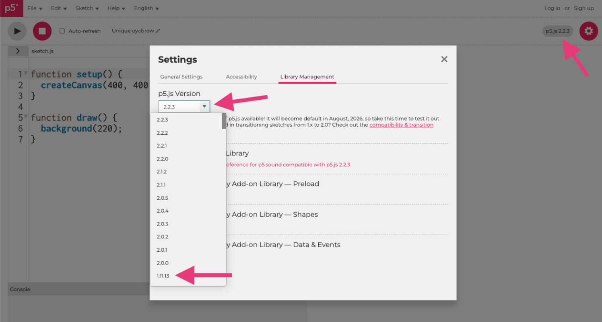
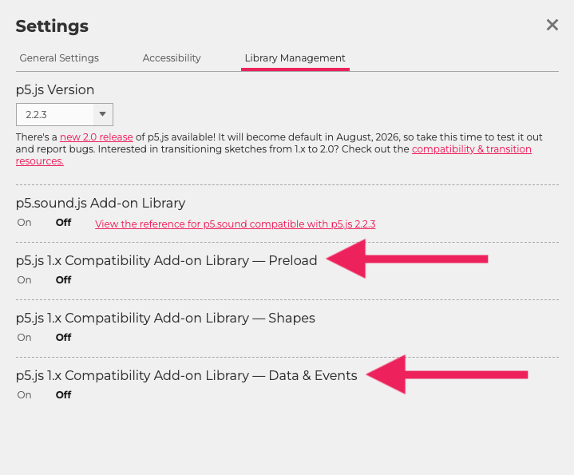

import Callout from "../../../components/Callout/index.astro";

## 중학교 및 고등학교 교사를 위한 p5.js v2 전환 가이드

중학교 교사로서, 늘 사용해 오던 도구의 버전의 업데이트가 큰 변화로 느껴질 수 있다는 점을 잘 알고 있습니다. 이미 익숙하게 사용해 온 수업 자료와 활동이 있다면 더욱 그렇습니다.

p5.js v2로 전환하는 일이 걱정된다면, 이 가이드를 참고해 보세요. 학생들이 기존에 하던 작업의 대부분은 p5.js v2에서도 이전과 동일하게 작동합니다.

여러 중·고등학교용 p5.js 커리큘럼([CS4All Creative Web](https://blueprint.cs4all.nyc/curriculum/creative-web/), [CS4All Introduction to Computational Media](https://blueprint.cs4all.nyc/curriculum/intro-to-computational-media/), [CodeHS Digital Art with p5.js](https://codehs.com/course/p5-js/overview), [CSinSF Creative Computing](https://sites.google.com/sfusd.edu/csinsfcreativecomputing/home?authuser=0), [Processing Foundation Art + Code](https://processing.github.io/art-plus-code/codeAsCreativeMedium-intro/))을 검토한 결과, p5.js v1에서 v2로 전환할 때 일관되게 수정이 필요한 부분은 다음 두 가지뿐이었습니다.

* 입력 이벤트
* 에셋 불러오기

이 밖에도 곡선 도형, 텍스트 측정, 유틸리티 함수 변경 등 여러 [v2 업데이트](https://github.com/processing/p5.js-compatibility) 사항들이 있지만, 이러한 내용은 일반적으로 중·고등학교 커리큘럼에서 다루지 않으므로 실제 수업에 미치는 영향은 크지 않습니다.

이 가이드에서는 중·고등학교 수업에서 실제로 자주 접하게 되는 변경 사항만 다룹니다. p5.js v2에 맞게 코드를 수정하는 방법과 기존 스케치에 호환성 애드온이 필요한 경우도 함께 살펴봅니다.

꼭 필요한 내용만 선별해 담았으니, 이 가이드를 통해 p5.js v2를 빠르게 익히고 수업에 자신 있게 활용해 보세요.

## 웹 에디터에서 버전 선택하기

대부분의 경우 교사와 학생은 별도의 수정 없이 p5.js v2를 사용할 수 있습니다.

다만 기존 스케치를 열었을 때 이전과 다르게 작동할 수 있습니다. 이전 학년도 학생 작품이나 p5.js v1을 기준으로 제작된 커리큘럼 예제가 이런 경우에 해당합니다. 이럴 때는 다음과 같은 방법을 사용할 수 있습니다.

* 이 가이드의 예시를 참고해 **스케치를 업데이트**할 수 있습니다.
* **호환성 애드온을 사용**할 수 있습니다.
* 에디터에서 해당 스케치를 **p5.js v1으로 다시 전환**할 수 있습니다.



## 입력 이벤트

입력 이벤트는 p5.js v2에서 달라진 점을 가장 먼저 체감하기 쉬운 부분입니다. 학생들은 입력 이벤트를 다음과 같은 방식으로 활용할 수 있습니다.

* 버튼을 누르거나 상태를 바꾸기
* 마우스를 누른 상태에서 그림 그리기
* 키를 눌렀을 때 변수 바꾸기
* 캔버스를 지우거나 저장하기
* 방향키로 게임 캐릭터 움직이기

아래 내용에서는 중·고등학교 수업에서 자주 쓰는 입력 이벤트 코드와 p5.js v2에서 변경된 사항을 살펴봅니다.

### 마우스 클릭

p5.js v1에서는 특정 마우스 버튼을 확인할 때 보통 다음과 같이 작성했습니다.

```js
if (mouseButton === RIGHT) {
  // 원하는 동작 실행 (p5.js v1)
}
```

p5.js v2에서는 다음과 같이 작성합니다.

```js
if (mouseButton.right) {
  // 원하는 동작 실행 (p5.js v2)
}
```

**참고:** [mouseButton](/ko/reference/p5/mouseButton/)

<Callout title="교사용 메모">
p5.js v2에서 `mouseButton`은 `left`, `right`, `center` 와 같은 불리언 속성을 가진 객체로 변경되었습니다. 따라서 여러 마우스 버튼이 동시에 눌렸는지 확인할 수 있습니다. 마우스 버튼마다 서로 다른 기능을 지정할 수 있어, 드로잉 앱이나 페인트 도구를 만들 때 특히 유용합니다.
</Callout>

### 키보드 입력

p5.js v1을 기반으로 한 대부분의 중·고등학교 커리큘럼에서는 다음과 같은 코드로 키 입력을 확인했습니다.

```js
if (keyIsPressed) {
  if (key === UP_ARROW){
    // 원하는 동작 실행 (p5.js v1)
  }
}
```

`keyIsPressed`는 간단한 불리언 변수로 수업 초반에 자주 소개되며, `key ===` 구문도 학생들이 이미 사용하고 있는 비교식에 자연스럽게 적용됩니다.

p5.js v2에서는 키 입력을 확인할 때 다음과 같은 방식이 권장됩니다.

```js
if (keyIsDown(UP_ARROW)) {
  // 원하는 동작 실행 (p5.js v2)
}
```

`keyIsDown()`은 v1과 v2 에서 모두 일관되게 작동하고 여러 키를 동시에 확인할 수 있어, 현재 권장되는 방법입니다.

**참고:** [keyIsDown](/ko/reference/p5/keyIsDown/)

### 입력 이벤트 빠른 참고표

<table>

<tr>

<th>

p5.js v1

</th>

<th>

p5.js v2

</th>

<th>

참고

</th>

</tr>

<tr>

<td>

`mouseButton === RIGHT`

</td>

<td>

`mouseButton.right`

</td>

<td>

[mouseButton](/ko/reference/p5/mouseButton/)

</td>

</tr>

<tr>

<td>

`keyIsPressed` <br /> `key === UP_ARROW`

</td>

<td>

`keyIsDown(UP_ARROW)`

</td>

<td>

[keyIsDown](/ko/reference/p5/keyIsDown/)

</td>

</tr>

</table>

### 호환성 애드온(선택 사항)

새로운 수업에서는 위에 제시된 v2 코드를 사용하는 것이 좋습니다.

기존 스케치의 코드를 수정하지 않고 계속 사용하고 싶다면, **Data & Events** 호환성 애드온을 사용해 v1의 작동 방식을 복원할 수 있습니다.

자세한 내용은 아래의 **호환성 애드온** 부분을 참고하세요.

## 에셋 불러오기

학생들이 커리큘럼의 다음 단계로 나아가면서 이미지, 소리, 글꼴 같은 에셋을 추가해 스케치를 자신만의 스타일로 꾸미고 싶어 할 수 있습니다.

p5.js v1에서는 `preload()`를 사용해 에셋을 불러왔습니다.
p5.js v2에서는 `setup()` 안에서 `async`와 `await`를 사용합니다.

### p5.js v1의 `preload()`

p5.js v1에서 `preload()`는 내부의 항목이 모두 불러와질 때까지 스케치 실행을 멈추는 역할을 했습니다.

```js
let img;

function preload(){
  // v1에서는 preload()를 사용했지만 v2에서는 사용하지 않습니다.
  img = loadImage("cat.jpg");
}

function setup(){
  createCanvas(100, 100);
  image(img, 0, 0);
}
```

### p5.js v2의 `async`와 `await`

p5.js v2에서는 더 이상 `preload()`를 사용하지 않습니다. 대신 `async setup()` 안에서 `await`을 사용해 에셋을 불러옵니다. 이 방식은 이미지, 소리, 글꼴, 그 밖의 파일에도 동일하게 적용됩니다.

```js
let img;

async function setup() {
  createCanvas(100, 100);
  
  // 파일이 모두 불러와질 때까지 기다립니다.
  img = await loadImage("cat.jpg");
  
  image (img, 0, 0);
}
```

### 에셋 불러오기 빠른 참고표

<table>

<tr>

<th>

p5.js v1

</th>

<th>

p5.js v2

</th>

</tr>

<tr>

<td>

```js
function preload(){   
  img = loadImage(
    "cat.jpg"
  );
}
```

</td>

<td>

```js
async function setup() {
  createCanvas(100, 100);
  img = await loadImage(
    "cat.jpg"
  ); 
}
```

</td>

</tr>
</table>

**참고:** [async_await](/ko/reference/p5/async_await/)

### 호환성 애드온(선택 사항)

새로운 수업에서는 위에 제시된 v2 코드를 사용하는 것이 좋습니다.

기존 스케치의 코드를 수정하지 않고 계속 사용하고 싶다면, **Preload** 호환성 애드온을 사용해 v1의 작동 방식을 복원할 수 있습니다.

자세한 내용은 아래의 **호환성 애드온** 절을 참고하세요.

## 호환성 애드온

호환성 애드온은 p5.js 웹 에디터에서 필요에 따라 활성화할 수 있는 보조 파일입니다. 코드를 수정하지 않고도 기존 p5.js v1 스케치가 p5.js v2에서 이전과 동일하게 작동하도록 해 줍니다.

교사나 학생이 온라인에서 찾은 기존 스케치 또는 p5.js v1 방식으로 작성된 이전 커리큘럼 자료를 그대로 써야 한다면, 이 애드온이 필요할 수 있습니다.

새로운 수업에서는 학생들이 앞으로도 계속 지원될 버전을 익힐 수 있도록 v2 방식으로 코드를 작성하는 것이 좋습니다.

* 입력 이벤트에는 **Data & Events** 호환성 애드온을 사용하세요.
* 에셋 불러오기에는 **Preload** 호환성 애드온을 사용하세요.



**Shapes** 호환성 애드온도 제공되지만, Shapes API의 변경 사항은 중·고등학교 커리큘럼에서 흔히 다루지 않는 고급 사용자 정의 도형에만 영향을 줍니다. 따라서 대부분의 중·고등학교 교사에게는 이 애드온이 필요하지 않습니다.

## 교사용 빠른 참고표

<table>

<tr>

<th>

p5.js v1

</th>

<th>

p5.js v2

</th>

<th>

참고

</th>

<tr>
<th colspan="3">
입력 이벤트
</th>
</tr>

</tr>

<tr>

<td>

`mouseButton === RIGHT`

</td>

<td>

`mouseButton.right`

</td>

<td>

[mouseButton](/ko/reference/p5/mouseButton/)

</td>

</tr>

<tr>

<td>

`keyIsPressed` <br />
`key === UP_ARROW`

</td>

<td>

`keyIsDown(UP_ARROW)`

</td>

<td>

[keyIsDown](/ko/reference/p5/keyIsDown/)

</td>

</tr>

<tr>
<th colspan="3">
에셋 불러오기
</th>
</tr>

<tr>

</tr>

<tr>

<td>

```js
function preload(){   
  img = loadImage("cat.jpg");
}
```

</td>

<td>

```js
async function setup() {
  createCanvas(100, 100);
  img = await loadImage("cat.jpg"); 
}
```

</td>

<td>

[async_await](/ko/reference/p5/async_await/)

</td>

</tr>
</table>

<Callout title="교사용 메모">
이 빠른 참고표에서는 중·고등학교 커리큘럼에 주로 영향을 미치는 p5.js v2의 변경 사항인 입력 이벤트와 에셋 불러오기만 다룹니다. 곡선 도형, 텍스트 측정, 유틸리티 함수와 관련된 그 밖의 v2 업데이트는 검토한 커리큘럼에서 사용되지 않았습니다. v2의 전체 변경 사항은 [기술 전환 가이드](https://github.com/processing/p5.js-compatibility)에서 확인할 수 있습니다.
</Callout>
