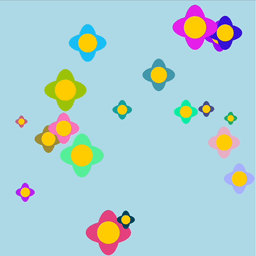

import EditableSketch from "../../../components/EditableSketch/index.astro";
import Callout from "../../../components/Callout/index.astro";
import AnnotatedLine from "../../../components/AnnotatedLine/index.astro";



在本教程中，你将使用 p5.js 来模拟一个[交互式花园](https://editor.p5js.org/ptiarram/sketches/8xWVCzmn2)。在这个项目中，画布上会出现 20 朵随机生成的花朵，每朵花都有不同的颜色和大小。用户还可以点击画布添加新的花朵，让花园更加丰富。每朵花都会播放凋谢动画，逐渐缩小并消失，就像花朵自然凋谢一样。

在本教程中，你将：

- 通过定义、创建和使用自定义对象，了解[JavaScript 对象](https://developer.mozilla.org/en-US/docs/Glossary/object)等数据结构。
- 学习使用对象方法操作[JavaScript 数组](https://developer.mozilla.org/en-US/docs/Web/JavaScript/Reference/Global_Objects/Array)等内置对象。
- 使用 for 循环遍历多个对象。


## 准备工作

开始之前，你应该能够：

- 使用 p5.js 在画布上添加和自定义形状和颜色
- 声明、初始化、使用和更新自定义变量以及带有参数和返回值的函数
- 在画布上添加动画
- 注释代码并处理错误信息
- 创建和使用自定义函数
- 理解如何使用 for 循环来管理重复性任务

如需了解有关数组、循环和自定义函数的更多信息，请访问[使用函数组织代码](/tutorials/organizing-code-with-functions)和[使用循环重复](/tutorials/repeating-with-loops)教程。

- 在[变量和变化](/tutorials/variables-and-change)教程中，你学习了如何使用变量存储数据。变量可用于存储单个值，例如数字或文本。
- 在[使用媒体对象制作动画](/tutorials/animating-with-media-objects)教程中，你学习了如何使用 p5.js 内置的 `p5.Image` 和 `p5.Graphics` 对象。这些对象将数据（例如图像）与称为[*方法*](https://www.w3schools.com/js/js_object_methods.asp#:~:text=JavaScript%20methods%20are%20actions%20that,property%20containing%20a%20function%20definition.)的特殊函数捆绑在一起，使用户能够对这些数据执行操作。

在本教程中，你将学习如何：

- 定义对象
- 创建和使用自定义函数来更新和绘制对象
- 使用数组管理多个对象

让我们开始吧！


## JavaScript 对象

我们已经了解到，变量一次只能存储一个值（数字、字符串或布尔值）。数组可以通过索引存储多个值。然而，有时我们希望将关于同一事物的多个相关数据存储在一起。我们可以使用[JavaScript 对象](https://developer.mozilla.org/en-US/docs/Web/JavaScript/Reference/Global_Objects/Object)来实现这一点，它们通过将[属性](https://developer.mozilla.org/en-US/docs/Glossary/Property/JavaScript)和值配对来将数据捆绑在一起。属性是与对象关联的特殊类型的变量或名称。每个属性都存储一个值。例如，如果我们想创建一个基于花朵的 JavaScript 对象，它可以拥有描述其位置（x 和 y）以及表情符号的属性。


## 步骤 1：创建你的第一个对象

让我们从创建一朵花开始，打造我们的花园。我们可以先用表情符号来绘制它，所以我们需要花朵的 x 坐标、y 坐标以及表情符号的数据。

- 新建一个 p5.js 项目，并将其命名为“Data Structure Garden”（数据结构花园）。保存项目。

- 通过将花朵的画布坐标与用于绘制它的表情符号绑定，创建一个花朵对象。我们将该对象存储在一个名为 `flower` 的变量中。在[`setup()`](/reference/p5/setup)函数上方添加以下代码：

  ```js
  // 创建 flower 对象。
  let flower = { 
    x: 200, 
    y: 100, 
    emoji: '🌸'
  };
  ```

- 在 `setup()` 函数中添加以下代码行，即可将对象打印到控制台：

  ```js
  // 在控制台中打印 flower 对象。
  console.log(flower);
  ```

-  将背景色设置为浅蓝色。

你的代码应该如下所示：

<EditableSketch code={`
// 创建 flower 对象。
let flower = { 
  x: 200, 
  y: 100,
  emoji: '🌸' 
};

function setup() {
  createCanvas(400, 400);

  // 在控制台中打印 flower 对象。
  console.log(flower);
}
function draw() {
  background("lightblue");
}
`} />

尝试[在 p5.js 网页编辑器中打开目前为止的代码](https://editor.p5js.org/KM_Playground/sketches/Nwte7l2dD)。你应该能在控制台中看到你的花朵对象。注意，你可以点击控制台中的箭头来查看对象的属性和值。

以下是定义对象的一般语法：

```js
// 定义一个对象。
let objectName = {
  property1: value1,
  property2: value2,
  property3: value3
};
```

对象语法包括：

- 大括号 (`{}`) 括起一组[属性](https://developer.mozilla.org/en-US/docs/Glossary/Property/JavaScript)；
  - 属性可以是名称，例如变量或函数的名称，也可以是字符串。在属性名称中使用空格时，使用字符串通常会很有帮助。例如，我可能会创建一个具有“名字”和“姓氏”属性的对象，如下所示：

    ```js
    let ironMan = { 
      "first name" : "Tony",
      "last name" : "Stark"
    }
    ```

- 使用冒号 (:) 分隔每个属性及其对应的值；
  - 值可以是任何数据类型，甚至可以是函数！
- 使用逗号 (,) 分隔每对 `property : value`。

<AnnotatedLine code={({ top, bottom }) => `
let ${top('obj', 'flower')} = {
  ${bottom('prop', '    x    ')}: ${bottom('val', '  200  ')},
  ${bottom('prop', '    y    ')}: ${bottom('val', '  200  ')},
  ${bottom('prop', '  emoji  ')}: ${bottom('val', '  "🌸" ')}
}
`}>
    <Fragment slot="obj">对象名称</Fragment>
    <Fragment slot="prop">属性</Fragment>
    <Fragment slot="val">值</Fragment>
</AnnotatedLine>

你可以通过在定义对象时初始化新变量来存储对象。在上面的代码中，你声明了一个名为 `flower` 的变量。然后，你使用一个对象初始化了 `flower` 变量，该对象的属性代表一朵可以绘制在画布上的花。

要检查对象的属性和值，你可以使用 [`console.log()`](/reference/console/log)，它会在控制台中显示以下内容：

```
▼ {x: 200, y: 100, emoji: "🌸"}
   x: 200`
   y: 100`
   emoji: "🌸"
```


## 步骤 2：使用你的对象

你可以使用变量名、属性名和点号表示法来访问存储在对象属性中的任何值，如下所示：

```js
// 使用点号表示法访问 objectName 对象的 property1 属性值。
objectName.property1 
```

- 通过将花朵对象的属性传给 [`text()`](/reference/p5/text) 函数，在画布上绘制花朵。
  - 在 [`draw()`](/reference/p5/draw) 函数中，添加以下代码：

    ```js
    // 显示花朵表情符号。
    text(flower.emoji, flower.x, flower.y);
    ```

- 你可以在 `text()` 函数之前使用 `textSize()` 来设置花朵的大小。

  ```js
  // 增大文本/表情符号的大小。
  textSize(100);
  ```

你的代码应该如下所示：

<EditableSketch code={`
// 创建 flower 对象。
let flower = { 
  x: 200, 
  y: 100,
  emoji: '🌸' 
};

function setup() {
  createCanvas(400, 400);
}

function draw() {
  background("lightblue");

  // 增大文本/表情符号的大小。
  textSize(100);

  // 显示花朵表情符号。
  text(flower.emoji, flower.x, flower.y);
}
`} />

要访问花朵对象中的值，我们使用[点号表示法](https://developer.mozilla.org/en-US/docs/Web/JavaScript/Reference/Operators/Property_accessors)，通过点运算符来访问对象中的属性和值。

在上面的代码中，你访问了：

- 花朵的表情符号（`flower.emoji`）
- 花朵的 x 坐标（`flower.x`）
- 花朵的 y 坐标（`flower.y`）

由于这些值代表字符串和数字，因此可以像使用变量名访问其存储的值一样，在 [`text()`](/reference/p5/text) 函数中使用它们。

访问 p5.js 参考文档，了解更多关于[对象](/reference/p5/object)的信息。

<Callout>
- 为花朵对象添加 `size` 属性。
- 将 `textSize()` 的值替换为花朵对象的 `size` 属性值。

[示例](https://editor.p5js.org/KM_Playground/sketches/ezATsCBra) 
</Callout>


## 步骤 3：定义 `createFlower()` 函数

现在，让我们定义一个可以在画布上显示不同花朵的函数。我们将定义一个 `createFlower()` 函数，以便自定义我们创建的花朵对象。我们需要确保可以更改不同花朵的 x 和 y 坐标，以及它们的大小和颜色。一种方法是为花朵对象添加 `size` 和 `color` 属性。在这个项目中，我们还希望花朵出现一段时间后消失。为此，我们将为花朵对象添加一个 `lifespan` 属性。

我们希望 `createFlower()` 函数在被调用时返回信息，就像内置的 `text()` 函数在画布上返回文本一样。因此，我们必须指定一个[返回值](https://developer.mozilla.org/en-US/docs/Learn/JavaScript/Building_blocks/Return_values)。使用*返回值*是将函数计算出的信息保存到变量或数组中的好方法。

在这个例子中，我们将使用 [`random()`](/reference/p5/random) 来为绘制在画布上的花朵创造多样性。

- 定义 `createFlower()` 函数，该函数创建一个随机花朵对象。每次调用 `createFlower()` 时，所有值都会随机设置。
  - 在 [`draw()`](/reference/p5/draw) 和 [`setup()`](/reference/p5/setup) 函数之外，添加以下函数声明：

    ```js
    // 创建随机 flower 对象的函数。
    function createFlower() {
      // 定义 flower 对象。
      let flower = {
        x: random(20, 380),
        y: random(20, 380),
        size: random(20, 75),
        lifespan: random(255, 300),
        color: color(random(255), random(255), random(255)),
      };
      // 返回 flower 对象。
      return flower;
    }
    ```

- 使用 `createFlower()` 函数创建一个花朵对象，并将其存储在名为 `myFlower` 的变量中，以此测试该函数。
  - 在 [`draw()`](/reference/p5/draw) 函数中添加以下代码：

    ```js
    // 创建 flower 对象。
    let myFlower = createFlower();
    ```

- 使用 `myFlower` 对象的属性在画布上绘制一个椭圆。
  - 在 [`draw()`](/reference/p5/draw) 函数中添加以下代码：  

    ```js
    // 使用 myFlower 对象的属性绘制椭圆。
    fill(myFlower.color);
    ellipse(myFlower.x, myFlower.y, myFlower.size);
    ```

- 通过将帧速率更改为每秒一帧来降低每朵花出现的速率。在 [`setup()`](/reference/p5/setup) 函数中，添加： `frameRate(1);`。

你的代码应如下所示：

<EditableSketch code={`
function setup() {
  createCanvas(400, 400);
  frameRate(1);
}
function draw() {
  background("lightblue");

  // 创建 flower 对象。
  let myFlower = createFlower();

  // 使用 myFlower 对象的属性绘制椭圆。
  fill(myFlower.color);
  ellipse(myFlower.x, myFlower.y, myFlower.size);
}
function createFlower() {
  // 定义 flower 对象。
  let flower = {
    x: random(20,380),
    y: random(20,380),
    size: random(20,75),
    lifespan: random(255,300),
    color: color(random(255), random(255), random(255)),
  };
  
  // 返回 flower 对象。
  return flower;
}
`} />

在上面的代码中，你使用 `createFlower()` 创建并返回一个具有随机值的新花朵对象，然后将该对象存储在变量 `myFlower` 中。 `myFlower` 用于访问其属性的随机值，这些值用于在画布上绘制椭圆。每次运行 [`draw()`](/reference/p5/draw) 时，都会创建一个新的随机花朵对象，并使用该对象的属性在画布上绘制一个新的随机椭圆。

访问 p5.js 参考文档，了解有关 [`return`](/reference/p5/return) 和 [`random()`](/reference/p5/random) 的更多信息。

<Callout>
- 更改花朵在 x 和 y 坐标系中的位置和大小的随机范围。
- 在颜色生成方面发挥创意；例如，可以只使用蓝色、红色或紫色等色调。

[示例](https://editor.p5js.org/KM_Playground/sketches/Cu8PrnNfH) 
</Callout>


## 步骤 4：定义带参数的 `drawFlower()` 函数

既然我们知道 `createFlower()` 会创建并返回一个新的花朵对象，接下来让我们定义 `drawFlower()` 函数。我们的 `drawFlower()` 函数会接收一个花朵对象作为参数，并将其绘制到画布上。这有助于使我们的代码更清晰易懂。

- 在所有其他函数之外，定义一个 `drawFlower()` 函数，该函数带有一个表示花朵对象的参数。

  ```js
  function drawFlower(flower) { }
  ```

- 在 `drawFlower()` 函数内部，绘制花朵的属性，包括花瓣和花心。请记住使用花朵对象的 `x` 和 `y` 坐标、`size` 和 `color` 属性。你可以将以下代码添加到函数体中：

  ```js
  noStroke();
  fill(flower.color);

  // 绘制花瓣。
  ellipse(flower.x, flower.y, flower.size / 2, flower.size); 
  ellipse(flower.x, flower.y, flower.size, flower.size / 2);

  // 绘制黄色花心。
  fill(255, 204, 0);
  circle(flower.x, flower.y, flower.size / 2);
  ```

- 接下来，我们将测试 `drawFlower()` 函数。请将以下代码添加到 [`draw()`](/reference/p5/draw) 函数中：

  ```js
  // 测试 drawFlower() 函数。
  let flower1 = createFlower();
  drawFlower(flower1);
  ```

你的代码应该类似于这样：

<EditableSketch code={`
function setup() {
  createCanvas(400, 400);
  frameRate(1);
}

function draw() {
  background("lightblue");

  // 测试 drawFlower() 函数。
  let flower1 = createFlower();
  drawFlower(flower1);
}

function createFlower() {
  let flower = {
    x: random(20,380),
    y: random(20,380),
    size: random(20,75),
    lifespan: random(255,300),
    color: color(random(255), random(255), random(255))
  };
  return flower;
}

function drawFlower(flower) { 
  noStroke();
  fill(flower.color);

  // 绘制花瓣。
  ellipse(flower.x, flower.y, flower.size / 2, flower.size);
  ellipse(flower.x, flower.y, flower.size, flower.size / 2);

  // 绘制黄色花心。
  fill(255, 204, 0);
  circle(flower.x, flower.y, flower.size / 2);
} 
`} />

在上面的代码中， `createFlower()` 用于创建并返回一个随机花朵，该花朵存储在 `flower1` 中。然后，这个随机花朵（`flower1`）被传递给 `drawFlower()`，该函数访问花朵对象的属性，从而在画布上绘制花朵。每次运行 [`draw()`](/reference/p5/draw) 函数时，这个过程都会重复，因此画布上的花朵会随机出现和消失。

<Callout>
使用其他二维形状更改和修改花朵图案：

- [`ellipse()`](/reference/p5/ellipse)
- [`square()`](/reference/p5/square)
- [`quad()`](/reference/p5/quad)
- [`triangle()`](/reference/p5/triangle)
- [`line()`](/reference/p5/line)
- [`point()`](/reference/p5/point)
- [`arc()`](/reference/p5/arc)

[示例](https://editor.p5js.org/KM_Playground/sketches/fDX0Xjq31)
</Callout>

## 步骤 5：学习使用数组

在开始使用数组创建花园之前，让我们先通过几个简单的例子更好地理解数组的工作原理。[JavaScript 数组](https://developer.mozilla.org/en-US/docs/Web/JavaScript/Reference/Global_Objects/Array)是一种对象，它可以在一个变量名中存储多个值。数组中的每个值都是一个*元素*，每个元素都有一个特定的位置，称为*索引*。任何[JavaScript 数组](https://developer.mozilla.org/en-US/docs/Web/JavaScript/Reference/Global_Objects/Array)中第一个*元素*的*索引*始终为 0。


### 示例 1：创建并绘制花名数组

<EditableSketch code={`
// 创建 flowers 数组。
let flowers = ["Rose", "Daisy", "Tulip"];

function setup() {
  createCanvas(200, 200);

  background(220);

  // 绘制第一个花名。
  fill('red');
  text(flowers[0], 10, 50);

  // 绘制第二个花名。
  fill('green');
  text(flowers[1], 10, 100);

  // 绘制第三个花名。
  fill('blue');
  text(flowers[2], 10, 150);
}
`} />

<AnnotatedLine code={({ bottom }) => `let flowers = [${bottom('i0', '"Rose"')}, ${bottom('i1', '"Daisy"')}, ${bottom('i2', '"Tulip"')}];`}>
    <Fragment slot="i0">0</Fragment>
    <Fragment slot="i1">1</Fragment>
    <Fragment slot="i2">2</Fragment>
</AnnotatedLine>

在这个例子中，我们使用方括号（`[ ]`）和逗号创建了一个数组，逗号用于分隔数组中的每个元素。该数组是一个字符串集合，每个字符串代表一种花朵，并存储在名为 `flowers` 的变量中。数组中的每个元素都包含一个花朵名称的字符串。可以通过索引号访问每个元素。例如， `"Rose"` 位于索引 `0`， `"Daisy"` 位于索引 `1`， `"Tulip"` 位于索引 `2`。


<AnnotatedLine code={({ top, bottom }) => `let ${top('var', '   rose   ')} = ${top('arr', 'flowers')}[${top('idx', '   0   ')}];`}>
    <Fragment slot="var">用于保存元素的变量名</Fragment>
    <Fragment slot="arr">要访问的数组</Fragment>
    <Fragment slot="idx">数组中的索引</Fragment>
</AnnotatedLine>

在上面的代码片段中，我们使用索引表示法 `flowers[0]` 访问了 `flowers` 数组中索引为 0 的第一个元素。在这个例子中，我们使用这种语法在画布上放置文本，文本名称取自 `flowers` 数组中的各个元素。

然后，我们将该值赋给一个名为 `rose` 的新变量。`rose` 现在存储的是字符串 `"Rose"`，也就是 `flowers` 数组中的第一个花名。其他元素中存储的值也可以用同样的方法访问。


### 示例 2：使用 `for` 循环遍历花名数组

<EditableSketch code={`
// 创建 flowers 数组。
let flowers = ["Rose", "Daisy", "Tulip"];

function setup() {
  createCanvas(200, 200);
}

function draw() {
  background(220);

  // 使用 for 循环遍历数组。
  for (let i = 0; i < flowers.length; i += 1) {
    text(flowers[i], 10, 50+(50 * i));
  }
}
`} />

我们的第二个例子使用 `for` 循环遍历数组中的每个元素，并将文本绘制到画布上。*遍历*是指对数组中的每个元素重复执行一段代码的过程。

<AnnotatedLine code={({ top, bottom }) => `
for (${top('start', 'let i = 0;')} ${top('end', 'i < flowers.length')}; i += 1) {
  text(${bottom('access', 'flowers[i]')}, 10, 50+(50 * i));
}
`}>
    <Fragment slot="start">从索引 0 开始</Fragment>
    <Fragment slot="end">……直到数组末尾</Fragment>
    <Fragment slot="access">获取索引 `i` 处的元素</Fragment>
</AnnotatedLine>

为了遍历数组，上面的代码片段使用了一个 `for` 循环来遍历 `flowers` 数组中的每个元素。根据 `for` 循环，索引 `i` 从 `0` 开始，每次循环加 `1`，由于数组的索引从 `0` 开始，因此数组中最后一个元素的索引比数组元素个数少 `1`。可以使用 `array.length` 属性访问任何数组中的元素个数。在上面的 `for` 循环中，我们使用 `flowers.length` 访问 `flowers` 数组的长度。为了访问数组中的值，我们在 `for` 循环中使用 `flowers[i]`，并在 [`text()`](/reference/p5/text) 函数中将每个元素的值以文本形式显示在画布上。


### 示例 3：向数组中添加新元素

<EditableSketch code={`
// 创建 flowers 数组。
let flowers = ["Rose", "Daisy", "Tulip"];

function setup() {
  createCanvas(200, 200);
  flowers.push("Sunflower"); //添加新元素。

  background(220);

  // 使用 for 循环遍历数组。
  for (let i = 0; i < flowers.length; i += 1) {
    text(flowers[i], 10, 50+(40 * i));
  }
}
`} />

<AnnotatedLine code={({ top, bottom }) => `
let flowers = ["Rose", "Daisy", "Tulip"${bottom('add', '        ')}];
flowers${bottom('push', '.push("Sunflower");')}
`}>
    <Fragment slot="add">新元素会添加到这里</Fragment>
    <Fragment slot="push">将新元素添加到 `flowers` 数组末尾</Fragment>
</AnnotatedLine>

使用数组方法 [`array.push()`](https://developer.mozilla.org/en-US/docs/Web/JavaScript/Reference/Global_Objects/Array/push)，你可以将新元素添加到数组末尾。在本例中，我们将 `"Sunflower"` 添加到 `flowers` 数组的末尾。


### 示例 4：删除数组元素

<EditableSketch code={`
// 创建 flowers 数组。
let flowers = ["Rose", "Daisy", "Tulip"];

function setup() {
  createCanvas(200, 200);

  // 从索引 0 开始，删除一个花朵元素。
  flowers.splice(0, 1);

  background(220);

  for (let i = 0; i < flowers.length; i += 1) {
    text(flowers[i], 10, 50+(50 * i));
  }
}
`} />

<AnnotatedLine code={({ bottom }) => `
let flowers = [${bottom('i0', '"Rose"')}, ${bottom('i1', '"Daisy"')}, ${bottom('i2', '"Tulip"')}];
flowers.splice(${bottom('start', '   0   ')}, ${bottom('count', '   1   ')});
`}>
    <Fragment slot="i0">0</Fragment>
    <Fragment slot="i1">1</Fragment>
    <Fragment slot="i2">2</Fragment>
    <Fragment slot="start">从这个索引开始</Fragment>
    <Fragment slot="count">……删除一个元素</Fragment>
</AnnotatedLine>

要从数组中删除元素，我们使用 [`array.splice()`](https://developer.mozilla.org/en-US/docs/Web/JavaScript/Reference/Global_Objects/Array/splice) 函数。`array.splice()` 函数会修改 `flowers` 数组，并传入两个参数：一个是起始索引，另一个是要删除的元素数量。例如，`flowers.splice(0,1)` 会从数组中删除 `Rose` 元素，只留下 `Daisy` 和 `Tulip` 元素。


### 示例 5：使用 `for..of` 循环遍历数组

<EditableSketch code={`
// 创建 flowers 数组。
let flowers = ["Rose", "Daisy", "Tulip"];

function setup() {
  createCanvas(200, 200);

  background(220);
  let y = 50;

  // 使用 for..of 循环依次访问每个元素。
  for (let flower of flowers) {
    text(flower, 10, y);
    y += 50;
  }
}
`} />


<AnnotatedLine code={({ top, bottom }) => `
for (${top('decl', 'let flower')} ${top('kw', '   of   ')} ${top('arr', 'flowers')}) {
  print(${bottom('elt', '   flower   ')});
}
`}>
    <Fragment slot="decl">声明一个变量来存储当前元素</Fragment>
    <Fragment slot="kw">遍历数组的关键字</Fragment>
    <Fragment slot="arr">要遍历的数组</Fragment>
    <Fragment slot="elt">对当前元素执行操作</Fragment>
</AnnotatedLine>

我们还可以使用 `for..of` 循环来遍历数组。 `flower` 变量在循环遍历期间临时存储每个元素。循环内的 `print(flower)` 语句将每朵花的名称打印到控制台，按顺序循环显示“Rose”、“Daisy”和“Tulip”。

当事情变得更加复杂时，使用 `for..of` 循环可以使代码更易于阅读，例如以下示例：[使用索引的 `for` 循环](https://editor.p5js.org/Msqcoding/sketches/HrIxPGZEP)与[ `for..of` 循环](https://editor.p5js.org/Msqcoding/sketches/TYq2M6noR)。


## 步骤 6：使用数组生成多朵花

现在，是时候使用数组在屏幕上生成多朵花了。

 

- 首先，在程序顶部声明 `flowers` 数组。空方括号 `[]` 表示一个空的 flowers 数组。

  ```js
  // 创建 flowers 数组。
  let flowers = [];
  ```

- 在所有其他函数之外，定义 `flowerPower()` 函数。

  ```js
  // 创建 20 朵花的函数。
  function flowerPower() {}
  ```

- 在 `flowerPower()` 函数内部，使用 `for` 循环创建 20 个 花朵对象，并将它们添加到 `flowers` 数组中。

  ```js
  for(let i = 0; i < 20; i += 1) {
    // 在随机位置创建一朵花。
    let flower = createFlower();
    // 将花朵添加到 flowers 数组中。
    flowers.push(flower);
  }
  ```

- 在 `setup()` 函数中调用 `flowerPower()` 函数来创建 20 个花朵对象。

  ```js
  // 生成 20 朵花。
  flowerPower();
  ```

- 在 `draw()` 函数中使用 `for..of` 循环遍历数组，绘制 `flowers` 数组中的每朵花。`for..of` 循环的意思是，对于 `flowers` 数组中的每个花元素，调用 `drawFlower()` 函数。

  ```js
  // 遍历 flowers 数组中的每一朵花。
  for (let flower of flowers) {
    drawFlower(flower);
  }
  ```

你的代码应该类似于这样：

<EditableSketch code={`
// 创建 flowers 数组。
let flowers = [];

function setup() {
  createCanvas(400, 400);
  frameRate(1);

  // 生成 20 朵花。
  flowerPower();
}
function draw() {
  background("lightblue");

  // 遍历 flowers 数组中的每一朵花。
  for (let flower of flowers) {
    drawFlower(flower);
  }
}

// 创建 20 朵花的函数。
function flowerPower() {
  for (let i = 0; i < 20; i += 1 ) {
    // 在随机位置创建一朵花。
    let flower = createFlower();

    // 将花朵添加到 flowers 数组中。
    flowers.push(flower);
  }
}

// ... createFlower() 和 drawFlower() 函数
function createFlower() {
  let flower = {
    x: random(20,380),
    y: random(20,380),
    size: random(20,75),
    lifespan: random(255,300),
    color: color(random(255), random(255), random(255))
  };
  return flower;
}
function drawFlower(flower) { 
  noStroke();
  fill(flower.color);

  // 绘制花瓣。
  ellipse(flower.x, flower.y, flower.size / 2, flower.size);
  ellipse(flower.x, flower.y, flower.size, flower.size / 2);

  // 绘制黄色花心。
  fill(255, 204, 0);
  circle(flower.x, flower.y, flower.size / 2);
} 
`} />

<Callout>
在你的 `flowerPower()` 函数中添加一个参数，这样就可以方便地指定初始花朵数量。

[示例](https://editor.p5js.org/KM_Playground/sketches/BkgxufvQf)
</Callout>


## 步骤 7：更新数组中的花朵

现在我们已经测试了 `flowers` 数组，让我们绘制凋谢效果。使用数组控制花朵的好处之一是能够更新每朵花中的值。

- 在所有其他函数之外，定义一个名为 `updateAndDrawFlowers()` 的函数：

  ```js
  function updateAndDrawFlowers() {}
  ```

- 该函数将遍历数组中的每一朵花，并绘制该朵花。

  ```js
  for (let flower of flowers) {
     drawFlower(flower);
  }
  ```

- 在 `for` 循环内，减小花朵对象的 `size` 和 `lifespan` 以模拟凋谢。

  添加一个凋谢动画效果，在 `drawFlower()` 函数绘制完花朵后，花朵尺寸会缩小 1%。我们通过将当前尺寸乘以 0.99 并将结果存储回花朵的 `size` 属性来创建凋谢效果。然后，递减花朵的生命周期并将结果存储回花朵的 `lifespan` 属性。使用[乘法赋值运算符](https://developer.mozilla.org/en-US/docs/Web/JavaScript/Guide/Expressions_and_operators#assignment_operators)和[递减运算符](https://developer.mozilla.org/en-US/docs/Web/JavaScript/Reference/Operators/Decrement)，语法如下：

  ```js
  // 让花朵逐渐凋谢。
  flower.size *= 0.99;

  // 减少生命周期。
  flower.lifespan -= 1; 
  ```

- 当花朵对象的生命周期为零或负数时，我们将使用 [`array.splice()`](https://developer.mozilla.org/en-US/docs/Web/JavaScript/Reference/Global_Objects/Array/splice) 方法将其从数组中移除。

  ```js
  for (let flower of flowers) {
    // 绘制花朵。
    drawFlower(flower);

    // 让花朵逐渐凋谢。
    flower.size *= 0.99;

    // 减少生命周期。
    flower.lifespan -= 1; 

    if (flower.lifespan <= 0) {
      // 保存花朵的索引。
      let i = flowers.indexOf(flower);

      // 移除已凋谢的花朵。
      flowers.splice(i, 1); 
    }
  }
  ```

- 在 `draw()` 函数中添加 `updateAndDrawFlowers()`。
- 从 `setup()` 函数中移除对 `frameRate(1)` 的调用。

你的代码应该类似于这样：

<EditableSketch code={`
// 创建 flowers 数组。
let flowers = [];

function setup() {
  createCanvas(400, 400);

  // 生成 20 朵花。
  flowerPower();
}

function draw() {
  background("lightblue");

  // 调用 updateAndDrawFlowers() 函数。
  updateAndDrawFlowers();
}

// 定义 updateAndDrawFlowers() 函数。
function updateAndDrawFlowers() {
  for (let flower of flowers) {

    // 绘制花朵。
    drawFlower(flower);

    // 将花朵大小缩小 1%，产生凋谢效果。
    flower.size *= 0.99;

    // 减少生命周期。
    flower.lifespan -= 1;

    if (flower.lifespan <= 0) {
      // 保存花朵的索引。
      let i = flowers.indexOf(flower);

      // 移除已凋谢的花朵。
      flowers.splice(i, 1);
    }
  }
}

// 创建 20 朵花的函数。
function flowerPower(){
  for(let i = 0; i < 20; i+=1){
    // 在随机位置创建一朵花。
    let flower1 = createFlower();

    // 将花朵添加到 flowers 数组中。
    flowers.push(flower1);
  }
}

function createFlower() {
  let flower = {
    x: random(20,380),
    y: random(20,380),
    size: random(20, 75),
    lifespan: random(255,300),
    color: color(random(255), random(255), random(255))
  };

  return flower;
}

function drawFlower(flower) {
  noStroke();
  fill(flower.color);

  // 绘制花瓣。
  ellipse(flower.x, flower.y, flower.size / 2, flower.size);
  ellipse(flower.x, flower.y, flower.size, flower.size / 2);

  // 绘制花心。
  fill(255, 204, 0);
  circle(flower.x, flower.y, flower.size / 2);

}
`} />

<Callout>
尝试用减法、随机数或任何你能想到的其他方法来模拟凋谢效果。

[示例](https://editor.p5js.org/KM_Playground/sketches/9YesvTdSi)
</Callout>


## 步骤 8：使用 `mousePressed()` 向数组添加更多花朵

最后，让我们使用 [`mousePressed()`](/reference/p5/mousePressed)， [`mouseX`](/reference/p5/mouseX)，和 [`mouseY`](/reference/p5/mouseY) 向画布添加更多花朵。每次点击画布时，都会向花朵数组中添加一个新的花朵对象。

- 在所有其他函数之外，编写你的 `mousePressed()` 函数：

  ```js
  function mousePressed() {
    let flower = createFlower();

    // 将 x 重新赋值为 mouseX。
    flower.x = mouseX; 
    
    // 将 y 重新赋值为 mouseY。
    flower.y = mouseY;

    // 将花朵添加到 flowers 数组中。
    flowers.push(flower);
  }
  ```

你的代码应该类似于这样：

<EditableSketch code={`
// 创建 flowers 数组。
let flowers = [];

function setup() {
  createCanvas(400, 400);

  // 生成 20 朵花。
  flowerPower();
}

function draw() {
  background('lightblue');

  // 调用 updateAndDrawFlowers() 函数。
  updateAndDrawFlowers();
}

function mousePressed() {
  let flower = createFlower();

  // 将 x 重新赋值为 mouseX。
  flower.x = mouseX;

  // 将 y 重新赋值为 mouseY。
  flower.y = mouseY;

  // 将花朵添加到 flowers 数组中。
  flowers.push(flower);
}

function updateAndDrawFlowers() {
  for (let flower of flowers) {

    // 绘制花朵。
    drawFlower(flower);

    // 将花朵大小缩小 1%，产生凋谢效果。
    flower.size *= 0.99;

    // 减少生命周期。
    flower.lifespan -= 1;

    if (flower.lifespan <= 0) {
      // 保存花朵的索引。
      let i = flowers.indexOf(flower);

      // 移除已凋谢的花朵。
      flowers.splice(i, 1);
    }
  }
}

// 创建 20 朵花的函数。
function flowerPower(){
  for(let i = 0; i < 20; i+=1){
    // 在随机位置创建一朵花。
    let flower1 = createFlower();

    // 将花朵添加到 flowers 数组中。
    flowers.push(flower1);
  }
}

function createFlower() {
  let flower = {
    x: random(20,380),
    y: random(20,380),
    size: random(20, 75),
    lifespan: random(255,300),
    color: color(random(255), random(255), random(255))
  };

  return flower;
}

function drawFlower(flower) {
  noStroke();
  fill(flower.color);

  // 绘制花瓣。
  ellipse(flower.x, flower.y, flower.size / 2, flower.size);
  ellipse(flower.x, flower.y, flower.size, flower.size / 2);

  // 绘制花心。
  fill(255, 204, 0);
  circle(flower.x, flower.y, flower.size / 2);

}
`} />

<Callout>
- 当鼠标按下时，在 `mouseX` 和 `mouseY` 位置周围添加多朵花。([示例](https://editor.p5js.org/KM_Playground/sketches/GmkrFWHSj))
- 尝试不同的花朵形状或颜色。([示例](https://editor.p5js.org/KM_Playground/sketches/uyIza6XVJ))
- 向花园中添加新的元素，例如蜜蜂或蝴蝶，并观察它们如何与花朵互动。([示例](https://editor.p5js.org/KM_Playground/sketches/jPO02404x))
</Callout>


## 总结

恭喜你完成数据结构花园教程！

在本教程中，你学习了 JavaScript 对象和数组的基本概念，并用它们创建了一个动态、可交互的花园。使用数组可以帮助你高效管理多个对象及其各自的属性和行为，也为之后构建更复杂的交互程序打下基础。


## 下一步

- 在[创建和设置 HTML 样式](/tutorials/creating-styling-html)教程中，使用 p5.js 和 HTML 及 CSS。
- 在[Abracadabra：用手说话](/tutorials/speak-with-your-hands)教程中，使用 p5.js 和[ml5.js](https://ml5js.org/)。
- 在[Node.js 入门](/tutorials/getting-started-with-nodejs)和[简单旋律应用](/tutorials/simple-melody-app/)教程中，使用 p5.js 和[Node.js](https://www.w3schools.com/nodejs/nodejs_intro.asp)。

再次祝贺你完成了本教程。继续尝试，继续编码，最重要的是，享受学习和创作的乐趣！


## 资源

- [JavaScript 对象](https://developer.mozilla.org/en-US/docs/Learn/JavaScript/Objects/Basics)
- [属性 - JavaScript 对象](https://developer.mozilla.org/en-US/docs/Glossary/Property/JavaScript)
- [属性访问器 - 点号表示法](https://developer.mozilla.org/en-US/docs/Web/JavaScript/Reference/Operators/Property_accessors)
- [函数返回值](https://developer.mozilla.org/en-US/docs/Learn/JavaScript/Building_blocks/Return_values)
- [JavaScript 数组](https://developer.mozilla.org/en-US/docs/Web/JavaScript/Reference/Global_Objects/Array)
- [表达式和运算符](https://developer.mozilla.org/en-US/docs/Web/JavaScript/Guide/Expressions_and_operators#assignment_operators)
