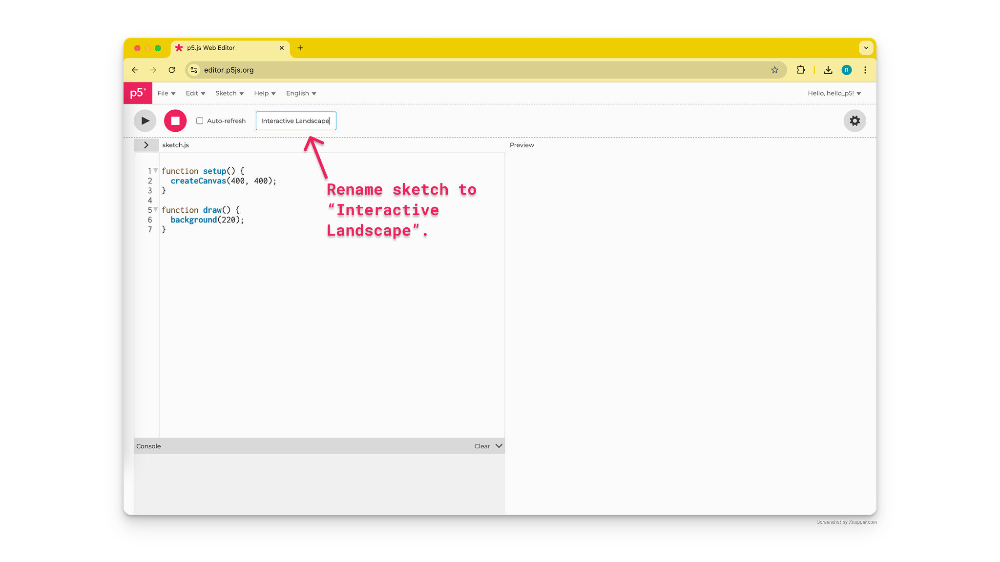
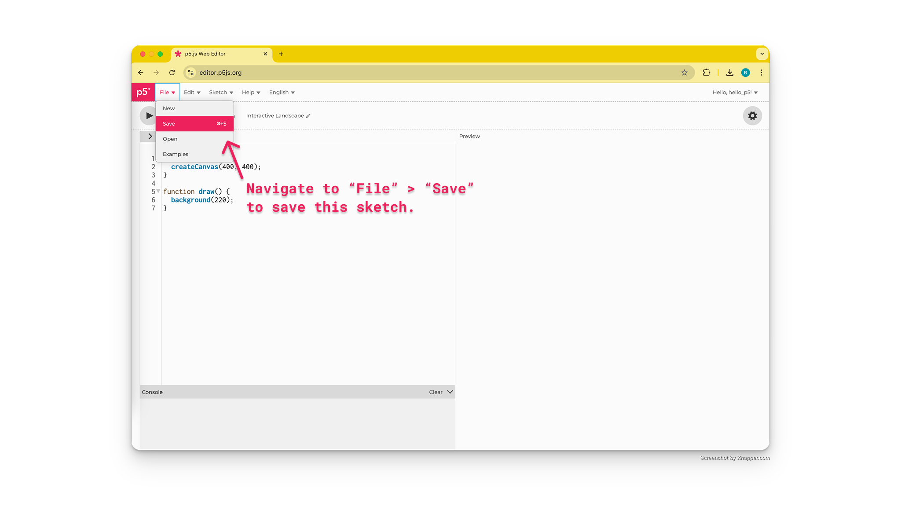
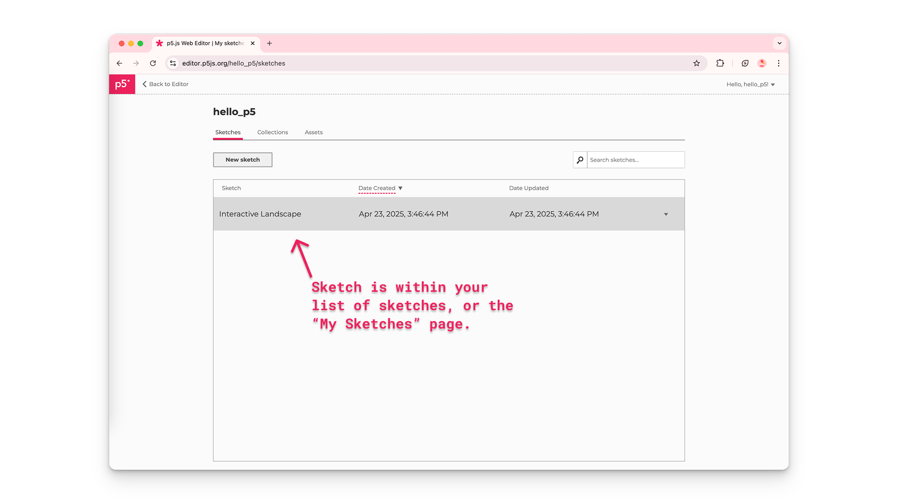
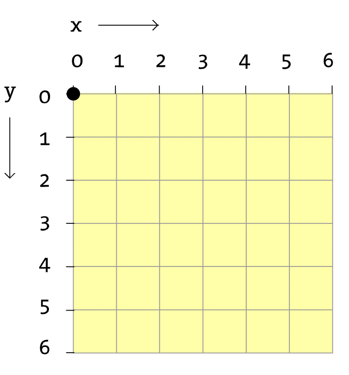
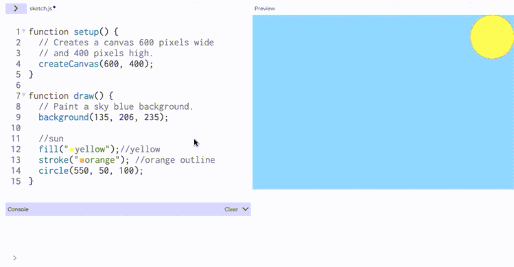
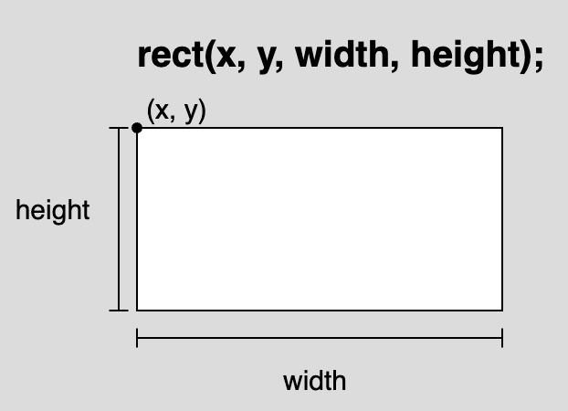
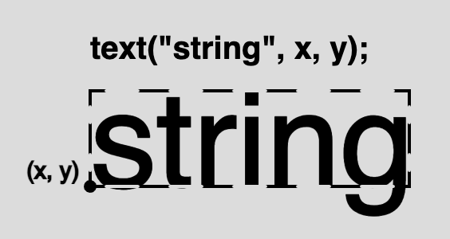

import EditableSketch from "../../../components/EditableSketch/index.astro";
import Callout from "../../../components/Callout/index.astro";

欢迎来到 p5.js！刚开始接触 p5.js，想要学习如何创建交互式草图吗？跟随本教程创建一个简单的[交互式风景画](https://editor.p5js.org/Msqcoding/sketches/SDbVilWaf)。你将学习如何：

- 更改画布大小和背景颜色
- 添加、自定义和着色形状与文本
- 通过让草图响应鼠标指针位置来添加简单交互性
- 注释代码
- 使用 [p5.js 参考](/reference/)页面来了解更多信息


## 先决条件

- [设置你的环境](../setting-up-your-environment)

在开始之前，你应该能够：

- 登录 [p5.js 网页编辑器](https://editor.p5js.org/) 并保存一个新项目

**或者**

- 在 [VS Code](https://code.visualstudio.com/)（或其他代码编辑器）中创建并保存一个新的 p5.js 项目

有关在 [p5.js 网页编辑器](https://editor.p5js.org/) 或 [VS Code](https://code.visualstudio.com/) 中创建和保存项目的分步指南，请访问 [设置你的环境](../setting-up-your-environment)。


## 步骤 1：命名并保存一个新的 p5.js 项目

- 创建一个新的 p5.js 项目，给它命名，然后保存它。

使用 [p5.js 网页编辑器](https://editor.p5js.org/)：

- 登录 [p5.js 网页编辑器](https://editor.p5js.org/)。
- 点击*铅笔图标*，在出现的文本框中输入"Interactive Landscape"（交互式风景画）作为项目名称。。



- 点击*文件*，然后选择*保存*。



- 通过导航到你保存的草图画廊来确认项目已保存：
  - 点击*文件*，然后选择*打开*。
  - 最近保存的草图会显示在项目列表的最上方。



### 默认代码

所有 p5.js 项目都包含 p5.js 库，以及三个文件：[`index.html`](https://www.classes.cs.uchicago.edu/archive/2021/spring/11111-1/happycoding/p5js/web-dev.html#:~:text=The%20index.,the%20page%20using%20HTML%20tags!)、[style.css](https://happycoding.io/tutorials/p5js/web-dev) 和 `sketch.js`。通过在 sketch.js 文件中添加代码来对画布进行更改。新的 p5.js 项目在 sketch.js 文件中以以下代码开始：

```js
function setup() {
  createCanvas(400, 400);
}
function draw() {
  background(220);
}
```

每个 sketch.js 文件都以两个主要函数开始：[`setup()`](/reference/p5/setup) 和 [`draw()`](/reference/p5/draw)。

[函数](/reference/p5/function)是执行特定任务的指令序列。

当 sketch.js 中的代码被执行时：

- [`setup()`](/reference/p5/setup) 被调用并运行一次。它可以用于为你的项目设置默认值。
  - 在 [`setup()`](/reference/p5/setup) 的花括号（`{}`）内，`createCanvas(400, 400)` 创建一个 400 像素宽、400 像素高的 HTML 画布，你可以在预览窗口中看到它。
- [`draw()`](/reference/p5/draw) 在 [`setup()`](/reference/p5/setup) 之后被直接调用，并每秒执行其花括号内的代码 60 次，直到程序停止或调用 [`noLoop()`](/reference/p5/noLoop) 函数。
  - 在 [`draw()`](/reference/p5/draw) 的花括号内，也称为 [`draw()`](/reference/p5/draw) 代码块，[`background()`](/reference/p5/background) 函数设置画布背景的颜色。默认值（220）将画布颜色设置为灰色。

访问 [p5.js 参考](/reference/)页面了解 [`setup()`](/reference/p5/setup)、[`draw()`](/reference/p5/draw)、[`createCanvas()`](/reference/p5/createCanvas) 和 [`background()`](/reference/p5/background) 的更多信息。

## 步骤 2：更改画布大小

- 修改 [`createCanvas()`](/reference/p5/createCanvas) 的*参数*，将画布大小更改为 600 像素宽、400 像素高。点击*播放*以在预览窗口中查看更改。
- 确保你点击了*播放*按钮或勾选了*自动刷新*框以更新画布。

你的代码应该如下所示：

```js
function setup() {
  createCanvas(600, 400);
}
function draw() {
  background(220);
}
```

<Callout title="Tip">
在 [p5.js 网页编辑器](https://editor.p5js.org/) 中点击*播放*并勾选"自动刷新"旁边的框，这样在你添加代码时，画布会自动持续更新。勾选此框后，你每次更改草图时都无需点击*播放*按钮。
</Callout>

## 步骤 3：使用注释描述代码

- 编写一个描述 `createCanvas(600, 400)` 作用的注释。

你的代码可以如下所示：

```js
function setup() {
  // 创建一个 600 像素宽
  // 400 像素高的画布。
  createCanvas(600, 400);
}
function draw() {
  background(220);
}
```


### 注释

在你的草图中使用*注释*可以帮助你记住每行代码的用途。由于 JavaScript 不会读取注释，它们是向其他查看你代码的人传达思路，或提醒自己代码功能的好方法。

- 在草图中的任何位置使用两个正斜杠（`//注释`）来嵌入单行注释。


### 语句

sketch.js 文件是用*JavaScript*编写的，其中每行代码称为一个*语句*。每个语句以分号（`;`）结尾。最佳实践是：在 sketch.js 文件中，每条语句末尾都加上分号。你不应该在函数和 `if` 语句的花括号后包含分号。

有关注释和语句的更多信息，请观看 [The Coding Train 的这个视频](https://www.youtube.com/watch?v=xJcrPJuem5Q)。


## 步骤 4：更改背景颜色

- 把 [`background()`](/reference/p5/background) 函数中的*参数*更改为 `background(135, 206, 235)`，即可将背景色设为天蓝色。
- 添加注释来描述这行代码。
- 勾选*自动刷新*框以自动更新画布。

你的代码可以如下所示：

<EditableSketch code={`
function setup() {
  // 创建一个 600 像素宽
  // 400 像素高的画布。
  createCanvas(600, 400);
}
function draw() {
  // 天蓝色背景
  background(135, 206, 235);
}
`} />

[`background()`](/reference/p5/background) 和其他 p5.js 命令（如形状）也是函数。[`background()`](/reference/p5/background) 函数专门更改画布背景的颜色。根据 p5.js 参考页面 [`background()`](/reference/p5/background) 的说明，上面代码中看到的三个*参数*代表红、绿、蓝的值，对应于画布上显示的蓝色。

红、绿、蓝的数字组合超过一千万种，你可以用它们调配出各种颜色。这些被称为 [RGB 颜色代码](/reference/p5/color)。在上面的代码中，我们看到 R 的值是 135，G 的值是 206，B 的值是 235。这对应于画布上显示的浅蓝色。

- 查看[这个示例](https://editor.p5js.org/Msqcoding/full/3j6stYuo2)，探索 [`background()`](/reference/p5/background) 中 R、G 和 B 值的变化如何影响画布的颜色。

访问 p5.js 参考页面了解 [background()](/reference/p5/background) 和 [color](/reference/p5/color) 的更多信息，以了解更多更改画布背景颜色的方法。


#### 提示

使用 [Google颜色选择器](https://g.co/kgs/aCdbzD) 搜索任意颜色，获取对应的代码。找到你想使用的颜色，复制标记为 RGB 的框中的数字，并将它们粘贴到 [`background()`](/reference/p5/background) 中。


## 步骤 5：在画布上绘制形状

- 使用 [`circle()`](/reference/p5/circle) 函数在画布的右上角绘制一个太阳。
- 添加一个分号（`;`）来结束这行代码。
- 添加一个描述这行代码的注释。

<Callout title="Note">
确保在 [`draw()`](/reference/p5/draw) 函数的花括号内（代码块中）添加形状，并勾选*自动刷新*框以自动更新画布。
</Callout>

你的代码应该如下所示：

<EditableSketch code={`
function setup() {
  // 创建一个 600 像素宽
  // 400 像素高的画布。
  createCanvas(600, 400);
}
function draw() {
  // 天蓝色背景
  background(135, 206, 235);
  // 太阳在右上角
  circle(550, 50, 100);
}
`} />

一些形状函数，如 [`circle()`](/reference/p5/circle)需要传入数字参数，分别描述圆心的水平位置（x 坐标）、垂直位置（y 坐标）以及圆的大小（直径）。x 和 y 坐标表示圆的中心点（`x`、`y`）（见下图）。

- 上面代码示例中 [`circle()`](/reference/p5/circle) 函数的第一个*参数*是 550，表示圆心的 x 坐标，即圆心位于画布左边缘右侧 550 像素处。
- 第二个参数，数字 50，是中心点的 y 坐标。这意味着中心点位于画布顶部边缘下方 50 像素处。
- 第三个参数，数字 100，是圆的直径。这意味着圆的宽度为 100 像素，高度为 100 像素。


访问 p5.js 参考页面了解 [`circle()`](/reference/p5/circle) 的更多信息。

### p5.js 画布坐标

画布内置了一个不可见的坐标系，原点（0,0）位于左上角。



当画布上的对象向右移动时，其水平位置增加。当画布上的对象向下移动时，其垂直位置增加。当对象在画布上向左移动时，其 x 坐标减小；当对象在画布上向上移动时，其 y 坐标减小。以下示例显示圆在画布上位置变化时的 x 或 y 坐标值：

- [这个示例](https://editor.p5js.org/Msqcoding/full/AM5ZwrmNo) 显示圆在画布上水平移动时的 x 坐标。
- [这个示例](https://editor.p5js.org/Msqcoding/full/jZeTUjZfZ) 显示圆在画布上垂直移动时的 y 坐标。

画布的最大宽度和高度由 [`createCanvas()`](/reference/p5/createCanvas) 函数设定。[`createCanvas()`](/reference/p5/createCanvas) 中的第一个数字是右边缘的 x 坐标，第二个数字是底部边缘的 y 坐标。

在[这个 p5.js 参考页面](/reference)上了解更多关于 HTML 画布坐标系和形状的信息。


## 步骤 6：为画布上的形状和轮廓着色

- 通过在 [`circle()`](/reference/p5/circle) 上方一行添加 `fill("yellow")` 来为太阳着色。
- 通过在 [`circle()`](/reference/p5/circle) 上方一行添加 `stroke("orange")` 来为太阳的轮廓着色。
- 通过在 [`circle()`](/reference/p5/circle) 上方一行添加 `strokeWeight(20)` 来更改轮廓的粗细。
- 添加注释来描述代码。

<Callout title="Note">
确保在 [`draw()`](/reference/p5/draw) 的代码块内，在绘制形状之前的行上添加 [`fill()`](/reference/p5/fill)、[`stroke()`](/reference/p5/stroke) 和 [`strokeWeight()`](/reference/p5/strokeWeight)。
</Callout>

你的代码应该如下所示：

<EditableSketch code={`
function setup() {
  // 创建一个 600 像素宽
  // 400 像素高的画布。
  createCanvas(600, 400);
}
function draw() {
  // 天蓝色背景
  background(135, 206, 235);
  // 太阳在右上角
  fill("yellow"); // 黄色

  stroke("orange"); // 橙色轮廓 

  strokeWeight(20); // 粗轮廓    

  circle(550, 50, 100);
}
`} />

[`fill()`](/reference/p5/fill) 函数设置画布上任何形状的颜色，[`stroke()`](/reference/p5/stroke) 函数设置线条和轮廓的颜色。它们都使用与 [`background()`](/reference/p5/background) 相同的参数。上面的代码使用 [HTML 颜色名称](https://www.w3schools.com/tags/ref_colornames.asp) 作为 [`fill()`](/reference/p5/fill) 和 [`stroke()`](/reference/p5/stroke) 的*参数*；我们也可以使用 [RGB 和 HEX 颜色代码](https://htmlcolorcodes.com/)。[`strokeWeight()`](/reference/p5/strokeWeight) 函数接收一个数字参数，用于设置其后绘制的线条、轮廓和点的粗细；默认的[`strokeWeight()`](/reference/p5/strokeWeight) 默认值是 1 像素。在上面的代码中，[`strokeWeight(20)`](/reference/p5/strokeWeight) 将圆的轮廓设置为 20 像素。


<Callout title="Tip">
在 [p5.js 网页编辑器](https://editor.p5js.org/) 中，你可以通过点击颜色名称旁边的小彩色框来搜索要在 [`fill()`](/reference/p5/fill)、[`stroke()`](/reference/p5/stroke) 和 [`background()`](/reference/p5/background) 中使用的不同颜色！输入 [HTML 颜色名称](https://www.w3schools.com/tags/ref_colornames.asp) 作为*参数*后，颜色选择器就会出现。颜色名称是 [字符串](/reference/p5/String) 数据类型，因此用引号（`""`）括起来。


</Callout>

### 填充顺序

[`fill()`](/reference/p5/fill) 的默认值是白色。这意味着如果 [`fill()`](/reference/p5/fill) 从未出现在 [`draw()`](/reference/p5/draw) 中，所有形状默认都是白色的。要更改画布上任何形状的颜色，你必须在绘制形状之前调用 [`fill()`](/reference/p5/fill)。[`stroke()`](/reference/p5/stroke) 的默认值是黑色。要更改轮廓的颜色和形状，必须在绘制形状之前调用 [`stroke()`](/reference/p5/stroke) 和 [`strokeWeight()`](/reference/p5/strokeWeight)。在画布上绘制多个形状时，每次形状或轮廓的颜色发生变化时，都要调用 [`fill()`](/reference/p5/fill)、[`stroke()`](/reference/p5/stroke) 和 [`strokeWeight()`](/reference/p5/strokeWeight)。

- 参见[这个草图](https://editor.p5js.org/Msqcoding/sketches/k0zCPrquf)获取示例。

访问[颜色参考](/reference/p5/color)页面了解有关 [`fill()`](/reference/p5/fill)、[`stroke()`](/reference/p5/stroke) 和 [`strokeWeight()`](/reference/p5/strokeWeight) 的更多信息。使用 p5.js 网页编辑器的颜色工具或 [Google 的颜色选择器](https://g.co/kgs/aCdbzD) 搜索要在 [`fill()`](/reference/p5/fill)、[`stroke()`](/reference/p5/stroke) 和 [`background()`](/reference/p5/background) 中使用的颜色代码。


## 步骤 7：在画布上绘制并着色更多形状

- 在画布的下半部分绘制草地：
  - 通过在太阳代码下方添加 `stroke(0)` 和 `strokeWeight(1)` 来把轮廓恢复为默认值。
  - 使用 `rect(0, 200, 600, 200)` 向画布绘制一个矩形。
  - 在`rect()`上方一行添加 `fill("green")` 以将矩形着色为绿色。
  - 添加一个描述创建草地的代码行的注释。
- （可选）使用形状和颜色为你的风景画添加更多细节。点击下面的形状函数以了解如何将它们包含在你的草图中：
  - [`ellipse()`](/reference/p5/ellipse)
  - [`square()`](/reference/p5/square)
  - [`quad()`](/reference/p5/quad)
  - [`triangle()`](/reference/p5/triangle)
  - [`line()`](/reference/p5/line)
  - [`point()`](/reference/p5/point)
  - [`arc()`](/reference/p5/arc)

<Callout title="Note">
- 确保在 [`draw()`](/reference/p5/draw) 函数的花括号内添加形状和颜色。
- [`fill()`](/reference/p5/fill) 应该在绘制形状的行之前调用，以着色该特定形状。必须再次调用 [`fill()`](/reference/p5/fill) 才能更改其他形状的颜色。
</Callout>

<EditableSketch code={`
function setup() {
  // 创建一个 600 像素宽
  // 400 像素高的画布。
  createCanvas(600, 400);
}
function draw() {
  // 天蓝色背景
  background(135, 206, 235);
  // 太阳在右上角
  fill("yellow"); // 黄色

  stroke("orange"); // 橙色轮廓

  strokeWeight(20); // 粗轮廓

  circle(550, 50, 100);
  // 下半部分的草地

  stroke(0);// 黑色轮廓

  strokeWeight(1);// 轮廓粗细

  fill("green");

  rect(0, 200, 600, 200);
}
`} />

[`rect()`](/reference/p5/rect) 使用描述矩形的水平位置（x 坐标）、垂直位置（y 坐标）、宽度和高度的数字。x 和 y 坐标（x, y）表示矩形的左上角点（见下图）。

- 上面代码示例中 [`rect()`](/reference/p5/rect) 函数的第一个*参数*，数字 0，是 x 坐标。这意味着矩形的左上角位于画布的左边缘。
- 第二个*参数*，数字 200，是 y 坐标。这意味着矩形的左上角位于画布顶部边缘下方 200 像素处。
- 第三个*参数*，数字 600，是矩形的宽度。这意味着矩形的宽度为 600 像素。
- 第四个*参数*，数字 200，是矩形的高度。这意味着矩形的高度为 200 像素。



访问 p5.js 参考页面了解 [`rect()`](/reference/p5/rect)、[简单形状](/reference/#Shape) 和 [颜色](/reference/#Color) 的更多信息。


## 步骤 8：添加表情符号

- 在风景画中添加花朵表情符号和瓢虫表情符号（或任何其他你喜欢的表情符号）：
  - 使用 `text("🌸", 100, 250);` 在画布上绘制一朵花
  - 使用 `text("🐞", 300, 250);` 在画布上绘制一只瓢虫
  - 你选择的表情符号必须用引号括起来（例如，`"🌸"`）。
  - 请参阅以下关于如何使用键盘插入表情符号的说明：
    - [在 Mac 上使用表情符号输入](https://support.apple.com/guide/mac-help/use-emoji-and-symbols-on-mac-mchlp1560/14.0/mac/14.0#mchl9571760f)
    - [在 Windows 上使用表情符号输入](https://blogs.windows.com/windowsexperience/2018/02/05/windows-10-tip-get-started-emoji-keyboard-shortcut/)
    - [在 Chromebook 上使用表情符号输入](https://support.google.com/chromebook/answer/6076237?hl=en#zippy=%2Cinsert-emoji-or-other-images)
  - 在绘制表情符号之前的行上使用 `textSize(75)` 来调整花朵和瓢虫的大小。
  - 添加注释来描述创建花朵和瓢虫的代码行。
  - 确保你点击了*播放*按钮或勾选了*自动刷新*框以更新画布。

<Callout title="Note">
确保在 [`draw()`](/reference/p5/draw) 的函数内，将 [`textSize()`](/reference/p5/textSize) 和 [`text()`](/reference/p5/text) 添加在绘制草地的代码行之后。如果 [`text()`](/reference/p5/text) 写在 [`rect()`](/reference/p5/rect) 之前，且两者的位置重叠，文本有可能被矩形遮挡！有关重叠如何发生的更多解释，请参阅下面的[绘制顺序](#绘制顺序)部分。
</Callout>

你的代码应该如下所示：

<EditableSketch code={`
function setup() {
  // 创建一个 600 像素宽
  // 400 像素高的画布。
  createCanvas(600, 400);
}
function draw() {
  // 天蓝色背景
  background(135, 206, 235);
  // 太阳在右上角
  fill("yellow"); // 黄色

  stroke("orange"); // 橙色轮廓

  strokeWeight(20); // 粗轮廓

  circle(550, 50, 100);

  // 下半部分的草地

  stroke(0);// 黑色轮廓

  strokeWeight(1);// 轮廓粗细

  fill("green");

  rect(0, 200, 600, 200);
 
  // 表情
  textSize(75)
  text("🌸", 100, 250) // 花
  text("🐞", 300, 250) // 瓢虫
}
`} />

[`text()`](/reference/p5/text) 使用一个*字符串*，即引号（`""`）内的任何文本，以及描述文本 x 坐标和 y 坐标的数字。x 和 y 坐标（x, y）表示文本框的左下角点（见下图）。

- 上面代码示例中 [`text()`](/reference/p5/text) 函数的第一个*参数*，字符串 `"🌸"`，是将显示在画布上的文本。p5.js 中使用的所有字符串都必须用引号（`""`）括起来。
- 第二个*参数*，数字 100，是 x 坐标。这意味着文本框的左下角位于画布左边缘右侧 100 像素处。
- 第三个*参数*，数字 250，是 y 坐标。这意味着文本框的左下角位于画布顶部边缘下方 250 像素处。



[`textSize()`](/reference/p5/textSize) 使用一个数字来描述在其被调用后出现的任何 [`text()`](/reference/p5/text) 函数的大小（以像素为单位）。如果你想更改画布上显示的文本大小，确保在调用 [`text()`](/reference/p5/text) 函数之前使用 [`textSize()`](/reference/p5/textSize)。

- 参见[这个示例](https://editor.p5js.org/Msqcoding/sketches/kQa37NCgT)了解文本大小的差异。


### <a id="drawing-order"></a>绘制顺序

由于 [`draw()`](/reference/p5/draw) 会反复执行括号内的代码，绘制的形状会像图层一样层层叠加在画布上。前面的代码将会先绘制，而在 [`draw()`](/reference/p5/draw) 中靠后的代码会后绘制。因此，必须在绘制形状或文本之前，设置好 [`fill()`](/reference/p5/fill)、[`stroke()`](/reference/p5/stroke) 和 [`textSize()`](/reference/p5/textSize)。p5.js 需要在绘制形状和文本***之前***知道它们的颜色或大小。这也允许形状重叠，有时可以将形状隐藏在另一个形状后面！请务必检查形状的 x 和 y 坐标，看看它们是否在其他形状后面。

参见这些草图获取图层示例：[重叠形状（隐藏）](https://editor.p5js.org/Msqcoding/sketches/A4qkDd729) 和 [重叠形状](https://editor.p5js.org/Msqcoding/sketches/s822PY5T8)

访问参考页面了解 [`text()`](/reference/p5/text)、[`textSize()`](/reference/p5/textSize) 和 [`draw()`](/reference/p5/draw) 的更多信息。


### 数据类型

p5.js 中的一些函数需要*字符串*数据类型的*参数*，而其他函数需要*数字*数据类型的参数。

- [字符串](/reference/p5/String)：由文本表示，始终用引号（`""`）括起来
- [数字](/reference/p5/number)：由数字表示

例如：

- [`circle()`](/reference/p5/circle) 使用 3 个[数字](/reference/p5/number)：一个代表其 x 坐标的数字，一个代表其 y 坐标的数字，以及一个代表其大小（像素）的数字。
- [`text()`](/reference/p5/text) 使用一个代表显示文本的[字符串](/reference/p5/String)，以及 2 个[数字](/reference/p5/number)：一个代表其 x 坐标的数字和一个代表其 y 坐标的数字。
- [`fill()`](/reference/p5/fill)、[`stroke()`](/reference/p5/stroke) 和 [`background()`](/reference/p5/background) 使用[数字](/reference/p5/number)和[字符串](/reference/p5/String)：
  - 1 个数字用于灰度颜色
  - 3 个用逗号分隔的数字用于 [RGB 颜色](https://www.w3schools.com/html/html_colors_rgb.asp)
  - 一个带有 [HTML 颜色名称](https://www.w3schools.com/tags/ref_colornames.asp) 或 [HEX 颜色值](https://www.w3schools.com/html/html_colors_hex.asp) 的[字符串](/reference/p5/String)


## 步骤 9：使其具有交互性！

- 将瓢虫表情符号的 x 和 y 坐标分别换成 `mouseX`、`mouseY`。
  - `text("🐞", mouseX, mouseY);`
- 在画布上移动鼠标，看看瓢虫如何跟随鼠标指针位置移动！
  - 确保你点击了*播放*按钮或勾选了*自动刷新*框以更新画布。
- 添加注释来描述瓢虫如何随鼠标指针移动。

你的代码应该如下所示：

<EditableSketch code={`
function setup() {
  // 创建一个 600 像素宽
  // 400 像素高的画布。
  createCanvas(600, 400);
}
function draw() {
  // 天蓝色背景
  background(135, 206, 235);
  // 太阳在右上角
  fill("yellow"); // 黄色
  circle(550, 50, 100);

  // 下半部分的草地
  stroke(0);// 黑色轮廓
  rect(0, 200, 600, 200);
 
  // 表情
  textSize(75)
  text("🌸", 100, 250) // 花
  text("🐞", mouseX, mouseY) // 瓢虫
}
`} />

[`mouseX`](/reference/p5/mouseX) 和 [`mouseY`](/reference/p5/mouseY) 是 p5.js 库自带的内置变量——它们被称为系统变量。这些变量用于存储数值，供草图后续使用。需要跟踪会变化的数值（如 x 和 y 坐标）时，这些变量特别有用。[`mouseX`](/reference/p5/mouseX) 和 [`mouseY`](/reference/p5/mouseY) 实时记录鼠标在画布上的 x、y 坐标。任何需要传入[数字](/reference/p5/number)的地方，都可以用 [`mouseX`](/reference/p5/mouseX) 和 [`mouseY`](/reference/p5/mouseY)代替！

查看这些示例了解如何在草图中使用 [`mouseX`](/reference/p5/mouseX) 和 [`mouseY`](/reference/p5/mouseY)：

- [显示鼠标的 x 和 y 坐标（mouseX 和 mouseY）](https://editor.p5js.org/Msqcoding/sketches/v9PYEX_vY)
- [mouseX 和 mouseY 改变颜色](https://editor.p5js.org/Msqcoding/sketches/VbLtYOfLc)
- [mouseX 和 mouseY 改变大小](https://editor.p5js.org/Msqcoding/sketches/gJ27u_HEZ)

访问 p5.js 参考页面了解 [`mouseX`](/reference/p5/mouseX) 和 [`mouseY`](/reference/p5/mouseY) 的更多信息！请务必通过访问画布坐标系和形状的 p5.js 参考页面来查看 p5.js 坐标系统。探索 [p5.js 参考](https://p5js.org/reference/) 中包含的其他系统变量：

- [`width`](/reference/p5/width)：画布的宽度
- [`height`](/reference/p5/height)：画布的高度
- [`pmouseX`](/reference/p5/pmouseX)：鼠标的先前 x 坐标
- [`pmouseY`](/reference/p5/pmouseY)：鼠标的先前 y 坐标


### 错误

在编写代码时，很容易拼错函数名或忘记逗号。语法规则帮助计算机解释代码。当"规则"被打破时，错误消息将出现在控制台中（例如，如果 [circle()](/reference/p5/circle) 拼写错误）。这些错误通常称为"bug"。控制台会显示编辑器发出的消息，详细说明代码中的错误。当你的代码没有正确执行时，你的代码中可能存在 bug！访问[调试现场指南](field-guide-to-debugging)了解常见错误示例以及如何修复它们。

有关更多信息，请观看 [The Coding Train 的这个视频](https://www.youtube.com/watch?v=LuGsp5KeJMM&list=PLRqwX-V7Uu6Zy51Q-x9tMWIv9cueOFTFA&index=6)。


## 下一步

- 下一个教程：[变量与变化教程](../variables-and-change)
- 开始画你的下一个草图：
  - 你可以复制[这个模板](https://editor.p5js.org/Msqcoding/sketches/nHyx0xDG6)来帮助你将形状和文本放置在画布上！
  - 点击[模板链接](https://editor.p5js.org/Msqcoding/sketches/nHyx0xDG6)，点击*文件*，然后点击*复制*。
  - 重命名你的项目并保存。


## 上一步

- [操作指南：设置你的环境](../setting-up-your-environment)


## 资源

- [视频：The Coding Train 1.2：教程](https://www.youtube.com/watch?v=MXs1cOlidWs&list=PLRqwX-V7Uu6Zy51Q-x9tMWIv9cueOFTFA&index=3)
- [视频：The Coding Train 1.3：形状与绘制](https://www.youtube.com/watch?v=c3TeLi6Ns1E&list=PLRqwX-V7Uu6Zy51Q-x9tMWIv9cueOFTFA&index=4)
- [视频：The Coding Train 1.4：颜色](https://www.youtube.com/watch?v=riiJTF5-N7c&list=PLRqwX-V7Uu6Zy51Q-x9tMWIv9cueOFTFA&index=5)
- [视频：The Coding Train 1.5：错误与控制台](https://www.youtube.com/watch?v=LuGsp5KeJMM&list=PLRqwX-V7Uu6Zy51Q-x9tMWIv9cueOFTFA&index=6)
- [视频：The Coding Train 1.6：代码注释](https://www.youtube.com/watch?v=xJcrPJuem5Q)
- [视频：The Coding Train 2.1：p5.js 中的变量（mouseX 和 mouseY）](https://www.youtube.com/watch?v=7A5tKW9HGoM&list=PLRqwX-V7Uu6Zy51Q-x9tMWIv9cueOFTFA&index=8)
- [p5.js 参考](https://p5js.org/reference/)
- [HTML 颜色名称](https://www.w3schools.com/tags/ref_colornames.asp)
- [HEX 颜色值](https://www.w3schools.com/html/html_colors_hex.asp)


## 参考文献

- [计算媒体导论课程](https://cs4all-icm.gitbook.io/js-intro-to-computational-media-2.0)，[纽约市公立学校计算机科学教育团队](https://sites.google.com/schools.nyc.gov/cs4allnyc/)
- [创意网络课程](https://blueprint.cs4all.nyc/curriculum/creative-web/)，[纽约市公立学校计算机科学教育团队](https://sites.google.com/schools.nyc.gov/cs4allnyc/)
