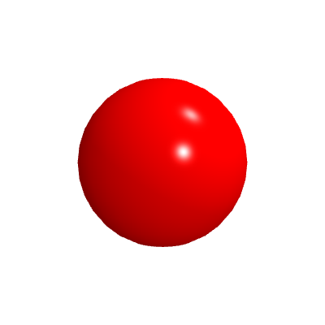
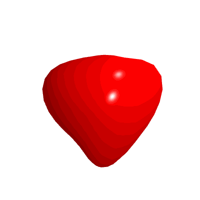
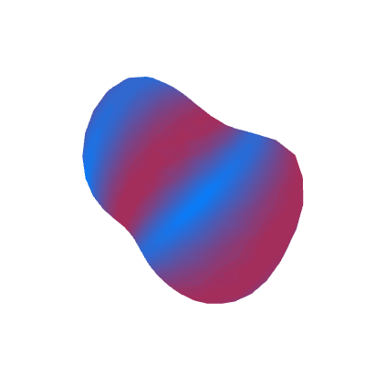

import EditableSketch from "../../../components/EditableSketch/index.astro";
import Callout from "../../../components/Callout/index.astro";
import AnnotatedCode from "../../../components/AnnotatedCode/index.astro";
import { Image } from "astro:assets";
import uv from "../images/webgl/uv_example.png";

现代计算机配备了一种称为图形处理器（Graphics Processing Unit，GPU）的专用硬件。着色器是在 GPU 上运行的特殊程序，可以实现许多令人惊叹的效果。着色器利用 GPU 同时并行处理大量像素，因此速度很快，尤其适合计算机图形学中的某些任务，例如生成噪声、应用模糊等滤镜，或为多边形着色。

着色器编程起初可能令人望而生畏，因为它需要一种不同于 p5.js 二维绘图的思考方式。本教程将介绍着色器编程的基础知识，并为你推荐更多学习资源。


## 准备工作

在浏览器中对 GPU 进行编程需要使用名为 [WebGL](https://developer.mozilla.org/en-US/docs/Web/API/WebGL_API) 的 API。p5.js 非常适合用来编写着色器，因为它处理了繁琐的 WebGL 样板设置工作，让你可以专注于着色器代码本身。开始使用着色器前，我们需要先将 p5.js 画布设置为 WebGL 模式。为此，请把 `WEBGL` 常量作为第三个参数传给 `createCanvas()`。

```javascript
...

function setup() {
  createCanvas(200, 200, WEBGL);
}

...
```

一个着色器程序由两部分组成：**顶点着色器**（vertex shader）和**片元着色器**（fragment shader）。顶点着色器会针对几何体中的每个顶点运行一次，决定该顶点绘制在屏幕上的位置。片元着色器会针对几何体中的每个像素运行一次，决定该像素的颜色。

<table>

<tr>

<td>



</td>

<td>



</td>

<td>



</td>

</tr>

<tr>

<td>

*原始形状*

</td>

<td>

*自定义顶点着色器可以调整形状中顶点的位置*

</td>

<td>

*自定义片元着色器可以调整形状内部的颜色*

</td>

</tr>

</table>

{/* 贡献者注：图片和 GIF 由 https://editor.p5js.org/davepagurek/sketches/gs-DbLzqV 生成 */}

这两种着色器分别存放在不同的文件中，并通过 `loadShader()` 函数加载到 p5.js 中。着色器加载完成后，就可以在 `setup()` 或 `draw()` 中使用。下面的示例展示了如何在 p5.js 中设置一个基本的着色器：

```javascript
let myShader;
async function setup() {
  // 加载每个着色器文件
  // （别担心，稍后我们还会回到这些文件！）
  myShader = await loadShader('shader.vert', 'shader.frag');
  // 必须使用 WEBGL 模式创建画布
  createCanvas(windowWidth, windowHeight, WEBGL);
}
function draw() {
  // shader() 设置当前使用的着色器，
  // 它将应用于接下来绘制的内容
  shader(myShader);
  // 将着色器应用于一个
  // 覆盖整个画布的矩形
  plane(width, height);
}
```

还有一个名为 `createShader()` 的函数，可用于直接使用草图中定义的字符串来加载着色器。


## 编写着色器

现在，我们来看看 `loadShader()` 所引用的顶点着色器文件和片元着色器文件中需要包含哪些内容。


### 着色语言（GLSL）

着色器文件使用图形库着色语言（Graphics Library Shading Language，GLSL，基于 OpenGL 2.0 和 GLSL ES 1.00）编写，它的语法和结构与我们熟悉的语言很不一样。GLSL 的语法类似 C 语言，因此包含一些 JavaScript 中没有的概念。

首先，着色语言对类型的要求严格得多。创建每个变量时，都必须标明它所存储的数据类型。下面列出了一些常见类型：

```glsl
vec2(x,y)     // 由两个浮点数组成的向量
vec3(x,y,z)   // 由三个浮点数组成的向量
              // （也可以表示为 r,g,b）
vec4(x,y,z,w) // 由四个浮点数组成的向量
              // （也可以表示为 r,g,b,a）
float         // 带小数点的数
int           // 不带小数点的整数
sampler2D     // 对纹理的引用
mat2          // 2x2 矩阵
mat3          // 3x3 矩阵
mat4          // 4x4 矩阵
bool          // true 或 false
```

总的来说，着色语言比 JavaScript 严格得多。少写一个分号就会直接报错。浮点数和整数等不同数值类型不能混用。如果一个 `float` 没有以小数形式书写，GLSL 也会报错，因此你会经常写出 `0.0` 或 `1.0` 这样的数值。

以下是 GLSL 中的一些不同之处：

<table class="full-width">

<tr>

<td>

</td>

<th>

JavaScript

</th>

<th>

GLSL

</th>

</tr>

<tr>

<td>

所有变量都需要声明类型。

</td>

<td>

```javascript
let a = 1;
let b = 0.5;
```

</td>

<td>

```glsl
int a = 1;
float b = 0.5;
```

</td>

</tr>

<tr>

<td>

函数必须声明参数类型和返回值类型。

</td>

<td>

```javascript
function isBetween(val, start, end) {
  return val >= start && val <= end;
}
```

</td>

<td>

```glsl
bool isBetween(float val, float start, float end) {
  return val >= start && val <= end;
}
```

</td>

</tr>

<tr>

<td>

整数和浮点数之间需要自行转换。

</td>

<td>

```javascript
let a = 1;
let b = 0.5;
let c = b + 2;
let d = a + b;
```

</td>

<td>

```glsl
int a = 1;
float b = 0.5;
float c = b + 2.0;
float d = float(a) + b;
```

</td>

</tr>

<tr>

<td>

GLSL 中，循环必须以常量为终止边界。如果希望根据条件提前结束循环，可以使用 `break` 跳出循环。

</td>

<td>

```javascript
let maxVal = 10;
if (something) {
  maxVal = 20;
}
for (let i = 0; i < maxVal; i++) {
  // 执行某些操作
}
```

</td>

<td>

```glsl
int maxVal = 10;
if (something) {
  maxVal = 20;
}
for (int i = 0; i < 20; i++) {
  if (i == maxVal) {
    break;
  }
  // 执行某些操作
}
```

</td>

</tr>

</table>

尽管限制很多，但在某些方面，GLSL 用起来反而更方便！使用向量时，GLSL 提供了许多实用的简写方式：

<table class="full-width">

<tr>

<td>

对于一个 `vec4`，你可以像访问颜色或坐标一样访问其中的数据。两种写法完全等价，因此可以选择让代码更易读的那一种。

</td>

<td>

```glsl
// 每一对写法都等价：
myVec.x
myVec.r

myVec.y
myVec.g

myVec.z
myVec.b

myVec.w
myVec.a
```

</td>

</tr>

<tr>

<td>

如果要创建一个所有分量都相同的向量，不必重复写出相同的值，只写一次即可。

</td>

<td>

```glsl
// 以下两种写法等价
myVec = vec3(0.5, 0.5, 0.5);
myVec = vec3(0.5);
```

</td>

</tr>

<tr>

<td>

你可以通过一种称为“分量重排”（swizzling）的方式从较大的向量中取得较小的向量：在 `.` 后按照新向量所需的顺序连接多个分量名。

</td>

<td>

```glsl
vec4 bigVec = vec4(1.0, 2.0, 3.0, 4.0);
// 等价于 vec2(bigVec.z, bigVec.y)
vec2 smallVec = bigVec.zy;
```

</td>

</tr>

</table>


### 顶点着色器

下面是一个简单的顶点着色器，它会应用 p5.js 提供的变换和相机透视：

<AnnotatedCode lang="glsl" code={({ begin, end }) =>
`
  ${begin('precision')}
  precision highp float;
  ${end('precision')}
  ${begin('attributes')}
  attribute vec3 aPosition;
  ${end('attributes')}
  ${begin('uniforms')}
  // 正在绘制的对象的变换
  uniform mat4 uModelViewMatrix;
  // 将三维坐标转换为
  // 二维屏幕坐标
  uniform mat4 uProjectionMatrix;
  ${end('uniforms')}
  ${begin('main')}
  void main() {
    // 应用相机变换
    vec4 viewModelPosition =
      uModelViewMatrix * vec4(aPosition, 1.0);
    // 告诉 WebGL 顶点应放在哪里
    gl_Position =
      uProjectionMatrix * viewModelPosition;
  }
  ${end('main')}
`}>
  <Fragment slot="precision">
   着色器首先用一行 `precision` 语句声明浮点数精度。精度可以是 `lowp`、`mediump` 或 `highp`。从最高精度开始是个不错的选择，可以确保着色器在任何设备上的显示效果都一致。在台式机和笔记本电脑上，无论你写什么，GPU 很可能都会使用最高精度。在手机上，使用较低精度可能更快，但也可能让着色器呈现出不同的效果。
  </Fragment>
  <Fragment slot="attributes">
    着色器的 *attribute 变量* 包含每个顶点各不相同的值，p5.js 使用它们来传递每个顶点的位置等信息。这个着色器中的 attribute 变量是 `vec3`，表示它包含 x、y 和 z 三个值。attribute 是一种特殊的变量类型，只在顶点着色器中使用，通常由 p5.js 提供。当你使用 `rect()` 或 `vertex()` 等 p5.js 方法时，p5.js 会自动把顶点信息传给着色器。
  </Fragment>
  <Fragment slot="uniforms">
    着色器的 *uniform 变量* 是在绘制整个形状期间保持不变的值。这个着色器中的每一个 uniform 恰好都是 `mat4`，这种类型常用于表示平移、缩放和旋转等变换。将一个点乘以 `mat4`，就会对该点应用这个矩阵所表示的变换。这里的 uniform 由 p5.js 自动提供，但稍后我们也会学习如何提供自己的自定义 uniform。请注意，矩阵乘法的顺序很重要。大多数情况下，应先写矩阵，再写与它相乘的值。
  </Fragment>
  <Fragment slot="main">
    所有顶点着色器都需要一个 `main()` 函数，我们在其中通过给 `gl_Position` 赋值来确定顶点的位置。这个值位于*裁剪空间*（clip space）中，从一侧移动到另一侧时，x、y 和 z 的取值范围都是 -1 到 1。利用 p5.js 的相机设置，将三维点乘以 `uProjectionMatrix` 就能为我们完成这种转换。在此之前，这个着色器还会乘以 `uModelViewMatrix`，应用绘制形状前设置的所有累积变换。
  </Fragment>
</AnnotatedCode>

如果现在还没有完全理解，也不用担心。顶点着色器扮演着重要角色，但它往往只是负责确保我们在片元着色器中创建的内容能够正确显示在几何体上。在许多项目中，你可能会反复使用相同的顶点着色器。下面是一个可供使用的标准顶点着色器，它还会处理每个顶点的颜色和纹理坐标等信息。

```glsl
precision highp float;
attribute vec3 aPosition;
attribute vec2 aTexCoord;
attribute vec4 aVertexColor;
uniform mat4 uModelViewMatrix;
uniform mat4 uProjectionMatrix;
varying vec2 vTexCoord;
varying vec4 vVertexColor;
void main() {
  // 应用相机变换
  vec4 viewModelPosition = uModelViewMatrix * vec4(aPosition, 1.0);
  // 告诉 WebGL 顶点应放在哪里
  gl_Position = uProjectionMatrix * viewModelPosition;
  // 将数据传递给片元着色器
  vTexCoord = aTexCoord;
  vVertexColor = aVertexColor;
}
```

### 片元着色器

片元着色器负责着色器的颜色输出，我们大部分的着色器编程工作都将在这里完成。下面是一个非常简单的片元着色器，它只会显示红色：

<AnnotatedCode lang="glsl" code={({ begin, end }) =>
`
  ${begin('precision')}
  precision highp float;
  ${end('precision')}
  ${begin('main')}
  void main() {
    vec4 myColor = vec4(1.0, 0.0, 0.0, 1.0);
    gl_FragColor = myColor;
  }
  ${end('main')}
`}>
<Fragment slot="precision">
  片元着色器同样以浮点数精度声明开头，其精度应与顶点着色器保持一致。
</Fragment>
<Fragment slot="main">

与顶点着色器类似，片元着色器也需要一个 `main()` 函数；但我们不会设置 `gl_Position`，而是要给 GLSL 定义的特殊变量 `gl_FragColor` 赋予一种颜色。

变量 `myColor` 被定义为 `vec4`，也就是说它存储四个值。因为这里处理的是颜色，所以这四个值分别代表红、绿、蓝和 Alpha（不透明度）。着色器不像 p5.js 草图那样默认使用 0–255 的颜色值，而是使用 0.0 到 1.0 之间的值。

</Fragment>
</AnnotatedCode>

现在我们已经有了一个顶点着色器和一个片元着色器，可以分别将它们保存到单独的文件（`shader.vert` 和 `shader.frag`）中，然后使用 `loadShader()` 加载到草图里。


## Uniform：从草图向着色器传递数据

像这样的简单着色器本身就很实用，但有时还需要把变量从 p5.js 草图传递给着色器。这时就要用到 uniform。uniform 是一种可以从草图传递给着色器的变量，使我们能够通过 JavaScript 更充分地控制着色器。

uniform 在文件顶部、`main()` 外部定义。你可以在顶点着色器和片元着色器中访问它们。在下面的示例中，p5.js 方法 `millis()` 返回的值会传给 uniform 变量 `time`，从而在顶点着色器中产生运动。

<EditableSketch code={`
  let myShader;

  // 以字符串形式保存的顶点着色器源代码
  let vert = \`
  precision highp float;

  attribute vec3 aPosition;

  // 正在绘制的对象的变换
  uniform mat4 uModelViewMatrix;

  // 将三维坐标转换为二维屏幕坐标
  uniform mat4 uProjectionMatrix;

  // 以毫秒为单位表示时间的自定义 uniform
  uniform float time;

  void main() {
    // 应用相机变换
    vec4 viewModelPosition = uModelViewMatrix * vec4(aPosition, 1.0);

    // 使用时间调整顶点的位置
    viewModelPosition.x += 10.0 * sin(time * 0.01 + viewModelPosition.y * 0.1);

    // 告诉 WebGL 顶点应放在哪里
    gl_Position = uProjectionMatrix * viewModelPosition;
  }
  \`;

  let frag = \`
  precision highp float;

  void main() {
    vec4 myColor = vec4(1.0, 0.0, 0.0, 1.0);
    gl_FragColor = myColor;
  }
  \`

  function setup() {
    createCanvas(200, 200, WEBGL);
    myShader = createShader(vert, frag);
  }

  function draw() {
    background(255);
    noStroke();

    // 使用自定义着色器
    shader(myShader);

    // 将 p5 中的时间传给着色器
    myShader.setUniform('time', millis());

    // 使用着色器绘制形状
    circle(0, 0, 100);
  }
`} />

同样，我们也可以通过 uniform 向片元着色器传递数据。在下面的示例中，我们创建了一个颜色 uniform `myColor`，以便通过草图中的 JavaScript 代码改变颜色。请记住，在着色器中，颜色通道的取值范围是 0–1，而不是 0–255。


<EditableSketch code={`
  let myShader;

  // 以字符串形式保存的顶点着色器源代码
  let vert = \`
  precision highp float;

  attribute vec3 aPosition;

  // 正在绘制的对象的变换
  uniform mat4 uModelViewMatrix;

  // 将三维坐标转换为二维屏幕坐标
  uniform mat4 uProjectionMatrix;

  void main() {
    // 应用相机变换
    vec4 viewModelPosition = uModelViewMatrix * vec4(aPosition, 1.0);

    // 告诉 WebGL 顶点应放在哪里
    gl_Position = uProjectionMatrix * viewModelPosition;
  }
  \`;

  let frag = \`
  precision highp float;

  // 用于控制颜色的自定义 uniform
  uniform vec4 myColor;

  void main() {
    gl_FragColor = myColor;
  }
  \`

  function setup() {
    createCanvas(200, 200, WEBGL);
    myShader = createShader(vert, frag);
  }

  function draw() {
    background(255);
    noStroke();

    // 使用自定义着色器
    shader(myShader);

    // 使用鼠标的 x 位置作为红色通道、
    // y 位置作为绿色通道来创建颜色，并将它传给着色器
    myShader.setUniform('myColor', [
      map(mouseX, 0, width, 0, 1, true), // 红色
      map(mouseY, 0, width, 0, 1, true), // 绿色
      0, // 蓝色
      1 // Alpha（不透明度）
    ]);

    // 使用着色器绘制形状
    circle(0, 0, 100);
  }
`} />

你可以在 [p5.js WebGL 模式架构](https://github.com/processing/p5.js/blob/main/contributor_docs/webgl_mode_architecture.md)文档中查看 p5.js 为你提供的完整 uniform 列表。


## Varying：从顶点着色器向片元着色器传递数据

*Varying* 变量在顶点着色器和片元着色器之间共享数据，使我们能够在片元着色器中使用位置或其他几何数据。

例如，你可能希望在片元着色器中使用形状的纹理坐标。纹理坐标以 `vec2` 的形式表示，每个坐标值都在 0 到 1 之间。它最初由 p5.js 通过 `attribute` 传入，而 attribute 只能在顶点着色器中访问。下面看看标准顶点着色器如何将纹理坐标传递给片元着色器：

<AnnotatedCode lang="glsl" code={({ begin, end }) =>
`precision highp float;

  attribute vec3 aPosition;
  ${begin('texcoord')}
  attribute vec2 aTexCoord;
  ${end('texcoord')}
  uniform mat4 uModelViewMatrix;
  uniform mat4 uProjectionMatrix;
  ${begin('varying')}
  varying vec2 vTexCoord;
  ${end('varying')}
  void main() {
    // 应用相机变换
    vec4 viewModelPosition = uModelViewMatrix * vec4(aPosition, 1.0);
    // 告诉 WebGL 顶点应放在哪里
    gl_Position = uProjectionMatrix * viewModelPosition;
  ${begin('assign')}
    vTexCoord = aTexCoord;
  ${end('assign')}
  }
`}>
  <Fragment slot="texcoord">
    纹理坐标最初以名为 `aTexCoord` 的 `attribute` 形式传入。p5.js 会自动填入这个值。
  </Fragment>
  <Fragment slot="varying">
    我们在这里声明一个 `varying` 变量。在顶点着色器中声明的任何 varying，都可以在片元着色器中再次声明，并在那里访问顶点着色器赋给它的值。
  </Fragment>
  <Fragment slot="assign">
    把 *attribute* 的值赋给 *varying* 变量，就是将数据复制到片元着色器能够读取的位置。
  </Fragment>
</AnnotatedCode>

由于我们在顶点着色器中定义了名为 `vTexCoord` 的 `varying`，现在也可以在片元着色器中使用它。下面这个简单的片元着色器会把 x 值映射到红色通道，把 y 值映射到绿色通道。请注意，虽然 `vTexCoord` 在顶点着色器中是*逐顶点*定义的，但它在片元着色器中则是*逐像素*定义的。为了得到每个像素的值，WebGL 会在每个面上的各顶点值之间进行平滑插值。

<AnnotatedCode lang="glsl" code={({ begin, end }) =>
`
  ${begin('shader')}
  precision highp float;
  varying vec2 vTexCoord;
  void main() {
    // 将坐标赋给着色器的颜色输出
    gl_FragColor = vec4(vTexCoord.x, vTexCoord.y, 1.0, 1.0);
  }
  ${end('shader')}
`}>
  <Fragment slot="shader">

    在 `plane(width, height)` 上使用这个着色器的结果：

    <Image alt="一个矩形渐变：左上角为黑色，右上角为品红色，右下角为白色，左下角为青色。" width="100" src={uv} />

  </Fragment>
</AnnotatedCode>


## 滤镜着色器

在 p5.js 中，滤镜会读取画布上的所有像素，并将它们替换成别的内容。p5.js 内置了许多滤镜，例如反转画布颜色或对画布内容应用模糊效果。你也可以通过编写片元着色器来创建自己的滤镜。

滤镜着色器只需要片元着色器。顶点着色器主要负责确定形状的位置，而滤镜始终应用于整个画布，因此 p5.js 会为你提供默认的顶点着色器。此时不使用 `loadShader`，而是使用 `createFilterShader(src)`，并以字符串形式传入着色器源代码。

滤镜着色器中有许多可供使用的 `uniform`，你可以在 [`createFilterShader` 文档](https://p5js.org/reference/p5/createFilterShader)中阅读它们的完整说明。刚开始时，主要需要了解以下两个：

- `uniform sampler2D tex0` 是一个包含画布内容的纹理。
- `varying vec2 vTexCoord` 包含当前像素在画布上的坐标，取值范围为 0 到 1。

把两者结合起来，`texture2D(tex0, vTexCoord)` 会返回画布上当前像素的颜色，随后你可以修改该颜色。在这个示例中，我们用蓝色通道替换红色和绿色通道，从而创建一个自定义黑白滤镜：

<EditableSketch code={`
  let video;
  let bw;

  let bwSrc = \`
  precision highp float;

  uniform sampler2D tex0;
  varying vec2 vTexCoord;

  void main() {
    // 获取当前像素的原始颜色
    vec4 color = texture2D(tex0, vTexCoord);

    // 用蓝色通道替换所有通道，使其变为黑白
    color.r = color.b;
    color.g = color.b;

    // 设置新的颜色
    gl_FragColor = color;
  }
  \`;

  function setup() {
    createCanvas(200, 200, WEBGL);
    video = createVideo(
      'https://upload.wikimedia.org/wikipedia/commons/d/d2/DiagonalCrosswalkYongeDundas.webm'
    );
    video.volume(0);
    video.hide();
    video.loop();

    bw = createFilterShader(bwSrc);

    describe('一段城市人行横道的黑白视频');
  }

  function draw() {
    background(255);
    push();
    imageMode(CENTER);
    image(video, 0, 0, width, height, 0, 0, video.width, video.height, COVER);
    pop();
    filter(bw);
  }
`} />

你还可以尝试修改 `texture2D` 的*输入*，而不是修改它的输出。调整所使用的纹理坐标可以让画面相对原图发生偏移；如果每个像素的偏移量不同，还能产生扭曲效果：

<EditableSketch code={`
  let video;
  let warp;

  let warpSrc = \`
  precision highp float;

  uniform sampler2D tex0;
  varying vec2 vTexCoord;

  void main() {
    // 偏移输入坐标
    vec2 warpedCoord = vTexCoord;
    warpedCoord.x += 0.05 * sin(vTexCoord.y * 10.0);
    warpedCoord.y += 0.05 * sin(vTexCoord.x * 10.0);

    // 查询扭曲后的坐标并设置新颜色
    gl_FragColor = texture2D(tex0, warpedCoord);
  }
  \`;

  function setup() {
    createCanvas(200, 200, WEBGL);
    video = createVideo(
      'https://upload.wikimedia.org/wikipedia/commons/d/d2/DiagonalCrosswalkYongeDundas.webm'
    );
    video.volume(0);
    video.hide();
    video.loop();

    warp = createFilterShader(warpSrc);

    describe('一段发生扭曲的城市人行横道视频');
  }

  function draw() {
    background(255);
    push();
    imageMode(CENTER);
    image(video, 0, 0, width, height, 0, 0, video.width, video.height, COVER);
    pop();
    filter(warp);
  }
`} />

## 总结

掌握这些知识后，你就可以创建一些基本的着色器了。不过，着色器编程的世界远不止于此，许多相关主题也超出了本教程的范围。在 p5.js 中，着色器是一种强大的工具，可用于创作视觉画面和效果，以及能够映射到三维几何体上的纹理。

想继续学习更多着色器知识吗？不妨看看以下网站！

- [The Book of Shaders](https://thebookofshaders.com/)：Patricio Gonzalez Vivo 和 Jen Lowe 编写的着色器指南。
- [p5.js shaders](https://itp-xstory.github.io/p5js-shaders/#/)：Casey Conchinha 和 Louise Lessél 编写的着色器指南。
- [Shadertoy](https://www.shadertoy.com/)：一个庞大的在线着色器作品库，其中的着色器通过浏览器编辑器编写。
- [p5js Shader Examples](https://github.com/aferriss/p5jsShaderExamples)：Adam Ferriss 整理的资源合集。
- [OpenGL ES 2.0 规范](https://registry.khronos.org/OpenGL/specs/es/2.0/es_cm_spec_2.0.pdf)：非常技术性的 GLSL 规范。
- [WebGL 快速参考卡](https://www.khronos.org/files/webgl/webgl-reference-card-1_0.pdf)：另一份略显艰深的技术参考资料，但其中包含许多有关 GLSL 函数的干货。
- [Shaderific GLSL ES 参考](https://shaderific.com/glsl.html)：一份相对精简的 GLSL 内置函数和数据类型参考。


## 术语表

#### 着色器（Shader）

一种特殊的显卡程序，能够高效生成各种视觉效果和滤镜。


#### GLSL

图形库着色语言（Graphics Library Shader Language，GLSL）是一种用于编写着色器的编程语言。


#### Uniform

从草图传递给着色器的变量。


#### Varying

从顶点着色器传递给片元着色器的变量。


#### 向量（Vector，`vec2` / `vec3` / `vec4`）

一种存储一组数字的数据类型，最常见的是存储两个、三个或四个数字，用来表示颜色、位置等。


#### 浮点数（Float）

一种数据类型，用于存储可含小数部分的数值。


#### 整数（Int）

一种数据类型，用于存储不含小数部分的数值。


#### 采样器（Sampler）

一种表示传入着色器的纹理的数据类型，在 GLSL 中通常写作 `sampler2D`。


#### Attribute

一种在 p5.js 草图中生成并提供给顶点着色器的 GLSL 变量。在大多数情况下，这些变量由 p5.js 提供。


#### 纹理（Texture）

传入着色器程序的图像，可以使用 `texture2D()` 函数进行采样。


#### 类型（Type）

描述一段数据格式的标签，例如整数、浮点数或向量等。


#### 顶点着色器（Vertex Shader）

着色器程序中负责确定几何体在三维空间中位置的部分。


#### 片元着色器（Fragment Shader）

着色器程序中负责每个输出像素的颜色和外观的部分。
