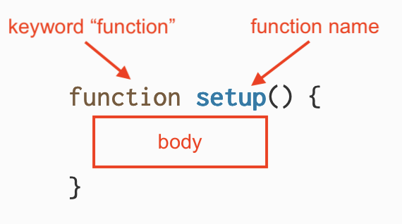
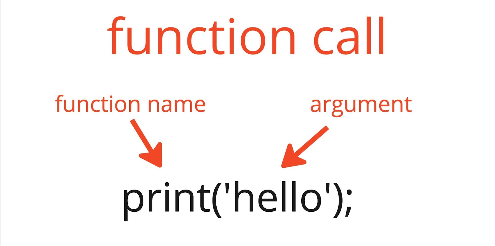
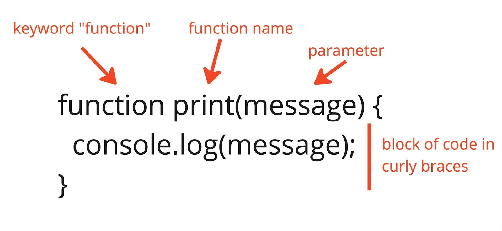
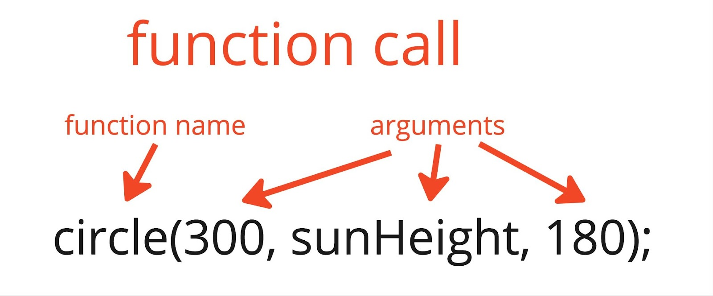
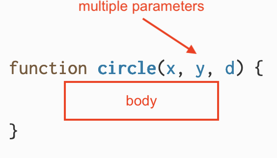
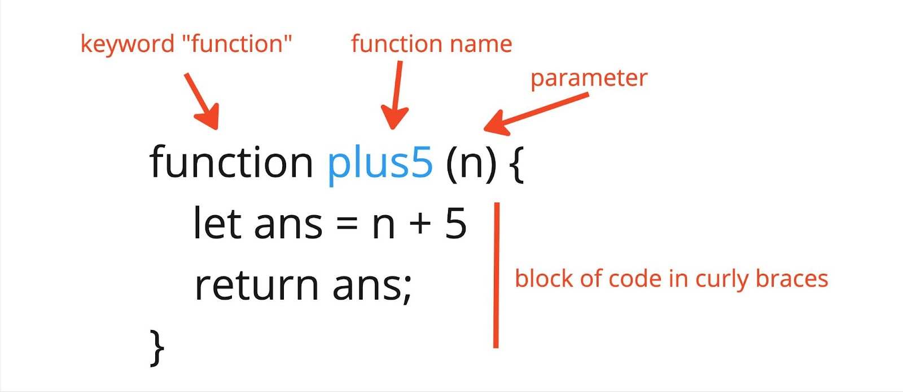

import Callout from "../../../components/Callout/index.astro";

在本教程中，你将基于上一个教程 - [条件语句与交互性](/tutorials/conditionals-and-interactivity) - 中的[日出动画](https://editor.p5js.org/gbenedis@gmail.com/sketches/9lz2aqfTO)，重新构建一个使用自定义函数来帮助你组织代码的版本。这是你在本教程结束时将要创建的草图（sketches）。


你将学习函数以及如何使用它们来组织和改进你的代码。你将学习这些基本编程概念：

- p5.js 库中内置的函数
- 如何创建自定义函数并使用它们轻松组织和重用代码
- 实际参数、形式参数和返回值

## 前置要求

- [操作指南：设置环境](/tutorials/setting-up-your-environment)
- [入门教程](/tutorials/get-started)
- [变量和变化教程](/tutorials/variables-and-change)
- [条件语句与交互性教程](/tutorials/conditionals-and-interactivity)
- [调试入门指南](/tutorials/field-guide-to-debugging)

在开始之前，你应该能够：

- 在画布上添加和自定义形状及文本
- 使用 `mouseX`、`mouseY` 和 `mouseIsPressed` 添加简单的交互性
- 声明、初始化、使用和更新自定义变量
- 将线性和随机运动纳入 p5.js 项目
- 使用条件语句控制程序流程
- 注释代码并处理错误信息

有条理地组织代码是创建更复杂、更让人兴奋的程序的关键技能。它可以使你的代码对其他人来说更具可读性，让他们能够理解你的代码，并使协作变得更容易。它还允许你理解自己的代码并扩展想法，甚至有助于调试。函数是一种能够使你的代码变得更有条理、可重用和可访问的强大方法。

## 什么是函数？

*函数*是分配给特定函数名的代码块，用于完成定义的任务。大多数 p5.js 草图至少包含两个*函数声明*，`setup()` 和 `draw()`。*函数声明*用于在使用函数之前定义它们。以下是 p5.js 中函数声明的语法：



关键字 `function` 让 p5.js 知道当前正在声明的是一个函数。函数的名称定义了它将被如何调用。在这个例子中，函数的名称是 `setup`。函数名的后面跟着一对括号 `()`。函数的**主体**是花括号 `{}` 中的代码块，其中的内容在函数被调用时会被运行。在 p5.js 中，`setup()` 是一个特殊的内置函数，会在按下播放按钮时自动运行。

```js
// 你在草图的开始处定义 setup() 函数。
// 它为你创建一个可以绘图的画布！
function setup() {
  createCanvas(400, 400);
}
```

当一个函数被使用时，我们说该函数在程序中被**调用**。`setup()` 函数在草图开始时被*调用*一次，这意味着 `setup()` 主体中的代码块在程序开始时运行一次。类似地，`draw()` 是 p5.js 库中内置的另一个函数，在每份草图中都有声明。当调用 `draw()` 时，它会反复运行其主体中的代码块。它一遍又一遍地运行，直到你的程序停止。

访问 p5.js 参考页面的 [`draw()`](/reference/p5/draw) 和 [`setup()`](/reference/p5/setup) 以了解更多信息。

## 定义自定义函数

我们还可以创建自己的函数来将代码分组。在上一个教程[条件语句与交互性](/tutorials/conditionals-and-interactivity)中，你创建了一个[日出动画](https://editor.p5js.org/gbenedis@gmail.com/sketches/9lz2aqfTO)，其中 `draw()` 中的代码包含用注释标记的天空、太阳和山脉部分。你可以声明自定义函数，为它起一个特定的名字并将相关的代码组合在一起。

### 步骤 1：用注释规划你的函数

- 复制你的日出动画，或[这个示例](https://editor.p5js.org/gbenedis@gmail.com/sketches/9lz2aqfTO)，并将其命名为“Organized Sunset Animation”。

- 在定义自定义函数之前，让我们先从如何重新组织[日出动画](https://editor.p5js.org/gbenedis@gmail.com/sketches/9lz2aqfTO)中的一些代码的大纲开始：

  ```js
  function setup() {
    createCanvas(600, 400);
  }

  function draw() {
    // 用于天空的函数;
    // 用于太阳的函数;
    // 用于山脉的函数;

    // 用于更新变量的函数
  }
  ```

我们可以看到有 4 个不同的相关代码组，我们可以将它们转换为自定义函数：绘制天空的代码、绘制太阳的代码、绘制山脉的代码以及更新变量的代码。

现在你可以为上述注释中所描述的草图中的代码部分创建 4 个不同的自定义函数。自定义函数在 `setup()` 和 `draw()` 之外定义，通常在代码的底部。

访问 p5.js 参考页面的 [`function`](/reference/p5/function) 以了解更多信息。

### 步骤 2：创建并调用关于天空的自定义函数

- 定义一个名为 `sky()` 的函数。此函数将在草图中渲染天空的颜色。

  ```js
  // 绘制天空的函数
  function sky() {
    background(redVal, greenVal, 0);
  }
  ```

- 在草图中使用 `sky()`，我们可以在 `draw()` 中使用以下语法进行**函数调用**：

  ```js
  function draw() {
    // 调用天空函数
    sky();
    // 用于太阳的函数;
    // 用于山脉的函数;
    // 用于更新变量的函数
  }
  ```

你的代码应该如下所示：

```js
// 用于颜色变化的变量
let redVal = 0;
let greenVal = 0;

// 用于太阳初始位置的变量
let sunHeight = 600; // 位置在地平线以下

function setup() {
  createCanvas(600, 400);
  noStroke(); // 移除形状轮廓
}

function draw() {
  // 调用天空函数
  sky();
  // 用于太阳的函数;
  // 用于山脉的函数;
  // 用于更新变量的函数
}

// 绘制天空的函数
function sky() {
  background(redVal, greenVal, 0);
}
```

在 `draw()` 中调用了 `sky()`，会在 `draw()` 运行时，运行`sky()` 函数体中的代码，并将天空的颜色变化添加到画布上。**函数调用**由函数名后跟一对圆括号 `()`组成。

### 步骤 3：创建并调用关于太阳的自定义函数

将绘制太阳的代码移动到函数中，并在 draw 中调用该函数。

- 在你为 `sky()` 定义的函数之后声明一个名为 `sun()` 的函数，并在花括号中包含绘制太阳的代码。
  - 在 `function sky()` 结束后添加以下代码行：

    ```js
    // 绘制太阳的函数
    function sun() {
      // 绘制太阳
      fill(255, 135, 5, 60);
      circle(300, sunHeight, 180);
      fill(255, 100, 0, 100);
      circle(300, sunHeight, 140);
    }
    ```

- 在 `draw()` 中通过以下*函数调用*替换绘制太阳的代码行：

  ```js
  // 调用太阳函数
  sun();
  ```

你的代码应该如下所示：

```js
// 用于天空颜色变化的变量
let redVal = 0;
let greenVal = 0;

// 用于太阳位置的变量
let sunHeight = 600; // 地平线以下的点

function setup() {
  createCanvas(600, 400);
  noStroke(); // 移除形状轮廓
}

function draw() {
  // 调用天空函数
  sky();
  // 调用太阳函数
  sun();
  // 用于山脉的函数;
  // 用于更新变量的函数
}

// 绘制天空的函数
function sky() {
  background(redVal, greenVal, 0);
}

// 绘制太阳的函数
function sun() {
  fill(255, 135, 5, 60);
  circle(300, sunHeight, 180);
  fill(255, 100, 0, 100);
  circle(300, sunHeight, 140);
}
```

在这一步中，你声明了一个名为 `sun()` 的新函数，它使用圆圈绘制太阳。`draw()` 函数调用了 `sun()`，而 `sun()` 又调用了 `fill()` 和 `circle()`。`fill()` 和 `circle()` 也是 p5.js 库中内置的函数，不需要由程序员声明。

你声明的自定义函数通过简单的代码块创建形状、颜色和动画。这就是计算的力量：你从简单的基础开始构建，进而创造出复杂的草图。你已经使用了许多 p5.js 中的内置函数来制作动画和交互艺术。现在你有了创建自己的函数并扩展 p5.js 库的能力。通过定义你自己的函数，你可以创建很多东西！

你可以通过访问[参考页面](https://p5js.org/reference/)了解更多关于所有可用内置函数的信息。所有后跟括号 `()` 的条目都是函数！

### 步骤 4：创建并调用山脉的自定义函数

将绘制山脉的代码移动到函数中：

- 声明一个名为 `mountains()` 的函数，并在花括号中包含绘制山脉的代码。
  - 在 `function sun()` 之后将以下行添加到你的草图中：

    ```js
    // 绘制山脉的函数
    function mountains() {
      fill(110, 50, 18);
      triangle(200,400,520,253,800,400);
      fill(150, 75, 0);
      triangle(-100, 400, 150, 200, 400, 400);
      fill(150, 100, 0);
      triangle(200, 400, 450, 250, 800, 400);
      fill(100,50,12);
      triangle(-100,400,150,200,0,400);
      fill(120,80,50);
      triangle(200,400,450,250,300,400);
    }
    ```

- 从 `draw()` 中删除绘制山脉的代码行，并用 mountains() 函数调用替换它们：

  ```js
  // 调用山脉函数
  mountains();
  ```

你的代码应该如下所示：

```js
// 用于天空颜色变化的变量
let redVal = 0;
let greenVal = 0;

// 用于太阳位置的变量
let sunHeight = 600; // 地平线以下的点

function setup() {
  createCanvas(600, 400);
  noStroke(); // 移除形状轮廓
}

function draw() {
  // 调用天空函数
  sky();
  // 调用太阳函数
  sun();
  // 调用山脉函数
  mountains();
}

// 绘制天空的函数
function sky() {
  background(redVal, greenVal, 0);
}

// 绘制太阳的函数
function sun() {
  fill(255, 135, 5, 60);
  circle(300, sunHeight, 180);
  fill(255, 100, 0, 100);
  circle(300, sunHeight, 140);
}

// 绘制山脉的函数
function mountains() {
  fill(110, 50, 18);
  triangle(200,400,520,253,800,400);
  fill(150, 75, 0);
  triangle(-100, 400, 150, 200, 400, 400);
  fill(150, 100, 0);
  triangle(200, 400, 450, 250, 800, 400);
  fill(100,50,12);
  triangle(-100,400,150,200,0,400);
  fill(120,80,50);
  triangle(200,400,450,250,300,400);
}
```

`mountains()` 函数调用 `fill()` 和 `triangle()` 函数来创建山脉，并将 `x, y` 和 `size` 的参数传递给它们以进行自定义。请注意函数如何帮助组织代码并使其易于阅读！

<Callout>

- 定义一个新函数来绘制你风景中的其他对象。

- 定义一个更新你的变量的新函数。

[这是一个示例。](https://editor.p5js.org/Msqcoding/sketches/i2rLEvKct)

</Callout>


## 使用参数自定义函数

你的函数 `sky()`、`sun()` 和 `mountains()` 在它们的函数声明中都有空的括号，并且在函数调用中也是如此。其他函数，如 `print()` 和 `circle()`，在调用它们时需要在括号内放置值。**调用**函数时括号内的值称为**实参**（实际参数）。**实参**以某种方式自定义函数。



在上面的代码片段中，`print()` 函数在调用时被传递了一个实参。实参是字符串 `'hello'`。`print()` 函数在控制台中显示括号中放置的值。我们可以想象 `print` 的函数声明看起来像这样：



在**函数声明**中，括号内列出的变量称为**形参**（形式参数）。形参充当占位符，在函数调用中被实参的值替换。

在上面的示例中，`print('hello')` 是一个函数调用，它运行其函数声明主体中的代码。值 `'hello'` 作为实参传递到函数调用中。实参替换函数声明中的 `message` 形参。代码块运行，将 `message` 的每个实例替换为 `'hello'`，并在控制台中打印 `'hello'`。



`circle()` 的函数调用需要 3 个参数：一个用于 x 坐标，一个用于 y 坐标，一个用于圆的直径（`d`）。

我们可以想象 p5.js 库中的函数声明看起来像这样：



`circle()` 的函数声明在括号中有 3 个形参，用逗号分隔：`x`、`y` 和 `d`。实参被分配给它们特定对应的形参。在这种情况下，`x` 被赋值为 300，`y` 被赋值为 `sunHeight` 的当前值，`d` 被赋值为 180。函数主体包含在画布上创建圆的代码，它使用 `x` 和 `y` 来确定圆的位置，使用 `d` 来确定其直径。

当你定义自己的函数时，你可以在函数声明的括号中放置形参。这样，你可以在函数调用中传入实参来自定义运行它。确保你传递给函数调用的实参数量与其声明中的形参数量相匹配！探索这个在画布上使用多次调用 `butterfly()` 函数绘制的[蝴蝶示例](https://editor.p5js.org/Msqcoding/sketches/SgRfbWeWN)。

需要一个或多个参数的函数需要正确数量的实参来匹配其声明中的形参数量，才能成功运行。当一个函数没有接收到足够的实参时，缺少的参数会被赋值为 `undefined`，这可能导致错误并产生奇怪的结果。在[调试入门指南](/tutorials/field-guide-to-debugging)中查看示例 2 和示例 7，了解在函数调用中使用错误数量的参数时可能遇到的错误示例。

让我们通过在我们的日出动画中添加一棵树来看看这是如何工作的。


### 步骤 5：添加带参数的自定义函数

首先定义一个 `tree()` 函数，它有空的括号。你可以用一个矩形和三角形画一棵简单的树。

- 在 `draw()` 之外将 `tree()` 函数声明添加到你的草图中：

  ```js
  // 绘制树木的函数
  function tree() {
    // 绘制一棵树
    fill(80,30,20);
    rect(200,320,20,60);
    fill(20,130,5);
    triangle(180,320,210,240,240,320)
  }
  ```

- 在 `draw()` 中的风景或山脉函数之后增加 `tree()` 的函数调用：

  ```js
  // 调用树木函数
  tree();
  ```


使用函数绘制一棵树可以提高代码的组织性。这个函数的真正力量来自于它能够轻松地使用不同的位置和大小绘制多棵树。我们可以向 `tree()` 函数声明添加参数，这样我们可以使用不同的参数灵活配置并多次调用它。

把这个函数想象成一个饼干模具或模板会更容易理解。例如，你可以创建一棵新树，它类似于你上面创建的那棵，但每次调用函数时位置和大小都不同。要做到这一点，你需要在函数声明中包含参数，以便自定义每一棵树。

- 重写你的 `tree()` 函数声明以包含 3 个参数：`x`、`y` 和 `size`。然后这些参数作为占位符在 `rect()` 和 `triangle()` 函数中使用。

  ```js
  // 绘制树木的函数，带有不同的 x、y 和大小参数
  function tree(x,y,size) {
    // 绘制一棵树
    fill(80,30,20);
    rect(x-size,y,size*2,size*6);
    fill(20,130,5);
    triangle(x-size*3,y,x,y-size*8,x+size*3,y)
  }
  ```

- 在你的 `draw()` 函数中使用参数绘制两棵树。

  ```js
  // 绘制两棵树
  tree(150, 320, 10)
  tree(210, 320, 10)
  ```

你的代码应该如下所示：

```js
// 用于天空颜色变化的变量
let redVal = 0;
let greenVal = 0;

// 用于太阳位置的变量
let sunHeight = 600;

function setup() {
  createCanvas(600, 400);
  noStroke(); // 移除形状轮廓
}

function draw() {
  // 调用天空函数
  sky();

  // 调用太阳函数
  sun();

  // 调用山脉函数
  mountains();
}

// 绘制天空的函数
function sky() {
  background(redVal, greenVal, 0);
}

// 绘制太阳的函数
function sun() {
  fill(255, 135, 5, 60);
  circle(300, sunHeight, 180);
  fill(255, 100, 0, 100);
  circle(300, sunHeight, 140);
}

// 绘制山脉的函数
function mountains() {
  fill(110, 50, 18);
  triangle(200,400,520,253,800,400);
  fill(150, 75, 0);
  triangle(-100, 400, 150, 200, 400, 400);
  fill(150, 100, 0);
  triangle(200, 400, 450, 250, 800, 400);
  fill(100,50,12);
  triangle(-100,400,150,200,0,400);
  fill(120,80,50);
  triangle(200,400,450,250,300,400);
}

// 绘制树木的函数，带有不同的 x、y 和大小参数
function tree(x,y,size) {
  fill(80,30,20);
  rect(x-size,y,size*2,size*6);
  fill(20,130,5);
  triangle(x-size*3,y,x,y-size*8,x+size*3,y)
}
```

用于自定义每棵树的参数是 `x`、`y` 和 `size`。这些参数分别指定树的 x 坐标、y 坐标和大小。为了保持树的相对形状相同，`rect()` 和 `triangle()` 函数使用带有参数和[算术运算符](https://developer.mozilla.org/en-US/docs/Web/JavaScript/Reference/Operators#arithmetic_operators)的**数值表达式**。**数值表达式**，如 `x - size`，是能够计算得出数值的数学表达式。当数字和[算术运算符](https://developer.mozilla.org/en-US/docs/Web/JavaScript/Reference/Operators#arithmetic_operators)用作函数调用中的参数时，计算的结果将作为参数传递。

例如，让我们跟踪或*追踪*函数调用 `tree(210, 320, 10)`，看看参数如何找到它们进入 `rect()` 函数的方法：

`tree(210, 320, 10)` 在 `draw()` 中被调用，其中 `x = 210`，`y = 320`，`size = 10`

- 以下是 `rect()` 函数调用中使用的公式：

  ```js
  rect(x-size,y,size*2,size*6);
  ```

- 当 `x = 210`，`y = 320`，`size = 10` 时，将代入以下值：

  ```js
  rect(210-10,320,10*2,10*6);
  ```

- 计算得到的结果作为参数用于在画布上绘制形状：

  ```js
  rect(200,320,20,60);
  ```

类似地：

- 以下是 `triangle()` 函数调用中使用的公式：

  ```js
  triangle(x-size*3, y, x, y-size*8, x+size*3,y)
  ```

- 当 `x = 210`，`y = 320`，`size = 10` 时，将代入以下值：

  ```js
  triangle(210-10*3, 320, 210, 210 + 10*3, 320);
  ```

- 计算得到的实参结果值用于在画布上绘制形状：

  ```js
  triangle(180, 320, 240, 320);
  ```

当参数改变时，树会被修改，可以位于不同的位置，并且具有不同的大小。

- 探索[这个示例](https://editor.p5js.org/Msqcoding/sketches/u0VkgENt4)，看看特定参数的变化如何自定义画布上绘制的树。

你可以通过反复试验来确定 `rect()` 和 `triangle()` 函数中参数的具体表达式。从静态树开始并创建树中你想要改变的数值表达式是一个很好的起点！你甚至可以尝试添加更改填充和描边颜色的参数。

- 探索[这个示例](https://editor.p5js.org/Msqcoding/sketches/yqFWzi_5X)，了解如何使用数值表达式添加 x 和 y 参数的分步说明，并使用 `mouseX` 和 `mouseY` 测试你的函数。

有关包含参数的自定义函数的更多示例，请访问 p5.js 参考页面的 [`function`](/reference/p5/function)。

通过使用同一个 `tree()` 函数创建两棵树，你可以减少草图中的代码量。这使得你的代码更短，因此更容易阅读。代码更少，也更容易调试。

<Callout>

- 使用错误数量的参数调用 `tree()`。会发生什么？
- 尝试修改你现有的一个函数以使用参数。
- 声明另一个使用参数在风景中绘制不同对象的函数——例如，`seagull(x, y, size)` 或 `cloud(x, y, size)`。

这是一个[示例](https://editor.p5js.org/Msqcoding/sketches/l4Mq4a4HG)。

</Callout>


## 返回值

诸如 `random()` 之类的函数会生成或**返回**可以在代码其他地方使用的值。以下是一个函数示例，它将参数加 5 并返回结果：



与其他函数声明类似，关键字 `function` 后跟函数名和一对括号。这个函数有一个参数，括号内的 `n`。函数主体包括一个数值表达式和**返回语句**。关键字 `return` 告诉函数完成执行代码块并提供结果作为输出值。

让我们通过一个快速[示例](https://editor.p5js.org/mcintyre/sketches/BvgR93OHj)来尝试这一点，该示例将 `plus5()` 返回的值显示为文本。打开一个新的 p5.js 项目并将以下代码添加到 `script.js` 文件中：

```js
function setup() {
  createCanvas(400, 400);
}

function draw() {
  background(220);

  // 通过调用 plus5() 进行计算。
  let number = plus5(10);

  // 设置文本样式。
  textAlign(CENTER);
  textSize(30);

  // 显示文本。
  text(`10 + 5 = ${number}`, width / 2, height / 2);
}

function plus5(n) {
  let ans = n + 5;
  return ans;
}
```

在这个草图中，你定义了一个变量 `number` 并将其赋值为 `plus5(10)` 函数调用返回的值。实参的值 10 替换函数声明中的形参 `n` 。在 `plus5()` 的第一行中，10+5 或 15 的结果存储在变量 `ans` 中。然后该函数返回值 15。最后，你通过使用[字符串插值](https://developer.mozilla.org/en-US/docs/Web/JavaScript/Reference/Template_literals#string_interpolation)将 `number` 传递给 `text()` 函数来显示答案。

这是另一个[示例](https://editor.p5js.org/mcintyre/sketches/sWNY9_UO_)，它使用 `plus5()` 来绘制流星路径：

```js
function setup() {
  createCanvas(400, 400);
}
function draw() {
  // 用透明度绘制黑色天空。
  background(0, 50);

  // 设置描边。
  stroke(255);
  strokeWeight(5);

  // 每帧增加 x 坐标。
  let x = frameCount;

  // 调用 plus5() 计算 y 坐标。
  let y = plus5(x);

  // 绘制流星。
  point(x, y);
}

function plus5(n) {
  let ans = n + 5;
  return ans;
}
```

在 `draw()` 中，你将 `frameCount` 中的值存储在变量 `x` 中，然后将其传递给 `plus5()`。你还将 `plus5(x)` 返回的值存储在变量 `y` 中。最后，你使用 `x` 和 `y` 作为 `point()` 函数调用中的参数，显示流星从左向右移动。x 和 y（在 draw 函数中）中存储的值随着草图运行而增加。请注意流星沿着对角线移动。

访问 p5.js 参考页面的 [返回](/reference/p5/return) 以了解更多信息。

### 步骤 6：在其他自定义函数中使用自定义函数

为了练习这个想法，让我们回到我们的日出动画草图，并定义一个与 `plus5()` 非常相似的函数，称为 `treeLine()`。它对其参数进行更多的数学运算并返回结果：

```js
// 沿直线计算树木 y 坐标的函数
function treeLine(x) {
  let y = -0.7 * x + 450;
  return y;
}
```

语句 `let y = -0.7 * x + 450;` 将参数 `x` 乘以 `-0.7`，然后将 `450` 加到该值，将值存储在变量 `y` 中，并返回 `y`。

- 声明 `treeline()` 函数和一个 `trees()` 函数来绘制几棵树。将 `treeLine()` 函数声明添加到你的草图中：
  - 将以下行添加到 `draw()` 下面的代码中：

    ```js
    function treeLine(x) {
      let y = -0.7 * x + 450;
      return y;
    }
    ```

- 将 `trees()` 函数声明添加到你的草图中。
  - 将以下行添加到 `draw()` 下面的代码中：

    ```js
    function trees() {
      // 第一棵树
      let x = 150;
      let y = treeLine(x);
      tree(x, y, 5);

      // 第二棵树
      x = 180;
      y = treeLine(x);
      tree(x, y, 5);

      // 第三棵树
      x = 210;
      y = treeLine(x);
      tree(x, y, 5);
    }
    ```

- 将 `trees()` 函数调用添加到 `draw()`。
  - 在 `draw()` 内添加以下行：

    ```js
    // 调用 trees() 函数
    trees();
    ```

你的代码应该如下所示：

```js
// 用于天空颜色变化的变量
let redVal = 0;
let greenVal = 0;

// 用于太阳位置的变量
let sunHeight = 600;

function setup() {
  createCanvas(600, 400);
  noStroke(); // 移除形状轮廓
}

function draw() {
  // 调用天空函数
  sky();

  // 调用太阳函数
  sun();

  // 调用山脉函数
  mountains();

  // 绘制两棵树
  trees()
}

// 绘制天空的函数
function sky() {
  background(redVal, greenVal, 0);
}

// 绘制太阳的函数
function sun() {
  fill(255, 135, 5, 60);
  circle(300, sunHeight, 180);
  fill(255, 100, 0, 100);
  circle(300, sunHeight, 140);
}

// 绘制山脉的函数
function mountains() {
  fill(110, 50, 18);
  triangle(200,400,520,253,800,400);
  fill(150, 75, 0);
  triangle(-100, 400, 150, 200, 400, 400);
  fill(150, 100, 0);
  triangle(200, 400, 450, 250, 800, 400);
  fill(100,50,12);
  triangle(-100,400,150,200,0,400);
  fill(120,80,50);
  triangle(200,400,450,250,300,400);
}

// 绘制树木的函数，带有不同的 x、y 和大小参数
function tree(x,y,size) {
  fill(80,30,20);
  rect(x-size,y,size*2,size*6);
  fill(20,130,5);
  triangle(x-size*3,y,x,y-size*8,x+size*3,y)
}

// 计算沿直线分布的树木的y坐标位置的函数
function treeLine(x) {
  let y = -0.7 * x + 450;
  return y;
}

// 绘制多棵树的函数
// 使用 treeLine() 和 tree() 函数
function trees() {
  // 第一棵树
  let x = 150;
  let y = treeLine(x);
  tree(x, y, 5);

  // 第二棵树
  x = 180;
  y = treeLine(x);
  tree(x, y, 5);

  // 第三棵树
  x = 210;
  y = treeLine(x);
  tree(x, y, 5);
}
```

在上面的步骤中，你定义了一个名为 `treeLine()` 的函数，它计算了一条线，使你可以沿着该线绘制多棵树。你还定义了一个函数，该函数使用你之前创建的 `tree()` 函数和 `treeLine()` 函数，在你的风景中沿着一条线绘制了多棵树。

[这是你的项目可能看起来的样子的示例！](https://editor.p5js.org/gbenedis@gmail.com/sketches/lamalgcPZ)

<Callout>
- 修改 `treeLine()` 中的表达式 `let y = -0.7 * x + 450;` ，使用 `-0.7` 和 `450` 以外的值。
- 一次更改一个数字并观察结果。
</Callout>


## `keyPressed()` 函数

除了 `setup()` 和 `draw()` 等函数外，你还可以使用其他内置的 p5.js 函数向你的程序添加交互性。函数 `keyPressed()` 是可以在你的程序中定义的实用函数，它在用户按下键盘时被触发。


### 步骤 7：为你的动画添加交互性

在草图的底部定义函数 `keyPressed()`。

```js
function keyPressed() {
  redVal=0;
  greenVal = 0;
  sunHeight = 600;
}
```

`keyPressed()` 在按下键盘上的任何键时运行一次。在这里，我们使用它在按下键盘时将变量重置回它们的初始位置，本质上是让动画从头开始。

[示例草图链接](https://editor.p5js.org/gbenedis@gmail.com/sketches/lamalgcPZ)

`keyPressed()` 还可以访问用户按下的 `key` 变量，从而允许更多的用户交互。类似地，你可以在草图中定义一个函数 `mousePressed()`，每次用户单击鼠标时运行一次。

以下是一些你可以探索的示例：

- [`keyPressed()`](https://editor.p5js.org/Msqcoding/sketches/QEqQlTWpU)
- [`keyPressed()` 和 `key`](https://editor.p5js.org/Msqcoding/sketches/HkDcaRKk4)
- [`mousePressed()`](https://editor.p5js.org/Msqcoding/sketches/bz6vz74tJ)

有关 [`keyPressed()`](/reference/p5/keyPressed) 和 [`mousePressed()`](/reference/p5/mousePressed) 等函数的更多信息，请访问 [p5.js 参考的事件部分](/reference#Events)。

## 结论

像 `tree()` 这样的函数让你能够通过组合多个更简单的想法（绘制 [2D 形状](/reference#Shape)）的方式来表达一个复杂的想法（绘制一棵树）。能够创建一行树的函数 `trees()` 进一步扩展了这个想法。无论你是在绘制风景还是设计交互式灯光秀，函数都可以帮助你通过更简单的想法来逐步构建复杂的想法。这称为**抽象**。抽象允许你在更高的层面上关注，这样你就不会被所有细节分心。想象一下，如果你通过调用数百次 `triangle()` 和 `rect()` 来动画化一片魔法森林，你的代码会是什么样子……跟踪所有事情是很难的。函数允许你以一种优雅且有组织的方式创建例如处理形状的具体坐标等细节的抽象。随着你的草图变得更加复杂，你会发现创建正确的抽象使你更能轻松地关注大局。

<Callout>
声明一个 `butterfly()` 函数来显示蝴蝶 `🦋` 表情符号，并使该表情符号出现在随机位置或四处飞舞。在 `draw()` 中调用 `butterfly()` 函数以显示。

这里有一个[示例](https://editor.p5js.org/gbenedis@gmail.com/sketches/yGn00cD2Q)。

### 或者尝试这个辣味挑战！

创建一个全新的草图并动画化一个不同的风景。使用函数来规划和组织这个令人兴奋的项目。
</Callout>

## 下一步

- [循环重复](/tutorials/repeating-with-loops)

## 参考

- [表达式和运算符](https://developer.mozilla.org/en-US/docs/Web/JavaScript/Reference/Operators#arithmetic_operators)
- [字符串插值](https://developer.mozilla.org/en-US/docs/Web/JavaScript/Reference/Template_literals#string_interpolation)
