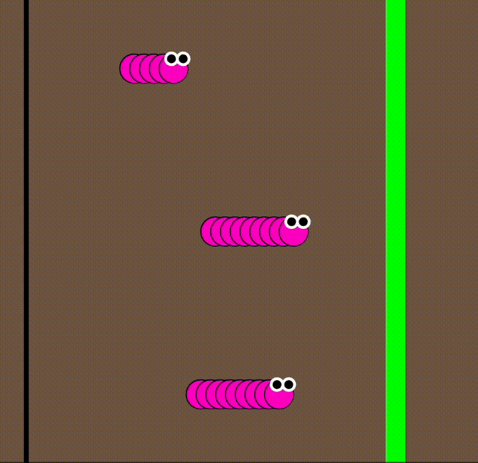

import EditableSketch from "../../../components/EditableSketch/index.astro";
import Callout from "../../../components/Callout/index.astro";
import AnnotatedLine from "../../../components/AnnotatedLine/index.astro";

## Introduction（介绍）

你是否想通过少量代码就绘制出许多形状，从而将你的项目提升到新的水平？想象绘制一排树、一叠书、彩虹的拱形，或者蜂巢的内部。为了创建由相同形状的多个版本组成的图形，我们不再只写单独的形状，而是进入循环和数组的奇妙世界。让我们学习如何用少量代码创建重复的图案吧！


绘制每个形状都写一行新代码将会非常繁琐。相反的，我们可以使用 *loops*（循环），它允许我们执行并重复代码块任意次数。在本教程中，我们使用循环和数组来创建。[a racing caterpillar sketch](https://editor.p5js.org/gbenedis@gmail.com/sketches/BrmtZ36ET).



一组毛毛虫将从起跑线开始比赛，第一个到达终点线的毛毛虫获胜。每次运行草图时，获胜的毛毛虫都会不同！

在本教程中，你将学会：

- 使用 *for 循环* 绘制和更新重复的任务和形状
- 使用自定义函数更新变量和程序状态，并在草图运行时进行修改
- 使用 [条件语句](/reference/p5/if) 和 `random()` 生成不同结果
- 使用鼠标触发和 [布尔变量](/reference/p5/Boolean) 运行和停止你的草图
- 将毛毛虫的位置存储在数组中

### 你将需要

- [p5.js Web 编辑器](https://editor.p5js.org/)
- 理解如何使用 x 和 y 坐标在 p5.js 中绘制基本图形和文本
  - 你可以参考我们之前的教程， [Get Started(入门指南)](/tutorials/zh-Hans/get-started)
- 理解变量和条件语句
  - 可以参考我们之前的教程， [Variables and Change(变量与变化)](/tutorials/zh-Hans/variables-and-change/) and [Conditionals and Interactivity(条件语句与交互)](/tutorials/zh-Hans/conditionals-and-interactivity)
- 理解自定义函数和参数
  - 可以参考我们之前的教程， [Organizing Code with Functions(使用函数组织代码)](/tutorials/zh-Hans/organizing-code-with-functions)


## 步骤 1 – 绘制赛道

- 在 [p5.js Web 编辑器](https://editor.p5js.org/) 中新建一个项目，给它起一个名称，例如 “Caterpillar Race(毛毛虫比赛)”，然后保存。
- 在 `setup(),` 中创建一个 500x500 像素的画布。
- 在 `setup()` 函数上方声明两个新的全局变量，分别用于定义起跑线和终点线的 x 坐标。我们将这两个变量命名为 startLine 和 finishLine。
  - 根据你希望放置的起点线和终点线的位置，为它们赋予 x 轴上的数值。在本示例中，我们将 startLine 设为 30，finishLine 设为 360。
- 在 `draw()` 函数中:
  - 设置背景颜色。例如，我们将其设置为棕色 `background(121, 96, 76)` ；
  - 绘制一个矩形，并将它的 x 坐标设为 `startLine`。将矩形的高度设为 `height` ，使其在画布中垂直铺满。
  - 在 `finishLine` 的位置再绘制一个矩形，并重复相同的步骤。
  - 给这两个矩形填充不同的颜色。
- 别忘记给你的草图命名并保存。

你的代码看起来可能会像下面这样:

```js
<EditableSketch code={`
// 设置用于绘制赛道的变量
let startLine = 30;
let finishLine = 400;
function setup() {
  // 创建 500x500 像素的画布
  createCanvas(500, 500); 
}

function draw() {
  // 设置背景颜色
  background(121, 96, 76);

  // 绘制起跑线和终点线
  noStroke();
  fill(0);
  rect(startLine, 0, 5, height);
  fill(0, 255, 0);
  rect(finishLine, 0, 20, height);
}
`} />
```

## 步骤 2 – 绘制毛毛虫身体的一节段并让它移动

接下来，我们将在画布上绘制毛毛虫的一个节段，并让它从起跑线移动到终点线。当到达终点时，它将停止前进。

- 声明一个新的全局变量 `circX` 并将它的值设为 `startLine`。
  - 这个变量将作为毛毛虫节段的 x 坐标。
- 声明一个新的全局变量`circY` 并将它的值设为 250 (也就是画布高度的一半)。
  - 这个变量将作为毛毛虫节段的 y 坐标。
- 在 `draw()` 函数中:
  - 使用 `circle()` 函数绘制毛毛虫的身体。 传入 `circX`, `circY`, 和 50 作为参数， 分别表示 x 坐标、y 坐标和直径： `circle(circX, circY, 50);`
  - 我们将圆形填充为白色，并设置一个细的黑色描边。
  - 在绘制圆形的语句下方, 使用 `circX += 20;` 来让 `circX` 的值增加20。
    - 这表示每次 `draw()` 函数运行时， `circX` 都会增加 20 个像素点。程序会在比上一次位置右移 20 个像素的地方绘制新的圆，从而形成毛毛虫前进的效果。
- 在 `draw()` 函数的末尾，添加如下的条件语句:

  ```js
  if (circX > finishLine) {
    noLoop();
  }
  ```

`noLoop()` 函数会阻止 `draw()` 函数再次运行。 `if` 语句会在圆形的x坐标超过 finishLine 的值时，通过调用 `noLoop()` 来停止 `draw()` 的执行。 你可以访问 p5.js 参考文档 了解更多关于 [`noLoop()`](/reference/p5/noLoop) 的信息。

在 `setup()` 函数中， 添加： `frameRate(3);`

- [frame rate(帧率)](/reference/p5/frameRate) 指的是 `draw() ` 函数在一秒钟内运行的次数。将帧率设置为较低的数值，可以让动画中的移动过程看起来更加明显、夸张，适合本示例中的动画效果。

你的完整代码应该类似下面这样：

```js
<EditableSketch code={`
// 设置用于绘制赛道的变量
let startLine = 30;
let finishLine = 400;

// 设置圆形起始位置的变量
let circX = startLine;

let circY = 250;

function setup() {
  createCanvas(500, 500); 

  // 设置较慢的帧率
  frameRate(3);
}

function draw() {
  // 绘制背景
  background(121, 96, 76);

  // 绘制起跑线和终点线
  noStroke();
  fill(0);
  rect(startLine, 0, 5, height);
  fill(0, 255, 0);
  rect(finishLine, 0, 20, height);

  // 绘制圆形
  fill(255);
  stroke(0);
  circle(circX, circY, 50);

  // 向右移动x坐标
  circX += 20;

  // 当x到达终点线时停止循环
  if (circX > finishLine) {
    noLoop();
  }
}
`} />
```

### [If-statements(If 语句)](/reference/p5/if)

if 语句（如上面示例中使用的那样）表示：只有当某个条件为真时，才会执行对应的一段代码。它的通常写法如下：

```js
if (<condition>) {
  <code>
}
```

条件写在 if 语句 后面的圆括号 () 中。花括号 { } 用来标记代码块的开始和结束。 在步骤 2 中, 条件 `circX > finishLine` 的作用是：当圆形的x坐标大于 `finishLine` 的值时，通过调用 `noLoop()` 来停止 `draw()` 函数的再次运行。

你可以访问 p5.js 参考文档中的 [if](/reference/p5/if) 页面了解更多内容。


## 步骤 3 – 绘制一条毛毛虫

我们将重复步骤 2 中的毛毛虫节段，来创建一排圆形，从而组成毛毛虫的身体。我们将使用一个 *for 循环*，来连续绘制多个圆形。


### 3.1 – 声明毛毛虫身体的属性

在 `setup()` 之上:

- 声明一个名为 `segments` 的新变量，并将其赋值为 6。
  - 这个变量用于定义组成毛毛虫身体的圆形数量。
- 声明一个名为 `spacing` 的变量，并将其赋值为 20。
  - 这个变量用于定义毛毛虫身体各个分段之间的像素间距。
- 声明一个名为 `segmentSize` 的新变量，并将其赋值为 50。
  - 这个变量用于定义圆形身体分段的直径。

### 3.2 – 使用 *for 循环* 构建毛毛虫的身体

在 `draw()` 中:

- 在绘制终点线的代码之后，声明一个新的局部变量 `x` ，用于定位所有身体分段： `let x = circX;`
-  使用 `for (let i = 0; i < segments; i += 1) { }` 添加一个 *for 循环*
  -  *for 循环* 会多次重复执行花括号 {} 内的代码。
  - 将绘制 `circle()` 的代码行移动到 *for 循环* 的花括号中。
- 在 for 循环后添加： `circX += spacing` 
  - 这会在每次 `draw()` 运行时，让毛毛虫的身体向右移动。

你的代码应该看起来像这样：

```js
<EditableSketch code={`
// 设置用于绘制赛道的变量
let startLine = 30;
let finishLine = 400;

// 为毛毛虫设置变量
let circX = startLine;
let circY = 250;
let spacing = 20;
let segments = 6;
let segmentSize = 50;

function setup() {
  createCanvas(500, 500);

  // 设置较慢的帧率 
  frameRate(3);
}

function draw() {
  // 绘制背景
  background(121, 96, 76);

  // 绘制起跑线和终点线
  noStroke();
  fill(0);
  rect(startLine, 0, 5, height);
  fill(0, 255, 0);
  rect(finishLine, 0, 20, height);

  // 用于定位身体分段的局部变量
  let x = circX;

  // 绘制多个圆形（毛毛虫的身体）
  for (let i = 0; i < segments; i += 1) {
    // 绘制圆形

    fill(255);
    stroke(0);
    circle(x, circY, segmentSize);
    x += spacing;
  }

  // 让毛毛虫向右移动
  circX += spacing;
  // 当x到达终点线时停止循环
  if (circX > finishLine) {
    noLoop();
  }
}
`} />
```


#### [For 循环](/reference/p5/for)

for 循环可以多次执行一段（或一个代码块）的代码。for 循环可以像下面这样写：

```js
for (let i = 0; i < number; i += 1) { 
  // 你希望执行 number 次的代码内容
}
```

在 for 循环的 `{}` 内，我们编写希望重复执行的代码。通过设置循环的条件，我们可以指定代码重复执行的次数。

一个 for 循环由圆括号 () 中的三个语句定义，每个语句之间用分号分隔。它们分别是：

<AnnotatedLine code={({ bottom }) => `for (${bottom('init', ' let i = 0; ')} ${bottom('cond', 'i < number;')} ${bottom('instr', '  i += 1  ')}) { }`}>
  <Fragment slot="init">Initialization</Fragment>
  <Fragment slot="cond">Condition</Fragment>
  <Fragment slot="instr">Instruction</Fragment>
</AnnotatedLine>

- **初始化**: 用一个数值来初始化迭代变量 `i` ，作为开始计数的起点。

  ```js
  let i = 0;
  ```

- **条件:** 用于保持循环继续运行的条件。只要改条件为 `true` ，loop 循环就会持续执行。 当该条件为 `false`，for 循环就会停止。

  ```js
  i < number;
  ```

- **指令:** 告诉程序在每次循环执行后，如何改变计数的数值。

  ```js
  i += 1;
  ```

第一个表达式 `let i = 0` 用于初始化（或启动）for 循环。

- i 是一个用于定义 for 循环初始状态的变量，也被称为 *索引（index）* 变量。通常，索引从 0 开始，并在每次循环中递增。这个变量名可以是你喜欢的任何名称。一般来说，常使用单个字母，例如 i、j、k，当然你也可以使用更具描述性的名称。 

第二个表达式 `i < number`, 是循环继续运行的条件。它是一个布尔表达式，可以返回 `true` 或 `false`。只要这个表达式是 `true`，for 循环就会继续运行，此时索引变量 (`i`) 会继续递增。
- `number` 可以是任何数值或存储数值的变量。计数时通常使用整数。
  - 例如: `i < 5;` 或 `i < segments;`
- 在这种情况下, `number` 决定了 for 循环运行的次数，因为初始值 `i` 从0开始。
- 在上面的毛毛虫示例中，我们将这个值赋给变量 `segments` ，它指定了构成毛毛虫身体的圆的数量。只要索引值没有达到 `segments` 中存储的数值，循环就会继续绘制圆。
  - 当绘制的圆的数量不再少于 `segments` 时，程序将退出 for 循环，并继续执行下一行代码。 

第三个表达式，`i += 1` 表示每次循环迭代结束时索引的变化。

- 一个 [**循环迭代**](https://developer.mozilla.org/en-US/docs/Web/JavaScript/Guide/Loops_and_iteration) 指的是循环运行一次。例如，如果一个 for 循环运行了 3 次，则它有 3 次迭代。
- 在这个例子中， `i` 变量每次 for 循环运行时都会加 1 。这意味着第一次运行 for 循环时，`i` 为 0。第二次运行循环时，`i` 为 1。第三次运行循环时，`i` 为 2，依此类推（直到达到值 `number`）。表达式 `i += 1` 也可以写成 `i++`。
总结如下: 

1. 当程序执行 for 循环时，首先在第一个表达式中声明循环索引变量。
2. 程序检查第二个表达式（布尔表达式）。如果该表达式为 `true` ，则执行花括号内的代码。
3. 循环结束时，迭代变量 `i` 的值会根据第三个表达式的定义进行更改。 
4. 循环重复此过程，直到第二个表达式中的条件为 `false`。当条件为 `false` 时，程序退出 for 循环并继续执行代码中的下一行。 

访问 [for 循环 参考](/reference/p5/for) 了解更多信息。


### 3.3 – 为毛毛虫添加更多细节

- 如果需要，你可以调节毛毛虫身体的 `fill()` 颜色。在本例中，我们将其设置为粉色： `fill(255, 0, 200);`
- 绘制毛毛虫的眼睛。眼睛的位置与绘制身体的最后一个圆的 x 和 y 坐标相同。这意味着它位于 for 循环绘制完所有圆之后，因此我们将在 for 循环之后， `noLoop()` 之前添加眼睛。这样可以确保眼睛绘制在毛毛虫身体最后一个圆的上方。
  - 在 `setup()` 上方声明一个新的全局变量 `eyeSize`，并将其值赋为 15。
  - 绘制两个圆。
    - 为它们填充黑色，并添加粗的白色描边。
  - 添加第一只眼睛并设置其坐标和大小： `circle(x, circY-eyeSize, eyeSize);`
    - 这会将眼睛放置在最后一个绘制的圆的顶部。
  - 添加第二只眼睛并设置其坐标和大小： `circle(x - eyeSize, circY-eyeSize, eyeSize);`
    - 我们将第二只眼睛的 x 坐标减去 `eyeSize`，这样两只眼睛就能并排显示，互不重叠。
- 完成毛毛虫的绘制后，将代码整理到一个名为 `drawCaterpillar()` 的自定义函数中。你可以随意修改毛毛虫的图形！
  - 将 `drawCaterpillar()` 函数定义在 `draw()` 之外。
  - 该函数应包含你用来绘制毛毛虫身体的圆的 for 循环，以及用于绘制毛毛虫眼睛的两个圆。
  - 请记住在 `draw()` 函数中调用它！在 `draw()` 函数中，在结束循环的 if-statement 之前，输入 `drawCaterpillar();`

以下是你的草图目前可能的样子：

```js
<EditableSketch code={`
// 设置用于绘制赛道的变量
let startLine = 30;
let finishLine = 400;

// 为毛毛虫设置变量
let circX = startLine;
let circY = 250;
let spacing = 20;
let segments = 6;
let segmentSize = 50;
let eyeSize = 15;

function setup() {
  createCanvas(500, 500);
  frameRate(3);
}

function draw() {
  // 绘制背景
  background(121, 96, 76);

  // 绘制起跑线和终点线
  noStroke();
  fill(0);
  rect(startLine, 0, 5, height);
  fill(0, 255, 0);
  rect(finishLine, 0, 20, height);
  drawCaterpillar();

  circX += spacing;
  // 当x到达终点线时停止循环 
  if (circX > finishLine) {
    noLoop();
  }
}

function drawCaterpillar() {
  // 创建一个循环，用圆形来组成身体 
  let x = circX;

  for (let i = 0; i < segments; i += 1) {
    fill(255, 0, 200);
    stroke(0);
    strokeWeight(1);
    circle(x, circY, segmentSize);

    x+=spacing;
  }
 
  // 绘制毛毛虫的眼睛
  fill(0);
  stroke(255);
  strokeWeight(3);
  circle(x, circY - eyeSize, eyeSize);
  circle(x - eyeSize, circY - eyeSize, eyeSize);
}
`} />
```

<Callout>
调整 `bodySize` 和 `eyeSize` 变量，尝试毛毛虫的不同的身体和眼睛大小。
</Callout>


## 步骤 4 – 泛化 `drawCaterpillar()` 函数

在草图首次运行时，我们希望每条毛毛虫都位于起始线上。这意味着我们需要为函数添加参数，以便我们可以通过修改它们来指定毛毛虫的位置。
- 转到 `drawCaterpillar()` 函数。
  - 在函数括号内添加 `x` 作为参数： `function drawCaterpillar(x) { ...}`
    - 注意，我们已经在 `drawCaterpillar()` 函数里将 `x` 声明为局部变量。我们可以移除该声明，并使用 `x` 参数代替。
  - 在函数括号内添加 `y` 作为第二个参数： `function drawCaterpillar(x,y) { ... }`
    - 在函数体中将 `circY` 替换为 `y` 。

你可以在之前的教程 [使用函数组织代码](/tutorials/zh-Hans/organizing-code-with-functions), 和 p5.js 的参考文档 [functions](/reference/p5/function) 中了解更多关于自定义函数、参数和实参的信息。

你的自定义函数现在应该类似于这样：

```js
function drawCaterpillar(x,y) {
  // 创建一个循环，用圆形来组成身体 
  for (let i = 0; i < segments; i += 1) {
    fill(255, 0, 200);
    stroke(0);
    strokeWeight(1);
    circle(x, y, 50);

    x += spacing;
  }
 
  // 绘制毛毛虫的眼睛
  fill(0);
  stroke(255);
  strokeWeight(3);
  circle(x, y - eyeSize, eyeSize);
  circle(x - eyeSize, y - eyeSize, eyeSize);
}
```

- 在 `draw()` 函数中，调用三次 `draw Caterpillar()` 来绘制三条毛毛虫。

你的 draw 函数应该如下所示：

```js
function draw() {
  // 绘制背景
  background(121, 96, 76);
  // 绘制起跑线和终点线
  noStroke();
  fill(0);
  rect(startLine, 0, 5, height);
  fill(0, 255, 0);
  rect(finishLine, 0, 20, height);

  // 绘制三条毛毛虫
  drawCaterpillar(circX,circY-150);
  drawCaterpillar(circX,circY);
  drawCaterpillar(circX,circY+150);

  circX += spacing;
  // 当x到达终点线时停止循环 
  if (circX > finishLine) {
    noLoop();
  }
}
```


## 步骤 5 – 创建一个 `drawCaterpillars()` 函数

现在屏幕上同时有三条毛毛虫在移动。我们可以使用循环来绘制这三条毛毛虫，而不是分别调用三次 `drawCaterpillar()` 函数。

- 在草图的 `setup()` 上方声明一个新的全局变量，用于储存你想要的毛毛虫数量： `let numCaterpillars = 3;`
- 在 `draw()` 函数外创建一个新的自定义函数，并将其命名为 `drawCaterpillars()`
  - 在 `drawCaterpillars()` 函数内创建一个新的 for 循环。
    - 在循环的第一个表达式中初始化循环变量，并将其初始值设为 0。
    - S在循环的第二个表达式中，讲条件设置为 `i < numCaterpillars` 。
    - 在循环的第三个表达式中递增循环变量的值。
  - 在 for 循环的括号内调用 `drawCaterpillar(circX, circY);` 。
- 在 `draw()` 函数中， 调用 `drawCaterpillars();`

你的 `draw()` 和 `drawCaterpillars()` 函数应该看起来如下：

```js
let numCaterpillars = 3;

// 变量声明和设置

function draw() {
  // 绘制背景
  background(121, 96, 76);
  // 绘制起跑线和终点线
  noStroke();
  fill(0);
  rect(startLine, 0, 5, height);
  fill(0, 255, 0);
  rect(finishLine, 0, 20, height);

  circX += spacing;

  // 在画布上绘制毛毛虫
  drawCaterpillars();

  // 当x到达终点线时停止循环
  if (circX > finishLine) {
    noLoop();
  }
}

function drawCaterpillars() {
  for (let i = 0; i < numCaterpillars; i += 1) {
    drawCaterpillar(circX,circY);
  }
}
```

程序应该可以运行，但这次你只会看到一条毛毛虫。这是因为三条毛毛虫被画在了一起。为了解决这个问题，下一步我们将调整每条毛毛虫的 y 坐标：

```js
<EditableSketch code={`
let numCaterpillars = 3;

// 设置用于绘制赛道的变量
let startLine = 30;
let finishLine = 400;

// 为毛毛虫设置变量
let circX = startLine;
let circY = 250;
let spacing = 20;
let segments = 6;
let segmentSize = 50;
let eyeSize = 15;

function setup() {
  createCanvas(500, 500);
  frameRate(3);
}

function draw() {
  // 绘制背景
  background(121, 96, 76);
  // 绘制起跑线和终点线
  noStroke();
  fill(0);
  rect(startLine, 0, 5, height);
  fill(0, 255, 0);
  rect(finishLine, 0, 20, height);

  circX += spacing;

  // 在画布上绘制毛毛虫
  drawCaterpillars();
  // 当x到达终点线时停止循环
  if (circX > finishLine) {
    noLoop();
  }
}

function drawCaterpillars() {
  for (let i = 0; i < numCaterpillars; i += 1) {
    drawCaterpillar(circX,circY);
  }
}

function drawCaterpillar(x,y) {
  // 创建一个循环，用圆形来组成身体
  for (let i = 0; i < segments; i += 1) {
    fill(255, 0, 200);
    stroke(0);
    strokeWeight(1);
    circle(x, y, 50);

    x += spacing;
  }
 
  // 绘制毛毛虫的眼睛
  fill(0);
  stroke(255);
  strokeWeight(3);
  circle(x, y - eyeSize, eyeSize);
  circle(x - eyeSize, y - eyeSize, eyeSize);
}
`} />
```


## 步骤 6 – 为比赛摆放毛毛虫

**回顾！** 在步骤 3 和 4 中，我们的草图中有两个自定义函数。

- `drawCaterpillar(x,y)` 使用参数 x 和 y 绘制一条毛毛虫。
- `drawCaterpillars()` 调用 `drawCaterpillar()` 函数并将其放在一个 for 循环中，以便我们可以绘制多条毛毛虫。

现在，每条毛毛虫的 x 和 y 坐标都相同。我们将调整 for 循环中的代码，以 y 坐标为参数设置毛毛虫之间的间距。

- 转到 `drawCaterpillars()` 函数的声明。
  - 在 *for 循环* 内部，添加一行新的代码： `let padding = height / numCaterpillars;`
    - 这行代码声明了一个名为 `padding` 的变量，用于定义每条毛毛虫之间的垂直距离。
    - 我们将画布中的 `height` 值除以草图中毛毛虫的数量，并将结果赋值给 `padding`。这样就将画布垂直分割成行（每条毛毛虫占一行）。每行的高度就是 `padding` 的值。
  - 初始化变了 `y` 并将其赋值为： `let y = (i + 0.5) * padding`，其中 `y` 决定了每条毛毛虫的 y 坐标。
    - 使用变了 `i` ，for 循环的每次迭代都会将一条毛毛虫放在它自己的行中。
    - 将 `i` 加上 0.5 可以使毛毛虫在该行居中。
- 与步骤 5 类似，将 `y` 作为参数添加到 `drawCaterpillar()` 函数调用的括号中。
  - 现在这行代码应该是： `drawCaterpillar(circX, y);`

总而言之，我们已经将 `x` 和 `y` 作为 `drawCaterpillar()` 函数内部使用的参数。在 `drawCaterpillars()` 函数中使用此函数诗，我们使用`circX` 和 `y` 作为参数。 

您可以在我们之前的教程 [使用函数组织代码](/tutorials/zh-Hans/organizing-code-with-functions) 中了解更多关于自定义函数、参数和实参的信息。

到目前为止，你的 `drawCaterpillars()` 函数应该如下所示：

```js
function drawCaterpillars() {
  for (let i = 0; i < numCaterpillars; i += 1) {
    let padding = height/numCaterpillars;
    let y = (i + 0.5) * padding;

    drawCaterpillar(circX, y, 6);
  }
}
```


### 使用 for 循环索引变量进行绘图

for 循环的索引变量 (`i`) 会在每次循环迭代时递增或递减。在本教程中， `i` 变量从 0 开始，每次 for 循环运行时递增 1。

- 第一次运行 for 循环时， `i` 是 0. 
- 第二次运行 for 循环时， `i` 是 1.
- 第三次运行循环时， `i` 是 2，依此类推。

我们可以在绘图中使用索引变量来进行加、减、乘、除运算，使得每次 for 循环迭代的结果都不同。

在本例中，我们使用 `i` 来计算每天毛毛虫之间的间距（见下表）：

- 第一次迭代时， `i` 为 0 ， `y` 为 `0.5 * padding`。第一条毛毛虫将绘制在该 y 值处。
- 在第二次迭代中， `i` 为 1 ， `y` 变为 `1.5 * padding`。第二条毛毛虫绘制在新的 y 值处。
- 在第三次迭代中， `i` 为 2 ， `y` 变为 `2.5 * padding`。第三条毛毛虫绘制在新的 y 值处。
<table>

<tr>

<th>

毛毛虫 (循环迭代)

</th>

<th>

`x`

</th>

<th>

`y`

</th>

</tr>

<tr>

<td>

First

</td>

<td>

0

</td>

<td>

`0.5 * padding`

</td>

</tr>

<tr>

<td>

Second

</td>

<td>

1

</td>

<td>

`1.5 * padding`

</td>

</tr>

<tr>

<td>

Third

</td>

<td>

2

</td>

<td>

`2.5 * padding`

</td>

</tr>

</table>

`drawCaterpillar()` 和 `drawCaterpillars()` 现在应该看起来像这样：

```js
// ... 变量声明、setup() 和 draw()

function drawCaterpillars() {
  for (let i = 0; i < numCaterpillars; i += 1) {
    // 每条毛虫之间留有空间。
    let padding = height / numCaterpillars;
    let y = (i + 0.5) * padding;

    // 绘制毛毛虫
    drawCaterpillar(circX, y);
  }
}

function drawCaterpillar(x, y) {
  // 创建一个循环，用圆形来组成身体
  for (let i = 0; i < segments; i += 1) {
    fill(255, 0, 200);
    stroke(0);
    strokeWeight(1);
    circle(x, y, 50);

    x+=spacing;
  }

  // 绘制毛毛虫的眼睛
  fill(0);
  stroke(255);
  strokeWeight(3);
  circle(x, y - eyeSize, eyeSize);
  circle(x - eyeSize, y - eyeSize, eyeSize);
}
```

整体效果如下：

```js
<EditableSketch code={`
let numCaterpillars = 3;

// 设置用于绘制赛道的变量
let startLine = 30;
let finishLine = 400;

// 为毛毛虫设置变量
let circX = startLine;
let circY = 250;
let spacing = 20;
let segments = 6;
let segmentSize = 50;
let eyeSize = 15;

function setup() {
  createCanvas(500, 500);
  frameRate(3);
}

function draw() {
  // 绘制背景
  background(121, 96, 76);
  // 绘制起跑线和终点线
  noStroke();
  fill(0);
  rect(startLine, 0, 5, height);
  fill(0, 255, 0);
  rect(finishLine, 0, 20, height);

  circX += spacing;

  // 在画布上绘制毛毛虫
  drawCaterpillars();
  // 当x到达终点线时停止循环
  if (circX > finishLine) {
    noLoop();
  }
}

function drawCaterpillars() {
  for (let i = 0; i < numCaterpillars; i += 1) {
    // 每条毛虫之间留有空间。
    let padding = height / numCaterpillars;
    let y = (i + 0.5) * padding;

    // 绘制毛毛虫
    drawCaterpillar(circX, y);
  }
}

function drawCaterpillar(x, y) {
  // 创建一个循环，用圆形来组成身体
  for (let i = 0; i < segments; i += 1) {
    fill(255, 0, 200);
    stroke(0);
    strokeWeight(1);
    circle(x, y, 50);

    x+=spacing;
  }

  // 绘制毛毛虫的眼睛
  fill(0);
  stroke(255);
  strokeWeight(3);
  circle(x, y - eyeSize, eyeSize);
  circle(x - eyeSize, y - eyeSize, eyeSize);
}
`} />
```

<Callout>
更改全局变量 `numCaterpillars` 的值，看看 `drawCaterpillars()` 中的 for 循环是如何在画布上垂直排列它们的。
</Callout>


## 步骤 7 – 创建一个数组来保存每只毛毛虫的位置

现在我们已经将毛毛虫垂直放置在画布上，接下来需要给每只毛毛虫分配一个唯一的 x 坐标。我们可以使用数组来实现这一点。该数组将包含每只毛毛虫的 x 坐标。然后，我们就可以让毛毛虫在屏幕上随机移动，从而实现一场比赛。


### 7.1 – 创建一个 [数组](https://developer.mozilla.org/en-US/docs/Web/JavaScript/Reference/Global_Objects/Array)

- 在 `numCaterpillars` 之后声明 `caterpillarEnds` 数组：`let caterpillarEnds = [];`
  - 该数组将保存每条毛毛虫最左侧线段的 x 坐标。


你将在下一个教程 [数据结构花园](/tutorials/data-structure-garden) 中学习更多关于数组的知识。 访问 MDN 的 [数组](https://developer.mozilla.org/en-US/docs/Web/JavaScript/Reference/Global_Objects/Array) 参考文档了解更多信息。

- 在 `setup()`函数中为每条毛毛虫添加 x 坐标，并将它们全部放置在起始线上。
  - 创建一个 for 循环，对每条毛毛虫重复执行一次：`for (let i=0; i < numCaterpillars; i++) { }`
  - 在花括号内，添加代码 `caterpillarEnds.push(startLine);`
    - 这会将值 `startLine` 添加到 `caterpillarEnds` 数组中，每条毛毛虫都在草图中绘制一次。
    - `.push()` 方法用于在数组末尾添加新值。

现在 `setup()` 应该如下所示:

```js
function setup() {
  createCanvas(500, 500);

  // 设置较慢的帧率
  frameRate(6);

  for (let i=0; i < numCaterpillars; i++) {
    // 将最后一个片段的位置添加到数组中
    caterpillarEnds.push(startLine);
  }
}
```

- 在 `drawCaterpillars()` 函数中，修改 `drawCaterpillar(circX,y)` 这行代码:
  - 现在我们将使用 `caterpillarEnds` 数组，而不是 `circX`。
  - 由于 for 循环中的索引 `i` 代表了 `caterpillarEnds` 数组中的正确索引位置，我们可以将 `circX` 改为 `caterpillarEnds[i]`: `drawCaterpillar(caterpillarEnds[i], y);`
- 从函数中移除 `circX` 。
  - 注意: `draw()` 函数末尾仍使用了 `circX` 。请先将其移除，稍后我们会再添加回去。

你的 `drawCaterpillars()` 函数应该如下所示：

```js
function drawCaterpillars() {
  for (let i = 0; i < numCaterpillars; i += 1) {  
    // 每条毛虫之间留有空间
    let padding = height / numCaterpillars;
    let y = (i + 0.5) * padding;

    // 使用数组绘制毛毛虫
    drawCaterpillar(caterpillarEnds[i], y);
  }
}
```


### 7.2 – 随机移动毛毛虫

- 在 `draw()` 函数之外创建一个新的自定义函数，将其命名为 `moveCaterpillars()`
- 定义一个新的 for 循环，循环次数与毛毛虫的数量相同： `for (let i = 0; i < numCaterpillars; i += 1) { }`
  - 这与 `drawCaterpillars()` 函数中使用的 for 循环语法相同，因为它允许你单独引用每只毛毛虫。
- 在循环内部，为 `move` 赋一个局部随机值： 

  ```js
  let move = random(5,30);
  ```

- 比赛开始后，每次运行 `draw()` 函数时，每条毛毛虫都会随机向右移动 5 到 30 像素。
- 你可以根据希望毛毛虫移动的范围修改  `random()` 函数中的值。访问 [p5.js 中关于 `random()` 函数的参考文档](/reference/p5/random) 了解更多信息。

你的函数可能如下所示：

```js
function moveCaterpillars() {
  for (let i = 0; i < numCaterpillars; i += 1) {
    // 给每只毛毛虫随机赋予一个速度
    let move = random(5, 30);
    caterpillarEnds[i] += move;
  }
}
```

综上所述，上述函数中的事件顺序如下：

- 每次循环迭代时，我们将 `move` 赋值为 5 到 30 之间的随机数。
  - 这意味着每条毛毛虫都会被分配一个不同的随机 `move` 值。
- 然后我们更新 `caterpillarEnds` 数组中第 `i` 个位置的值， `drawCaterpillar()` 函数就是用这个值来显示毛毛虫。


### 7.3 – 移动毛毛虫

- 最后，在调用 `drawCaterpillars()` 函数之前，先在 `draw()` 函数中调用 `moveCaterpillars()` 函数。

你的代码应该看起来像这样！

```js
<EditableSketch code={`
// 设置用于绘制赛道的变量
let startLine = 30;
let finishLine = 400;

// 为毛毛虫设置变量
let spacing = 20;
let segmentSize = 30;
let eyeSize = 15;

let segments = 6;

// 设置比赛的变量
let numCaterpillars = 3;
let caterpillarEnds = [];
function setup() {
  createCanvas(500, 500);
  frameRate(3);

  for (let i=0;i<numCaterpillars;i++) {
    caterpillarEnds.push(startLine)
  }
}

function draw() {
  // 绘制背景
  background(121, 96, 76);

  // 绘制起跑线和终点线
  noStroke();
  fill(0);
  rect(startLine, 0, 5, height);
  fill(0, 255, 0);
  rect(finishLine, 0, 20, height);
  
  // 改变毛毛虫的位置
  moveCaterpillars();

  // 画出毛毛虫的新位置
  drawCaterpillars();
}

function moveCaterpillars() {
  for (let i = 0; i < numCaterpillars; i += 1) {
    // 给每只毛毛虫随机赋予一个速度。
    let move = random(5, 30);

    // 更新毛毛虫的x坐标
    caterpillarEnds[i] += move;
  }
}

function drawCaterpillars() {
  for (let i = 0; i < numCaterpillars; i += 1) {
    // 给每条毛毛虫分配一个x坐标

    let padding = height / numCaterpillars;
    let y = (i + 0.5) * padding;
    drawCaterpillar(caterpillarEnds[i], y);
  }
}

function drawCaterpillar(x, y) {
  // 创建一个循环，用圆形来组成身体
  for (let i = 0; i < segments; i += 1) {
    fill(255, 0, 200);
    stroke(0);
    strokeWeight(1);
    circle(x, y, 50);
    x += spacing; // 为下一个圆，更新x的值
  }

  // 绘制毛毛虫的眼睛
  fill(0);
  stroke(255);
  strokeWeight(3);
  circle(x, y - eyeSize, eyeSize);
  circle(x - eyeSize, y - eyeSize, eyeSize);
}
`} />
```


## 步骤 8 – 让毛毛虫做出爬行的动作

为了模拟 ‘爬行’ 动作，我们将使用 `random()` 函数随机化每条毛毛虫的节段数量。回顾一下，全局变量 `segments` 决定了毛毛虫显示的节段数量。现在，我们将把它改为 `drawCaterpillar()` 函数中的一个参数。

- 转到 `drawCaterpillar()` 函数的定义。
  - 添加一个名为 `segments` 的新参数。现在它应该看起像这样： `function drawCaterpillar(x, y, segments) { ... }`
  - 你可以删除草图顶部的全局变量 `segments` 。
- 赚到 `drawCaterpillars()` 函数的定义。
  - 在调用 `drawCaterpillar()` 函数的括号中，添加第三个参数 `crawl` ： `drawCaterpillar(x, y, crawl);`
  - 在这行代码上方，通过输入 `let crawl = round(random(3, 6));` 为 `crawl` 变量赋一个新的随机值。
    - 这意味着在程序运行期间，它会持续绘制长度随机（3 到 6 个圆）的毛毛虫，并将它们从起点移动到终点。
    - 您可以根据希望毛毛虫爬行的长度来修改 `random()` 的值。
    - `crawl` 变量的随机值将填充 `drawCaterpillar()` 函数定义中的 `segments` 参数，该参数决定绘制的圆的数量。

你的函数应该如下所示：

```js
// ... 变量声明， setup(), draw(), moveCaterpillars() functions
function drawCaterpillars() {
  for (let i = 0; i < numCaterpillars; i += 1) {
    // 更新每条毛毛虫的 x 坐标
    let padding = height / numCaterpillars;
    let y = (i + 0.5) * padding;

    // 更新毛毛虫的长度  
    let crawl = round(random(3, 6));

    // 绘制毛毛虫
    drawCaterpillar(x, y, crawl);
  }
}

function drawCaterpillar(x, y, segments) {
  // 创建一个循环，用圆形来组成身体
  for (let i = 0; i < segments; i += 1) {
    fill(255, 0, 200);
    stroke(0);
    strokeWeight(1);
    circle(x, y, 50);
    x += spacing;
  }

  // 绘制毛毛虫的眼睛
  fill(0);
  stroke(255);
  strokeWeight(3);
  circle(x, y - eyeSize, eyeSize);
  circle(x - eyeSize, y - eyeSize, eyeSize);
}
```

## 步骤 9 – 使用鼠标触发开始比赛

- 声明一个名为 `isRacing` 的全局布尔变量，并将其值设置为 `false`: `let isRacing = false`;
  - 该变量将作为状态变量，存储毛毛虫是否正在比赛的信息，其值为布尔值 (`true` 或 `false`).
- 定义一个 `mousePressed()` 函数。
  - 在函数中，将 `isRacing` 布尔值设置为 `true` 。
- 该函数应如下所示：

  ```js
  // 当用户按下鼠标时，比赛开始。
  function mousePressed() {
    isRacing = true;
  }
  ```

- 在 `draw()` 函数中，在调用 `drawCaterpillars()` 函数之前添加一个新的 if 语句：`if (isRacing === true) { }`
- 将 `moveCaterpillars()` 函数移动到 if 语句中。
  - 这意味着毛毛虫只有在比赛开始后（鼠标按下后）才会开始移动。
- 你的代码应该如下所示：

```js
// ... 定义全局变量

let isRacing = false;

function setup() {
  createCanvas(500, 500);
  // 设置较慢的帧率
  frameRate(3);

  for (let i=0;i<numCaterpillars;i++) {
    caterpillarEnds.push(startLine)
  }
}

function draw() {
  // 绘制背景
  background(121, 96, 76);

  // 绘制起跑线和终点线
  noStroke();
  fill(0);
  rect(startLine, 0, 5, height);
  fill(0, 255, 0);
  rect(finishLine, 0, 20, height);

  // 如果比赛开始，移动毛毛虫
  if (isRacing === true) {
    moveCaterpillars();
  }

  drawCaterpillars();
}

// 当用户按下鼠标时，比赛开始
function mousePressed() {
  isRacing = true;
}

// ... moveCaterpillars, drawCaterpillars, 和 drawCaterpillar 函数。
```


## 步骤 10 – 添加比赛开始和结束的提示信息

做得好！现在在你的草图中，你已经创建了一个点击鼠标即可开始的毛毛虫比赛。

现在，我们只需要在画布上添加程序使用说明。我们还会在比赛结束时添加一条消息，宣布获胜的毛毛虫，获胜的毛毛虫是随机的。我们会重新添加 noLoop() 函数，以便在宣布获胜者后立即结束比赛。


### 10.1 – 编写开始的信息

- 在 `draw()` 函数之后创建一个新的自定义函数，并将其命名为 `writeStart()`。
- 在函数内部添加： `text(“ 🏁 Click to start!”, width / 2, height / 2);`
  - 这会将启动信息写入画布并居中显示。
  - 在 `text()` 命令上方添加 `textAlign(CENTER);` ，使文本居中对齐。
  - 为文本添加样式。在本例中，我们将文本设置为白色，无描边，字号为 24。
- 你的 `writeStart()` 函数应该如下所示:

  ```js
  function writeStart() {
   
    // 设置文本样式
    textSize(24);
    textAlign(CENTER);
    fill(255);
    noStroke();
   
    // 显示信息
    text("🏁 Click to start!", width / 2, height / 2);
  }
  ```

- 返回到 `draw()` 函数并添加一个 else 语句： `else {}`
  - 如果比赛尚未开始，则执行此 else 语句。
- 在此 else 语句代码块内调用 `writeStart()` 函数。

 `draw()` 函数应该如下所示：

```js
function draw() {
  // 绘制背景
  background(121, 96, 76);

  // 绘制起跑线和终点线
  noStroke();
  fill(0);
  rect(startLine, 0, 5, height);
  fill(0, 255, 0);
  rect(finishLine, 0, 20, height);

  // 如果比赛开始，移动毛毛虫
  if (isRacing === true) {
    moveCaterpillars();
  } else { 
    // 如果比赛尚未开始
    // 起始界面上的说明
    writeStart();
  }

  // 在新的位置绘制毛毛虫
  drawCaterpillars();
}
```


### 10.2 – 检查获胜者并记录下来。

我们需要检查是否有毛毛虫获胜。如果获胜，我们需要显示该信息并结束比赛。

- 在 `draw()` 函数下方创建一个新的函数来检查获胜者： `function checkWinner() {}` 
- 在函数的大括号内，编写一个 for 循环来检查每只毛毛虫的 x 值，以确定它们是否获胜： `for (let i = 0; i < caterpillarEnds.length; i += 1) {}`
- 在 for 循环的大括号内，添加一个 if 语句来检查每只毛毛虫是否越过了终点线： `if (caterpillarEnds[i] >= finishLine) {}`
- 在这个 if 语句中，使用文本字面量动态地将获胜者写入文本框：

  ```js
  text(`Caterpillar ${i + 1} wins!`, width / 2, height / 2);
  ```

  - 这段代码会动态地写入文本，显示获胜的毛毛虫的索引。由于索引从 0 开始，而我们通常从 1 开始计数毛毛虫，因此我们将 `i` 的值加 1。
  - 与步骤 9.1 类似，通过添加 `textAlign(CENTER);` 将文本居中对齐，并为文本添加样式。
- 在 if 语句中，还要包含 `noLoop()` 函数，用于停止 `draw()` 的运行。

你的 `checkWinner()` 函数应该如下所示：

```js
function checkWinner() {
  for (let i = 0; i < caterpillarEnds.length; i += 1) {
    if (caterpillarEnds[i] >= finishLine) {
      // 设置文本样式
      textSize(24);
      textAlign(CENTER);
      fill(255);
      noStroke();

      // 显示信息
      text(`Caterpillar ${i + 1} wins!`, width / 2, height / 2);

      noLoop();
    }
  }
}
```

你的最终草图应该看起来像这样：

```js
<EditableSketch code={`
// 设置用于绘制赛道的变量
let startLine = 30;
let finishLine = 400;

// 为毛毛虫设置变量
let spacing = 20;
let segmentSize = 30;
let eyeSize = 15;

// 设置比赛的变量
let numCaterpillars = 3;
let caterpillarEnds = [];

// 在比赛开始前设置默认状态
let isRacing = false;

function setup() {
  createCanvas(500, 500);
 
  // 设置较慢的帧率
  frameRate(3);

  for (let i=0;i<numCaterpillars;i++) {
    caterpillarEnds.push(startLine)
  }
}

function draw() {
  // 绘制背景
  // 绘制起跑线和终点线
  background(121, 96, 76);
  noStroke();
  fill(0);
  rect(startLine, 0, 5, height);
  fill(0, 255, 0);
  rect(finishLine, 0, 20, height);

  // 如果比赛开始，移动毛毛虫
  if (isRacing === true) {
    moveCaterpillars();
  } else { 
    // 如果比赛尚未开始
    // 起始界面上的说明
    writeStart();
  }

  // 在起跑线上画毛毛虫。
  drawCaterpillars();
 
  // 查看是否有获胜者
  checkWinner();
}

// 在比赛开始时写一条信息
function writeStart() {
  // 设置文本样式
  textSize(24);
  textAlign(CENTER);
  fill(255);
  noStroke();

  // 显示信息
  text("🏁 Click to start!", width / 2, height / 2);
}

// 绘制一条毛毛虫
function drawCaterpillar(x, y, segments) {
  // 创建一个循环，用圆形来组成身体
  for (let i = 0; i < segments; i += 1) {
    fill(255, 0, 200);
    stroke(0);
    strokeWeight(1);
    circle(x, y, 50);
    x += spacing;
  }

  // 绘制毛毛虫的眼睛
  fill(0);
  stroke(255);
  strokeWeight(3);
  circle(x, y - eyeSize, eyeSize);
  circle(x - eyeSize, y - eyeSize, eyeSize);
}

// 绘制所有的毛毛虫
function drawCaterpillars() {
  let padding = height / numCaterpillars;
  for (let i = 0; i < numCaterpillars; i += 1) {
    // 更新每条毛毛虫的坐标  
    let y = (i + 0.5) * padding;

    // 更新毛毛虫的长度
    crawl = random(3, 6);

    // 绘制毛毛虫
    drawCaterpillar(caterpillarEnds[i], y, crawl);
  }
}

// 当用户按下鼠标时，比赛开始
function mousePressed() {
  isRacing = true;
}

// 移动毛毛虫
function moveCaterpillars() {
  for (let i = 0; i < numCaterpillars; i += 1) {
    // 比赛开始后，给每只毛毛虫随机赋予一个速度
    let move = round(random(5, 30));
   
    // 更新毛毛虫的x坐标
    caterpillarEnds[i] += move;
  }
}

// 如果有获胜者，则显示消息并停止绘图
function checkWinner() {
  for (let i = 0; i < caterpillarEnds.length; i += 1) {
    if (caterpillarEnds[i] >= finishLine) {
      // 设置文本样式
      textSize(24);
      textAlign(CENTER);
      fill(255);
      noStroke();

      // 显示信息
      text(\`Caterpillar \${i + 1} wins!\`,width/2,height/2);

      // 通过停止 draw() 函数运行来结束比赛
      noLoop();
    }
  }
}
`} />
```

## 总结

恭喜你完成本教程！你现在已经学会了如何在 p5.js 中使用循环生成多个动态图形。访问 [p5.js 参考](/reference) 或之前的教程，了解更多关于 [条件语句, 交互性](/tutorials/conditionals-and-interactivity) [变量](/tutorials/variables-and-change), 和 [函数](/tutorials/organizing-code-with-functions) 的内容。


## 下一步

- 下一个教程： [数据结构花园](/tutorials/data-structure-garden)


## 参考资料

- [在你的代码中做出决策 - MDN](https://developer.mozilla.org/en-US/docs/Learn/JavaScript/Building_blocks/conditionals)
- [循环和迭代 - MDN](https://developer.mozilla.org/en-US/docs/Web/JavaScript/Guide/Loops_and_iteration)
- [数组 - MDN](https://developer.mozilla.org/en-US/docs/Web/JavaScript/Reference/Global_Objects/Array)
  - [`.push()`](https://developer.mozilla.org/en-US/docs/Web/JavaScript/Reference/Global_Objects/Array/push)
