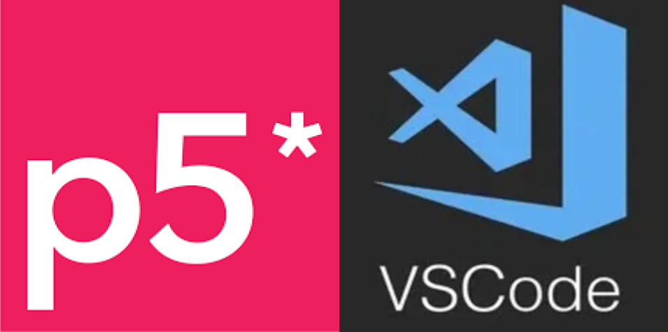
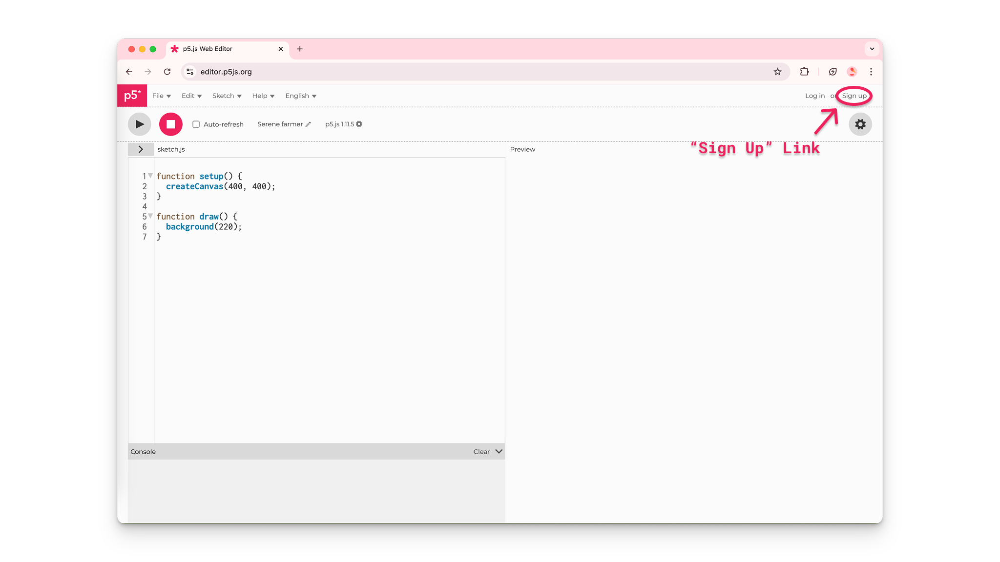
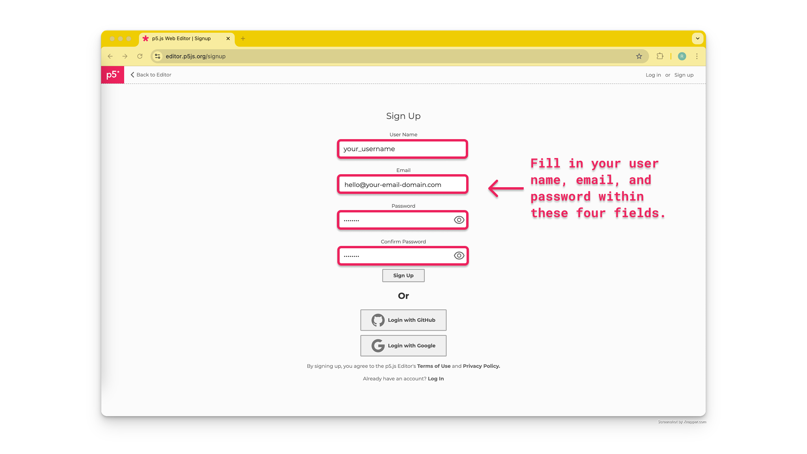
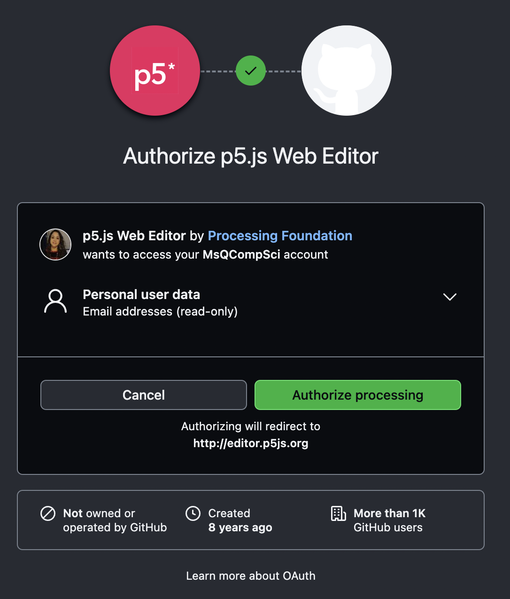
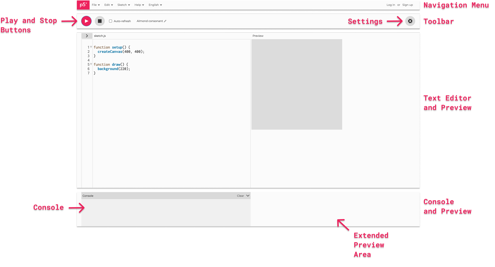
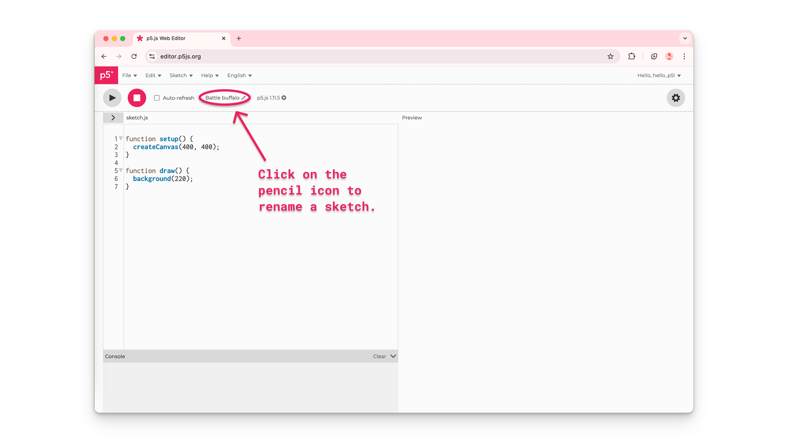
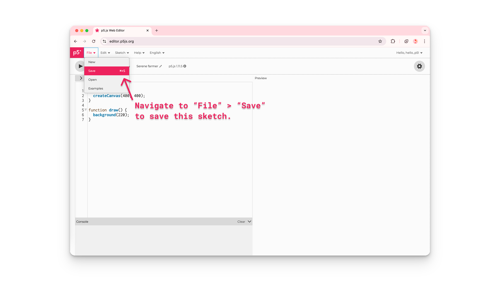
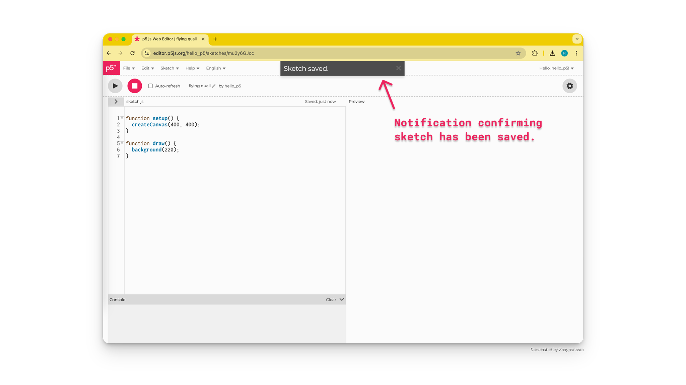
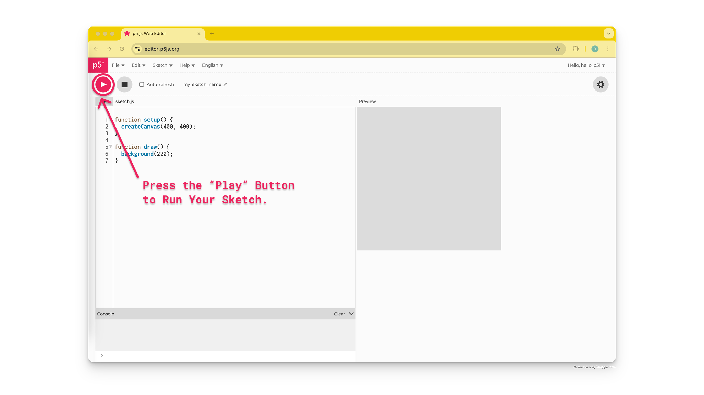

import EditableSketch from "../../../components/EditableSketch/index.astro";
import Callout from "../../../components/Callout/index.astro";




## 简介

开始使用 [p5.js](/reference/) 编写代码之前，您需要设置一个开发环境，以便编写和保存程序。在本指南中，您将学习：

1. 使用在线的 [p5.js Web 编辑器](https://editor.p5js.org/)，或者在电脑上使用 [Visual Studio Code (VS Code).](https://code.visualstudio.com/) 搭建您的开发环境。 
2. 使用 [p5.js 参考文档](/reference/) 来帮助您编写第一个使用形状和色彩的简单程序。
3. 保存并分享您的代码。


## 您需要准备

1. 能够访问互联网，并使用以下任一桌面端浏览器：
   - [Chrome](https://www.google.com/chrome/dr/download/?brand=SJWC\&geo=US\&gclid=Cj0KCQjw-pyqBhDmARIsAKd9XIM88u9RUlUagd7fpeqWx3AL_8VbhoIFULSME9tiz87t00L64-wLAlMaAm_QEALw_wcB\&gclsrc=aw.ds)
   - [Firefox](https://www.mozilla.org/en-US/firefox/)
   - [Safari](https://www.apple.com/safari/)
   - [Edge](https://www.microsoft.com/en-us/edge?ep=193\&form=MA13L2\&es=40)
2. 一台台式电脑、笔记本电脑或Chromebook。


## 步骤 0：选择开发环境类型

您可以选择使用 [p5.js Web 编辑器](https://editor.p5js.org/) 或者 [VS Code](https://code.visualstudio.com/) 开始您的 [p5.js](/reference/) 之旅。 

[p5.js Web 编辑器](https://editor.p5js.org/) 是一个网站，程序员可以直接在这里编写、测试、分享或重混 p5.js 程序，无需在电脑上下载或配置*代码编辑器*。 *代码编辑器*通过对代码文本进行整理和着色，帮助程序员区分代码的不同部分，从而让编写和阅读代码变得更加轻松。

[VS Code](https://code.visualstudio.com/) 是一款需要安装在电脑上的流行代码编辑器，它能提供更高级的编码体验。请根据您的实际需求，选择最适合您的开发环境。

- [p5.js Web 编辑器使用指南](#web-editor)
- [VS Code 使用指南](#vscode)

如果您是 p5.js 的初学者，强烈建议从 [p5.js Web 编辑器](https://editor.p5js.org/) 开始!


## 使用 p5.js Web 编辑器<a id="web-editor"></a>

### 步骤 1：打开 [p5.js Web 编辑器](https://editor.p5js.org/) 注册页面

- 在电脑上打开桌面浏览器并访问 [https://editor.p5js.org/](https://editor.p5js.org/)。
- 点击页面右上角的 [“注册”](https://editor.p5js.org/signup)。




### 步骤 2：创建您的 [p5.js Web 编辑器](https://editor.p5js.org/) 账号

- 进入 [注册页面](https://editor.p5js.org/signup) 后，您可以通过以下几种方式创建您的 [p5.js Web 编辑器](https://editor.p5js.org/) 账号:
- 手动注册
  - 输入用户名
  - 填写邮箱账号
  - 设置并确认密码
  - 点击 “注册” 按钮



- 使用 Google 账号登录
  - 点击页面底部的 “使用 Google 登录” 按钮 


- 按提示输入您的 Google 账号邮箱和密码（如需要）
- 使用 GitHub 账号登录
  - 点击页面底部的 “使用 GitHub 登录” 


- 按提示输入您的 GitHub 用户名和密码
- 点击 “授权处理” 按钮，授权 [p5.js Web 编辑器](https://editor.p5js.org/) 访问您的 GitHub 账号信息。




### 步骤 3：探索 [p5.js Web 编辑器](https://editor.p5js.org/)

[p5.js Web 编辑器](https://editor.p5js.org/) 是一个专门供程序员编写和测试 p5.js 代码的在线开发环境。一起来探索 [p5.js Web 编辑器](https://editor.p5js.org/) 的各个组成部分及其功能。   

下图标注并描述了编辑器界面中的各个组成部分:



{/* 
 */}


### 步骤 4：命名、保存并运行您的第一个草图

- 点击文本编辑器上方的“铅笔”图标，为您的项目命名。



- 点击顶部工具栏中的 *文件*，然后选择*保存*，即可保存项目。
  - 请确保您已登录账号，否则将无法保存草图。
  - 经常保存项目，可以避免因电脑、浏览器或网络突发问题而丢失代码。





点击左上角的 *运行* 按钮，查看代码的输出效果: 



*p5.js 草图* 是一个用 *JavaScript* 编程语言编写的文本文件。*JavaScript* 是一种用于让网页具备交互功能的编程语言。p5.js 是一个用 *JavaScript* 编写的库——这就是为什么它的后缀名是 “*.js*” （代表 *JavaScript*）。利用 p5.js，您可以创建丰富多彩、包含动画且支持用户交互的程序！ 要了解更多用 p5.js 可以实现的功能，欢迎观看 [p5.js 欢迎视频!](https://hello.p5js.org/)。要深入学习 JavaScript，可以访问 [这份资料](https://developer.mozilla.org/en-US/docs/Web/JavaScript)。

编辑器启动时，会在*sketch.js*文件中自动生成以下代码：

```js
function setup() {
  createCanvas(400, 400);
}
function draw() {
  background(220);
}
```

上述代码的作用是在预览窗口中创建一个 400 像素宽、400 像素高的画布元素，并将其背景色设置为一种灰色。


#### `createCanvas()`

电脑屏幕是由被称为*像素*的微小光点组成的，这些光点是构成任何图像的最小单元。在预览窗口中创建画布的代码行是 [`createCanvas(400, 400)`](/reference/p5/createCanvas)。 没有这行代码，就没有可以绘画的画布！数字 400, 400 对应画布的宽度和高度（单位为像素）。这些数字也被称为[`createCanvas()`](/reference/p5/createCanvas)函数的*参数*。 

放置在函数括号内的任何值都称为 *参数*: 用于自定义函数行为的任何值。[`createCanvas()`](/reference/p5/createCanvas) 出现在 [`setup()`](/reference/p5/setup) 函数内部，用于创建一个可供绘制的 HTML 画布元素。

想了解更多，请访问 [p5.js 参考文档](/reference) 中关于 [`setup()`](/reference/p5/setup) 函数和 [`createCanvas()`](/reference/p5/createCanvas) 函数的页面。


### 步骤 5：改变画布的颜色

- 您可以在文本编辑器中为任何草图键入命令，并通过点击*运行*在预览窗口中查看代码的输出效果。
- 通过更改 [`background()`](/reference/p5/background) 函数的 *参数* 来改变画布的背景颜色。
  - 将 `background(220);` 修改为 `background("aqua");`，然后点击 *运行*。

```js
function setup() {
  createCanvas(400, 400);
}
function draw() {
  background("aqua");
}
```


#### `background()`

`background()` 函数用于将背景设置为特定颜色。您可以在引号内使用颜色单词，也可以使用数字来为画布着色。要了解更多信息，请访问 [p5.js 参考文档](/reference) 中关于 [`background()`](/reference/p5/background) 和 [color](/reference/p5/color) 的页面。

### 步骤 6：在画布上绘制形状

- 在画布上画一个圆。
  - 在 [`background()`](/reference/p5/background) 函数下方添加以下代码：

    ```js
    // 在中心绘制一个直径为 100 的圆
    circle(200,200,100);
    ```

- 点击 *运行* 按钮。

您的代码应如下所示：

```js
function setup() {
  createCanvas(400, 400);
}
function draw() {
  background(220);

  // 在中心绘制一个直径为 100 的圆
  circle(200, 200, 100);
}
```

#### `draw()`

您可以在 [`function draw()`](/reference/p5/draw) 后面的花括号 `{}` 内键入特定的形状命令，从而在画布上绘制形状。

上面的草图通过在 [`draw()`](/reference/p5/draw) 中调用 [`circle()`](/reference/p5/circle) 函数，在画布上绘制了一个圆形。前两个*参数* `200, 200` 将圆心定位在画布的中心，最后一个*参数* `100` 表示圆的直径为 100 像素。草图中位于 [`circle()`](/reference/p5/circle) 函数上方的注释行，解释了代码的作用。

想了解更多，请访问 [p5.js 参考文档](/reference/) 中关于 [`draw()`](/reference/p5/draw) 和 [`circle()`](/reference/p5/circle) 的页面。


### 步骤 7：一起来创造吧！

p5.js 拥有非常丰富的函数，可用于在画布中同时融入静态和交互式元素。

- 将原来的 background 和 circle 命令替换为以下代码：

```js
// 当按下鼠标按键时，圆圈变为黑色
if (mouseIsPressed === true) {
  fill(0);
} else {
  fill(255);
}

// 在当前鼠标所在位置绘制白色圆圈
circle(mouseX, mouseY, 100);
```

您的代码应如下所示：

```js
function setup() {
  createCanvas(400, 400);
}

function draw() {
  // 当按下鼠标按键时，圆圈变为黑色
  if (mouseIsPressed === true) {
    fill(0);
  } else {
    fill(255);
  }

  // 在当前鼠标所在位置绘制白色圆圈
  circle(mouseX, mouseY, 100);
}
```

<Callout>
试试看在画布上按住鼠标按键并拖动鼠标指针！
</Callout>

  

上述代码会在鼠标指针所在位置绘制白色圆圈。当按下鼠标按键时，圆圈的填充颜色会变为黑色。

访问 [p5.js 参考文档](/reference/) 以了解更多 p5.js 函数，例如 [2D 基础形状](/reference/#Shape/)。


### 程序错误

在编写代码时，很容易拼错函数名称或漏掉逗号。语法规则有助于计算机正确解读代码。当某条“规则”被违反时（例如拼错了 [`circle()`](/reference/p5/circle) 函数），控制台中就会显示一条错误消息。这些错误通常被称为“程序错误”。控制台会显示来自编辑器的消息，详细说明您可能犯的错误。当代码无法正确执行时，您的代码中很可能存在程序错误！

请访问《[代码调试现场指南](/tutorials/field-guide-to-debugging)》，了解更多关于如何修复代码错误的信息。

#### 无障碍说明：

如果您正在使用屏幕阅读器，您必须在 [p5.js Web 编辑器](https://editor.p5js.org/) 中开启无障碍输出，并在 HTML 文件中添加无障碍库。要了解更多信息，请访问我们的指南《[如何使用屏幕阅读器配合 p5.js Web 编辑器](/tutorials/p5js-with-screen-reader/)》。

### 步骤 8：分享您的项目

项目保存成功后，您就可以分享它了！

- 点击顶部工具栏中的 *文件*，选择 *分享*，然后复制提供的任一链接即可。您可以通过以下三种方式分享项目：
  - 嵌入：将您的 p5.js 草图添加到使用 HTML 的网站或博客中（不显示代码）。
  - 全屏：通过链接分享您的项目（不显示代码）。
  - 编辑：通过链接在 p5.js 编辑器中分享您的项目代码。


## 后续步骤：

- 下一篇教程：[开始入门](/tutorials/get-started)
- 探索更多 [p5.js 范例](/examples/)

## 资源：

- [p5.js 欢迎视频](https://hello.p5js.org/)
- The Coding Train：[1.2：p5.js Web 编辑器 - p5.js 教程](https://www.youtube.com/watch?v=MXs1cOlidWs)
- [p5.js 参考页面](/reference/)
- [JavaScript - MDN 参考文档](https://developer.mozilla.org/en-US/docs/Web/JavaScript)
- [代码调试现场指南](/tutorials/field-guide-to-debugging)
- [如何使用屏幕阅读器配合 p5.js Web 编辑器](/tutorials/p5js-with-screen-reader/)
---

## 使用 VS Code<a id="vscode"></a>

与 Web 编辑器相比，[VS Code](https://code.visualstudio.com/) 提供了更高级的代码编辑体验。如果您已经熟悉 VS Code，我们推荐此方案。

### 步骤 1：下载 VS Code

- 使用[此链接](https://code.visualstudio.com/download)将 VS Code 下载到您的设备上。
- 使用[这些资源](https://code.visualstudio.com/docs/getstarted/introvideos)探索 VS Code 的各项功能和多种配置选项。


### 步骤 2：安装 p5.js 库拓展

- 打开 VS Code，找到左侧工具栏中的拓展管理器。
- 在搜索栏中输入 [*p5.js 2.x Project Generator*](https://marketplace.visualstudio.com/items?itemName=Irti.p5js-project-generator)，选择该拓展，然后点击安装按钮。
- 在[此处](https://github.com/IrtizaNasar/p5-2.vscode/blob/main/README.md)熟悉此拓展的详细信息。


### 步骤 3：创建 p5.js 项目

- 点击顶部工具栏中的 *查看*，然后选择命令面板。
- 在搜索栏中输入 *创建新的 p5.js 2.x 项目*，然后选择该命令。
- 按照提示配置您的项目。
- 选择您希望将项目保存到的本地文件夹。

### 步骤 4：预览您的第一个草图

查看代码的预览效果：

- 在左侧资源管理器面板的 *VSCODE* 选项卡中，找到 *index.html* 文件并右键点击它。
- 选择 *Open Live Server*。
- 您的系统默认浏览器将会自动弹出一个窗口，展示您项目的输出效果。

*p5.js 草图* 是一个用 *JavaScript* 编程语言编写的文本文件。*JavaScript* 是一种用于让网页具备交互功能的编程语言。p5.js 是一个用 *JavaScript* 编写的库——这就是为什么它的后缀名是“*.js*”（代表 *JavaScript*）。
利用 p5.js，您可以创建丰富多彩、包含动画且支持用户交互的程序！要了解更多用 p5.js 可以实现的功能，欢迎观看 [p5.js 欢迎视频！](https://hello.p5js.org/) 要深入学习 JavaScript，可以访问 [这份资料](https://developer.mozilla.org/en-US/docs/Web/JavaScript)。

编辑器启动时，会在 *sketch.js* 文件中自动生成以下代码，并在预览窗口中显示效果：

```js
function setup() {
  createCanvas(400, 400);
}
function draw() {
  background(220);
}
```

上述代码会在预览窗口中创建一个宽 400 像素、高 400 像素的画布元素，并将其背景色设置为一种灰色。

#### `createCanvas()`

电脑屏幕由被称为 *像素* 的微小光点组成，这些光点是构成任何图像的最小单元。在预览窗口中创建画布的代码行是 [`createCanvas(400, 400)`](/reference/p5/createCanvas)。没有这行代码，就没有可以绘画的画布！数字 `400, 400` 对应画布的宽度和高度（单位为像素）。这些数字也被称为 [`createCanvas()`](/reference/p5/createCanvas) 函数的 *参数*。

放置在函数括号内的任何值都称为 *参数*：参数是用于自定义函数行为的任何值。[`createCanvas()`](/reference/p5/createCanvas) 出现在 [`setup()`](/reference/p5/setup) 函数内部，用于创建一个可供绘制的 HTML 画布元素。

想了解更多，请访问 [p5.js 参考文档](/reference/) 中关于 [`setup()`](/reference/p5/setup) 和 [`createCanvas()`](/reference/p5/createCanvas) 的页面。

### 步骤 5：改变画布的颜色

- 通过更改 [`background()`](/reference/p5/background) 函数的 *参数* 来改变画布的背景颜色。
  - 将 `background(220);` 修改为 `background("aqua");`，然后点击 *运行*。

您的代码应如下所示：

```js
function setup() {
  createCanvas(400, 400);
}
function draw() {
  background("aqua");
}
```


#### `background()`

`background()` 函数用于将背景设置为特定颜色。您可以在引号内使用颜色单词，也可以使用数字来为画布着色。要了解更多信息，请访问 [p5.js 参考文档](/reference/) 中关于 [`background()`](/reference/p5/background) 和 [color](/reference/#Color) 的页面。

### 步骤 6：在画布上绘制形状

- 在画布上画一个圆。
  - 在 [`background()`](/reference/p5/background) 函数下方添加以下代码：

    ```js
    // 在中心绘制一个直径为 100 的圆
    circle(200, 200, 100);
    ```

- 别忘了保存更改，预览窗口才会更新。

您的代码应如下所示：

```js
function setup() {
  createCanvas(400, 400);
}
function draw() {
  background(220);
  // 在中心绘制一个直径为 100 的圆
  circle(200, 200, 100);
}
```


#### `draw()`

您可以在 [`function draw()`](/reference/p5/draw) 后面的花括号 `{}` 内键入特定的形状命令，从而在画布上绘制形状。

上面的草图通过在 [`draw()`](/reference/p5/draw) 中调用 [`circle()`](/reference/p5/circle) 函数，在画布上绘制了一个圆形。前两个 *参数* —— `200, 200` —— 将圆心定位在画布的中心，最后一个 *参数* —— `100` —— 表示圆的直径为 100 像素。草图中位于 [`circle()`](/reference/p5/circle) 函数上方的注释行，解释了代码的作用。

想了解更多，请访问 [p5.js 参考文档](/reference/) 中关于 [`draw()`](/reference/p5/draw) 和 [`circle()`](/reference/p5/circle) 的页面。

### 步骤 7：一起来创造吧！

p5.js 拥有非常丰富的函数，可用于在画布中同时融入静态和交互式元素。

- 将原来的 circle 命令替换为以下代码：

  ```js
  // 当按下鼠标按键时，圆圈变为黑色
  if (mouseIsPressed === true) {
    fill(0);
  } else {
    fill(255);
  }

  // 在当前鼠标所在位置绘制白色圆圈
  circle(mouseX, mouseY, 100);
    ```

您的代码应如下所示：

```js
function setup() {
  createCanvas(400, 400);
}
function draw() {
  background(220);
  if (mouseIsPressed === true) {
    fill(0);
  } else {
    fill(255);
  }
  circle(mouseX, mouseY, 100);
}
```

<Callout>
试试在画布上按住鼠标按键并拖动鼠标指针！
</Callout>


上述代码会在鼠标指针所在位置绘制白色圆圈。当按下鼠标按键时，圆圈的填充颜色会变为黑色。

访问 [p5.js 参考文档](/reference/) 以了解更多 p5.js 函数，例如其他可以绘制的形状。


### 程序错误

编写代码时，很容易拼错函数名或漏掉逗号。语法规则有助于计算机正确解读代码。当某条“规则”被违反时（例如把 [`circle()`](/reference/p5/circle) 拼写错了），浏览器的控制台中就会显示一条消息。这些错误通常被称为“程序错误”；如果你的代码未能正确执行，代码中很可能存在错误！

- 请访问以下资源，了解如何在特定浏览器中查看控制台：[Chrome](https://developer.chrome.com/docs/devtools/console/reference/) | [Firefox](https://firefox-source-docs.mozilla.org/devtools-user/web_console/) | [Safari](https://support.apple.com/guide/safari-developer/safari-developer-tools-overview-dev073038698/11.0/mac/10.13) | [Edge](https://learn.microsoft.com/en-us/microsoft-edge/devtools-guide-chromium/console/)
- 请访问《[代码调试现场指南](/tutorials/field-guide-to-debugging)》，了解更多关于如何修复代码错误的信息。


### 无障碍说明

如果您正在使用屏幕阅读器，请改用 [p5.js Web 编辑器](https://editor.p5js.org/)！要了解更多信息，请访问《[如何使用屏幕阅读器配合 p5.js Web 编辑器](https://docs.google.com/document/u/0/d/1Q_leNn8lkeSUfAyq1jLQeLYq1h8pU9134QHNvMu4Tcw/edit)》资源。

## 后续步骤：

- 下一篇教程：[开始入门](/tutorials/get-started)
- 探索更多 [p5.js 范例](/examples/)


## 资源：

- [p5.js 欢迎视频](https://hello.p5js.org/)
- The Coding Train：[1.2：p5.js Web 编辑器 - p5.js 教程](https://www.youtube.com/watch?v=MXs1cOlidWs)
- [p5.js 参考页面](/reference/)
- [JavaScript - MDN 参考文档](https://developer.mozilla.org/en-US/docs/Web/JavaScript)
- [代码调试现场指南](/tutorials/field-guide-to-debugging)
- [在 VS Code 中使用 p5.js](https://www.youtube.com/watch?v=zMAnM9ly0a8)（视频教程）
- [VS Code 概览](https://code.visualstudio.com/docs/getstarted/introvideos)
- [p5.vscode 参考文档](https://github.com/antiboredom/p5.vscode/blob/master/README.md)
- [p5.nvim 参考 —— Neovim 编辑器的 p5.js 支持](https://github.com/prjctimg/p5.nvim/blob/main/README.md)
- 各浏览器控制台指南：[Chrome](https://developer.chrome.com/docs/devtools/console/reference/) | [Firefox](https://firefox-source-docs.mozilla.org/devtools-user/web_console/) | [Safari](https://support.apple.com/guide/safari-developer/safari-developer-tools-overview-dev073038698/11.0/mac/10.13) | [Edge](https://learn.microsoft.com/en-us/microsoft-edge/devtools-guide-chromium/console/)
