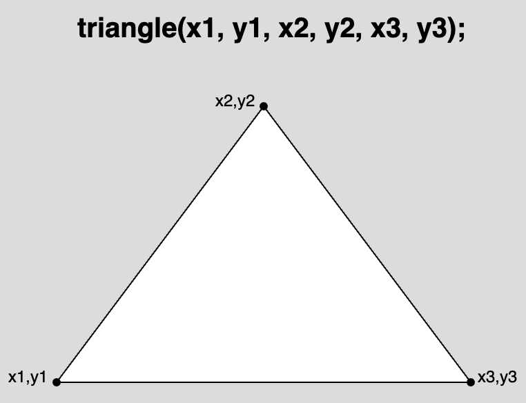
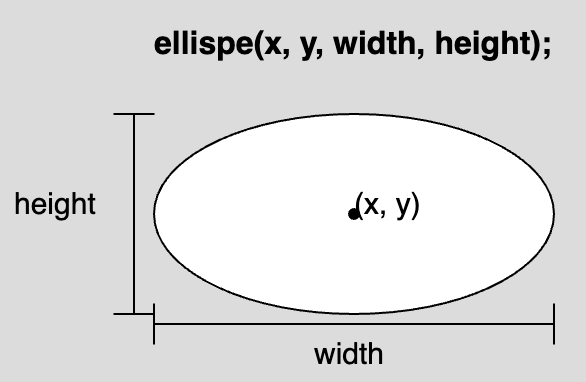
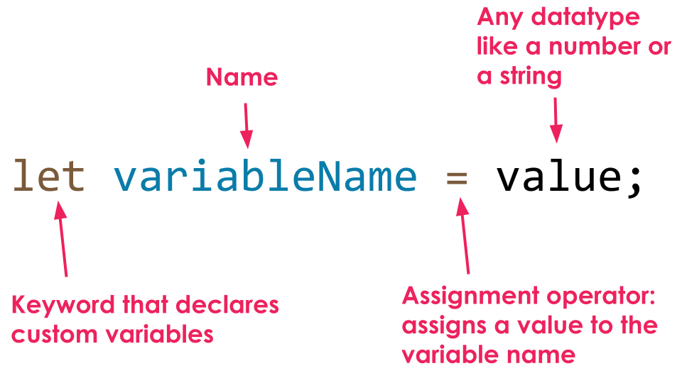
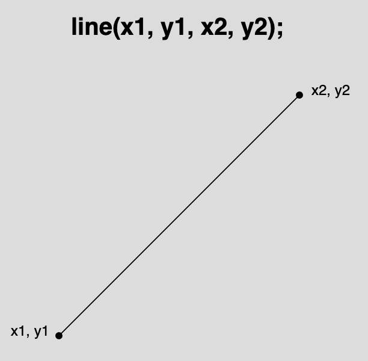

import Video from "../../../components/Video/index.astro"
import Callout from "../../../components/Callout/index.astro";
import EditableSketch from "../../../components/EditableSketch/index.astro";

跟着本教程，一边学习 p5.js 中变量和创建运动的基础知识，一边制作一个[动态风景](https://editor.p5js.org/Msqcoding/sketches/WQWNKZppu)。 

<Video src="/videos/tutorials/landscape.mp4" alt="一个动态风景：背景有一弯新月和连绵山脉，前景是草地和不断长高的树木。随着云朵在画布上移动，星星会随机出现。" />

跟随本教程，你将学习:

- 在p5.js草图中声明、初始化和更新变量
- 在p5.js的图形函数中使用变量、运算符和 random()，在画布上创建运动效果
- 在p5.js项目中同时添加线性运动和随机运动


## 学习本教程之前，你应该已经学过:

- [设置你的环境](/tutorials/setting-up-your-environment)
- [开始](/tutorials/get-started)
- (可选) [调试实用指南](/tutorials/field-guide-to-debugging)

在开始之前，你应该能够：

- 登录 [p5.js网页编辑器](https://editor.p5js.org/)并保存一个新项目
- 更改画布的尺寸和背景颜色
  - [`background()`](/reference/p5/background), [`createCanvas()`](/reference/p5/createCanvas), [`setup()`](/reference/p5/setup), [`draw()`](/reference/p5/draw)
- 添加并自定义形状和文字
  - 二维基本图形，例如 [`circle()`](/reference/p5/circle)和[`rect()`](/reference/p5/rect)
  - [`text()`](/reference/p5/text), [`fill()`](/reference/p5/fill), [`stroke()`](/reference/p5/stroke), [`textSize()`](/reference/p5/textSize)
- 使用[`mouseX`](/reference/p5/mouseX)和[`mouseY`](/reference/p5/mouseY)添加简单的交互效果
- [为代码添加注释](https://developer.mozilla.org/en-US/docs/MDN/Writing_guidelines/Writing_style_guide/Code_style_guide/JavaScript#comments)
- 阅读并解决 [错误信息](/tutorials/field-guide-to-debugging)


## 第1步：选择从哪里开始<a id="step-1"></a>

登录[p5.js网页编辑器](https://editor.p5js.org/)然后在以下选项中选择一项：

- 如果你已经完成了之前的 [入门指南](/tutorials/get-started):
  - 复制你的 [交互式风景画](https://editor.p5js.org/p5Master718/sketches/aDwxcxCbV) 并为它起一个新名字。
    - 打开你的 [交互式风景画](https://editor.p5js.org/p5Master718/sketches/aDwxcxCbV), 点击 *File*, 再点击 *Duplicate*.
    - 把名称改成类似“动态风景”这样的名字。
  - 跳到 [步骤 3](#step-3).
- 如果你想从头开始:
  - 使用[这个模板](https://editor.p5js.org/Msqcoding/sketches/nHyx0xDG6)其中包含可帮助你在画布上定位图形和文字的代码：
  - 复制这个[模板](https://editor.p5js.org/Msqcoding/sketches/nHyx0xDG6)并为其命名一个新名称。 
    - 打开这个[模板链接](https://editor.p5js.org/Msqcoding/sketches/nHyx0xDG6), 点击*File*，然后*Duplicate*.
    - 将名称改为类似“动态风景”。
  - 你也可以不使用模板，直接新建一个 p5.js 项目，命名为“动态风景”并保存。 
    - 如果你想使用辅助代码，请将以下几行复制到 [`draw()`](/reference/p5/draw)函数中：

      ```js
      //在画布上显示鼠标的 x 和 y 坐标
      fill(255) //白色文字
      text(`${mouseX}, ${mouseY}`, 20, 20);
      ```

<Callout title="Tip">
点击 [p5.js Web Editor](https://editor.p5js.org/) 中的 *Play*，并勾选“Auto-refresh”旁边的复选框。这样当你继续为项目添加代码时，画布会持续更新。勾选后，每次修改草图都不需要再按一次 *Play* 按钮。
</Callout>

如果你复制了这个[模板](https://editor.p5js.org/Msqcoding/sketches/nHyx0xDG6)，你的代码应如下所示：

<EditableSketch code={`
function setup() {
  createCanvas(400, 400);
}

function draw() {
  background(220);
  //在此处放置代码

  //在画布上显示鼠标的 x 和 y 坐标
  fill(0)
  text(\`\${mouseX}, \${mouseY}\`, 20, 20);
}
`} />

代码行``text(`${mouseX}, ${mouseY}`, 20, 20);``会把鼠标指针的 x 与 y 坐标以坐标对 x, y 的形式显示出来。第一个数字是变量[mouseX](/reference/p5/mouseX)的值，表示鼠标指针在画布上移动时的 x 坐标；第二个数字是变量[mouseY](/reference/p5/mouseY)的值，表示鼠标指针的 y 坐标。


<Callout title="Tip">
为了让这段文字始终可见，请确保这段代码位于 [`draw()`](/reference/p5/draw) 的最后几行。如果文字和背景混在一起，你可能需要修改 [`fill()`](/reference/p5/fill) 的值来更改文字颜色。当你不再需要这些坐标时，在 [`fill()`](/reference/p5/fill) 和 [`text()`](/reference/p5/text) 函数前加上 `//`。这会把这些代码行变成注释，从而让程序跳过它们！

**别忘了：** 你的程序最后一行应该是 `}`（右花括号），用于结束 [`draw()`](/reference/p5/draw) 函数代码块。
</Callout>

访问这份[参考资料](https://developer.mozilla.org/en-US/docs/MDN/Writing_guidelines/Writing_style_guide/Code_style_guide/JavaScript#comments)或观看[这个视频](https://www.youtube.com/watch?v=xJcrPJuem5Q)，了解更多关于注释的内容。


### 变量

变量用于存储可在草图中使用的值。 **当你要在草图中添加会随时间变化的元素时，变量非常有帮助。** 它们可用于计算、文本信息、函数参数等等！

[`mouseX`](/reference/p5/mouseX)和[`mouseY`](/reference/p5/mouseY)是 p5.js 库内置的变量。它们会在鼠标指针拖动经过画布时，存储其 x 和 y 坐标。在[开始](/tutorials/get-started)教程中，你创建了一个[交互式风景](https://editor.p5js.org/p5Master718/sketches/aDwxcxCbV)，其中把[`mouseX`](/reference/p5/mouseX)和[`mouseY`](/reference/p5/mouseY)用作瓢虫或其他表情符号的 x、y 坐标。这样一来，表情符号就能跟随鼠标在画布上移动，让你的作品具有交互性！ 

在上面的模板中，你使用[`mouseX`](/reference/p5/mouseX)和[`mouseY`](/reference/p5/mouseY)配合[`text()`](/reference/p5/text)函数在画布上打印鼠标的 x、y 坐标。变量可以通过[`text()`](/reference/p5/text)函数和[字符串插值（string interpolation）](https://www.geeksforgeeks.org/string-interpolation-in-javascript/)（示例 2）与文本一起显示在画布上。


### 字符串插值（string interpolation）

在[开始](/tutorials/get-started)中你学到，字符串是始终用引号（""）包裹的[数据类型](https://developer.mozilla.org/en-US/docs/Web/JavaScript/Data_structures)。要把变量和字符串结合使用，可以借助[模板字面量（template literals）](https://developer.mozilla.org/en-US/docs/Web/JavaScript/Reference/Template_literals)！ 模板字面量使用反引号 (`) 而不是引号 ("") 作为开始和结束。你可以在反引号之间输入任意字符来生成字符串，就像[这个示例](https://editor.p5js.org/Msqcoding/sketches/pfSJLvxOB)。你还可以通过 ${} 占位符把变量放进字符串中，即在花括号内写入变量名，就像[这个示例](https://editor.p5js.org/Msqcoding/sketches/8sM-h5Hd9)。

想了解更多，请查看[string interpolation](https://www.geeksforgeeks.org/string-interpolation-in-javascript/)（示例2），[template literals](https://developer.mozilla.org/en-US/docs/Web/JavaScript/Reference/Template_literals)，或 p5.js 关于[string](/reference/p5/String)的参考页面！

<Callout title="Note">
存储了[数字](/reference/p5/number)的变量可以在需要数字参数的地方使用。如果把存储了[string](/reference/p5/String)的变量用在本应传入数字的位置，控制台会显示类似 `“...was expecting Number for the first parameter, received string instead.(...第一个参数应为数字，却接收到了字符串。)”` 的错误信息。请查看[调试实用指南](/tutorials/field-guide-to-debugging)中的“错误信息”部分，了解一些常见错误及其修复方法！
</Callout>


## 第2步：创建背景风景<a id="step-2"></a>

- 为背景设置颜色。  
- 添加并为风景中的形状上色（例如太阳或月亮、山脉、建筑、房屋、树木等）。  
- 添加注释，说明每一部分代码的作用。  

有关如何在画布上使用颜色和形状的更多信息，请参见 [Get Started 中的第 4–6 步](/tutorials/get-started)。

你的代码可以如下所示：

<EditableSketch code={`
function setup() {
  createCanvas(400, 400);
}

function draw() {
  background('navy'); // 深蓝色背景

  // 月亮
  fill(255);
  stroke(0);
  circle(350, 50, 100);

  // 重叠的深蓝色圆形，用于创建弯月效果
  stroke("navy");   
  fill("navy");
  circle(320,50,100);

  // 灰色山脉
  stroke(0);
  fill(80);
  triangle(-40,300,75,100, 250,300);
  triangle(100,300,300,100, 500,300);

  // 草地
  fill('rgb(50,76,50)');
  rect(0,300, 400, 100);

  // 在画布上显示鼠标的 x 和 y 坐标
  fill(255) // 白色文字
  text(\`mouseX: \${mouseX}, mouseY: \${mouseY}\`, 20, 20);  
}
`} />

上述代码使用 [`circle()`](/reference/p5/circle) 和 [`triangle()`](/reference/p5/triangle) 在风景中创建对象，并使用 [`fill()`](/reference/p5/fill) 和 [`stroke()`](/reference/p5/stroke) 为形状及其轮廓上色。  

- [`background()`](/reference/p5/background) 用于更改画布背景颜色。  
- [`draw()`](/reference/p5/draw) 会不断重复执行其中的代码。这意味着如果多个形状位置接近，后绘制的形状会覆盖先绘制的形状。  
  - 弯月是通过重叠两个 [`circle()`](/reference/p5/circle) 形状创建的。  
    - [这个示例](https://editor.p5js.org/Msqcoding/sketches/eHkwP3yBC) 使用两个重叠的圆来创建弯月效果。  
  - 山脉是通过重叠两个 [`triangle()`](/reference/p5/triangle) 形状创建的（见下图）。  
    - [这个示例](https://editor.p5js.org/p5Master718/sketches/CxuLJszOL) 展示了如何使用重叠的三角形创建更有细节的山脉。  
- [`triangle()`](/reference/p5/triangle) 需要提供画布上 3 个点的位置才能显示。每个点都包含一个 x 坐标和一个 y 坐标。前两个数字是第一个点的坐标 (x₁, y₁)，接下来的两个数字是第二个点的坐标 (x₂, y₂)，最后两个数字是第三个点的坐标 (x₃, y₃)。



你的风景作品可能与上面的示例代码非常不同。你可以在作品中使用以下任意形状（点击链接了解更多）：  
[`rect()`](/reference/p5/rect)  |  [`triangle()`](/reference/p5/triangle)  |  [`ellipse()`](/reference/p5/ellipse)  |  [`circle()`](/reference/p5/circle)  |  [`line()`](/reference/p5/line)  |  [`square()`](/reference/p5/square)  |  [`quad()`](/reference/p5/quad)  |  [`point()`](/reference/p5/point)  |  [`arc()`](/reference/p5/arc)

你也可以参考以下资源，进一步了解如何在项目中使用形状和颜色：  
[`fill()`](/reference/p5/fill)  |  [`stroke()`](/reference/p5/stroke)  |  [`background()`](/reference/p5/background)  |  [`draw()`](/reference/p5/draw)

请务必避免 [调试指南](/tutorials/field-guide-to-debugging) 中提到的常见错误，以及 The Coding Train 的[这段视频](https://www.youtube.com/watch?v=LuGsp5KeJMM\&list=PLRqwX-V7Uu6Zy51Q-x9tMWIv9cueOFTFA\&index=6)中提到的问题。


## 第3步：使用自定义变量绘制形状<a id="step-3"></a>

- 使用 [`ellipse()`](/reference/p5/ellipse) 方法在画布天空中绘制一朵白云。  
  - 在草地代码的正下方添加以下代码：

    ```js
    // 云朵
    fill(255);
    ellipse(50, 50, 80, 40);
    ```

- 创建一个名为 `cloudOneX` 的自定义变量，并将数字 50 存储在其中——该变量将在整个程序中用于存储白云的 x 坐标值。  
  - 在 [`setup()`](/reference/p5/setup) 之前添加以下代码：

    ```js
    // 云朵 x 坐标的自定义变量
    let cloudOneX = 50;
    ```

- 将 `ellipse(50, 50, 80, 40);` 中的 x 坐标替换为 `cloudOneX` 变量。  
  - 该行代码应修改为：

    ```js
    ellipse(cloudOneX, 50, 80, 40);
    ```

你的代码可以如下所示：

<EditableSketch code={`
// 云朵 x 坐标的自定义变量
let cloudOneX = 50;

function setup() {
  createCanvas(400, 400);
}

function draw() {
  background('navy'); // 深蓝色背景

  // 月亮
  fill(255);
  stroke(0);
  circle(350, 50, 100);

  // 重叠的深蓝色圆形，用于创建弯月效果
  stroke("navy");   
  fill("navy");
  circle(320,50,100);

  // 灰色山脉
  stroke(0);
  fill(80);
  triangle(-40,300,75,100, 250,300);
  triangle(100,300,300,100, 500,300);

  // 草地
  fill('rgb(50,76,50)');
  rect(0,300, 400, 100);
  
  // 云朵
  fill(255);
  ellipse(cloudOneX, 50, 80, 40);

  // 在画布上显示鼠标的 x 和 y 坐标
  fill(255) // 白色文字
  text(\`mouseX: \${mouseX}, mouseY: \${mouseY}\`, 20, 20);
} 
`} />

[`ellipse()`](/reference/p5/ellipse) 需要 4 个数字才能在画布上显示。前两个数字 (x, y) 是椭圆中心点的坐标。后两个数字分别表示椭圆的宽度和高度（单位为像素）。



在上述代码中，云朵使用 [`ellipse()`](/reference/p5/ellipse) 绘制，其 x 坐标为 `cloudOneX`（存储值为 50），y 坐标为 50，宽度为 80 像素，高度为 40 像素。


### 自定义变量

自定义变量用于存储可以在之后发生变化的值，例如 [numbers](/reference/p5/number) 或 [strings](/reference/p5/String)。由于自定义变量存储的是可变的值，我们可以利用它们来改变画布上形状的 x 坐标、y 坐标或大小。当形状的 x 或 y 坐标发生变化时，它看起来就像在移动。在本步骤中：

- 你使用 [`ellipse()`](/reference/p5/ellipse)，将数字 50 作为 x 坐标，在画布上放置了一朵白云；
- 你在 [`setup();`](/reference/p5/setup) 之前*声明（declare）*了一个名为 `cloudOneX` 的自定义变量；
  - 当你想在程序中创建自定义变量时，必须为变量命名，并使用关键字 [`let`](/reference/p5/let) 来*声明*它。
  - 变量名可以是任意名称；但最好使用能够帮助你记住变量用途的名称。
- 你通过将数字 50 赋值给 `cloudOneX` 来*初始化（initialize）*该变量；
  - 使用*赋值运算符*（`=`）可以将一个值存储到变量中；
  - 当一个值第一次被存入自定义变量时，这个过程称为*初始化*变量。



最后，你可以将变量名 `cloudOneX` 作为 [`ellipse()`](/reference/p5/ellipse) 中 x 坐标的参数。由于变量 `cloudOneX` 中存储的是数字 50，因此在任何需要数字参数的函数中都可以使用它。在这里，你通过将原本的数字 50 替换为变量名 `cloudOneX`，把它作为白云的 x 坐标： `cloudOneX`: `ellipse(cloudOneX, 50, 80, 40);`.


### 变量作用域

*变量的作用域（scope）*描述了变量在程序中可以被使用的位置。通常，将自定义变量声明在 [`setup()`](/reference/p5/setup) 和 [`draw()`](/reference/p5/draw) 之外是很有用的，因为这样变量就具有*全局作用域（global scope）*。具有全局作用域的变量可以在程序的任何位置使用。全局变量通常声明在代码的最前面几行，这样可以帮助程序员清楚地了解哪些值会发生变化，使代码更易维护，并减少后续的混乱。

内置变量，例如 [`mouseX`](/reference/p5/mouseX)、[`mouseY`](/reference/p5/mouseY)、[`width`](/reference/p5/width) 和 [`height`](/reference/p5/height)，不需要声明，因为它们已经内置于 p5.js 库中。它们具有全局作用域，因此可以在代码中的任何位置使用。

在其他函数内部声明的变量（例如在 [`draw()`](/reference/p5/draw) 或 [`setup()`](/reference/p5/setup) 内部）具有*局部作用域（local scope）*。这意味着它们只能在声明它们的代码块或函数内部使用。在 [`setup()`](/reference/p5/setup) 中声明的变量不能在 [`draw()`](/reference/p5/draw) 或其他函数中使用；同样，在 [`draw()`](/reference/p5/draw) 中声明的变量也不能在 [`setup()`](/reference/p5/setup) 中使用。你可以查看[这个示例](https://editor.p5js.org/p5Master718/sketches/aa8bBwGHb)来了解全局变量和局部变量的区别。

要进一步了解如何声明、初始化和使用自定义变量，可以参考以下 p5.js 页面：[`let`](/reference/p5/let)、[numbers](/reference/p5/number)和[strings](/reference/p5/String)。


### 使用变量实现动画

当画布上某个形状的 x 或 y 坐标发生变化时，它看起来就像在移动。我们可以使用变量来代替画布上任意对象的 x 或 y 坐标。在示例中：

- 修改 `cloudOneX` 中存储的值（即更改初始化时赋给它的数值），观察画布上白云的变化；
  - 如果 `cloudOneX` 的值增大，白云会向右移动；
  - 如果 `cloudOneX` 的值减小，白云会向左移动。

在下一步中，我们将改变 `cloudOneX` 的值，使云朵在画布上水平移动。


## 第4步：添加水平运动,<a id="step-4"></a>

- 在白云代码的下一行添加以下代码：

  ```js
  // 将 x 坐标设置为帧计数
  // 在左边缘重置
  cloudOneX = frameCount % width
  ```

你的代码可以如下所示：

<EditableSketch code={`
//定义云的x坐标参数
let cloudOneX = 50;

function setup() {
  createCanvas(400, 400);
}

function draw() {
  background('navy'); //深蓝色背景
  
  // 月亮
  fill(255);
  stroke(0);
  circle(350, 50, 100);
  //新月形图案与深蓝圆圈重叠
  stroke("navy");   
  fill("navy");
  circle(320,50,100);

  // 灰色山脉
  stroke(0);
  fill(80);
  triangle(-40,300,75,100, 250,300);
  triangle(100,300,300,100, 500,300);
  
  // 草地
  fill('rgb(50,76,50)');
  rect(0,300, 400, 100);
  
  // 云朵
  fill(255);
  ellipse(cloudOneX, 50, 80, 40);

  // 将 x 坐标设置为帧数
  // 在到达右侧后从左边重新开始
  cloudOneX = frameCount % width

  // 显示鼠标在画布上的 x 和 y 坐标
  fill(255) //white text
  text(\`mouseX: \${mouseX}, mouseY: \${mouseY}\`, 20, 20);  
}
`} />


在上一步中，你将 `cloudOneX` 设置为 `frameCount % width`。请记住，[`draw()`](/reference/p5/draw) 会在循环中不断重复执行：

- [`frameCount`](/reference/p5/frameCount) 是一个内置变量，用于记录 [`draw()`](/reference/p5/draw) 被执行的次数。只要程序持续运行，这个数值就会不断增加。  
  - 你可以查看[这个示例](https://editor.p5js.org/p5Master718/sketches/hT1KJ-RF4)，观察 [`frameCount`](/reference/p5/frameCount) 中存储的数值变化。
- [`width`](/reference/p5/width) 是一个内置变量，用于存储在 [`createCanvas()`](/reference/p5/createCanvas) 中定义的画布宽度。在本示例中，[`width`](/reference/p5/width) 为 400，[`height`](/reference/p5/height) 也为 400。
- [`%`](https://developer.mozilla.org/en-US/docs/Web/JavaScript/Reference/Operators/Remainder) 是取余运算符（也称为模运算符）。它将左侧的数字（[`frameCount`](/reference/p5/frameCount)）除以右侧的数字（400），并返回余数。请参考下表，了解程序运行过程中 [`frameCount`](/reference/p5/frameCount) 和 `frameCount % width` 的变化情况（**当 [`width`](/reference/p5/width) 为 400 时**）：


<table>

<tr>

<th>

`frameCount`

</th>

<th>

`frameCount % width`

</th>

</tr>

<tr>

<td>

0

</td>

<td>

0

</td>

</tr>

<tr>

<td>

100

</td>

<td>

100

</td>

</tr>

<tr>

<td>

300

</td>

<td>

300

</td>

</tr>

<tr>

<td>

400

</td>

<td>

0

</td>

</tr>

<tr>

<td>

500

</td>

<td>

100

</td>

</tr>

<tr>

<td>

700

</td>

<td>

300

</td>

</tr>

<tr>

<td>

800

</td>

<td>

0

</td>

</tr>

</table>

- 对于 `cloudOneX = frameCount % width`：
  - 当 [`frameCount`](/reference/p5/frameCount) 小于 400 时，`frameCount % width` 会返回 [`frameCount`](/reference/p5/frameCount) 当前的值。  
    - 例如：当 [`frameCount`](/reference/p5/frameCount) 为 40 时，`frameCount % width` 会返回 40，并将其存储到 `cloudOneX` 中。这会将白云移动到 x 坐标为 40 的位置。  
  - 随着 [`frameCount`](/reference/p5/frameCount) 的增加，新的数值会不断存入 `cloudOneX`，白云看起来会向右移动（x 坐标变大）。  
  - 当 [`frameCount`](/reference/p5/frameCount) 等于 [`width`](/reference/p5/width) 时，`frameCount % width` 会返回 0。这会将云朵的位置重置为 x 坐标 0——即画布的最左侧。  
  - 当 [`frameCount`](/reference/p5/frameCount) 大于 [`width`](/reference/p5/width) 时，`frameCount % width` 会再次返回 [`frameCount`](/reference/p5/frameCount) 的余数值。  
    - 例如：当 [`frameCount`](/reference/p5/frameCount) 为 440 时，`frameCount % width` 会返回 40，并将其存储到 `cloudOneX` 中。  
  - 每当 [`frameCount`](/reference/p5/frameCount) 达到 [`width`](/reference/p5/width) 的整数倍时，`frameCount % width` 都会等于 0，看起来就像云朵重新回到了画布最左侧（x 坐标为 0）。

当程序运行时：

- `cloudOneX` 被声明并初始化为 50；
- [`setup()`](/reference/p5/setup) 执行，创建一个宽度为 [`width`](/reference/p5/width) 400 像素的画布；
- 第一次执行 [`draw()`](/reference/p5/draw) 时：
  - 背景和所有风景形状被绘制在画布上；
  - 云朵以 x 坐标 `cloudOneX`（存储值为 50）绘制；
  - `cloudOneX` 更新为 `frameCount % width` 的余数；
- 第二次执行 [`draw()`](/reference/p5/draw) 时：
  - 背景和风景再次绘制，覆盖之前的形状；
  - 使用更新后的 `cloudOneX` 值重新绘制云朵，从而产生云朵从 x=0 移动到 x=400 后再重置的视觉效果；
  - 这个过程会持续进行，直到 [`draw()`](/reference/p5/draw) 被停止。

你可以查看[这个示例](https://editor.p5js.org/p5Master718/sketches/wpAhQK9WN)，它展示了 [`frameCount`](/reference/p5/frameCount) 和 `frameCount % width` 的数值变化，以及形状在画布上移动的过程。如需了解更多关于取余运算符的信息，请访问 MDN 上的 [Remainder 参考页面](https://developer.mozilla.org/en-US/docs/Web/JavaScript/Reference/Operators/Remainder)。


### 动画与 `draw()`

[`draw()`](/reference/p5/draw) 函数会反复执行代码，在制作一系列静态画面动画时，它的工作方式类似于翻页动画书（flipbook）。

- [翻页动画示例](https://www.youtube.com/watch?v=J2xrN5WQuxw)

每当 [`draw()`](/reference/p5/draw) 读取背景和风景形状的代码时，它都会覆盖上一次 [`draw()`](/reference/p5/draw) 运行时绘制在画布上的内容。当画布上的内容在每次运行时发生变化，就会产生类似翻到动画书下一页的效果。

- [这个示例](https://editor.p5js.org/p5Master718/sketches/H3dfPaKaN) 展示了圆形在画布上水平移动时，其 x 坐标的变化。  
- [这个示例](https://editor.p5js.org/p5Master718/sketches/CHPMI1xBJ) 展示了圆形在画布上垂直移动时，其 y 坐标的变化。  
- [这个示例](https://editor.p5js.org/p5Master718/full/vEDfXfXBJ) 展示了程序运行过程中圆形大小的变化。  
- 以下示例展示了每次 [`draw()`](/reference/p5/draw) 运行时，如何在新位置绘制新的形状：  
  [水平运动](https://editor.p5js.org/p5Master718/sketches/hSv6uLFvv) | [垂直运动](https://editor.p5js.org/p5Master718/sketches/Xk_MUZ9yT) | [随机运动](https://editor.p5js.org/Msqcoding/sketches/yLtbuqPIG)  
  - 在这些示例中，移除了 [`background()`](/reference/p5/background)，以消除 [`draw()`](/reference/p5/draw) 所带来的“翻页动画”效果。由于背景不再覆盖之前的内容，我们可以看到每一次绘制的新形状。

如需更多信息，请访问 p5.js 关于 [`draw()`](/reference/p5/draw) 的参考页面。


### `frameRate()`、`frameCount` 与 `console.log()`

[`draw()`](/reference/p5/draw) 的执行次数会存储在变量 [`frameCount`](/reference/p5/frameCount) 中，而每秒执行的次数称为*帧率（frame rate）*。默认情况下，帧率由你的计算机决定，大多数电脑约为 60。这意味着 [`draw()`](/reference/p5/draw) 中的代码大约每秒运行 60 次。

我们可以使用 [`frameRate()`](/reference/p5/frameRate) 函数来设置或显示 [`draw()`](/reference/p5/draw) 的帧率。还可以使用 [`console.log()`](/reference/console/log) 在控制台中输出帧率和 [`frameCount`](/reference/p5/frameCount) 的值，以便查看它们的变化。

- [这个示例](https://editor.p5js.org/p5Master718/sketches/7j0u_pljk) 展示了一个随机圆形动画，并在控制台中打印帧率。  
- [这个示例](https://editor.p5js.org/p5Master718/sketches/CH2Nmbzwz) 展示了一个随机圆形动画，设置了新的帧率，并在控制台中显示该值。

更多信息请访问以下 p5.js 参考页面：  
[`frameRate()`](/reference/p5/frameRate)  |  [`frameCount`](/reference/p5/frameCount)  |  [`console.log()`](/reference/console/log)


## 第 5 步：添加更多移动的云朵并调整帧率<a id="step-5"></a>

- 通过将帧率设置为 15 来让动画变慢：
  - 在 [`background()`](/reference/p5/background) 下一行添加：`frameRate(15); //set frame rate to 15`
- 重复 [第 4 步](#step-4)，为你的风景添加更多云朵，并使用不同的 x、y 值。  
  - 你可以在第一朵云的下方添加以下代码：

    ```js
    ellipse(cloudOneX - 40, 100, 60, 20);
    ellipse(cloudOneX + 20, 150, 40, 10);
    ```

你的代码可以如下所示：

<EditableSketch code={`
// 自定义云朵 x 坐标的变量
let cloudOneX = 50;

function setup() {
  createCanvas(400, 400);
}

function draw() {
  background('navy'); // 深蓝色背景
  frameRate(15); // 将帧率设置为 15
  
  // 月亮
  fill(255);
  stroke(0);
  circle(350, 50, 100);

  // 用深蓝色圆形重叠，形成弯月
  stroke("navy");   
  fill("navy");
  circle(320,50,100);

  // 灰色山脉
  stroke(0);
  fill(80);
  triangle(-40,300,75,100, 250,300);
  triangle(100,300,300,100, 500,300);

  // 草地
  fill('rgb(50,76,50)');
  rect(0,300, 400, 100);

  // 云朵
  fill(255);
  ellipse(cloudOneX, 50, 80, 40);
  ellipse(cloudOneX - 40, 100, 60, 20);
  ellipse(cloudOneX + 20, 150, 40, 10);

  // 将 x 坐标设为帧计数
  // 在到达右侧后从左边重新开始
  cloudOneX = frameCount % width

  // 在画布上显示鼠标的 x 和 y 坐标
  fill(255) // 白色文字
  text(\`mouseX: \${mouseX}, mouseY: \${mouseY}\`, 20, 20);
}
`} />

在上一步中，你新增了：

- 第二朵云：x 坐标为 `cloudOneX - 40`，y 坐标为 `100`  
  - 这会在第一朵云的左侧 40 像素、下方 50 像素的位置绘制第二朵云。
- 第三朵云：x 坐标为 `cloudOneX + 20`，y 坐标为 `150`  
  - 这会在第一朵云的右侧 20 像素、下方 100 像素的位置绘制第三朵云。

这里，我们将 `cloudOneX` 作为一个*参考点（reference point）*——在将多个会一起移动的形状放置到画布上时，用作定位的基准点。

- [这个示例](https://editor.p5js.org/p5Master718/sketches/FiePhOrbF) 展示了如何使用参考点 (x, y) 来一次性改变多个形状的位置。

## 第6步：添加垂直运动

在风景中添加一棵树（或其他物体），使其在垂直方向（向上或向下）移动。

- 在画布上绘制一棵树。  
  - 在绘制云朵的代码与更新变量的代码之间添加以下内容：

    ```js
    //growing tree
    //trunk
    fill("rgb(118,80,72)");
    rect(40, 270, 15, 50);
    //leaves
    fill("green");
    triangle(25, 270, 45, 240, 70, 270);
    ```

- 将绘制树叶的三角形顶部顶点的值（240）减去 `frameCount % 290`：  
  - 修改上方三角形中 y<sub>2</sub> 的值，使其减去 `frameCount % 290`：

    ```js
    //leaves
    fill("green");
    triangle(25, 270, 45, 240 - frameCount % 290, 70, 270);
    ```

- 添加更多以相同方式生长的树。  
  - 在第一棵树的下方添加以下代码：

    ```js
    //trunk
    fill("rgb(118,80,72)");
    rect(340, 330, 15, 50);
    //leaves
    fill("green");
    triangle(325, 330, 345, 240 - frameCount % 290, 370, 330);
    ```

你的代码可以如下所示：

<EditableSketch code={`
// 自定义云朵 x 坐标的变量
let cloudOneX = 50;

function setup() {
  createCanvas(400, 400);
}

function draw() {
  background('navy'); //navy background
  frameRate(15); //set frame rate to 15

  // 月亮
  fill(255);
  stroke(0);
  circle(350, 50, 100);

  // 用深蓝色圆形重叠，形成弯月
  stroke("navy");   
  fill("navy");
  circle(320,50,100);

  // 灰色山脉
  stroke(0);
  fill(80);
  triangle(-40,300,75,100, 250,300);
  triangle(100,300,300,100, 500,300);

  // 草地
  fill('rgb(50,76,50)');
  rect(0,300, 400, 100);

  // 云朵
  fill(255);
  ellipse(cloudOneX, 50, 80, 40);
  ellipse(cloudOneX - 40, 100, 60, 20);
  ellipse(cloudOneX + 20, 150, 40, 10);

  // 在生长的树

  // 树干
  fill("rgb(118,80,72)");
  rect(40, 270, 15, 50);

  // 树叶
  fill("green");
  triangle(25, 270, 45, 240 - frameCount % 290,70, 270);

  // 树干
  fill("rgb(118,80,72)");
  rect(340, 330, 15, 50);

  // 树叶
  fill("green");
  triangle(325, 330, 345, 240 - frameCount % 290, 370, 330);

  // 将 x 坐标设为帧计数
  // 在到达右侧后从左边重新开始
  cloudOneX = frameCount % width

  // 在画布上显示鼠标的 x 和 y 坐标
  fill(255) //white text
  text(\`mouseX: \${mouseX}, mouseY: \${mouseY}\`, 20, 20);
}
`} />

在本步骤中，你：

- 添加了一棵由矩形（树干）和三角形（树叶）组成的树；
- 修改了三角形顶部顶点的 y 坐标（`y2`），使其减去 `frameCount % 290`（可参考 [`triangle()`](/reference/p5/triangle) 的示意图回顾 `y2` 的位置）：
  - 因为你希望树叶“生长”，三角形的顶部顶点需要在每次 [`draw()`](/reference/p5/draw) 运行时向上移动。正如[这个示例](https://editor.p5js.org/p5Master718/sketches/605MEWNxh)所示，在画布上向上移动意味着 y 坐标（`y2`）减小。
  - 为了实现这种运动，你将 `y2` 修改为 `240 - frameCount % 290`。这会根据 [`frameCount`](/reference/p5/frameCount) 除以 290 的余数，逐步减小 `y2` 的值。
  - 正如在[第 5 步](#step-5)中所看到的，每当 [`draw()`](/reference/p5/draw) 运行一次，`frameCount % 290` 的值就会增加 1，因此 `y2` 也随之变化：
    - 在 [`draw()`](/reference/p5/draw) 首次运行之前，`y2` 为 240；
    - 第一次运行时，`frameCount % 290` 的值为 1，`y2` 变为 239；
    - 第二次运行时，值为 2，`y2` 变为 238；
    - 第三次运行时，值为 3，`y2` 变为 237；
    - 当 [`frameCount`](/reference/p5/frameCount) 变为 290 的倍数时，`frameCount % 290` 的值为 0，`y2` 会恢复为原始值 240；
    - 这个过程会持续进行，直到 [`draw()`](/reference/p5/draw) 被停止。

更多信息请访问以下 p5.js 参考页面：  
[`frameRate()`](/reference/p5/frameRate)  |  [`frameCount`](/reference/p5/frameCount)  |  [`triangle()`](/reference/p5/triangle)


## Step 7: Add random motion<a id="step-7"></a>

- 添加会在天空中随机位置出现的流星。
  - 声明两个变量 `lineXone` 和 `lineYone`，并将他们初始化为`0` 在 [`setup()`](/reference/p5/setup)前面添加以下代码:

    ```js
    // 用于流星的自定义变量
    let lineXone = 0;
    let lineYone = 0;
    ```

- Draw a line that will represent a shooting star by adding this text under `frameRate(15)`:

  ```js
  // 流星
  stroke("yellow");
  line(lineXone, lineYone, lineXone + 30, lineYone - 30);
  ```

- Set `lineXone` and `lineYone` to random values by adding this text after the line of code where `cloudOneX` is assigned to `frameCount % width`:

  ```js
  // 将流星设置为随机位置
  lineXone = random(0, width);
  lineYone = random(0, height/2);
  ```

- 删除 `draw()` 函数底部用于显示鼠标指针 x 和 y 坐标的代码行，以查看你的最终项目效果。
- 与你的朋友分享！

你的代码应该看起来像这样：

<EditableSketch code={`
// 自定义云朵 x 坐标的变量
let cloudOneX = 50;

function setup() {
  createCanvas(400, 400);
}

function draw() {
  background('navy'); // 深蓝色背景
  frameRate(15); // 将帧率设置为 15

  // 月亮
  fill(255);
  stroke(0);
  circle(350, 50, 100);

  // 用深蓝色圆形重叠，形成弯月
  stroke("navy");   
  fill("navy");
  circle(320,50,100);

  // 灰色山脉
  stroke(0);
  fill(80);
  triangle(-40,300,75,100, 250,300);
  triangle(100,300,300,100, 500,300);

  // 草地
  fill('rgb(50,76,50)');
  rect(0,300, 400, 100);

  // 云朵
  fill(255);
  ellipse(cloudOneX, 50, 80, 40);
  ellipse(cloudOneX - 40, 100, 60, 20);
  ellipse(cloudOneX + 20, 150, 40, 10);

  // 生长中的树木

  // 树干
  fill("rgb(118,80,72)");
  rect(40, 270, 15, 50);

  // 树叶
  fill("green");
  triangle(25, 270, 45, 240 - frameCount % 290,70, 270);

  // 树干
  fill("rgb(118,80,72)");
  rect(340, 330, 15, 50);

  // 树叶
  fill("green");
  triangle(325, 330, 345, 240 - frameCount % 290, 370, 330);

  // 将 x 坐标设为帧计数
  // 在到达右侧后从左边重新开始
  cloudOneX = frameCount % width

  // 在画布上显示鼠标的 x 和 y 坐标
  fill(255) // 白色文字
  text(\`mouseX: \${mouseX}, mouseY: \${mouseY}\`, 20, 20);
}
`} />

在上一步中，你创建了两个新变量：`lineXone` 和 `lineYone`，用于在天空中绘制一条代表流星的线。这条线使用 [`line()`](/reference/p5/line) 函数绘制（见下图）。



[`line()`](/reference/p5/line) 需要 4 个数字才能在画布上显示。前两个数字是第一个点的坐标 (x<sub>1</sub>, y<sub>1</sub>)——其中 x<sub>1</sub> 是 x 坐标，y<sub>1</sub> 是 y 坐标。后两个数字是第二个点的坐标 (x<sub>2</sub>, y<sub>2</sub>)，其中 x<sub>2</sub> 是 x 坐标，y<sub>2</sub> 是 y 坐标。

如需了解更多信息，请访问 p5.js 关于 [`line()`](/reference/p5/line) 的参考页面。

在本项目中，你绘制了一条从点 (`lineXone`, `lineYone`) 开始的线，其中 x<sub>1</sub> 是存储在 `lineXone` 中的值，y<sub>1</sub> 是存储在 `lineYone` 中的值。该线段结束于点 (`lineXone + 30`, `lineYone - 30`)，其中 x<sub>2</sub> 比 x<sub>1</sub> 向右 30 像素，y<sub>2</sub> 比 y<sub>1</sub> 向上 30 像素。

通过使用 x<sub>1</sub>、y<sub>1</sub> 来计算 x<sub>2</sub>、y<sub>2</sub> 的值，线段的两个端点可以以相同方式移动。这样，当 `lineXone` 和 `lineYone` 变化时，整条线可以在画布上移动，而形状保持不变。

- 查看[这个示例](https://editor.p5js.org/p5Master718/sketches/IqEQilUij)，了解当 x<sub>1</sub>、y<sub>1</sub> 改变时线段如何在画布上移动。  
- 查看[这个示例](https://editor.p5js.org/p5Master718/sketches/iBKcrJGwi)，了解当两个端点之间的距离变化时线段如何改变。

[`random()`](/reference/p5/random) 用于生成指定最小值和最大值之间的随机数。你使用它重新赋值 `lineXone` 和 `lineYone`，使它们变为随机数，从而将流星放置在天空中的随机位置。

使用 [`random()`](/reference/p5/random) 的示例：

- [使用 random 改变线段位置](https://editor.p5js.org/Msqcoding/sketches/9OI5Y0uDk)  
- [使用 random 改变颜色](https://editor.p5js.org/Msqcoding/sketches/mcfTlMLQX)

如需了解随机数生成的更多信息，请访问 p5.js 关于 [`random()`](/reference/p5/random) 的参考页面。

当 [`draw()`](/reference/p5/draw) 运行时：

- 设置背景；
- 将流星和其他风景元素一起绘制到画布上，并更新 `cloudOneX`；
- 将 `lineXone` 重新赋值为 `0` 到 [`width`](/reference/p5/width) 之间的随机数（确保它始终出现在画布范围内）；
- 将 `lineYone` 重新赋值为 `0` 到 [`height`](/reference/p5/height) `/ 2` 之间的随机数；
  - [`height`](/reference/p5/height) `/ 2` 表示流星只会出现在画布的上半部分。

当 [`draw()`](/reference/p5/draw) 再次运行时，同样的过程会重复执行，流星会出现在画布上半部分的另一个随机位置。这个过程会持续进行，直到 [`draw()`](/reference/p5/draw) 被停止。

### 错误

p5.js 会通过控制台告知程序员哪些代码行它无法理解，这些信息称为[错误信息](https://developer.mozilla.org/en-US/docs/Web/JavaScript/Reference/Errors)。程序员会利用这些信息来定位并修复代码中的“*bug*”。想了解更多，请阅读[调试实用指南](/tutorials/field-guide-to-debugging)或观看[这个视频](https://www.youtube.com/watch?v=LuGsp5KeJMM\&list=PLRqwX-V7Uu6Zy51Q-x9tMWIv9cueOFTFA\&index=6)！

## 下一步

- [条件与交互性](/tutorials/conditionals-and-interactivity)


## 上一步

- [开始](/tutorials/get-started)
- [操作指南：设置你的环境](/tutorials/setting-up-your-environment)


## 资源

- [Coding Train 视频教程： ](https://thecodingtrain.com/tracks/code-programming-with-p5-js)
  - [1.5 - 报错](https://www.youtube.com/watch?v=LuGsp5KeJMM)
  - [1.6 - 注释](https://www.youtube.com/watch?v=xJcrPJuem5Q)
  - [2.1 - mouseX 与 mouseY](https://youtu.be/7A5tKW9HGoM)
  - [2.2 - 变量](https://www.youtube.com/watch?v=dRhXIIFp-ys)
  - [2.4 - random()函数](https://www.youtube.com/watch?v=POn4cZ0jL-o)
- [Grow Flipbook 视频资源](https://www.youtube.com/watch?v=J2xrN5WQuxw)
* [JavaScript 代码编写规范指南](https://developer.mozilla.org/en-US/docs/MDN/Writing_guidelines/Writing_style_guide/Code_style_guide/JavaScript#comments)
* [模板字符串（Template Literals）](https://developer.mozilla.org/en-US/docs/Web/JavaScript/Reference/Template_literals)
* [取余运算符（%）](https://developer.mozilla.org/en-US/docs/Web/JavaScript/Reference/Operators/Remainder)
* [JavaScript 中的字符串插值（String Interpolation）](https://www.geeksforgeeks.org/string-interpolation-in-javascript/)


## 参考文献

- [计算媒体导论课程（Introduction to Computational Media Curriculum）](https://cs4all-icm.gitbook.io/js-intro-to-computational-media-2.0), [NYCPS 计算机科学教育团队](https://sites.google.com/schools.nyc.gov/cs4allnyc/)
- [Creative Web 课程（Creative Web Curriculum）](https://blueprint.cs4all.nyc/curriculum/creative-web/), [NYCPS 计算机科学教育团队](https://sites.google.com/schools.nyc.gov/cs4allnyc/)

