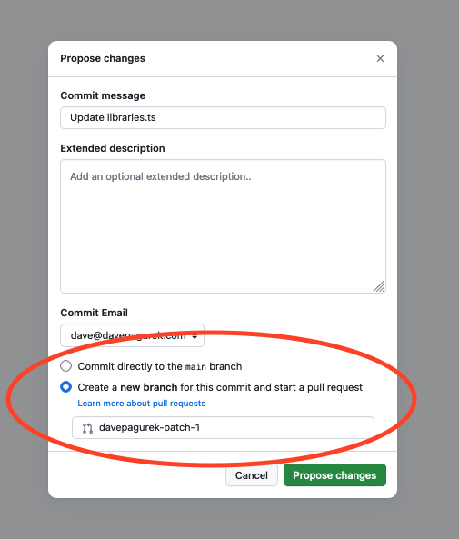

# p5.js Libraries

To add a new library:

1. <a href="https://github.com/bocoup/p5.js-website/edit/main/src/libraries/libraries.ts">Edit `libraries.ts`</a> to add your library to the list under whichever category feels most relevant. Each entry should include:
    - `name`: The name of the library
    - `description`: A one-sentence description of the library in the format `{ en: 'Your description here' }`. Feel free to add translations under the language keys `es`, `hi`, `ko`, or `zh-Hans` if you are able to.
    - `author`: Your name
    - (Optional) `authorLink`: A link to your website or social media
    - `source`: A link to the library's source code (e.g. its repo on GitHub or GitLab)
    - (Optional) `website`: A link to a website for the library
    - (Optional) `npm`: If applicable, the package name for the libarry on <a href="https://www.npmjs.com/">npm.</a> Either a string with the package name, or an object in the format `{ package: 'your-name-here', path: 'dist/library.js' }` if a specific file in the library should be used.
    - `img`: Info about the preview thumbnail for the library, in the format `{ file: 'library.jpg', alt: { en: 'alt text' } }`, with the name of the image and a short description of its contents for screen readers. Feel free to add translations of the description under other language keys if you are able to.
    - (Optional) `license`: A <a href="https://docs.npmjs.com/cli/v10/configuring-npm/package-json#license">string describing the software license of the library.</a> This may be omitted if your package is on npm and has license info there.

2. Click "Commit changes..." on GitHub in the top right of the edit screen.

3. Make sure **Create a new branch** is selected and click "Propose changes"
    

4. TODO add image upload info
